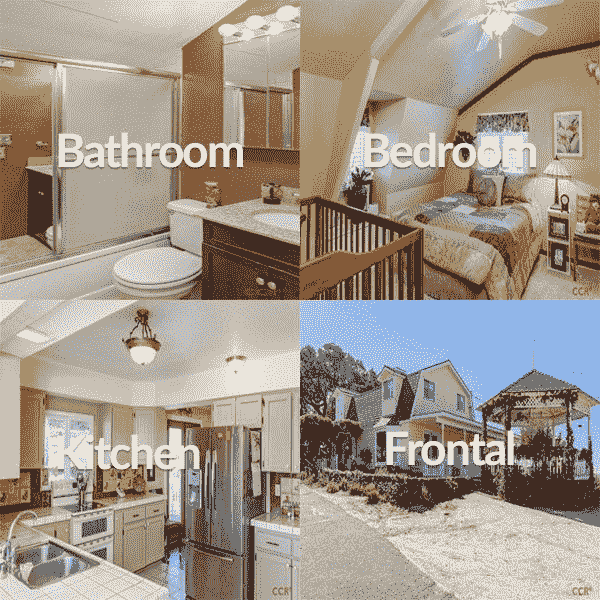
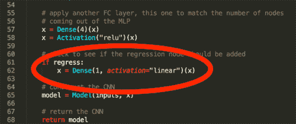

# Keras、回归和 CNN

> 原文：<https://pyimagesearch.com/2019/01/28/keras-regression-and-cnns/>

在本教程中，您将学习如何使用 Keras 训练卷积神经网络(CNN)进行回归预测。然后，您将训练 CNN 从一组图像中预测房价。

今天是我们关于 Keras 回归预测的三部分系列的第二部分:

*   **第一部分:** [带 Keras 的基本回归](https://pyimagesearch.com/2019/01/21/regression-with-keras/) —从分类和数字数据预测房价。
*   **第二部分:**用 Keras 和 CNN 回归——训练一个 CNN 从图像数据预测房价**(今日教程)**。
*   **第三部分:**将分类数据、数字数据和图像数据结合成一个单一的网络(下周的教程)。

今天的教程建立在上周的[基本 Keras 回归示例](https://pyimagesearch.com/2019/01/21/regression-with-keras/)的基础上，所以如果你还没有阅读它，请务必通读一遍，以便今天继续学习。

在本指南结束时，您不仅会对使用 Keras 训练 CNN 进行回归预测有很深的理解，而且还会有一个 Python 代码模板，您可以在自己的项目中遵循它。

**要了解如何使用 Keras 训练 CNN 进行回归预测，*继续阅读！***

## Keras、回归和 CNN

***2020-06-15 更新:**此博文现已兼容 TensorFlow 2+!*

在本教程的第一部分，我们将讨论我们的房价数据集，它不仅包含*数字/分类*数据，还包含*图像数据*。接下来，我们将简要回顾一下我们的项目结构。

然后，我们将创建两个 Python 助手函数:

1.  第一个将用于从磁盘加载我们的房价图像
2.  第二种方法将用于构建我们的 Keras CNN 架构

最后，我们将实现我们的训练脚本，然后为回归预测训练一个 Keras CNN。

我们还将回顾我们的结果，并建议进一步的方法来提高我们的预测准确性。

**我想再次重申，在继续之前，你应该阅读上周关于[基本回归预测](https://pyimagesearch.com/2019/01/21/regression-with-keras/)的教程——**我们不仅要构建上周的*概念*，还要构建源代码。

**正如你将在今天的剩余教程中发现的，用 CNN 和 Keras 执行回归很简单:**

1.  移除通常用于分类的全连接 softmax 分类器图层
2.  取而代之的是一个全连接层，该层具有一个单节点(T1)和一个线性激活函数(T3)。
3.  用*连续值预测损失函数*训练模型，如均方误差、平均绝对误差、平均绝对百分比误差等。

让我们开始吧！

### 预测房价…用图像？

我们在这一系列教程中使用的数据集是由 Ahmed 和 Moustafa 在他们 2016 年的论文中策划的， [*根据视觉和文本特征进行房价估计*](https://github.com/emanhamed/Houses-dataset) 。

据我所知，这是第一个公开可用的数据集，既包括**的数字/分类属性，也包括 ***的图像*** 。**

 ****数字和分类属性包括:**

1.  卧室数量
2.  浴室数量
3.  面积(即平方英尺)
4.  邮政区码

**还提供了每个房屋的四幅图像:**

1.  卧室
2.  浴室
3.  厨房
4.  房子的正面图

数据集中总共包括 535 所房屋，因此数据集中总共有 *535 x 4 = 2，140* 幅图像。

在数据清理期间，我们将把这个数字削减到 362 所房子(1，448 张图片)。

要下载房价数据集，你可以克隆 Ahmed 和 Moustafa 的 GitHub 库:

```py
$ cd ~
$ git clone https://github.com/emanhamed/Houses-dataset

```

这条命令将下载数字/分类数据以及图像本身。

记下您在磁盘上的何处下载了存储库(我将它放在我的主文件夹中)，因为在本教程的后面部分，您将需要通过[命令行参数](https://pyimagesearch.com/2018/03/12/python-argparse-command-line-arguments/)提供 repo 的路径。

**有关房价数据集的更多信息，请参考[上周的博文](https://pyimagesearch.com/2019/01/21/regression-with-keras/)。**

### 项目结构

让我们看看今天项目的结构:

```py
$ tree --dirsfirst
.
├── pyimagesearch
│   ├── __init__.py
│   ├── datasets.py
│   └── models.py
└── cnn_regression.py

1 directory, 4 files

```

我们*将用*附加的*功能来更新上周[教程](https://pyimagesearch.com/2019/01/21/regression-with-keras/)中的`datasets.py`和`models.py`。*

我们的训练脚本`cnn_regression.py`是本周全新的，它将利用前面提到的更新。

### 加载房价影像数据集

[](https://pyimagesearch.com/wp-content/uploads/2019/01/keras_regression_cnns_houses.jpg)

**Figure 2:** Our CNN accepts a single image — a montage of four images from the home. Using the montage, our CNN then uses regression to predict the value of the home with the Keras framework.

众所周知，我们的房价数据集包括与每栋房屋相关的四幅图像:

1.  卧室
2.  浴室
3.  厨房
4.  房子的正面图

但是我们如何利用这些图像来训练我们的 CNN 呢？

我们基本上有三种选择:

1.  通过 CNN 一次传递一张图片*，并使用房屋价格作为每张图片的目标值*
**   利用带有 Keras 的[多个输入，并有四个独立的类似 CNN 的分支，最终合并成一个输出](https://pyimagesearch.com/2018/06/04/keras-multiple-outputs-and-multiple-losses/)*   创建一个蒙太奇，将所有四个图像组合/平铺成一个图像，然后通过 CNN 传送该蒙太奇*

 ***第一个选项是一个糟糕的选择** —我们将有多个目标价格相同的图片。

如果有的话，我们只是要结束“混淆”我们的有线电视新闻网，使网络无法学习如何将价格与输入图像相关联。

**第二种选择也不是一个好主意**——用四个独立的张量作为输入，网络在计算上会很浪费，并且更难训练。然后，每个分支都将拥有自己的一组 CONV 图层，这些图层最终需要合并成一个输出。

**相反，我们应该选择第三个选项，我们*将*所有四个图像组合成一个*单一图像*，然后通过 CNN** 传递*该图像*(如上面的**图** **2** 所示)。

对于数据集中的每栋房屋，我们将创建一个相应的平铺图像，其中包括:

1.  *左上角*的*浴室*图像
2.  *右上角*的*卧室*图像
3.  *右下*中的*正视图*
4.  *左下方*的*厨房*

**然后这个平铺的图像将通过 CNN，使用房价作为目标预测值。**

这种方法的好处是我们:

1.  允许 CNN 从房子的所有照片中学习，而不是试图一次一张地通过 CNN 传递房子的照片
2.  使得 CNN 能够一次从所有房屋照片中学习区别滤波器(即，不会用具有相同目标预测值的不同图像“混淆”CNN)

为了了解如何为每栋房子平铺图像，让我们来看看`datasets.py`文件中的`load_house_images`函数:

```py
def load_house_images(df, inputPath):
	# initialize our images array (i.e., the house images themselves)
	images = []

	# loop over the indexes of the houses
	for i in df.index.values:
		# find the four images for the house and sort the file paths,
		# ensuring the four are always in the *same order*
		basePath = os.path.sep.join([inputPath, "{}_*".format(i + 1)])
		housePaths = sorted(list(glob.glob(basePath)))

```

`load_house_images`函数接受两个参数:

*   `df`:房屋数据框。
*   `inputPath`:我们的数据集路径。

使用这些参数，我们通过初始化一个`images`列表来继续，一旦被处理，该列表将被返回给调用函数。

从这里开始，我们在数据框中的索引上循环( **Line 64** )。在循环中，我们:

*   构建`basePath`到当前索引的四幅图像(**第 67 行**)。
*   使用`glob`抓取四个图像路径(**第 68 行**)。

`glob`函数使用带有通配符的输入路径，然后查找所有匹配我们模式的输入路径。

在下一个代码块中，我们将填充一个包含四幅图像的列表:

```py
		# initialize our list of input images along with the output image
		# after *combining* the four input images
		inputImages = []
		outputImage = np.zeros((64, 64, 3), dtype="uint8")

		# loop over the input house paths
		for housePath in housePaths:
			# load the input image, resize it to be 32 32, and then
			# update the list of input images
			image = cv2.imread(housePath)
			image = cv2.resize(image, (32, 32))
			inputImages.append(image)

```

继续循环，我们继续:

*   初始化我们的`inputImages`列表，并为我们的平铺图像`outputImage` ( **第 72 行和第 73 行**)分配内存。
*   在`housePaths` ( **第 76 行**)上创建一个嵌套循环来加载每个`image`，调整大小为 *32×32* ，并更新`inputImages`列表(**第 79-81 行**)。

从那里，我们将把四个图像拼接成一个蒙太奇，最终返回所有的蒙太奇:

```py
		# tile the four input images in the output image such the first
		# image goes in the top-right corner, the second image in the
		# top-left corner, the third image in the bottom-right corner,
		# and the final image in the bottom-left corner
		outputImage[0:32, 0:32] = inputImages[0]
		outputImage[0:32, 32:64] = inputImages[1]
		outputImage[32:64, 32:64] = inputImages[2]
		outputImage[32:64, 0:32] = inputImages[3]

		# add the tiled image to our set of images the network will be
		# trained on
		images.append(outputImage)

	# return our set of images
	return np.array(images)

```

为了结束循环，我们:

*   使用 NumPy 数组切片来平铺输入图像(**行 87-90** )。
*   更新`images`列表(**第 94 行**)。

一旦创建图块的过程完成，我们继续前进，将集合`images`返回给**行 97** 上的调用函数。

### 使用 Keras 实现用于回归的 CNN

[](https://pyimagesearch.com/wp-content/uploads/2019/01/keras_regression_cnns_head.png)

**Figure 3:** If we’re performing regression with a CNN, we’ll add a fully connected layer with linear activation.

让我们继续实现我们的 Keras CNN 进行回归预测。

打开`models.py`文件并插入以下代码:

```py
def create_cnn(width, height, depth, filters=(16, 32, 64), regress=False):
	# initialize the input shape and channel dimension, assuming
	# TensorFlow/channels-last ordering
	inputShape = (height, width, depth)
	chanDim = -1

```

我们的`create_cnn`函数将返回我们的 CNN 模型，我们将在我们的训练脚本中编译和训练该模型。

`create_cnn`函数接受五个参数:

*   `width`:输入图像的宽度，单位为像素。
*   `height`:输入图像有多少像素高。
*   `depth`:图像的通道数。对于 RGB 图像，它是三。
*   一组逐渐变大的过滤器，这样我们的网络可以学习更多有区别的特征。
*   `regress`:一个布尔值，表示是否将一个全连接的线性激活层附加到 CNN 用于回归目的。

我们网络的`inputShape`定义在**线 29** 上。它假设 TensorFlow 后端的“最后频道”排序。

让我们继续定义模型的输入，并开始创建我们的`CONV => RELU > BN => POOL`层集:

```py
	# define the model input
	inputs = Input(shape=inputShape)

	# loop over the number of filters
	for (i, f) in enumerate(filters):
		# if this is the first CONV layer then set the input
		# appropriately
		if i == 0:
			x = inputs

		# CONV => RELU => BN => POOL
		x = Conv2D(f, (3, 3), padding="same")(x)
		x = Activation("relu")(x)
		x = BatchNormalization(axis=chanDim)(x)
		x = MaxPooling2D(pool_size=(2, 2))(x)

```

我们的模型`inputs`定义在**线 33** 上。

从那里，在第 36 行的**上，我们循环过滤并创建一组`CONV => RELU > BN => POOL` 层。循环的每次迭代都会附加这些层。请务必查看第 11 章的 *Starter Bundle* 的*[Deep Learning for Computer Vision with Python](https://pyimagesearch.com/deep-learning-computer-vision-python-book/)*了解更多关于这些图层类型的信息。**

让我们完成 CNN 的建设:

```py
	# flatten the volume, then FC => RELU => BN => DROPOUT
	x = Flatten()(x)
	x = Dense(16)(x)
	x = Activation("relu")(x)
	x = BatchNormalization(axis=chanDim)(x)
	x = Dropout(0.5)(x)

	# apply another FC layer, this one to match the number of nodes
	# coming out of the MLP
	x = Dense(4)(x)
	x = Activation("relu")(x)

	# check to see if the regression node should be added
	if regress:
		x = Dense(1, activation="linear")(x)

	# construct the CNN
	model = Model(inputs, x)

	# return the CNN
	return model

```

我们`Flatten`下一层(**第 49 行**)，然后添加一个带有`BatchNormalization`和`Dropout` ( **第 50-53 行**)的全连接层。

应用另一个全连接层来匹配来自多层感知器的四个节点(**行 57 和 58** )。

在**行 61 和 62** 上，进行检查以查看是否应该附加回归节点；然后相应地添加它。

最后，这个模型是由我们的`inputs`和我们组装在一起的所有图层`x` ( **第 65 行**)构建而成的。

然后我们可以将`model`的`return`调用函数(**第 68 行**)。

### 实现回归训练脚本

现在，我们已经实现了数据集加载器实用函数以及 Keras CNN 回归，让我们继续创建训练脚本。

打开`cnn_regression.py`文件并插入以下代码:

```py
# import the necessary packages
from tensorflow.keras.optimizers import Adam
from sklearn.model_selection import train_test_split
from pyimagesearch import datasets
from pyimagesearch import models
import numpy as np
import argparse
import locale
import os

# construct the argument parser and parse the arguments
ap = argparse.ArgumentParser()
ap.add_argument("-d", "--dataset", type=str, required=True,
	help="path to input dataset of house images")
args = vars(ap.parse_args())

```

我们训练脚本的导入在**第 2-9 行**中处理。最值得注意的是，我们从`datasets`和`models`导入了我们的助手函数。`locale`计划将帮助我们格式化我们的货币。

在那里，我们使用 argparse : `--dataset`解析单个参数[。这个标志和参数本身允许我们指定从终端到数据集的路径，而无需修改脚本。](https://pyimagesearch.com/2018/03/12/python-argparse-command-line-arguments/)

现在让我们加载、预处理和分割我们的数据:

```py
# construct the path to the input .txt file that contains information
# on each house in the dataset and then load the dataset
print("[INFO] loading house attributes...")
inputPath = os.path.sep.join([args["dataset"], "HousesInfo.txt"])
df = datasets.load_house_attributes(inputPath)

# load the house images and then scale the pixel intensities to the
# range [0, 1]
print("[INFO] loading house images...")
images = datasets.load_house_images(df, args["dataset"])
images = images / 255.0

# partition the data into training and testing splits using 75% of
# the data for training and the remaining 25% for testing
split = train_test_split(df, images, test_size=0.25, random_state=42)
(trainAttrX, testAttrX, trainImagesX, testImagesX) = split

```

第 20 行**上的`inputPath`包含 CSV 文件的路径，该文件包含数字和分类属性以及每栋房屋的目标价格。**

我们的数据集是使用我们在上周的教程(**第 21 行**)中定义的`load_house_attributes`便利函数加载的。结果是一个 pandas 数据框`df`，包含数字/分类属性。

在本教程中没有使用实际的数字和分类属性，但是我们确实使用了数据框，以便使用我们在今天的博文中定义的便利函数加载第 26 行的**中的`images`。**

我们继续将图像的像素强度缩放到第 27 行**上的*【0，1】*范围。**

然后，我们的数据集训练和测试分割使用 scikit-learn 的便利的`train_test_split`函数(**第 31 行和第 32 行**)构建。

同样，我们今天不会使用数字/分类数据，只使用图像本身。本系列的第一部分(上周)和第三部分(下周)中使用了数字/分类数据。

现在，让我们调整定价数据并训练我们的模型:

```py
# find the largest house price in the training set and use it to
# scale our house prices to the range [0, 1] (will lead to better
# training and convergence)
maxPrice = trainAttrX["price"].max()
trainY = trainAttrX["price"] / maxPrice
testY = testAttrX["price"] / maxPrice

# create our Convolutional Neural Network and then compile the model
# using mean absolute percentage error as our loss, implying that we
# seek to minimize the absolute percentage difference between our
# price *predictions* and the *actual prices*
model = models.create_cnn(64, 64, 3, regress=True)
opt = Adam(lr=1e-3, decay=1e-3 / 200)
model.compile(loss="mean_absolute_percentage_error", optimizer=opt)

# train the model
print("[INFO] training model...")
model.fit(x=trainImagesX, y=trainY, 
    validation_data=(testImagesX, testY),
    epochs=200, batch_size=8)

```

这里我们有:

*   根据`maxPrice` ( **第 37-39 行**)将房价缩放至*【0，1】*区间。执行这种缩放将导致更好的训练和更快的收敛。
*   使用`Adam`优化器(**第 45-47 行**)创建并编译我们的模型。我们使用*平均绝对百分比误差*作为我们的损失函数，并且我们已经设置`regress=True`表示我们想要执行回归。
*   在培训过程中被踢出(**第 51-53 行**)。

现在让我们来评估结果！

```py
# make predictions on the testing data
print("[INFO] predicting house prices...")
preds = model.predict(testImagesX)

# compute the difference between the *predicted* house prices and the
# *actual* house prices, then compute the percentage difference and
# the absolute percentage difference
diff = preds.flatten() - testY
percentDiff = (diff / testY) * 100
absPercentDiff = np.abs(percentDiff)

# compute the mean and standard deviation of the absolute percentage
# difference
mean = np.mean(absPercentDiff)
std = np.std(absPercentDiff)

# finally, show some statistics on our model
locale.setlocale(locale.LC_ALL, "en_US.UTF-8")
print("[INFO] avg. house price: {}, std house price: {}".format(
	locale.currency(df["price"].mean(), grouping=True),
	locale.currency(df["price"].std(), grouping=True)))
print("[INFO] mean: {:.2f}%, std: {:.2f}%".format(mean, std))
```

为了使用回归评估基于图像数据的房价模型，我们:

*   对测试数据进行预测(**第 57 行**)。
*   计算绝对百分比差异(**第 62-64 行**)，并使用它来导出我们的最终指标(**第 68 和 69 行**)。
*   在我们的终端显示评估信息(**第 73-76 行**)。

那是一个包裹，但是…

不要被这个培训脚本的简洁所迷惑！

在引擎盖下有很多事情正在进行，我们的便利函数加载数据+创建 CNN 和调整所有神经元权重的训练过程。**要温习卷积神经网络，**请参考 **[*的 *Starter Bundle* 用 Python 进行计算机视觉深度学习*](https://pyimagesearch.com/deep-learning-computer-vision-python-book/)** 。

### 训练我们的回归 CNN

准备好训练你的 Keras CNN 进行回归预测了吗？

确保你有:

1.  根据上周的教程配置你的开发环境。
2.  使用本教程的 ***【下载】*** 部分下载源代码。
3.  使用*“用图像预测房价？”中的说明下载房价数据集*上一节。

从那里，打开一个终端并执行以下命令:

```py
$ python cnn_regression.py --dataset ~/Houses-dataset/Houses\ Dataset/
[INFO] loading house attributes...
[INFO] loading house images...
[INFO] training model...
Epoch 1/200
34/34 [==============================] - 0s 9ms/step - loss: 1839.4242 - val_loss: 342.6158
Epoch 2/200
34/34 [==============================] - 0s 4ms/step - loss: 1117.5648 - val_loss: 143.6833
Epoch 3/200
34/34 [==============================] - 0s 3ms/step - loss: 682.3041 - val_loss: 188.1647
Epoch 4/200
34/34 [==============================] - 0s 3ms/step - loss: 642.8157 - val_loss: 228.8398
Epoch 5/200
34/34 [==============================] - 0s 3ms/step - loss: 565.1772 - val_loss: 740.4736
Epoch 6/200
34/34 [==============================] - 0s 3ms/step - loss: 460.3651 - val_loss: 1478.7289
Epoch 7/200
34/34 [==============================] - 0s 3ms/step - loss: 365.0139 - val_loss: 1918.3398
Epoch 8/200
34/34 [==============================] - 0s 3ms/step - loss: 368.6264 - val_loss: 2303.6936
Epoch 9/200
34/34 [==============================] - 0s 4ms/step - loss: 377.3214 - val_loss: 1325.1755
Epoch 10/200
34/34 [==============================] - 0s 3ms/step - loss: 266.5995 - val_loss: 1188.1686
...
Epoch 195/200
34/34 [==============================] - 0s 4ms/step - loss: 35.3417 - val_loss: 107.2347
Epoch 196/200
34/34 [==============================] - 0s 3ms/step - loss: 37.4725 - val_loss: 74.4848
Epoch 197/200
34/34 [==============================] - 0s 3ms/step - loss: 38.4116 - val_loss: 102.9308
Epoch 198/200
34/34 [==============================] - 0s 3ms/step - loss: 39.8636 - val_loss: 61.7900
Epoch 199/200
34/34 [==============================] - 0s 3ms/step - loss: 41.9374 - val_loss: 71.8057
Epoch 200/200
34/34 [==============================] - 0s 4ms/step - loss: 40.5261 - val_loss: 67.6559
[INFO] predicting house prices...
[INFO] avg. house price: $533,388.27, std house price: $493,403.08
[INFO] mean: 67.66%, std: 78.06%

```

我们的平均绝对百分比误差开始非常高，在第一个十代中为 300-2000 %;然而，当培训结束时，我们的培训损失要低得多，只有 40%。

然而，问题是我们显然吃得太多了。

虽然我们的培训损失为 40%，但我们的验证损失为 **67.66%** ，这意味着，平均而言，我们的网络对房价的预测将会降低约 68%。

### 怎样才能提高自己的预测准确率？

总的来说，我们的 CNN 得到的平均绝对误差为 **67.66%** ，这意味着，平均而言，我们的 CNN 对房价的预测将会比**低 68%**。

这是一个相当糟糕的结果，因为我们对数字和分类数据进行简单的 MLP 训练得到的平均绝对误差为 T2 的 22.71%，比 T4 的 67.66%好得多。

**那么，这意味着什么呢？**

这是否意味着 CNN 不适合回归任务，我们不应该使用它们进行回归？

事实上，不——完全不是那个意思。

相反，这意味着房子的内部并不一定与房子的价格相关。

例如，让我们假设在加利福尼亚州贝弗利山有一个价值 10，000，000 美元的超豪华名人住宅。

现在，让我们把同样的家搬到森林公园，这是底特律最糟糕的 T2 地区之一。

在这个社区，平均房价是 13，000 美元——你认为那个内部装饰华丽的名人豪宅还会值 10，000，000 美元吗？

当然不是。

房子的价格不仅仅是室内装潢。我们还必须考虑当地房地产市场本身的因素。

影响房价的因素有很多，但总的来说，T2 最重要的因素之一是当地本身。

因此，我们的 CNN 在房屋图像上的表现不如简单的 MLP 在数字和分类属性上的表现，这并不奇怪。

但这确实提出了一个问题:

1.  是否有可能*将*我们的数字/分类数据与我们的图像数据结合起来，训练一个单一的端到端网络？
2.  如果是这样，我们的房价预测精度会提高吗？

下周我会回答这个问题，敬请关注。

## 摘要

在今天的教程中，您学习了如何使用 Keras 训练卷积神经网络(CNN)进行回归预测。

**实现用于回归预测的 CNN 很简单:**

1.  移除通常用于分类的全连接 softmax 分类器图层
2.  取而代之的是具有单个节点的全连接层以及线性激活函数。
3.  用均方误差、平均绝对误差、平均绝对百分比误差等连续值预测损失函数训练模型。

让这种方法如此强大的是，它意味着我们可以微调现有模型进行回归预测——只需移除旧的 FC + softmax 层，添加一个具有线性激活的单节点 FC 层，更新您的损失方法，然后开始训练！

如果你有兴趣了解更多关于迁移学习和预训练模型上的微调，请参考我的书， [*用 Python 进行计算机视觉的深度学习*](https://pyimagesearch.com/deep-learning-computer-vision-python-book/) ，我在其中详细讨论了迁移学习和微调。

在下周的教程中，我将向您展示如何使用 Keras 处理混合数据，包括将分类、数字和图像数据组合成一个*单一网络*。

**要下载这篇文章的源代码，并在下周文章发表时得到通知，*请务必在下面的表格中输入您的电子邮件地址！******