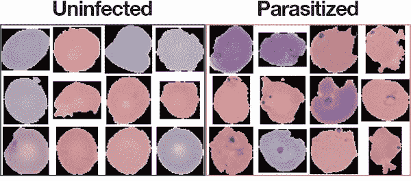
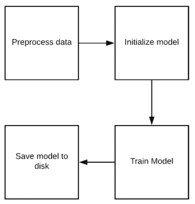
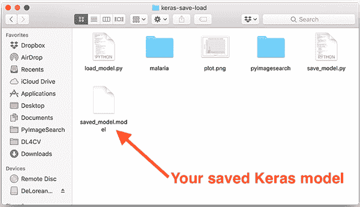
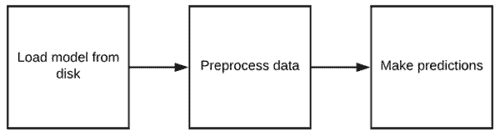
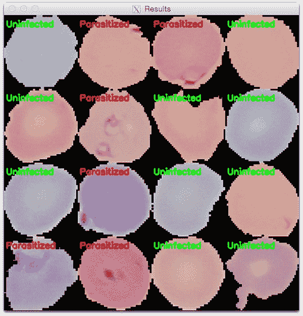

# Keras 保存并加载您的深度学习模型

> 原文：<https://pyimagesearch.com/2018/12/10/keras-save-and-load-your-deep-learning-models/>

[](https://pyimagesearch.com/wp-content/uploads/2018/12/keras_save_load_header.png)

在本教程中，您将学习如何保存和加载 Keras 深度学习模型。

这篇博客的灵感来自于 PyImageSearch 的读者梅森，他上周发邮件问:

> 阿德里安，我一直在看你的博客和你的深度学习教程。谢谢他们。
> 
> 但是我有一个问题:
> 
> 训练结束后，如何保存你的 Keras 模型？
> 
> 一旦你保存了它，你如何再次加载它，这样你就可以分类新的图像？
> 
> 我知道这是一个基本的问题，但我不知道如何保存和加载我的 Keras 模型。

梅森问了一个很好的问题— **实际上，这个问题并不像他(甚至你)认为的那样是一个“基本”的概念。**

从表面上看，保存 Keras 模型就像调用`model.save`和`load_model`函数一样简单。**但是实际上*要考虑的不仅仅是*的加载和保存模型功能！**

**什么是*更重要的*，并且有时被新的深度学习实践者忽略的，是*预处理阶段***——你用于训练和验证的预处理步骤必须*与加载你的模型和分类新图像时的训练步骤*相同。

**在今天剩余的课程中，我们将探索:**

1.  如何正确保存和加载你的 Keras 深度学习模型？
2.  加载模型后预处理图像的正确步骤。

**要了解如何用 Keras 保存和加载你的深度学习模型，*继续阅读！***

## keras–保存并加载您的深度学习模型

***2020-06-03 更新:**此博文现已兼容 TensorFlow 2+!*

在本教程的第一部分，我们将简要回顾(1)我们将在其上训练 Keras 模型的示例数据集，以及(2)我们的项目目录结构。在这里，我将向您展示如何:

1.  用 Keras 训练深度学习模型
2.  将 Keras 模型序列化并保存到磁盘
3.  从磁盘加载保存的 Keras 模型
4.  使用保存的 Keras 模型对新图像数据进行预测

让我们开始吧！

### 配置您的开发环境

要针对本教程配置您的系统，我首先建议您遵循以下任一教程:

*   [*如何在 Ubuntu 上安装 tensor flow 2.0*](https://pyimagesearch.com/2019/12/09/how-to-install-tensorflow-2-0-on-ubuntu/)
*   [*如何在 macOS 上安装 tensor flow 2.0*](https://pyimagesearch.com/2019/12/09/how-to-install-tensorflow-2-0-on-macos/)

这两个教程都将帮助您在一个方便的 Python 虚拟环境中，用这篇博文所需的所有软件来配置您的系统。

请注意 [PyImageSearch 不推荐也不支持 CV/DL 项目](https://pyimagesearch.com/faqs/single-faq/can-you-help-me-do-___-on-windows/)的窗口。

### 我们的示例数据集

[](https://pyimagesearch.com/wp-content/uploads/2018/12/dl_medical_imaging_malaria_dataset.jpg)

**Figure 1:** A subset of the [Malaria Dataset provided by the National Institute of Health](https://ceb.nlm.nih.gov/repositories/malaria-datasets/) (NIH). We will use this dataset to develop a deep learning medical imaging classification model saved to disk with Python, OpenCV, and Keras.

我们将在今天的教程中使用的数据集是我们在上周的 *[深度学习和 Keras](https://pyimagesearch.com/2018/12/03/deep-learning-and-medical-image-analysis-with-keras/)* 医学图像分析博文中涉及的疟疾检测和分类数据集的子集。

原始数据集由 27，588 幅图像组成，分为两类:

1.  **寄生:**暗示图像包含疟疾
2.  **未感染:**表示图像中没有疟疾的迹象

由于本教程的目标不是医学图像分析，而是如何保存和加载您的 Keras 模型，**我已经将数据集采样到 100 张图像。**

我减少了数据集的大小，主要是因为:

1.  您应该能够在您的 CPU 上运行这个示例(如果您不拥有/没有访问 GPU 的权限)。
2.  我们的目标是教授保存和加载 Keras 模型的基本概念，而不是训练一个最先进的疟疾检测器。
3.  正因为如此，最好使用较小的示例数据集

如果你想阅读我关于如何利用完整数据集构建(接近)最先进的疟疾分类器的完整博客文章，请务必参考[这篇博客文章](https://pyimagesearch.com/2018/12/03/deep-learning-and-medical-image-analysis-with-keras/)。

### 项目结构

一定要抓住今天的 ***【下载】*** 由精简的数据集、ResNet 模型和 Python 脚本组成。

解压缩文件后，您将看到以下目录结构:

```py
$ tree --filelimit 10 --dirsfirst
.
├── malaria
│   ├── testing
│   │   ├── Parasitized [50 entries]
│   │   └── Uninfected [50 entries]
│   ├── training
│   │   ├── Parasitized [175 entries]
│   │   └── Uninfected [185 entries]
│   └── validation
│       ├── Parasitized [18 entries]
│       └── Uninfected [22 entries]
├── pyimagesearch
│   ├── __init__.py
│   └── resnet.py
├── save_model.py
└── load_model.py

11 directories, 4 files

```

我们的项目由根目录中的两个文件夹组成:

*   我们精简的疟疾数据集。它通过上周的“构建数据集”脚本被组织成训练集、验证集和测试集。
*   `pyimagesearch/`:下载包中包含的一个包，其中包含了我们的 ResNet 模型类。

今天，我们还将回顾两个 Python 脚本:

*   一个演示脚本，它将在我们的 Keras 模型被训练后保存到磁盘上。
*   `load_model.py`:我们的脚本从磁盘加载保存的模型，并对一小部分测试图像进行分类。

通过查看这些文件，你会很快看到 Keras 使保存和加载深度学习模型文件变得多么容易。

### 使用 Keras 和 TensorFlow 保存模型

[](https://pyimagesearch.com/wp-content/uploads/2018/12/keras_save_load_diagram01.png)

**Figure 2:** The steps for training and saving a Keras deep learning model to disk.

在从磁盘加载 Keras 模型之前，我们首先需要:

1.  训练 Keras 模型
2.  保存 Keras 模型

我们将要回顾的脚本将涵盖这两个概念。

请打开您的`save_model.py`文件，让我们开始吧:

```py
# set the matplotlib backend so figures can be saved in the background
import matplotlib
matplotlib.use("Agg")

# import the necessary packages
from tensorflow.keras.preprocessing.image import ImageDataGenerator
from tensorflow.keras.optimizers import SGD
from pyimagesearch.resnet import ResNet
from sklearn.metrics import classification_report
from imutils import paths
import matplotlib.pyplot as plt
import numpy as np
import argparse
import os

```

我们从第 2-14 行开始，导入所需的包。

在第 3 行的**上，指定了`"Agg"` matplotlib 后端，因为我们将把我们的绘图保存到磁盘上(除了我们的模型之外)。**

我们的`ResNet` CNN 是在**8 号线**导入的。为了使用这个 CNN，一定要抢今天博文的 ***【下载】*** 。

使用`argparse`导入，让[解析我们的命令行参数](https://pyimagesearch.com/2018/03/12/python-argparse-command-line-arguments/):

```py
# construct the argument parser and parse the arguments
ap = argparse.ArgumentParser()
ap.add_argument("-d", "--dataset", type=str, required=True,
	help="path dataset of input images")
ap.add_argument("-m", "--model", type=str, required=True,
	help="path to trained model")
ap.add_argument("-p", "--plot", type=str, default="plot.png",
	help="path to output loss/accuracy plot")
args = vars(ap.parse_args())

```

我们的脚本要求在终端中为命令字符串提供三个参数:

*   `--dataset`:我们数据集的路径。我们正在使用上周在 T2 建立的疟疾数据集的子集。
*   `--model`:您需要指定训练输出模型的路径(即 Keras 模型将要保存的位置)。*这是我们今天所讲内容的关键。*
*   `--plot`:训练地块的路径。默认情况下，该图形将被命名为`plot.png`。

这些代码行不需要修改。同样，您需要在终端中输入参数的值，让`argparse`完成剩下的工作。如果你不熟悉命令行参数的概念，[请看这篇文章](https://pyimagesearch.com/2018/03/12/python-argparse-command-line-arguments/)。

让我们初始化我们的训练变量和路径:

```py
# initialize the number of training epochs and batch size
NUM_EPOCHS = 25
BS = 32

# derive the path to the directories containing the training,
# validation, and testing splits, respectively
TRAIN_PATH = os.path.sep.join([args["dataset"], "training"])
VAL_PATH = os.path.sep.join([args["dataset"], "validation"])
TEST_PATH = os.path.sep.join([args["dataset"], "testing"])

# determine the total number of image paths in training, validation,
# and testing directories
totalTrain = len(list(paths.list_images(TRAIN_PATH)))
totalVal = len(list(paths.list_images(VAL_PATH)))
totalTest = len(list(paths.list_images(TEST_PATH)))

```

我们将以`32`的批量训练`25`个时期。

上周，我们将 NIH 疟疾数据集分为三组，并为每组创建了相应的目录:

*   培养
*   确认
*   测试

如果你想知道数据分割过程是如何工作的，一定要回顾一下教程中的`build_dataset.py`脚本[。今天，我已经将得到的数据集进行了分割(并且为了这篇博文的目的，已经变得非常小)。](https://pyimagesearch.com/2018/12/03/deep-learning-and-medical-image-analysis-with-keras/)

图像路径建立在**行 32-34** 上，每次分割的图像数量在**行 38-40** 上抓取。

让我们初始化我们的数据扩充对象:

```py
# initialize the training training data augmentation object
trainAug = ImageDataGenerator(
	rescale=1 / 255.0,
	rotation_range=20,
	zoom_range=0.05,
	width_shift_range=0.05,
	height_shift_range=0.05,
	shear_range=0.05,
	horizontal_flip=True,
	fill_mode="nearest")

# initialize the validation (and testing) data augmentation object
valAug = ImageDataGenerator(rescale=1 / 255.0)

```

数据扩充是通过随机修改从数据集生成新图像的过程。它产生了一个更好的深度学习模型，我几乎总是推荐它(这对小数据集尤其重要)。

数据增强在我的 [*Keras 教程*](https://pyimagesearch.com/2018/09/10/keras-tutorial-how-to-get-started-with-keras-deep-learning-and-python/) 博文中有简要介绍。要全面了解数据增强，请务必阅读我的深度学习书籍， **[*用 Python 进行计算机视觉的深度学习*](https://pyimagesearch.com/deep-learning-computer-vision-python-book/)** 。

***注意:****`valAug`对象只是执行缩放——实际上没有执行任何放大。我们将使用这个对象两次:一次用于验证重缩放，一次用于测试重缩放。*

既然已经创建了训练和验证增强对象，让我们初始化生成器:

```py
# initialize the training generator
trainGen = trainAug.flow_from_directory(
	TRAIN_PATH,
	class_mode="categorical",
	target_size=(64, 64),
	color_mode="rgb",
	shuffle=True,
	batch_size=32)

# initialize the validation generator
valGen = valAug.flow_from_directory(
	VAL_PATH,
	class_mode="categorical",
	target_size=(64, 64),
	color_mode="rgb",
	shuffle=False,
	batch_size=BS)

# initialize the testing generator
testGen = valAug.flow_from_directory(
	TEST_PATH,
	class_mode="categorical",
	target_size=(64, 64),
	color_mode="rgb",
	shuffle=False,
	batch_size=BS)

```

上面的三个生成器实际上根据我们的增强对象和这里给出的参数在训练/验证/测试期间按需产生图像。

现在我们将构建、编译和训练我们的模型。我们还将评估我们的模型并打印一份分类报告:

```py
# initialize our Keras implementation of ResNet model and compile it
model = ResNet.build(64, 64, 3, 2, (2, 2, 3),
	(32, 64, 128, 256), reg=0.0005)
opt = SGD(lr=1e-1, momentum=0.9, decay=1e-1 / NUM_EPOCHS)
model.compile(loss="binary_crossentropy", optimizer=opt,
	metrics=["accuracy"])

# train our Keras model
H = model.fit(
	x=trainGen,
	steps_per_epoch=totalTrain // BS,
	validation_data=valGen,
	validation_steps=totalVal // BS,
	epochs=NUM_EPOCHS)

# reset the testing generator and then use our trained model to
# make predictions on the data
print("[INFO] evaluating network...")
testGen.reset()
predIdxs = model.predict(x=testGen, steps=(totalTest // BS) + 1)

# for each image in the testing set we need to find the index of the
# label with corresponding largest predicted probability
predIdxs = np.argmax(predIdxs, axis=1)

# show a nicely formatted classification report
print(classification_report(testGen.classes, predIdxs,
	target_names=testGen.class_indices.keys()))

```

***2020-06-03 更新:**以前，TensorFlow/Keras 需要使用一种叫做`.fit_generator`的方法来完成数据扩充。现在，`.fit`方法也可以处理数据扩充，使代码更加一致。这也适用于从`.predict_generator`到`.predict`的迁移。请务必查看我关于 [fit 和 fit 生成器](https://pyimagesearch.com/2018/12/24/how-to-use-keras-fit-and-fit_generator-a-hands-on-tutorial/)以及[数据扩充](https://pyimagesearch.com/2019/07/08/keras-imagedatagenerator-and-data-augmentation/)的文章。*

在上面的代码块中，我们:

*   初始化我们在**第 84-88 行**上`ResNet`的实现(来自 [*用 Python 进行计算机视觉的深度学习*](https://pyimagesearch.com/deep-learning-computer-vision-python-book/) )。注意我们是如何指定`"binary_crossentropy"`的，因为我们的模型有两个类。如果你正在使用> 2 类，你应该把它改成`"categorical_crossentropy"`。
*   在扩充的疟疾数据集上训练 ResNet`model`(**第 91-96 行**)。
*   对测试集进行预测(**行 102** )，并提取每个预测的最高概率等级指数(**行 106** )。
*   在我们的终端显示一个`classification_report`(**行 109-110** )。

现在我们的模型已经训练好了，让我们**将我们的 Keras 模型保存到磁盘:**

```py
# save the network to disk
print("[INFO] serializing network to '{}'...".format(args["model"]))
model.save(args["model"], save_format="h5")

```

为了将我们的 Keras 模型保存到磁盘，我们只需调用`model` ( **第 114 行**)上的`.save`。

***2020-06-03 更新:**注意，对于 TensorFlow 2.0+我们建议明确设置`save_format="h5"` (HDF5 格式)。*

简单吧？

是的，这是一个简单的函数调用，但之前的辛勤工作使这一过程成为可能。

在我们的下一个脚本中，我们将能够从磁盘加载模型并进行预测。

让我们绘制训练结果并保存训练图:

```py
# plot the training loss and accuracy
N = NUM_EPOCHS
plt.style.use("ggplot")
plt.figure()
plt.plot(np.arange(0, N), H.history["loss"], label="train_loss")
plt.plot(np.arange(0, N), H.history["val_loss"], label="val_loss")
plt.plot(np.arange(0, N), H.history["accuracy"], label="train_acc")
plt.plot(np.arange(0, N), H.history["val_accuracy"], label="val_acc")
plt.title("Training Loss and Accuracy on Dataset")
plt.xlabel("Epoch #")
plt.ylabel("Loss/Accuracy")
plt.legend(loc="lower left")
plt.savefig(args["plot"])

```

***2020-06-03 更新:**为了使该绘图片段与 TensorFlow 2+兼容，更新了`H.history`字典键，以完全拼出“精度”而没有“acc”(即`H.history["val_accuracy"]`和`H.history["accuracy"]`)。“val”没有拼成“validation”，这有点令人困惑；我们必须学会热爱 API 并与之共存，并永远记住这是一项正在进行的工作，世界各地的许多开发人员都为此做出了贡献。*

至此，我们的脚本完成了。让我们继续训练我们的 Keras 模型吧！

* * *

为了在我们的示例数据集上训练您的 Keras 模型，请确保您使用了博文的 ***【下载】*** 部分来下载源代码和图像本身。

从那里，打开一个终端并执行以下命令:

```py
$ python save_model.py --dataset malaria --model saved_model.model
Found 360 images belonging to 2 classes.
Found 40 images belonging to 2 classes.
Found 100 images belonging to 2 classes.
Epoch 1/25
11/11 [==============================] - 10s 880ms/step - loss: 0.9204 - accuracy: 0.5686 - val_loss: 7.0116 - val_accuracy: 0.5625
Epoch 2/25
11/11 [==============================] - 7s 624ms/step - loss: 0.8821 - accuracy: 0.5899 - val_loss: 1.4123 - val_accuracy: 0.4375
Epoch 3/25
11/11 [==============================] - 7s 624ms/step - loss: 0.9426 - accuracy: 0.5878 - val_loss: 0.8156 - val_accuracy: 0.6562
...
Epoch 23/25
11/11 [==============================] - 7s 664ms/step - loss: 0.3372 - accuracy: 0.9659 - val_loss: 0.2396 - val_accuracy: 0.9688
Epoch 24/25
11/11 [==============================] - 7s 622ms/step - loss: 0.3035 - accuracy: 0.9514 - val_loss: 0.3389 - val_accuracy: 0.9375
Epoch 25/25
11/11 [==============================] - 7s 624ms/step - loss: 0.2934 - accuracy: 0.9543 - val_loss: 0.2876 - val_accuracy: 0.9375
[INFO] evaluating network...
              precision    recall  f1-score   support

 Parasitized       0.98      1.00      0.99        50
  Uninfected       1.00      0.98      0.99        50

    accuracy                           0.99       100
   macro avg       0.99      0.99      0.99       100
weighted avg       0.99      0.99      0.99       100

[INFO] serializing network to 'saved_model.model'...

```

请注意命令行参数。我已经指定了疟疾数据集目录的路径(`--dataset malaria`)和目标模型的路径(`--model saved_model.model`)。这些命令行参数是该脚本运行的关键。你可以给你的模型起任何你喜欢的名字*，而不用修改一行代码！*

这里你可以看到我们的模型在测试集上获得了 **~99%的准确率**。

在我的 CPU 上，每个时期占用了 **~7 秒**。在我的 GPU 上，每个纪元需要 **~1 秒**。请记住，训练比上周更快，因为由于我减少了今天的数据集，我们在每个时期通过网络推送的数据更少。

培训后，您可以列出目录的内容，并查看保存的 Keras 模型:

```py
$ ls -l
total 5216
-rw-r--r--@ 1 adrian  staff     2415 Nov 28 10:09 load_model.py
drwxr-xr-x@ 5 adrian  staff      160 Nov 28 08:12 malaria
-rw-r--r--@ 1 adrian  staff    38345 Nov 28 10:13 plot.png
drwxr-xr-x@ 6 adrian  staff      192 Nov 28 08:12 pyimagesearch
-rw-r--r--@ 1 adrian  staff     4114 Nov 28 10:09 save_model.py
-rw-r--r--@ 1 adrian  staff  2614136 Nov 28 10:13 saved_model.model

```

[](https://pyimagesearch.com/wp-content/uploads/2018/12/keras_save_load_model.png)

**Figure 3:** Our Keras model is now residing on disk. Saving Keras models is quite easy via the Keras API.

`saved_model.model`文件是您实际保存的 Keras 模型。

在下一节中，您将学习如何从磁盘加载保存的 Keras 模型。

### 使用 Keras 和 TensorFlow 加载模型

[](https://pyimagesearch.com/wp-content/uploads/2018/12/keras_save_load_diagram02.png)

**Figure 4:** The process of loading a Keras model from disk and putting it to use to make predictions. Don’t forget to preprocess your data in the same manner as during training!

既然我们已经学会了如何将 Keras 模型保存到磁盘，下一步就是加载 Keras 模型，这样我们就可以用它来进行分类。打开您的`load_model.py`脚本，让我们开始吧:

```py
# import the necessary packages
from tensorflow.keras.preprocessing.image import img_to_array
from tensorflow.keras.models import load_model
from imutils import build_montages
from imutils import paths
import numpy as np
import argparse
import random
import cv2

# construct the argument parser and parse the arguments
ap = argparse.ArgumentParser()
ap.add_argument("-i", "--images", required=True,
	help="path to out input directory of images")
ap.add_argument("-m", "--model", required=True,
	help="path to pre-trained model")
args = vars(ap.parse_args())

```

我们在**2-10 号线**进口我们需要的包装。最值得注意的是，我们需要`load_model`来从磁盘加载我们的模型并投入使用。

我们的两个命令行参数在第 12-17 行上解析:

*   `--images`:我们想用来做预测的图像的路径。
*   `--model`:我们之前刚刚保存的模型的路径。

同样，这些线不需要改变。当您在终端中输入命令时，您将为`--images`和`--model`提供值。

**下一步是从磁盘加载我们的 Keras 模型:**

```py
# load the pre-trained network
print("[INFO] loading pre-trained network...")
model = load_model(args["model"])

```

在**第 21 行**，为了加载我们的 Keras `model`，我们调用`load_model`，提供模型本身的路径(包含在我们解析的`args`字典中)。

给定`model`，我们现在可以用它进行预测。但是首先我们需要一些图片和一个地方来放置我们的结果:

```py
# grab all image paths in the input directory and randomly sample them
imagePaths = list(paths.list_images(args["images"]))
random.shuffle(imagePaths)
imagePaths = imagePaths[:16]

# initialize our list of results
results = []

```

在**第 24-26 行**，我们随机选择测试图像路径。

第 29 行初始化一个空列表来保存`results`。

让我们循环一遍我们的每个`imagePaths`:

```py
# loop over our sampled image paths
for p in imagePaths:
	# load our original input image
	orig = cv2.imread(p)

	# pre-process our image by converting it from BGR to RGB channel
	# ordering (since our Keras mdoel was trained on RGB ordering),
	# resize it to 64x64 pixels, and then scale the pixel intensities
	# to the range [0, 1]
	image = cv2.cvtColor(orig, cv2.COLOR_BGR2RGB)
	image = cv2.resize(image, (64, 64))
	image = image.astype("float") / 255.0

```

在第 32 行的**上，我们开始循环我们的`imagePaths`。**

我们从从磁盘加载我们的图像(**第 34 行**)并预处理它(**第 40-42 行**)开始循环。这些预处理步骤应该与我们的训练脚本中的 ***相同*** 。正如你所看到的，我们已经将图像从 BGR 转换为 RGB 通道排序，调整为 64×64 像素，并缩放到范围*【0，1】*。

**我看到新的深度学习实践者犯的一个*常见错误*是*未能以与训练图像相同的方式预处理新图像*。**

继续，让我们对循环的每次迭代进行预测:

```py
	# order channel dimensions (channels-first or channels-last)
	# depending on our Keras backend, then add a batch dimension to
	# the image
	image = img_to_array(image)
	image = np.expand_dims(image, axis=0)

	# make predictions on the input image
	pred = model.predict(image)
	pred = pred.argmax(axis=1)[0]

	# an index of zero is the 'parasitized' label while an index of
	# one is the 'uninfected' label
	label = "Parasitized" if pred == 0 else "Uninfected"
	color = (0, 0, 255) if pred == 0 else (0, 255, 0)

	# resize our original input (so we can better visualize it) and
	# then draw the label on the image
	orig = cv2.resize(orig, (128, 128))
	cv2.putText(orig, label, (3, 20), cv2.FONT_HERSHEY_SIMPLEX, 0.5,
		color, 2)

	# add the output image to our list of results
	results.append(orig)

```

在这一部分中，我们:

*   处理渠道订购(**行 47** )。TensorFlow 后端默认为`"channels_first"`，但是不要忘记 Keras 也支持其他后端。
*   通过向卷添加一个维度来创建一个要通过网络发送的批处理( **Line 48** )。我们只是一次通过网络发送一幅图像，但是额外的维度是至关重要的。
*   将图像通过 ResNet `model` ( **第 51 行**)，获得一个预测。我们在**行 52** 上取最大预测值的索引(或者是`"Parasitized"`或者是`"Uninfected"`)。
*   然后我们创建一个彩色标签，并在原始图像上绘制它(**第 56-63 行**)。
*   最后，我们将带注释的`orig`图像添加到`results`中。

为了可视化我们的结果，让我们创建一个蒙太奇，并显示在屏幕上:

```py
# create a montage using 128x128 "tiles" with 4 rows and 4 columns
montage = build_montages(results, (128, 128), (4, 4))[0]

# show the output montage
cv2.imshow("Results", montage)
cv2.waitKey(0)

```

一个`montage`的成果建立在**线 69** 上。我们的`montage`是一个 4×4 的图像网格，以容纳我们之前获取的 16 个随机测试图像。在我的博客文章 [*用 OpenCV*](https://pyimagesearch.com/2017/05/29/montages-with-opencv/) 蒙太奇中了解这个函数是如何工作的。

将显示`montage`，直到按下任何键(**行 72 和 73** )。

* * *

要查看我们的脚本，请确保使用教程的 ***“下载”*** 部分下载源代码和图像数据集。

从那里，打开一个终端并执行以下命令:

```py
$ python load_model.py --images malaria/testing --model saved_model.model
Using TensorFlow backend.
[INFO] loading pre-trained network...

```

[](https://pyimagesearch.com/wp-content/uploads/2018/12/keras_save_load_results.jpg)

**Figure 5:** A montage of cells either “Parasitized” or “Uninfected” with Malaria. In today’s blog post we saved a ResNet deep learning model to disk and then loaded it with a separate script to make these predictions.

在这里，您可以看到我们有:

1.  通过命令行参数提供我们的测试图像(`--images malaria/testing`)以及已经驻留在磁盘上的模型(`--model saved_model.model`)的路径
2.  从磁盘加载我们的 Keras 模型
3.  预处理我们的输入图像
4.  对每个示例图像进行分类
5.  构建了我们分类的输出可视化(**图 5** )

这个过程之所以成为可能，是因为我们能够在训练脚本中从磁盘保存我们的 Keras 模型，然后在一个单独的脚本中从磁盘加载 Keras 模型。

## 摘要

**在今天的教程中，您学习了:**

1.  如何在数据集上训练 Keras 模型
2.  如何将 Keras 模型序列化并保存到磁盘
3.  如何从单独的 Python 脚本加载保存的 Keras 模型
4.  如何使用载入的 Keras 模型对新的输入图像进行分类

在训练、保存和加载您自己的 Keras 模型时，您可以使用今天教程中介绍的 Python 脚本作为模板。

我希望你喜欢今天的博文！

**要下载今天教程的源代码，并在未来的博客文章在 PyImageSearch 上发表时得到通知，*只需在下面的表格中输入您的电子邮件地址！***