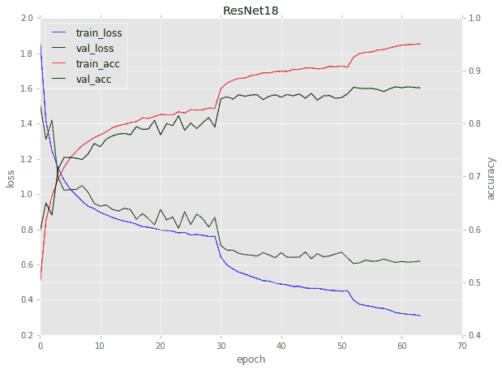

# Keras:开始、停止和恢复训练

> 原文：<https://pyimagesearch.com/2019/09/23/keras-starting-stopping-and-resuming-training/>

[](https://pyimagesearch.com/wp-content/uploads/2019/09/keras_start_stop_resume_header.jpg)

在本教程中，您将学习如何使用 Keras 来训练神经网络，停止训练，更新您的学习率，然后使用新的学习率从您停止的地方继续训练。使用这种方法，您可以提高精确度，同时减少模型损失。

今天的教程是受我从张敏的 PyImageSearch 读者那里收到的一个问题的启发。

张敏写道:

> 嗨，阿德里安，感谢你的图片搜索博客。我有两个问题:
> 
> 首先，我正在进行我的毕业设计，我的大学允许我在他们的 GPU 机器上共享时间。问题是，我只能以两个小时为增量访问 GPU 机器——在我的两个小时结束后，我会自动从 GPU 启动。如何保存我的训练进度，安全地停止训练，然后从我停止的地方继续训练？
> 
> 其次，我最初的实验并不顺利。我的模型很快跳到 80%以上的准确率，但之后又停留了 50 个纪元。**我还能做些什么来提高我的模型准确性？**我的导师说我应该考虑调整学习率，但我不确定该怎么做。
> 
> 谢谢艾利安。

学习如何开始、停止和恢复训练深度学习模型是一项需要掌握的*超级重要的*技能——在你深度学习从业者职业生涯的某个时候，你会遇到类似张敏的情况:

*   您在 GPU 实例上的时间有限(这可能发生在 Google Colab 或使用 Amazon EC2 的更便宜的 spot 实例时)。
*   您的 SSH 连接中断，并且您忘记使用终端多路复用器来保存您的会话(例如`screen`或`tmux`)。
*   你的深度学习平台会锁定并强制关闭。

想象一下，花整整一周的时间来训练一个最先进的深度神经网络… *结果你的模型却因为断电而丢失了！*

幸运的是，有一个解决方案，但是当这些情况发生时，你需要知道如何:

1.  获取在培训期间保存/序列化到磁盘的快照模型。
2.  将模型加载到内存中。
3.  从你停止的地方继续训练。

**其次，开始、停止、恢复训练是*手动调整学习率时的标准做法*:**

1.  开始训练您的模型，直到损失/准确性达到稳定水平
2.  每隔 *N* 个时期(通常是 *N={1，5，10}* )给你的模型拍快照
3.  停止训练，通常通过`ctrl + c`强制退出
4.  打开你的代码编辑器，调整你的学习速度(通常降低一个数量级)
5.  回到您的终端，重新启动训练脚本，从最后一个
    模型权重快照开始

使用这种`ctrl + c`训练方法，你可以提高你的模型准确性，同时降低损失，得到更准确的模型。

调整学习速率的能力是任何一个深度学习实践者都需要掌握的关键技能，所以现在就花时间去学习和练习吧！

**学习如何开始、停止和恢复 Keras 训练，*继续阅读！***

## Keras:开始、停止和恢复训练

***2020-06-05 更新:**此博文现已兼容 TensorFlow 2+!*

在这篇博文的第一部分，我们将讨论为什么我们想要开始、停止和恢复深度学习模型的训练。

我们还将讨论停止训练以降低你的学习率如何能够提高你的模型准确性(以及为什么学习率计划/衰减可能是不够的)。

在这里，我们将实现一个 Python 脚本来处理 Keras 的启动、停止和恢复训练。

然后，我将向您介绍整个培训过程，包括:

1.  开始初始培训脚本
2.  监控损失/准确性
3.  注意损失/准确性何时趋于平稳
4.  停止训练
5.  降低你的学习速度
6.  用新的、降低的学习率从你停止的地方继续训练

使用这种训练方法，您通常能够提高模型的准确性。

让我们开始吧！

### 为什么我们需要开始、停止和恢复训练？

您可能需要开始、停止和恢复深度学习模型的训练有许多原因，但两个主要原因包括:

1.  **您的训练课程被终止，训练停止**(由于停电、GPU 课程超时等原因。).
2.  **需要调整你的学习率来提高模型精度**(通常通过降低学习率一个数量级)。

第二点尤其重要——如果你回过头去阅读开创性的 AlexNet、SqueezeNet、ResNet 等。你会发现论文的作者都说了一些类似的话:

> 我们开始用 SGD 优化器训练我们的模型，初始学习率为 1e-1。我们分别在第 30 和第 50 个时期将学习速度降低了一个数量级。

为什么下降学习率如此重要？它如何能导致一个更精确的模型？

为了探究这个问题，看一下下面在 CIFAR-10 数据集上训练的 ResNet-18 的图:

[](https://pyimagesearch.com/wp-content/uploads/2019/09/keras_start_stop_resume_resnet_cifar10.png)

**Figure 1:** Training ResNet-18 on the CIFAR-10 dataset. The characteristic drops in loss and increases in accuracy are evident of learning rate changes. Here, (1) training was stopped on epochs 30 and 50, (2) the learning rate was lowered, and (3) training was resumed. ([image source](https://github.com/raghakot/keras-resnet))

请注意，对于时段 1-29，在训练网络时会遇到一条相当“标准”的曲线:

1.  损失开始时非常高，但随后迅速下降
2.  准确度开始时非常低，但随后迅速上升
3.  最终损失和准确性趋于平稳

但是在第 30 纪元前后发生了什么呢？

为什么亏损下降得这么厉害？为什么准确度会提高这么多？

**出现这种行为的原因是因为:**

1.  训练被**停止**
2.  学习率**降低了一个数量级**
3.  然后训练**恢复**

同样的情况也发生在第 50 纪元——再次，训练停止，学习率降低，然后训练重新开始。

每次我们都会遇到一个典型的损失下降，然后精度略有增加。

随着学习率*变小*，学习率降低的影响*越来越小*的影响。

**最终，我们遇到了两个问题:**

1.  学习率变得非常小，这又使得权重更新非常小，因此模型不能取得任何有意义的进展。
2.  由于学习率低，我们开始过度适应。该模型下降到损失范围中的较低损失区域，过度适合训练数据，而不能推广到验证数据。

在上面图 1 中的**时期 50 之后，过拟合行为是明显的。**

注意验证损失是如何稳定下来的，甚至开始有所上升。与此同时，培训损失持续下降，这是过度适应的明显迹象。

降低你的学习率是在训练期间提高你的模型的准确性的一个很好的方法，只要意识到存在(1)一个收益递减点，以及(2)如果训练没有得到适当的监控，有可能过度拟合。

### 为什么不使用学习率调度器或衰减？

[](https://pyimagesearch.com/wp-content/uploads/2019/07/keras_learning_rates_header.png)

**Figure 2:** Learning rate schedulers are great for some training applications; however, starting/stopping Keras training typically leads to more control over your deep learning model.

你可能想知道*“为什么不使用一个学习率计划程序？”*

我们可以使用许多学习率计划程序，包括:

*   [线性和多项式衰减](https://pyimagesearch.com/2019/07/22/keras-learning-rate-schedules-and-decay/)
*   [周期学习率](https://pyimagesearch.com/2019/07/29/cyclical-learning-rates-with-keras-and-deep-learning/) (CLRs)
*   Keras’ `ReduceLROnPlateau` class

**如果目标是通过降低学习率来提高模型的准确性，*那么为什么不仅仅依靠那些各自的时间表和课程呢？***

问得好。

***问题*是你可能没有好主意:**

*   要训练的大概历元数
*   什么是合适的初始学习率
*   clr 使用什么学习率范围

此外，使用我所谓的`ctrl + c`培训的一个好处是**它给你*对你的模型更精细的控制*。**

能够在特定的时间手动停止你的训练，调整你的学习率，然后从你停止的地方继续训练(用新的学习率)，这是大多数学习率计划者不允许你做的。

一旦你用`ctrl + c`训练进行了一些实验，你就会对你的超参数应该是什么有一个好主意——当这发生时，*然后*你开始结合硬编码的学习率时间表来进一步提高你的准确性。

**最后，请记住，几乎所有在 ImageNet 上接受培训的 CNN 开创性论文都使用了一种方法来开始/停止/恢复培训。**

仅仅因为其他方法*存在*并不能使它们天生*更好*——作为深度学习实践者，你需要学习如何使用`ctrl + c`训练以及学习速率调度(不要严格依赖后者)。

如果你有兴趣了解更多关于`ctrl + c`训练的信息，以及我在训练你自己的模型时的技巧、建议和最佳实践，一定要参考我的书， *[用 Python 进行计算机视觉的深度学习](https://pyimagesearch.com/deep-learning-computer-vision-python-book/)* 。

### 配置您的开发环境

要针对本教程配置您的系统，我首先建议您遵循以下任一教程:

*   [*如何在 Ubuntu 上安装 tensor flow 2.0*](https://pyimagesearch.com/2019/12/09/how-to-install-tensorflow-2-0-on-ubuntu/)
*   *[如何在 macOS 上安装 tensor flow 2.0](https://pyimagesearch.com/2019/12/09/how-to-install-tensorflow-2-0-on-macos/)*

这两个教程都将帮助您在一个方便的 Python 虚拟环境中，用这篇博文所需的所有软件来配置您的系统。

请注意 [PyImageSearch 不推荐也不支持 CV/DL 项目](https://pyimagesearch.com/faqs/single-faq/can-you-help-me-do-___-on-windows/)的窗口。

### 项目结构

让我们回顾一下我们的项目结构:

```py
$ tree --dirsfirst
.
├── output
│   ├── checkpoints
│   └── resnet_fashion_mnist.png
├── pyimagesearch
│   ├── callbacks
│   │   ├── __init__.py
│   │   ├── epochcheckpoint.py
│   │   └── trainingmonitor.py
│   ├── nn
│   │   ├── __init__.py
│   │   └── resnet.py
│   └── __init__.py
└── train.py

5 directories, 8 files

```

今天我们将回顾我们的训练脚本`train.py`。这个脚本在 ResNet 上训练[时尚 MNIST](https://pyimagesearch.com/2019/02/11/fashion-mnist-with-keras-and-deep-learning/) 。

这个训练脚本的关键是它使用了两个“回调”，`epochcheckpoint.py`和`trainingmonitor.py`。我在使用 Python 的计算机视觉深度学习[](https://pyimagesearch.com/deep-learning-computer-vision-python-book/)*中详细回顾了这些回调——今天没有涉及它们，但我鼓励你回顾代码。*

 *这两个回调允许我们(1)在每个第 *N* 个时期结束时保存我们的模型，以便我们可以根据需要恢复训练，以及(2)在每个时期结束时输出我们的训练图，确保我们可以轻松地监控我们的模型是否有过度拟合的迹象。

模型在`output/checkpoints/`目录中进行检查点检查(即保存)。

***2020-06-05 更新:**本教程的`output/`文件夹中不再有附带的 JSON 文件。对于 TensorFlow 2+，这是不必要的，而且会引入一个错误。*

训练图在每个时期结束时被覆盖为`resnet_fashion_mnist.png`。我们将密切关注训练情节，以决定何时停止训练。

### 实施培训脚本

让我们开始实现我们的 Python 脚本，该脚本将用于启动、停止和恢复 Keras 的训练。

本指南是为中级从业者编写的，尽管它教授的是一项基本技能。如果你是 Keras 或深度学习的新手，或者也许你只是需要温习一下基础知识，一定要先看看我的 [Keras 教程](https://pyimagesearch.com/2018/09/10/keras-tutorial-how-to-get-started-with-keras-deep-learning-and-python/)。

打开一个新文件，将其命名为`train.py`，并插入以下代码:

```py
# set the matplotlib backend so figures can be saved in the background
import matplotlib
matplotlib.use("Agg")

# import the necessary packages
from pyimagesearch.callbacks.epochcheckpoint import EpochCheckpoint
from pyimagesearch.callbacks.trainingmonitor import TrainingMonitor
from pyimagesearch.nn.resnet import ResNet
from sklearn.preprocessing import LabelBinarizer
from tensorflow.keras.preprocessing.image import ImageDataGenerator
from tensorflow.keras.optimizers import SGD
from tensorflow.keras.datasets import fashion_mnist
from tensorflow.keras.models import load_model
import tensorflow.keras.backend as K
import numpy as np
import argparse
import cv2
import sys
import os

```

**第 2-19 行**导入我们需要的包，即我们的`EpochCheckpoint`和`TrainingMonitor`回调。我们还导入我们的`fashion_mnist`数据集和`ResNet` CNN。`tensorflow.keras.backend as K`将允许我们检索和设置我们的学习速度。

现在让我们继续[解析命令行参数](https://pyimagesearch.com/2018/03/12/python-argparse-command-line-arguments/):

```py
# construct the argument parse and parse the arguments
ap = argparse.ArgumentParser()
ap.add_argument("-c", "--checkpoints", required=True,
	help="path to output checkpoint directory")
ap.add_argument("-m", "--model", type=str,
	help="path to *specific* model checkpoint to load")
ap.add_argument("-s", "--start-epoch", type=int, default=0,
	help="epoch to restart training at")
args = vars(ap.parse_args())

```

我们的命令行参数包括:

*   `--checkpoints`:输出检查点目录的路径。
*   `--model`:恢复训练时加载的*可选*路径到 ***特定*** 模型检查点。
*   `--start-epoch`:如果恢复训练，可以提供*可选的*开始时间。默认情况下，训练在时期 `0`开始。

让我们继续加载我们的数据集:

```py
# grab the Fashion MNIST dataset (if this is your first time running
# this the dataset will be automatically downloaded)
print("[INFO] loading Fashion MNIST...")
((trainX, trainY), (testX, testY)) = fashion_mnist.load_data()

# Fashion MNIST images are 28x28 but the network we will be training
# is expecting 32x32 images
trainX = np.array([cv2.resize(x, (32, 32)) for x in trainX])
testX = np.array([cv2.resize(x, (32, 32)) for x in testX])

# scale data to the range of [0, 1]
trainX = trainX.astype("float32") / 255.0
testX = testX.astype("float32") / 255.0

# reshape the data matrices to include a channel dimension (required
# for training)
trainX = trainX.reshape((trainX.shape[0], 32, 32, 1))
testX = testX.reshape((testX.shape[0], 32, 32, 1))

```

**34 线**装载[时尚 MNIST](https://pyimagesearch.com/2019/02/11/fashion-mnist-with-keras-and-deep-learning/) 。

**第 38-48 行**然后预处理数据，包括(1)调整大小到 *32×32* , (2)缩放像素强度到范围*【0，1】*,( 3)增加通道尺寸。

从这里，我们将(1)二进制化我们的标签，以及(2)初始化我们的[数据扩充](https://pyimagesearch.com/2019/07/08/keras-imagedatagenerator-and-data-augmentation/)对象:

```py
# convert the labels from integers to vectors
lb = LabelBinarizer()
trainY = lb.fit_transform(trainY)
testY = lb.transform(testY)

# construct the image generator for data augmentation
aug = ImageDataGenerator(width_shift_range=0.1,
	height_shift_range=0.1, horizontal_flip=True,
	fill_mode="nearest")

```

现在来看看**加载模型检查点的代码:**

```py
# if there is no specific model checkpoint supplied, then initialize
# the network (ResNet-56) and compile the model
if args["model"] is None:
	print("[INFO] compiling model...")
	opt = SGD(lr=1e-1)
	model = ResNet.build(32, 32, 1, 10, (9, 9, 9),
		(64, 64, 128, 256), reg=0.0001)
	model.compile(loss="categorical_crossentropy", optimizer=opt,
		metrics=["accuracy"])

# otherwise, we're using a checkpoint model
else:
	# load the checkpoint from disk
	print("[INFO] loading {}...".format(args["model"]))
	model = load_model(args["model"])

	# update the learning rate
	print("[INFO] old learning rate: {}".format(
		K.get_value(model.optimizer.lr)))
	K.set_value(model.optimizer.lr, 1e-2)
	print("[INFO] new learning rate: {}".format(
		K.get_value(model.optimizer.lr)))

```

如果没有提供模型检查点，那么我们需要初始化模型(**第 62-68 行**)。注意，我们在第 64 行的**上指定初始学习速率为`1e-1`。**

否则，**行 71-81** 加载模型检查点(即先前通过`ctrl + c`停止的模型)并更新学习率。**第 79 行**将成为**你编辑**的那一行，只要你想 ***更新学习率。***

接下来，我们将**构造我们的回调:**

```py
# build the path to the training plot and training history
plotPath = os.path.sep.join(["output", "resnet_fashion_mnist.png"])
jsonPath = os.path.sep.join(["output", "resnet_fashion_mnist.json"])

# construct the set of callbacks
callbacks = [
	EpochCheckpoint(args["checkpoints"], every=5,
		startAt=args["start_epoch"]),
	TrainingMonitor(plotPath,
		jsonPath=jsonPath,
		startAt=args["start_epoch"])]

```

第 84 行和第 85 行指定了我们的 plot 和 JSON 路径。

**第 88-93 行**构造两个`callbacks`，将它们直接放入一个列表中:

*   这个回调函数负责保存我们的模型，因为它当前处于每个时期的末尾。这样，如果我们通过`ctrl + c`(或者不可预见的电源故障)停止训练，我们不会丢失我们机器的工作——对于在巨大数据集上训练复杂模型来说，这确实可以节省您几天的时间。
*   `TrainingMonitor`:将我们的训练精度/损失信息保存为 PNG 图像 plot 和 JSON 字典的回调。我们将能够在任何时候打开我们的训练图来查看我们的训练进度——对作为从业者的您来说是有价值的信息，尤其是对于多日训练过程。

同样，请自行查看`epochcheckpoint.py`和`trainingmonitor.py`以了解详细信息和/或您是否需要添加功能。我在 [*用 Python*](https://pyimagesearch.com/deep-learning-computer-vision-python-book/) 对计算机视觉进行深度学习里面详细介绍了这些回调。

最后，我们有了开始、停止和恢复训练所需的一切。这最后一块实际上**开始或恢复训练:**

```py
# train the network
print("[INFO] training network...")
model.fit(
	x=aug.flow(trainX, trainY, batch_size=128),
	validation_data=(testX, testY),
	steps_per_epoch=len(trainX) // 128,
	epochs=80,
	callbacks=callbacks,
	verbose=1)

```

**2020-06-05 更新:**以前，TensorFlow/Keras 需要使用一种叫做`.fit_generator`的方法来完成数据扩充。现在，`.fit`方法也可以处理数据扩充，使代码更加一致。这也适用于从`.predict_generator`到`.predict`的迁移(本例中未使用)。请务必查看我关于 [fit 和 fit_generator](https://pyimagesearch.com/2018/12/24/how-to-use-keras-fit-and-fit_generator-a-hands-on-tutorial/) 以及[数据扩充](https://pyimagesearch.com/2019/07/08/keras-imagedatagenerator-and-data-augmentation/)的文章。

我们对`.fit`的调用适合/训练我们的`model`使用和我们的回调(**第 97-103 行**)。请务必查看我的关于 Keras 拟合方法的教程[以获得关于如何使用`.fit`函数训练我们的模型的更多细节。](https://pyimagesearch.com/2018/12/24/how-to-use-keras-fit-and-fit_generator-a-hands-on-tutorial/)

我想提醒您注意`epochs`参数(**第 101 行** ) — **当您调整学习速率时，您通常也会想要更新纪元。**通常情况下，你应该*高估历元的数量*，你将在接下来的三节中看到。

关于开始、停止和恢复训练的更详细的解释(以及我的`EpochCheckpoint`和`TrainingMonitor`类的实现)，请务必参考使用 Python 进行计算机视觉深度学习的 ***[。](https://pyimagesearch.com/deep-learning-computer-vision-python-book/)***

### 阶段# 1:1e-1 的 40 个历元

确保你已经使用了这篇博文的 ***【下载】*** 部分来下载本教程的源代码。

从那里，打开一个终端并执行以下命令:

```py
$ python train.py --checkpoints output/checkpoints
[INFO] loading Fashion MNIST...
[INFO] compiling model...
[INFO] training network...
Epoch 1/40
468/468 [==============================] - 46s 99ms/step - loss: 1.2367 - accuracy: 0.7153 - val_loss: 1.0503 - val_accuracy: 0.7712
Epoch 2/40
468/468 [==============================] - 46s 99ms/step - loss: 0.8753 - accuracy: 0.8427 - val_loss: 0.8914 - val_accuracy: 0.8356
Epoch 3/40
468/468 [==============================] - 45s 97ms/step - loss: 0.7974 - accuracy: 0.8683 - val_loss: 0.8175 - val_accuracy: 0.8636
Epoch 4/40
468/468 [==============================] - 46s 98ms/step - loss: 0.7490 - accuracy: 0.8850 - val_loss: 0.7533 - val_accuracy: 0.8855
Epoch 5/40
468/468 [==============================] - 46s 98ms/step - loss: 0.7232 - accuracy: 0.8922 - val_loss: 0.8021 - val_accuracy: 0.8587
...
Epoch 36/40
468/468 [==============================] - 44s 94ms/step - loss: 0.4111 - accuracy: 0.9466 - val_loss: 0.4719 - val_accuracy: 0.9265
Epoch 37/40
468/468 [==============================] - 44s 94ms/step - loss: 0.4052 - accuracy: 0.9483 - val_loss: 0.4499 - val_accuracy: 0.9343
Epoch 38/40
468/468 [==============================] - 44s 94ms/step - loss: 0.4009 - accuracy: 0.9485 - val_loss: 0.4664 - val_accuracy: 0.9270
Epoch 39/40
468/468 [==============================] - 44s 94ms/step - loss: 0.3951 - accuracy: 0.9495 - val_loss: 0.4685 - val_accuracy: 0.9277
Epoch 40/40
468/468 [==============================] - 44s 95ms/step - loss: 0.3895 - accuracy: 0.9497 - val_loss: 0.4672 - val_accuracy: 0.9254

```

[](https://pyimagesearch.com/wp-content/uploads/2019/09/resnet_fashion_mnist_phase1.png)

**Figure 3:** Phase 1 of training ResNet on the Fashion MNIST dataset with a learning rate of 1e-1 for 40 epochs before we stop via `ctrl + c`, adjust the learning rate, and resume Keras training.

在这里，我已经开始使用 SGD 优化器和 1e-1 的初始学习率在时尚 MNIST 数据集上训练 ResNet。

在每个时期后，我在图 3 中的损失/准确度图会更新，使我能够实时监控训练。

过了第 20 个纪元，我们可以看到训练和验证损失开始出现分歧，到了第 40 个纪元，我决定`ctrl + c`退出`train.py`脚本。

### 阶段 2:1e-2 的 10 个时期

下一步是更新两者:

1.  我的学习速度
2.  要训练的纪元数

对于学习率，标准的做法是将其降低一个数量级。

回到`train.py`的**行 64** 我们可以看到我的初始学习率是`1e-1`:

```py
# if there is no specific model checkpoint supplied, then initialize
# the network (ResNet-56) and compile the model
if args["model"] is None:
	print("[INFO] compiling model...")
	opt = SGD(lr=1e-1)
	model = ResNet.build(32, 32, 1, 10, (9, 9, 9),
		(64, 64, 128, 256), reg=0.0001)
	model.compile(loss="categorical_crossentropy", optimizer=opt,
		metrics=["accuracy"])

```

我现在将把我的学习率更新为第 79 行的**上的`1e-2`:**

```py
# otherwise, we're using a checkpoint model
else:
	# load the checkpoint from disk
	print("[INFO] loading {}...".format(args["model"]))
	model = load_model(args["model"])

	# update the learning rate
	print("[INFO] old learning rate: {}".format(
		K.get_value(model.optimizer.lr)))
	K.set_value(model.optimizer.lr, 1e-2)
	print("[INFO] new learning rate: {}".format(
		K.get_value(model.optimizer.lr)))

```

那么，为什么我更新的是**行 79** 而不是**行 64** ？

原因在于`if/else`声明。

`else`语句处理我们何时需要从磁盘加载特定于*的*检查点——一旦我们有了检查点，我们将恢复训练，因此需要在`else`块中更新学习率。

其次，我也在**线 101** 更新我的`epochs`。最初，`epochs`值是`80`:

```py
# train the network
print("[INFO] training network...")
model.fit(
	x=aug.flow(trainX, trainY, batch_size=128),
	validation_data=(testX, testY),
	steps_per_epoch=len(trainX) // 128,
	epochs=80,
	callbacks=callbacks,
	verbose=1)

```

我决定将训练的纪元数量减少到`40`个纪元:

```py
# train the network
print("[INFO] training network...")
model.fit(
	x=aug.flow(trainX, trainY, batch_size=128),
	validation_data=(testX, testY),
	steps_per_epoch=len(trainX) // 128,
	epochs=40,
	callbacks=callbacks,
	verbose=1)

```

**通常情况下，你会将`epochs`值设置为比你认为的实际值大得多的*。***

这样做的原因是因为我们使用`EpochCheckpoint`类来保存每 5 个时期的模型快照——如果在任何时候我们认为我们对训练进度不满意，我们可以直接`ctrl + c`退出脚本并返回到之前的快照。

因此，训练更长时间没有坏处，因为我们总是可以从先前的模型重量文件中恢复训练。

在更新了我的学习速度和训练的次数之后，我执行了下面的命令:

```py
$ python train.py --checkpoints output/checkpoints \
	--model output/checkpoints/epoch_40.hdf5 --start-epoch 40
[INFO] loading Fashion MNIST...
[INFO] loading output/checkpoints/epoch_40.hdf5...
[INFO] old learning rate: 0.10000000149011612
[INFO] new learning rate: 0.009999999776482582
[INFO] training network...
Epoch 1/10
468/468 [==============================] - 45s 97ms/step - loss: 0.3606 - accuracy: 0.9599 - val_loss: 0.4173 - val_accuracy: 0.9412
Epoch 2/10
468/468 [==============================] - 44s 94ms/step - loss: 0.3509 - accuracy: 0.9637 - val_loss: 0.4171 - val_accuracy: 0.9416
Epoch 3/10
468/468 [==============================] - 44s 94ms/step - loss: 0.3484 - accuracy: 0.9647 - val_loss: 0.4144 - val_accuracy: 0.9424
Epoch 4/10
468/468 [==============================] - 44s 94ms/step - loss: 0.3454 - accuracy: 0.9657 - val_loss: 0.4151 - val_accuracy: 0.9412
Epoch 5/10
468/468 [==============================] - 46s 98ms/step - loss: 0.3426 - accuracy: 0.9667 - val_loss: 0.4159 - val_accuracy: 0.9416
Epoch 6/10
468/468 [==============================] - 45s 96ms/step - loss: 0.3406 - accuracy: 0.9663 - val_loss: 0.4160 - val_accuracy: 0.9417
Epoch 7/10
468/468 [==============================] - 45s 96ms/step - loss: 0.3409 - accuracy: 0.9663 - val_loss: 0.4150 - val_accuracy: 0.9418
Epoch 8/10
468/468 [==============================] - 44s 94ms/step - loss: 0.3362 - accuracy: 0.9687 - val_loss: 0.4159 - val_accuracy: 0.9428
Epoch 9/10
468/468 [==============================] - 44s 95ms/step - loss: 0.3341 - accuracy: 0.9686 - val_loss: 0.4175 - val_accuracy: 0.9406
Epoch 10/10
468/468 [==============================] - 44s 95ms/step - loss: 0.3336 - accuracy: 0.9687 - val_loss: 0.4164 - val_accuracy: 0.9420

```

[](https://pyimagesearch.com/wp-content/uploads/2019/09/resnet_fashion_mnist_phase2.png)

**Figure 4:** Phase 2 of Keras start/stop/resume training. The learning rate is dropped from 1e-1 to 1e-2 as is evident in the plot at epoch 40\. I continued training for 10 more epochs until I noticed validation metrics plateauing at which point I stopped training via `ctrl + c` again.

请注意我们是如何将学习率从`1e-1`更新到`1e-2`然后继续训练的。

我们立即看到训练/验证损失的下降以及训练/验证准确性的增加。

这里的问题是，我们的验证指标已经稳定下来——如果不冒过度拟合的风险，可能不会有更多的收益。正因为如此，在再次脱离剧本之前，我只允许训练再持续 10 个纪元。

### 阶段# 3:1e-3 的 5 个时期

在培训的最后阶段，我决定:

1.  将我的学习率从`1e-2`降低到`1e-3`。
2.  允许训练继续进行(但要知道，考虑到过度适应的风险，我可能只会训练几个时期)。

在更新了我的学习率之后，我执行了以下命令:

```py
$ python train.py --checkpoints output/checkpoints \
	--model output/checkpoints/epoch_50.hdf5 --start-epoch 50
[INFO] loading Fashion MNIST...
[INFO] loading output/checkpoints/epoch_50.hdf5...
[INFO] old learning rate: 0.009999999776482582
[INFO] new learning rate: 0.0010000000474974513
[INFO] training network...
Epoch 1/5
468/468 [==============================] - 45s 97ms/step - loss: 0.3302 - accuracy: 0.9696 - val_loss: 0.4155 - val_accuracy: 0.9414
Epoch 2/5
468/468 [==============================] - 44s 94ms/step - loss: 0.3297 - accuracy: 0.9703 - val_loss: 0.4160 - val_accuracy: 0.9411
Epoch 3/5
468/468 [==============================] - 44s 94ms/step - loss: 0.3302 - accuracy: 0.9694 - val_loss: 0.4157 - val_accuracy: 0.9415
Epoch 4/5
468/468 [==============================] - 44s 94ms/step - loss: 0.3282 - accuracy: 0.9708 - val_loss: 0.4143 - val_accuracy: 0.9421
Epoch 5/5
468/468 [==============================] - 44s 95ms/step - loss: 0.3305 - accuracy: 0.9694 - val_loss: 0.4152 - val_accuracy: 0.9414

```

[](https://pyimagesearch.com/wp-content/uploads/2019/09/resnet_fashion_mnist3.png)

**Figure 5:** Upon resuming Keras training for phase 3, I only let the network train for 5 epochs because there is not significant learning progress being made. Using a start/stop/resume training approach with Keras, we have achieved 94.14% validation accuracy.

此时，学习率变得如此之小，以至于相应的权重更新也非常小，这意味着模型不能学习更多。

在杀死脚本之前，我只允许训练持续 5 个纪元。然而，查看我的最终指标，你可以看到我们获得了 96.94%的训练准确率和 94.14%的验证准确率。

我们能够通过使用我们的开始、停止和恢复训练方法达到这个结果。

在这一点上，我们可以继续调整我们的学习率，利用[学习率调度器](https://pyimagesearch.com/2019/07/22/keras-learning-rate-schedules-and-decay/)，应用[循环学习率](https://pyimagesearch.com/2019/07/29/cyclical-learning-rates-with-keras-and-deep-learning/)，或者尝试一个全新的模型架构。

## 摘要

在本教程中，您学习了如何使用 Keras 和深度学习来开始、停止和恢复训练。

学习如何从培训中断的地方恢复是一项非常有价值的技能，原因有二:

1.  它确保如果你的训练脚本崩溃，你可以从最近的模型检查点重新开始。
2.  它使您能够**调整您的学习速率**并提高您的模型准确性。

当训练您自己的定制神经网络时，您需要监控您的损失和准确性——一旦您开始看到验证损失/准确性平台，请尝试终止训练脚本，将您的学习率降低一个数量级，然后恢复训练。

**你会经常发现这种训练方法可以产生更高精度的模型。**

***不过，要警惕过度拟合！***

降低你的学习率能使你的模型下降到亏损的较低区域；但是，不能保证这些较低的损失区域仍然会通用化！

**你可能只能降低 1-3 次学习率，在此之前:**

1.  学习率变得太小，使得相应的权重更新太小，并且阻止模型进一步学习。
2.  验证损失停滞或爆炸，而训练损失继续下降(暗示模型过度拟合)。

如果出现这些情况，并且您的模型仍然不令人满意，您应该考虑调整模型的其他超参数，包括正则化强度、丢失等。您可能还想探索其他的模型架构。

关于我在自定义数据集上训练自己的神经网络时的更多技巧、建议和最佳实践，请务必参考使用 Python 的计算机视觉深度学习，其中我深入介绍了我的最佳实践。

**要下载本教程的源代码(并在未来教程发布在 PyImageSearch 博客上时得到通知)，*只需在下表中输入您的电子邮件地址！****