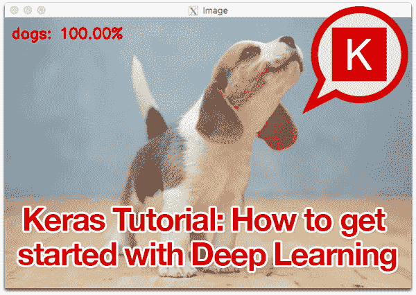
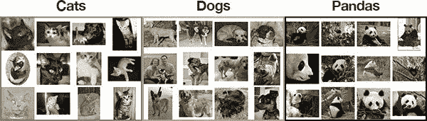
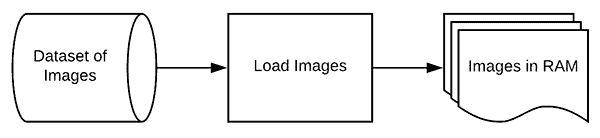
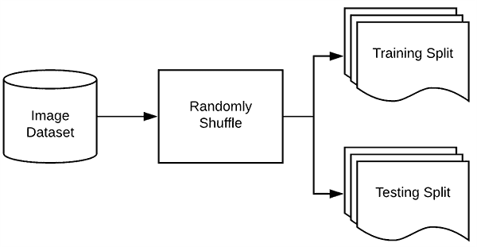
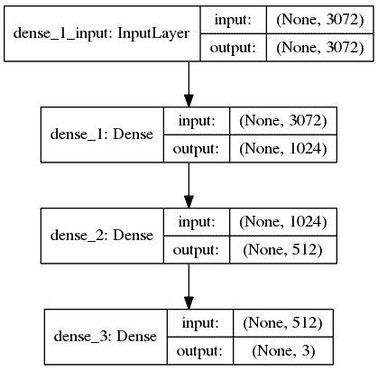
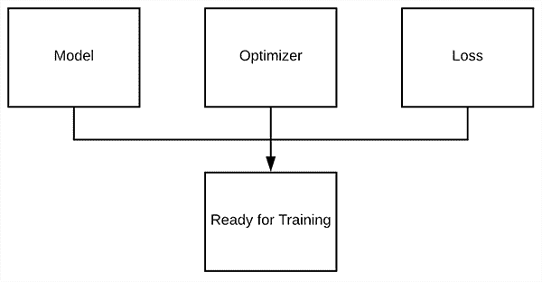
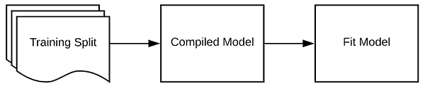
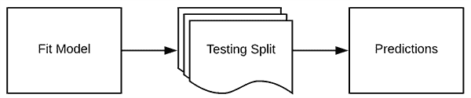
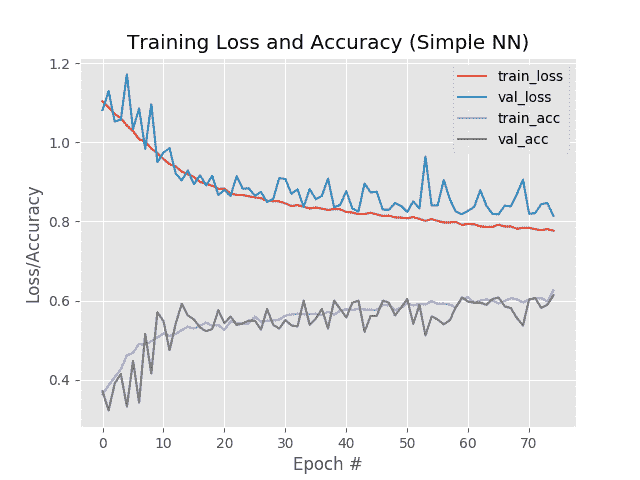
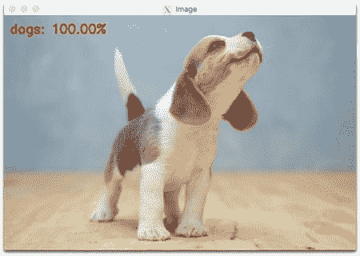

# Keras 教程:如何入门 Keras、深度学习和 Python

> 原文：<https://pyimagesearch.com/2018/09/10/keras-tutorial-how-to-get-started-with-keras-deep-learning-and-python/>

[](https://pyimagesearch.com/wp-content/uploads/2018/09/keras_tutorial_header.png)

在这篇 Keras 教程中，你会发现开始学习深度学习和 Python 是多么容易。您将使用 Keras 深度学习库在自定义图像数据集上训练您的第一个神经网络，并从那里实现您的第一个卷积神经网络(CNN)。

这个指南的灵感来自于 PyImageSearch 的读者 Igor，他几周前给我发了一封电子邮件，问我:

> 嗨，阿德里安，谢谢你的图片搜索博客。我注意到，我遇到的几乎所有关于 Keras 和影像分类的“入门”指南都使用了内置于 Keras 中的 MNIST 或 CIFAR-10 数据集。我只需调用其中一个函数，数据就会自动加载。
> 
> 但是我如何在 Keras 上使用我自己的图像数据集呢？
> 
> 我必须采取什么步骤？

Igor 有一个很好的观点——你遇到的大多数 Keras 教程都会尝试使用 MNIST(手写识别)或 CIFAR-10(基本对象识别)等图像分类数据集来教你基本的库。

这些图像数据集是计算机视觉和深度学习文献中的标准基准，当然，它们绝对会让你开始使用 Keras…

…但是它们不一定实用，因为它们没有教你如何使用驻留在磁盘上的自己的映像集。相反，您只是调用助手函数来加载预编译的数据集。

我对 Keras 入门教程有不同的看法。

我不会教你如何利用这些预编译的数据集，而是教你如何使用自定义数据集——**训练你的第一个神经网络和卷积神经网络，因为让我们面对现实吧，你的目标是将深度学习应用于你的*自己的*数据集，而不是内置在 Keras 中的数据集，对吗？**

**要了解如何开始使用 Keras、深度学习和 Python，*继续阅读！***

## Keras 教程:如何入门 Keras、深度学习和 Python

***2020-05-13 更新:**此博文现已兼容 TensorFlow 2+!*

今天的 Keras 教程是为从业者设计的——它旨在成为从业者应用深度学习的方法。

这意味着我们将在实践中学习。

我们会弄脏自己的手。

写一些 Keras 代码。

然后在我们定制的数据集上训练我们的网络。

本教程是*而不是*旨在深入探究深度学习的相关理论。

如果你有兴趣在 odepth 学习深度学习，包括(1)动手实现和(2)理论讨论，我建议你看看我的书， [***用 Python 进行计算机视觉的深度学习***](https://pyimagesearch.com/deep-learning-computer-vision-python-book/) 。

### 将要涵盖的内容概述

用 Keras 训练你的第一个简单的神经网络并不需要很多代码，但我们会慢慢开始，一步一步来，确保你理解如何在你自己的自定义数据集上训练网络的过程。

我们今天将讨论的步骤包括:

1.  在系统上安装 Keras 和其他依赖项
2.  从磁盘加载数据
3.  创建您的培训和测试拆分
4.  定义您的 Keras 模型架构
5.  编译您的 Keras 模型
6.  根据训练数据训练模型
7.  根据测试数据评估您的模型
8.  使用训练好的 Keras 模型进行预测

我还包括了一个关于训练你的第一个卷积神经网络的附加部分。

这可能看起来像很多步骤，但我向你保证，一旦我们开始进入示例，你会看到这些示例是线性的，有直观的意义，并会帮助你理解用 Keras 训练神经网络的基础。

### 我们的示例数据集

[](https://pyimagesearch.com/wp-content/uploads/2018/09/keras_tutorial_mnist_cifar10.jpg)

**Figure 1:** In this Keras tutorial, we won’t be using CIFAR-10 or MNIST for our dataset. Instead, I’ll show you how you can organize your own dataset of images and train a neural network using deep learning with Keras.

你遇到的大多数 Keras 图像分类教程都会利用 MNIST 或 CIFAR-10 — ***我在这里不打算这么做。***

首先，MNIST 和 CIFAR-10 并不是非常令人兴奋的例子。

这些教程实际上并没有涵盖如何使用您自己的自定义影像数据集。相反，他们简单地调用内置的 Keras 实用程序，这些实用程序神奇地将 MNIST 和 CIFAR-10 数据集作为 NumPy 数组返回。其实你的训练和测试拆分早就给你预拆分好了！

其次，如果你想使用自己的自定义数据集，你真的不知道从哪里开始。你会发现自己抓耳挠腮，问出这样的问题:

*   那些助手函数从哪里加载数据？
*   我在磁盘上的数据集应该是什么格式？
*   如何将数据集加载到内存中？
*   我需要执行哪些预处理步骤？

实话实说吧——你研究 Keras 和深度学习的目标不是与这些预先烘焙的数据集一起工作。

相反，您希望使用自己的自定义数据集。

你所遇到的那些介绍性的 Keras 教程只能带你到这里。

这就是为什么，在这个 Keras 教程中，我们将使用一个名为“动物数据集”的自定义数据集，这是我为我的书创建的， [*用 Python 进行计算机视觉的深度学习*](https://pyimagesearch.com/deep-learning-computer-vision-python-book/) :

[](https://pyimagesearch.com/wp-content/uploads/2018/09/keras_tutorial_dataset.jpg)

**Figure 2:** In this Keras tutorial we’ll use an example animals dataset straight from my deep learning book. The dataset consists of dogs, cats, and pandas.

该数据集的目的是将图像正确分类为包含以下内容之一:

*   猫
*   狗
*   熊猫

动物数据集仅包含 3000 张图像，旨在成为一个介绍性数据集，我们可以使用我们的 CPU 或 GPU 快速*训练一个深度学习模型(并仍然获得合理的准确性)。*

**此外，使用这个自定义数据集使您能够理解:**

1.  应该如何在磁盘上组织数据集
2.  如何从磁盘加载图像和类别标签
3.  如何将您的数据划分为训练和测试部分
4.  如何根据训练数据训练您的第一个 Keras 神经网络
5.  如何根据测试数据评估您的模型
6.  您如何在全新的数据上重用您的训练模型，并且在您的训练和测试分割之外

按照 Keras 教程中的步骤，你可以用我的动物数据集替换你选择的任何数据集，前提是你使用了下面详述的项目/目录结构。

***需要数据？**如果你需要从互联网上搜集图片来创建一个数据集，看看如何去做[用必应图片搜索](https://pyimagesearch.com/2018/04/09/how-to-quickly-build-a-deep-learning-image-dataset/)的简单方法，或者用谷歌图片的[稍微复杂一点的方法。](https://pyimagesearch.com/2017/12/04/how-to-create-a-deep-learning-dataset-using-google-images/)*

### 项目结构

有许多文件与此项目相关联。从 ***“下载”*** 部分抓取 zip 文件，然后使用`tree`命令在您的终端中显示项目结构(我已经为`tree`提供了两个命令行参数标志，以使输出美观整洁):

```py
$ tree --dirsfirst --filelimit 10
.
├── animals
│   ├── cats [1000 entries exceeds filelimit, not opening dir]
│   ├── dogs [1000 entries exceeds filelimit, not opening dir]
│   └── panda [1000 entries exceeds filelimit, not opening dir]
├── images
│   ├── cat.jpg
│   ├── dog.jpg
│   └── panda.jpg
├── output
│   ├── simple_nn.model
│   ├── simple_nn_lb.pickle
│   ├── simple_nn_plot.png
│   ├── smallvggnet.model
│   ├── smallvggnet_lb.pickle
│   └── smallvggnet_plot.png
├── pyimagesearch
│   ├── __init__.py
│   └── smallvggnet.py
├── predict.py
├── train_simple_nn.py
└── train_vgg.py

7 directories, 14 files

```

如前所述，今天我们将使用动物数据集。注意`animals`在项目树中是如何组织的。在`animals/`里面，有三个类别目录:`cats/`、`dogs/`、`panda/`。这些目录中的每一个都有 1，000 张属于各自类别的图像。

如果你使用你自己的数据集，就用同样的方式组织它！理想情况下，每节课至少要收集 1000 张图片。这并不总是可能的，但是你至少应该有职业平衡。一个类别文件夹中的图像过多会导致模型偏差。

接下来是`images/`目录。该目录包含三个用于测试目的的图像，我们将使用它们来演示如何(1)从磁盘加载一个训练好的模型，然后(2)对一个输入图像进行分类，该图像是我们原始数据集的*而不是*部分。

`output/`文件夹包含训练生成的三种文件:

*   `.model`:训练后生成一个序列化的 Keras 模型文件，可以在以后的推理脚本中使用。
*   `.pickle`:序列化标签二进制文件。这个文件包含一个包含类名的对象。它伴随着一个模型文件。
*   `.png`:我总是将我的训练/验证图放在输出文件夹中，因为它是训练过程的输出。

`pyimagesearch/`目录是一个模块。与我收到的许多问题相反，`pyimagesearch`是 ***而不是*** 一个可安装 pip 的包。相反，它位于项目文件夹中，其中包含的类可以导入到您的脚本中。它在本 Keras 教程的 ***“下载”*** 部分提供。

今天我们将复习四个。py 文件:

*   在博文的前半部分，我们将训练一个简单的模型。训练脚本是`train_simple_nn.py`。
*   我们将使用`train_vgg.py`脚本继续培训`SmallVGGNet`。
*   `smallvggnet.py`文件包含我们的`SmallVGGNet`类，一个卷积神经网络。
*   除非我们可以部署它，否则序列化模型有什么用？在`predict.py`中，我已经为您提供了样本代码来加载一个序列化的模型+标签文件，并对一幅图像做出推断。预测脚本只有在我们成功训练了具有合理精确度的模型之后才有用。运行此脚本来测试数据集中不包含的图像总是很有用的。

### **配置您的开发环境**

[](https://pyimagesearch.com/wp-content/uploads/2018/09/keras_tutorial_install.jpg)

**Figure 3:** We’ll use Keras with the TensorFlow backend in this introduction to Keras for deep learning blog post.

要针对本教程配置您的系统，我首先建议您遵循以下任一教程:

*   [*如何在 Ubuntu 上安装 tensor flow 2.0*](https://pyimagesearch.com/2019/12/09/how-to-install-tensorflow-2-0-on-ubuntu/)
*   [*如何在 macOS 上安装 tensor flow 2.0*](https://pyimagesearch.com/2019/12/09/how-to-install-tensorflow-2-0-on-macos/)

这两个教程都将帮助您在一个方便的 Python 虚拟环境中，用这篇博文所需的所有软件来配置您的系统。

请注意 [PyImageSearch 不推荐也不支持 CV/DL 项目](https://pyimagesearch.com/faqs/single-faq/can-you-help-me-do-___-on-windows/)的窗口。

### 2.从磁盘加载数据

[](https://pyimagesearch.com/wp-content/uploads/2018/09/keras_tutorial_step2.png)

**Figure 4:** Step #2 of our Keras tutorial involves loading images from disk into memory.

现在 Keras 已经安装在我们的系统上，我们可以开始使用 Keras 实现我们的第一个简单的神经网络训练脚本。我们稍后将实现一个成熟的卷积神经网络，但让我们从简单的开始，一步一步来。

打开`train_simple_nn.py`并插入以下代码:

```py
# set the matplotlib backend so figures can be saved in the background
import matplotlib
matplotlib.use("Agg")

# import the necessary packages
from sklearn.preprocessing import LabelBinarizer
from sklearn.model_selection import train_test_split
from sklearn.metrics import classification_report
from tensorflow.keras.models import Sequential
from tensorflow.keras.layers import Dense
from tensorflow.keras.optimizers import SGD
from imutils import paths
import matplotlib.pyplot as plt
import numpy as np
import argparse
import random
import pickle
import cv2
import os
```

**第 2-19 行**导入我们需要的包。如您所见，这个脚本利用了相当多的工具。让我们回顾一下重要的问题:

*   这是 Python 的绘图包。也就是说，它确实有其细微之处，如果你对此有困难，请参考[这篇博文](https://pyimagesearch.com/2015/08/24/resolved-matplotlib-figures-not-showing-up-or-displaying/)。在**第 3 行**，我们指示`matplotlib`使用`"Agg"`后端，使我们能够将绘图保存到磁盘上——这是您的第一个细微差别！
*   scikit-learn 库将帮助我们将标签二进制化，分割数据用于训练/测试，并在我们的终端中生成训练报告。
*   `tensorflow.keras`:您正在阅读本教程以了解 Keras——它是我们进入 TensorFlow 和其他深度学习后端的高级前端。
*   我的便利功能包。我们将使用`paths`模块来生成用于训练的图像文件路径列表。
*   `numpy` : NumPy 是用 Python 进行数值处理的。这是另一个首选产品包。如果您安装了 OpenCV for Python 和 scikit-learn，那么您将拥有 NumPy，因为它是一个依赖项。
*   `cv2`:这是 OpenCV。在这一点上，即使您可能使用 OpenCV 3 或更高版本，这也是一个传统和需求。
*   *…剩余的导入被构建到您的 Python 安装中！*

咻！这已经很多了，但是在我们浏览这些脚本时，对每个导入的用途有一个好的了解将有助于您的理解。

让我们用 argparse 解析我们的[命令行参数:](https://pyimagesearch.com/2018/03/12/python-argparse-command-line-arguments/)

```py
# construct the argument parser and parse the arguments
ap = argparse.ArgumentParser()
ap.add_argument("-d", "--dataset", required=True,
	help="path to input dataset of images")
ap.add_argument("-m", "--model", required=True,
	help="path to output trained model")
ap.add_argument("-l", "--label-bin", required=True,
	help="path to output label binarizer")
ap.add_argument("-p", "--plot", required=True,
	help="path to output accuracy/loss plot")
args = vars(ap.parse_args())

```

当我们执行脚本时，我们的脚本将动态处理通过命令行提供的附加信息。附加信息采用命令行参数的形式。`argparse`模块内置于 Python 中，将处理解析您在命令字符串中提供的信息。如需更多解释，[参见这篇博文](https://pyimagesearch.com/2018/03/12/python-argparse-command-line-arguments/)。

我们有四个命令行参数要解析:

*   磁盘上图像数据集的路径。
*   我们的模型将被序列化并输出到磁盘。此参数包含输出模型文件的路径。
*   `--label-bin`:数据集标签被序列化到磁盘上，以便在其他脚本中调用。这是输出标签二进制文件的路径。
*   `--plot`:输出训练图图像文件的路径。我们将查看该图，检查数据是否过度拟合/拟合不足。

有了数据集信息，让我们加载图像和类标签:

```py
# initialize the data and labels
print("[INFO] loading images...")
data = []
labels = []

# grab the image paths and randomly shuffle them
imagePaths = sorted(list(paths.list_images(args["dataset"])))
random.seed(42)
random.shuffle(imagePaths)

# loop over the input images
for imagePath in imagePaths:
	# load the image, resize the image to be 32x32 pixels (ignoring
	# aspect ratio), flatten the image into 32x32x3=3072 pixel image
	# into a list, and store the image in the data list
	image = cv2.imread(imagePath)
	image = cv2.resize(image, (32, 32)).flatten()
	data.append(image)

	# extract the class label from the image path and update the
	# labels list
	label = imagePath.split(os.path.sep)[-2]
	labels.append(label)

```

在这里我们:

*   为我们的`data`和`labels` ( **第 35 行和第 36 行**)初始化列表。这些将成为 NumPy 数组。
*   抓住`imagePaths`，随机洗牌(**第 39-41 行**)。在我们对它们进行排序和排序之前，`paths.list_images`函数会很方便地在我们的`--dataset`目录中找到所有输入图像的所有路径。我设置了一个`seed`,这样随机重新排序是可重复的。
*   开始循环我们数据集中的所有`imagePaths`(**行 44** )。

对于每个`imagePath`，我们继续:

*   将`image`载入存储器(**第 48 行**)。
*   调整`image`到`32x32`像素的大小(忽略纵横比)以及`flatten`图像(**第 49 行**)。因为这个神经网络 ***需要*** 这些维度，所以 ***对***`resize`我们的图像是至关重要的。每个神经网络都需要不同的维度，所以要意识到这一点。拉平数据使我们能够轻松地将原始像素强度传递给输入层神经元。稍后您将看到，对于 VGGNet，我们将卷传递到网络，因为它是卷积卷。请记住，这个例子只是一个简单的非卷积网络——我们将在本文后面看到一个更高级的例子。
*   将调整后的图像附加到`data` ( **第 50 行**)。
*   从路径中提取图像的类`label`(**第 54 行**)并将其添加到`labels`列表中(**第 55 行**)。`labels`列表包含对应于数据列表中每个图像的类别。

现在，我们可以一下子将数组操作应用于数据和标签:

```py
# scale the raw pixel intensities to the range [0, 1]
data = np.array(data, dtype="float") / 255.0
labels = np.array(labels)

```

在**行 58** 上，我们将像素强度从范围*【0，255】*缩放到*【0，1】*(一个常见的预处理步骤)。

我们还将`labels`列表转换成一个 NumPy 数组(**第 59 行**)。

### 3.构建您的培训和测试划分

[](https://pyimagesearch.com/wp-content/uploads/2018/09/keras_tutorial_step3.png)

**Figure 5:** Before fitting a deep learning or machine learning model you must split your data into training and testing sets. Scikit-learn is employed in this blog post to split our data.

既然我们已经从磁盘加载了图像数据，接下来我们需要构建我们的训练和测试分割:

```py
# partition the data into training and testing splits using 75% of
# the data for training and the remaining 25% for testing
(trainX, testX, trainY, testY) = train_test_split(data,
	labels, test_size=0.25, random_state=42)

```

通常将一定比例的数据用于训练，将较小比例的数据用于测试。scikit-learn 提供了一个方便的`train_test_split`函数，它将为我们拆分数据。

`trainX`和`testX`组成图像数据本身，而`trainY`和`testY`组成标签。

我们的类标签目前表示为字符串；然而，Keras 将假设两者:

1.  标签被编码为整数
2.  此外，对这些标签执行一键编码，使得每个标签被表示为一个*向量*而不是一个整数

为了完成这种编码，我们可以使用 scikit-learn 中的`LabelBinarizer`类:

```py
# convert the labels from integers to vectors (for 2-class, binary
# classification you should use Keras' to_categorical function
# instead as the scikit-learn's LabelBinarizer will not return a
# vector)
lb = LabelBinarizer()
trainY = lb.fit_transform(trainY)
testY = lb.transform(testY)

```

在第 70 行的**上，我们初始化了`LabelBinarizer`对象。**

对`fit_transform`的调用在`trainY`中找到所有唯一的类标签，然后将它们转换成独热编码标签。

对`testY`上的`.transform`的调用只执行一次性编码步骤——唯一的一组可能的类标签已经由对`.fit_transform`的调用决定了。

这里有一个例子:

```py
[1, 0, 0] # corresponds to cats
[0, 1, 0] # corresponds to dogs
[0, 0, 1] # corresponds to panda

```

请注意，只有一个数组元素是“热”的，这就是为什么我们称之为“一热”编码。

### 4.定义您的 Keras 模型架构

[](https://pyimagesearch.com/wp-content/uploads/2018/09/keras_tutorial_simplenn_arch.png)

**Figure 6:** Our simple neural network is created using Keras in this deep learning tutorial.

下一步是使用 Keras 定义我们的神经网络架构。这里我们将使用一个具有一个输入层、两个隐藏层和一个输出层的网络:

```py
# define the 3072-1024-512-3 architecture using Keras
model = Sequential()
model.add(Dense(1024, input_shape=(3072,), activation="sigmoid"))
model.add(Dense(512, activation="sigmoid"))
model.add(Dense(len(lb.classes_), activation="softmax"))

```

由于我们的模型非常简单，我们继续在这个脚本中定义它(通常我喜欢在一个单独的文件中为模型架构创建一个单独的类)。

输入层和第一隐藏层定义在**线 76** 上。将具有`3072`的`input_shape`，因为在展平的输入图像中有`32x32x3=3072`个像素。第一个隐藏层将有`1024`个节点。

第二个隐藏层将有`512`个节点(**行 77** )。

最后，最终输出层中的节点数(**第 78 行**)将是可能的类标签数——在这种情况下，输出层将有*三个*节点，每个节点对应一个类标签(分别是*、*、*、*和*、【熊猫】、*)。

### 5.编译您的 Keras 模型

[](https://pyimagesearch.com/wp-content/uploads/2018/09/keras_tutorial_step5.png)

**Figure 7:** Step #5 of our Keras tutorial requires that we compile our model with an optimizer and loss function.

一旦我们定义了我们的神经网络架构，下一步就是“编译”它:

```py
# initialize our initial learning rate and # of epochs to train for
INIT_LR = 0.01
EPOCHS = 80

# compile the model using SGD as our optimizer and categorical
# cross-entropy loss (you'll want to use binary_crossentropy
# for 2-class classification)
print("[INFO] training network...")
opt = SGD(lr=INIT_LR)
model.compile(loss="categorical_crossentropy", optimizer=opt,
	metrics=["accuracy"])

```

首先，我们初始化我们的学习率和训练的总时期数(**行 81 和 82** )。

然后，我们使用随机梯度下降(`SGD`)优化器将`"categorical_crossentropy"`作为`loss`函数来`compile`我们的模型。

分类交叉熵被用作几乎所有被训练来执行分类的网络的损失。唯一的例外是 *2 级分类*，这里只有*两个可能的级标签*。在这种情况下，你可能想用`"binary_crossentropy"`替换`"categorical_crossentropy"`。

### 6.使您的 Keras 模型符合数据

[](https://pyimagesearch.com/wp-content/uploads/2018/09/keras_tutorial_step6.png)

**Figure 8:** In Step #6 of this Keras tutorial, we train a deep learning model using our training data and compiled model.

现在我们的 Keras 模型已经编译好了，我们可以根据我们的训练数据来“拟合”(即训练)它:

```py
# train the neural network
H = model.fit(x=trainX, y=trainY, validation_data=(testX, testY),
	epochs=EPOCHS, batch_size=32)

```

除了`batch_size`，我们已经讨论了所有的输入。`batch_size`控制通过网络的每组数据的大小。更大的 GPU 将能够适应更大的批量。我建议从`32`或`64`开始，然后从那里往上走。

### 7.评估您的 Keras 模型

[](https://pyimagesearch.com/wp-content/uploads/2018/09/keras_tutorial_step7.png)

**Figure 9:** After we fit our model, we can use our testing data to make predictions and generate a classification report.

我们已经训练了我们的实际模型，但现在我们需要根据我们的测试数据来评估它。

我们对测试数据进行评估是很重要的，这样我们就可以获得一个无偏(或尽可能接近无偏)的表示，来说明我们的模型在使用从未训练过的数据时表现如何。

为了评估我们的 Keras 模型，我们可以结合使用模型的`.predict`方法和来自 scikit-learn 的`classification_report`:

```py
# evaluate the network
print("[INFO] evaluating network...")
predictions = model.predict(x=testX, batch_size=32)
print(classification_report(testY.argmax(axis=1),
	predictions.argmax(axis=1), target_names=lb.classes_))

# plot the training loss and accuracy
N = np.arange(0, EPOCHS)
plt.style.use("ggplot")
plt.figure()
plt.plot(N, H.history["loss"], label="train_loss")
plt.plot(N, H.history["val_loss"], label="val_loss")
plt.plot(N, H.history["accuracy"], label="train_acc")
plt.plot(N, H.history["val_accuracy"], label="val_acc")
plt.title("Training Loss and Accuracy (Simple NN)")
plt.xlabel("Epoch #")
plt.ylabel("Loss/Accuracy")
plt.legend()
plt.savefig(args["plot"])

```

***2020-05-13 更新:**为了使这个绘图片段与 TensorFlow 2+兼容，H.history 字典键被更新以完全拼出“准确性”而没有“acc”(即`H.history["val_accuracy"]`和`H.history["accuracy"]`)。“val”没有拼成“validation”，这有点令人困惑；我们必须学会热爱 API 并与之共存，并永远记住这是一项正在进行的工作，世界各地的许多开发人员都为此做出了贡献。*

运行此脚本时，您会注意到我们的 Keras 神经网络将开始训练，一旦训练完成，我们将在测试集上评估网络:

```py
$ python train_simple_nn.py --dataset animals --model output/simple_nn.model \
	--label-bin output/simple_nn_lb.pickle --plot output/simple_nn_plot.png
Using TensorFlow backend.
[INFO] loading images...
[INFO] training network...
Train on 2250 samples, validate on 750 samples
Epoch 1/80
2250/2250 [==============================] - 1s 311us/sample - loss: 1.1041 - accuracy: 0.3516 - val_loss: 1.1578 - val_accuracy: 0.3707
Epoch 2/80
2250/2250 [==============================] - 0s 183us/sample - loss: 1.0877 - accuracy: 0.3738 - val_loss: 1.0766 - val_accuracy: 0.3813
Epoch 3/80
2250/2250 [==============================] - 0s 181us/sample - loss: 1.0707 - accuracy: 0.4240 - val_loss: 1.0693 - val_accuracy: 0.3533
...
Epoch 78/80
2250/2250 [==============================] - 0s 184us/sample - loss: 0.7688 - accuracy: 0.6160 - val_loss: 0.8696 - val_accuracy: 0.5880
Epoch 79/80
2250/2250 [==============================] - 0s 181us/sample - loss: 0.7675 - accuracy: 0.6200 - val_loss: 1.0294 - val_accuracy: 0.5107
Epoch 80/80
2250/2250 [==============================] - 0s 181us/sample - loss: 0.7687 - accuracy: 0.6164 - val_loss: 0.8361 - val_accuracy: 0.6120
[INFO] evaluating network...
              precision    recall  f1-score   support

        cats       0.57      0.59      0.58       236
        dogs       0.55      0.31      0.39       236
       panda       0.66      0.89      0.76       278

    accuracy                           0.61       750
   macro avg       0.59      0.60      0.58       750
weighted avg       0.60      0.61      0.59       750

[INFO] serializing network and label binarizer...

```

这个网络很小，当与一个小数据集结合时，在我的 CPU 上每个时期只需要 2 秒钟。

这里你可以看到我们的网络获得了 60%的准确率。

由于我们有 1/3 的机会随机选择给定图像的正确标签，我们知道我们的网络实际上已经学习了可以用来区分这三类图像的模式。

我们还保存了我们的一个情节:

*   培训损失
*   验证损失
*   训练准确性
*   验证准确性

…确保我们能够轻松发现结果中的过度拟合或欠拟合。

[](https://pyimagesearch.com/wp-content/uploads/2018/09/simple_nn_plot.png)

**Figure 10:** Our simple neural network training script (created with Keras) generates an accuracy/loss plot to help us spot under/overfitting.

查看我们的图，我们看到少量的过度拟合开始出现在大约 45 个时期之后，此时我们的训练和验证损失开始发散，并出现明显的缺口。

最后，我们可以将模型保存到磁盘上，这样我们就可以在以后重用它，而不必重新训练它:

```py
# save the model and label binarizer to disk
print("[INFO] serializing network and label binarizer...")
model.save(args["model"], save_format="h5")
f = open(args["label_bin"], "wb")
f.write(pickle.dumps(lb))
f.close()

```

### 8.使用 Keras 模型对新数据进行预测

在这一点上，我们的模型已经被训练好了——但是如果我们想在我们的网络已经被训练好的之后*对图像进行预测呢？*

那我们该怎么办？

我们如何从磁盘加载模型？

如何加载一幅图像，然后进行预处理进行分类？

在`predict.py`脚本中，我将向您展示如何操作，因此打开它并插入以下代码:

```py
# import the necessary packages
from tensorflow.keras.models import load_model
import argparse
import pickle
import cv2

# construct the argument parser and parse the arguments
ap = argparse.ArgumentParser()
ap.add_argument("-i", "--image", required=True,
	help="path to input image we are going to classify")
ap.add_argument("-m", "--model", required=True,
	help="path to trained Keras model")
ap.add_argument("-l", "--label-bin", required=True,
	help="path to label binarizer")
ap.add_argument("-w", "--width", type=int, default=28,
	help="target spatial dimension width")
ap.add_argument("-e", "--height", type=int, default=28,
	help="target spatial dimension height")
ap.add_argument("-f", "--flatten", type=int, default=-1,
	help="whether or not we should flatten the image")
args = vars(ap.parse_args())

```

首先，我们将导入我们需要的包和模块。

每当您编写脚本从磁盘加载 Keras 模型时，您都需要从`tensorflow.keras.models`显式导入`load_model`。OpenCV 将用于注释和显示。`pickle`模块将用于加载我们的标签二进制化器。

接下来，让我们解析我们的命令行参数:

*   `--image`:我们输入图像的路径。
*   `--model`:我们经过训练和序列化的 Keras 模型路径。
*   `--label-bin`:序列化标签二进制化器路径。
*   `--width`:CNN 的输入形状的宽度。记住——你不能在这里随便指定任何东西。您需要指定模型的设计宽度。
*   `--height`:输入 CNN 的图像的高度。指定的高度还必须与网络的输入形状相匹配。
*   我们是否应该使图像变平。默认情况下，我们不会展平图像。如果需要展平图像，应该为此参数传递一个`1`。

接下来，让我们加载图像并根据命令行参数调整其大小:

```py
# load the input image and resize it to the target spatial dimensions
image = cv2.imread(args["image"])
output = image.copy()
image = cv2.resize(image, (args["width"], args["height"]))

# scale the pixel values to [0, 1]
image = image.astype("float") / 255.0

```

然后我们会`flatten`图片如果需要的话:

```py
# check to see if we should flatten the image and add a batch
# dimension
if args["flatten"] > 0:
	image = image.flatten()
	image = image.reshape((1, image.shape[0]))

# otherwise, we must be working with a CNN -- don't flatten the
# image, simply add the batch dimension
else:
	image = image.reshape((1, image.shape[0], image.shape[1],
		image.shape[2]))

```

展平标准全连接网络的图像非常简单(**第 33-35 行**)。

在 CNN 的情况下，我们也添加了批处理维度，但是我们没有展平图像(**第 39-41 行**)。下一节将介绍一个 CNN 的例子。

从那里，让我们将模型+标签二进制化器加载到内存中，并进行预测:

```py
# load the model and label binarizer
print("[INFO] loading network and label binarizer...")
model = load_model(args["model"])
lb = pickle.loads(open(args["label_bin"], "rb").read())

# make a prediction on the image
preds = model.predict(image)

# find the class label index with the largest corresponding
# probability
i = preds.argmax(axis=1)[0]
label = lb.classes_[i]

```

我们的模型和标签二进制化器通过**线 45 和 46** 加载。

我们可以通过调用`model.predict` ( **第 49 行**)对输入`image`进行预测。

`preds`数组是什么样子的？

```py
(Pdb) preds
array([[5.4622066e-01, 4.5377851e-01, 7.7963534e-07]], dtype=float32)

```

2D 数组包含(1)批中图像的索引(这里只有一个索引，因为只有一个图像被传入神经网络进行分类)和(2)对应于每个类标签的百分比，如在我的 [Python 调试器](https://docs.python.org/3/library/pdb.html)中查询变量所示:

*   猫:54.6%
*   狗:45.4%
*   熊猫:约 0%

换句话说，我们的网络“认为”它看到了*、【猫】、*，而且它肯定“知道”它没有看到*、【熊猫】、*。

**第 53 行**找到最大值的*指标*(第 0 个“猫”指标)。

并且**行 54** 从标签二进制化器中提取*【猫】*字符串标签。

简单对吗？

现在让我们显示结果:

```py
# draw the class label + probability on the output image
text = "{}: {:.2f}%".format(label, preds[0][i] * 100)
cv2.putText(output, text, (10, 30), cv2.FONT_HERSHEY_SIMPLEX, 0.7,
	(0, 0, 255), 2)

# show the output image
cv2.imshow("Image", output)
cv2.waitKey(0)

```

我们在第 57 行的**上格式化我们的`text`字符串。这包括`label`和百分比格式的预测值。**

然后我们将`text`放在`output`图像上(**第 58 行和第 59 行**)。

最后，我们在屏幕上显示输出图像，并等待直到用户按下第 62 行**和第 63 行**上的任意键([观察 Homer Simpson 试图定位“任意”键](https://www.youtube.com/watch?v=st6-DgWeuos))。

我们的预测脚本相当简单。

一旦您使用本教程的 ***【下载】*** 部分下载了代码，您就可以打开一个终端，尝试在自定义映像上运行我们训练有素的网络:

```py
$ python predict.py --image images/cat.jpg --model output/simple_nn.model \
	--label-bin output/simple_nn_lb.pickle --width 32 --height 32 --flatten 1
Using TensorFlow backend.
[INFO] loading network and label binarizer...

```

确保从相对于脚本的文件夹中复制/粘贴或键入了整个命令(包括命令行参数)。如果你在命令行参数上有问题，请阅读一下[这篇博文](https://pyimagesearch.com/2018/03/12/python-argparse-command-line-arguments/)。

[](https://pyimagesearch.com/wp-content/uploads/2018/09/keras_tutorial_simplenn_01.jpg)

**Figure 11:** A cat is correctly classified with a simple neural network in our Keras tutorial.

这里可以看到，我们简单的 Keras 神经网络已经以 55.87%的概率将输入图像分类为*“猫”*，尽管猫的脸被一片面包部分遮挡。

### 9.额外收获:用 Keras 训练你的第一个卷积神经网络

诚然，使用标准的前馈神经网络对图像进行分类并不是一个明智的选择。

相反，我们应该利用卷积神经网络(CNN ),它旨在对图像的原始像素强度进行操作，并学习可用于高精度分类图像的鉴别过滤器。

我们今天将在这里讨论的模型是 [VGGNet](https://pyimagesearch.com/2017/03/20/imagenet-vggnet-resnet-inception-xception-keras/) 的一个较小的变体，我将其命名为“SmallVGGNet”。

类似 VGGNet 的模型有两个共同的特征:

1.  仅使用 3×3 卷积
2.  在应用破坏性池操作之前，卷积层在网络体系结构中更深地堆叠在彼此之上

现在让我们开始实现 SmallVGGNet。

**打开`smallvggnet.py`文件，插入以下代码:**

```py
# import the necessary packages
from tensorflow.keras.models import Sequential
from tensorflow.keras.layers import BatchNormalization
from tensorflow.keras.layers import Conv2D
from tensorflow.keras.layers import MaxPooling2D
from tensorflow.keras.layers import Activation
from tensorflow.keras.layers import Flatten
from tensorflow.keras.layers import Dropout
from tensorflow.keras.layers import Dense
from tensorflow.keras import backend as K

```

从**2-10**线的进口可以看出，`SmallVGGNet`所需的一切都来自`keras`。我鼓励你在 [Keras 文档](https://keras.io/)和我的[深度学习书籍](https://pyimagesearch.com/deep-learning-computer-vision-python-book/)中熟悉每一个。

然后我们开始定义我们的`SmallVGGNet`类和`build`方法:

```py
class SmallVGGNet:
	@staticmethod
	def build(width, height, depth, classes):
		# initialize the model along with the input shape to be
		# "channels last" and the channels dimension itself
		model = Sequential()
		inputShape = (height, width, depth)
		chanDim = -1

		# if we are using "channels first", update the input shape
		# and channels dimension
		if K.image_data_format() == "channels_first":
			inputShape = (depth, height, width)
			chanDim = 1

```

我们的类在**行 12** 定义，唯一的`build`方法在**行 14** 定义。

`build`需要四个参数:输入图像的`width`、`height`输入图像的高度、`depth`和`classes`的数量。

`depth`也可以认为是通道的数量。我们的图像在 RGB 颜色空间中，所以当我们调用`build`方法时，我们将传递`3`的`depth`。

首先，我们初始化一个`Sequential`模型(**第 17 行**)。

然后，我们确定通道排序。Keras 支持`"channels_last"`(即 TensorFlow)和`"channels_first"`(即 Theano)排序。**第 18-25 行**允许我们的模型支持任何类型的后端。

现在，让我们给网络添加一些层:

```py
		# CONV => RELU => POOL layer set
		model.add(Conv2D(32, (3, 3), padding="same",
			input_shape=inputShape))
		model.add(Activation("relu"))
		model.add(BatchNormalization(axis=chanDim))
		model.add(MaxPooling2D(pool_size=(2, 2)))
		model.add(Dropout(0.25))

```

我们的第一个`CONV => RELU => POOL`层是由这个模块添加的。

我们的第一个`CONV`层有`32`个大小为`3x3`的滤镜。

我们指定第一层的`inputShape`非常重要，因为所有后续层的尺寸将使用涓滴法计算。

我们将在该网络架构中使用 ReLU(整流线性单元)激活功能。有许多激活方法，我鼓励你熟悉一下 [*使用 Python 进行计算机视觉的深度学习*](https://pyimagesearch.com/deep-learning-computer-vision-python-book/) 中的流行方法，其中讨论了利弊和权衡。

还应用了批处理规范化、最大池化和丢弃。

批量标准化用于在将给定输入体积传递到网络中的下一层之前对其激活进行标准化。已经证明它在减少训练 CNN 所需的纪元数量以及稳定训练本身方面非常有效。

池图层的主要功能是逐渐减小图层输入量的空间大小(即宽度和高度)。在 CNN 架构中，通常在连续的 CONV 层之间插入池层。

辍学是一个不容忽视的有趣概念。为了使网络更强大，我们可以应用 dropout，即在层间断开随机神经元的过程。这个过程被证明可以减少过度拟合，提高准确性，并允许我们的网络更好地推广不熟悉的图像。如参数所示，在每次训练迭代期间，25%的节点连接在层之间随机断开(丢弃)。

***注意:**如果你是深度学习的新手，这可能对你来说听起来像是一种不同的语言。就像学习一门新的口语一样，它需要时间、学习和练习。如果你渴望学习深度学习的语言，为什么不抓住我评价很高的书，[用 Python 进行计算机视觉的深度学习](https://pyimagesearch.com/deep-learning-computer-vision-python-book/)？我保证我会在书中分解这些概念，并通过实际例子来强化它们。*

继续前进，我们到达下一个`(CONV => RELU) * 2 => POOL`层:

```py
		# (CONV => RELU) * 2 => POOL layer set
		model.add(Conv2D(64, (3, 3), padding="same"))
		model.add(Activation("relu"))
		model.add(BatchNormalization(axis=chanDim))
		model.add(Conv2D(64, (3, 3), padding="same"))
		model.add(Activation("relu"))
		model.add(BatchNormalization(axis=chanDim))
		model.add(MaxPooling2D(pool_size=(2, 2)))
		model.add(Dropout(0.25))

```

注意，我们的滤波器维数保持不变(`3x3`，这对于类 VGG 网络是常见的)；但是，我们将学习的过滤器总数从 32 个增加到 64 个。

接下来是一个`(CONV => RELU => POOL) * 3`图层组:

```py
		# (CONV => RELU) * 3 => POOL layer set
		model.add(Conv2D(128, (3, 3), padding="same"))
		model.add(Activation("relu"))
		model.add(BatchNormalization(axis=chanDim))
		model.add(Conv2D(128, (3, 3), padding="same"))
		model.add(Activation("relu"))
		model.add(BatchNormalization(axis=chanDim))
		model.add(Conv2D(128, (3, 3), padding="same"))
		model.add(Activation("relu"))
		model.add(BatchNormalization(axis=chanDim))
		model.add(MaxPooling2D(pool_size=(2, 2)))
		model.add(Dropout(0.25))

```

再一次，注意所有的 CONV 层是如何学习`3x3`过滤器的，但是 CONV 层学习的过滤器总数从 64 增加到了 128。随着你进入 CNN 越深(并且随着你的输入音量变得越来越小),增加所学习的过滤器的总数是常见的做法。

最后，我们有一组`FC => RELU`层:

```py
		# first (and only) set of FC => RELU layers
		model.add(Flatten())
		model.add(Dense(512))
		model.add(Activation("relu"))
		model.add(BatchNormalization())
		model.add(Dropout(0.5))

		# softmax classifier
		model.add(Dense(classes))
		model.add(Activation("softmax"))

		# return the constructed network architecture
		return model

```

在 Keras 中，完全连接的层由`Dense`表示。最后一层与三个输出完全连接(因为我们的数据集中有三个`classes`)。`softmax`层返回每个标签的分类概率。

现在`SmallVGGNet`已经实现了，**让我们编写驱动脚本**，它将被用来在我们的动物数据集上训练它。

这里的大部分代码与前面的例子相似，但是我将:

1.  检查整个脚本的完整性
2.  并指出过程中的任何差异

打开`train_vgg.py`脚本，让我们开始吧:

```py
# set the matplotlib backend so figures can be saved in the background
import matplotlib
matplotlib.use("Agg")

# import the necessary packages
from pyimagesearch.smallvggnet import SmallVGGNet
from sklearn.preprocessing import LabelBinarizer
from sklearn.model_selection import train_test_split
from sklearn.metrics import classification_report
from tensorflow.keras.preprocessing.image import ImageDataGenerator
from tensorflow.keras.optimizers import SGD
from imutils import paths
import matplotlib.pyplot as plt
import numpy as np
import argparse
import random
import pickle
import cv2
import os

```

导入与我们之前的培训脚本相同，但有两个例外:

1.  这次我们通过
    `from pyimagesearch.smallvggnet import SmallVGGNet`导入`SmallVGGNet`，而不是`from keras.models import Sequential`。稍微向上滚动可以看到 [SmallVGGNet 实现](#smallvggnet)。
2.  我们将用`ImageDataGenerator`来扩充我们的数据。数据扩充几乎总是被推荐，并且导致更好地概括的模型。数据扩充包括向现有训练数据添加应用随机旋转、移位、剪切和缩放。你不会看到一堆新的。巴新和。jpg 文件—它是在脚本执行时动态完成的。

在这一点上，您应该认识到其他的导入。如果没有，请参考上方的[列表。](#imports)

让我们解析我们的命令行参数:

```py
# construct the argument parser and parse the arguments
ap = argparse.ArgumentParser()
ap.add_argument("-d", "--dataset", required=True,
	help="path to input dataset of images")
ap.add_argument("-m", "--model", required=True,
	help="path to output trained model")
ap.add_argument("-l", "--label-bin", required=True,
	help="path to output label binarizer")
ap.add_argument("-p", "--plot", required=True,
	help="path to output accuracy/loss plot")
args = vars(ap.parse_args())

```

我们有四个命令行参数要解析:

*   磁盘上图像数据集的路径。这可以是到`animals/`或另一个以相同方式组织的数据集的路径。
*   我们的模型将被序列化并输出到磁盘。此参数包含输出模型文件的路径。确保相应地命名您的模型，这样您就不会覆盖任何以前训练过的模型(例如简单的神经网络模型)。
*   `--label-bin`:数据集标签被序列化到磁盘上，以便在其他脚本中调用。这是输出标签二进制文件的路径。
*   `--plot`:输出训练图图像文件的路径。我们将查看该图，检查数据是否过度拟合/拟合不足。每次使用参数更改训练模型时，都应该在命令行中指定不同的绘图文件名，以便在笔记本或注释文件中拥有与训练注释相对应的绘图历史记录。本教程使深度学习看起来很容易，但请记住，在我决定在这个脚本中与您分享所有参数之前，我经历了几次迭代训练。

让我们加载并预处理我们的数据:

```py
# initialize the data and labels
print("[INFO] loading images...")
data = []
labels = []

# grab the image paths and randomly shuffle them
imagePaths = sorted(list(paths.list_images(args["dataset"])))
random.seed(42)
random.shuffle(imagePaths)

# loop over the input images
for imagePath in imagePaths:
	# load the image, resize it to 64x64 pixels (the required input
	# spatial dimensions of SmallVGGNet), and store the image in the
	# data list
	image = cv2.imread(imagePath)
	image = cv2.resize(image, (64, 64))
	data.append(image)

	# extract the class label from the image path and update the
	# labels list
	label = imagePath.split(os.path.sep)[-2]
	labels.append(label)

# scale the raw pixel intensities to the range [0, 1]
data = np.array(data, dtype="float") / 255.0
labels = np.array(labels)

```

正如在简单的神经网络脚本中一样，这里我们:

*   为我们的`data`和`labels` ( **第 35 行和第 36 行**)初始化列表。
*   抓住`imagePaths`并随机`shuffle`它们(**第 39-41 行**)。在我们对它们进行排序和`shuffle`之前，`paths.list_images`函数将方便地找到我们的输入数据集目录中的所有图像。
*   开始循环我们数据集中的所有`imagePaths`(**行 44** )。

当我们循环每个`imagePath`时，我们继续:

*   将`image`载入存储器(**第 48 行**)。
*   将图像调整到`64x64`，需要输入`SmallVGGNet` ( **第 49 行**)的空间尺寸。一个关键的区别是，我们 ***不是*** 为神经网络展平我们的数据，因为它是卷积的。
*   将调整后的`image`追加到`data` ( **第 50 行**)。
*   从`imagePath`中提取图像的类`label`，并将其添加到`labels`列表中(**第 54 行和第 55 行**)。

在第 58 行的**上，我们以阵列形式从范围*【0，255】*到*【0，1】*缩放像素强度。**

我们还将`labels`列表转换成 NumPy 数组格式(**第 59 行**)。

然后，我们将分割数据，并将标签二进制化:

```py
# partition the data into training and testing splits using 75% of
# the data for training and the remaining 25% for testing
(trainX, testX, trainY, testY) = train_test_split(data,
	labels, test_size=0.25, random_state=42)

# convert the labels from integers to vectors (for 2-class, binary
# classification you should use Keras' to_categorical function
# instead as the scikit-learn's LabelBinarizer will not return a
# vector)
lb = LabelBinarizer()
trainY = lb.fit_transform(trainY)
testY = lb.transform(testY)

```

我们对数据进行 75/25 的训练和测试分割(**行 63 和 64** )。我鼓励你尝试的一个实验是将训练分成 80/20，看看结果是否有显著变化。

标签二进制化发生在**行 70-72** 上。这允许一键编码，并在脚本的后面将我们的标签二进制化器序列化为 pickle 文件。

现在是数据扩充:

```py
# construct the image generator for data augmentation
aug = ImageDataGenerator(rotation_range=30, width_shift_range=0.1,
	height_shift_range=0.1, shear_range=0.2, zoom_range=0.2,
	horizontal_flip=True, fill_mode="nearest")

# initialize our VGG-like Convolutional Neural Network
model = SmallVGGNet.build(width=64, height=64, depth=3,
	classes=len(lb.classes_))

```

在第**行第 75-77** 行，我们初始化我们的图像数据生成器来执行图像增强。

图像增强允许我们通过随机旋转、移动、剪切、缩放和翻转，从现有的训练数据中构建“附加的”训练数据。

数据扩充通常是实现以下目标的关键步骤:

1.  避免过度拟合
2.  确保您的模型能够很好地概括

我建议您总是执行数据扩充，除非您有明确的理由不这样做。

为了构建我们的`SmallVGGNet`，我们简单地调用`SmallVGGNet.build`，同时传递必要的参数(**第 80 行和第 81 行**)。

让我们编译和训练我们的模型:

```py
# initialize our initial learning rate, # of epochs to train for,
# and batch size
INIT_LR = 0.01
EPOCHS = 75
BS = 32

# initialize the model and optimizer (you'll want to use
# binary_crossentropy for 2-class classification)
print("[INFO] training network...")
opt = SGD(lr=INIT_LR, decay=INIT_LR / EPOCHS)
model.compile(loss="categorical_crossentropy", optimizer=opt,
	metrics=["accuracy"])

# train the network
H = model.fit(x=aug.flow(trainX, trainY, batch_size=BS),
	validation_data=(testX, testY), steps_per_epoch=len(trainX) // BS,
	epochs=EPOCHS)

```

首先，我们建立我们的学习率、时期数和批量大小(**第 85-87 行**)。

然后我们初始化我们的随机梯度下降(SGD)优化器(**第 92 行**)。

我们现在准备编译和训练我们的模型(**第 93-99 行**)。我们的`model.fit`调用处理训练和动态数据增强。我们必须将训练数据作为第一个参数传递给生成器。生成器将根据我们之前所做的设置生成批量的增强训练数据。

***2020-05-13 更新:**以前，TensorFlow/Keras 需要使用一种叫做`fit_generator`的方法来完成数据扩充。现在，`fit`方法也可以处理数据扩充，使代码更加一致。请务必查看我关于 [fit 和 fit 生成器](https://pyimagesearch.com/2018/12/24/how-to-use-keras-fit-and-fit_generator-a-hands-on-tutorial/)以及[数据扩充](https://pyimagesearch.com/2019/07/08/keras-imagedatagenerator-and-data-augmentation/)的文章。*

最后，我们将评估我们的模型，绘制损耗/精度曲线，并保存模型:

```py
# evaluate the network
print("[INFO] evaluating network...")
predictions = model.predict(x=testX, batch_size=32)
print(classification_report(testY.argmax(axis=1),
	predictions.argmax(axis=1), target_names=lb.classes_))

# plot the training loss and accuracy
N = np.arange(0, EPOCHS)
plt.style.use("ggplot")
plt.figure()
plt.plot(N, H.history["loss"], label="train_loss")
plt.plot(N, H.history["val_loss"], label="val_loss")
plt.plot(N, H.history["accuracy"], label="train_acc")
plt.plot(N, H.history["val_accuracy"], label="val_acc")
plt.title("Training Loss and Accuracy (SmallVGGNet)")
plt.xlabel("Epoch #")
plt.ylabel("Loss/Accuracy")
plt.legend()
plt.savefig(args["plot"])

# save the model and label binarizer to disk
print("[INFO] serializing network and label binarizer...")
model.save(args["model"], save_format="h5")
f = open(args["label_bin"], "wb")
f.write(pickle.dumps(lb))
f.close()

```

我们对测试集进行预测，然后使用 scikit-learn 计算并打印我们的`classification_report` ( **第 103-105 行**)。

Matplotlib 用于绘制损耗/精度曲线— **行 108-118** 展示了我的典型绘图设置。**第 119 行**将图形保存到磁盘。

***2020-05-13 更新:**为了使这个绘图片段与 TensorFlow 2+兼容，H.history 字典键被更新以完全拼出“准确性”而没有“acc”(即`H.history["val_accuracy"]`和`H.history["accuracy"]`)。“val”没有拼成“validation”，这有点令人困惑；我们必须学会热爱 API 并与之共存，并永远记住这是一项正在进行的工作，世界各地的许多开发人员都为此做出了贡献。*

最后，我们将我们的模型和标签二进制化器保存到磁盘(**第 123-126 行**)。

让我们继续训练我们的模型。

确保你已经使用了这篇博文的 ***【下载】*** 部分来下载源代码和示例数据集。

从那里，打开一个终端并执行以下命令:

```py
$ python train_vgg.py --dataset animals --model output/smallvggnet.model \
	--label-bin output/smallvggnet_lb.pickle \
	--plot output/smallvggnet_plot.png
Using TensorFlow backend.
[INFO] loading images...
[INFO] training network...
Train for 70 steps, validate on 750 samples
Epoch 1/75
70/70 [==============================] - 13s 179ms/step - loss: 1.4178 - accuracy: 0.5081 - val_loss: 1.7470 - val_accuracy: 0.3147
Epoch 2/75
70/70 [==============================] - 12s 166ms/step - loss: 0.9799 - accuracy: 0.6001 - val_loss: 1.6043 - val_accuracy: 0.3253
Epoch 3/75
70/70 [==============================] - 12s 166ms/step - loss: 0.9156 - accuracy: 0.5920 - val_loss: 1.7941 - val_accuracy: 0.3320
...
Epoch 73/75
70/70 [==============================] - 12s 166ms/step - loss: 0.3791 - accuracy: 0.8318 - val_loss: 0.6827 - val_accuracy: 0.7453
Epoch 74/75
70/70 [==============================] - 12s 167ms/step - loss: 0.3823 - accuracy: 0.8255 - val_loss: 0.8157 - val_accuracy: 0.7320
Epoch 75/75
70/70 [==============================] - 12s 166ms/step - loss: 0.3693 - accuracy: 0.8408 - val_loss: 0.5902 - val_accuracy: 0.7547
[INFO] evaluating network...
              precision    recall  f1-score   support

        cats       0.66      0.73      0.69       236
        dogs       0.66      0.62      0.64       236
       panda       0.93      0.89      0.91       278

    accuracy                           0.75       750
   macro avg       0.75      0.75      0.75       750
weighted avg       0.76      0.75      0.76       750

[INFO] serializing network and label binarizer...

```

粘贴命令时，请确保您拥有所有命令行参数，以避免“用法”错误。如果您不熟悉命令行参数，[请确保在继续](https://pyimagesearch.com/2018/03/12/python-argparse-command-line-arguments/)之前阅读了它们。

在 CPU 上进行训练需要一些时间——75 个纪元中的每一个都需要一分钟以上。训练将持续一个多小时。

GPU 将在几分钟内完成这个过程，因为每个历元只需要 2 秒，正如演示的那样！

让我们来看看在`output/`目录中得到的训练图:

[](https://pyimagesearch.com/wp-content/uploads/2018/09/smallvggnet_plot.png)

**Figure 12:** Our deep learning with Keras accuracy/loss plot demonstrates that we have obtained 76% accuracy on our animals data with our SmallVGGNet model.

正如我们的结果所展示的，你可以看到我们使用卷积神经网络在我们的动物数据集上实现了 **76%的准确率**，显著高于使用标准全连接网络的*之前 60%* 的准确率。

我们还可以将新培训的 Keras CNN 应用于示例图像:

```py
$ python predict.py --image images/panda.jpg --model output/smallvggnet.model \
	--label-bin output/smallvggnet_lb.pickle --width 64 --height 64
Using TensorFlow backend.
[INFO] loading network and label binarizer...

```

[](https://pyimagesearch.com/wp-content/uploads/2018/09/keras_tutorial_smallvggnet_01.jpg)

**Figure 13:** Our deep learning with Keras tutorial has demonstrated how we can confidently recognize pandas in images.

我们的 CNN 非常有信心这是一只“熊猫”。我也是，但我只是希望他不要再盯着我看了！

让我们试试可爱的小猎犬:

```py
$ python predict.py --image images/dog.jpg --model output/smallvggnet.model \
	--label-bin output/smallvggnet_lb.pickle --width 64 --height 64
Using TensorFlow backend.
[INFO] loading network and label binarizer...

```

[](https://pyimagesearch.com/wp-content/uploads/2018/09/keras_tutorial_smallvggnet_02.jpg)

**Figure 14:** A beagle is recognized as a dog using Keras, TensorFlow, and Python. Our Keras tutorial has introduced the basics for deep learning, but has just scratched the surface of the field.

几只比格犬是我家庭和童年的一部分。我很高兴我在网上找到的这张小猎犬图片被认出是一只狗！

我可以用类似的 CNN 在我的电脑上找到我的小猎犬的照片。

事实上，在 [Google Photos](https://photos.google.com/) 中，如果你在搜索框中键入“dog ”,你的照片库中的狗的照片将会被返回——我非常确定 CNN 已经被用于该图像搜索引擎功能。图像搜索引擎并不是 CNN 的唯一用例——我敢打赌，你的大脑已经开始想出各种各样的想法来应用深度学习。

## 摘要

在今天的教程中，您学习了如何开始使用 Keras、深度学习和 Python。

具体来说，您学习了使用 Keras 和您自己的自定义数据集的七个关键步骤:

1.  如何从磁盘加载数据
2.  如何创建您的培训和测试拆分
3.  如何定义你的 Keras 模型架构
4.  如何编译和准备您的 Keras 模型
5.  如何根据训练数据训练模型
6.  如何根据测试数据评估您的模型
7.  如何使用训练好的 Keras 模型进行预测

从那里，您还学习了如何实现卷积神经网络，使您能够获得比标准全连接网络更高的准确性。

如果你有任何关于 Keras 的问题，一定要留下你的评论，我会尽力回答。

**为了在 PyImageSearch 上发布未来的 Keras 和深度学习帖子时得到通知，*请务必在下表中输入您的电子邮件地址！***