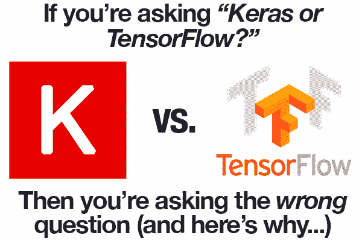
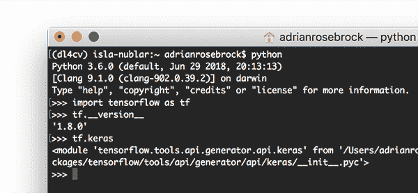
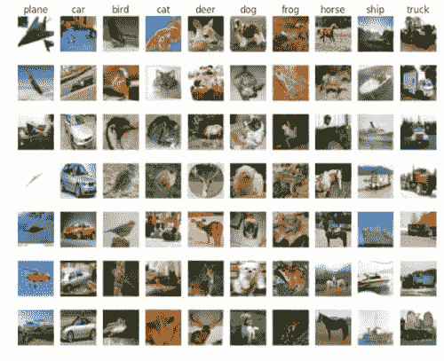
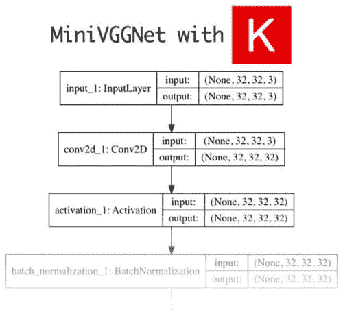
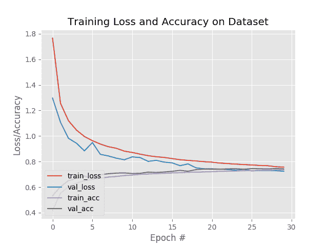
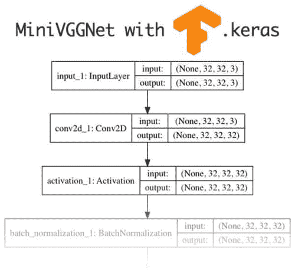

# keras vs tensor flow——哪个更好，我该学哪个？

> 原文：<https://pyimagesearch.com/2018/10/08/keras-vs-tensorflow-which-one-is-better-and-which-one-should-i-learn/>

 [](https://pyimagesearch.com/wp-content/uploads/2018/10/keras_vs_tensorflow_header.png)

我的项目应该使用 Keras vs. TensorFlow 吗？TensorFlow 和 Keras 哪个更好？我该不该投入时间学习 TensorFlow？还是 Keras？

以上是我在整个收件箱、社交媒体，甚至是与深度学习研究人员、实践者和工程师的面对面对话中听到的所有问题的例子。

我甚至收到了与我的书《用 Python 进行计算机视觉的深度学习[](https://pyimagesearch.com/deep-learning-computer-vision-python-book/)*相关的问题，读者们问我为什么“只”讨论 Keras——tensor flow 呢？*

 *很不幸。

因为这是一个*错误的*问题。

截至[2017 年年中](https://github.com/keras-team/keras/issues/5050)，Keras 实际上已经*完全采用*并整合到 TensorFlow 中。TensorFlow + Keras 集成意味着您可以:

1.  使用 Keras 的易用界面定义您的模型
2.  如果您需要(1)特定的 TensorFlow 功能或(2)需要实现 Keras 不支持但 TensorFlow 支持的自定义功能，请进入 TensorFlow。

简而言之:

**您可以将 TensorFlow 代码*直接*插入到您的 Keras 模型或训练管道中！**

不要误解我。我并不是说，对于某些应用程序，您不需要了解一点 TensorFlow 如果您正在进行新颖的研究并需要定制实现，这一点尤其正确。我只是说如果你在转动轮子:

1.  刚开始研究深度学习…
2.  试图决定下一个项目使用哪个库…
3.  想知道 Keras 或 TensorFlow 是否“更好”…

…那么是时候给这些轮子一些牵引力了。

别担心，开始吧。我的建议是使用 Keras 启动，然后进入 TensorFlow，获得您可能需要的任何特定功能。

在今天的帖子中，我将向您展示如何训练(1)一个使用严格 Keras 的神经网络和(2)一个使用 Keras + TensorFlow 集成(具有自定义功能)直接内置到 TensorFlow 库中的模型。

**要了解更多关于 Keras vs. Tensorflow 的信息，*请继续阅读！***

## keras vs tensor flow——哪个更好，我该学哪个？

在今天教程的剩余部分，我将继续讨论 Keras 与 TensorFlow 的争论，以及这个问题为什么是错误的。

从那里，我们将使用标准的`keras`模块和内置在 TensorFlow 中的`tf.keras`模块实现一个卷积神经网络(CNN)。

我们将在一个示例数据集上训练这些 CNN，然后检查结果——正如你将发现的那样，Keras 和 TensorFlow 和谐地生活在一起。

也许最重要的是，你将了解为什么 Keras 与 TensorFlow 的争论不再有意义。

### 如果你问的是“Keras vs. TensorFlow”，那你就问错问题了

[](https://pyimagesearch.com/wp-content/uploads/2018/10/keras_vs_tensorflow_wrong_question.jpg)

**Figure 1:** *“Should I use Keras or Tensorflow?”*

问你是否应该使用 Keras 或 TensorFlow 是一个错误的问题——事实上，*这个问题甚至不再有意义*。尽管 TensorFlow 宣布 Keras 将被集成到官方 TensorFlow 版本中已经一年多了，但我仍然对深度学习从业者的数量感到惊讶，他们不知道他们可以通过`tf.keras`子模块访问 Keras。

更重要的是，Keras + TensorFlow 集成是无缝的，允许您将原始 TensorFlow 代码直接放入 Keras 模型中。

**在 TensorFlow 中使用 Keras 可以让您两全其美:**

1.  您可以使用 Keras 提供的简单、直观的 API 来创建您的模型。
2.  Keras API 本身类似于 scikit-learn 的 API，可以说是机器学习 API 的“黄金标准”。
3.  Keras API 是模块化的、Pythonic 式的，并且非常容易使用。
4.  当你需要一个自定义的层实现，一个更复杂的损失函数等。，您可以进入 TensorFlow，让代码自动与您的 Keras 模型*集成*。

在前几年，深度学习研究人员、实践者和工程师经常必须做出选择:

1.  我应该选择易于使用，但可能难以定制的 Keras 库吗？
2.  或者，我是利用*更难的【TensorFlow API，编写更多数量级的代码，更不用说使用不太容易理解的 API 了？*

幸运的是，我们不用再做选择了。

如果你发现自己处于这样一种情况:问*“我应该使用 Keras 还是 TensorFlow？”*，退一步说——你问错问题了——你可以两者兼得。

### Keras 通过“tf.keras”模块内置到 TensorFlow 中

[](https://pyimagesearch.com/wp-content/uploads/2018/10/keras_vs_tensorflow_terminal.png)

**Figure 3:** As you can see, by importing TensorFlow (as `tf`) and subsequently calling `tf.keras`, I’ve demonstrated in a Python shell that Keras is actually part of TensorFlow.

将 Keras 包含在`tf.keras`中允许您使用标准 Keras 包，采用以下简单的前馈神经网络:

```py
# import the necessary packages
from keras.models import Sequential
from keras.layers.core import Dense
import tensorflow as tf

# define the 3072-1024-512-3 architecture using Keras
model = Sequential()
model.add(Dense(1024, input_shape=(3072,), activation="sigmoid"))
model.add(Dense(512, activation="sigmoid"))
model.add(Dense(10, activation="softmax"))

```

然后使用 TensorFlow 的`tf.keras`子模块实现相同的网络:

```py
# define the 3072-1024-512-3 architecture using tf.keras
model = tf.keras.models.Sequential()
model.add(tf.keras.layers.Dense(1024, input_shape=(3072,),
	activation="sigmoid"))
model.add(tf.keras.layers.Dense(512, activation="sigmoid"))
model.add(tf.keras.layers.Dense(10, activation="softmax"))

```

这是不是意味着你*有*可以用`tf.keras`？标准的 Keras 包现在过时了吗？不，当然不是。

作为一个库，Keras 仍将独立于 TensorFlow 运行*和*，因此两者在未来可能会有分歧；然而，鉴于谷歌官方支持 Keras 和 TensorFlow，这种分歧似乎*极不可能。***

 **重点是:

如果你习惯使用纯 Keras 编写代码，那就去做吧，*并坚持做下去*。

但是如果您发现自己在 TensorFlow 中工作，您应该开始利用 Keras API:

1.  它内置在 TensorFlow 中
2.  它更容易使用
3.  当您需要纯 TensorFlow 来实现特定的特性或功能时，它可以直接放入您的 Keras 模型中。

***不再有 Keras 对 TensorFlow 的争论*——你可以两者兼得，两全其美。**

### 我们的示例数据集

[](https://pyimagesearch.com/wp-content/uploads/2018/10/keras_vs_tensorflow_cifar10.jpg)

**Figure 4:** The CIFAR-10 dataset has 10 classes and is used for today’s demonstration ([image credit](https://www.cs.toronto.edu/~kriz/cifar.html)).

为了简单起见，我们将在 CIFAR-10 数据集上训练两个独立的卷积神经网络(CNN ),使用:

1.  Keras with a TensorFlow backend
2.  里面的喀喇斯子模`tf.keras`

我还将展示如何在实际的 Keras 模型中包含定制的 TensorFlow 代码。

CIFAR-10 数据集本身由 10 个独立的类组成，包含 50，000 幅训练图像和 10，000 幅测试图像。样品如图 4 中的**所示。**

### 我们的项目结构

我们今天的项目结构可以在终端中用`tree`命令查看:

```py
$ tree --dirsfirst
.
├── pyimagesearch
│   ├── __init__.py
│   ├── minivggnetkeras.py
│   └── minivggnettf.py
├── plot_keras.png
├── plot_tf.png
├── train_network_keras.py
└── train_network_tf.py

1 directory, 7 files

```

与这篇博文相关的下载中包含了`pyimagesearch`模块。它是*不* pip-installable，但是包含在 ***【下载】*** 中。让我们回顾一下模块中的两个重要 Python 文件:

*   `minivggnetkeras.py`:这是我们严格的 **Keras** 对`MiniVGGNet`的实现，基于`VGGNet`的深度学习模型。
*   `minivggnettf.py`:这是我们`MiniVGGNet`的 **TensorFlow + Keras** (即`tf.keras`)实现。

项目文件夹的根目录包含两个 Python 文件:

*   这是我们将使用 strict Keras 实现的第一个培训脚本。
*   `train_network_tf.py`:训练脚本的 TensorFlow + Keras 版本基本相同；我们将逐步介绍它，同时强调不同之处。

每个脚本还将生成各自的训练准确度/损失图:

*   `plot_keras.png`
*   `plot_tf.png`

正如你从目录结构中看到的，我们今天将展示 Keras 和 TensorFlow(使用`tf.keras`模块)的`MiniVGGNet`的实现+训练。

### 用 Keras 训练网络

[](https://pyimagesearch.com/wp-content/uploads/2018/10/keras_vs_tensorflow_lib_keras.jpg)

**Figure 5:** The MiniVGGNet CNN network architecture implemented using Keras.

训练我们的网络的第一步是在 Keras 中实现网络架构本身。

我假设你已经熟悉用 Keras 训练神经网络的基础知识——如果你不熟悉，请参考[这篇介绍性文章](https://pyimagesearch.com/2018/09/10/keras-tutorial-how-to-get-started-with-keras-deep-learning-and-python/)。

打开`minivggnetkeras.py`文件并插入以下代码:

```py
# import the necessary packages
from keras.layers.normalization import BatchNormalization
from keras.layers.convolutional import Conv2D
from keras.layers.convolutional import MaxPooling2D
from keras.layers.core import Activation
from keras.layers.core import Dropout
from keras.layers.core import Dense
from keras.layers import Flatten
from keras.layers import Input
from keras.models import Model

```

我们从构建模型所需的大量 Keras 导入开始。

从那里，我们定义了我们的`MiniVGGNetKeras`类:

```py
class MiniVGGNetKeras:
	@staticmethod
	def build(width, height, depth, classes):
		# initialize the input shape and channel dimension, assuming
		# TensorFlow/channels-last ordering
		inputShape = (height, width, depth)
		chanDim = -1

		# define the model input
		inputs = Input(shape=inputShape)

```

我们在**行 12** 上定义`build`方法，定义我们的`inputShape`和`input`。我们将假设“信道最后”排序，这就是为什么`depth`是`inputShape`元组中的最后一个值。

让我们开始定义卷积神经网络的主体:

```py
		# first (CONV => RELU) * 2 => POOL layer set
		x = Conv2D(32, (3, 3), padding="same")(inputs)
		x = Activation("relu")(x)
		x = BatchNormalization(axis=chanDim)(x)
		x = Conv2D(32, (3, 3), padding="same")(x)
		x = Activation("relu")(x)
		x = BatchNormalization(axis=chanDim)(x)
		x = MaxPooling2D(pool_size=(2, 2))(x)
		x = Dropout(0.25)(x)

		# second (CONV => RELU) * 2 => POOL layer set
		x = Conv2D(64, (3, 3), padding="same")(x)
		x = Activation("relu")(x)
		x = BatchNormalization(axis=chanDim)(x)
		x = Conv2D(64, (3, 3), padding="same")(x)
		x = Activation("relu")(x)
		x = BatchNormalization(axis=chanDim)(x)
		x = MaxPooling2D(pool_size=(2, 2))(x)
		x = Dropout(0.25)(x)

```

检查代码块，您会注意到我们在应用池层以减少卷的空间维度之前，堆叠了一系列卷积、ReLU 激活和批量标准化层。辍学也适用于减少过度拟合。

对于图层类型和术语的简要回顾，请务必查看我以前的 Keras 教程。而为了深入学习，你应该拿起一本我的深度学习书， [*用 Python 进行计算机视觉的深度学习*](https://pyimagesearch.com/deep-learning-computer-vision-python-book/) 。

让我们将全连接(FC)层添加到网络中:

```py
		# first (and only) set of FC => RELU layers
		x = Flatten()(x)
		x = Dense(512)(x)
		x = Activation("relu")(x)
		x = BatchNormalization()(x)
		x = Dropout(0.5)(x)

		# softmax classifier
		x = Dense(classes)(x)
		x = Activation("softmax")(x)

		# create the model
		model = Model(inputs, x, name="minivggnet_keras")

		# return the constructed network architecture
		return model

```

我们的 FC 和 Softmax 分类器被附加到网络上。然后我们定义神经网络`model`和`return`给调用函数。

现在我们已经在 Keras 中实现了 CNN，让我们**创建将用于训练它的驱动脚本**。

打开`train_network_keras.py`并插入以下代码:

```py
# set the matplotlib backend so figures can be saved in the background
import matplotlib
matplotlib.use("Agg")

# import the necessary packages
from pyimagesearch.minivggnetkeras import MiniVGGNetKeras
from sklearn.preprocessing import LabelBinarizer
from sklearn.metrics import classification_report
from keras.optimizers import SGD
from keras.datasets import cifar10
import matplotlib.pyplot as plt
import numpy as np
import argparse

# construct the argument parser and parse the arguments
ap = argparse.ArgumentParser()
ap.add_argument("-p", "--plot", type=str, default="plot_keras.png",
	help="path to output loss/accuracy plot")
args = vars(ap.parse_args())

```

我们在**线 2-13** 上`import`我们需要的包裹。

请注意以下事项:

*   在第 3 行的**上，Matplotlib 的后端被设置为`"Agg"`，这样我们可以将我们的训练图保存为图像文件。**
*   在第 6 行的**上，我们导入了`MiniVGGNetKeras`类。**
*   我们使用 scikit-learn 的`LabelBinarizer`进行“一次性”编码，使用它的`classification_report`打印分类精度统计数据(**第 7 行和第 8 行**)。
*   我们的数据集在**行 10** 方便的导入。如果你想学习如何使用自定义数据集，我建议你参考之前的 [Keras 教程](https://pyimagesearch.com/2018/09/10/keras-tutorial-how-to-get-started-with-keras-deep-learning-and-python/)或这篇展示[如何使用 Keras](https://pyimagesearch.com/2018/04/16/keras-and-convolutional-neural-networks-cnns/) 的文章。

我们唯一的命令行参数(我们的输出`--plot`路径)在**的第 16-19 行**被解析。

让我们加载 CIFAR-10 并对标签进行编码:

```py
# load the training and testing data, then scale it into the
# range [0, 1]
print("[INFO] loading CIFAR-10 data...")
split = cifar10.load_data()
((trainX, trainY), (testX, testY)) = split
trainX = trainX.astype("float") / 255.0
testX = testX.astype("float") / 255.0

# convert the labels from integers to vectors
lb = LabelBinarizer()
trainY = lb.fit_transform(trainY)
testY = lb.transform(testY)

# initialize the label names for the CIFAR-10 dataset
labelNames = ["airplane", "automobile", "bird", "cat", "deer",
	"dog", "frog", "horse", "ship", "truck"]

```

我们在**行 24 和 25** 上加载和提取我们的训练和测试分割，并在**行 26 和 27** 上将数据转换为浮点+比例。

我们对标签进行编码，并在第 30-36 行的**上初始化实际的`labelNames`。**

接下来，我们来训练模型:

```py
# initialize the initial learning rate, total number of epochs to
# train for, and batch size
INIT_LR = 0.01
EPOCHS = 30
BS = 32

# initialize the optimizer and model
print("[INFO] compiling model...")
opt = SGD(lr=INIT_LR, decay=INIT_LR / EPOCHS)
model = MiniVGGNetKeras.build(width=32, height=32, depth=3,
	classes=len(labelNames))
model.compile(loss="categorical_crossentropy", optimizer=opt,
	metrics=["accuracy"])

# train the network
print("[INFO] training network for {} epochs...".format(EPOCHS))
H = model.fit(trainX, trainY, validation_data=(testX, testY),
	batch_size=BS, epochs=EPOCHS, verbose=1)

```

设定训练参数和优化方法(**第 40-46 行**)。

然后我们用我们的`MiniVGGNetKeras.build`方法初始化我们的`model`和`compile`(T3)它(第 47-50 行)。

随后，我们开始训练程序(**行 54 和 55** )。

让我们评估网络并生成一个图:

```py
# evaluate the network
print("[INFO] evaluating network...")
predictions = model.predict(testX, batch_size=32)
print(classification_report(testY.argmax(axis=1),
	predictions.argmax(axis=1), target_names=labelNames))

# plot the training loss and accuracy
plt.style.use("ggplot")
plt.figure()
plt.plot(np.arange(0, EPOCHS), H.history["loss"], label="train_loss")
plt.plot(np.arange(0, EPOCHS), H.history["val_loss"], label="val_loss")
plt.plot(np.arange(0, EPOCHS), H.history["acc"], label="train_acc")
plt.plot(np.arange(0, EPOCHS), H.history["val_acc"], label="val_acc")
plt.title("Training Loss and Accuracy on Dataset")
plt.xlabel("Epoch #")
plt.ylabel("Loss/Accuracy")
plt.legend(loc="lower left")
plt.savefig(args["plot"])

```

在这里，我们根据数据的测试分割来评估网络，并生成一个`classification_report`。最后，我们组装并导出我们的图。

***注意:**通常，我会在这里序列化并导出我们的模型，以便它可以在图像或视频处理脚本中使用，但我们今天不打算这么做，因为这超出了本教程的范围。*

要运行我们的脚本，请确保使用博客文章的 ***【下载】*** 部分下载源代码。

从那里，打开一个终端并执行以下命令:

```py
$ python train_network_keras.py
Using TensorFlow backend.
[INFO] loading CIFAR-10 data...
[INFO] compiling model...
[INFO] training network for 30 epochs...
Train on 50000 samples, validate on 10000 samples
Epoch 1/30
50000/50000 [==============================] - 328s 7ms/step - loss: 1.7652 - acc: 0.4183 - val_loss: 1.2965 - val_acc: 0.5326
Epoch 2/30
50000/50000 [==============================] - 325s 6ms/step - loss: 1.2549 - acc: 0.5524 - val_loss: 1.1068 - val_acc: 0.6036
Epoch 3/30
50000/50000 [==============================] - 324s 6ms/step - loss: 1.1191 - acc: 0.6030 - val_loss: 0.9818 - val_acc: 0.6509
...
Epoch 28/30
50000/50000 [==============================] - 337s 7ms/step - loss: 0.7673 - acc: 0.7315 - val_loss: 0.7307 - val_acc: 0.7422
Epoch 29/30
50000/50000 [==============================] - 330s 7ms/step - loss: 0.7594 - acc: 0.7346 - val_loss: 0.7284 - val_acc: 0.7447
Epoch 30/30
50000/50000 [==============================] - 324s 6ms/step - loss: 0.7568 - acc: 0.7359 - val_loss: 0.7244 - val_acc: 0.7432
[INFO] evaluating network...
             precision    recall  f1-score   support

   airplane       0.81      0.73      0.77      1000
 automobile       0.92      0.80      0.85      1000
       bird       0.68      0.56      0.61      1000
        cat       0.56      0.55      0.56      1000
       deer       0.64      0.77      0.70      1000
        dog       0.69      0.64      0.66      1000
       frog       0.72      0.88      0.79      1000
      horse       0.88      0.72      0.79      1000
       ship       0.80      0.90      0.85      1000
      truck       0.78      0.89      0.83      1000

avg / total       0.75      0.74      0.74     10000

```

在我的 CPU 上，每个时期需要 5 分多一点的时间来完成。

[](https://pyimagesearch.com/wp-content/uploads/2018/10/plot_keras.png)

**Figure 6:** The accuracy/loss training curves are plotted with Matplotlib. This network was trained with Keras.

正如我们从终端输出中看到的，我们在测试集上获得了 75%的准确率**——当然不是最先进的；但是，这远远好于随机猜测(1/10)。**

 **对于一个小网络来说，我们的准确率其实已经相当不错了！

正如我们的输出图在**图 6** 中所示，没有发生过拟合。

### 用 TensorFlow 和`tf.keras`训练网络

[](https://pyimagesearch.com/wp-content/uploads/2018/10/keras_vs_tensorflow_lib_tf.jpg)

**Figure 7:** The MiniVGGNet CNN architecture built with `tf.keras` (a module which is built into TensorFlow) is identical to the model that we built with Keras directly. They are one and the same with the exception of the activation function which I have changed for demonstration purposes.

现在，我们已经使用 Keras 库实现并训练了一个简单的 CNN，让我们学习如何:

1.  使用 TensorFlow 的`tf.keras`实现*相同的*网络架构
2.  在我们的 Keras 模型中包含一个张量流激活函数*，它是*而不是*在 Keras 中实现的。*

首先，打开`minivggnettf.py`文件，我们将实现我们的 TensorFlow 版本的`MiniVGGNet`:

```py
# import the necessary packages
import tensorflow as tf

class MiniVGGNetTF:
	@staticmethod
	def build(width, height, depth, classes):
		# initialize the input shape and channel dimension, assuming
		# TensorFlow/channels-last ordering
		inputShape = (height, width, depth)
		chanDim = -1

		# define the model input
		inputs = tf.keras.layers.Input(shape=inputShape)

		# first (CONV => RELU) * 2 => POOL layer set
		x = tf.keras.layers.Conv2D(32, (3, 3), padding="same")(inputs)
		x = tf.keras.layers.Activation("relu")(x)
		x = tf.keras.layers.BatchNormalization(axis=chanDim)(x)
		x = tf.keras.layers.Conv2D(32, (3, 3), padding="same")(x)
		x = tf.keras.layers.Lambda(lambda t: tf.nn.crelu(x))(x)
		x = tf.keras.layers.BatchNormalization(axis=chanDim)(x)
		x = tf.keras.layers.MaxPooling2D(pool_size=(2, 2))(x)
		x = tf.keras.layers.Dropout(0.25)(x)

		# second (CONV => RELU) * 2 => POOL layer set
		x = tf.keras.layers.Conv2D(64, (3, 3), padding="same")(x)
		x = tf.keras.layers.Lambda(lambda t: tf.nn.crelu(x))(x)
		x = tf.keras.layers.BatchNormalization(axis=chanDim)(x)
		x = tf.keras.layers.Conv2D(64, (3, 3), padding="same")(x)
		x = tf.keras.layers.Lambda(lambda t: tf.nn.crelu(x))(x)
		x = tf.keras.layers.BatchNormalization(axis=chanDim)(x)
		x = tf.keras.layers.MaxPooling2D(pool_size=(2, 2))(x)
		x = tf.keras.layers.Dropout(0.25)(x)

		# first (and only) set of FC => RELU layers
		x = tf.keras.layers.Flatten()(x)
		x = tf.keras.layers.Dense(512)(x)
		x = tf.keras.layers.Lambda(lambda t: tf.nn.crelu(x))(x)
		x = tf.keras.layers.BatchNormalization()(x)
		x = tf.keras.layers.Dropout(0.5)(x)

		# softmax classifier
		x = tf.keras.layers.Dense(classes)(x)
		x = tf.keras.layers.Activation("softmax")(x)

		# create the model
		model = tf.keras.models.Model(inputs, x, name="minivggnet_tf")

		# return the constructed network architecture
		return model

```

在这个文件中，请注意，导入被替换为一行(**行 2** )。`tf.keras`子模块包含我们可以直接调用的所有 Keras 功能。

我想提醒大家注意一下`Lambda`层，它们用于插入一个**自定义激活函数**、CRELU(级联 ReLUs)，基于尚等人的论文[、【通过级联整流线性单元](https://arxiv.org/abs/1603.05201) 理解和改进卷积神经网络。这些行用黄色突出显示。

**CRELUs 是在 Keras 中实现的*而不是* *，而是在 TensorFlow*** 中实现的*——通过使用 TensorFlow 和`tf.keras`，我们只需一行代码*就可以将 CRELUs 添加到我们的 Keras 模型*中。*

***注:**CRELU 有两个输出，一个正 RELU 和一个负 ReLU 串联在一起。对于正的 x 值，CRELU 将返回[x，0]，而对于负的 x 值，CRELU 将返回[0，x]。有关更多信息，[请参考尚等人的出版物。](https://arxiv.org/abs/1603.05201)*

下一步是实现我们的 TensorFlow + Keras **驱动脚本**来训练`MiniVGGNetTF`。

打开`train_network_tf.py`并插入以下代码:

```py
# set the matplotlib backend so figures can be saved in the background
import matplotlib
matplotlib.use("Agg")

# import the necessary packages
from pyimagesearch.minivggnettf import MiniVGGNetTF
from sklearn.preprocessing import LabelBinarizer
from sklearn.metrics import classification_report
import matplotlib.pyplot as plt
import tensorflow as tf
import numpy as np
import argparse

# construct the argument parser and parse the arguments
ap = argparse.ArgumentParser()
ap.add_argument("-p", "--plot", type=str, default="plot_tf.png",
	help="path to output loss/accuracy plot")
args = vars(ap.parse_args())

# load the training and testing data, then scale it into the
# range [0, 1]
print("[INFO] loading CIFAR-10 data...")
split = tf.keras.datasets.cifar10.load_data()
((trainX, trainY), (testX, testY)) = split
trainX = trainX.astype("float") / 255.0
testX = testX.astype("float") / 255.0

# convert the labels from integers to vectors
lb = LabelBinarizer()
trainY = lb.fit_transform(trainY)
testY = lb.transform(testY)

# initialize the label names for the CIFAR-10 dataset
labelNames = ["airplane", "automobile", "bird", "cat", "deer",
	"dog", "frog", "horse", "ship", "truck"]

```

我们的进口货物在**2-12 号线**处理。与我们的 Keras 训练脚本相比，唯一的变化包括导入`MiniVGGNetTF`类和导入`tensorflow as tf`而不是 Keras。

我们的命令行参数在第 15-18 行的**处被解析。**

然后，我们像以前一样将数据加载到第 23 行**上。**

其余的行是相同的——提取训练/测试分割并编码我们的标签。

让我们训练我们的模型:

```py
# initialize the initial learning rate, total number of epochs to
# train for, and batch size
INIT_LR = 0.01
EPOCHS = 30
BS = 32

# initialize the optimizer and model
print("[INFO] compiling model...")
opt = tf.keras.optimizers.SGD(lr=INIT_LR, decay=INIT_LR / EPOCHS)
model = MiniVGGNetTF.build(width=32, height=32, depth=3,
	classes=len(labelNames))
model.compile(loss="categorical_crossentropy", optimizer=opt,
	metrics=["accuracy"])

# train the network
print("[INFO] training network for {} epochs...".format(EPOCHS))
H = model.fit(trainX, trainY, validation_data=(testX, testY),
	batch_size=BS, epochs=EPOCHS, verbose=1)

# evaluate the network
print("[INFO] evaluating network...")
predictions = model.predict(testX, batch_size=32)
print(classification_report(testY.argmax(axis=1),
	predictions.argmax(axis=1), target_names=labelNames))

# plot the training loss and accuracy
plt.style.use("ggplot")
plt.figure()
plt.plot(np.arange(0, EPOCHS), H.history["loss"], label="train_loss")
plt.plot(np.arange(0, EPOCHS), H.history["val_loss"], label="val_loss")
plt.plot(np.arange(0, EPOCHS), H.history["acc"], label="train_acc")
plt.plot(np.arange(0, EPOCHS), H.history["val_acc"], label="val_acc")
plt.title("Training Loss and Accuracy on Dataset")
plt.xlabel("Epoch #")
plt.ylabel("Loss/Accuracy")
plt.legend(loc="lower left")
plt.savefig(args["plot"])

```

在第**行第 39-54** 行进行的培训过程是相同的，除了那些用黄色突出显示的，这里只注意到微小的变化。

从那里我们评估并绘制数据(**第 58-73 行**)。

如您所见，我们已经实现了完全相同的培训过程，只是现在我们使用了`tf.keras`。

要运行这个脚本，请确保您使用博文的 ***【下载】*** 部分来获取代码。

从那里，打开一个终端并执行以下命令:

```py
$ python train_network_tf.py
[INFO] loading CIFAR-10 data...
[INFO] compiling model...
[INFO] training network for 30 epochs...
Train on 50000 samples, validate on 10000 samples
Epoch 1/30
50000/50000 [==============================] - 457s 9ms/step - loss: 1.7024 - acc: 0.4369 - val_loss: 1.3181 - val_acc: 0.5253
Epoch 2/30
50000/50000 [==============================] - 441s 9ms/step - loss: 1.1981 - acc: 0.5761 - val_loss: 1.1025 - val_acc: 0.6072
Epoch 3/30
50000/50000 [==============================] - 441s 9ms/step - loss: 1.0506 - acc: 0.6317 - val_loss: 1.0647 - val_acc: 0.6227
...
Epoch 28/30
50000/50000 [==============================] - 367s 7ms/step - loss: 0.6798 - acc: 0.7611 - val_loss: 0.7161 - val_acc: 0.7479
Epoch 29/30
50000/50000 [==============================] - 364s 7ms/step - loss: 0.6732 - acc: 0.7639 - val_loss: 0.6969 - val_acc: 0.7544
Epoch 30/30
50000/50000 [==============================] - 366s 7ms/step - loss: 0.6743 - acc: 0.7641 - val_loss: 0.6973 - val_acc: 0.7550
[INFO] evaluating network...
             precision    recall  f1-score   support

   airplane       0.86      0.69      0.76      1000
 automobile       0.93      0.79      0.85      1000
       bird       0.75      0.59      0.66      1000
        cat       0.59      0.55      0.57      1000
       deer       0.65      0.78      0.71      1000
        dog       0.70      0.66      0.68      1000
       frog       0.67      0.93      0.78      1000
      horse       0.90      0.75      0.82      1000
       ship       0.81      0.91      0.86      1000
      truck       0.80      0.89      0.84      1000

avg / total       0.76      0.76      0.75     10000

```

训练完成后，您会看到一个类似于下图的训练图:

[](https://pyimagesearch.com/wp-content/uploads/2018/10/plot_tf.png)

**Figure 8:** The deep learning training plot shows our accuracy and loss curves. The CNN was trained with the Keras module which is built into TensorFlow.

通过将 CRELU 换成 RELU 激活函数，我们获得了 76%的准确度**；然而，这 1%的增加可能是由于网络中权重的随机初始化——需要进一步的交叉验证实验来证明 CRELU 确实对准确性的增加负责。**

 ****然而，原始精度是*而不是*这一节的重要方面。**

**相反，请关注我们如何在 Keras 模型的内替换标准 Keras 激活函数*的 TensorFlow 激活函数！***

您可以使用自己的自定义激活函数、损失/成本函数或层实现来做同样的事情。

## 摘要

在今天的博文中，我们讨论了围绕 Keras 与 TensorFlow 的问题，包括:

*   我的项目应该使用 Keras vs. TensorFlow 吗？
*   Is TensorFlow or Keras better?
*   我该不该投入时间学习 TensorFlow？还是 Keras？

最终，我们发现试图在 Keras 和 TensorFlow 之间做出决定变得越来越无关紧要。

Keras 库已经通过`tf.keras`模块直接集成到 TensorFlow 中。

**本质上，您可以使用易于使用的 Keras API 对您的模型和训练过程进行编码，然后使用 pure TensorFlow 对模型或训练过程进行自定义实现！**

如果你正在努力尝试开始深度学习，试图为你的下一个项目在 Keras 和 TensorFlow 之间做出决定，或者只是想知道 Keras 和 TensorFlow 是否“更好”… *那么是时候寻求一些动力了。*

我给你的建议很简单:

*   ***刚入门。***
*   在您的 Python 项目中键入`import keras`或`import tensorflow as tf`(这样您就可以访问`tf.keras`)，然后*开始工作*。
*   TensorFlow 可以直接集成到您的模型或培训流程中，因此无需比较特性、功能或易用性**—*tensor flow 和 Keras 的所有*都可供您在项目中使用。**

我希望你喜欢今天的博文！

如果你对计算机视觉和深度学习入门感兴趣，我建议你看一下我的书， **[*用 Python 进行计算机视觉的深度学习*](https://pyimagesearch.com/deep-learning-computer-vision-python-book/)** 。在书中，我利用 Keras 和 TensorFlow 来教你应用于计算机视觉应用的深度学习。

**如果您想下载今天教程的源代码(并在以后的博客文章在 PyImageSearch 上发表时得到通知)，*只需在下面的表格中输入您的电子邮件地址！**********