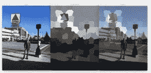
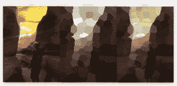
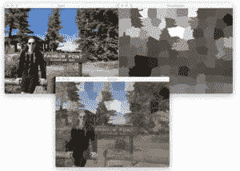

# 用 OpenCV 和 Python 标记超像素色彩

> 原文：<https://pyimagesearch.com/2017/06/26/labeling-superpixel-colorfulness-opencv-python/>

[](https://pyimagesearch.com/wp-content/uploads/2017/06/example_output_02.jpg)在我们上一篇关于[计算图像色彩度](https://pyimagesearch.com/2017/06/05/computing-image-colorfulness-with-opencv-and-python/)的帖子发表后，PyImageSearch 的读者 Stephan 在教程上留下了一条评论，询问是否有一种方法可以计算图像(而不是整个图像)的*特定区域*的色彩度。

解决这个问题有多种方法。第一种可能是应用一个[滑动窗口](https://pyimagesearch.com/2015/03/23/sliding-windows-for-object-detection-with-python-and-opencv/)在图像上循环，并计算每个 ROI 的色彩分数。如果需要在多个尺度上计算特定区域的色彩，甚至可以应用[图像金字塔](https://pyimagesearch.com/2015/03/16/image-pyramids-with-python-and-opencv/)。

然而，更好的方法是使用[超像素](https://pyimagesearch.com/2014/07/28/a-slic-superpixel-tutorial-using-python/)。通过分割算法提取超像素，该算法基于像素的局部颜色/纹理将像素分组为(非矩形)区域。在流行的 SLIC 超像素算法的情况下，基于 L*a*b*颜色空间中的本地版本的 [k-means 聚类算法](https://pyimagesearch.com/2014/05/26/opencv-python-k-means-color-clustering/)对图像区域进行分组。

鉴于超像素将为我们提供比滑动窗口更自然的输入图像分割，我们可以通过以下方式计算图像中特定区域的色彩:

1.  对输入图像应用超像素分割。
2.  分别在每个超像素上循环，并计算它们各自的色彩分数。
3.  维护包含每个超像素的色彩分数的掩模。

基于这个遮罩，我们可以看到图像中最丰富多彩的区域。色彩丰富的图像区域将具有较大的色彩度量分数，而色彩不丰富的区域将具有较小的值。

**要了解更多关于超像素和计算图像色彩的信息，*请继续阅读。***

## 用 OpenCV 和 Python 标记超像素色彩

在这篇博文的第一部分，我们将学习如何应用 SLIC 算法从输入图像中提取超像素。阿坎塔等人在 2010 年发表的原始文章*[【SLIC super pixels】](http://www.kev-smith.com/papers/SLIC_Superpixels.pdf)*详细介绍了该方法和技术。在这篇[的博客文章](https://pyimagesearch.com/2014/07/28/a-slic-superpixel-tutorial-using-python/)中，我们还简要介绍了 SLIC 超像素，以方便那些想要更简洁地了解该算法的读者。

给定这些超像素，我们将逐个循环并计算它们的色彩分数，注意计算特定区域的色彩度量，而不是整个图像的色彩度量(正如我们在[之前的帖子](https://pyimagesearch.com/2017/06/05/computing-image-colorfulness-with-opencv-and-python/)中所做的)。

在我们实现脚本之后，我们将把超像素+图像色彩的组合应用到一组输入图像上。

### 使用超像素进行分割

让我们从在您最喜欢的编辑器或 IDE 中打开一个新文件开始，将其命名为`colorful_regions.py`，并插入以下代码:

```py
# import the necessary packages
from skimage.exposure import rescale_intensity
from skimage.segmentation import slic
from skimage.util import img_as_float
from skimage import io
import numpy as np
import argparse
import cv2

```

第一个**行 1-8** 处理我们的导入——如你所见，我们在本教程中大量使用了几个 [scikit-image 函数](http://scikit-image.org/)。

`slic`函数将用于计算超像素([sci kit-图像文档](http://scikit-image.org/docs/dev/api/skimage.segmentation.html#skimage.segmentation.slic))。

接下来，我们将定义我们的色彩度度量函数，从[上一篇文章](https://pyimagesearch.com/2017/06/05/computing-image-colorfulness-with-opencv-and-python/)开始，我们对它做了一个小的修改:

```py
def segment_colorfulness(image, mask):
	# split the image into its respective RGB components, then mask
	# each of the individual RGB channels so we can compute
	# statistics only for the masked region
	(B, G, R) = cv2.split(image.astype("float"))
	R = np.ma.masked_array(R, mask=mask)
	G = np.ma.masked_array(B, mask=mask)
	B = np.ma.masked_array(B, mask=mask)

	# compute rg = R - G
	rg = np.absolute(R - G)

	# compute yb = 0.5 * (R + G) - B
	yb = np.absolute(0.5 * (R + G) - B)

	# compute the mean and standard deviation of both `rg` and `yb`,
	# then combine them
	stdRoot = np.sqrt((rg.std() ** 2) + (yb.std() ** 2))
	meanRoot = np.sqrt((rg.mean() ** 2) + (yb.mean() ** 2))

	# derive the "colorfulness" metric and return it
	return stdRoot + (0.3 * meanRoot)

```

**第 10-31 行**表示我们的色彩度量函数，该函数已经被适配成计算图像的*特定区域*的色彩。

该区域可以是任何形状，因为我们利用了 [NumPy 掩码数组](https://docs.scipy.org/doc/numpy-1.12.0/reference/maskedarray.generic.html)——只有掩码的像素部分将被包括在计算中。

对于特定`image`的指定`mask`区域，`segment_colorfulness`功能执行以下任务:

1.  将图像分割成 RGB 分量通道(**第 14 行**)。
2.  使用`mask`(针对每个通道)屏蔽`image`，以便只在指定的区域进行着色——在这种情况下，该区域将是我们的超像素(**第 15-17 行**)。
3.  使用`R`和`G`组件计算`rg` ( **第 20 行**)。
4.  使用 RGB 分量计算`yb` ( **行 23** )。
5.  计算`rg`和`yb`的平均值和标准偏差，同时合并它们(**第 27 行和第 28 行**)。
6.  对指标进行最终计算，并将其返回( **Line 31** )给调用函数。

既然已经定义了关键的 colorfulness 函数，下一步就是解析我们的命令行参数:

```py
# construct the argument parse and parse the arguments
ap = argparse.ArgumentParser()
ap.add_argument("-i", "--image", required=True,
	help="path to input image")
ap.add_argument("-s", "--segments", type=int, default=100,
	help="# of superpixels")
args = vars(ap.parse_args())

```

在第 34-39 行中，我们利用`argparse`来定义两个参数:

1.  `--image`:我们输入图像的路径。
2.  `--segments`:超像素数量。 *SLIC 超像素*论文展示了将图像分解成不同数量超像素的例子。这个参数很有意思(因为它控制着你生成的超像素的粒度水平)；然而，我们将与一个`default=100`一起工作。该值越小，超像素越少越大，从而使算法运行得更快。段的数量越大，分段就越精细，但是 SLIC 将花费更长的时间来运行(由于需要计算更多的聚类)。

现在是时候将图像加载到内存中，为我们的可视化分配空间，并计算 SLIC 超像素分割:

```py
# load the image in OpenCV format so we can draw on it later, then
# allocate memory for the superpixel colorfulness visualization
orig = cv2.imread(args["image"])
vis = np.zeros(orig.shape[:2], dtype="float")

# load the image and apply SLIC superpixel segmentation to it via
# scikit-image
image = io.imread(args["image"])
segments = slic(img_as_float(image), n_segments=args["segments"],
	slic_zero=True)

```

在**的第 43** 行，我们将命令行参数`--image`作为`orig` (OpenCV 格式)加载到内存中。

按照这个步骤，我们为可视化图像`vis`分配与原始输入图像具有相同形状(宽度和高度)的内存。

接下来，我们将命令行参数`--image`作为`image`加载到内存中，这次是 scikit-image 格式。我们在这里使用 scikit-image 的`io.imread`的原因是因为 OpenCV 以 BGR 顺序加载图像，而不是 RGB 格式(scikit-image 就是这样)。假设我们的图像是 RGB 格式，在超像素生成过程*中，`slic`函数会将我们的输入`image`转换到 L*a*b*颜色空间。*

因此我们有两个选择:

1.  用 OpenCV 加载图像，克隆它，然后交换通道的顺序。
2.  只需使用 scikit-image 加载原始图像的副本。

这两种方法都是有效的，并且会产生相同的输出。

超像素是通过调用`slic`来计算的，其中我们指定了`image`、`n_segments`和`slic_zero`开关。指定`slic_zero=True`表明我们想要使用 SLIC 的零参数版本，这是对原始算法的扩展，不需要我们手动调整算法的参数。对于脚本的其余部分，我们将超像素称为`segments`。

现在让我们计算每个超像素的色彩:

```py
# loop over each of the unique superpixels
for v in np.unique(segments):
	# construct a mask for the segment so we can compute image
	# statistics for *only* the masked region
	mask = np.ones(image.shape[:2])
	mask[segments == v] = 0

	# compute the superpixel colorfulness, then update the
	# visualization array
	C = segment_colorfulness(orig, mask)
	vis[segments == v] = C

```

我们从循环第 52 条线上的每一个`segments`开始。

**线 56 和 57** 负责为当前超像素构建一个`mask`。`mask`将与我们的输入图像具有相同的宽度和高度，并将(最初)填充一个 1 的数组(**第 56 行**)。

请记住，当使用 NumPy 掩码数组时，如果相应的`mask`值被设置为*零*(意味着像素*未被掩码*)，则数组中的给定条目仅*包含在计算中。如果`mask`中的值是*一个*，那么该值被假定为*屏蔽*并因此被忽略。*

这里我们最初将所有像素设置为*屏蔽*，然后仅将当前超像素的像素部分设置为*未屏蔽* ( **第 57 行**)。

使用我们的`orig`图像和我们的`mask`作为`segment_colorfulness`的参数，我们可以计算`C`，这是超像素的色彩(**线 61** )。

然后，我们用值`C` ( **行 62** )更新我们的可视化数组`vis`。

至此，我们已经回答了 PyImageSearch 读者 Stephan 的问题——我们已经计算了图像不同区域的色彩。

自然，我们希望看到我们的结果，所以让我们继续为输入图像中最/最不鲜艳的区域构建一个透明的叠加可视化:

```py
# scale the visualization image from an unrestricted floating point
# to unsigned 8-bit integer array so we can use it with OpenCV and
# display it to our screen
vis = rescale_intensity(vis, out_range=(0, 255)).astype("uint8")

# overlay the superpixel colorfulness visualization on the original
# image
alpha = 0.6
overlay = np.dstack([vis] * 3)
output = orig.copy()
cv2.addWeighted(overlay, alpha, output, 1 - alpha, 0, output)

```

由于`vis`目前是浮点数组，所以有必要将其重新缩放为典型的 8 位无符号整数*【0-255】*数组。这很重要，这样我们就可以用 OpenCV 在屏幕上显示输出图像。我们通过使用**行 67** 上的`rescale_intensity`函数(来自`skimage.exposure`)来实现这一点。

现在我们将在原始图像上叠加超像素色彩可视化。我们已经讨论过透明叠加和`cv2.addWeighted`(以及相关参数)，所以请参考[这篇博文](https://pyimagesearch.com/2016/03/07/transparent-overlays-with-opencv/)了解更多关于透明叠加是如何构建的细节。

最后，让我们在屏幕上显示图像，并结束这个脚本:

```py
# show the output images
cv2.imshow("Input", orig)
cv2.imshow("Visualization", vis)
cv2.imshow("Output", output)
cv2.waitKey(0)

```

我们将使用`cv2.imshow`在屏幕上显示三幅图像，包括:

1.  `orig`:我们的输入图像。
2.  `vis`:我们的可视化图像(即，每个超像素区域的色彩水平)。
3.  `output`:我们的输出图像。

### 超像素和色彩度量结果

让我们看看 Python 脚本的运行情况——打开一个终端，`workon`您的虚拟环境(如果您正在使用的话)(强烈推荐),并输入以下命令:

```py
$ python colorful_regions.py --image images/example_01.jpg

```

[](https://pyimagesearch.com/wp-content/uploads/2017/06/example_output_01.jpg)

**Figure 1:** Computing a region-based colorfulness score using superpixel segmentation.

在*左边*你可以看到原始输入图像，一张我自己探索[羚羊峡谷](https://en.wikipedia.org/wiki/Antelope_Canyon)的照片，可以说是美国最美丽的狭槽峡谷。在这里，我们可以看到由于从上方过滤进来的光线而产生的颜色混合。

在*中间的*中，我们对 100 个超像素中的每一个进行了计算可视化。该可视化中的深色区域指的是*色彩较淡的*区域，而浅色区域表示*色彩较浓的*。

在这里，我们可以看到最不鲜艳的区域在峡谷壁的周围，最靠近相机——这是光线最少的地方。

输入图像中色彩最丰富的区域是光线直接到达峡谷内部的地方，像烛光一样照亮了部分墙壁。

最后，在*右侧*我们的原始输入图像上覆盖了色彩可视化效果——该图像使我们能够更容易地识别图像中色彩最丰富/最不丰富的区域。

下面这张照片是我在波士顿的照片，站在标志性的 Citgo 标志前俯瞰肯莫尔广场:

```py
$ python colorful_regions.py --image images/example_02.jpg

```

[](https://pyimagesearch.com/wp-content/uploads/2017/06/example_output_02.jpg)

**Figure 2:** Using superpixels, we can first segment our image, and then compute a colorfulness score for each region.

在这里，我们可以看到图像中色彩最淡的区域位于底部，阴影遮挡了人行道的大部分。更丰富多彩的地区可以发现对标志和天空本身。

最后，这里有一张来自彩虹点的照片，彩虹点是[布莱斯峡谷的最高海拔:](https://en.wikipedia.org/wiki/Bryce_Canyon_National_Park)

```py
$ python colorful_regions.py --image images/example_03.jpg

```

[](https://pyimagesearch.com/wp-content/uploads/2017/06/example_output_03.jpg)

**Figure 3:** Labeling individual superpixels in an image based on how “colorful” each region is.

请注意，我的黑色连帽衫和短裤是图像中最不鲜艳的区域，而照片中央的天空和树叶是最鲜艳的区域。

## 摘要

在今天的博文中，我们学习了如何使用 SLIC 分割算法来计算输入图像的超像素。

然后，我们访问每个单独的超像素，并应用我们的色彩度量。

每个区域的色彩分数被组合成一个遮罩，显示出输入图像的*色彩最丰富的*和*色彩最不丰富的*区域。

有了这种计算，我们能够以两种方式可视化每个区域的色彩:

1.  通过检查原始的`vis`面具。
2.  创建一个透明的覆盖图，将`vis`放在原始图像的上面。

在实践中，我们可以使用这种技术来设定蒙版的阈值，只提取*最/最不鲜艳的区域。*

为了在 PyImageSearch 上发布未来教程时得到通知，请务必在下表中输入您的电子邮件地址！