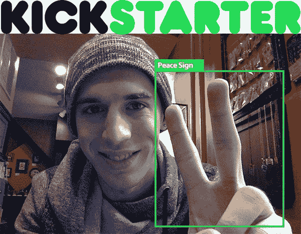
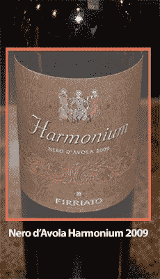

# 了解如何(通过智能手机)快速识别酒瓶。

> 原文：<https://pyimagesearch.com/2015/02/10/learn-identify-wine-bottles-snap-smartphone/>

我们正在接近 PyImageSearch 大师 Kickstarter — ***的结尾，我们刚刚实现了我们的第二个目标！***

这意味着我们将在 PyImageSearch 大师计算机视觉课程中学习所有关于**手势识别**的知识！

无论如何，在过去的几天里，我一直在拜访家人。令人惊讶的是，我多么想念一顿美味的家常饭——坐下来吃一顿家庭晚餐就是要有一些关心和爱。

当我和我的母亲在餐桌旁坐下时，我的父亲把手伸到我们的酒架上，拉下一瓶红酒，慢慢地打开瓶盖，倒了一点到我的杯子里品尝。

检查葡萄酒的时候，我把酒杯斜放在一边，这样我就可以对照我的白色餐巾检查颜色:桃花心木，略带砖色。

然后，我摇晃了几秒钟，给葡萄酒充气，让单宁变得醇厚，然后用鼻子深呼吸三次，再用嘴深呼吸一次

我只有一个词来形容这款酒:

***辉煌。***

就在我第一次品尝葡萄酒的时候，PyImageSearch 大师们的下一个目标给了我如此大的打击，以至于我差点像卡通人物一样把美味的葡萄酒吐到房间的另一边:

关于构建识别酒瓶的应用程序的完整操作指南和教程。

**Figure 1:** Learn how to use computer vision, image processing, and machine learning to automatically recognize wine labels.

比如你听说过 [Vivino 葡萄酒扫描 app](http://www.vivino.com/) 吗？

基本上，它是一个移动应用程序，允许你拍一张酒瓶的照片，然后立即识别它，查看评级，甚至购买一瓶！

如果我们达到了第三阶段*的目标，我们将在第一阶段*(学习如何将计算机视觉融入移动应用)的基础上，构建我们自己版本的 Vivino。**

 **在本指南的最后，你将拥有一个功能齐全的葡萄酒鉴定应用程序,你可以在闲暇时使用它——甚至可以提交到应用程序商店！

你觉得怎么样？

你想从前到后构建一个完整的移动计算机视觉应用吗？或许还能在应用商店赚几美元？

对我来说，这听起来是一项不错的投资——但我会让你来判断。

在 PyImageSearch 大师 Kickstarter 的大门关闭之前，还有不到 72 小时*。而一旦大门关闭， ***它们直到八月才会重新开放！****

 *如果您还没有参加课程(或者想要提升您的奖励，以便我们能够达到第三个延伸目标)，请使用此链接:

[https://www . kickstarter . com/projects/1186001332/pyimagesearch-gurus-become-a-computer-vision-openc](https://www.kickstarter.com/projects/1186001332/pyimagesearch-gurus-become-a-computer-vision-openc)

再次感谢你们让这次活动如此成功。我非常感谢你和你的支持——我迫不及待地想在 PyImageSearch 大师课程中见到你！***