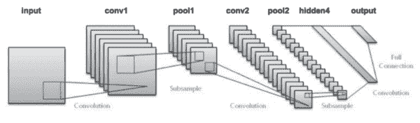
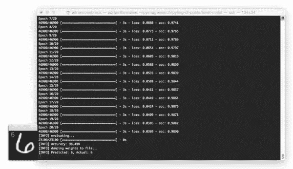
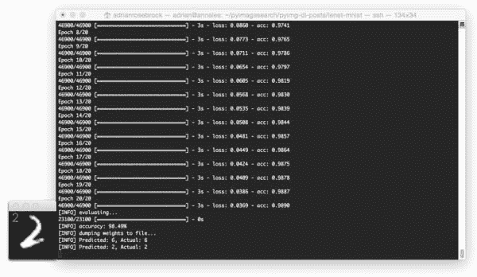
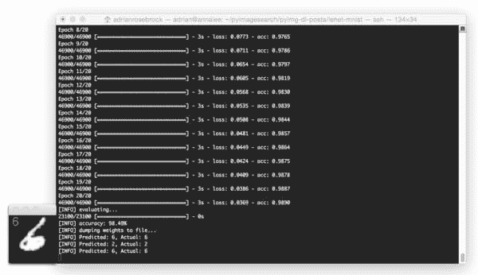
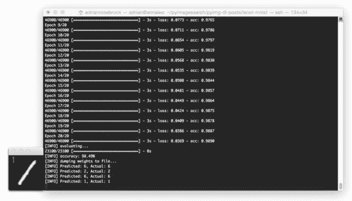
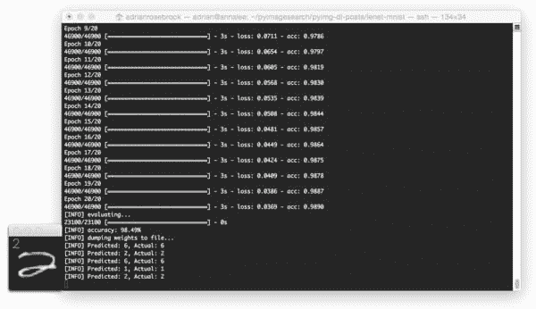
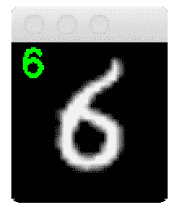

# LeNet——Python 中的卷积神经网络

> 原文：<https://pyimagesearch.com/2016/08/01/lenet-convolutional-neural-network-in-python/>


在今天的博文中，我们将使用 Python 和 Keras 深度学习包来*实现我们的第一个卷积神经网络(CNN)——**LeNet**——**。***

LeNet 架构由 LeCun 等人在其 1998 年的论文 *[中首次提出，基于梯度的学习应用于文档识别](http://yann.lecun.com/exdb/publis/pdf/lecun-01a.pdf)。*顾名思义，作者实现的 LeNet 主要用于文档中的 OCR 和字符识别。

LeNet 架构*简单*和*小*(就内存占用而言)，使其*非常适合教授 CNN*的基础知识——它甚至可以在 CPU 上运行(如果你的系统没有合适的 GPU)，使其成为一个伟大的“第一 CNN”。

然而，如果你*确实*有 GPU 支持，并且可以通过 Keras 访问你的 GPU，你将享受到*极快的*训练时间(大约每历元 3-10 秒，取决于你的 GPU)。

在这篇文章的剩余部分，**我将展示如何使用 Python 和 Keras 实现 *LeNet 卷积神经网络架构*。**

在那里，我将向您展示如何在 MNIST 数据集上训练 LeNet 进行数字识别。

要了解如何训练你的第一个卷积神经网络，请继续阅读。

## LeNet——Python 中的卷积神经网络

本教程将*主要面向代码*和*，意在帮助你尝试深度学习和卷积神经网络*。出于这个目的，我*不会*花太多时间讨论激活功能、池层或密集/全连接层——在未来的 PyImageSearch 博客上将会有大量的**教程，将会详细介绍*每一种层类型/概念**。*****

 **同样，本教程是你第一个*端到端的例子，在这里你可以训练一个真实的 CNN(并看到它的运行)。我们将在这一系列文章的后面讨论激活函数、池层和全连接层的血淋淋的细节(尽管你应该已经知道[卷积运算如何工作的基础知识](https://pyimagesearch.com/2016/07/25/convolutions-with-opencv-and-python/))；但与此同时，只要跟着学习，享受这堂课，并且*学习如何用 Python 和 Keras 实现你的第一个卷积神经网络。**

### MNIST 数据集


**Figure 1:** MNIST digit recognition dataset.

你可能已经看过 MNIST 数据集了，无论是在 PyImageSearch 博客上，还是在你研究的其他地方。无论是哪种情况，我都会继续快速查看数据集，以确保您确切地知道*我们正在处理什么数据。*

 *MNIST 数据集可以说是计算机视觉和机器学习文献中研究得最充分、理解得最透彻的数据集，这使它成为您在深度学习之旅中使用的优秀“第一个数据集”。

***注意:**正如我们将发现的，在这个数据集上用最少的训练时间，甚至在 CPU 上，获得> 98%的分类准确率也是相当容易的。*

这个数据集的目标是对手写数字 0-9 进行分类。我们总共得到 70，000 张图片，其中(通常)60，000 张图片用于训练，10，000 张用于评估；但是，我们可以根据自己的需要自由分割这些数据。常见的拆分包括标准的 60，000/10，000、75%/25%和 66.6%/33.3%。在博文的后面，我将使用 2/3 的数据进行训练，1/3 的数据进行测试。

每个数字被表示为一个 *28 x 28* *灰度图像*(来自 MNIST 数据集的例子可以在上图中看到)。这些灰度像素强度是无符号整数，像素值在*【0，255】范围内。*所有数字被放置在*黑色背景*上，其中*浅色前景*(即数字本身)为*白色*和*各种灰色阴影。*

值得注意的是，许多库(如 [scikit-learn](http://scikit-learn.org/stable/) )都有内置的帮助器方法来下载 MNIST 数据集，将其缓存到本地磁盘，然后加载它。这些辅助方法通常将每个图像表示为一个 *784-d* 向量。

**数字 *784* 从何而来？**

简单。只不过是把 ***展平了****28×28 = 784*的图像。

为了从 784-d 向量中恢复我们的原始图像，我们简单地将数组整形为一个 *28 x 28* 图像。

在这篇博文的上下文中，我们的目标是训练 LeNet，使我们在测试集上最大化准确性。

### LeNet 架构



**Figure 2:** The LeNet architecture consists of two sets of convolutional, activation, and pooling layers, followed by a fully-connected layer, activation, another fully-connected, and finally a softmax classifier 

LeNet 架构是卷积神经网络的优秀“第一架构”(特别是在 MNIST 数据集(一种用于手写数字识别的图像数据集)上训练时)。

LeNet 很小，很容易理解——但也足够大，可以提供有趣的结果。此外，LeNet + MNIST 的组合能够在 CPU 上运行，这使得初学者可以轻松地迈出深度学习和卷积神经网络的第一步。

**在许多方面，LeNet + MNIST 是图像分类深度学习的*“你好，世界”*。**

LeNet 架构由以下几层组成:

```py
INPUT => CONV => RELU => POOL => CONV => RELU => POOL => FC => RELU => FC

```

我现在不解释每层卷积滤波器的数量、滤波器本身的大小以及全连接节点的数量，而是将这个讨论留到我们的博客文章的 ***“用 Python 和 Keras 实现 LeNet”***部分，在那里源代码将作为解释的辅助。

同时，让我们看看我们的项目结构——我们将在未来的 PyImageSearch 博客文章中多次重用这个结构。

***注:**原 LeNet 架构使用`TANH`激活函数而非`RELU`。我们在这里使用`RELU`的原因是因为它有许多好的、令人满意的属性(我将在以后的博客文章中讨论这些属性),所以它往往会给出更好的分类精度。如果你在 LeNet 上遇到任何其他的讨论，你可能会看到他们用`TANH`来代替——同样，只是要记住一些事情。*

### 我们的 CNN 项目结构

在我们深入任何代码之前，让我们首先回顾一下我们的项目结构:

```py
|--- output
|--- pyimagesearch
|    |--- __init__.py
|    |--- cnn
|    |    |--- __init__.py
|    |    |--- networks
|    |    |    |--- __init__.py
|    |    |    |--- lenet.py
|--- lenet_mnist.py

```

为了保持我们的代码有条理，我们将定义一个名为`pyimagesearch`的包。在`pyimagesearch`模块中，我们将创建一个`cnn`子模块——这是我们存储卷积神经网络实现以及任何与 CNN 相关的辅助工具的地方。

看一看`cnn`内部，你会看到`networks`子模块:这是*网络实现本身*将被存储的地方。顾名思义，`lenet.py`文件将定义一个名为`LeNet`的类，这是我们在 Python + Keras 中实际的 LeNet 实现。

`lenet_mnist.py`脚本将是我们的驱动程序，用于实例化 LeNet 网络架构、训练模型(或加载模型，如果我们的网络是预训练的)，然后在 MNIST 数据集上评估网络性能。

最后，`output`目录将在我们的`LeNet`模型被训练后存储它，允许我们在对`lenet_mnist.py` *的后续调用中对数字进行分类，而*不必重新训练网络。

在过去的一年里，我个人一直在使用这种项目结构(或与之非常相似的项目结构)。我发现它组织良好，易于扩展——随着我们向这个库中添加更多的网络架构和助手功能，这一点将在未来的博客文章中变得更加明显。

### 用 Python 和 Keras 实现 LeNet

首先，我假设您的系统上已经安装了 [Keras](http://keras.io/) 、 [scikit-learn](http://scikit-learn.org/stable/) 和 [OpenCV](http://opencv.org/) (可选地，启用 GPU 支持)。如果您没有， [***请参考这篇博文***](https://pyimagesearch.com/2016/07/18/installing-keras-for-deep-learning/) 来帮助您正确配置您的系统。

否则，打开`lenet.py`文件并插入以下代码:

```py
# import the necessary packages
from keras.models import Sequential
from keras.layers.convolutional import Conv2D
from keras.layers.convolutional import MaxPooling2D
from keras.layers.core import Activation
from keras.layers.core import Flatten
from keras.layers.core import Dense
from keras import backend as K

class LeNet:
	@staticmethod
	def build(numChannels, imgRows, imgCols, numClasses,
		activation="relu", weightsPath=None):
		# initialize the model
		model = Sequential()
		inputShape = (imgRows, imgCols, numChannels)

		# if we are using "channels first", update the input shape
		if K.image_data_format() == "channels_first":
			inputShape = (numChannels, imgRows, imgCols)

```

**第 2-8 行**处理从`keras`库中导入所需的函数/类。

在第 10 行的**上定义了`LeNet`类，然后在第 12** 行的**上定义了`build`方法。每当我定义一个新的网络架构时，我总是将它放在自己的类中(主要是为了命名空间和组织的目的)，然后创建一个静态的 T2 函数。**

顾名思义，`build`方法接受任何提供的参数，至少*包括:*

*   我们输入图像的*宽度*。
*   我们输入图像的*高度*。
*   我们输入图像的*深度*(即通道数)。
*   以及我们数据集中的*类的数量*(即类标签的唯一数量)。

我通常还会包含一个`weightsPath`，它可以用来加载一个预先训练好的模型。给定这些参数，`build`函数负责构建网络架构。

说到构建 LeNet 架构，**第 15 行**实例化了一个`Sequential`类，我们将用它来构建网络。

然后，我们处理第 16-20 行上的“通道最后”或“通道优先”张量。Tensorflow 默认为“通道最后”。

既然模型已经初始化，我们可以开始向它添加层:

```py
		# define the first set of CONV => ACTIVATION => POOL layers
		model.add(Conv2D(20, 5, padding="same",
			input_shape=inputShape))
		model.add(Activation(activation))
		model.add(MaxPooling2D(pool_size=(2, 2), strides=(2, 2)))

```

在第 23-26 行我们创建了第一组`CONV => RELU => POOL`图层组。

我们的`CONV`层将学习 20 个[卷积滤波器](https://pyimagesearch.com/2016/07/25/convolutions-with-opencv-and-python/)，其中每个滤波器的大小为*5×5*。该值的输入尺寸与我们的输入图像具有相同的宽度、高度和深度，在本例中为 MNIST 数据集，因此我们将使用具有单通道深度(灰度)的 *28 x 28* 输入。

然后，我们将应用 ReLU 激活函数，然后在 *x* 和 *y* 两个方向上应用 *2 x 2* max-pooling，步幅为 2(想象一个*2x 2*滑动窗口“滑过”激活体积，取每个区域的最大值操作，同时在水平和垂直方向上取 2 个像素的步长)。

***注意:*** *本教程主要是基于代码的，旨在让您*第一次*接触实现卷积神经网络——在以后的博客文章中，我将深入*更多关于卷积层、激活函数和最大池层的*细节。与此同时，只需尝试遵循代码即可。*

我们现在准备应用我们的第二套`CONV => RELU => POOL`层:

```py
		# define the second set of CONV => ACTIVATION => POOL layers
		model.add(Conv2D(50, 5, padding="same"))
		model.add(Activation(activation))
		model.add(MaxPooling2D(pool_size=(2, 2), strides=(2, 2)))

```

这一次我们将学习 *50 个卷积滤波器*，而不是像前一层设置中的 *20 个卷积滤波器*。

**常见的是，在网络的更深层，学习到的`CONV`过滤器的数量*增加*。**

接下来，我们来看 LeNet 架构的全连接层(通常称为“密集”层):

```py
		# define the first FC => ACTIVATION layers
		model.add(Flatten())
		model.add(Dense(500))
		model.add(Activation(activation))

		# define the second FC layer
		model.add(Dense(numClasses))

		# lastly, define the soft-max classifier
		model.add(Activation("softmax"))

```

在第 34 行的**上，我们取前面`MaxPooling2D`层的输出，*将*展平成一个向量，允许我们应用密集/完全连接的层。如果您以前有过神经网络方面的经验，那么您会知道密集/全连接层是网络中的“标准”类型层，其中前一层中的每个节点都连接到下一层中的每个节点(因此有了术语“全连接”)。**

我们的全连接层将包含 500 个单元( **Line 35** )，我们通过另一个非线性 ReLU 激活。

**第 39 行**是*非常重要的*，虽然它很容易被忽略——这一行定义了另一个`Dense`类，但是接受一个可变的(即非硬编码的)大小。这个大小是由变量`classes`表示的类标签 的数量*。在 MNIST 数据集的情况下，我们有 10 个类(我们试图学习识别的 10 个数字中的每一个都有一个类)。*

最后，我们应用一个 softmax 分类器(多项式逻辑回归)，它将返回一个概率列表(T0)，10 个类别标签中的每一个都有一个(**第 42 行**)。具有最大概率的类别标签将被选择作为来自网络的最终分类。

我们的最后一个代码块处理加载一个预先存在的`weightsPath`(如果这样的文件存在)并将构建的模型返回给调用函数:

```py
		# if a weights path is supplied (inicating that the model was
		# pre-trained), then load the weights
		if weightsPath is not None:
			model.load_weights(weightsPath)

		# return the constructed network architecture
		return model

```

### 创建 LeNet 驱动程序脚本

现在我们已经使用 Python + Keras 实现了 LeNet 卷积神经网络架构，是时候定义`lenet_mnist.py`驱动程序脚本了，它将处理:

1.  加载 MNIST 数据集。
2.  将 MNIST 划分为*训练*和*测试*两部分。
3.  加载和编译 LeNet 架构。
4.  训练网络。
5.  可选地将序列化的网络权重保存到磁盘，以便可以重复使用(无需重新训练网络)。
6.  显示*网络输出的可视示例*,以证明我们的实现确实工作正常。

打开您的`lenet_mnist.py`文件并插入以下代码:

```py
# import the necessary packages
from pyimagesearch.cnn.networks.lenet import LeNet
from sklearn.model_selection import train_test_split
from keras.datasets import mnist
from keras.optimizers import SGD
from keras.utils import np_utils
from keras import backend as K
import numpy as np
import argparse
import cv2

# construct the argument parser and parse the arguments
ap = argparse.ArgumentParser()
ap.add_argument("-s", "--save-model", type=int, default=-1,
	help="(optional) whether or not model should be saved to disk")
ap.add_argument("-l", "--load-model", type=int, default=-1,
	help="(optional) whether or not pre-trained model should be loaded")
ap.add_argument("-w", "--weights", type=str,
	help="(optional) path to weights file")
args = vars(ap.parse_args())

```

**第 2-10 行**处理导入我们需要的 Python 包。注意我们是如何从`cnn`和`pyimagesearch`的`networks`子模块中导入我们的`LeNet`类的。

***注意:*** *如果你正在关注这篇博文并打算执行代码，* ***请*** ***使用本文底部的“下载”部分。**为了保持这篇文章的简洁，我省略了`__init__.py`更新，这些更新可能会让新的 Python 开发者感到困惑。*

从那里，**行 13-20** 解析三个可选的命令行参数，下面详细介绍了每个参数:

*   `--save-model`:一个指示变量，用于指定在训练 LeNet 之后，我们是否应该*保存*我们的模型到磁盘。
*   `--load-model`:另一个指示变量，这次指定我们是否应该*从磁盘中加载*一个预先训练好的模型。
*   `--weights`:在提供了`--save-model`的情况下，`--weights-path`应该指向我们要*保存*序列化模型的地方。在提供了`--load-model`的情况下，`--weights`应该指向预先存在的权重文件在我们系统中的位置。

我们现在准备加载 MNIST 数据集，并将其划分为训练和测试部分:

```py
# grab the MNIST dataset (if this is your first time running this
# script, the download may take a minute -- the 55MB MNIST dataset
# will be downloaded)
print("[INFO] downloading MNIST...")
((trainData, trainLabels), (testData, testLabels)) = mnist.load_data()

# if we are using "channels first" ordering, then reshape the
# design matrix such that the matrix is:
# num_samples x depth x rows x columns
if K.image_data_format() == "channels_first":
	trainData = trainData.reshape((trainData.shape[0], 1, 28, 28))
	testData = testData.reshape((testData.shape[0], 1, 28, 28))

# otherwise, we are using "channels last" ordering, so the design
# matrix shape should be: num_samples x rows x columns x depth
else:
	trainData = trainData.reshape((trainData.shape[0], 28, 28, 1))
	testData = testData.reshape((testData.shape[0], 28, 28, 1))

# scale data to the range of [0, 1]
trainData = trainData.astype("float32") / 255.0
testData = testData.astype("float32") / 255.0

```

**第 26 行**从磁盘加载 MNIST 数据集。如果这是您第一次使用`"MNIST Original"`字符串调用`fetch_mldata`函数，那么需要下载 MNIST 数据集。MNIST 数据集是一个 55MB 的文件，因此根据您的互联网连接，下载可能需要几秒到几分钟的时间。

**第 31-39 行**处理“通道优先”或“通道最后”实施的整形数据。例如，TensorFlow 支持“通道最后”排序。

最后，**行 42-43** 执行训练和测试分割，使用 2/3 的数据进行训练，剩余的 1/3 用于测试。我们还将图像从范围*【0，255】*缩小到*【0，1.0】*，这是一种常见的缩放技术。

下一步是处理我们的标签，以便它们可以用于分类交叉熵损失函数:

```py
# transform the training and testing labels into vectors in the
# range [0, classes] -- this generates a vector for each label,
# where the index of the label is set to `1` and all other entries
# to `0`; in the case of MNIST, there are 10 class labels
trainLabels = np_utils.to_categorical(trainLabels, 10)
testLabels = np_utils.to_categorical(testLabels, 10)

# initialize the optimizer and model
print("[INFO] compiling model...")
opt = SGD(lr=0.01)
model = LeNet.build(numChannels=1, imgRows=28, imgCols=28,
	numClasses=10,
	weightsPath=args["weights"] if args["load_model"] > 0 else None)
model.compile(loss="categorical_crossentropy", optimizer=opt,
	metrics=["accuracy"])

```

**第 49 行和第 50 行**处理我们的训练和测试标签(即，MNIST 数据集中每幅图像的“地面真相”标签)。

由于我们正在使用[分类交叉熵损失函数](https://jamesmccaffrey.wordpress.com/2013/11/05/why-you-should-use-cross-entropy-error-instead-of-classification-error-or-mean-squared-error-for-neural-network-classifier-training/)，我们需要应用`to_categorical`函数，将我们的标签从*整数*转换为*向量*，其中每个向量的范围从`[0, classes]`开始。该函数为*的每个*类标签生成一个向量，其中正确标签的索引被设置为 *1* ，所有其他条目被设置为 *0。*

在 MNIST 数据集的情况下，我们有 10 个类标签，因此每个标签现在被表示为一个 *10-d* 向量。例如，考虑培训标签*“3”*。在应用了`to_categorical`函数后，我们的向量现在看起来像这样:

```py
[0, 0, 0, 1, 0, 0, 0, 0, 0, 0]

```

注意向量中的所有条目都是零*，除了现在被设置为 1 的第三个索引的*。

我们将使用[随机梯度下降(SGD)](https://en.wikipedia.org/wiki/Stochastic_gradient_descent) 来训练我们的网络，学习速率为`0.01` ( **第 54 行**)。分类交叉熵将用作我们的损失函数，这是处理具有两个以上类别标签的数据集时的一个相当标准的选择。然后我们的模型被编译并加载到内存的第 55-59 行**上**。

我们现在准备好构建我们的`LeNet`架构，可选地从磁盘加载任何预训练的权重，然后训练我们的网络:

```py
# only train and evaluate the model if we *are not* loading a
# pre-existing model
if args["load_model"] < 0:
	print("[INFO] training...")
	model.fit(trainData, trainLabels, batch_size=128, epochs=20,
		verbose=1)

	# show the accuracy on the testing set
	print("[INFO] evaluating...")
	(loss, accuracy) = model.evaluate(testData, testLabels,
		batch_size=128, verbose=1)
	print("[INFO] accuracy: {:.2f}%".format(accuracy * 100))

```

在`--load-model` *没有供给*的情况下，我们需要训练我们的网络(**63 线**)。

训练我们的网络是通过调用实例化的`model` ( **第 65 和 66 行**)的`.fit`方法来完成的。我们将允许我们的网络训练 **20 个时期**(表示我们的网络将“看到”每个训练示例总共 20 次，以学习每个数字类别的区分过滤器)。

然后，我们根据测试数据(**第 70-72 行**)评估我们的网络，并将结果显示到我们的终端上。

接下来，我们检查是否应该将网络权重序列化到文件中，这样我们就可以运行`lenet_mnist.py`脚本*后续的*，而不必从头开始重新训练网络:

```py
# check to see if the model should be saved to file
if args["save_model"] > 0:
	print("[INFO] dumping weights to file...")
	model.save_weights(args["weights"], overwrite=True)

```

我们的最后一个代码块处理从我们的测试集中随机选择几个数字，然后将它们通过我们训练过的 LeNet 网络进行分类:

```py
# randomly select a few testing digits
for i in np.random.choice(np.arange(0, len(testLabels)), size=(10,)):
	# classify the digit
	probs = model.predict(testData[np.newaxis, i])
	prediction = probs.argmax(axis=1)

	# extract the image from the testData if using "channels_first"
	# ordering
	if K.image_data_format() == "channels_first":
		image = (testData[i][0] * 255).astype("uint8")

	# otherwise we are using "channels_last" ordering
	else:
		image = (testData[i] * 255).astype("uint8")

	# merge the channels into one image
	image = cv2.merge([image] * 3)

	# resize the image from a 28 x 28 image to a 96 x 96 image so we
	# can better see it
	image = cv2.resize(image, (96, 96), interpolation=cv2.INTER_LINEAR)

	# show the image and prediction
	cv2.putText(image, str(prediction[0]), (5, 20),
				cv2.FONT_HERSHEY_SIMPLEX, 0.75, (0, 255, 0), 2)
	print("[INFO] Predicted: {}, Actual: {}".format(prediction[0],
		np.argmax(testLabels[i])))
	cv2.imshow("Digit", image)
	cv2.waitKey(0)

```

对于每个随机选择的数字，我们使用 LeNet 模型对图像进行分类(**第 82 行**)。

我们网络的实际`prediction`是通过寻找*最大概率* *的类标签的索引得到的。*记住，我们的网络将通过 softmax 函数返回一组概率，每个类别标签一个——因此网络的实际“预测”是具有最大概率的类别标签。

**第 87-103 行**处理将 *28 x 28* 图像调整到 *96 x 96* 像素，这样我们可以更好地可视化它，然后在`image`上绘制`prediction`。

最后，**行 104-107** 将结果显示到我们的屏幕上。

### 用 Python 和 Keras 训练 LeNet

为了在 MNIST 数据集上训练 LeNet，请确保您已经使用本教程底部的 ***【下载】*** 表单下载了源代码。这个`.zip`文件包含了我在本教程中详述的所有代码——此外，这些代码被组织在我在上面详述的*相同的项目结构*中，其中*确保*将在您的系统上正确运行([假设您已经正确配置了您的环境](https://pyimagesearch.com/2016/07/18/installing-keras-for-deep-learning/))。

下载完`.zip`代码档案后，您可以通过执行以下命令在 MNIST 上训练 LeNet:

```py
$ python lenet_mnist.py --save-model 1 --weights output/lenet_weights.hdf5

```

我在下面包括了我的机器的输出:

[](https://pyimagesearch.com/wp-content/uploads/2016/06/lenet_training.jpg)

**Figure 3:** Training LeNet on the MNIST dataset on my Titan X takes approximately 3 seconds per epoch. After 20 epochs, LeNet is reaching 98.90% classification accuracy on the training data and 98.49% accuracy on the testing data.

在我的 Titan X GPU 上，每个历元大约需要 3 秒钟，允许*整个训练过程*在大约 60 秒内完成。

仅经过 20 个历元，LeNet 在 MNIST 数据集— *上的分类准确率就达到了**98.49%【一点也不差，计算时间仅 60 秒！***

 *****注:*** *如果你在我们的 CPU 而不是 GPU 上执行`lenet_mnist.py`脚本，预计每历元时间会跳到 **70-90 秒**。仍然有可能在你的 CPU 上训练 LeNet，只是需要多花一点时间。*

### 使用 Python 和 Keras 评估 LeNet

下面，我提供了一些来自我们 LeNet + MNIST 实施的示例评估图片:



**Figure 4:** Applying LeNet to classify a digit from the MNIST dataset.

在上图中，我们能够正确地将数字分类为*“6”*。

在这张图片中，LeNet 正确地将数字识别为*“2”*:



**Figure 5:** Implementing LeNet in Python and Keras.

下图是一个很好的例子，说明了 CNN 过滤器学习卷积过滤器的强大、辨别性质:这个 *"6"* 非常扭曲，在数字的圆形区域之间几乎没有间隙，但 LeNet 仍然能够正确地对数字进行分类:



**Figure 6:** Correctly classifying a particularly hard to read digit with LeNet and Convolutional Neural Networks.

这是另一张图片，这次对严重倾斜的 *"1"* 进行分类:



**Figure 7:** Even skewed digits are correctly classified using Convolutional Neural Networks.

最后，最后一个例子展示了 LeNet 模型对一个*“2”*的分类:



**Figure 8:** A final example of classifying digits using LeNet and Deep Learning.

### 运行序列化的 LeNet 模型

在我们的`lenet_mnist.py`脚本完成第一次执行后(假设您提供了`--save-model`和`--weights`，您现在应该在您的`output`目录中有一个`lenet_weights.hdf5`文件。

我们可以加载这些权重，并使用它们来对数字进行分类，而不是在后续的`lenet_mnist.py`运行中重新训练我们的网络。

要加载我们预先训练的 LeNet 模型，只需执行以下命令:

```py
$ python lenet_mnist.py --load-model 1 --weights output/lenet_weights.hdf5

```

我在下面添加了一个 LeNet 的 GIF 动画，用于正确分类手写数字:



**Figure 9:** An example animation of LeNet correctly classifying digits.

## 摘要

在今天的博客文章中，我展示了如何使用 Python 编程语言和 Keras 库实现 LeNet 架构以进行深度学习。

LeNet 架构是一个很棒的*“你好，世界”*网络，可以让你接触深度学习和卷积神经网络。网络本身很简单，占用的内存很少，当应用于 MNIST 数据集时，可以在 CPU 或 GPU 上运行，这使它成为实验和学习的理想选择，尤其是如果你是深度学习的新手。

本教程主要关注*代码*，正因为如此，我需要跳过*对重要的卷积神经网络概念的详细回顾*，例如激活层、池层和密集/全连接层(否则这篇文章可能会很容易*长 5 倍)。*

 *在未来的博客文章中，我将详细回顾这些层类型的每一个层类型——同时，简单地熟悉代码并尝试自己执行它。如果你觉得**真的很大胆**，试着调整每个卷积层的滤波器数量和滤波器尺寸，看看会发生什么！

无论如何，我希望你喜欢这篇博文——我将来肯定会做更多关于深度学习和图像分类的帖子。

但是在你离开之前，请务必在下面的表格中输入你的电子邮件地址，以便在未来 PyImageSearch 博客文章发表时得到通知——你不想错过它们！******