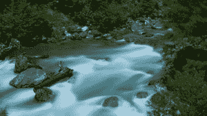
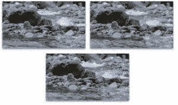
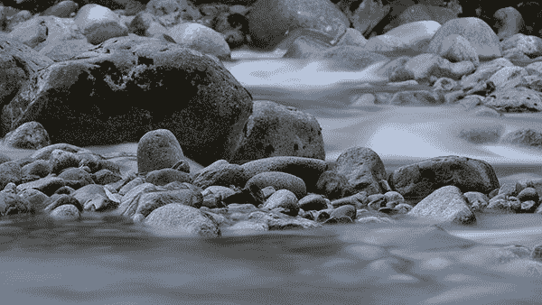
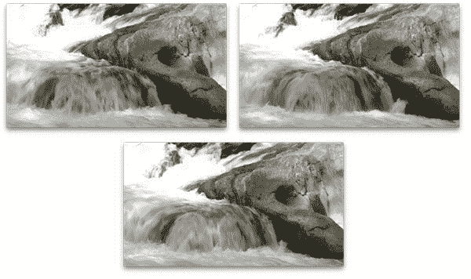
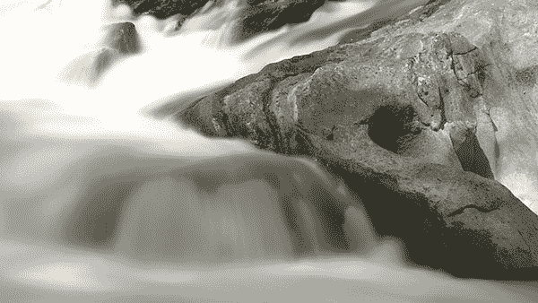
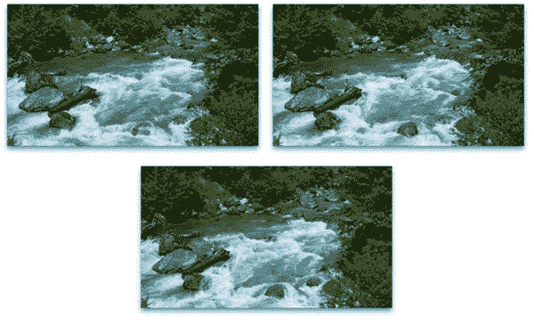
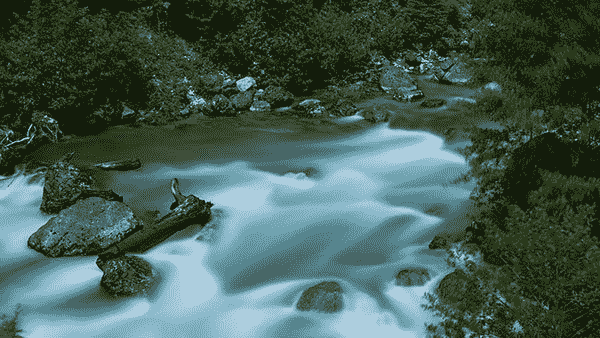

# 长时间接触 OpenCV 和 Python

> 原文：<https://pyimagesearch.com/2017/08/14/long-exposure-with-opencv-and-python/>

[](https://pyimagesearch.com/wp-content/uploads/2017/07/long_exposure_river_03.jpg)

我最喜欢的摄影技术之一是*长时间曝光*，这是一种创造照片的过程，可以展示时间流逝的效果，这是传统摄影所无法捕捉的。

当应用这种技术时，水变得*如丝般光滑*，夜空中的星星随着地球旋转留下*光迹*，汽车前灯/尾灯以*单带连续运动*照亮高速公路。

长时间曝光是一种华丽的技术，但是为了捕捉这些类型的镜头，你需要采取一种系统的方法:将你的相机安装在三脚架上，应用各种滤镜，计算曝光值，等等。更不用说，你需要是一个熟练的摄影师！

作为一名计算机视觉研究人员和开发人员，我知道很多关于处理图像的知识——但是让我们面对现实吧，我是一个糟糕的摄影师。

幸运的是，有一种方法可以通过应用*图像/帧平均*来模拟长曝光。通过在给定的时间段内平均从安装的相机捕获的图像，我们可以(实际上)模拟长时间曝光。

由于视频只是一系列图像，我们可以通过平均视频中的所有帧来轻松构建长曝光。**结果是惊人的长曝光风格的图像，就像这篇博文顶部的那张。**

要了解更多关于长时间曝光以及如何用 OpenCV 模拟效果的信息，*继续阅读*。

## 长时间接触 OpenCV 和 Python

这篇博文分为三个部分。

在这篇博文的第一部分，我们将讨论如何通过帧平均来模拟长时间曝光。

在此基础上，我们将编写 Python 和 OpenCV 代码，用于从输入视频中创建类似长曝光的效果。

最后，我们将把我们的代码应用到一些示例视频中，以创建华丽的长曝光图像。

### 通过图像/帧平均模拟长曝光

通过平均来模拟长时间曝光的想法并不是什么新想法。

事实上，如果你浏览流行的摄影网站，你会发现如何使用你的相机和三脚架手动创建这些类型的效果的教程(这种教程的一个很好的例子可以在[这里](https://www.picturecorrect.com/tips/this-photography-trick-lets-you-take-long-exposures-without-a-filter/)找到)。

我们今天的目标是简单地实现这种方法，这样我们就可以使用 Python 和 OpenCV 从输入视频中自动创建类似长曝光的图像。给定一个输入视频，我们将所有帧平均在一起(平均加权)以创建长曝光效果。

***注意:**你也可以使用多张图像来创建这种长曝光效果，但由于视频只是一系列图像，所以使用视频来演示这种技术更容易。在将该技术应用于您自己的文件时，请记住这一点。*

正如我们将看到的，代码本身非常简单，但当应用于使用三脚架捕捉的视频时，会产生美丽的效果，确保帧之间没有相机移动。

### 用 OpenCV 实现长曝光模拟

让我们首先打开一个名为`long_exposure.py`的新文件，并插入以下代码:

```py
# import the necessary packages
import argparse
import imutils
import cv2

# construct the argument parse and parse the arguments
ap = argparse.ArgumentParser()
ap.add_argument("-v", "--video", required=True,
	help="path to input video file")
ap.add_argument("-o", "--output", required=True,
	help="path to output 'long exposure'")
args = vars(ap.parse_args())

```

第 2-4 行处理我们的进口——你需要 [imutils](https://pyimagesearch.com/2015/02/02/just-open-sourced-personal-imutils-package-series-opencv-convenience-functions/) 和 OpenCV。

如果您的环境中还没有安装`imutils`，只需使用`pip`:

```py
$ pip install --upgrade imutils

```

如果您还没有配置和安装 OpenCV，请前往我的 [OpenCV 3 教程页面](https://pyimagesearch.com/opencv-tutorials-resources-guides/)并选择适合您系统的指南。

我们在第 7-12 行解析我们的两个命令行参数:

*   `--video`:视频文件的路径。
*   `--output`:输出“长曝光”文件的路径+文件名。

接下来，我们将执行一些初始化步骤:

```py
# initialize the Red, Green, and Blue channel averages, along with
# the total number of frames read from the file
(rAvg, gAvg, bAvg) = (None, None, None)
total = 0

# open a pointer to the video file
print("[INFO] opening video file pointer...")
stream = cv2.VideoCapture(args["video"])
print("[INFO] computing frame averages (this will take awhile)...")

```

在**行 16** 上，我们初始化 RGB 通道平均值，稍后我们将把它合并到最终的长曝光图像中。

我们还对第 17 行**上的总帧数进行初始化。**

对于本教程，我们正在处理一个包含所有帧的视频文件，因此有必要打开一个指向第 21 行上的视频捕获`stream`的文件指针。

现在让我们开始计算平均值的循环:

```py
# loop over frames from the video file stream
while True:
	# grab the frame from the file stream
	(grabbed, frame) = stream.read()

	# if the frame was not grabbed, then we have reached the end of
	# the sfile
	if not grabbed:
		break

	# otherwise, split the frmae into its respective channels
	(B, G, R) = cv2.split(frame.astype("float"))

```

在我们的循环中，我们将从`stream` ( **行 27** )中抓取帧，并将`frame`拆分到其各自的 BGR 通道(**行 35** )。注意中间的退出条件——如果一帧是来自视频流的`not grabbed`,我们就在视频文件的末尾，我们将`break`退出循环(**第 31 行和第 32 行**)。

在循环的剩余部分，我们将执行运行平均值计算:

```py
	# if the frame averages are None, initialize them
	if rAvg is None:
		rAvg = R
		bAvg = B
		gAvg = G

	# otherwise, compute the weighted average between the history of
	# frames and the current frames
	else:
		rAvg = ((total * rAvg) + (1 * R)) / (total + 1.0)
		gAvg = ((total * gAvg) + (1 * G)) / (total + 1.0)
		bAvg = ((total * bAvg) + (1 * B)) / (total + 1.0)

	# increment the total number of frames read thus far
	total += 1

```

如果这是第一次迭代，我们将初始 RGB 平均值设置为在第 38-41 行****上抓取的相应第一帧通道(只有在第一次循环时才需要这样做，因此有了`if`-语句)。****

 ****否则，我们将计算第 45-48 行**上每个通道的运行平均值。求平均值的计算非常简单，我们将总帧数乘以通道平均值，将各个通道相加，然后将结果除以浮点总帧数(我们在分母中的总数上加 1，因为这是一个新帧)。我们将计算结果存储在各自的 RGB 通道平均数组中。**

最后，我们增加总帧数，从而保持我们的运行平均值(**第 51 行**)。

一旦我们循环了视频文件中的所有帧，我们就可以将(平均)通道合并到一个图像中，并将其写入磁盘:

```py
# merge the RGB averages together and write the output image to disk
avg = cv2.merge([bAvg, gAvg, rAvg]).astype("uint8")
cv2.imwrite(args["output"], avg)

# do a bit of cleanup on the file pointer
stream.release()

```

在**的第 54 行**，我们利用了方便的`cv2.merge`函数，同时在一个列表中指定我们的每个通道平均值。由于这些数组包含浮点数(因为它们是所有帧的*平均值*，我们添加了`astype("uint8")`来将像素转换为范围 *[0-255]内的整数。*

我们使用命令行参数 path + filename 在随后的第 55**行**将`avg`映像写入磁盘。我们也可以通过`cv2.imshow`将图像显示到我们的屏幕上，但由于处理视频文件需要大量的 CPU 时间，我们将简单地将图像保存到磁盘，以防我们希望将其保存为桌面背景或在社交媒体上与我们的朋友分享。

这个脚本的最后一步是通过释放我们的视频流指针来执行清理( **Line 58** )。

### 长时间曝光和 OpenCV 结果

让我们通过处理三个示例视频来看看我们的脚本是如何工作的。请注意，每个视频都是由安装在三脚架上的摄像机拍摄的，以确保稳定性。

***注:**我用来创作这些例子的视频不属于我，经原创作者许可；因此，我不能在这篇博文的源代码下载中包含它们。相反，如果你想复制我的结果，我提供了原始视频的链接。*

我们的第一个例子是一个 15 秒长的视频,关于水冲过岩石——我在下面的视频中加入了一个样本:

[](https://pyimagesearch.com/wp-content/uploads/2017/07/long_exposure_montage_01.jpg)

**Figure 1:** Sample frames of river water rushing over rocks.

要创建我们的长曝光效果，只需执行以下命令:

```py
$ time python long_exposure.py --video videos/river_01.mov --output river_01.png 
[INFO] opening video file pointer...
[INFO] computing frame averages (this will take awhile)...

real	2m1.710s
user	0m50.959s
sys		0m40.207s

```

[](https://pyimagesearch.com/wp-content/uploads/2017/07/long_exposure_river_01.jpg)

**Figure 2:** Long exposure of 15 seconds of river water rushing over rocks, constructed by averaging frames with Python and OpenCV.

请注意，由于平均过程，水已经混合成丝滑的形式。

让我们继续看第二个[河流](https://videohive.net/item/river-water-running-over-rocks-5-of-6/10832477)的例子，再一次，下面显示了一组蒙太奇画面:

[](https://pyimagesearch.com/wp-content/uploads/2017/07/long_exposure_montage_02.jpg)

**Figure 3:** Sample frames of another river.

以下命令用于生成长曝光图像:

```py
$ time python long_exposure.py --video videos/river_02.mov --output river_02.png 
[INFO] opening video file pointer...
[INFO] computing frame averages (this will take awhile)...

real	0m57.881s
user	0m27.207s
sys		0m21.792s

```

[](https://pyimagesearch.com/wp-content/uploads/2017/07/long_exposure_river_02.jpg)

**Figure 4:** Long exposure of a second river which makes the water look silky smooth (created using OpenCV).

注意静止的岩石是如何保持不变的，但是湍急的水流被平均化为连续的一片，从而模仿了长时间曝光的效果。

这个[最后的例子](https://videohive.net/item/the-mountain-river-with-blue-water/16928536)是我最喜欢的，因为水的颜色非常迷人，在水本身和森林之间形成了鲜明的对比:

[](https://pyimagesearch.com/wp-content/uploads/2017/07/long_exposure_montage_03.jpg)

**Figure 5:** Sample frames of a rushing river through a forest

当使用 OpenCV 生成长曝光时，它会给输出一种超现实、梦幻般的感觉:

```py
$ time python long_exposure.py --video videos/river_03.mov --output river_03.png 
[INFO] opening video file pointer...
[INFO] computing frame averages (this will take awhile)...

real	3m17.212s
user	1m11.826s
sys		0m56.707s

```

[](https://pyimagesearch.com/wp-content/uploads/2017/07/long_exposure_river_03-1.jpg)

**Figure 6:** A dream-like long exposure of a river through a forest created using Python and OpenCV.

不同的输出可以通过*定期从输入视频中采样*帧来构建，而不是平均所有帧。这是留给你，读者，去实现的一个练习。

## 摘要

在今天的博文中，我们学习了如何使用 OpenCV 和图像处理技术模拟长曝光图像。

为了模拟长时间曝光，我们采用了帧平均法，即将一组图像平均在一起的过程。我们假设我们的输入图像/视频是使用安装的摄像机捕获的(否则产生的输出图像会失真)。

虽然这不是真正的“长时间曝光”，但效果(视觉上)非常相似。更重要的是，这使你可以在不需要(1)成为专业摄影师或(2)购买昂贵的相机、镜头和滤镜的情况下应用长曝光效果。

**如果您喜欢今天的博文，*请务必在下表中输入您的电子邮件地址，以便在未来教程发布时收到通知！*******