# Python 中的机器学习

> 原文：<https://pyimagesearch.com/2019/01/14/machine-learning-in-python/>

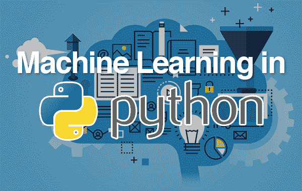

挣扎着用 Python 入门机器学习？在这个循序渐进的实践教程中，您将学习如何使用 Python 对数值数据和图像数据执行机器学习。

当你读完这篇文章时，你将能够开始学习机器。

**要在 Python 教育中启动您的机器学习，*继续阅读！***

## Python 中的机器学习

在本教程中，您将学习如何在 Python 中对数值数据和图像数据执行机器学习。

您将学习如何操作流行的 Python 机器学习和深度学习库，包括我最喜欢的两个库:

*   scikit-learn
*   Keras

**具体来说，您将学习如何:**

1.  检查你的问题
2.  准备您的数据(原始数据、特征提取、特征工程等)。)
3.  抽查一组算法
4.  检查您的结果
5.  对最有效的算法加倍下注

使用这种技术，你将能够开始学习机器和 Python！

**在这个过程中，你会发现流行的机器学习算法，你也可以在自己的项目中使用，包括:**

1.  k-最近邻
2.  朴素贝叶斯
3.  逻辑回归
4.  支持向量机
5.  决策树
6.  随机森林
7.  感觉
8.  多层前馈神经网络
9.  卷积神经网络

这种实践经验将会给你将 Python 中的机器学习应用到你自己的项目中所需的知识(和信心)。

### 安装所需的 Python 机器学习库

在我们开始学习本教程之前，你首先需要确保你的系统是为机器学习而配置的。今天的代码需要以下库:

*   **NumPy:** 用 Python 进行数值处理。
*   **PIL:** 一个简单的图像处理库。
*   **scikit-learn:** 包含了我们今天要讨论的机器学习算法(我们需要 0.20 以上的版本，这就是为什么你会看到下面的`--upgrade`标志)。
*   **Keras** 和 **TensorFlow:** 用于深度学习。TensorFlow 的 CPU 版本对于今天的例子来说很好。
*   虽然我们在这篇博文中没有使用 OpenCV， **imutils** 依赖于它(下一个项目符号)。正因为如此，你可以简单地[使用 pip 来安装 OpenCV](https://pyimagesearch.com/2018/09/19/pip-install-opencv/) ，只是要记住你不会有 OpenCV 的完整安装，你也不能定制它。
*   **imutils:** 我的个人图像处理/计算机视觉便捷功能包

这些都可以通过 pip 安装在您的环境中(推荐虚拟环境):

```py
$ pip install numpy
$ pip install pillow
$ pip install --upgrade scikit-learn
$ pip install tensorflow # or tensorflow-gpu
$ pip install keras
$ pip install opencv-contrib-python
$ pip install --upgrade imutils

```

### 资料组

为了帮助您获得在 Python 中执行机器学习的经验，我们将使用两个独立的数据集。

第一个，**虹膜数据集，**是机器学习实践者的*“你好，世界！”*(可能是你在学习如何编程时编写的第一批软件之一)。

第二个数据集， **3-scenes，**是我整理的一个示例**图像数据集**—该数据集将帮助您获得处理图像数据的经验，最重要的是，**了解什么技术最适合数值/分类数据集与图像数据集。**

让我们继续深入了解这些数据集。

#### 虹膜数据集

[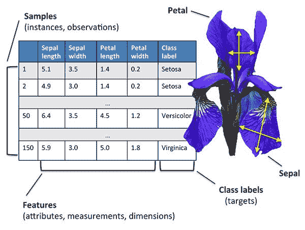](https://pyimagesearch.com/wp-content/uploads/2019/01/python_ml_iris.jpg)

**Figure 1:** The Iris dataset is a numerical dataset describing Iris flowers. It captures measurements of their sepal and petal length/width. Using these measurements we can attempt to predict flower species with Python and machine learning. ([source](https://medium.com/@jebaseelanravi96/machine-learning-iris-classification-33aa18a4a983))

Iris 数据集可以说是最简单的机器学习数据集之一——它通常用于帮助教授程序员和工程师机器学习和模式识别的基础知识。

我们称这个数据集为*“鸢尾数据集”*，因为它捕捉了三种鸢尾花的属性:

1.  *丝状虹膜*
2.  *杂色鸢尾*
3.  *北美鸢尾*

每种花卉都通过四个数字属性进行量化，所有属性都以厘米为单位:

1.  萼片长度
2.  萼片宽度
3.  花瓣长度
4.  花瓣宽度

**我们的目标是训练一个机器学习模型，从*测得的属性*中正确预测*花种*。**

值得注意的是，其中一个类与其他两个类是线性可分的——后者是*而不是*彼此线性可分的。

为了正确地对这些花卉种类进行分类，我们需要一个非线性模型。

在现实世界中使用 Python 执行机器学习时，需要非线性模型是非常常见的——本教程的其余部分将帮助您获得这种经验，并为在自己的数据集上执行机器学习做好更充分的准备。

### 3 场景图像数据集

[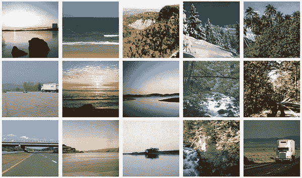](https://pyimagesearch.com/wp-content/uploads/2019/01/python_ml_3scenes.jpg)

**Figure 2:** The 3-scenes dataset consists of pictures of coastlines, forests, and highways. We’ll use Python to train machine learning and deep learning models.

我们将用于训练机器学习模型的第二个数据集称为 3 场景数据集，包括 3 个场景的 948 幅图像:

*   海岸(360°图像)
*   森林(328 张图片)
*   高速公路(260 张图片)

3 场景数据集是通过对 Oliva 和 Torralba 在 2001 年的论文 [*中的 8 场景数据集进行采样而创建的，该论文对场景的形状进行建模:空间包络*](http://people.csail.mit.edu/torralba/code/spatialenvelope/) 的整体表示。

我们的目标将是用 Python 训练机器学习和深度学习模型，以正确识别这些场景中的每一个。

我已经在本教程的 ***“下载”*** 部分包含了 3 场景数据集。在继续之前，请确保将 dataset +代码下载到这篇博文中。

### 在 Python 中执行机器学习的步骤

[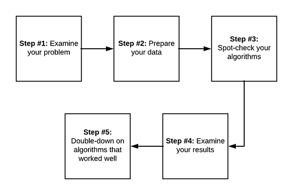](https://pyimagesearch.com/wp-content/uploads/2019/01/python_ml_steps.png)

**Figure 3:** Creating a machine learning model with Python is a process that should be approached systematically with an engineering mindset. These five steps are repeatable and will yield quality machine learning and deep learning models.

**每当你在 Python 中执行机器学习时，我建议从一个简单的 5 步过程开始:**

1.  检查你的问题
2.  准备您的数据(原始数据、特征提取、特征工程等)。)
3.  抽查一组算法
4.  检查您的结果
5.  对最有效的算法加倍下注

这个管道会随着你的机器学习经验的增长而演变，但对于初学者来说，这是我推荐入门的机器学习过程。

首先，我们必须**检查问题**。

问问你自己:

*   我在处理什么类型的数据？数值？绝对的？图像？
*   我的模型的最终目标是什么？
*   我将如何定义和衡量“准确性”？
*   鉴于我目前对机器学习的了解，我知道有什么算法可以很好地解决这类问题吗？

**特别是最后一个问题，非常关键** —你在 Python 中应用机器学习越多，你获得的经验就越多。

基于你以前的经验，你可能已经知道一个运行良好的算法。

从那里开始，你需要**准备你的数据**。

通常这一步包括从磁盘加载数据，检查数据，并决定是否需要执行*特征提取*或*特征工程*。

特征提取是应用算法以某种方式量化数据的过程。

例如，在处理图像时，我们可能希望计算直方图来总结图像中像素强度的分布，这样，我们就可以表征图像的颜色。

另一方面，特征工程是将原始输入数据转换成更好地代表潜在问题的表示的过程。

特征工程是一种更高级的技术，我建议你在已经有了一些机器学习和 Python 的经验后再去探索。

**接下来，你会想要抽查一组算法。**

我所说的抽查是什么意思？

只需将一组机器学习算法应用于数据集即可！

你可能会想把下面的机器学习算法放进你的工具箱里:

1.  线性模型(例如逻辑回归、线性 SVM)，
2.  一些非线性模型(例如 RBF 支持向量机，SGD 分类器)，
3.  一些基于树和集合的模型(例如决策树、随机森林)。
4.  一些神经网络，如果适用的话(多层感知器，卷积神经网络)

尝试为问题带来一套强大的机器学习模型——你的目标是通过识别哪些机器学习算法在问题上表现良好，哪些表现不佳，来获得关于你的问题/项目的经验。

一旦你定义了你的模型，训练它们并评估结果。

哪些机器学习模型效果很好？哪些车型表现不佳？

利用你的结果，在表现良好的机器学习模型上加倍努力，同时放弃表现不佳的模型。

随着时间的推移，你将开始看到在多个实验和项目中出现的模式。

你将开始发展一种“第六感”,知道什么机器学习算法在什么情况下表现良好。

例如，您可能会发现随机森林在应用于具有许多实值特性的项目时工作得非常好。

另一方面，您可能会注意到，逻辑回归可以很好地处理稀疏的高维空间。

你甚至会发现卷积神经网络非常适合图像分类(事实也确实如此)。

在这里用你的知识来补充传统的机器学习教育— **用 Python 学习机器学习最好的方法就是简单地卷起袖子，把手弄脏！**

一个基于实践经验(辅以一些超级基础理论)的机器学习教育，会带你在机器学习的旅途上走得很远！

### 让我们把手弄脏吧！

既然我们已经讨论了机器学习的基础知识，包括在 Python 中执行机器学习所需的步骤，那就让我们动手吧。

在下一节中，我们将简要回顾一下本教程的目录和项目结构。

***注意:**我建议您使用本教程的**“下载”**部分来下载源代码和示例数据，这样您就可以轻松地跟随了。*

一旦我们回顾了机器学习项目的目录结构，我们将实现两个 Python 脚本:

1.  第一个脚本将用于在 ***数字数据*** (即虹膜数据集)上训练机器学习算法
2.  第二个 Python 脚本将用于在 ***图像数据*** (即，3 场景数据集)上训练机器学习

作为奖励，我们将实现另外两个 Python 脚本，每个脚本都专用于神经网络和深度学习:

1.  我们将从实现 Python 脚本开始，该脚本将在 Iris 数据集上训练神经网络
2.  其次，您将学习如何在 3 场景数据集上训练您的第一个卷积神经网络

让我们首先回顾一下我们的项目结构。

### 我们的机器学习项目结构

一定要抓取与这篇博文相关的 ***【下载】*** 。

在那里，您可以解压缩归档文件并检查内容:

```py
$ tree --dirsfirst --filelimit 10
.
├── 3scenes
│   ├── coast [360 entries]
│   ├── forest [328 entries]
│   └── highway [260 entries]
├── classify_iris.py
├── classify_images.py
├── nn_iris.py
└── basic_cnn.py

4 directories, 4 files

```

虹膜数据集内置于 scikit-learn 中。然而，3 场景数据集却不是。我已经将它包含在`3scenes/`目录中，正如你所看到的，有三个图像子目录(类)。

我们今天将回顾四个 Python 机器学习脚本:

*   `classify_iris.py`:加载 Iris 数据集，通过简单的命令行参数开关，可以应用七种机器学习算法中的任意一种。
*   `classify_images.py`:收集我们的图像数据集(3 个场景)并应用 7 种 Python 机器学习算法中的任何一种
*   `nn_iris.py`:将简单的多层神经网络应用于虹膜数据集
*   `basic_cnn.py`:建立卷积神经网络(CNN)并使用 3 场景数据集训练模型

### 实现数值数据的 Python 机器学习

[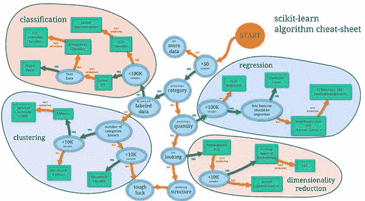](https://pyimagesearch.com/wp-content/uploads/2019/01/python_ml_cheatsheet_raw.png)

**Figure 4:** Over time, many statistical machine learning approaches have been developed. You can use this [map from the scikit-learn team](https://scikit-learn.org/stable/tutorial/machine_learning_map/index.html) as a guide for the most popular methods. [Expand](https://pyimagesearch.com/wp-content/uploads/2019/01/python_ml_cheatsheet_raw.png).

我们要实现的第一个脚本是`classify_iris.py` —这个脚本将用于在 Iris 数据集上抽查机器学习算法。

一旦实现，我们将能够使用`classify_iris.py`在 Iris 数据集上运行一套机器学习算法，查看结果，并决定哪个算法最适合该项目。

让我们开始吧——打开`classify_iris.py`文件并插入以下代码:

```py
# import the necessary packages
from sklearn.neighbors import KNeighborsClassifier
from sklearn.naive_bayes import GaussianNB
from sklearn.linear_model import LogisticRegression
from sklearn.svm import SVC
from sklearn.tree import DecisionTreeClassifier
from sklearn.ensemble import RandomForestClassifier
from sklearn.neural_network import MLPClassifier
from sklearn.model_selection import train_test_split
from sklearn.metrics import classification_report
from sklearn.datasets import load_iris
import argparse

# construct the argument parser and parse the arguments
ap = argparse.ArgumentParser()
ap.add_argument("-m", "--model", type=str, default="knn",
	help="type of python machine learning model to use")
args = vars(ap.parse_args())

```

**第 2-12 行**导入我们需要的包，具体是:

*   我们的 Python 机器学习方法来自 scikit-learn ( **第 2-8 行**)
*   一种数据集分割方法，用于将我们的数据分成训练和测试子集(**第 9 行**)
*   scikit-learn 的分类报告实用程序，它将打印我们的机器学习结果的摘要(**第 10 行**)
*   我们的虹膜数据集，内置于 scikit-learn ( **Line 11** )
*   一个用于[命令行参数解析的工具](https://pyimagesearch.com/2018/03/12/python-argparse-command-line-arguments/)叫做`argparse` ( **第 12 行**)

使用`argparse`，让我们解析第 15-18 行上的单个命令行参数标志`--model`。`--model`开关允许我们从以下任何型号中进行选择:

```py
# define the dictionary of models our script can use, where the key
# to the dictionary is the name of the model (supplied via command
# line argument) and the value is the model itself
models = {
	"knn": KNeighborsClassifier(n_neighbors=1),
	"naive_bayes": GaussianNB(),
	"logit": LogisticRegression(solver="lbfgs", multi_class="auto"),
	"svm": SVC(kernel="rbf", gamma="auto"),
	"decision_tree": DecisionTreeClassifier(),
	"random_forest": RandomForestClassifier(n_estimators=100),
	"mlp": MLPClassifier()
}

```

第 23-31 行**的`models`字典**定义了我们将要抽查的模型套件(我们将在稍后的文章中回顾这些算法的结果):

*   k-最近邻
*   朴素贝叶斯
*   逻辑回归
*   支持向量机
*   决策树
*   随机森林
*   感觉

按键可以通过`--model`开关直接输入终端。这里有一个例子:

```py
$ python classify_irs.py --model knn

```

从那里，`KNeighborClassifier`将被自动加载。这方便地允许我们在单个 Python 脚本中一次一个地按需调用 7 个机器学习模型中的任何一个(不需要编辑代码)！

接下来，让我们加载并拆分数据:

```py
# load the Iris dataset and perform a training and testing split,
# using 75% of the data for training and 25% for evaluation
print("[INFO] loading data...")
dataset = load_iris()
(trainX, testX, trainY, testY) = train_test_split(dataset.data,
	dataset.target, random_state=3, test_size=0.25)

```

我们的数据集很容易用专用的`load_iris`方法在**第 36 行**加载。一旦数据在内存中，我们继续调用`train_test_split`将数据分成 75%用于训练，25%用于测试(**第 37 和 38 行**)。

最后一步是训练和评估我们的模型:

```py
# train the model
print("[INFO] using '{}' model".format(args["model"]))
model = models[args["model"]]
model.fit(trainX, trainY)

# make predictions on our data and show a classification report
print("[INFO] evaluating...")
predictions = model.predict(testX)
print(classification_report(testY, predictions,
	target_names=dataset.target_names))

```

**42 线和 43 线**训练 Python 机器学习`model`(也称“拟合模型”，故名`.fit`)。

从那里，我们评估测试装置上的`model`(**线 47** )然后`print` a `classification_report`到我们的终端(**线 48 和 49** )。

### 实现图像的 Python 机器学习

[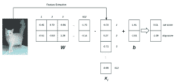](https://pyimagesearch.com/wp-content/uploads/2016/07/intro_linear_classifier_diagram.png)

**Figure 5:** A linear classifier example for implementing Python machine learning for image classification (Inspired by Karpathy’s example in the CS231n course).

下面的脚本`classify_images.py`用于仅在 3 场景图像数据集上训练上述相同的一套机器学习算法。

它与我们之前的 Iris 数据集分类脚本非常相似，因此请确保在学习过程中对两者进行比较。

现在让我们实现这个脚本:

```py
# import the necessary packages
from sklearn.neighbors import KNeighborsClassifier
from sklearn.naive_bayes import GaussianNB
from sklearn.linear_model import LogisticRegression
from sklearn.svm import SVC
from sklearn.tree import DecisionTreeClassifier
from sklearn.ensemble import RandomForestClassifier
from sklearn.neural_network import MLPClassifier
from sklearn.preprocessing import LabelEncoder
from sklearn.model_selection import train_test_split
from sklearn.metrics import classification_report
from PIL import Image
from imutils import paths
import numpy as np
import argparse
import os

```

首先，我们在第 2-16 行导入必要的包。看起来很多，但是你会从之前的脚本中认出其中的大部分。该脚本的其他导入包括:

*   `LabelEncoder`将用于将文本标签转换成数字(**第 9 行**)。
*   一个叫 PIL/枕头的基本图像处理工具( **Line 12** )。
*   我的便捷模块，`paths`，用于从磁盘中轻松抓取图像路径(**第 13 行**)。这包含在我个人的 [imutils](https://pyimagesearch.com/2015/02/02/just-open-sourced-personal-imutils-package-series-opencv-convenience-functions/) 包中，我已经发布给 [GitHub](https://github.com/jrosebr1/imutils/) 和 [PyPi](https://pypi.org/project/imutils/) 。
*   NumPy 将用于数值计算(**第 14 行**)。
*   Python 内置的`os`模块(**第 16 行**)。我们将使用它来容纳不同操作系统之间的路径分隔符。

在接下来的代码行中，您将看到每个导入是如何使用的。

接下来让我们定义一个名为`extract_color_stats`的函数:

```py
def extract_color_stats(image):
	# split the input image into its respective RGB color channels
	# and then create a feature vector with 6 values: the mean and
	# standard deviation for each of the 3 channels, respectively
	(R, G, B) = image.split()
	features = [np.mean(R), np.mean(G), np.mean(B), np.std(R),
		np.std(G), np.std(B)]

	# return our set of features
	return features

```

大多数机器学习算法在原始像素数据上的表现非常差。相反，我们执行特征提取来表征图像的内容。

这里，我们试图通过提取图像中每个颜色通道的平均值和标准偏差来量化图像的颜色。

给定图像的三个通道(红色、绿色和蓝色)，以及每个通道的两个特征(平均值和标准偏差)，我们有 *3 x 2 = 6* 个总特征来量化图像。我们通过连接这些值来形成特征向量。

事实上，*正是*的`extract_color_stats`函数正在做的事情:

*   我们从第 22 条线上的`image`分割出三个颜色通道。
*   然后在第 23 和 24 行上构建特征向量，您可以看到我们使用 NumPy 来计算每个通道的平均值和标准偏差

我们将使用这个函数来计算数据集中每个图像的特征向量。

让我们继续解析两个[命令行参数](https://pyimagesearch.com/2018/03/12/python-argparse-command-line-arguments/):

```py
# construct the argument parser and parse the arguments
ap = argparse.ArgumentParser()
ap.add_argument("-d", "--dataset", type=str, default="3scenes",
	help="path to directory containing the '3scenes' dataset")
ap.add_argument("-m", "--model", type=str, default="knn",
	help="type of python machine learning model to use")
args = vars(ap.parse_args())

```

前面的脚本只有一个参数，而这个脚本有两个命令行参数:

*   `--dataset`:驻留在磁盘上的 3 场景数据集的路径。
*   `--model`:要采用的 Python 机器学习模型。

同样，我们有七个机器学习模型可供选择，带有`--model`参数:

```py
# define the dictionary of models our script can use, where the key
# to the dictionary is the name of the model (supplied via command
# line argument) and the value is the model itself
models = {
	"knn": KNeighborsClassifier(n_neighbors=1),
	"naive_bayes": GaussianNB(),
	"logit": LogisticRegression(solver="lbfgs", multi_class="auto"),
	"svm": SVC(kernel="linear"),
	"decision_tree": DecisionTreeClassifier(),
	"random_forest": RandomForestClassifier(n_estimators=100),
	"mlp": MLPClassifier()
}

```

定义完`models`字典后，我们需要继续将图像加载到内存中:

```py
# grab all image paths in the input dataset directory, initialize our
# list of extracted features and corresponding labels
print("[INFO] extracting image features...")
imagePaths = paths.list_images(args["dataset"])
data = []
labels = []

# loop over our input images
for imagePath in imagePaths:
	# load the input image from disk, compute color channel
	# statistics, and then update our data list
	image = Image.open(imagePath)
	features = extract_color_stats(image)
	data.append(features)

	# extract the class label from the file path and update the
	# labels list
	label = imagePath.split(os.path.sep)[-2]
	labels.append(label)

```

我们的`imagePaths`是在**线 53** 上提取的。这只是路径本身的列表，我们将很快加载每个实际的图像。

我定义了两个列表，`data`和`labels` ( **第 54 行和第 55 行**)。列表`data`将保存我们的图像*特征向量*和对应的类`labels`。知道每个图像的标签允许我们训练我们的机器学习模型来自动预测我们的测试图像的类别标签。

**线 58-68** 在`imagePaths`上形成一个环，以便:

1.  加载每个`image` ( **行 61** )。
2.  使用之前定义的函数(**第 62 行**)从`image`提取一个颜色统计特征向量(每个通道的平均值和标准偏差)。
3.  然后在第 63 行的**上，特征向量被添加到我们的`data`列表中。**
4.  最后，从路径中提取出类`label`，并附加到相应的`labels`列表中(**第 67 行和第 68 行**)。

现在，让我们编码我们的`labels`并构造我们的数据分割:

```py
# encode the labels, converting them from strings to integers
le = LabelEncoder()
labels = le.fit_transform(labels)

# perform a training and testing split, using 75% of the data for
# training and 25% for evaluation
(trainX, testX, trainY, testY) = train_test_split(data, labels,
	test_size=0.25)

```

使用`LabelEncoder` ( **第 71 行和第 72 行**)将我们的文本`labels`转换成表示标签的整数:

```py
(pdb) labels = le.fit_transform(labels)
(pdb) set(labels)
{0, 1, 2}

```

正如在我们的虹膜分类脚本中，我们将数据分成 75%用于训练，25%用于测试(**第 76 行和第 77 行**)。

最后，我们可以训练和评估我们的模型:

```py
# train the model
print("[INFO] using '{}' model".format(args["model"]))
model = models[args["model"]]
model.fit(trainX, trainY)

# make predictions on our data and show a classification report
print("[INFO] evaluating...")
predictions = model.predict(testX)
print(classification_report(testY, predictions,
	target_names=le.classes_))

```

这些行几乎与虹膜分类脚本相同。我们正在调整(训练)我们的`model`并评估它(**第 81-86 行**)。一个`classification_report`被打印在终端中，以便我们可以分析结果(**第 87 行和第 88 行**)。

说到结果，现在我们已经完成了`classify_irs.py`和`classify_images.py`的实现，让我们使用 7 种 Python 机器学习算法中的每一种来测试它们。

### k-最近邻

[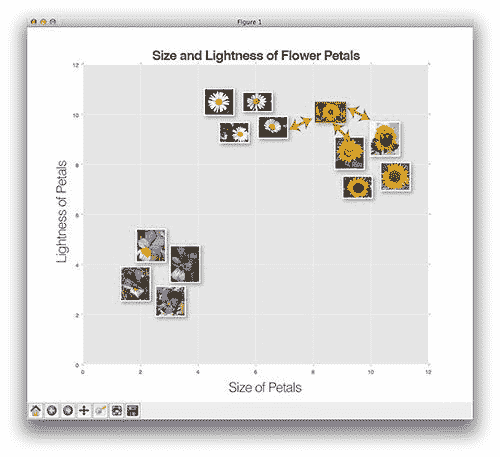](https://pyimagesearch.com/wp-content/uploads/2019/01/python_ml_knn.jpg)

**Figure 6:** The k-Nearest Neighbor (k-NN) method is one of the simplest machine learning algorithms.

k-最近邻分类器是迄今为止最简单的图像分类算法。

事实上，它是如此简单，以至于它实际上并没有“学习”任何东西。相反，该算法依赖于特征向量之间的距离。简单来说，k-NN 算法通过在 ***k** 最接近的例子*中找到*最常见的类*来对未知数据点进行分类。

第 *k* 个最接近的数据点中的每个数据点进行投票，票数最高的类别获胜！

或者，说白了:*“告诉我你的邻居是谁，我就知道你是谁。”*

例如，在上面的**图 6** 中，我们看到了三组花卉:

*   黛丝
*   短裤
*   向日葵

我们已经根据花瓣的亮度(颜色)和花瓣的大小绘制了每一幅花的图像(这是一个任意的例子，所以请原谅我的不正式)。

我们可以清楚地看到图像是一朵向日葵，但是如果我们的新图像与一朵三色堇和两朵向日葵的距离相等，k-NN 会怎么想？

嗯，k-NN 将检查三个最近的邻居( *k=3* )，因为向日葵有两票，三色紫罗兰有一票，所以向日葵类将被选中。

**要将 k-NN 投入使用，请确保您已经使用了本教程的*“下载”*部分来下载源代码和示例数据集。**

从那里，打开一个终端并执行以下命令:

```py
$ python classify_iris.py 
[INFO] loading data...
[INFO] using 'knn' model
[INFO] evaluating...
              precision    recall  f1-score   support

      setosa       1.00      1.00      1.00        15
  versicolor       0.92      0.92      0.92        12
   virginica       0.91      0.91      0.91        11

   micro avg       0.95      0.95      0.95        38
   macro avg       0.94      0.94      0.94        38

```

这里你可以看到 k-NN 在 Iris 数据集上获得了 95%的准确率，这是一个不错的开始！

让我们来看看我们的 3 场景数据集:

```py
python classify_images.py --model knn
[INFO] extracting image features...
[INFO] using 'knn' model
[INFO] evaluating...
              precision    recall  f1-score   support

       coast       0.84      0.68      0.75       105
      forest       0.78      0.77      0.77        78
     highway       0.56      0.78      0.65        54

   micro avg       0.73      0.73      0.73       237
   macro avg       0.72      0.74      0.72       237
weighted avg       0.75      0.73      0.73       237

```

在 3 场景数据集上，k-NN 算法获得了 **75%的准确率**。

特别是，k-NN 正在努力识别“高速公路”类(约 56%的准确率)。

在本教程的剩余部分，我们将探索提高图像分类精度的方法。

关于 k-最近邻算法如何工作的更多信息，请务必[参考这篇文章](https://pyimagesearch.com/2016/08/08/k-nn-classifier-for-image-classification/)。

### 朴素贝叶斯

[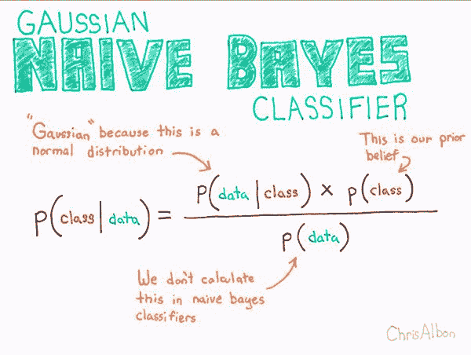](https://pyimagesearch.com/wp-content/uploads/2019/01/python_ml_naivebayes.jpg)

**Figure 7:** The Naïve Bayes machine learning algorithm is based upon Bayes’ theorem ([source](https://chrisalbon.com/machine_learning/naive_bayes/naive_bayes_classifier_from_scratch/)).

在 k-NN 之后，朴素贝叶斯通常是从业者将研究的第一个真正的机器学习算法。

该算法本身自 20 世纪 50 年代以来就已经存在，并经常用于为未来的实验获取基线(特别是在与文本检索相关的领域)。

朴素贝叶斯算法由于贝叶斯定理而成为可能(**图 7** )。

本质上，朴素贝叶斯将分类表述为一种预期概率。

给定我们的输入数据， *D* ，我们寻求计算给定类别的概率， *C* 。

形式上，这变成了 *P(C | D)* 。

为了实际计算概率，我们计算图 7 的分子(忽略分母)。

该表达式可以解释为:

1.  计算给定类的输入数据的概率(例如。给定的花是具有 4.9 厘米萼片长度的鸢尾的概率)
2.  然后乘以我们在整个数据群体中遇到该类的概率(例如甚至首先遇到*鸢尾 Setosa* 类的概率)

让我们继续将朴素贝叶斯算法应用于虹膜数据集:

```py
$ python classify_iris.py --model naive_bayes
[INFO] loading data...
[INFO] using 'naive_bayes' model
[INFO] evaluating...
              precision    recall  f1-score   support

      setosa       1.00      1.00      1.00        15
  versicolor       1.00      0.92      0.96        12
   virginica       0.92      1.00      0.96        11

   micro avg       0.97      0.97      0.97        38
   macro avg       0.97      0.97      0.97        38
weighted avg       0.98      0.97      0.97        38

```

我们现在达到了 98%的准确率，比 k-NN 算法有了显著的提高！

现在，让我们将朴素贝叶斯应用于 3 场景数据集进行图像分类:

```py
$ python classify_images.py --model naive_bayes
[INFO] extracting image features...
[INFO] using 'naive_bayes' model
[INFO] evaluating...
              precision    recall  f1-score   support

       coast       0.69      0.40      0.50        88
      forest       0.68      0.82      0.74        84
     highway       0.61      0.78      0.68        65

   micro avg       0.65      0.65      0.65       237
   macro avg       0.66      0.67      0.64       237
weighted avg       0.66      0.65      0.64       237

```

啊哦！

看起来我们在这里只获得了 66%的准确率。

这是否意味着 k-NN 比朴素贝叶斯更好，我们应该总是使用 k-NN 进行图像分类？

没那么快。

我们在这里可以说的是，对于这个*特定项目*和*这个特定的提取特征集*，k-NN 机器学习算法*优于*朴素贝叶斯。

我们*不能*说 k-NN 比朴素贝叶斯好，我们应该总是用 k-NN 代替。

认为一种机器学习算法总是比另一种更好是我看到许多新的机器学习从业者陷入的一个陷阱——不要犯这个错误。

有关朴素贝叶斯机器学习算法的更多信息，请务必参考这篇[优秀文章](https://becominghuman.ai/naive-bayes-theorem-d8854a41ea08)。

### 逻辑回归

[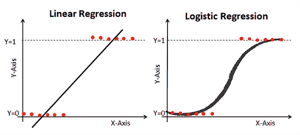](https://pyimagesearch.com/wp-content/uploads/2019/01/python_ml_logistic_regression.png)

**图 8:** 逻辑回归是一种基于逻辑函数始终在*【0，1】*范围内的机器学习算法。类似于线性回归，但是基于不同的函数，每个机器学习和 Python 爱好者都需要知道逻辑回归([来源](https://www.datacamp.com/community/tutorials/understanding-logistic-regression-python))。

我们要探索的下一个机器学习算法是逻辑回归。

逻辑回归是一种监督分类算法，通常用于预测类别标签的*概率*(逻辑回归算法的输出总是在*【0，1】*范围内)。

逻辑回归在机器学习中被大量使用，并且是任何机器学习从业者在其 Python 工具箱中需要逻辑回归的算法。

让我们将逻辑回归应用于 Iris 数据集:

```py
$ python classify_iris.py --model logit
[INFO] loading data...
[INFO] using 'logit' model
[INFO] evaluating...
              precision    recall  f1-score   support

      setosa       1.00      1.00      1.00        15
  versicolor       1.00      0.92      0.96        12
   virginica       0.92      1.00      0.96        11

   micro avg       0.97      0.97      0.97        38
   macro avg       0.97      0.97      0.97        38
weighted avg       0.98      0.97      0.97        38

```

在这里我们能够获得 98%的分类准确率！

此外，请注意，Setosa 和 Versicolor 类的分类 100%正确！

现在让我们将逻辑回归应用于图像分类的任务:

```py
$ python classify_images.py --model logit
[INFO] extracting image features...
[INFO] using 'logit' model
[INFO] evaluating...
              precision    recall  f1-score   support

       coast       0.67      0.67      0.67        92
      forest       0.79      0.82      0.80        82
     highway       0.61      0.57      0.59        63

   micro avg       0.70      0.70      0.70       237
   macro avg       0.69      0.69      0.69       237
weighted avg       0.69      0.70      0.69       237

```

逻辑回归在这里的表现略好于朴素贝叶斯，获得了 69%的准确率，但是为了击败 k-NN，我们需要一个更强大的 Python 机器学习算法。

### 支持向量机

[](https://pyimagesearch.com/wp-content/uploads/2019/01/python_ml_svm.png)

**Figure 9:** Python machine learning practitioners will often apply Support Vector Machines (SVMs) to their problems. SVMs are based on the concept of a hyperplane and the perpendicular distance to it as shown in 2-dimensions (the hyperplane concept applies to higher dimensions as well).

支持向量机(SVM)是非常强大的机器学习算法，能够通过*内核技巧*学习非线性数据集上的分离超平面。

如果一组数据点在一个 *N* 维空间中不是线性可分的，我们可以*将它们*投影到一个更高维度——也许在这个更高维度的空间中，数据点*是*线性可分的。

支持向量机的问题是，调整 SVM 上的旋钮以使其正常工作可能是一件痛苦的事情，尤其是对于新的 Python 机器学习实践者来说。

使用支持向量机时，通常需要对数据集进行*多次*实验来确定:

1.  适当的核类型(线性、多项式、径向基函数等。)
2.  内核函数的任何参数(例如多项式的次数)

如果一开始，你的 SVM 没有获得合理的精度，你会想回去调整内核和相关参数——调整 SVM 的这些旋钮对于获得一个好的机器学习模型至关重要。也就是说，让我们将 SVM 应用于虹膜数据集:

```py
$ python classify_iris.py --model svm
[INFO] loading data...
[INFO] using 'svm' model
[INFO] evaluating...
              precision    recall  f1-score   support

      setosa       1.00      1.00      1.00        15
  versicolor       1.00      0.92      0.96        12
   virginica       0.92      1.00      0.96        11

   micro avg       0.97      0.97      0.97        38
   macro avg       0.97      0.97      0.97        38
weighted avg       0.98      0.97      0.97        38

```

就像逻辑回归一样，我们的 SVM 获得了 **98%的准确率** —为了在 SVM 的虹膜数据集上获得 100%的准确率，我们需要进一步调整内核的参数。

让我们将 SVM 应用于 3 场景数据集:

```py
$ python classify_images.py --model svm
[INFO] extracting image features...
[INFO] using 'svm' model
[INFO] evaluating...
              precision    recall  f1-score   support

       coast       0.84      0.76      0.80        92
      forest       0.86      0.93      0.89        84
     highway       0.78      0.80      0.79        61

   micro avg       0.83      0.83      0.83       237
   macro avg       0.83      0.83      0.83       237

```

**哇，83%的准确率！**

这是迄今为止我们看到的最好的精确度！

显然，如果调整得当，支持向量机非常适合非线性可分数据集。

### 决策树

[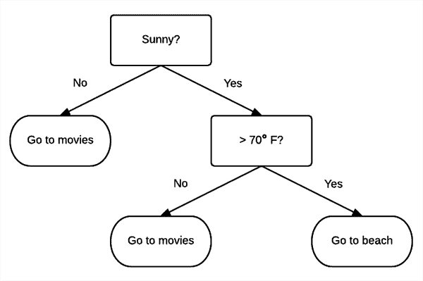](https://pyimagesearch.com/wp-content/uploads/2019/01/python_ml_decision_trees.png)

**Figure 10:** The concept of Decision Trees for machine learning classification can easily be explained with this figure. Given a feature vector and “set of questions” the bottom leaf represents the class. As you can see we’ll either “Go to the movies” or “Go to the beach”. There are two leaves for “Go to the movies” (nearly all complex decision trees will have multiple paths to arrive at the same conclusion with some shortcutting others).

决策树背后的基本思想是将分类分解成关于我们的特征向量中每个条目的一组选择。

我们从树根开始，然后向下进行到树叶，在树叶中进行实际的分类。

与许多机器学习算法不同，例如可能表现为“黑盒”学习算法(其中做出决策的路线可能很难解释和理解)，决策树可以非常直观——我们实际上可以*可视化*并且*解释*树正在做出的选择，然后遵循适当的路径进行分类。

例如，让我们假设我们要去海滩度假。我们在假期的第一天早上醒来，查看天气预报——阳光明媚，华氏 90 度。

这就给我们留下了一个决定:“我们今天应该做什么？去海边？还是看电影？”

潜意识里，我们可能会通过构建自己的决策树来解决问题(**图 10** )。

首先，我们需要知道外面是不是晴天。

快速查看一下我们智能手机上的天气应用程序，证实天气确实晴朗。

然后，我们沿着 *Sunny=Yes* 分支，到达下一个决策点——室外温度是否高于 70 度？

同样，在检查天气应用程序后，我们可以确认今天室外温度将超过 70 度。

沿着 *> 70=Yes* 分支，我们找到了一片树叶，最终决定——看起来我们要去海滩了！

在内部，决策树检查我们的输入数据，并使用 CART 或 [ID3](https://en.wikipedia.org/wiki/ID3_algorithm) 等算法寻找最佳的可能节点/值进行分割。然后**自动为我们建立**树，我们能够做出预测。

让我们继续将决策树算法应用于 Iris 数据集:

```py
$ python classify_iris.py --model decision_tree
[INFO] loading data...
[INFO] using 'decision_tree' model
[INFO] evaluating...
              precision    recall  f1-score   support

      setosa       1.00      1.00      1.00        15
  versicolor       0.92      0.92      0.92        12
   virginica       0.91      0.91      0.91        11

   micro avg       0.95      0.95      0.95        38
   macro avg       0.94      0.94      0.94        38
weighted avg       0.95      0.95      0.95        38

```

我们的决策树能够获得 95%的准确率。

我们的图像分类项目呢？

```py
$ python classify_images.py --model decision_tree
[INFO] extracting image features...
[INFO] using 'decision_tree' model
[INFO] evaluating...
              precision    recall  f1-score   support

       coast       0.71      0.74      0.72        85
      forest       0.76      0.80      0.78        83
     highway       0.77      0.68      0.72        69

   micro avg       0.74      0.74      0.74       237
   macro avg       0.75      0.74      0.74       237
weighted avg       0.74      0.74      0.74       237

```

在这里，我们获得了 74%的准确率(T1)，这不是最好的，但肯定也不是最差的。

### 随机森林

[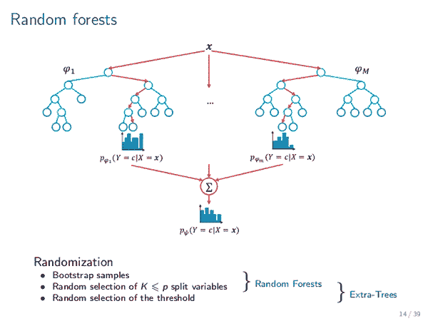](https://pyimagesearch.com/wp-content/uploads/2019/01/python_ml_random_forests.png)

**Figure 11:** A Random Forest is a collection of decision trees. This machine learning method injects a level of “randomness” into the algorithm via *bootstrapping* and *random node splits*. The final classification result is calculated by tabulation/voting. Random Forests tend to be more accurate than decision trees. ([source](https://www.kdnuggets.com/2017/10/random-forests-explained.html))

因为森林是树的集合，所以随机森林是决策树的集合。

然而，顾名思义，随机森林注入了决策树中不存在的“随机性”——这种随机性应用于算法中的两个点。

*   **自举** —随机森林分类器在来自原始训练数据的自举样本上训练每个单独的决策树。从本质上来说，自举就是用替换*共 *D* 次。自举用于提高我们的机器学习算法的准确性，同时降低过拟合的风险。*
*   **节点分裂中的随机性** —对于随机森林训练的每个决策树，随机森林将仅给予决策树可能特征的*部分*。

在实践中，通过为每棵树引导训练样本来将随机性注入到随机森林分类器中，随后仅允许特征的子集用于每棵树，通常会产生更准确的分类器。

在预测时，查询每个决策树，然后元随机森林算法将最终结果制成表格。

让我们在 Iris 数据集上尝试我们的随机森林:

```py
$ python classify_iris.py --model random_forest
[INFO] loading data...
[INFO] using 'random_forest' model
[INFO] evaluating...
              precision    recall  f1-score   support

      setosa       1.00      1.00      1.00        15
  versicolor       1.00      0.83      0.91        12
   virginica       0.85      1.00      0.92        11

   micro avg       0.95      0.95      0.95        38
   macro avg       0.95      0.94      0.94        38
weighted avg       0.96      0.95      0.95        38

```

正如我们所看到的，我们的随机森林获得了 96%的准确率，比只使用一个决策树要好一些。

但是对于图像分类呢？

随机森林适合我们的 3 场景数据集吗？

```py
$ python classify_images.py --model random_forest
[INFO] extracting image features...
[INFO] using 'random_forest' model
[INFO] evaluating...
              precision    recall  f1-score   support

       coast       0.80      0.83      0.81        84
      forest       0.92      0.84      0.88        90
     highway       0.77      0.81      0.79        63

   micro avg       0.83      0.83      0.83       237
   macro avg       0.83      0.83      0.83       237
weighted avg       0.84      0.83      0.83       237

```

使用一个随机森林，我们能够获得 84%的准确率，比使用 T2 决策树好了整整 10%。

一般来说，如果你发现决策树很适合你的机器学习和 Python 项目，你可能也想试试随机森林！

### 神经网络

[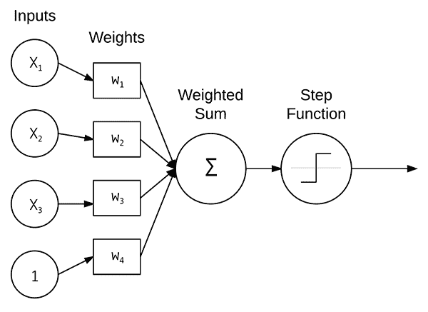](https://pyimagesearch.com/wp-content/uploads/2019/01/python_ml_perceptron.png)

**Figure 12:** Neural Networks are machine learning algorithms which are inspired by how the brains work. The Perceptron, a linear model, accepts a set of weights, computes the weighted sum, and then applies a step function to determine the class label.

最常见的神经网络模型之一是感知器，一种用于分类的线性模型。

感知器接受一组输入，获取输入和权重之间的点积，计算加权和，然后应用阶跃函数来确定输出类别标签。

我们通常不使用*原始*的感知器公式，因为我们现在有更先进的机器学习和深度学习模型。此外，由于反向传播算法的出现，我们可以训练*多层*感知器(MLP)。

结合非线性激活函数，MLPs 也可以求解非线性可分离数据集。

让我们使用 Python 和 scikit-learn 将多层感知器机器学习算法应用于我们的虹膜数据集:

```py
$ python classify_iris.py --model mlp
[INFO] loading data...
[INFO] using 'mlp' model
[INFO] evaluating...
              precision    recall  f1-score   support

      setosa       1.00      1.00      1.00        15
  versicolor       1.00      0.92      0.96        12
   virginica       0.92      1.00      0.96        11

   micro avg       0.97      0.97      0.97        38
   macro avg       0.97      0.97      0.97        38
weighted avg       0.98      0.97      0.97        38

```

我们的 MLP 在这里表现很好，获得了 **98%的分类准确率**。

让我们继续使用 MLP 进行图像分类:

```py
$ python classify_images.py --model mlp
[INFO] extracting image features...
[INFO] using 'mlp' model
[INFO] evaluating...
              precision    recall  f1-score   support

       coast       0.72      0.91      0.80        86
      forest       0.92      0.89      0.90        79
     highway       0.79      0.58      0.67        72

   micro avg       0.80      0.80      0.80       237
   macro avg       0.81      0.79      0.79       237
weighted avg       0.81      0.80      0.80       237

```

MLP 在这里达到了 81%的准确率——考虑到模型的简单性，这已经相当不错了！

### 深度学习和深度神经网络

[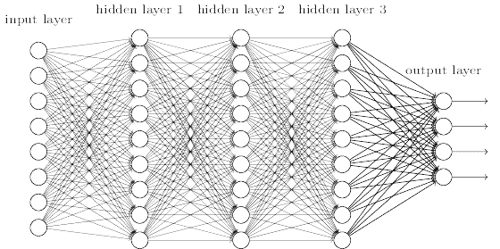](https://pyimagesearch.com/wp-content/uploads/2019/01/python_ml_dl.png)

**Figure 13:** Python is arguably the most popular language for Deep Learning, a subfield of machine learning. Deep Learning consists of neural networks with many hidden layers. The process of backpropagation tunes the weights iteratively as data is passed through the network. ([source](http://neuralnetworksanddeeplearning.com/chap6.html))

如果你对*机器学习*和 Python 感兴趣，那么你可能也遇到过术语*深度学习*。

**深度学习到底是什么？**

它与标准的机器学习有何不同？

好吧，首先，理解深度学习是机器学习的一个子领域是非常重要的，而机器学习又是更大的人工智能(AI)领域的一个子领域。

术语“深度学习”来自于训练具有许多隐藏层的神经网络。

事实上，在 20 世纪 90 年代，训练具有两个以上隐藏层的神经网络是非常具有挑战性的，原因是(解释[杰夫·辛顿](https://en.wikipedia.org/wiki/Geoffrey_Hinton)):

1.  我们标记的数据集太小了
2.  我们的计算机太慢了
3.  无法在训练前正确初始化我们的神经网络权重
4.  使用错误类型的非线性函数

现在情况不同了。我们现在有:

1.  更快的计算机
2.  高度优化的硬件(即 GPU)
3.  大型标注数据集
4.  更好地理解权重初始化
5.  卓越的激活功能

所有这些都在正确的时间达到了高潮，产生了深度学习的最新化身。

很有可能，如果你正在阅读这个关于机器学习的教程，那么你很可能也对深度学习感兴趣！

为了获得一些关于神经网络的经验，让我们用 Python 和 Keras 实现一个。

打开`nn_iris.py`并插入以下代码:

```py
# import the necessary packages
from keras.models import Sequential
from keras.layers.core import Dense
from keras.optimizers import SGD
from sklearn.preprocessing import LabelBinarizer
from sklearn.model_selection import train_test_split
from sklearn.metrics import classification_report
from sklearn.datasets import load_iris

# load the Iris dataset and perform a training and testing split,
# using 75% of the data for training and 25% for evaluation
print("[INFO] loading data...")
dataset = load_iris()
(trainX, testX, trainY, testY) = train_test_split(dataset.data,
	dataset.target, test_size=0.25)

# encode the labels as 1-hot vectors
lb = LabelBinarizer()
trainY = lb.fit_transform(trainY)
testY = lb.transform(testY)

```

让我们导入我们的包。

我们的 Keras 导入用于创建和训练我们简单的神经网络(**第 2-4 行**)。至此，您应该认识到 scikit-learn 导入(**第 5-8 行**)。

我们将继续加载+分割我们的数据，并在**第 13-20 行**一次性编码我们的标签。一个独热编码向量由二进制元素组成，其中一个是“热”的，例如在我们的三个花类中的`[0, 0, 1]`或`[1, 0, 0]`。

现在让我们建立我们的神经网络:

```py
# define the 4-3-3-3 architecture using Keras
model = Sequential()
model.add(Dense(3, input_shape=(4,), activation="sigmoid"))
model.add(Dense(3, activation="sigmoid"))
model.add(Dense(3, activation="softmax"))

```

我们的神经网络由使用 sigmoid 激活的两个完全连接的层组成。

最后一层有一个“softmax 分类器”,这基本上意味着它为我们的每个类都有一个输出，并且输出是概率百分比。

让我们继续训练和评估我们的`model`:

```py
# train the model using SGD
print("[INFO] training network...")
opt = SGD(lr=0.1, momentum=0.9, decay=0.1 / 250)
model.compile(loss="categorical_crossentropy", optimizer=opt,
	metrics=["accuracy"])
H = model.fit(trainX, trainY, validation_data=(testX, testY),
	epochs=250, batch_size=16)

# evaluate the network
print("[INFO] evaluating network...")
predictions = model.predict(testX, batch_size=16)
print(classification_report(testY.argmax(axis=1),
	predictions.argmax(axis=1), target_names=dataset.target_names))

```

我们的`model`在**线 30-32** 编制，然后在**线 33 和 34** 开始培训。

正如我们前面的两个脚本一样，我们希望通过评估我们的网络来检查性能。这是通过对我们的测试数据进行预测，然后打印一份分类报告来完成的(**第 38-40 行**)。

在这短短的 40 行代码中，隐藏着许多东西。对于神经网络基础知识的深入演练，请参考使用 Python 进行计算机视觉深度学习的入门包[](https://pyimagesearch.com/deep-learning-computer-vision-python-book/)*或 [PyImageSearch 大师课程](https://pyimagesearch.com/pyimagesearch-gurus/)。*

 *我们到了关键时刻— **我们的神经网络在虹膜数据集上会有怎样的表现？**

```py
$ python nn_iris.py 
Using TensorFlow backend.
[INFO] loading data...
[INFO] training network...
Train on 112 samples, validate on 38 samples
Epoch 1/250
2019-01-04 10:28:19.104933: I tensorflow/core/platform/cpu_feature_guard.cc:141] Your CPU supports instructions that this TensorFlow binary was not compiled to use: AVX2 AVX512F FMA
112/112 [==============================] - 0s 2ms/step - loss: 1.1454 - acc: 0.3214 - val_loss: 1.1867 - val_acc: 0.2368
Epoch 2/250
112/112 [==============================] - 0s 48us/step - loss: 1.0828 - acc: 0.3929 - val_loss: 1.2132 - val_acc: 0.5000
Epoch 3/250
112/112 [==============================] - 0s 47us/step - loss: 1.0491 - acc: 0.5268 - val_loss: 1.0593 - val_acc: 0.4737
...
Epoch 248/250
112/112 [==============================] - 0s 46us/step - loss: 0.1319 - acc: 0.9554 - val_loss: 0.0407 - val_acc: 1.0000
Epoch 249/250
112/112 [==============================] - 0s 46us/step - loss: 0.1024 - acc: 0.9643 - val_loss: 0.1595 - val_acc: 0.8947
Epoch 250/250
112/112 [==============================] - 0s 47us/step - loss: 0.0795 - acc: 0.9821 - val_loss: 0.0335 - val_acc: 1.0000
[INFO] evaluating network...
             precision    recall  f1-score   support

     setosa       1.00      1.00      1.00         9
 versicolor       1.00      1.00      1.00        10
  virginica       1.00      1.00      1.00        19

avg / total       1.00      1.00      1.00        38

```

哇，太完美了！我们达到了 100%的准确率！

这个神经网络是我们应用的第一个*Python 机器学习算法，它能够在虹膜数据集上达到 100%的准确率。*

我们的神经网络在这里表现良好的原因是因为我们利用了:

1.  多个隐藏层
2.  非线性激活函数(即，sigmoid 激活函数)

鉴于我们的神经网络在虹膜数据集上表现如此之好，我们应该假设在图像数据集上也有类似的准确性，对吗？嗯，我们实际上有一个锦囊妙计——为了在图像数据集上获得更高的精确度，我们可以使用一种特殊类型的神经网络，称为*卷积神经网络*。

### 卷积神经网络

[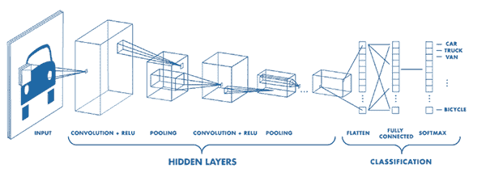](https://pyimagesearch.com/wp-content/uploads/2019/01/python_ml_cnn.png)

**Figure 14:** Deep learning Convolutional Neural Networks (CNNs) operate directly on the pixel intensities of an input image alleviating the need to perform feature extraction. Layers of the CNN are stacked and patterns are learned automatically. ([source](https://medium.freecodecamp.org/an-intuitive-guide-to-convolutional-neural-networks-260c2de0a050))

卷积神经网络，简称 CNN，是一种特殊类型的神经网络，非常适合图像理解任务。与大多数机器学习算法不同，CNN 直接对我们输入图像的像素强度操作*——不需要执行特征提取！*

在内部，CNN 中的每个卷积层都在学习一组滤波器。这些滤波器与我们的输入图像进行卷积，并且模式被自动学习。我们也可以堆叠这些卷积运算，就像神经网络中的任何其他层一样。

让我们继续学习如何实现一个简单的 CNN，并将其应用于基本的图像分类。

打开`basic_cnn.py`脚本并插入以下代码:

```py
# import the necessary packages
from keras.models import Sequential
from keras.layers.convolutional import Conv2D
from keras.layers.convolutional import MaxPooling2D
from keras.layers.core import Activation
from keras.layers.core import Flatten
from keras.layers.core import Dense
from keras.optimizers import Adam
from sklearn.preprocessing import LabelBinarizer
from sklearn.model_selection import train_test_split
from sklearn.metrics import classification_report
from PIL import Image
from imutils import paths
import numpy as np
import argparse
import os

# construct the argument parser and parse the arguments
ap = argparse.ArgumentParser()
ap.add_argument("-d", "--dataset", type=str, default="3scenes",
	help="path to directory containing the '3scenes' dataset")
args = vars(ap.parse_args())

```

为了用 Python 和 Keras 为机器学习构建一个卷积神经网络，我们需要在第 2-8 行的**上添加五个 Keras 导入。**

这一次，我们正在导入卷积层类型，最大池操作，不同的激活函数，以及扁平化的能力。此外，我们使用的是`Adam`优化器，而不是我们在前面的简单神经网络脚本中使用的 SGD。

至此，您应该已经熟悉了 scikit-learn 和其他导入的名称。

这个脚本只有一个命令行参数`--dataset`。它再次表示磁盘上 3-scenes 目录的路径。

现在让我们加载数据:

```py
# grab all image paths in the input dataset directory, then initialize
# our list of images and corresponding class labels
print("[INFO] loading images...")
imagePaths = paths.list_images(args["dataset"])
data = []
labels = []

# loop over our input images
for imagePath in imagePaths:
	# load the input image from disk, resize it to 32x32 pixels, scale
	# the pixel intensities to the range [0, 1], and then update our
	# images list
	image = Image.open(imagePath)
	image = np.array(image.resize((32, 32))) / 255.0
	data.append(image)

	# extract the class label from the file path and update the
	# labels list
	label = imagePath.split(os.path.sep)[-2]
	labels.append(label)

```

类似于我们的`classify_images.py`脚本，我们将继续获取我们的`imagePaths`并构建我们的数据和标签列表。

这次有一点你不能忽视:

**我们正在对*原始像素本身*而不是颜色统计特征向量进行操作。**花时间再次回顾`classify_images.py`，并将其与`basic_cnn.py`的台词进行比较。

为了对原始像素强度进行操作，我们继续将每个图像的大小调整为 *32×32* ，并通过除以**行 36 和 37** 上的`255.0`(像素的最大值)缩放到范围*【0，1】*。然后我们将调整大小和缩放后的`image`添加到`data`列表中(**第 38 行**)。

让我们一次性编码我们的标签，并拆分我们的培训/测试数据:

```py
# encode the labels, converting them from strings to integers
lb = LabelBinarizer()
labels = lb.fit_transform(labels)

# perform a training and testing split, using 75% of the data for
# training and 25% for evaluation
(trainX, testX, trainY, testY) = train_test_split(np.array(data),
	np.array(labels), test_size=0.25)

```

然后用 Keras 建立我们的图像分类 CNN:

```py
# define our Convolutional Neural Network architecture
model = Sequential()
model.add(Conv2D(8, (3, 3), padding="same", input_shape=(32, 32, 3)))
model.add(Activation("relu"))
model.add(MaxPooling2D(pool_size=(2, 2), strides=(2, 2)))
model.add(Conv2D(16, (3, 3), padding="same"))
model.add(Activation("relu"))
model.add(MaxPooling2D(pool_size=(2, 2), strides=(2, 2)))
model.add(Conv2D(32, (3, 3), padding="same"))
model.add(Activation("relu"))
model.add(MaxPooling2D(pool_size=(2, 2), strides=(2, 2)))
model.add(Flatten())
model.add(Dense(3))
model.add(Activation("softmax"))

```

在**第 55-67 行**上，演示一个基本的 CNN 架构。具体细节现在并不重要，但是如果你很好奇，你应该:

*   阅读我的 Keras 教程,它会让你跟上 Keras 的步伐
*   通读我的书 [*用 Python 进行计算机视觉的深度学习*](https://pyimagesearch.com/deep-learning-computer-vision-python-book/) ，里面有超级实用的演练和动手教程
*   浏览我在 Keras Conv2D 参数上的[博客文章，包括每个参数的作用以及何时使用该特定参数](https://pyimagesearch.com/2018/12/31/keras-conv2d-and-convolutional-layers/)

让我们继续训练和评估我们的 CNN 模型:

```py
# train the model using the Adam optimizer
print("[INFO] training network...")
opt = Adam(lr=1e-3, decay=1e-3 / 50)
model.compile(loss="categorical_crossentropy", optimizer=opt,
	metrics=["accuracy"])
H = model.fit(trainX, trainY, validation_data=(testX, testY),
	epochs=50, batch_size=32)

# evaluate the network
print("[INFO] evaluating network...")
predictions = model.predict(testX, batch_size=32)
print(classification_report(testY.argmax(axis=1),
	predictions.argmax(axis=1), target_names=lb.classes_))

```

我们的模型的训练和评估类似于我们之前的脚本。

让我们试试 CNN，好吗？

```py
$ python basic_cnn.py 
Using TensorFlow backend.
[INFO] loading images...
[INFO] training network...
Train on 711 samples, validate on 237 samples
Epoch 1/50
711/711 [==============================] - 0s 629us/step - loss: 1.0647 - acc: 0.4726 - val_loss: 0.9920 - val_acc: 0.5359
Epoch 2/50
711/711 [==============================] - 0s 313us/step - loss: 0.9200 - acc: 0.6188 - val_loss: 0.7778 - val_acc: 0.6624
Epoch 3/50
711/711 [==============================] - 0s 308us/step - loss: 0.6775 - acc: 0.7229 - val_loss: 0.5310 - val_acc: 0.7553
...
Epoch 48/50
711/711 [==============================] - 0s 307us/step - loss: 0.0627 - acc: 0.9887 - val_loss: 0.2426 - val_acc: 0.9283
Epoch 49/50
711/711 [==============================] - 0s 310us/step - loss: 0.0608 - acc: 0.9873 - val_loss: 0.2236 - val_acc: 0.9325
Epoch 50/50
711/711 [==============================] - 0s 307us/step - loss: 0.0587 - acc: 0.9887 - val_loss: 0.2525 - val_acc: 0.9114
[INFO] evaluating network...
             precision    recall  f1-score   support

      coast       0.85      0.96      0.90        85
     forest       0.99      0.94      0.97        88
    highway       0.91      0.80      0.85        64

avg / total       0.92      0.91      0.91       237

```

使用机器学习和我们的 CNN，我们能够获得 **92%的准确率**，*远远好于我们在本教程中尝试的任何先前的机器学习算法！*

显然，CNN 非常适合解决图像理解问题。

### 我们的 Python +机器学习结果意味着什么？

从表面上看，你可能会想看看这篇文章的结果，并得出如下结论:

*   “逻辑回归在图像分类上表现不佳，我不应该使用逻辑回归。”
*   k-NN 在图像分类方面做得相当好，我将一直使用 k-NN

对这些类型的结论要小心，并记住我在本文前面详述的 5 步机器学习过程:

1.  检查你的问题
2.  准备您的数据(原始数据、特征提取、特征工程等)。)
3.  抽查一组算法
4.  检查您的结果
5.  对最有效的算法加倍下注

你遇到的每一个问题在某种程度上都是不同的。

随着时间的推移，通过大量的实践和经验，你将获得一种“第六感”,知道什么样的机器学习算法在给定的情况下会工作得很好。

然而，在你达到这一点之前，你需要开始应用各种机器学习算法，检查什么有效，并在显示潜力的算法上加倍努力。

没有两个问题是相同的，在某些情况下，一个你曾经认为“差”的机器学习算法实际上会表现得很好！

## 摘要

在本教程中，您学习了如何开始学习机器学习和 Python。

具体来说，你学习了如何训练总共**九种不同的机器学习算法:**

1.  k-最近邻
2.  朴素贝叶斯
3.  逻辑回归
4.  支持向量机
5.  决策树
6.  随机森林
7.  感觉
8.  多层前馈神经网络
9.  卷积神经网络

然后，我们将我们的机器学习算法应用于两个不同的领域:

1.  通过 Iris 数据集进行数值数据分类
2.  基于 3 场景数据集的图像分类

**我建议你使用本教程中的 Python 代码和相关的机器学习算法作为你自己项目的起点**。

最后，请记住我们用 Python 处理机器学习问题的五个步骤(您甚至可能希望打印出这些步骤并放在身边):

1.  检查你的问题
2.  准备您的数据(原始数据、特征提取、特征工程等)。)
3.  抽查一组算法
4.  检查您的结果
5.  对最有效的算法加倍下注

通过使用今天帖子中的代码，你将能够开始使用 Python 进行机器学习——享受它，如果你想继续你的机器学习之旅，请务必查看 **[PyImageSearch 大师课程](https://pyimagesearch.com/pyimagesearch-gurus/)** ，以及我的书 [***使用 Python 进行计算机视觉的深度学习***](https://pyimagesearch.com/deep-learning-computer-vision-python-book/) ，其中我详细介绍了机器学习、深度学习和计算机视觉。

**要下载这篇文章的源代码，并在 PyImageSearch 上发布未来教程时得到通知，*只需在下面的表格中输入您的电子邮件地址*。***