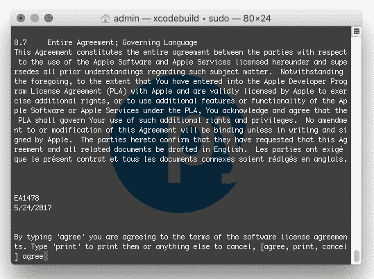
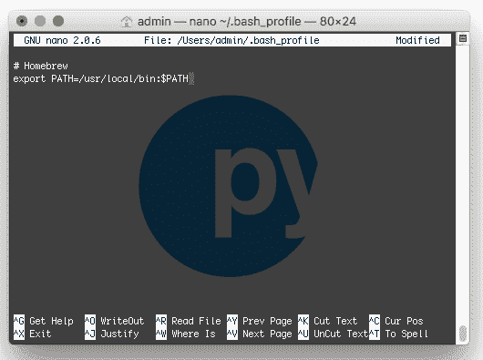
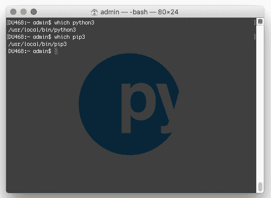
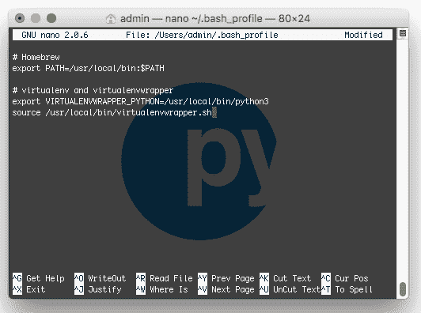
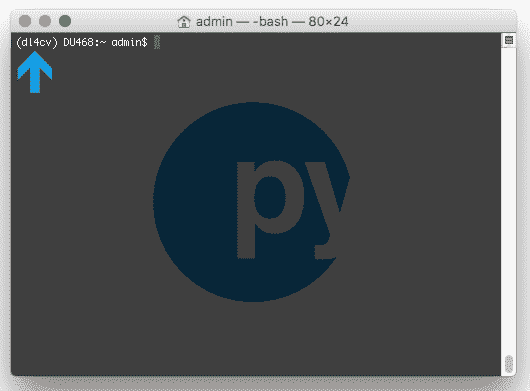
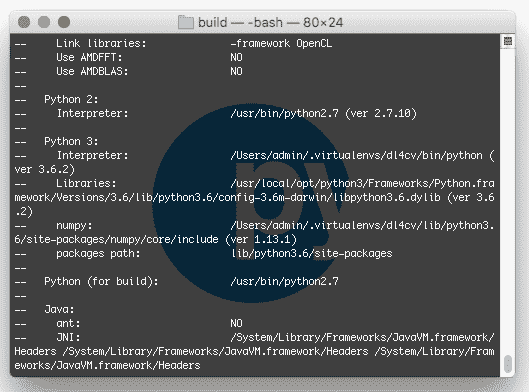
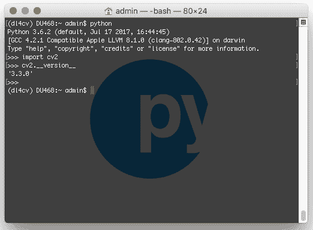
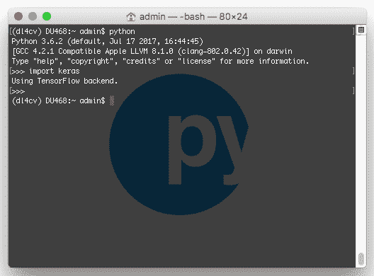

# 使用 Python、TensorFlow 和 Keras 进行深度学习的 macOS

> 原文：<https://pyimagesearch.com/2017/09/29/macos-for-deep-learning-with-python-tensorflow-and-keras/>


在今天的教程中，我将演示如何使用 Python、TensorFlow 和 Keras 为深度学习配置 macOS 系统。

本教程是为深度学习配置开发环境系列的最后一部分。我创建了这些教程来配合我的新书， [*用 Python 进行计算机视觉的深度学习*](https://pyimagesearch.com/deep-learning-computer-vision-python-book/)；然而，不管你是否买了我的书，你都可以使用这些说明来配置你的系统*。*

如果你在错误的页面(或者你没有 macOS)，看看这个系列的其他深度学习开发环境教程:

*   [你的深度学习+ Python Ubuntu 虚拟机](https://pyimagesearch.com/2017/09/22/deep-learning-python-ubuntu-virtual-machine/)
*   [用 Python 预配置亚马逊 AWS 深度学习 AMI](https://pyimagesearch.com/2017/09/20/pre-configured-amazon-aws-deep-learning-ami-with-python/)
*   [用 Python 为深度学习配置 Ubuntu](https://pyimagesearch.com/2017/09/25/configuring-ubuntu-for-deep-learning-with-python/)(仅限 CPU*)*
**   [用 Python 设置 Ubuntu 16.04 + CUDA + GPU 进行深度学习](https://pyimagesearch.com/2017/09/27/setting-up-ubuntu-16-04-cuda-gpu-for-deep-learning-with-python/)*   使用 Python、TensorFlow 和 Keras 进行深度学习的 macOS(本文)*

 ***要了解如何用 Python 配置 macOS 进行深度学习和计算机视觉，*继续阅读*。**

## 使用 Python、TensorFlow 和 Keras 进行深度学习的 macOS

随着你适应深度学习领域，你会想要进行许多实验来磨练你的技能，甚至解决现实世界的问题。

你会发现*初学者捆绑包*中的大部分章节和*实践者捆绑包*中的一半章节的实验可以在你的 CPU 上执行。 *ImageNet 捆绑包*的读者将需要一台 GPU 机器来执行更高级的实验。

我绝对不建议在你的笔记本电脑上处理大型数据集和深度神经网络，但就像我说的，对于小型实验来说，这很好。

今天，我将带您了解配置 Mac 进行深度学习的步骤。

首先，我们将安装 Xcode 和 Homebrew(一个包管理器)。在那里，我们将创建一个名为`dl4cv`的虚拟环境，并将 OpenCV、TensorFlow 和 Keras 安装到该环境中。

让我们开始吧。

### 步骤 1:安装 Xcode

首先，你需要从苹果应用商店获得 Xcode 并安装它。别担心，它是 100%免费的。

[](https://pyimagesearch.com/wp-content/uploads/2016/11/sierra_xcode_app_store.jpg)

**Figure 1:** Selecting Xcode from the Apple App Store.

从那里，打开一个终端并执行以下命令来接受开发人员许可证:

```py
$ sudo xcodebuild -license

```

下一步是安装苹果命令行工具:

```py
$ sudo xcode-select --install

```

[](https://pyimagesearch.com/wp-content/uploads/2017/09/dl4cv_macos_license.png)

**Figure 2:** Accepting the Xcode license.

### 第二步:安装自制软件

家酿(也称为 brew)，是 macOS 的软件包管理器。您的系统中可能已经有了它，但是如果没有，您将需要执行本节中的操作。

首先，我们将通过复制并粘贴**整个**命令到您的终端来安装 Homebrew:

```py
$ /usr/bin/ruby -e "$(curl -fsSL https://raw.githubusercontent.com/Homebrew/install/master/install)"

```

接下来，我们将更新我们的包定义:

```py
$ brew update

```

随后使用`nano`终端编辑器更新您的`~/.bash_profile`(任何其他编辑器也应该这样做):

```py
$ nano ~/.bash_profile

```

将以下几行添加到文件中:

```py
# Homebrew
export PATH=/usr/local/bin:$PATH

```

[](https://pyimagesearch.com/wp-content/uploads/2017/09/dl4cv_macos_bashprofile_homebrew.png)

**Figure 3:** Changing *~/.bash_profile* to accommodate Homebrew.

接下来，只需重新加载您的`~/.bash_profile`(当一个新的终端打开时，这将自动发生):

```py
$ source ~/.bash_profile

```

现在 Brew 已经准备好了，让我们安装 Python 3。

### 步骤 3:安装 macOS 版的 Homebrew Python 3

这一步其实很容易，但是我想先理清一些可能的困惑。

macOS 自带 Python 安装；然而，我们将使用 Brew 安装一个非系统 Python。虽然你*可以*使用你的系统 Python，但实际上是 ***极力劝阻*** 。因此，不要跳过这一步，这对您的成功安装非常重要。

要用 Homebrew 安装 Python 3，只需执行以下命令:

```py
$ brew install python3

```

在继续之前，您需要验证您的 Python 3 安装是自制的，而不是 macOS 系统的:

```py
$ which python3
/usr/local/bin/python3
$ which pip3
/usr/local/bin/pip3

```

确保在每个路径中都看到“`local`”。如果您没有看到这个输出，那么您没有使用 Homebrew 的 Python 3 安装。

[](https://pyimagesearch.com/wp-content/uploads/2017/09/dl4cv_macos_which_python3_pip3.png)

**Figure 4:** Executing *which python3* and *which pip3* to ensure that you are using the Homebrew version of each rather than the system version.

假设您的 Python 3 安装工作正常，让我们继续进行**步骤#4** 。

### 步骤 4:创建您的 Python 虚拟环境

正如我在本网站的[其他安装指南中所述，虚拟环境绝对是使用 Python 时的必由之路，使您能够在沙盒环境中适应不同的版本。](https://pyimagesearch.com/opencv-tutorials-resources-guides/)

换句话说，你不太可能去做一些让人头疼的事情。如果您搞乱了一个环境，您可以简单地删除该环境并重新构建它。

让我们通过`pip`安装[虚拟 T2【和](https://virtualenv.pypa.io/en/latest/)[虚拟包装器](https://virtualenvwrapper.readthedocs.org/en/latest/):

```py
$ pip3 install virtualenv virtualenvwrapper

```

从那里，我们将再次更新我们的`~/.bash_profile`:

```py
$ nano ~/.bash_profile

```

我们将在文件中添加以下几行:

```py
# virtualenv and virtualenvwrapper
export VIRTUALENVWRAPPER_PYTHON=/usr/local/bin/python3
source /usr/local/bin/virtualenvwrapper.sh

```

[](https://pyimagesearch.com/wp-content/uploads/2017/09/dl4cv_macos_bash_profile_virtualenv.png)

**Figure 5:** The bottom of our *~/.bash_profile* should contain these lines for virtualenv and virtualenvwrapper.

然后重新加载文件:

```py
$ source ~/.bash_profile

```

#### 创建“dl4cv”环境

这个`dl4cv`环境将包含我们所有的软件，用于执行与[我的书](https://pyimagesearch.com/deep-learning-computer-vision-python-book/)相关的实验。您可以随意命名这个环境，但是从现在开始，我们将把它称为`dl4cv`。

要使用 **Python 3** 创建 dl4cv 环境，只需输入以下命令:

```py
$ mkvirtualenv dl4cv -p python3

```

在 Python 3 和支持脚本被安装到新环境中之后，您实际上应该已经在环境的中*了。这在 bash 提示符的开头用“`(dl4cv)`”表示，如下图所示:*

[](https://pyimagesearch.com/wp-content/uploads/2017/09/dl4cv_macos_dl4cv.png)

**Figure 6:** The *(dl4cv)* in the bash prompt signifies that we are working inside the *dl4cv* virtual environment. If you don’t see this, then execute *workon dl4cv* to activate the environment.

如果您没有看到修改后的 bash 提示符，那么您可以随时输入以下命令来随时进入环境:

```py
$ workon dl4cv

```

OpenCV 需要的唯一 Python 依赖项是 NumPy，我们可以在下面安装它:

```py
$ pip install numpy

```

这就是创建虚拟环境和安装 NumPy 的全部内容。让我们继续**步骤#5** 。

### 步骤 5:使用自制软件安装 OpenCV 先决条件

需要安装以下工具来进行编译、映像 I/O 和优化:

```py
$ brew install cmake pkg-config wget
$ brew install jpeg libpng libtiff openexr
$ brew install eigen tbb

```

安装完这些包之后，我们就可以安装 OpenCV 了。

### 步骤 6:编译并安装 OpenCV

首先，让我们下载源代码:

```py
$ cd ~
$ wget -O opencv.zip https://github.com/opencv/opencv/archive/3.3.0.zip
$ wget -O opencv_contrib.zip https://github.com/opencv/opencv_contrib/archive/3.3.0.zip

```

然后打开档案:

```py
$ unzip opencv.zip
$ unzip opencv_contrib.zip

```

接下来用 CMake 配置构建(非常重要的是，您要完全复制 CMake 命令**，就像它在这里出现的那样，注意复制并越过整个**命令；我建议点击下面工具栏中的 *" < = > "* 按钮展开整个命令):****

```py
$ cd ~/opencv-3.3.0/
$ mkdir build
$ cd build
$ cmake -D CMAKE_BUILD_TYPE=RELEASE \
    -D CMAKE_INSTALL_PREFIX=/usr/local \
    -D OPENCV_EXTRA_MODULES_PATH=~/opencv_contrib-3.3.0/modules \
    -D PYTHON3_LIBRARY=`python -c 'import subprocess ; import sys ; s = subprocess.check_output("python-config --configdir", shell=True).decode("utf-8").strip() ; (M, m) = sys.version_info[:2] ; print("{}/libpython{}.{}.dylib".format(s, M, m))'` \
    -D PYTHON3_INCLUDE_DIR=`python -c 'import distutils.sysconfig as s; print(s.get_python_inc())'` \
    -D PYTHON3_EXECUTABLE=$VIRTUAL_ENV/bin/python \
    -D BUILD_opencv_python2=OFF \
    -D BUILD_opencv_python3=ON \
    -D INSTALL_PYTHON_EXAMPLES=ON \
    -D INSTALL_C_EXAMPLES=OFF \
    -D BUILD_EXAMPLES=ON ..

```

***注意:**对于上面的 CMake 命令，我花了相当多的时间来创建、测试和重构它。我相信，如果你完全按照它显示的那样使用它，它会节省你的时间和挫折。**确保点击上面代码块工具栏中的“< = >”按钮，展开代码块。**这将使你能够复制并粘贴整个**命令。*** 

您的输出应该类似于下面的屏幕截图，确保使用了正确的 Python 3 二进制/库和 NumPy 版本:

[](https://pyimagesearch.com/wp-content/uploads/2017/09/dl4cv_macos_cmake_python_numpy.png)

**Figure 7:** The OpenCV CMake output that ensures the correct Python 3 and NumPy will be used for compiling.

然后我们准备执行编译编译 OpenCV:

```py
$ make -j4

```

***注:**上面的数字“4”表示我们有 4 个内核/处理器用于编译。如果您有不同数量的处理器，您可以更新`-j`开关。对于只有一个内核/处理器，只需使用`make`命令(如果构建失败或停滞，在重试之前，从构建目录输入`make clean`)。*

从那里您可以安装 OpenCV:

```py
$ sudo make install

```

安装后，有必要将`cv2.so`文件符号链接到`dl4cv`虚拟环境中:

```py
$ cd ~/.virtualenvs/dl4cv/lib/python3.6/site-packages/
$ ln -s /usr/local/lib/python3.6/site-packages/cv2.cpython-36m-darwin.so cv2.so
$ cd ~

```

最后，我们可以测试安装:

```py
$ python
>>> import cv2
>>> cv2.__version__
'3.3.0'

```

[](https://pyimagesearch.com/wp-content/uploads/2017/09/dl4cv_macos_cv2_version.png)

**Figure 8:** OpenCV 3.3 has been installed and linked as is shown by the successful import and display of the version.

如果您的输出正确地显示了您安装的 OpenCV 版本，那么您就可以继续进行**步骤#7** 了，我们将在那里安装 Keras 深度学习库。

### Step #7: Install Keras

在开始这一步之前，确保您已经激活了`dl4cv` virtualenv。如果您不在该环境中，只需执行:

```py
$ workon dl4cv

```

然后，使用`pip`，安装所需的 Python 计算机视觉、图像处理和机器学习库:

```py
$ pip install scipy pillow
$ pip install imutils h5py requests progressbar2
$ pip install scikit-learn scikit-image

```

接下来安装 matplotlib 并**更新渲染后端**:

```py
$ pip install matplotlib
$ touch ~/.matplotlib/matplotlibrc
$ echo "backend: TkAgg" >> ~/.matplotlib/matplotlibrc

```

然后，安装 TensorFlow:

```py
$ pip install tensorflow

```

其次是 keras:

```py
$ pip install keras

```

要验证 Keras 是否正确安装，我们可以导入它并检查错误:

```py
$ python
>>> import keras
Using TensorFlow backend.
>>>

```

Keras 应该被正确导入，同时声明 TensorFlow 被用作后端。

[](https://pyimagesearch.com/wp-content/uploads/2017/09/dl4cv_macos_keras_installed.png)

**Figure 9:** Keras is successfully installed into the *dl4cv* virtual environment.

此时，您可以熟悉一下`~/.keras/keras.json`文件:

```py
{
	"image_data_format": "channels_last",
	"backend": "tensorflow",
	"epsilon": 1e-07,
	"floatx": "float32"
}

```

确保`image_data_format`设置为`channels_last`并且`backend`设置为`tensorflow`。

***恭喜恭喜！*** 你现在可以出发了。如果您在安装过程中没有打开啤酒或咖啡，现在是时候了。也是时候找个舒服的地方读读 [*用 Python 做计算机视觉的深度学习*](https://pyimagesearch.com/deep-learning-computer-vision-python-book/) 。

## 摘要

在今天的帖子中，我们为计算机视觉和深度学习配置了我们的 macOS 盒子。软件的主要部分包括 Python 3、OpenCV、TensorFlow 和 Keras，并附有依赖项和安装/编译工具。

正如您所看到的，利用自制软件、pip 和 virtualenv + virtualenvwrapper 使安装变得相当容易。我花了相当多的时间来创建和测试 CMake 命令，它应该很容易在您的计算机上运行。一定要试一试。

如果您在此过程中遇到任何问题，请在下面的表格中留下您的评论。

如果你想很好地利用你新配置的 macOS 深度学习环境，我强烈建议你看看我的新书， [*用 Python 进行计算机视觉的深度学习*](https://pyimagesearch.com/deep-learning-computer-vision-python-book/) 。

不管你是深度学习的新手还是已经是经验丰富的实践者，这本书都有内容可以帮助你掌握深度学习——[看这里](https://pyimagesearch.com/deep-learning-computer-vision-python-book/)。*****