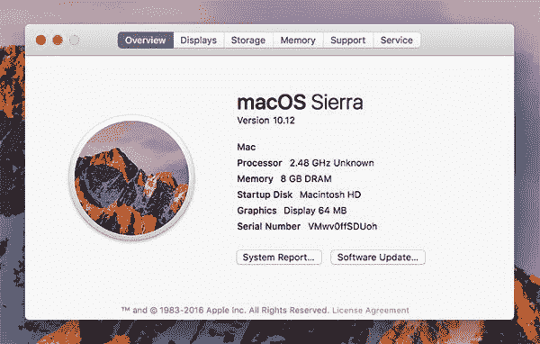
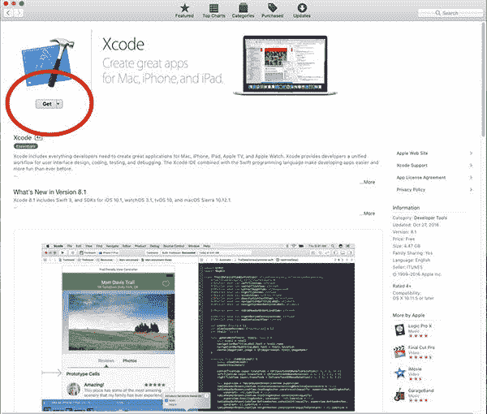
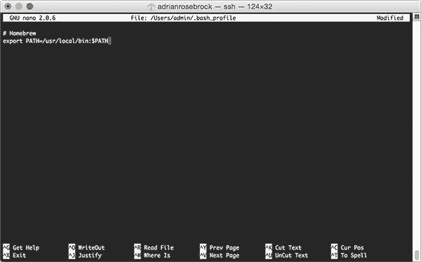
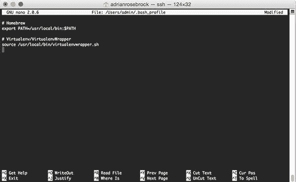
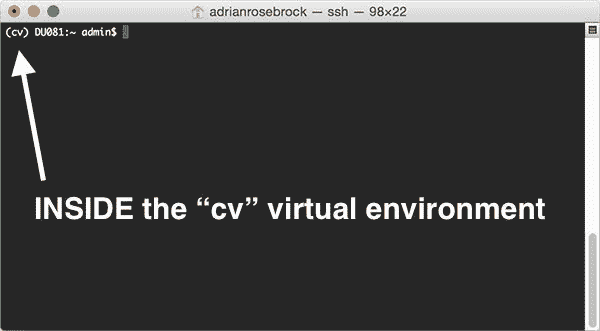
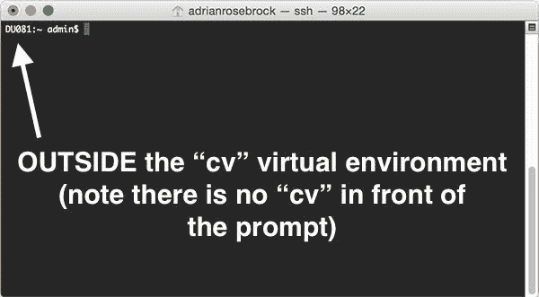
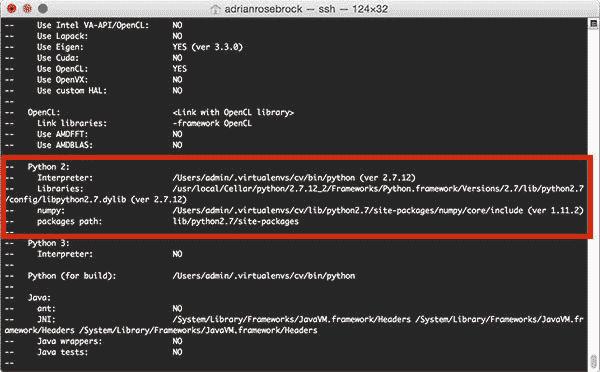
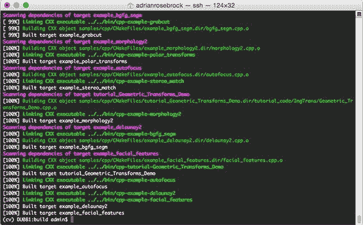
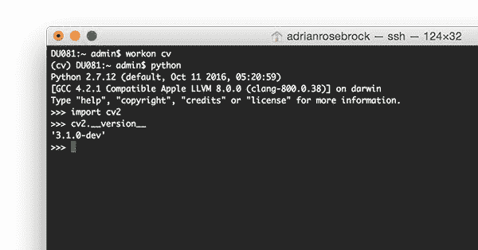

# macOS:安装 OpenCV 3 和 Python 2.7

> 原文：<https://pyimagesearch.com/2016/11/28/macos-install-opencv-3-and-python-2-7/>


我承认:在 macOS Sierra 上编译和安装 OpenCV 3 比我想象的要困难得多*，即使对于一生中在*数百台机器上编译过 OpenCV 的人来说也是如此。**

 *如果你试图使用我以前的教程中的一个在你新升级的 Mac (Sierra 或更高版本)上安装 OpenCV，你可能会遇到一些错误，特别是关于`QTKit.h`头文件。

甚至*如果*您能够解决 QTKit 问题，您可能会遇到*更多的*问题，试图让您的 CMake 命令配置正确。

为了帮助解决在 macOS Sierra(或更高版本)上安装带有 Python 绑定的 OpenCV 时的任何问题、难题或困惑，我决定创建两个*超详细教程:*

1.  第一篇教程讲述了如何在 macOS 上安装带有 Python 2.7 绑定的 OpenCV 3。
2.  我的第二篇教程将在下周发布，届时我将演示如何在 macOS 上安装带有 Python 3.5 绑定的 OpenCV 3。

我决定将这些教程分成两篇独立的博文，因为它们相当冗长。

此外，调整您的 CMake 命令以使其*完全正确*可能有点困难，特别是如果您是从源代码编译 OpenCV 的新手，所以我想花时间设计一个简单的方法来帮助读者将 OpenCV 安装在 macOS 上。

**要了解如何在 macOS 系统上安装 OpenCV 和 Python 2.7 绑定，*继续阅读。***

## macOS:安装 OpenCV 3 和 Python 2.7

这篇博文的第一部分详细介绍了为什么我要创建一个新的教程，在 Mac 操作系统上安装 OpenCV 3 和 Python 绑定。特别是，我解释了您可能遇到的一个常见错误——来自现在已被否决的 QTKit 库的`QTKit.h`头问题。

从那里，我提供了如何在 macOS Sierra 系统或更高版本上安装 OpenCV 3 + Python 2.7 的详细说明。

### 避免 QTKit/QTKit.h 文件未找到错误

在 Mac OSX 环境中，QTKit (QuickTime Kit) Objective-C 框架用于操作、读取和写入媒体。在 OSX 版本 10.9 (Mavericks)中，QTKit 被弃用( [source](https://developer.apple.com/reference/qtkit) )。

然而，直到发布了 [macOS Sierra，QTKit 的大部分内容才被移除](https://github.com/opencv/opencv/pull/7266)，取而代之的是 QTKit 的继任者 [AVFoundation](https://developer.apple.com/av-foundation/) 。AVFoundation 是在 iOS 和 macOS 中处理视听媒体的新框架。

当在 Mac 系统上编译 OpenCV 时，这产生了一个*大问题*——Qt kit 头在系统上*找不到，并且应该存在。*

因此，如果你试图在你的 Mac 上使用[我以前的教程](https://pyimagesearch.com/opencv-tutorials-resources-guides/)编译 OpenCV，你的编译可能会失败，你最终会得到一个类似下面的错误信息:

```py
fatal error: 
      'QTKit/QTKit.h' file not found
#import <QTKit/QTKit.h>
        ^ 1 error generated. make[2]: *** [modules/videoio/CMakeFiles/opencv_videoio.dir/src/cap_qtkit.mm.o]
Error 1 make[1]: ***
[modules/videoio/CMakeFiles/opencv_videoio.dir/all] Error 2 make: ***
[all] Error 2

```

更有问题的是，OpenCV v3.0 和 3.1 的标记版本*都不包含对这个问题的修复。*

也就是说，*对 OpenCV GitHub repo *的最新提交*确实解决了这个问题*；然而，一个新的带标签的 3.2 版本还没有发布。

也就是说，我很高兴地报告，通过使用 OpenCV 的 GitHub 的最新提交，我们*可以*在 macOS Sierra 和更高版本上安装 OpenCV。

诀窍在于，我们需要使用回购的`HEAD`,而不是带标签的释放。

一旦 OpenCV 3.2 发布，我敢肯定 QKit 到 AVFoundation 的迁移将包括在内，但在此之前，如果你想在运行 Sierra 或更高版本的 macOS 系统上安装 OpenCV 3，你需要避免使用标记版本，而是编译并安装 OpenCV 3 的开发版本。

### 如何检查我的 Mac 操作系统版本？

要检查您的 Mac OS 版本，请在菜单中点击屏幕左上角的*苹果*图标，然后选择*“关于这台 Mac”*。

然后会弹出一个窗口，如下所示:



**Figure 1:** Checking your OS version on Mac. My machine is currently running macOS Sierra (10.12).

如果您运行的是 macOS Sierra 或更高版本，您可以使用本教程来帮助您安装 OpenCV 3 和 Python 2.7 绑定。

如果你用的是老版本的 Mac 操作系统(Mavericks，Yosemite 等。)，请参考我的[以前的教程](https://pyimagesearch.com/opencv-tutorials-resources-guides/)。

### 步骤 1:安装 Xcode

在我们考虑编译 OpenCV 之前，我们首先需要安装 Xcode，这是一套完整的 Mac 操作系统软件开发工具。

#### 注册一个苹果开发者账户

在下载 Xcode 之前，你需要注册[苹果开发者计划](https://developer.apple.com/programs/)(免费)。如果你有一个现有的 Apple ID(即你用来登录 iTunes 的 ID ),这就更容易了。简单提供一些基本信息如姓名、地址等。你就一切就绪了。

从那里，最简单的下载 Xcode 的方法是通过 App Store。在搜索栏中搜索*“Xcode”*，选中后点击*“Get”*按钮:



**Figure 2:** Selecting Xcode from the Apple App Store.

Xcode 将开始下载和安装。在我的机器上，下载和安装过程大约需要 30 分钟。

#### 接受苹果开发者许可

假设这是你第一次安装或使用 Xcode，你需要[接受开发者许可](http://apple.stackexchange.com/questions/175069/how-to-accept-xcode-license)(否则，你可以跳过这一步)。我更喜欢尽可能使用终端。您可以使用以下命令来接受 Apple Developer 许可证:

```py
$ sudo xcodebuild -license

```

滚动到许可证的底部并接受它。

#### 安装 Apple 命令行工具

最后，我们需要安装命令行工具。这些工具包括 make、GCC、clang 等包。**这是*绝对*必需的一步**，所以确保你安装了命令行工具:

```py
$ sudo xcode-select --install

```

输入上面的命令后，会弹出一个窗口，确认您要安装命令行工具:


**Figure 3:** Installing the Apple Command Line Tools on macOS.

点击*“安装”*，苹果命令行工具将被下载并安装到您的系统上。这应该不到 5 分钟。

### 第二步:安装自制软件

我们现在准备安装[家酿](http://brew.sh/)，一个 macOS 的包管理器。对于基于 Ubuntu 和 Debian 的系统，可以把 Homebrew 想象成类似于*的 apt-get* 。

安装家酿很简单。只需将家酿网站*“安装家酿”*部分下的命令复制并粘贴到您的终端中(确保您复制并粘贴了*整个*命令):

```py
$ /usr/bin/ruby -e "$(curl -fsSL https://raw.githubusercontent.com/Homebrew/install/master/install)"

```

一旦安装了 Homebrew，您应该更新它以确保下载了最新的软件包定义:

```py
$ brew update

```

最后一步是更新我们的`~/.bash_profile`文件。该文件可能已经存在于您的系统中，也可能不存在。无论哪种情况，用您最喜欢的文本编辑器打开它(在这种情况下，我将使用`nano`):

```py
$ nano ~/.bash_profile

```

并在文件底部插入以下几行(如果`~/.bash_profile`不存在，文件将是空的，因此只需插入以下几行):

```py
# Homebrew
export PATH=/usr/local/bin:$PATH

```

上面的代码片段更新了您的`PATH`变量，以便在搜索您的系统路径之前沿着 Homebrew 路径查找二进制文件/库。

更新文件后，保存并退出编辑器。我在下面附上了我的`~/.bash_profile`截图:



**Figure 4:** Updating my *.bash_profile* file to include Homebrew.

然后，您应该使用`source`命令来确保对您的`~/.bash_profile`文件的更改被手动重新加载:

```py
$ source ~/.bash_profile

```

该命令只需执行*一次*。每当你登录，打开一个新的终端，等等。，你的`.bash_profile`将会*自动*为你加载和获取。

### 步骤 3:为 Python 2.7 和 macOS 设置自制程序

一般来说，你*不会*想把 Python 系统作为你的主要解释器来开发。这被认为是不好的形式。Python 的系统版本应该(在理想世界中)只服务于一个目的——*支持系统操作*。

相反，你会希望安装你自己的 Python 版本，该版本独立于系统版本。通过自制软件安装 Python 非常简单:

```py
$ brew install python

```

***注:**本教程讲述了如何在 macOS 上用 **Python 2.7** 绑定安装 OpenCV 3。下周我将讨论 OpenCV 3 与 Python 3 的绑定——如果你想在 macOS 上使用 OpenCV 的 **Python 3** ,请参考下周的博客文章。*

安装命令完成后，我们只需运行以下命令来完成 Python 安装:

```py
$ brew linkapps python

```

为了确认我们使用的是 Python 的*自制版本，而不是 Python* 的*系统版本，您应该使用`which`命令:*

```py
$ which python
/usr/local/bin/python

```

**重要:**一定要检查`which`命令的输出！如果你看到了`/usr/local/bin/python`，那么你正在正确地使用 Python 的 *Hombrew 版本。*

然而，如果输出是`/usr/bin/python`，那么你就没有正确地使用 Python 的*系统版本。如果是这种情况，您应该确保:*

1.  自制软件安装无误。
2.  `brew install python`命令成功完成。
3.  您已经正确更新了您的`~/.bash_profile`文件，并使用`source`重新加载了更改。这基本上可以归结为确保你的`~/.bash_profile`看起来像我上面图 4 中的**。**

### 步骤 4:安装 virtualenv、virtualenvwrapper 和 NumPy

我们现在准备安装三个 Python 包: [virtualenv](https://virtualenv.pypa.io/en/latest/) 和 [virtualenvwrapper](https://virtualenvwrapper.readthedocs.org/en/latest/) ，以及 NumPy，用于数值处理。

#### 安装 virtualenv 和 virtualenvwrapper

`virtualenv`和`virtualenvwrapper`包允许我们为我们正在进行的每个项目创建单独的、独立的 Python 环境。我之前已经多次提到 Python 虚拟环境，所以我不会重复已经说过的内容。相反，如果你不熟悉 Python 虚拟环境，它们是如何工作的，以及我们为什么使用它们，请参考这篇博文的[前半部分。在 RealPython.com 博客](https://pyimagesearch.com/2016/05/02/accessing-rpi-gpio-and-gpio-zero-with-opencv-python/)的[上也有一个很好的教程，深入探究 Python 虚拟环境。](https://realpython.com/blog/python/python-virtual-environments-a-primer/)

要安装`virtualenv`和`virtualenvwrapper`，只需使用`pip`:

```py
$ pip install virtualenv virtualenvwrapper

```

安装完这些包后，我们需要再次更新我们的`~/.bash_profile`文件:

```py
# Virtualenv/VirtualenvWrapper
source /usr/local/bin/virtualenvwrapper.sh

```

更新后，您的`~/.bash_profile`应该与我的类似:



**Figure 5:** Update your *.bash_profile* file to include virtualenv/virtualenvwrapper.

保存并退出您的文本编辑器，然后使用`source`命令刷新您的环境:

```py
$ source ~/.bash_profile

```

同样，该命令只需执行*一次*。每当你打开一个新的终端，你的`.bash_profile`文件的内容将会自动加载。

#### 创建您的 Python 虚拟环境

假设以上命令没有错误地完成，我们现在可以使用`mkvirtualenv`命令来创建我们的 Python 虚拟环境。我们将这个 Python 虚拟环境命名为`cv`:

```py
$ mkvirtualenv cv

```

该命令将创建一个 Python 环境，该环境独立于系统上所有其他 Python 环境的*(意味着该环境有自己单独的`site-packages`目录，等等)。).这是我们在编译和安装 OpenCV 时将使用的虚拟环境。*

 *`mkvirtualenv`命令只需要执行一次。如果您需要再次访问这个虚拟环境，只需使用`workon`命令:

```py
$ workon cv

```

要验证您是否在`cv`虚拟环境中，只需检查您的命令行——如果您在提示符前看到文本`(cv)`,那么您 ***在`cv`虚拟环境中就是*** :



**Figure 6:** Make sure you see the *“(cv)”* text on your prompt, indicating that you ***are*** in the *cv* virtual environment.

否则，如果你 ***没有*** 看到`cv`文本，那么你 ***在`cv`虚拟环境中就不是*** :



**Figure 7:** If you do not see the *“(cv)”* text on your prompt, then you ***are not*** in the *cv* virtual environment and you need to run the *“workon”* command to resolve this issue before continuing.

要访问`cv`虚拟环境，只需使用上面提到的`workon`命令。

#### 安装 NumPy

最后一步是安装 Python 的科学计算包 [NumPy](http://www.numpy.org/) 。

确保您处于`cv`虚拟环境中(否则 NumPy 将被安装到*系统*版本的 Python 中，而不是`cv`环境中)，然后使用`pip`安装 NumPy:

```py
$ pip install numpy

```

### 步骤 5:使用自制软件安装 OpenCV 先决条件

OpenCV 需要一些先决条件，所有这些都可以使用自制软件轻松安装。

其中一些包与用于实际*构建和编译* OpenCV 的工具相关，而其他包用于图像 I/O 操作(即，加载各种图像文件格式，如 JPEG、PNG、TIFF 等)。)

要在 macOS 上安装 OpenCV 所需的先决条件，只需执行以下命令:

```py
$ brew install cmake pkg-config
$ brew install jpeg libpng libtiff openexr
$ brew install eigen tbb

```

### 步骤 6:从 GitHub 下载 OpenCV 3 源代码

正如我在本教程开头提到的，我们需要从最近的提交中编译 OpenCV，*而不是*一个带标签的发布。这就需要我们下载 [OpenCV GitHub repo](https://github.com/opencv/opencv) :

```py
$ cd ~
$ git clone https://github.com/opencv/opencv

```

连同 [opencv_contrib repo](https://github.com/opencv/opencv_contrib) :

```py
$ git clone https://github.com/opencv/opencv_contrib

```

### 步骤 7:在 macOS 上通过 CMake 配置 OpenCV 3 和 Python 2.7

在这一节中，我将详细介绍如何使用 CMake 在 macOS Sierra build 上配置 OpenCV 3 + Python 2.7。

首先，我演示如何通过创建`build`目录来设置您的构建。

然后，我提供了一个您可以使用的 CMake 构建模板。该模板要求您填写两个值——到您的`libpython2.7.dylib`文件的路径和到您的`Python.h`头的路径。

***我会帮你找到并确定这两条路径的正确值。***

最后，我提供了一个完整的 CMake 命令的*示例*。但是，请注意，该命令是专门针对*我的*机器的。由于指定的路径不同，您的 CMake 命令可能略有不同。请阅读本节的其余部分以了解更多详细信息。

#### 设置构件

为了用 Python 2.7 支持 macOS 编译 OpenCV 3，我们需要首先设置构建。这相当于将目录更改为`opencv`并创建一个`build`目录:

```py
$ cd ~/opencv
$ mkdir build
$ cd build

```

#### 适用于 macOS 的 OpenCV 3 + Python 2.7 CMake 模板

为了让编译安装过程更简单，我构造了以下模板 ***OpenCV 3 + Python 2.7 CMake 模板:***

```py
$ cmake -D CMAKE_BUILD_TYPE=RELEASE \
    -D CMAKE_INSTALL_PREFIX=/usr/local \
    -D OPENCV_EXTRA_MODULES_PATH=~/opencv_contrib/modules \
    -D PYTHON2_LIBRARY=YYY \
    -D PYTHON2_INCLUDE_DIR=ZZZ \
    -D PYTHON2_EXECUTABLE=$VIRTUAL_ENV/bin/python \
    -D BUILD_opencv_python2=ON \
    -D BUILD_opencv_python3=OFF \
    -D INSTALL_PYTHON_EXAMPLES=ON \
    -D INSTALL_C_EXAMPLES=OFF \
    -D BUILD_EXAMPLES=ON ..

```

看着这个模板，我想向你指出几件事:

1.  这表明我们想要为 OpenCV 3 安装构建 Python 2.7 绑定。
2.  `BUILD_opencv_python3=OFF`:由于我们正在编译 Python 2.7 绑定，我们需要*明确声明*我们不需要 Python 3 绑定。不包括这两个开关会导致 CMake 配置过程中出现问题。
3.  `PYTHON2_LIBRARY=YYY`:这是 ***第一个*** 值，需要你自己填写。您需要用您的`libpython2.7.dylib`文件的路径替换`YYY`(我将在下一节中帮助您找到它)。
4.  `PYTHON2_INCLUDE_DIR`:这是 ***第二个*** 值，您需要填写。您需要用到您的`Python.h`头的路径替换`ZZZ`(同样，我将帮助您确定这个路径)。

#### 确定您的 Python 2.7 库和包含目录

让我们从配置您的`PYTHON2_LIBRARY`值开始。这个开关应该指向我们的`libpython2.7.dylib`文件。你可以在`/usr/local/Cellar/python/`的*多个*嵌套子目录中找到这个文件。要找到`libpython2.7.dylib`文件的准确的*路径，只需使用`ls`命令和通配符星号:*

```py
$ ls /usr/local/Cellar/python/2.7.*/Frameworks/Python.framework/Versions/2.7/lib/python2.7/config/libpython2.7.dylib
/usr/local/Cellar/python/2.7.12_2/Frameworks/Python.framework/Versions/2.7/lib/python2.7/config/libpython2.7.dylib

```

请注意这个命令的输出— ***这是您的`libpython2.7.dylib`文件的完整路径，将替换上面 CMake 模板中的`YYY`。***

接下来，我们来确定`PYTHON2_INCLUDE_DIR`。该路径应该指向用于生成实际 OpenCV + Python 2.7 绑定的`Python.h`头。

同样，我们将使用相同的`ls`和通配符技巧来确定正确的路径:

```py
$ ls -d /usr/local/Cellar/python/2.7.*/Frameworks/Python.framework/Versions/2.7/include/python2.7/
/usr/local/Cellar/python/2.7.12_2/Frameworks/Python.framework/Versions/2.7/include/python2.7/

```

`ls -d`命令的输出是我们到`Python.h`头的完整路径。 ***该值将替换 CMake 模板中的`ZZZ`。***

#### 填写 CMake 模板

现在您已经确定了`PYTHON2_LIBRARY`和`PYTHON2_INCLUDE_DIR`的值，您需要用这些值更新 CMake 命令。

在我的特定机器上， *full* CMake 命令如下所示:

```py
$ cmake -D CMAKE_BUILD_TYPE=RELEASE \
    -D CMAKE_INSTALL_PREFIX=/usr/local \
    -D OPENCV_EXTRA_MODULES_PATH=~/opencv_contrib/modules \
    -D PYTHON2_LIBRARY=/usr/local/Cellar/python/2.7.12_2/Frameworks/Python.framework/Versions/2.7/lib/python2.7/config/libpython2.7.dylib \
    -D PYTHON2_INCLUDE_DIR=/usr/local/Cellar/python/2.7.12_2/Frameworks/Python.framework/Versions/2.7/include/python2.7/ \
    -D PYTHON2_EXECUTABLE=$VIRTUAL_ENV/bin/python \
    -D BUILD_opencv_python2=ON \
    -D BUILD_opencv_python3=OFF \
    -D INSTALL_PYTHON_EXAMPLES=ON \
    -D INSTALL_C_EXAMPLES=OFF \
    -D BUILD_EXAMPLES=ON ..

```

*但是，请不要复制和粘贴我的 CMake 命令*——确保您已经使用了上面的说明来正确地确定您的`PYTHON2_LIBRARY`和`PYTHON2_INCLUDE_DIR`值。

一旦你填写了这些值，执行你的`cmake`命令，你的 OpenCV 3 + Python 2.7 构建将被配置。

例如，看看我的配置输出的`Python 2`部分:



**Figure 8:** Ensuring that Python 2.7 will be used when compiling OpenCV 3 for macOS.

您需要确保:

1.  `Interpreter`指向您的`cv`虚拟环境中的 Python 二进制文件。
2.  `Libraries`指向你的`libpython2.7.dylib`文件。
3.  正在使用的`numpy`版本是您在`cv`虚拟环境中安装的版本。

### 步骤 8:在 macOS 上编译并安装 OpenCV

假设您的`cmake`命令正确退出*并且*您的`Python 2`部分正确配置，您现在可以编译 OpenCV:

```py
$ make -j4

```

`-j`开关控制编译 OpenCV 的并行进程数量。我们通常将它设置为机器上可用的内核/处理器数量。由于我在四核系统上，所以我使用`-j4`。

OpenCV 可能需要一段时间来编译(30-90 分钟),这取决于机器的速度。成功的编译将以 100%的完成结束:



**Figure 9:** Successfully compiling OpenCV 3 from source with Python 2.7 bindings on macOS.

假设 OpenCV 编译无误，您现在可以在 macOS 系统上安装它了:

```py
$ sudo make install

```

### 步骤 9: Sym-link 你的 OpenCV 3 + Python 2.7 绑定

运行完`make install`之后，您应该会在`/usr/local/lib/python2.7/site-packages`中看到一个名为`cv2.so`的文件:

```py
$ cd /usr/local/lib/python2.7/site-packages/
$ ls -l cv2.so 
-rwxr-xr-x  1 root  admin  3694564 Nov 15 09:20 cv2.so

```

`cv2.so`文件是 OpenCV 3 + Python 2.7 绑定的实际集合。

然而，我们需要将这些绑定符号链接到我们的`cv`虚拟环境中。这可以使用以下命令来完成:

```py
$ cd ~/.virtualenvs/cv/lib/python2.7/site-packages/
$ ln -s /usr/local/lib/python2.7/site-packages/cv2.so cv2.so
$ cd ~

```

### 步骤 10:在 macOS 上测试 OpenCV 安装

要验证您在 macOS 上安装的 OpenCV 3 + Python 2.7 是否正常工作:

1.  打开一个新的终端。
2.  执行`workon`命令来访问`cv` Python 虚拟环境。
3.  尝试导入 Python + OpenCV 绑定。

以下是测试安装过程的具体步骤:

```py
$ workon cv
$ python
Python 2.7.12 (default, Oct 11 2016, 05:20:59) 
[GCC 4.2.1 Compatible Apple LLVM 8.0.0 (clang-800.0.38)] on darwin
Type "help", "copyright", "credits" or "license" for more information.
>>> import cv2
>>> cv2.__version__
'3.1.0-dev'
>>>

```

***注:**记下`cv2.__version__`中的`-dev`。这表明我们使用的是 OpenCV 的开发版本，而不是带标签的版本。一旦 OpenCV 3.2 发布，这些指令可以被更新，只需下载一个带标签版本的. zip 文件，而不必克隆整个存储库。*

我还在下面附上了一个利用这些相同步骤的截图。如您所见，我可以在 macOS Sierra 上从 Python 2.7 shell 访问我的 OpenCV 3 绑定:



**Figure 10:** Ensuring that I can successfully import my OpenCV 3 + Python 2.7 bindings on macOS.

***恭喜你，你已经在 macOS 系统上安装了带 Python 2.7 绑定的 OpenCV 3！***

## 那么，下一步是什么？

恭喜你。你现在在 macOS 系统上有了一个全新的 OpenCV 安装——我敢肯定你只是渴望利用你的安装来构建一些很棒的计算机视觉应用程序…

…但我也愿意打赌*你刚刚开始学习计算机视觉和 OpenCV* ，可能会对到底从哪里开始感到有点困惑和不知所措。

就我个人而言，我是**以身作则**的忠实粉丝，所以好的第一步是找点乐子，[读读这篇关于在图像/视频中发现猫的博文](https://pyimagesearch.com/2016/06/20/detecting-cats-in-images-with-opencv/)。本教程旨在*非常实用*，演示如何(快速)构建一个 Python + OpenCV 应用程序来检测图像中猫的存在。

如果你真的对提升你的计算机视觉技能感兴趣，你绝对应该看看我的书《实用 Python 和 OpenCV +案例研究》*。我的书不仅*涵盖了计算机视觉和图像处理的基础知识*，还教你如何解决现实世界的计算机视觉问题包括 ***图像和视频流中的人脸检测******视频中的物体跟踪******手写识别*** 。*

[](https://pyimagesearch.com/practical-python-opencv/)

因此，让我们在 macOS 系统上充分利用 OpenCV 3 新安装程序。

## 摘要

在这篇博文中，我演示了如何在 macOS Sierra 和更高版本上安装 OpenCV 3 和 Python 2.7 绑定。

下周我将有第二个教程，这一个涵盖了在 macOS 上 OpenCV 3 与 Python 3.5 的绑定。

更多其他操作系统上的 OpenCV 安装教程(如 Ubuntu、Raspbian 等。)，请参考[本页](https://pyimagesearch.com/opencv-tutorials-resources-guides/)，我在这里提供了额外的链接和资源。

## *但是在你走之前*

如果您有兴趣了解更多关于 OpenCV、计算机视觉和图像处理的知识，请务必在下面的表格中输入您的电子邮件地址，以便在新的博客帖子和教程发布时收到通知！**