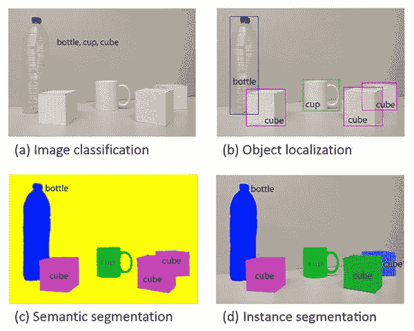
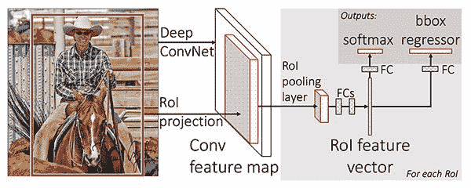
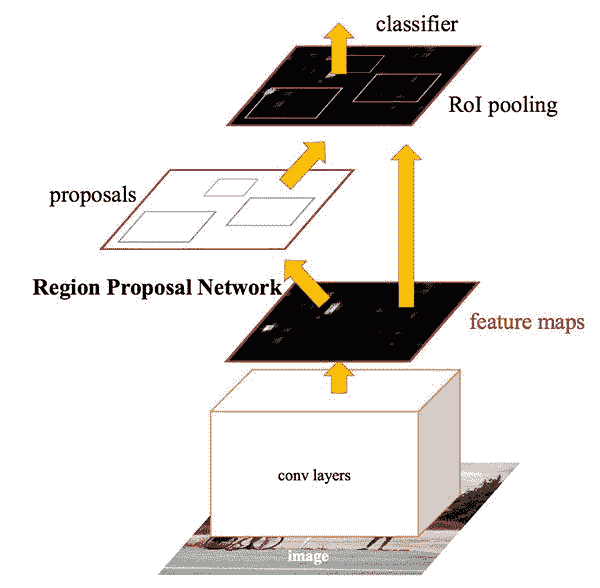
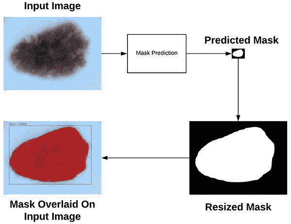
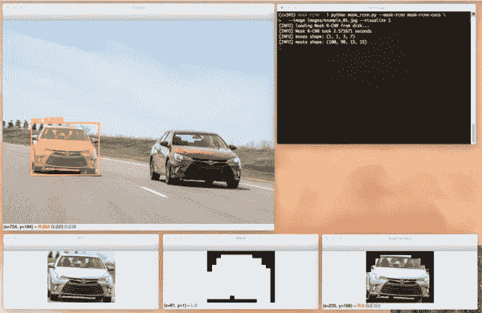

# 用 OpenCV 屏蔽 R-CNN

> 原文：<https://pyimagesearch.com/2018/11/19/mask-r-cnn-with-opencv/>


在本教程中，您将学习如何在 OpenCV 中使用 Mask R-CNN。

使用 Mask R-CNN，您可以为图像中的每个对象自动分割和构建像素级遮罩。我们将对图像和视频流应用 Mask R-CNN。

在上周的博客文章中，你学习了如何使用 [YOLO 物体探测器](https://pyimagesearch.com/2018/11/12/yolo-object-detection-with-opencv/)来探测图像中物体的存在。物体检测器，如 YOLO、快速 R-CNN 和单次检测器(SSD)，产生四组 *(x，y)*-坐标，代表图像中物体的*边界框*。

获得对象的边界框是一个好的开始，但是边界框本身并没有告诉我们任何关于(1)哪些像素属于前景对象和(2)哪些像素属于背景的信息。

这就引出了一个问题:

> 有没有可能为我们图像中的每个物体生成一个*遮罩*，从而让我们能够*从背景中分割出*前景物体？
> 
> 这样的方法可能吗？

**答案是肯定的** —我们只需要使用 Mask R-CNN 架构执行*实例分割*。

**要了解如何通过 OpenCV 将 Mask R-CNN 应用于图像和视频流，*请继续阅读！***

## 用 OpenCV 屏蔽 R-CNN

在本教程的第一部分，我们将讨论*图像分类*、*、*、*实例分割、*和*语义分割*的区别。

从这里，我们将简要回顾一下 Mask R-CNN 架构及其与更快的 R-CNN 的连接。

然后，我将向您展示如何使用 OpenCV 将 Mask R-CNN 应用于图像和视频流。

我们开始吧！

### 实例分割与语义分割

[](https://pyimagesearch.com/wp-content/uploads/2018/11/mask_rcnn_segmentation_types.jpg)

**Figure 1:** Image classification (*top-left*), object detection (*top-right*), semantic segmentation (*bottom-left*), and instance segmentation (*bottom-right*). We’ll be performing instance segmentation with Mask R-CNN in this tutorial. ([source](https://arxiv.org/abs/1704.06857))

解释传统的图像分类、对象检测、语义分割和实例分割之间的差异最好通过视觉来完成。

当执行传统的**图像分类时，我们的目标是预测一组标签来表征输入图像的内容(*左上*)。**

 *****物体检测*** 建立在图像分类的基础上，但这一次允许我们定位图像中的每个物体。该图像现在的特征是:

1.  边界框 *(x，y)*-每个对象的坐标
2.  每个边界框的相关联的*类标签*

***语义切分*** 的例子见*左下*。语义分割算法要求我们将输入图像中的每个像素与类别标签(包括背景的类别标签)相关联。

密切关注我们的语义分割可视化——注意每个对象实际上是如何分割的，但每个“立方体”对象都有相同的颜色。

虽然语义分割算法能够标记图像中的每个对象，但是它们*不能*区分同一类别的两个对象。

如果同一类的两个对象彼此部分遮挡，这种行为尤其成问题——我们不知道一个对象的边界在哪里结束，下一个对象的边界在哪里开始，如两个紫色立方体所示，我们无法分辨一个立方体在哪里开始，另一个在哪里结束。

另一方面， ***实例分割*** 算法为图像中的每个对象计算逐像素掩码，即使对象具有相同的类别标签(*右下角*)。在这里，你可以看到每个立方体都有自己独特的颜色，这意味着我们的实例分割算法不仅定位了每个单独的立方体，还预测了它们的边界。

我们将在本教程中讨论的 Mask R-CNN 架构是一个 ***实例分割*** 算法的例子。

### 什么是 Mask R-CNN？

Mask R-CNN 算法是何等人在他们 2017 年的论文 [*中介绍的 Mask R-CNN*](https://arxiv.org/abs/1703.06870) 。

Mask R-CNN 建立在之前的[*R-CNN*](https://arxiv.org/abs/1311.2524)(2013)[*Fast R-CNN*](https://arxiv.org/abs/1504.08083)(2015)[*Fast R-CNN*](https://arxiv.org/abs/1506.01497)(2015)的物体检测工作之上，全部由 Girshick 等人完成。

为了理解 Mask R-CNN，让我们简单回顾一下 R-CNN 的变体，从最初的 R-CNN 开始:

[](https://pyimagesearch.com/wp-content/uploads/2018/11/mask_rcnn_rcn_orig.jpg)

**Figure 2:** The original R-CNN architecture (source: [Girshick et al,. 2013](https://arxiv.org/abs/1311.2524))

最初的 R-CNN 算法有四个步骤:

*   **步骤#1:** 向网络输入图像。
*   **步骤#2:** 使用诸如[选择性搜索](http://www.huppelen.nl/publications/selectiveSearchDraft.pdf)的算法提取区域提议(即，图像中可能包含对象的区域)。
*   **步骤#3:** 使用迁移学习，特别是特征提取，使用预训练的 CNN 计算每个提议(实际上是 ROI)的特征。
*   **步骤#4:** 利用支持向量机(SVM)使用提取的特征对每个提议进行分类。

这种方法有效的原因是由于 CNN 学习到的健壮的、有区别的特征。

然而，R-CNN 方法的问题是它非常慢。此外，我们实际上并没有通过深度神经网络来学习定位，我们只是有效地构建了一个更先进的 [HOG +线性 SVM 检测器](https://pyimagesearch.com/2014/11/10/histogram-oriented-gradients-object-detection/)。

为了改进最初的 R-CNN，Girshick 等人发表了*快速 R-CNN* 算法:

[](https://pyimagesearch.com/wp-content/uploads/2018/11/mask_rcnn_fast_rcnn.jpg)

**Figure 3:** The Fast R-CNN architecture (source: [Girshick et al., 2015](https://arxiv.org/abs/1504.08083)).

类似于原始的 R-CNN，Fast R-CNN 仍然利用选择性搜索来获得区域提议；然而，论文的新颖贡献在于**感兴趣区域(ROI)汇集模块**。

ROI 池的工作原理是从特征图中提取一个固定大小的窗口，并使用这些特征来获得最终的类标签和边界框。**这里的主要好处是网络现在可以有效地进行端到端训练:**

1.  我们输入一幅图像和相关的地面实况包围盒
2.  提取特征图
3.  应用 ROI 合并并获得 ROI 特征向量
4.  最后，使用两组完全连接的层来获得(1)分类标签预测和(2)每个提议的边界框位置。

虽然网络现在是端到端可训练的，但是由于依赖于选择性搜索，在推断(即，预测)时性能显著受损。

为了让 R-CNN 架构更快*我们需要将地区提案*直接*整合到 R-CNN 中:*

*[](https://pyimagesearch.com/wp-content/uploads/2018/11/mask_rcnns_faster_rcnn.jpg)

**Figure 4:** The Faster R-CNN architecture (source: [Girshick et al., 2015](https://arxiv.org/abs/1506.01497))

Girshick 等人的*fast R-CNN*论文引入了**区域提议网络(RPN)** ，将区域提议*直接*烘焙到架构中，减轻了对选择性搜索算法的需求。

总的来说，更快的 R-CNN 架构能够以大约 7-10 FPS 的速度运行，这是向通过深度学习实现实时对象检测迈出的一大步。

**Mask R-CNN 算法建立在更快的 R-CNN 架构之上，有两个主要贡献:**

1.  用更精确的 ROI 对齐模块替换 ROI 汇集模块
2.  从 ROI 对齐模块中插入一个附加分支

这个额外的分支接受 ROI Align 的输出，然后将其馈入两个 CONV 层。

CONV 图层的输出是蒙版本身。

我们可以在下图中直观地看到 Mask R-CNN 架构:

[](https://pyimagesearch.com/wp-content/uploads/2018/11/mask_rcnn_arch.png)

**Figure 5:** The Mask R-CNN work by He et al. replaces the ROI Polling module with a more accurate ROI Align module. The output of the ROI module is then fed into two CONV layers. The output of the CONV layers is the mask itself.

注意从 ROI Align 模块出来的两个 CONV 层的分支——这是我们实际生成蒙版的地方。

正如我们所知，更快的 R-CNN/Mask R-CNN 架构利用区域提议网络(RPN)来生成图像的区域，这些区域可能包含对象。

这些区域中的每一个都基于它们的“客观性分数”(即，给定区域可能潜在地包含对象的可能性)来排名，然后保留前 *N* 个最有把握的客观性区域。

在最初的更快的 R-CNN 出版物中，Girshick 等人设置*N = 2000*，但是在实践中，我们可以使用小得多的 N，例如 *N={10，100，200，300}* ，并且仍然获得良好的结果。

何等人在[他们的出版物](https://arxiv.org/abs/1703.06870)中设置 *N=300* ，这也是我们在这里使用的值。

300 个选定 ROI 中的每一个都经过网络的三个平行分支:

1.  标签预测
2.  包围盒预测
3.  掩模预测

上面的图 5 显示了这些分支。

在预测期间，300 个感兴趣区域中的每一个都经过[非最大值抑制](https://pyimagesearch.com/2014/11/17/non-maximum-suppression-object-detection-python/)并保留前 100 个检测框，从而得到*100×L×15×15*的 4D 张量，其中 *L* 是数据集中的类标签的数量，*15×15*是每个 *L* 掩码的大小。

我们今天在这里使用的 Mask R-CNN 是在 [COCO 数据集](http://cocodataset.org/#home)上训练的，该数据集有 *L=90* 个类，因此从 Mask R CNN 的 Mask 模块得到的卷大小是 *100 x 90 x 15 x 15。*

为了直观显示屏蔽 R-CNN 过程，请看下图:

[](https://pyimagesearch.com/wp-content/uploads/2018/11/mask_rcnn_mask_resizing.jpg)

**Figure 6:** A visualization of Mask R-CNN producing a *15 x 15* mask, the mask resized to the original dimensions of the image, and then finally overlaying the mask on the original image. (source: [*Deep Learning for Computer Vision with Python*](https://pyimagesearch.com/deep-learning-computer-vision-python-book/), ImageNet Bundle)

在这里，您可以看到，我们从输入图像开始，并通过我们的 Mask R-CNN 网络进行馈送，以获得我们的 Mask 预测。

预测的遮罩只有 *15 x 15* 像素，因此我们将遮罩的尺寸调整回原始输入图像尺寸。

最后，调整大小后的遮罩可以覆盖在原始输入图像上。关于 Mask R-CNN 如何工作的更详细的讨论，请参考:

1.  原 [*面罩 R-CNN*](https://arxiv.org/abs/1703.06870) 由何等人出版。
2.  我的书， [*用 Python 进行计算机视觉的深度学习*](https://pyimagesearch.com/deep-learning-computer-vision-python-book/) ，其中我更详细地讨论了 Mask R-cns，**包括如何在自己的数据上从头开始训练自己的 Mask R-cns。**

### 项目结构

我们今天的项目由两个脚本组成，但是还有其他几个重要的文件。

我按照以下方式组织了项目(如直接在终端中输出的`tree`命令所示):

```py
$ tree
.
├── mask-rcnn-coco
│   ├── colors.txt
│   ├── frozen_inference_graph.pb
│   ├── mask_rcnn_inception_v2_coco_2018_01_28.pbtxt
│   └── object_detection_classes_coco.txt
├── images
│   ├── example_01.jpg
│   ├── example_02.jpg
│   └── example_03.jpg
├── videos
│   ├── 
├── output
│   ├──  
├── mask_rcnn.py
└── mask_rcnn_video.py

4 directories, 9 files

```

我们的项目包括四个目录:

*   `mask-rcnn-coco/`:屏蔽 R-CNN 模型文件。有四个文件:
    *   `frozen_inference_graph.pb`:屏蔽 R-CNN 模型权重。权重是在 COCO 数据集上预先训练的。
    *   `mask_rcnn_inception_v2_coco_2018_01_28.pbtxt`:面罩 R-CNN 型号配置。如果你想在你自己的标注数据上建立+训练你自己的模型，参考 *[用 Python 进行计算机视觉的深度学习](https://pyimagesearch.com/deep-learning-computer-vision-python-book/)。*
    *   这个文本文件中列出了所有 90 个类，每行一个。在文本编辑器中打开它，看看我们的模型可以识别哪些对象。
    *   这个文本文件包含六种颜色，随机分配给图像中的物体。
*   `images/`:我在 ***【下载】*** 中提供了三张测试图片。请随意添加您自己的图片进行测试。
*   这是一个空目录。我实际上用我从 YouTube 上搜集的大视频进行了测试(演职员表在下面，就在*“总结”*部分的上面)。与其提供一个很大的 zip 文件，我建议你在 YouTube 上找几个视频下载并测试。或者用手机拍些视频，然后回到电脑前使用！
*   `output/`:另一个空目录，将保存已处理的视频(假设您设置了命令行参数标志以输出到该目录)。

我们今天将复习两个剧本:

*   这个脚本将执行实例分割，并对图像应用一个遮罩，这样您就可以看到 R-CNN 认为一个对象所在的遮罩的像素位置。
*   `mask_rcnn_video.py`:这个视频处理脚本使用相同的遮罩 R-CNN，并将模型应用于视频文件的每一帧。然后，脚本将输出帧写回磁盘上的视频文件。

### OpenCV 和屏蔽图像中的 R-CNN

既然我们已经回顾了 Mask R-CNN 是如何工作的，那么让我们用一些 Python 代码来体验一下。

在我们开始之前，确保您的 Python 环境安装了 OpenCV 3.4.2/3.4.3 或更高版本。可以跟着我的一个 [OpenCV 安装教程](https://pyimagesearch.com/opencv-tutorials-resources-guides/)升级/安装 OpenCV。如果你想在 5 分钟或更短的时间内启动并运行，你可以考虑[用 pip](https://pyimagesearch.com/2018/09/19/pip-install-opencv/) 安装 OpenCV。如果您有一些其他需求，您可能希望从源代码编译 OpenCV。

确保你已经使用这篇博文的 ***【下载】*** 部分下载了源代码、训练好的 Mask R-CNN 和示例图片。

从那里，打开`mask_rcnn.py`文件并插入以下代码:

```py
# import the necessary packages
import numpy as np
import argparse
import random
import time
import cv2
import os

```

首先，我们将在第 2-7 行中导入我们需要的包。值得注意的是，我们正在导入 NumPy 和 OpenCV。大多数 Python 安装都附带了其他东西。

从那里，我们将解析我们的[命令行参数](https://pyimagesearch.com/2018/03/12/python-argparse-command-line-arguments/):

```py
# construct the argument parse and parse the arguments
ap = argparse.ArgumentParser()
ap.add_argument("-i", "--image", required=True,
	help="path to input image")
ap.add_argument("-m", "--mask-rcnn", required=True,
	help="base path to mask-rcnn directory")
ap.add_argument("-v", "--visualize", type=int, default=0,
	help="whether or not we are going to visualize each instance")
ap.add_argument("-c", "--confidence", type=float, default=0.5,
	help="minimum probability to filter weak detections")
ap.add_argument("-t", "--threshold", type=float, default=0.3,
	help="minimum threshold for pixel-wise mask segmentation")
args = vars(ap.parse_args())

```

我们的脚本要求命令行参数标志和参数在运行时在我们的终端中传递。我们的参数在第 10-21 行被解析，其中下面的前两个是必需的，其余的是可选的:

*   `--image`:我们输入图像的路径。
*   `--mask-rnn`:屏蔽 R-CNN 文件的基路径。
*   `--visualize`(可选):正值表示我们希望在屏幕上直观地看到我们是如何提取被屏蔽的区域的。无论哪种方式，我们都将在屏幕上显示最终输出。
*   `--confidence`(可选):您可以覆盖`0.5`的概率值，用于过滤弱检测。
*   (可选):我们将为图像中的每个物体创建一个二元遮罩，这个阈值将帮助我们过滤掉弱遮罩预测。我发现缺省值`0.3`工作得很好。

现在我们的命令行参数存储在`args`字典中，让我们加载标签和颜色:

```py
# load the COCO class labels our Mask R-CNN was trained on
labelsPath = os.path.sep.join([args["mask_rcnn"],
	"object_detection_classes_coco.txt"])
LABELS = open(labelsPath).read().strip().split("\n")

# load the set of colors that will be used when visualizing a given
# instance segmentation
colorsPath = os.path.sep.join([args["mask_rcnn"], "colors.txt"])
COLORS = open(colorsPath).read().strip().split("\n")
COLORS = [np.array(c.split(",")).astype("int") for c in COLORS]
COLORS = np.array(COLORS, dtype="uint8")

```

**第 24-26 行**加载 COCO 对象类`LABELS`。今天的面具 R-CNN 能够识别 90 类，包括人，车辆，标志，动物，日常用品，运动装备，厨房用品，食物，等等！我鼓励您查看`object_detection_classes_coco.txt`来了解可用的课程。

从那里，我们从 path 加载`COLORS`，执行几个数组转换操作(**第 30-33 行**)。

让我们加载我们的模型:

```py
# derive the paths to the Mask R-CNN weights and model configuration
weightsPath = os.path.sep.join([args["mask_rcnn"],
	"frozen_inference_graph.pb"])
configPath = os.path.sep.join([args["mask_rcnn"],
	"mask_rcnn_inception_v2_coco_2018_01_28.pbtxt"])

# load our Mask R-CNN trained on the COCO dataset (90 classes)
# from disk
print("[INFO] loading Mask R-CNN from disk...")
net = cv2.dnn.readNetFromTensorflow(weightsPath, configPath)

```

首先，我们构建我们的权重和配置路径(**第 36-39 行**)，然后通过这些路径加载模型(**第 44 行**)。

在下一个模块中，我们将通过 Mask R-CNN 神经网络加载并传递一幅图像:

```py
# load our input image and grab its spatial dimensions
image = cv2.imread(args["image"])
(H, W) = image.shape[:2]

# construct a blob from the input image and then perform a forward
# pass of the Mask R-CNN, giving us (1) the bounding box  coordinates
# of the objects in the image along with (2) the pixel-wise segmentation
# for each specific object
blob = cv2.dnn.blobFromImage(image, swapRB=True, crop=False)
net.setInput(blob)
start = time.time()
(boxes, masks) = net.forward(["detection_out_final", "detection_masks"])
end = time.time()

# show timing information and volume information on Mask R-CNN
print("[INFO] Mask R-CNN took {:.6f} seconds".format(end - start))
print("[INFO] boxes shape: {}".format(boxes.shape))
print("[INFO] masks shape: {}".format(masks.shape))

```

在这里我们:

*   加载输入`image`并提取尺寸用于稍后的缩放目的(**第 47 和 48 行**)。
*   通过`cv2.dnn.blobFromImage` ( **线 54** )构建一个`blob`。你可以在我的[之前的教程](https://pyimagesearch.com/2017/11/06/deep-learning-opencvs-blobfromimage-works/)中了解为什么以及如何使用这个功能。
*   在收集时间戳(**第 55-58 行**)的同时，执行`blob`到`net`的正向传递。结果包含在两个重要的变量中:`boxes`和`masks`。

既然我们已经在图像上执行了掩膜 R-CNN 的正向传递，我们将想要过滤+可视化我们的结果。这正是下一个 for 循环要完成的任务。它很长，所以我把它分成*五个代码块*，从这里开始:

```py
# loop over the number of detected objects
for i in range(0, boxes.shape[2]):
	# extract the class ID of the detection along with the confidence
	# (i.e., probability) associated with the prediction
	classID = int(boxes[0, 0, i, 1])
	confidence = boxes[0, 0, i, 2]

	# filter out weak predictions by ensuring the detected probability
	# is greater than the minimum probability
	if confidence > args["confidence"]:
		# clone our original image so we can draw on it
		clone = image.copy()

		# scale the bounding box coordinates back relative to the
		# size of the image and then compute the width and the height
		# of the bounding box
		box = boxes[0, 0, i, 3:7] * np.array([W, H, W, H])
		(startX, startY, endX, endY) = box.astype("int")
		boxW = endX - startX
		boxH = endY - startY

```

在这个模块中，我们开始我们的过滤/可视化循环(**行 66** )。

我们继续提取特定检测对象的`classID`和`confidence`(**行 69 和 70** )。

从那里，我们通过比较`confidence`和命令行参数`confidence`的值来过滤弱预测，确保我们超过它(**第 74 行**)。

假设是这样的话，我们将继续制作图像的`clone`(**第 76 行**)。我们以后会需要这张图片。

然后我们缩放我们对象的边界框并计算框的尺寸(**行 81-84** )。

图像分割要求我们找到物体所在的所有像素。因此，我们将在对象的顶部放置一个透明的覆盖层，以观察我们的算法执行得有多好。为了做到这一点，我们将计算一个掩码:

```py
		# extract the pixel-wise segmentation for the object, resize
		# the mask such that it's the same dimensions of the bounding
		# box, and then finally threshold to create a *binary* mask
		mask = masks[i, classID]
		mask = cv2.resize(mask, (boxW, boxH),
			interpolation=cv2.INTER_NEAREST)
		mask = (mask > args["threshold"])

		# extract the ROI of the image
		roi = clone[startY:endY, startX:endX]

```

在**第 89-91 行**，我们提取对象的像素分割，并将其调整到原始图像尺寸。最后，我们对`mask`进行阈值处理，使其成为二进制数组/图像(**第 92 行**)。

我们还提取目标所在的感兴趣区域(**行 95** )。

在帖子后面的**图 8** 中可以看到`mask`和`roi`。

为了方便起见，如果通过命令行参数设置了`--visualize`标志，则下一个块实现了对`mask`、`roi`和分段`instance`的可视化:

```py
		# check to see if are going to visualize how to extract the
		# masked region itself
		if args["visualize"] > 0:
			# convert the mask from a boolean to an integer mask with
			# to values: 0 or 255, then apply the mask
			visMask = (mask * 255).astype("uint8")
			instance = cv2.bitwise_and(roi, roi, mask=visMask)

			# show the extracted ROI, the mask, along with the
			# segmented instance
			cv2.imshow("ROI", roi)
			cv2.imshow("Mask", visMask)
			cv2.imshow("Segmented", instance)

```

在这一部分中，我们:

*   查看我们是否应该可视化 ROI、遮罩和分段实例(**第 99 行**)。
*   将我们的遮罩从布尔值转换为整数，其中值*“0”*表示背景，*“255”*表示前景(**第 102 行**)。
*   执行逐位屏蔽，仅可视化实例本身(**第 103 行**)。
*   显示所有三幅图像(**第 107-109 行**)。

同样，只有通过可选的[命令行参数](https://pyimagesearch.com/2018/03/12/python-argparse-command-line-arguments/)设置了`--visualize`标志，这些可视化图像才会显示(默认情况下，这些图像不会显示)。

现在让我们继续视觉化:

```py
		# now, extract *only* the masked region of the ROI by passing
		# in the boolean mask array as our slice condition
		roi = roi[mask]

		# randomly select a color that will be used to visualize this
		# particular instance segmentation then create a transparent
		# overlay by blending the randomly selected color with the ROI
		color = random.choice(COLORS)
		blended = ((0.4 * color) + (0.6 * roi)).astype("uint8")

		# store the blended ROI in the original image
		clone[startY:endY, startX:endX][mask] = blended

```

**第 113 行**通过传递布尔掩模阵列作为切片条件，仅提取*ROI 的掩模区域*。

然后我们将随机选择六个`COLORS`中的一个来应用我们的透明覆盖在物体上(**第 118 行**)。

随后，我们将我们的蒙版区域与`roi` ( **第 119 行**)混合，然后将这个`blended`区域放到`clone`图像中(**第 122 行**)。

最后，我们将在图像上绘制矩形和文本类标签+置信度值，并显示结果！

```py
		# draw the bounding box of the instance on the image
		color = [int(c) for c in color]
		cv2.rectangle(clone, (startX, startY), (endX, endY), color, 2)

		# draw the predicted label and associated probability of the
		# instance segmentation on the image
		text = "{}: {:.4f}".format(LABELS[classID], confidence)
		cv2.putText(clone, text, (startX, startY - 5),
			cv2.FONT_HERSHEY_SIMPLEX, 0.5, color, 2)

		# show the output image
		cv2.imshow("Output", clone)
		cv2.waitKey(0)

```

最后，我们:

*   在对象周围画一个彩色边框(**第 125 行和第 126 行**)。
*   构建我们的类标签+置信度`text`，并在边界框上方绘制`text`(**第 130-132 行**)。
*   显示图像，直到按下任意键(**行 135 和 136** )。

让我们试试我们的面具 R-CNN 代码吧！

确保您已经使用教程的 ***【下载】*** 部分下载了源代码、经过训练的掩码 R-CNN 和示例图像。从那里，打开您的终端并执行以下命令:

```py
$ python mask_rcnn.py --mask-rcnn mask-rcnn-coco --image images/example_01.jpg
[INFO] loading Mask R-CNN from disk...
[INFO] Mask R-CNN took 0.761193 seconds
[INFO] boxes shape: (1, 1, 3, 7)
[INFO] masks shape: (100, 90, 15, 15)

```


**Figure 7:** A Mask R-CNN applied to a scene of cars. Python and OpenCV were used to generate the masks.

在上面的图像中，你可以看到我们的掩模 R-CNN 不仅对图像中的每辆汽车进行了定位，而且,*还构建了一个像素掩模，允许我们从图像中分割出每辆汽车。*

如果我们运行相同的命令，这次提供`--visualize`标志，我们也可以可视化 ROI、遮罩和实例:

[](https://pyimagesearch.com/wp-content/uploads/2018/11/mask_rcnn_roi_mask_segmented.jpg)

**Figure 8:** Using the `--visualize` flag, we can view the ROI, mask, and segmentmentation intermediate steps for our Mask R-CNN pipeline built with Python and OpenCV.

让我们尝试另一个示例图像:

```py
$ python mask_rcnn.py --mask-rcnn mask-rcnn-coco --image images/example_02.jpg \
	--confidence 0.6
[INFO] loading Mask R-CNN from disk...
[INFO] Mask R-CNN took 0.676008 seconds
[INFO] boxes shape: (1, 1, 8, 7)
[INFO] masks shape: (100, 90, 15, 15)

```


**Figure 9:** Using Python and OpenCV, we can perform instance segmentation using a Mask R-CNN.

我们的掩模 R-CNN 已经从图像中正确地检测和分割了两个人，一只狗，一匹马和一辆卡车。

在我们继续在视频中使用屏蔽 R-CNN 之前，这里是最后一个例子:

```py
$ python mask_rcnn.py --mask-rcnn mask-rcnn-coco --image images/example_03.jpg 
[INFO] loading Mask R-CNN from disk...
[INFO] Mask R-CNN took 0.680739 seconds
[INFO] boxes shape: (1, 1, 3, 7)
[INFO] masks shape: (100, 90, 15, 15)

```


**Figure 10:** Here you can see me feeding a treat to the family beagle, Jemma. The pixel-wise map of each object identified is masked and transparently overlaid on the objects. This image was generated with OpenCV and Python using a pre-trained Mask R-CNN model.

在这张照片中，你可以看到一张我和 Jemma 的合照。

我们的面具 R-CNN 有能力检测和定位我，Jemma，和椅子。

### 视频流中的 OpenCV 和 Mask R-CNN

既然我们已经了解了如何将掩模 R-CNN 应用于图像，那么让我们来探索如何将它们应用于视频。

打开`mask_rcnn_video.py`文件并插入以下代码:

```py
# import the necessary packages
import numpy as np
import argparse
import imutils
import time
import cv2
import os

# construct the argument parse and parse the arguments
ap = argparse.ArgumentParser()
ap.add_argument("-i", "--input", required=True,
	help="path to input video file")
ap.add_argument("-o", "--output", required=True,
	help="path to output video file")
ap.add_argument("-m", "--mask-rcnn", required=True,
	help="base path to mask-rcnn directory")
ap.add_argument("-c", "--confidence", type=float, default=0.5,
	help="minimum probability to filter weak detections")
ap.add_argument("-t", "--threshold", type=float, default=0.3,
	help="minimum threshold for pixel-wise mask segmentation")
args = vars(ap.parse_args())

```

首先，我们导入必要的包并解析命令行参数。

有两个新的命令行参数(取代了前面脚本中的`--image`):

*   `--input`:我们输入视频的路径。
*   `--output`:我们输出视频的路径(因为我们将把结果以视频文件的形式写入磁盘)。

现在让我们加载我们的类`LABELS`、`COLORS`，并屏蔽 R-CNN 神经`net`:

```py
# load the COCO class labels our Mask R-CNN was trained on
labelsPath = os.path.sep.join([args["mask_rcnn"],
	"object_detection_classes_coco.txt"])
LABELS = open(labelsPath).read().strip().split("\n")

# initialize a list of colors to represent each possible class label
np.random.seed(42)
COLORS = np.random.randint(0, 255, size=(len(LABELS), 3),
	dtype="uint8")

# derive the paths to the Mask R-CNN weights and model configuration
weightsPath = os.path.sep.join([args["mask_rcnn"],
	"frozen_inference_graph.pb"])
configPath = os.path.sep.join([args["mask_rcnn"],
	"mask_rcnn_inception_v2_coco_2018_01_28.pbtxt"])

# load our Mask R-CNN trained on the COCO dataset (90 classes)
# from disk
print("[INFO] loading Mask R-CNN from disk...")
net = cv2.dnn.readNetFromTensorflow(weightsPath, configPath)

```

我们的`LABELS`和`COLORS`装在**24-31 线**上。

在加载我们的 R-CNN 神经`net` ( **第 34-42 行**)之前，我们从那里定义我们的`weightsPath`和`configPath`。

现在让我们初始化我们的视频流和视频编写器:

```py
# initialize the video stream and pointer to output video file
vs = cv2.VideoCapture(args["input"])
writer = None

# try to determine the total number of frames in the video file
try:
	prop = cv2.cv.CV_CAP_PROP_FRAME_COUNT if imutils.is_cv2() \
		else cv2.CAP_PROP_FRAME_COUNT
	total = int(vs.get(prop))
	print("[INFO] {} total frames in video".format(total))

# an error occurred while trying to determine the total
# number of frames in the video file
except:
	print("[INFO] could not determine # of frames in video")
	total = -1

```

我们的视频流(`vs`)和视频`writer`在**线 45 和 46** 上初始化。

我们试图确定视频文件中的帧数并显示`total` ( **第 49-53 行**)。如果我们不成功，我们将捕获异常并打印一条状态消息，同时将`total`设置为`-1` ( **第 57-59 行**)。我们将使用这个值来估计处理一个完整的视频文件需要多长时间。

让我们开始我们的帧处理循环:

```py
# loop over frames from the video file stream
while True:
	# read the next frame from the file
	(grabbed, frame) = vs.read()

	# if the frame was not grabbed, then we have reached the end
	# of the stream
	if not grabbed:
		break

	# construct a blob from the input frame and then perform a
	# forward pass of the Mask R-CNN, giving us (1) the bounding box
	# coordinates of the objects in the image along with (2) the
	# pixel-wise segmentation for each specific object
	blob = cv2.dnn.blobFromImage(frame, swapRB=True, crop=False)
	net.setInput(blob)
	start = time.time()
	(boxes, masks) = net.forward(["detection_out_final",
		"detection_masks"])
	end = time.time()

```

我们通过定义一个无限的`while`循环并捕获第一个`frame` ( **第 62-64 行**)来开始对帧进行循环。该循环将处理视频直到完成，这由第 68 和 69 行**上的退出条件处理。**

然后，我们从该帧构建一个`blob`，并通过神经`net`传递它，同时获取经过的时间，这样我们就可以计算完成的估计时间(**第 75-80 行**)。结果包含在`boxes`和`masks`中。

现在让我们开始循环检测到的对象:

```py
	# loop over the number of detected objects
	for i in range(0, boxes.shape[2]):
		# extract the class ID of the detection along with the
		# confidence (i.e., probability) associated with the
		# prediction
		classID = int(boxes[0, 0, i, 1])
		confidence = boxes[0, 0, i, 2]

		# filter out weak predictions by ensuring the detected
		# probability is greater than the minimum probability
		if confidence > args["confidence"]:
			# scale the bounding box coordinates back relative to the
			# size of the frame and then compute the width and the
			# height of the bounding box
			(H, W) = frame.shape[:2]
			box = boxes[0, 0, i, 3:7] * np.array([W, H, W, H])
			(startX, startY, endX, endY) = box.astype("int")
			boxW = endX - startX
			boxH = endY - startY

			# extract the pixel-wise segmentation for the object,
			# resize the mask such that it's the same dimensions of
			# the bounding box, and then finally threshold to create
			# a *binary* mask
			mask = masks[i, classID]
			mask = cv2.resize(mask, (boxW, boxH),
				interpolation=cv2.INTER_NEAREST)
			mask = (mask > args["threshold"])

			# extract the ROI of the image but *only* extracted the
			# masked region of the ROI
			roi = frame[startY:endY, startX:endX][mask]

```

首先，我们过滤掉具有低置信度值的弱检测。然后我们确定包围盒坐标并获得`mask`和`roi`。

现在让我们绘制对象的透明覆盖图、边框和标签+置信度:

```py
			# grab the color used to visualize this particular class,
			# then create a transparent overlay by blending the color
			# with the ROI
			color = COLORS[classID]
			blended = ((0.4 * color) + (0.6 * roi)).astype("uint8")

			# store the blended ROI in the original frame
			frame[startY:endY, startX:endX][mask] = blended

			# draw the bounding box of the instance on the frame
			color = [int(c) for c in color]
			cv2.rectangle(frame, (startX, startY), (endX, endY),
				color, 2)

			# draw the predicted label and associated probability of
			# the instance segmentation on the frame
			text = "{}: {:.4f}".format(LABELS[classID], confidence)
			cv2.putText(frame, text, (startX, startY - 5),
				cv2.FONT_HERSHEY_SIMPLEX, 0.5, color, 2)

```

在这里，我们用颜色`blended`了我们的`roi`并在原始`frame`中`store`了它，有效地创建了一个彩色透明叠加(**第 118-122 行**)。

然后我们在对象周围画一个`rectangle`，并在上面显示类标签+`confidence`(**第 125-133 行**)。

最后，让我们写入视频文件并清理:

```py
	# check if the video writer is None
	if writer is None:
		# initialize our video writer
		fourcc = cv2.VideoWriter_fourcc(*"MJPG")
		writer = cv2.VideoWriter(args["output"], fourcc, 30,
			(frame.shape[1], frame.shape[0]), True)

		# some information on processing single frame
		if total > 0:
			elap = (end - start)
			print("[INFO] single frame took {:.4f} seconds".format(elap))
			print("[INFO] estimated total time to finish: {:.4f}".format(
				elap * total))

	# write the output frame to disk
	writer.write(frame)

# release the file pointers
print("[INFO] cleaning up...")
writer.release()
vs.release()

```

在循环的第一次迭代中，我们的视频`writer`被初始化。

在终端的**行 143-147** 上打印出处理所需时间的估计值。

我们循环的最后一个操作是通过我们的`writer`对象( **Line 150** )将帧`write`到磁盘。

你会注意到我没有在屏幕上显示每一帧。显示操作是耗时的，当脚本完成处理时，你可以用任何媒体播放器来观看输出视频。

***注:**此外，OpenCV 的`dnn`模块不支持 NVIDIA GPUs。目前只支持有限数量的 GPU，主要是英特尔 GPU。NVIDIA GPU 支持即将推出，但目前我们无法轻松使用带有 OpenCV`dnn`模块的 GPU。*

最后，我们发布视频输入和输出文件指针(**行 154 和 155** )。

现在我们已经为视频流编写了 Mask R-CNN + OpenCV 脚本，让我们来试试吧！

确保使用本教程的 ***【下载】*** 部分下载源代码并屏蔽 R-CNN 模型。

然后你需要用你的智能手机或其他录制设备来收集你自己的视频。或者，你可以像我一样从 YouTube 上下载视频。

***注:**我是**故意不把今天下载的视频包括进来，因为它们相当大(400MB+)。如果你选择使用和我一样的视频，演职员表和链接在这一部分的底部。***

 **从那里，打开一个终端并执行以下命令:

```py
$ python mask_rcnn_video.py --input videos/cats_and_dogs.mp4 \
	--output output/cats_and_dogs_output.avi --mask-rcnn mask-rcnn-coco
[INFO] loading Mask R-CNN from disk...
[INFO] 19312 total frames in video
[INFO] single frame took 0.8585 seconds
[INFO] estimated total time to finish: 16579.2047

```


**Figure 11:** Mask R-CNN applied to video with Python and OpenCV.

<https://www.youtube.com/embed/T_GXkW0BUyA?feature=oembed>*****