# 使用 COCO 评估器的平均精度(mAP)

> 原文：<https://pyimagesearch.com/2022/05/02/mean-average-precision-map-using-the-coco-evaluator/>

* * *

* * *

## **[使用 COCO 评估器](#TOC)** 平均精度(mAP)

在本教程中，您将学习对象检测中的平均精度(mAP ),并使用 COCO 评估器评估 YOLO 对象检测模型。

这是我们关于 **YOLO 天体探测器**的 7 集系列的第 4 课:

1.  [*YOLO 家族简介*](https://pyimg.co/dgbvi)
2.  [*了解一个实时物体检测网络:你只看一次(YOLOv1)*](https://pyimg.co/3cpmz)
3.  [*更好、更快、更强的物体探测器(YOLOv2)*](https://pyimg.co/ehaox)
4.  [*平均精度(地图)使用 COCO 评估器*](https://pyimg.co/nwoka) **(今日教程)**
5.  [*用 Darknet-53 和多尺度预测的增量改进(YOLOv3)*](https://pyimg.co/8xfpg)
6.  [*【yolov 4】*](https://pyimg.co/c6kiu)
7.  [***在自定义数据集上训练 YOLOv5 物体检测器***](https://pyimg.co/fq0a3)

我们将在本帖中讨论这些关键话题:

*   什么是精度和召回率？
*   精确召回曲线
*   并集上的交集
*   平均精度
*   平均精度
*   浏览使用 COCO 评估器评估 YOLO 对象检测模型的代码实现

在我们开始之前，您是否熟悉物体探测器的工作原理，尤其是像 YOLO 这样的单级探测器？

如果没有，一定要看看我们以前的帖子，[YOLO 家族介绍](https://pyimg.co/dgbvi)和[了解实时物体检测网络:你只看一次(YOLOv1)](https://pyimg.co/3cpmz) ，对单级物体检测一般如何工作有一个高层次的直觉。单级目标检测器将目标检测视为简单的回归问题。例如，馈送到网络的输入图像直接输出类别概率和边界框坐标。

这些模型跳过区域提议阶段，也称为区域提议网络，它通常是两阶段对象检测器的一部分，是图像中可能包含对象的区域。

**要了解什么是对象检测中的 mAP 以及如何使用 COCO 评估器评估对象检测模型，** ***继续阅读。***

* * *

## **[使用 COCO 评估器](#TOC)** 平均精度(mAP)

在解决一个涉及机器学习和深度学习的问题时，我们通常会有各种模型可供选择；例如，在图像分类中，可以选择 VGG16 或 ResNet50。每一种都有其独特之处，并会根据数据集或目标平台等各种因素表现不同。为了通过客观地比较我们用例的模型来最终决定最佳模型，我们需要有一个合适的评估度量。

在训练集上对模型进行训练或微调之后，将根据它在验证和测试数据上的表现来判断它的好坏或准确性。各种评估度量或统计可以评估深度学习模型，但是使用哪个度量取决于特定的问题陈述和应用。

在图像分类问题中用于评估的最常见的度量是*精度*、*召回*、*混淆矩阵*、 *PR 曲线*等。而在图像分割中，使用的是联合平均交集，又名 *mIoU* 。

然而，如果我们解决房间里的大象，用于对象检测问题的最常见的度量选择是*平均精度*(又名*图)*。

因为在对象检测中，目标不仅是正确地分类图像中的对象，而且还要找到它在图像中的位置，所以我们不能简单地使用像精度和召回这样的图像分类度量。

因此，目标检测评估标准需要考虑目标的类别和位置，这就是 *mAP* 发挥作用的地方。而要理解*图*，就要理解 *IoU* 、*精度*、*召回*、*精度——召回*曲线。所以，让我们开始深入研究吧！

* * *

### **[配置您的开发环境](#TOC)**

要遵循本指南，您需要在系统上安装 Pycocotools 库。对于额外的图像处理目的，您将使用 OpenCV、Sklearn 来计算精度和召回、Matplotlib 来绘制图形，以及其他一些库。

幸运的是，下面所有的库都是 pip 安装的！

```py
$ pip install pycocotools==2.0.4
$ pip install matplotlib==3.2.2
$ pip install opencv==4.1.2
$ pip install progressbar==3.38.0
$ pip install sklearn==1.0.2
```

以上是本指南所需的环境配置！

但是，您还需要在您的系统上安装 Darknet 框架，以便使用 YOLOv4 运行推理。为此，我们强烈建议你去看看 AlexeyAB 的 Darknet 知识库。

* * *

### **[在配置开发环境时遇到了问题？](#TOC)**

说了这么多，你是:

*   时间紧迫？
*   了解你雇主的行政锁定系统？
*   想要跳过与命令行、包管理器和虚拟环境斗争的麻烦吗？
*   **准备好在您的 Windows、macOS 或 Linux 系统上运行代码*****？***

 *那今天就加入 [PyImageSearch 大学](https://www.pyimagesearch.com/pyimagesearch-university/)吧！

**获得本教程的 Jupyter 笔记本和其他 PyImageSearch 指南，这些指南是** ***预先配置的*** **，可以在您的网络浏览器中运行在 Google Colab 的生态系统上！**无需安装。

最棒的是，这些 Jupyter 笔记本可以在 Windows、macOS 和 Linux 上运行！

* * *

### **[项目结构](#TOC)**

在我们进入各种关键主题的理论和实现之前，让我们看一下项目结构。

一旦我们下载了我们的项目目录，它应该看起来像这样:

```py
$ tree .
.
├── darknet
├── data
│   ├── dog.jpg
│   ├── label2idx.pkl
│   └── yolo_90_class_map.pkl
├── eval_iou.py
├── eval_map.py
├── main.py
├── pyimagesearch
│   ├── __init__.py
│   ├── config.py
│   ├── utils_iou.py
│   ├── utils_map.py
│   └── utils_precision_recall.py
└── results
    ├── COCO_Val_mAP.png
    ├── dog_iou.png
    └── pr_curve.png

36 directories, 2135 files
```

请注意，我们没有显示`darknet`目录，因为它有很多文件，并且很难将所有文件作为目录结构的一部分。

父目录有 3 个 python 脚本和 4 个文件夹。

*   这是驱动程序脚本，是我们实验的入口点。基于从用户接收的命令行输入，它将执行三个实验之一(IoU、精度-召回曲线或 COCO 评估器)。

*   `eval_iou.py`:python 脚本有`compute_iou()`方法。它是从主服务器调用的。它以`imagePath`为参数，调用两个方法:第一个是计算 IoU，第二个是在屏幕上显示输出。

*   `eval_map.py`:加载地面实况标注文件，调用`run_inference()`方法生成预测，然后计算 mAP 并在终端上显示结果。

接下来，让我们进入`pyimagesearch`目录！在其中，我们将找到 5 个 python 脚本:

*   `__init__.py`:这将使 Python 把`pyimagesearch`目录当作一个模块
*   `config.py`:该脚本包含各种超参数预设，并定义数据路径
*   `utils_iou.py`:这个脚本实现了 IoU 方法和 plot 方法
*   `utils_map.py`:这个脚本包含一个`image_detection`方法，它对每个图像进行推理，还有一些加载 pickle 文件和修改边界框坐标的方法。它还有`run_inference()`方法，该方法迭代每个图像调用`image_detection()`，并以 JSON 格式存储预测
*   这个脚本有一堆计算精度的方法，超过不同阈值的召回，以及一个绘制精度召回曲线的方法

接下来，我们有`data`目录，它包含:

*   我们将在其上运行 IoU 实验的示例图像
*   存储对象类别相关信息的 Pickle 文件
*   我们将在这个目录中下载 YOLOv4 重量
*   最后，我们还将在这里下载 MS COCO 验证图像和地面实况注释

最后，我们有`results`目录，其中包含:

*   `COCO_Val_mAP.png`:COCO 验证数据集上的 YOLOv4 映射结果
*   `dog_iou.png`:狗图像上的样本 IoU 输出
*   `pr_curve.png`:精度-召回曲线图

* * *

## **[【交集超过并集(借据)](#TOC)**

并集上的交集，也称为 [Jaccard 索引](https://en.wikipedia.org/wiki/Jaccard_index)，测量真实边界框和预测边界框之间的重叠。它是基础真值框与预测边界框的交集和并集之间的比率。*地面真实边界框*是测试集中指定*的手工标记边界框，其中*是我们对象的图像，预测的边界框来自模型。

只要我们有这两个(基础事实和预测)边界框，我们就可以在并集上应用交集。

**图 2** 是真实边界框与预测边界框的可视化示例。目标是计算这两个边界框之间的交集。

在**图 2** 中，我们可以看到物体检测器已经检测到图像中存在停车标志。*预测的*包围盒以*红色*绘制，而*地面真实*(即手绘)包围盒以绿色绘制。

如**图 3** 所示，并集上的交集就像用并集的面积除以边界框之间的重叠面积一样简单。

从**图 3** 可以看出，交集超过并集就是一个简单的比值。在分子中，我们计算了*预测*边界框和*地面真实*边界框之间的*重叠区域*。

分母是并集的*区域或由预测边界框和实际边界框包围的区域。*

IoU 分数被归一化(因为分母是*联盟区* ) *，*范围从 0.0 到 1.0。此处，0.0 表示预测边界框和实际边界框之间没有重叠，而 1.0 是最佳值，意味着预测边界框与实际边界框完全重叠。

**交集超过联合分数** ***> 0.5*** **通常被认为是“好的”预测。**

* * *

### **[我们为什么要用借条？](#TOC)**

假设你在职业生涯中执行过任何以前的机器学习，特别是分类。在这种情况下，您可能会习惯于*预测类别标签*，其中您的模型输出一个标签，该标签要么是*正确的*要么是*不正确的。*

这种类型的二进制分类使得计算精度简单明了；然而，对于物体检测来说就没那么简单了。

实际上，*不可能*我们预测的边界框的 *(x，y)*-坐标将*精确匹配**(x，y)*-真实边界框的坐标。

由于我们的模型的不同参数(图像金字塔比例、滑动窗口大小、特征提取方法等)。)，预测边界框和真实边界框之间的完全和完全匹配是不现实的。

正因为如此，我们需要定义一个评估标准，即*奖励*预测的边界框与地面真相严重重叠(不是 100%)。

**图 4** 显示了优差交集对联合分数的示例；每个案例中展示的借据分数只是出于直觉的目的，可能并不精确。

如您所见，与地面实况边界框重叠严重的预测边界框比重叠较少的预测边界框得分更高。这使得交集/并集成为评估自定义对象检测器的优秀指标。

我们并不关心 *(x，y)*-坐标的*精确*匹配，但是我们希望确保我们预测的边界框尽可能地匹配——并集上的交集可以考虑这一点。

很快，您将会看到 IoU 的概念和魔力如何使对象检测模型中的 *mAP* 指标受益。

在深入 IoU 的实现、精确召回曲线和评估 YOLOv4 object detector 之前，让我们设置路径和超参数。为此，我们将进入模块`config.py`。我们项目中的大多数其他脚本将调用这个模块并使用它的预置。

```py
# import the necessary packages
from glob import glob

YOLO_CONFIG = "darknet/cfg/yolov4.cfg"
YOLO_WEIGHTS = "data/yolov4.weights"
COCO_DATA = "darknet/cfg/coco.data"

YOLO_NETWORK_WIDTH = 608
YOLO_NETWORK_HEIGHT = 608

LABEL2IDX = "data/label2idx.pkl"
YOLO_90CLASS_MAP = "data/yolo_90_class_map.pkl"

IMAGES_PATH = glob("data/val2017/*")

COCO_GT_ANNOTATION = "data/annotations/instances_val2017.json"
COCO_VAL_PRED = "data/COCO_Val_Predictions.json"

CONF_THRESHOLD = 0.25

IOU_GT = [90, 80, 250, 450]
IOU_PRED = [100, 100, 220, 400]

IOU_RESULT = "results/dog_iou.png"
PR_RESULT = "results/pr_curve.png"

GROUND_TRUTH_PR = ["dog", "cat", "cat", "dog", "cat", "cat", "dog",
  "dog", "cat", "dog", "dog", "dog", "dog", "cat", "cat", "dog"]
PREDICTION_PR = [0.7, 0.3, 0.5, 0.6, 0.3, 0.35, 0.55, 0.2, 0.4, 0.3,
  0.7, 0.5, 0.8, 0.2, 0.9, 0.4]
```

在上面几行代码中，我们首先导入`glob`模块(在**第 2 行**上)，该模块用于获取**第 14 行**上列出的所有图像路径。

从**第 4-6 行**，我们定义了 YOLOv4 模型重量和配置文件以及 COCO 数据文件。然后我们定义 YOLOv4 模型输入宽度和高度(即`608`)。

然后，在**第 11 行和第 12 行**，我们定义了 pickle 文件路径。COCO 地面实况注释和预测 JSON 文件路径在**第 16 行和第 17 行**中声明。YOLOv4 置信阈值在**线 19** 上指定，其被设置为`0.25`。

在**行 21-24** 上，IoU 地面实况和预测框坐标与 IoU 结果路径一起定义。

最后，从**第 25-30 行**，定义了精度-召回曲线实验相关参数。

* * *

### **[用 Python 编码欠条](#TOC)**

既然我们已经理解了什么是并上交集以及为什么我们使用它来评估对象检测模型，那么让我们继续在`utils_iou.py`脚本中实现它。请注意，我们没有运行对象检测器来获得 IoU 示例的预测边界框坐标；我们假设预测的坐标。对于地面真实坐标，我们手动注释了图像。

```py
# import the necessary packages
from matplotlib import pyplot as plt
import cv2

def intersection_over_union(gt, pred):
    # determine the (x, y)-coordinates of the intersection rectangle
    xA = max(gt[0], pred[0])
    yA = max(gt[1], pred[1])
    xB = min(gt[2], pred[2])
    yB = min(gt[3], pred[3])

    # if there is no overlap between predicted and ground-truth box
    if xB < xA or yB < yA:
        return 0.0

    # compute the area of intersection rectangle
    interArea = max(0, xB - xA + 1) * max(0, yB - yA + 1)

    # compute the area of both the prediction and ground-truth
    # rectangles
    boxAArea = (gt[2] - gt[0] + 1) * (gt[3] - gt[1] + 1)
    boxBArea = (pred[2] - pred[0] + 1) * (pred[3] - pred[1] + 1)

    # compute the intersection over union by taking the intersection
    # area and dividing it by the sum of prediction + ground-truth
    # areas - the intersection area
    iou = interArea / float(boxAArea + boxBArea - interArea)

    # return the intersection over union value
    return iou
```

我们从**行 2 和 3** 中的必要导入开始。

在**第 5 行**上，我们定义了`intersection_over_union`方法，它需要两个参数:`gt`和`pred`被假定为我们的地面实况和预测边界框(实际的*顺序*你提供给`intersection_over_union`这两个参数并不重要)。

然后，从**行 7-10** 中，我们确定相交矩形的 *(x，y)*-坐标，然后用于计算**行 17** 上的相交面积。

在**第 13 行和第 14 行**上，我们执行了一个健全性检查，如果预测的和真实边界框之间有零重叠，那么我们返回零。

`inter_Area`变量代表交集并集公式中的*分子*。

为了计算分母(即*联合面积*，我们首先需要导出预测边界框和地面真实边界框的面积(**第 21 行和第 22 行**)。

***注:*** 由于我们是在一个“像素坐标空间”中计算矩形的面积，所以我们*必须*在每个方向上加上`1`。第一个像素将从 0 开始直到(高/宽

1) in the pixel space. For example, if an image has a width of 1920, the pixels would start from `0` and go till `1919`, which would result in an incorrect area. Hence, we add `1` to the intersection and union areas calculation.

然后可以在第 27 行**上通过将交集面积除以两个边界框的并集面积来计算交集，注意从分母中减去交集面积(否则，交集面积将被计算两次)。**

最后，将 Union score 上的交集返回给第 30 行上的调用函数。

```py
def plt_imshow(title, image, path):
    # convert the image frame BGR to RGB color space and display it
    image = cv2.cvtColor(image, cv2.COLOR_BGR2RGB)
    plt.imshow(image)
    plt.title(title)
    plt.grid(False)
    plt.axis("off")
    plt.imsave(path, image)
    plt.show()
```

从**第 32-40 行**，我们定义了接受两个参数的`plt_imshow`方法:图的标题和要显示的图像。它使用`plt.show()`方法显示输出图像。由于`matplotlib`绘图功能期望图像在 RGB 颜色空间中，我们在**第 34 行**将图像从 BGR 转换为 RGB。

一旦我们写好了计算并集交集的方法，是时候将所有东西包装在一个`compute_iou`方法中了，在这个方法中，我们将传递用于计算借据的`imagePath`，所以让我们进入`eval_iou.py`脚本。

```py
# import the necessary packages
from pyimagesearch.utils_iou import intersection_over_union
from pyimagesearch.utils_iou import plt_imshow
from pyimagesearch import config
import cv2

def compute_iou(imagePath):
    # load the image
    image = cv2.imread(imagePath)

    # define the top-left and bottom-right coordinates of ground-truth
    # and prediction
    groundTruth = [90, 80, 250, 450]
    prediction = [100, 100, 220, 400]

    # draw the ground-truth bounding box along with the predicted
    # bounding box
    cv2.rectangle(image, tuple(groundTruth[:2]),
        tuple(groundTruth[2:]), (0, 255, 0), 2)
    cv2.rectangle(image, tuple(prediction[:2]),
        tuple(prediction[2:]), (0, 0, 255), 2)

    # compute the intersection over union and display it
    iou = intersection_over_union(groundTruth, prediction)
    cv2.putText(image, "IoU: {:.4f}".format(iou), (10, 34),
        cv2.FONT_HERSHEY_SIMPLEX, 1.4, (0, 255, 0), 3)

    # show the output image
    plt_imshow("Image", image, config.IOU_RESULT)
```

在**第 9 行**上，我们从磁盘加载`image`，然后绘制绿色的真实边界框(**第 18 和 19 行**)，接着是红色的预测边界框(**第 20 和 21 行**)。

通过传入我们在**第 13 行和第 14 行**定义的地面实况和预测边界框坐标，在**第 24 行**计算联合度量上的交集。

然后，我们在图像上写入交集值(**第 25 行和第 26 行**)，最后，输出图像显示在我们的屏幕上(**第 29 行)**。

在**图 5** 中，我们可以看到联合分数上的交集是`0.6098`，这表明真实值(绿色)和预测值(红色)边界框之间有明显的重叠。

* * *

## **[精确和召回](#TOC)**

本节将讨论精确度、召回率和精确度-召回率曲线。既然你们是在物体探测系列中，我确信你们中的大多数人会更早地研究图像分类问题，并且已经熟悉精度、召回和混淆矩阵，不会对这些技术术语感到陌生。

然而，让我们回顾一下这些术语。

假设处理一个二元分类问题，其中每个输入样本被分配到两个类别中的一个，即 1(正)和 0(负)。例如，这两个类别标签可以是垃圾邮件或非垃圾邮件、恶性或良性(医学成像-癌症分类问题)、简单的猫或狗分类器等。

我们举个例子更详细的了解一下。假设我们有一个数据集，里面有十张猫和其他动物的图片。我们需要对给定的输入样本进行分类。这意味着这是一个二元分类问题。

这里我们有数据的`ground-truth`标签:

`[cat, cat, others, cat, others, others, cat, cat, cat, others]`

这些类别标签目前是人类可读的形式；但是，该模型期望地面实况为数字或整数。因此，当输入到模型中时，模型会为每个类别返回一个分数。例如，给定数据集中的十幅图像，模型的预测将为:

`[0.8, 0.1, 0.5, 0.9, 0.28, 0.35, 0.7, 0.4, 0.2, 0.68]`

现在我们有了每个样本的模型预测；对于二元分类问题，我们可以使用阈值将这些预测分数转换为类别标签。阈值是一个超参数，你可以在这里进行实验。暂且假设阈值为`0.5`，也就是说如果模型预测大于等于 0.5，那么样本属于一个`cat`(正)类；否则，就是`others`(否定)类。

使用阈值将预测转换为类标注后，预测的标注将如下所示:

`prediction: [cat, others, cat, cat, others, others, cat, others, others, cat]`

如果我们比较实际标签和预测标签，我们可以看到模型在阈值`0.5`下做出了五个正确和五个不正确的预测，改变阈值会改变结果。

直接将实际情况与预测进行比较是没问题的，但是如果我们需要对模型的性能进行更深入的分析呢？

例如，给定一只猫的图像，模型有多少次预测它是一只猫，或者把它误分类为其他？类似地，对于其他类图像，模型正确预测为其他和错误分类为猫的次数。

基于上述示例，让我们定义四个新术语:

1.  **真阳性(TP):** 模型正确预测阳性输入样本(即`cat`)为阳性的次数。
2.  **假阳性(FP):** 模型错误地将阴性样本(即`others`)预测为阳性的次数。
3.  **真阴性(TN):** 模型正确预测阴性样本(即`others`)为阴性的次数。
4.  **假阴性(FN):** 模型错误地将实际输入(即`cat`)预测为阴性的次数。

以上四个术语帮助我们提取关于模型性能的更深层次的信息。最后，让我们把它们放在一起，以获得精度和召回率。

* * *

它是正确分类的阳性样本与分类为阳性(不正确和正确)的样本总数之间的比率。简而言之，精度回答了当模型猜测时猜测有多准确的问题，或者它测量了模型在将样本分类为阳性时的精度/准确性。

在 Precision 中，由于在计算中存在假阳性，焦点也集中在被错误分类为阳性的阴性样本上。举个例子，

*   没有癌症迹象的患者被预测为癌症或
*   图像的一个补片被检测为一个人，而该补片中没有人

精度可以计算为

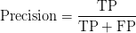

其中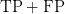

are the total predicted objects.

为了提高精度，分子需要更高(简单的数学)。当模型正确地将阳性样本预测为阳性(即，最大化真阳性)，并且同时将更少(不正确)的阴性样本预测为阳性(即，最小化假阳性)时，精度会更高。

当模型将许多阴性样本预测为阳性或较少正确的阳性分类时，精度会较低。这会增加分母，降低精度。

现在，让我们用几行 Python 代码来计算精度。

```py
import sklearn.metrics

ground_truth = ["cat", "cat", "others", "cat", "others", "others","cat", "cat", "cat", "others" ]
prediction = ["cat", "others", "cat", "cat", "others", "others","cat", "others", "others", "cat"]

precision = sklearn.metrics.precision_score(ground_truth, prediction, pos_label="cat")
print(precision)
```

在上面几行代码中，我们使用`sklearn.metrics`方法来计算上面为了理解二进制分类问题所举的`cat`和`others`例子的精度。

相对简单，从**第 3 行和第 4 行**开始，我们在一个列表中定义`ground_truth`和`prediction`。然后将它们传递给**线 6** 上`sklearn`的`precision_score`方法。我们还给出一个`pos_label`参数，让您指定哪个类应该被视为精度计算的`positive`。

* * *

### **[回忆](#TOC)**

它是正确分类的阳性样本与实际阳性样本总数之间的比率。回忆你的模型是否每次都猜到了它应该猜到的答案。召回率越高，检测到的阳性样本越多。

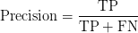

其中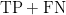

are the total ground-truth objects.

正如我们所了解的，精度确实考虑了如何对阴性样本进行分类；然而，召回率与负样本如何分类无关，只关心正样本如何分类。这意味着即使所有的阴性样本都被归类为阳性，召回仍然是完美的`1.0`。

当所有阳性样本都被归类为阳性时，召回率为`1.0`或 100%。另一方面，如果阳性样本被归类为阴性，召回率会很低；例如，假设一幅图像中有五辆汽车，但只有四辆被检测到，那么假阴性就是一辆。

```py
import sklearn.metrics

ground_truth = ["cat", "cat", "others", "cat", "others", "others","cat", "cat", "cat", "others"]
prediction = ["cat", "others", "cat", "cat", "others", "others", "cat", "others", "others", "cat"]

recall = sklearn.metrics.recall_score(ground_truth, prediction, pos_label="cat")
print(recall)
```

与 Precision 类似，我们只需将**第 6 行**上的`sklearn.metrics.precision_score`改为`sklearn.metrics.recall_score`就可以计算召回率。

* * *

### **[检测上下文中的 TP、FP、TN、FN](#TOC)**

我们学习了精确度和召回率，为了计算它们，我们需要计算真阳性、真阴性、假阳性和假阴性。我们还了解了并集上的交集，以及它如何帮助评估对象检测模型的定位误差。那么，让我们了解一下目标检测环境中的精度和召回率，以及 **IoU** 和**置信度得分**如何发挥作用。

**置信度得分**反映了该框包含对象的可能性(客观性得分)和边界框的准确性。但是，如果该单元中不存在任何对象，置信度得分应该为零。

* * *

#### **[真阳性](#TOC)**

只有在满足以下两个条件时，由模型进行的检测才被认为是真阳性:

*   预测的边界框的置信度得分应该大于置信度阈值(超参数)，这将表明我们已经找到了我们正在寻找的对象。
*   预测边界框和地面实况边界框之间的 IoU 应该大于 IoU 阈值。

而以上两个条件的意思是，不仅检测到物体，而且是在正确的位置检测到物体。**图 6** 显示了 IoU 为`0.81`且置信度为`0.7`的真阳性检测。

* * *

#### 假阳性

检测被认为是假阳性:

*   如果模型检测到具有高置信度得分的对象，但是它不存在(没有地面事实)，则 IoU 将等于零。
*   另一种情况可能是 IoU 小于 IoU 阈值。
*   如果所提议的边界框与地面真相完全对齐，但是所提议的框的类别标签不正确。

* * *

#### **[真负](#TOC)**

这通常是不需要的，主要是因为它不是精度和召回计算的一部分。

当置信度得分小于置信度阈值，并且 IoU(预测框和实际框)小于 IoU 阈值时，检测结果为真阴性。在物体检测中，可能有很多真正的底片，因为背景比物体本身覆盖了更多的图像区域。

* * *

#### **假阴性**

如果有一个物体存在，但模型不能检测到它，那么这是一个假阴性。

* * *

### **精确召回曲线**

根据上一节的学习，我们现在知道，如果模型同时具有高精度和高召回率，那么它会正确地预测样本为阳性，并预测大多数阳性样本(不会遗漏样本或预测它们为阴性)。但是，如果模型具有高精度和低召回率，它准确地预测样本为阳性但只有少数阳性样本(更多的假阴性)。

现在我们知道了精确度和召回率的重要性，并且我们的最终目标是获得精确度和召回率的最高分，让我们看看如何在同一个图表上绘制它们。

精确召回值的绘制被称为**精确召回曲线**，它描述了基于不同阈值的两者之间的权衡。精度-召回曲线有助于选择最佳阈值，使精度和召回率最大化。

让我们用一个猫和狗的二元分类例子来理解精确召回曲线。在`utils_precision_recall.py`中，我们将编写`compute_precision_recall`方法，该方法将在一个向量中采用实际向量和预测向量以及 10 个阈值。最后，返回 10 个阈值中每个阈值的精度和召回率。这也将有助于绘制精确召回曲线。

```py
# import the necessary packages
from pyimagesearch import config
import matplotlib.pyplot as plt
import sklearn.metrics
import numpy as np

def compute_precision_recall(yTrue, predScores, thresholds):
    precisions = []
    recalls = []

    # loop over each threshold from 0.2 to 0.65
    for threshold in thresholds:
        # yPred is dog if prediction score greater than threshold
        # else cat if prediction score less than threshold
        yPred = [
            "dog" if score >= threshold else "cat"
            for score in predScores
        ]

        # compute precision and recall for each threshold
        precision = sklearn.metrics.precision_score(y_true=yTrue,
            y_pred=yPred, pos_label="dog")
        recall = sklearn.metrics.recall_score(y_true=yTrue,
            y_pred=yPred, pos_label="dog")

        # append precision and recall for each threshold to
        # precisions and recalls list
        precisions.append(np.round(precision, 3))
        recalls.append(np.round(recall, 3))

    # return them to calling function
    return precisions, recalls
```

在第 7 行的**上，我们定义了`compute_precision_recall`函数，它将基本事实标签、预测分数和阈值列表作为参数。**

然后，我们迭代通过**行 12** 上的每个阈值，通过检查预测分数(或概率)是否大于或等于阈值将概率转换为类别标签，我们将`dog`标签赋值为 else `cat`。

从**第 21-24 行**，我们计算给定阈值和预测的精确度和召回率。然后我们将 precision 和 recall 四舍五入到三个小数位，并将它们添加到第 28 行和第 29 行的**列表的`precisions`和`recalls`中。**

最后，我们将`precisions`和`recalls`返回给**行 32** 上的调用函数。

```py
def pr_compute():
    # define thresholds from 0.2 to 0.65 with step size of 0.05
    thresholds = np.arange(start=0.2, stop=0.7, step=0.05)

    # call the compute_precision_recall function
    precisions, recalls = compute_precision_recall(
        yTrue=config.GROUND_TRUTH_PR, predScores=config.PREDICTION_PR,
        thresholds=thresholds,
    )

    # return the precisions and recalls
    return (precisions, recalls)
```

在**的第 36 行**，我们使用`np.arange`定义阈值，这创建了一个向量，其值从`0.2`到`0.65`，步长为`0.05`。

从**的第 39-42 行**，我们通过传入`ground_truth`、`prediction`和`thresholds`数组来调用`compute_precision_recall`方法。

```py
def plot_pr_curve(precisions, recalls, path):
    # plots the precision recall values for each threshold
    # and save the graph to disk
    plt.plot(recalls, precisions, linewidth=4, color="red")
    plt.xlabel("Recall", fontsize=12, fontweight='bold')
    plt.ylabel("Precision", fontsize=12, fontweight='bold')
    plt.title("Precision-Recall Curve", fontsize=15, fontweight="bold")
    plt.savefig(path)
    plt.show()
```

在上面几行代码中，我们创建了一个`plot_pr_curve`方法，帮助我们在 2D 图上绘制`precisions`和`recalls`列表，其中`precision`在 *x* 轴上，`recall`在 *y* 轴上。请注意，在 0.6 之后，随着回忆的增加，精确度开始下降。

我们有我们的精度-召回曲线，但是我们如何知道在哪个阈值下模型表现最好(即，高精度和召回)？

为了找出最佳的精确度和召回率，我们使用 F1-score 通过取它们的调和平均值将精确度和召回率结合成一个单一的度量。较高的 F1 分数意味着精确度和召回率较高，而较低的 F1 分数意味着精确度和召回率之间的高度不平衡(或者较低的精确度和召回率)。

}")

```py
f1_score = np.divide(2 * (np.array(precisions) * np.array(recalls)), (np.array(precisions) + np.array(recalls)))

print(f1_score)

array([0.71959027, 0.69536849, 0.69536849, 0.69986987, 0.73694181, 0.70606916, 0.70606916, 0.66687977, 0.57106109, 0.46121884])
```

在**行 1** 上，我们通过传递从上面得到的`precisions`和`recalls`列表来计算`f1_score`。从输出中，我们可以观察到最高的`f1_score`是索引 5 处的`0.7369`。

现在，让我们使用最高的`f1_score`来获得平衡精确度和召回率的最佳阈值。

```py
precision = precisions[np.argmax(f1_score)]
recall = recalls[np.argmax(f1_score)]
best_threshold = np.round(thresholds[np.argmax(f1_score)], 1)

print(precision, recall, best_threshold)

(0.7, 0.778, 0.4)
```

从**第 7-9 行**，我们通过将`f1_score`传递给`np.argmax`函数来计算精度、召回率和最佳阈值，以获得`f1_score`数组中的最大值索引。

最后，我们可以得出结论，平衡精确度和召回率的最佳阈值是`0.4`。另一种方式是期望我们的模型在`0.4`阈值达到最佳精度和召回率。

* * *

### **[物体探测竞赛数据集](#TOC)**

* * *

#### **[【Pascal VOC 2012】](#TOC)**

PASCAL 视觉对象类 2012 (VOC2012)是一个在现实场景中从各种视觉对象类中识别对象的挑战。这是一个监督学习的挑战，其中提供了标记的地面真相图像。该数据集有 20 个对象类，如人、鸟、猫、狗、自行车、汽车、椅子、沙发、电视、瓶子等。

PASCAL VOC 的历史可以追溯到 2005 年，当时数据集只包含四个类:自行车、汽车、摩托车和人。它总共有 1578 幅图像，包含 2209 个带注释的对象。

**图 10** 显示了 20 个班级的样本图片，正如我们所看到的，第一排倒数第二张图片中有几把椅子。

VOC2012 数据集由 11，530 幅图像和 27，450 个带训练/值分割的感兴趣区域(ROI)注释对象组成。27，450 ROI 指的是整个数据集中的边界框，因为每个图像可以有多个对象或 ROI。因此，与图像相比，ROI 超过 2 倍。

* * *

#### **[可可女士](#TOC)**

[微软通用对象上下文](https://cocodataset.org/#home) (MS COCO)是 2014 年在使用新颖用户界面的广泛众包的帮助下推出的大规模对象检测、分割和字幕数据集。该数据集包含 80 个对象类别的图像，在 328k 图像中有 250 万个标记实例。

**图 11** 显示了 COCO 数据集中标记有实例分割的示例图像。

COCO 还有一个优秀的用户界面来浏览数据集中的图像。例如，您可以从 80 个类别中选择缩略图；它会将它们作为标签放在搜索栏中，当你搜索时，它会显示数据集中带有那些标签(类)的所有图像，如图**图 12** 所示。

此外，当显示结果图像时，所有类别(多于搜索的类别)被显示为缩略图。您可以通过进一步单击这些缩略图来查看与这些类相关的分段掩码，从而对其进行调整。

* * *

### **[物体检测的精确召回曲线](#TOC)**

与分类相比，精确-召回曲线在评估对象检测模型的性能方面具有相同甚至更大的重要性。当我们改变置信度阈值(一个盒子包含一个对象的概率)时，如果精度和召回不受影响，则对象检测器被认为是好的。此外，准确率不会随着召回率的增加而降低。

具有高精度和高召回率的理想对象检测器将具有零假阳性(仅检测相关对象)和零假阴性(不遗漏相关对象或预测所有地面真实对象)。

现在，让我们借助一个例子来理解精确度和召回率是如何变化的。*对于这个例子和随后的例子，我们将使用 Rafael Padilla 的对象检测指标* [*GitHub 知识库*](https://github.com/rafaelpadilla/Object-Detection-Metrics) *，它提供了关于精确召回和平均精确的例子的极好的总结。*

考虑图 13 中**所示的例子；七幅图像由 15 个 ROI 或真实边界框(显示为绿色)和 24 个 ROI 建议或预测边界框(显示为红色)组成。每个预测的边界框都有一个与之相关联的置信度得分。**

现在让我们将所有这七个图像数据转移到**表 1** 中，该表有四列:图像名称、检测、每个检测的置信度得分以及真阳性(TP)或假阳性(FP)。对于这个例子，假设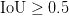

.

对于`Image 1`，我们有三个检测:`A`、`B`和`C`，它们分别有各自的置信度得分`88%`、`70%`和`80%`，以及这些检测是 TP 还是 FP。如果我们观察`Image 1`，我们可以看到检测`A`是一个 FP。这是因为它与 GT 的重叠明显较少，尽管可信度很高。记住，我们在对象检测的上下文中讨论了 TP/FP。检测`B`似乎与 GT 匹配得很好，因此它被标记为 TP，而检测`C`也是 FP，因为该提议中没有 GT。因此，我们得到了其余六幅图像的 TP 和 FP。

我们获得了数据集(七幅图像)的所有 TP/FP，但是我们需要计算整个数据集上累积的 TP/FP，以得出精确-召回曲线。因此，我们首先根据从最高到最低的置信度对上面的表行进行排列，由此我们得到一个新的**表 2** 。

**表 2** 还有五列:TP/FP 被分成两个单独的列，累计 TP、累计 FP、Precision 和 Recall。为了计算精度和召回率，我们使用前面讨论过的公式。

让我们将**表 2** 分解为以下步骤:

1.  我们将 TP 和 FP 分成两列，对于每个建议的 ROI，我们在它们各自的列中指定 1 和 0。例如，在`Image 5`中，检测`R`是一个 TP，所以我们在第一行的 TP 列中指定 1，而在同一个图像中，检测`Q`是一个 FP，所以我们在第 18 行的 FP 列中设置 1。对于所有提议的 ROI，遵循相同的想法。
2.  一旦我们完成了所有建议 ROI 的 TP 和 FP，我们将进入以下两列:`Acc TP`和`Acc FP`。计算它们非常简单。对于第一行，`Acc TP`将与 TP 相同(即 1)。对于第二行，它将保持不变，因为 TP 为 0。对于第三行，它将是 2，因为 TP 是 1(到目前为止，两个 TP:第一行和第三行)。类似地，我们将计算所有行的`Acc TP`,直到我们到达末尾。
3.  然后，我们将对`Acc FP`列进行同样的练习，并根据前一个`Acc FP`和当前行 FP 的值填充所有行。
4.  现在我们有了`Acc TP`和`Acc FP`，计算精度和召回率就很简单了。对于每个建议的 ROI，我们将使用`Acc TP`和`Acc FP`来计算精度，并使用`Acc TP`作为分子，GT 的数量作为分母(TP+FN)来计算召回。
5.  对于第一行，精度会是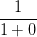，无非就是`1`；对于第二行，会是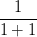，也就是`0.5`，我们会对所有行进行计算。同样，我们可以计算召回率；例如，对于最后一行，它将是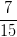(即`0.466`)。

很好，现在我们有了所有建议感兴趣区域的精度和召回值，我们可以绘制精度与召回的关系图，如图**图 14** 所示。

从上图中我们可以看到，我们的精度-召回曲线在左上角以绿色显示了所有具有最高置信度得分`R`的建议感兴趣区域，在右下角以红色显示了具有最低置信度得分的检测。

现在我们已经有了精确召回率(PR)曲线，下一步是计算 PR 曲线下的面积(即平均精确率(AP))。然而，在计算 AP 之前，我们需要消除锯齿形模式(即上图中的噪声),因为精度和召回率一直在上升和下降。

* * *

### **[计算平均精度](#TOC)**

如上所述，平均精度(AP)找到了精度-召回曲线下的区域；我们可以使用 PASCAL VOC 挑战赛中介绍的 11 点插值技术从 PR 曲线计算平均精度。

让我们看看如何将这一技术应用于 PR 曲线，并得出平均精度。

* * *

#### **[11 点插补](#TOC)**

11 点插值计算![[0, 0.1, 0.2, \dots, 1]](img/6e27beb19e8bf70034196c98e5334f7f.png "[0, 0.1, 0.2, \dots, 1]")召回级别的精度

(i.e., 11 equally spaced recall levels), and then averages them out. Mathematically it can be expressed as:

}")

")

其中")

is the measured precision at recall .

由于精度和召回率在`0`和`1`之间，AP 也落在`0`和`1`之间。因此，在计算 AP 之前，我们需要从 PR 曲线中平滑掉之字形图案。

在每个召回级别，我们将每个精度值替换为该召回级别右侧的最大精度值，如图**图 16** 所示。

所以蓝线变成了红线，曲线会单调递减，而不是之字形。因此，计算出的 AP 值将更不容易受到排序中的微小变化的影响。在数学上，我们用任何召回的最大精度≥ *ȓ* 替换召回 *ȓ* 的精度值。

一旦我们有了这个图表，我们就可以将从`0`到`1.0`的召回值分成 11 个 0.1 的相等间隔，从而得到**图 17** 。

现在让我们根据下面的 11 点插值图计算 AP:

")

")

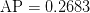


***注:*** *据原研究者介绍，内插精度/召回曲线的意图是为了减少因实例排序的细微变化而导致的精度/召回曲线中“摆动”的影响。*

* * *

### **[【地图平均精度】](#TOC)**

我们可以通过简单地取所有 AP 类的平均值来计算 mAP。例如，在 PASCAL VOC 数据集中，我们可以为 20 个类别中的每一个计算 AP，然后对所有 20 个 AP 类进行平均，以获得平均精度。

**表 3** 显示了 PASCAL VOC 数据集上各种检测器(如 SSD300 和 SSD512)的图，以及 20 类中每一类的 AP。每个类上的 AP 提供了对对象检测器的更细粒度的评估，因为它告诉我们检测器在哪些类上表现良好，在哪些类上表现不佳。

* * *

## **[使用 COCO 评估器](#TOC)** 评估 YOLOv4 模型

这最后一节将学习使用 COCO 评估器评估对象检测模型的性能。我们将使用在 MS COCO 数据集上训练的 [YOLOv4](https://arxiv.org/pdf/2004.10934.pdf) 对象检测器，它在 Tesla Volta100 GPU 上以`∼65` FPS 的实时速度实现了 MS COCO 数据集的 43.5% AP (65.7% AP50)。

我们将在 2017 年 MS COCO 验证数据集上评估 YOLOv4 模型，该数据集包含 5000 张不同大小的图像，并采用 COCO 格式的地面实况。

* * *

### **[COCO 地图评估员](#TOC)**

COCO 评估器现在是计算物体探测器地图的黄金标准。大多数研究论文使用过去几年的 COCO 评估为 COCO 数据集提供了基准。主要有两个原因。首先，数据集比 VOC 数据集丰富得多。其次，COCO 评估对检测模型进行了更深入的分析，从而提供了完整的结果。

正如在 PASCAL VOC 评估中所了解到的，如果满足以下条件，则建议的 ROI 被认为是真正的正值

with the ground truth. Since there is only one threshold, hence, a detection that very closely aligns (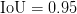) with the ground truth would be considered similar to the one with 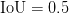.

使用单一 IoU 阈值来评估我们的检测模型可能不是一个好主意，因为单一阈值可能会导致评估指标出现偏差。还有，可以对模特宽大。因此，COCO mAP 评估器以步长 0.05 (AP@[0.5:0.05:0.95])对 10 个 IoU 阈值上的 80 个类的 mAP 进行平均。

值得注意的是，与 PASCAL VOC 不同，COCO 评估器使用 101 点插值 AP(即，它计算 101 个召回级别[0:0.01:1]的精度值)。

**图 18** 显示了 COCO 评价器为我们提供的物体检测评价的变化，我们也将在教程的下一节学习计算。

上图显示 COCO 评价者可以通过多种方式报告 AP，即 AP@[0.5:0.05:0.95]，AP@0.5，AP@0.75，AP 跨三个尺度(小、中、大)。

如果您的用例要求您检测大量小物体，那么您可能希望最大化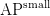,那么跨三个尺度的 AP 会非常有益

.

**图 19** 展示了 JSON 格式中地面真相的 COCO 格式。它有一个可选的`info`字段，其中包含一些关于数据发布年份、版本和与数据集相关的 URL 的信息。

然后，`image`字段包含图像的元数据，如`width`、`height`、`file_name`等。

由于 COCO 数据集不仅用于对象检测任务，还用于分割、图像字幕和关键点检测，因此每个任务的注释会有所不同。让我们看看`annotations`格式对于物体检测是什么样子的。

**图 20** 显示了物体检测`annotation`和`categories`字段。`annotation`字段有`image_id`，这对于所有 ROI 都是一样的，`category_id`是类 id，`area`是边界框的区域(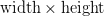

), `bbox` – top-left corner coordinates, width, and height of the bounding box.

最后，`categories`字段将包含类别数据(即类别 id、类别名称(汽车、人))和超级类别。因此，例如，汽车和自行车将具有相同的超级类别(即车辆)。

但我们不必将数据集地面实况转换为上述 COCO 格式，因为 COCO Val2017 数据集已经是所需的格式。

这是关于基本事实的格式，但是让我们看看 COCO 中的预测格式是什么样子的。

在**图 21** 中我们可以看到，预测格式相当简单；我们有`image_id`:图像名称，`category_id`:类别 id，`bbox`:左上角坐标，边界框的宽度和高度，`score`:预测的置信度。

现在我们已经完全理解了基本事实和预测 COCO 格式，让我们直接进入代码并计算 YOLOv4 模型的平均精度。

***注:*** 我们将使用来自 [AlexeyAB 的 Darknet 资源库](https://github.com/AlexeyAB/darknet)的 YOLOv4，在 Google Colab 中配置它是小菜一碟。

* * *

### **[配置先决条件](#TOC)**

对于今天的任务，我们将使用 **MS COCO Val 2017** 数据集。我们创建了这个数据集，用于对象检测、分割和图像字幕。它在验证集中包含 5000 个图像。

在继续执行代码之前，请确保您已经配置了 Darknet 框架，并下载了 YOLOv4 权重和 MSCOCO Val 2017 图像和标签。

如果您使用的是非 Linux 系统，您可以在这里获得数据集[。这将启动压缩数据集的下载。然后，将这个 zip 文件的内容解压到项目的`data`目录中。](https://cocodataset.org/#download)

如果您使用的是 Linux 系统，只需按照以下说明操作即可:

```py
$ cd data
$ wget http://images.cocodataset.org/zips/val2017.zip
$ unzip val2017.zip
$ wget -c http://images.cocodataset.org/annotations/annotations_trainval2017.zip
$ unzip annotations_trainval2017.zip
$ wget https://github.com/AlexeyAB/darknet/releases/download/yolov4/yolov4.weights
$ cd ../
```

在**行 1** 上，我们首先将目录更改为`data`，然后在**行 2 和 3** 上，我们下载并解压缩`val2017`图像。然后，我们下载并解压缩第 4 行和第 5 行中的基本事实注释。最后，在**第 6 行**，我们下载了`YOLOv4`权重文件。

为了计算平均精度，我们打开`utils_map.py`脚本，它有几个非常重要的方法来检测对象:将边界框转换为所需的格式，加载 pickle 文件，在图像目录上运行推理，最后以 JSON 格式存储它们的预测。

```py
# import the necessary packages
from pyimagesearch import config
from progressbar import progressbar
from darknet import darknet
import pickle
import json
import cv2
import os

def image_detection(imagePath, network, classNames, thresh):
	# image_detection takes the image as an input and returns
	# the detections to the calling function
	width = darknet.network_width(network)
	height = darknet.network_height(network)

	# create an empty darknetImage of shape [608, 608, 3]
	darknetImage = darknet.make_image(width, height, 3)

	# read the image from imagePath, convert from BGR->RGB
	# resize the image as per YOLOv4 network input size
	image = cv2.imread(imagePath)
	imageRGB = cv2.cvtColor(image, cv2.COLOR_BGR2RGB)
	imageResized = cv2.resize(imageRGB, (width, height),
		interpolation=cv2.INTER_LINEAR)

	darknet.copy_image_from_bytes(darknetImage, imageResized.tobytes())

	# detections include the class labels, bounding box coordinates, and
	# confidence score for all the proposed ROIs in the image
	detections = darknet.detect_image(network, classNames, darknetImage,
		thresh=thresh)
	darknet.free_image(darknetImage)

	# return the detections and image shape to the calling function
	return (detections, image.shape)
```

我们定义的第一个方法是`image_detection`。顾名思义，它将图像作为输入，并将检测结果返回给调用函数(**第 10-35 行**)。

检测包括图像中所有建议 ROI 的类别标签、边界框坐标和置信度得分。我们还返回原始图像形状，因为我们稍后需要它来缩放预测的边界框坐标。

从**第 13-17 行**，我们定义了从`yolov4.cfg`文件中得到的网络输入宽度和高度，并创建了一个形状为`[608, 608, 3]`的空`darknetImage`。

然后从**第 21-24 行**开始，我们从路径中读取图像，将图像转换到 RGB 颜色空间，因为 OpenCV 以 BGR 格式读取图像，并根据网络宽度和高度调整图像大小。

接下来，我们将图像的内容复制到空的`darknetImage`中，最后调用带有几个参数的`detect_image`方法，如`network`、`classNames`、`darknetImage`和`thresh`。然后，它返回`detections`,其中包含建议的边界框坐标、类别标签和每个建议 ROI 的置信度得分。

最后，我们将`detections`和`image.shape`返回给**行 35** 上的调用函数。

```py
def bbox2points(bbox, img_shape):
    #from bounding box yolo format centerx, centery, w, h
    #to corner points top-left and bottom right
    (x, y, w, h) = bbox

    # compute scale ratio dividing by 608
    hRatio = img_shape[0] / config.YOLO_NETWORK_HEIGHT
    wRatio = img_shape[1] / config.YOLO_NETWORK_WIDTH
    xMin = int(round(x - (w / 2)))
    yMin = int(round(y - (h / 2)))

    # scale them as per the original image size
    return (xMin * wRatio, yMin * hRatio, w * wRatio, h * hRatio)
```

从**第 37-49 行**，我们定义了接受`bbox`坐标和`img_shape`的`bbox2points`方法:输入到模型的输入图像的形状。

YOLOv4 模型在![[c_{x}, c_{y}, w, h]](img/739f9617bd3194a12344c345e36f7bae.png "[c_{x}, c_{y}, w, h]")中输出边界框预测

format where and are the center coordinates of the bounding box, 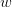and 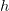are the width and height of the bounding box. These coordinates are normalized per network input size (i.e., `608)` since we use the YOLOv4 model with `608` input resolution.

然而，我们需要将边界框预测转换成![[\text{left}_{x}, \text{top}_{y}, w, h]](img/c941c2f590535f02559dcdfcff653707.png "[\text{left}_{x}, \text{top}_{y}, w, h]")

format and also scale them as per the original image size. We do this so that the `bbox` prediction format matches the ground-truth `bbox` format.

我们通过将原始图像尺寸除以网络输入尺寸")来计算第 43 行和第 44 行的缩放比例

. Then we calculate the top-left coordinates: `xmin` and `ymin` and finally return the scaled top-left, width, and height of the bounding box to the calling function.

```py
def load_yolo_cls_idx(path):
    # load pickle files: COCO 'class_id' to the
    # class_name list and the COCO 0-90 class ids list
    with open(path, "rb") as f:
        out = pickle.load(f)
        return out
```

`load_yolo_cls_idx`函数是一个将 COCO `class_id`加载到`class_name`列表和 COCO 0-90 类 id 列表的实用函数。我们需要将 COCO 0-80 类 id 映射到 0-90 类 id，因为 COCO Val2017 地面实况`category_id`的范围是从 0 到 90。

```py
def run_inference(imagePaths, network, class_names,
    label2idx, yolo_cls_90, conf_thresh, pred_file):
    results = []

    # loop over all the images
    for path in progressbar(imagePaths):
        # pass the imagePath, network, class names and confidence
        # threshold to image_detection method that returns detections
        # and original image shape
        detections, imgShape = image_detection(
            path, network, class_names, thresh=conf_thresh
        )

       # extract imageID
       imageId = int(os.path.splitext(os.path.basename(path))[0])

       # loop over all the proposed ROIs
       for cls, conf, box in detections:
           (x, y, w, h) = bbox2points(box, imgShape)
           label = [key for key, value in label2idx.items()
                   if value == cls][0]
           label = yolo_cls_90[label]

           # append result for each ROI as per COCO prediction
           # in a dictionary format
           results.append({"image_id": imageId,
                           "category_id": label,
                           "bbox": [x, y, w, h],
                           "score": float(conf)})

           # save the results on disk in a JSON format
           with open(pred_file, "w") as f:
               json.dump(results, f, indent=4)
```

`run_inference`方法是最神奇的地方:

*   迭代图像以调用`image_detection`进行检测
*   从路径的尾部获取`imageId`
*   在建议的检测上循环
*   用`bbox2points`方法转换提议的包围盒坐标
*   然后提取标签 id 并将其转换为 0-90 的类别索引
*   将所有需要的信息添加到一个`results`列表中
*   最后，以 JSON 格式创建和转储结果

现在大部分工作已经在前面的脚本中完成了，我们定义了`eval_map.py`脚本，它是从磁盘加载`YOLOv4`模型并调用`utils_map.py`脚本中所需方法的主驱动程序脚本。最后，它使用`COCOeval`API 在 COCO Val 2017 数据集上计算`YOLOv4`探测器的地图。

```py
# import the necessary packages
from pyimagesearch.utils_map import run_inference
from pyimagesearch.utils_map import load_yolo_cls_idx
from pyimagesearch import config
from pycocotools.cocoeval import COCOeval
from pycocotools.coco import COCO
from darknet import darknet

def compute_map():
	# use the COCO class to load and read the ground-truth annotations
	cocoAnnotation = COCO(annotation_file=config.COCO_GT_ANNOTATION)

	# call the darknet.load_network method, which loads the YOLOv4
	# network based on the configuration, weights, and data file
	(network, classNames, _) = darknet.load_network(
			config.YOLO_CONFIG,
			config.COCO_DATA,
			config.YOLO_WEIGHTS,
		)

	label2Idx = load_yolo_cls_idx(config.LABEL2IDX)
	yoloCls90 = load_yolo_cls_idx(config.YOLO_90CLASS_MAP)

	# call the run_inference function to generate prediction JSON file
	run_inference(config.IMAGES_PATH, network, classNames, label2Idx,
		yoloCls90, config.CONF_THRESHOLD, config.COCO_VAL_PRED)	
```

在**第 11 行**，我们使用`COCO`类来加载和读取基本事实注释。

从**的第 15-19 行**，我们调用`darknet.load_network`方法，该方法根据配置、权重和数据文件加载 YOLOv4 网络。例如，如果配置文件的宽度和高度设置为 512，它将相应地创建模型。它还会返回类名。

然后我们在**的第 21 行和第 22 行**加载`label2Idx`字典和`yoloCls90`地图列表。

现在我们已经定义了`image_paths`列表、创建了网络、加载了类名和其他帮助文件，我们可以通过将这些作为参数传递来调用第 25 行**和第 26 行**上的`run_inference`函数。一旦函数执行完成，就会创建一个`COCO_Val_Prediction.json`文件，样本预测 JSON 如图**图 22** 所示。

```py
	# load detection JSON file from the disk
	cocovalPrediction = cocoAnnotation.loadRes(config.COCO_VAL_PRED)

	# initialize the COCOeval object by passing the coco object with
	# ground truth annotations, coco object with detection results
	cocoEval = COCOeval(cocoAnnotation, cocovalPrediction, "bbox")

	# run evaluation for each image, accumulates per image results
	# display the summary metrics of the evaluation
	cocoEval.evaluate()
	cocoEval.accumulate()
	cocoEval.summarize()
```

在第 29 行的**上，我们加载了由`run_inference()`方法生成的预测注释文件。**

然后，在**第 33 行**上，我们通过传递带有基本事实注释的 coco 对象(`instances_val2017.json`)和带有检测结果的 coco 对象(`COCO_Val_Predictions.json`)来初始化`COCOeval`对象。第三个参数很有趣；`IoUType`为分割评估的`segm`，为关键点检测评估的`keypoints`。但是，我们需要评估一个对象检测模型，所以我们通过`bbox`。

最后，从**第 37-39 行**，我们依次调用三个函数:

*   `cocoEval.evaluate`对每张图像进行评估
*   `cocoEval.accumulate`累积每幅图像的结果
*   `cocoEval.summarize`显示评估的汇总指标

真相大白的时刻终于到来了！YOLOv4 模型在 COCO Val 2017 数据集上实现了 65.8mAP@0.5 IoU 和 45.8mAP@[0.5:0.95]平均 IoU(**图 23)** 。完成`run_inference`方法总共花费了 267 秒，这意味着 YOLOv4 模型在特斯拉 T4 上实现了超过 19 FPS 的速度；然而，这个数字在 Google Colab 上可能会有所不同。

* * *

* * *

## **[汇总](#TOC)**

恭喜你走到这一步！我们希望你通过本教程学到了很多东西，所以让我们快速总结一下我们学到的东西。

1.  我们从讨论 IoU 的概念开始，为什么要使用 IoU，并学习了用 Python 计算 IoU。
2.  然后，我们从分类的角度讨论了精确度和召回率，这有助于我们通过示例从对象检测上下文中理解真阳性、假阳性和假阴性。
3.  接下来，我们讨论了两个最流行的对象检测数据集，PASCAL VOC 和 MS COCO，它们也设计了使用 11 点和 101 点插值计算 mAP 的方法。
4.  然后，我们讨论了对象检测的精度-召回曲线，并借助一个示例学习了使用 11 点插值技术计算平均精度。
5.  最后，我们学习了如何使用 Python 中的 COCO 评估器在 MS COCO Val2017 数据集上评估 YOLOv4 模型。

* * *

### **[引用信息](#TOC)**

**Sharma，A.** “使用 COCO 评估器的平均精度(mAP)”*PyImageSearch*，D. Chakraborty，P. Chugh，A. R. Gosthipaty，S. Huot，K. Kidriavsteva，R. Raha 和 A. Thanki 编辑。，2022 年，【https://pyimg.co/nwoka 

```py
@incollection{Sharma_2022_mAP,
  author = {Aditya Sharma},
  title = {Mean Average Precision {(mAP)} Using the {COCO} Evaluator},
  booktitle = {PyImageSearch},
  editor = {Devjyoti Chakraborty and Puneet Chugh and Aritra Roy Gosthipaty and Susan Huot and Kseniia Kidriavsteva and Ritwik Raha and Abhishek Thanki},
  year = {2022},
  note = {https://pyimg.co/nwoka},
}
```

* * *

**要下载这篇文章的源代码(并在未来教程在 PyImageSearch 上发布时得到通知)，*只需在下面的表格中输入您的电子邮件地址！****