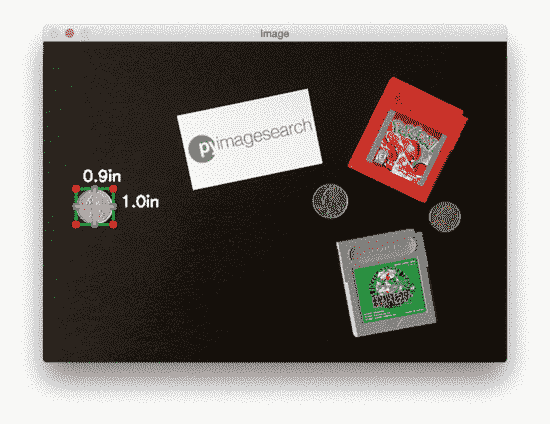
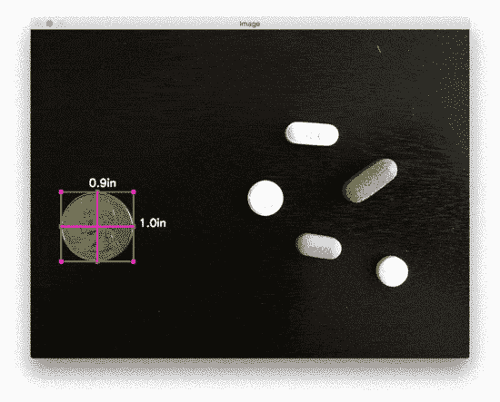

# 用 OpenCV 测量图像中物体的尺寸

> 原文：<https://pyimagesearch.com/2016/03/28/measuring-size-of-objects-in-an-image-with-opencv/>

最后更新于 2021 年 7 月 8 日。

**测量图像中一个(或多个)物体的尺寸**已经成为*在 PyImageSearch 博客上被大量请求的教程*—*把这个帖子放到网上并与你分享感觉很棒*。

今天的帖子是关于测量图像中物体尺寸和计算物体间距离的三部分系列文章的第二部分。

[上周](https://pyimagesearch.com/2016/03/21/ordering-coordinates-clockwise-with-python-and-opencv/)，我们学习了一项重要的技术:*如何可靠地*按左上、右上、右下和左下排列一组旋转的边界框坐标。

今天我们将利用这项技术来帮助我们计算图像中物体的大小。一定要阅读整篇文章，看看是怎么做的！

*   【2021 年 7 月更新:增加了如何通过使用棋盘执行适当的摄像机校准来提高物体尺寸测量精度的章节。

## 用 OpenCV 测量图像中物体的尺寸

测量图像中物体的大小类似于[计算我们的相机到物体的距离](https://pyimagesearch.com/2015/05/04/target-acquired-finding-targets-in-drone-and-quadcopter-video-streams-using-python-and-opencv/)——在这两种情况下，我们都需要定义一个比率来测量每个给定度量的像素数量。

我称之为“像素/度量”比率，我在下一节中有更正式的定义。

### “像素/度量”比率

为了确定图像中物体的大小，我们首先需要使用参考物体执行“校准”(不要与[内在/外在校准](http://www.cs.rutgers.edu/~elgammal/classes/cs534/lectures/Calibration.pdf)混淆)。我们的引用对象应该有两个重要的属性:

*   **属性#1:** 我们要知道这个物体的*尺寸(以宽度或高度表示)，以*的可测单位*(如毫米、英寸等)表示。).*
*   **属性#2:** 我们应该能够很容易地在图像中找到这个参考对象，要么基于对象的*位置*(比如参考对象总是被放在图像的左上角)，要么通过*外观*(比如是一种独特的颜色或形状，与图像中的所有其他对象都不同)。无论哪种情况，我们的引用应该是以某种方式唯一可识别的。

在本例中，我们将使用美国地区作为我们的参考对象，在所有示例中，确保它始终是我们图像中最左侧的对象:

通过确保四分之一是最左边的对象，我们可以从左到右对我们的对象轮廓进行排序，获取四分之一(它将始终是排序列表中的第一个轮廓)，并使用它来定义我们的 *pixels_per_metric* ，我们将其定义为:

*pixels _ per _ metric = object _ width/know _ width*

一个美国硬币的*已知宽度*为 [0.955 英寸](https://en.wikipedia.org/wiki/Quarter_(United_States_coin)#Current_design)。现在，假设我们的 *object_width* (以像素为单位)被计算为 150 像素宽(基于其相关的边界框)。

因此， *pixels_per_metric* 为:

*pixels _ per _ metric = 150 px/0.955 in = 157 px*

因此意味着在我们的图像中每 0.955 英寸大约有 157 个像素。利用这个比率，我们可以计算出图像中物体的大小。

### 用计算机视觉测量物体的尺寸

既然我们已经了解了“像素/度量”比率，我们就可以实现用于测量图像中对象大小的 Python 驱动程序脚本了。

打开一个新文件，将其命名为`object_size.py`，并插入以下代码:

```py
# import the necessary packages
from scipy.spatial import distance as dist
from imutils import perspective
from imutils import contours
import numpy as np
import argparse
import imutils
import cv2

def midpoint(ptA, ptB):
	return ((ptA[0] + ptB[0]) * 0.5, (ptA[1] + ptB[1]) * 0.5)

# construct the argument parse and parse the arguments
ap = argparse.ArgumentParser()
ap.add_argument("-i", "--image", required=True,
	help="path to the input image")
ap.add_argument("-w", "--width", type=float, required=True,
	help="width of the left-most object in the image (in inches)")
args = vars(ap.parse_args())

```

**第 2-8 行**导入我们需要的 Python 包。在本例中，我们将大量使用 [imutils 包](https://github.com/jrosebr1/imutils)，因此如果您还没有安装它，请确保在继续之前安装它:

```py
$ pip install imutils

```

否则，如果你*确实*安装了`imutils`，确保你有最新的版本，也就是本文撰写时的`0.3.6`:

```py
$ pip install --upgrade imutils

```

**第 10 行和第 11 行**定义了一个叫做`midpoint`的辅助方法，顾名思义，这个方法用于计算两组 *(x，y)*-坐标之间的[中点](http://www.purplemath.com/modules/midpoint.htm)。

然后我们在**第 14-19 行**解析命令行参数。我们需要两个参数，`--image`，它是包含我们想要测量的对象的输入图像的路径，和`--width`，它是我们的参考对象的宽度(以英寸为单位)，假定是我们的`--image`中最左边的对象。

我们现在可以加载图像并对其进行预处理:

```py
# load the image, convert it to grayscale, and blur it slightly
image = cv2.imread(args["image"])
gray = cv2.cvtColor(image, cv2.COLOR_BGR2GRAY)
gray = cv2.GaussianBlur(gray, (7, 7), 0)

# perform edge detection, then perform a dilation + erosion to
# close gaps in between object edges
edged = cv2.Canny(gray, 50, 100)
edged = cv2.dilate(edged, None, iterations=1)
edged = cv2.erode(edged, None, iterations=1)

# find contours in the edge map
cnts = cv2.findContours(edged.copy(), cv2.RETR_EXTERNAL,
	cv2.CHAIN_APPROX_SIMPLE)
cnts = imutils.grab_contours(cnts)

# sort the contours from left-to-right and initialize the
# 'pixels per metric' calibration variable
(cnts, _) = contours.sort_contours(cnts)
pixelsPerMetric = None

```

**第 22-24 行**从磁盘加载我们的图像，将其转换为灰度，然后使用高斯滤波器平滑。然后，我们执行边缘检测以及膨胀+腐蚀来闭合边缘图中边缘之间的任何缝隙(**第 28-30 行**)。

**第 33-35 行**找到与我们的边缘图中的物体相对应的轮廓(即轮廓)。

然后这些轮廓在第 39 行的**上从左到右排序(允许我们提取我们的参考对象)。我们还在**线 40** 上初始化我们的`pixelsPerMetric`值。**

下一步是检查每个轮廓:

```py
# loop over the contours individually
for c in cnts:
	# if the contour is not sufficiently large, ignore it
	if cv2.contourArea(c) < 100:
		continue

	# compute the rotated bounding box of the contour
	orig = image.copy()
	box = cv2.minAreaRect(c)
	box = cv2.cv.BoxPoints(box) if imutils.is_cv2() else cv2.boxPoints(box)
	box = np.array(box, dtype="int")

	# order the points in the contour such that they appear
	# in top-left, top-right, bottom-right, and bottom-left
	# order, then draw the outline of the rotated bounding
	# box
	box = perspective.order_points(box)
	cv2.drawContours(orig, [box.astype("int")], -1, (0, 255, 0), 2)

	# loop over the original points and draw them
	for (x, y) in box:
		cv2.circle(orig, (int(x), int(y)), 5, (0, 0, 255), -1)

```

在第**行第 43** 处，我们开始循环每个单独的轮廓。如果轮廓不够大，我们丢弃该区域，假定它是边缘检测过程遗留的噪声(**第 45 和 46 行**)。

假设轮廓区域足够大，我们在**行 50-52** 上计算图像的旋转边界框，特别注意使用 OpenCV 2.4 的`cv2.cv.BoxPoints`函数和 OpenCV 3 的`cv2.boxPoints`方法。

然后，我们按照左上、右上、右下和左下的顺序排列旋转后的边界坐标`box`，[，正如上周的博文](https://pyimagesearch.com/2016/03/21/ordering-coordinates-clockwise-with-python-and-opencv/) ( **第 58 行**)中所讨论的。

最后，**行 59-63** 在*绿色*中画出物体的*轮廓*，随后在*中画出包围盒矩形的*顶点*为红色小圆圈*。

现在我们已经有了边界框，我们可以计算一系列的中点:

```py
	# unpack the ordered bounding box, then compute the midpoint
	# between the top-left and top-right coordinates, followed by
	# the midpoint between bottom-left and bottom-right coordinates
	(tl, tr, br, bl) = box
	(tltrX, tltrY) = midpoint(tl, tr)
	(blbrX, blbrY) = midpoint(bl, br)

	# compute the midpoint between the top-left and top-right points,
	# followed by the midpoint between the top-righ and bottom-right
	(tlblX, tlblY) = midpoint(tl, bl)
	(trbrX, trbrY) = midpoint(tr, br)

	# draw the midpoints on the image
	cv2.circle(orig, (int(tltrX), int(tltrY)), 5, (255, 0, 0), -1)
	cv2.circle(orig, (int(blbrX), int(blbrY)), 5, (255, 0, 0), -1)
	cv2.circle(orig, (int(tlblX), int(tlblY)), 5, (255, 0, 0), -1)
	cv2.circle(orig, (int(trbrX), int(trbrY)), 5, (255, 0, 0), -1)

	# draw lines between the midpoints
	cv2.line(orig, (int(tltrX), int(tltrY)), (int(blbrX), int(blbrY)),
		(255, 0, 255), 2)
	cv2.line(orig, (int(tlblX), int(tlblY)), (int(trbrX), int(trbrY)),
		(255, 0, 255), 2)

```

**第 68-70 行**打开我们的有序边界框，然后计算左上和右上点之间的中点，接着是右下点之间的中点。

我们还将分别计算左上+左下和右上+右下的中点(**行 74 和 75** )。

**线 78-81** 在我们的`image`上画出*蓝色*中点，然后用*紫色*线连接中点。

接下来，我们需要通过研究我们的引用对象来初始化我们的`pixelsPerMetric`变量:

```py
	# compute the Euclidean distance between the midpoints
	dA = dist.euclidean((tltrX, tltrY), (blbrX, blbrY))
	dB = dist.euclidean((tlblX, tlblY), (trbrX, trbrY))

	# if the pixels per metric has not been initialized, then
	# compute it as the ratio of pixels to supplied metric
	# (in this case, inches)
	if pixelsPerMetric is None:
		pixelsPerMetric = dB / args["width"]

```

首先，我们计算我们的中点集合之间的欧几里德距离(**线 90 和 91** )。`dA`变量将包含*高度*距离(以像素为单位),而`dB`将保存我们的*宽度*距离。

然后我们检查第 96 行的**，看看我们的`pixelsPerMetric`变量是否已经初始化，如果还没有，我们用`dB`除以我们提供的`--width`，从而得到我们每英寸的(近似)像素。**

既然已经定义了我们的`pixelsPerMetric`变量，我们可以测量图像中对象的大小:

```py
	# compute the size of the object
	dimA = dA / pixelsPerMetric
	dimB = dB / pixelsPerMetric

	# draw the object sizes on the image
	cv2.putText(orig, "{:.1f}in".format(dimA),
		(int(tltrX - 15), int(tltrY - 10)), cv2.FONT_HERSHEY_SIMPLEX,
		0.65, (255, 255, 255), 2)
	cv2.putText(orig, "{:.1f}in".format(dimB),
		(int(trbrX + 10), int(trbrY)), cv2.FONT_HERSHEY_SIMPLEX,
		0.65, (255, 255, 255), 2)

	# show the output image
	cv2.imshow("Image", orig)
	cv2.waitKey(0)

```

**第 100 行和第 101 行**通过将各自的欧几里德距离除以`pixelsPerMetric`值来计算对象的尺寸( ***英寸*** )(参见上面的**“像素/度量”**部分，了解为什么这个比率有效)。

**第 104-109 行**在我们的`image`上绘制物体的尺寸，而**第 112 和 113 行**显示输出结果。

### 物体尺寸测量结果

要测试我们的`object_size.py`脚本，只需发出以下命令:

```py
$ python object_size.py --image images/example_01.png --width 0.955

```

您的输出应该如下所示:



**Figure 2:** Measuring the size of objects in an image using OpenCV, Python, and computer vision + image processing techniques.

正如你所看到的，我们已经成功地计算了我们的图像中每个对象的大小——我们的名片被正确地报告为*3.5 英寸 x 2 英寸*。同样，我们的镍被准确地描述为*0.8 英寸 x 0.8in 英寸*。

然而，并不是所有的结果都是完美的。

据报道，Game Boy 墨盒的尺寸略有不同(尽管它们的尺寸相同)。两个四分之一的高度也相差*0.1 英寸*。

那么这是为什么呢？为什么物体测量不是 100%准确？

原因有两个:

1.  首先，我匆忙用我的 iPhone 拍了这张照片。这个角度肯定不是一个完美的 90 度“俯视”(像鸟瞰一样)的角度。如果没有一个完美的 90 度视角(或尽可能接近它)，对象的尺寸可能会出现扭曲。
2.  第二，我没有使用相机的内部和外部参数来校准我的 iPhone。如果不确定这些参数，照片可能会出现径向和切向镜头失真。执行额外的校准步骤来找到这些参数可以“消除”我们的图像失真，并导致更好的对象大小近似(但我将失真校正的讨论作为未来博客帖子的主题)。

与此同时，在拍摄物体照片时，努力获得尽可能接近 90 度的视角——这将有助于提高物体尺寸估计的准确性。

也就是说，让我们看看测量物体尺寸的第二个例子，这次是测量药丸的尺寸:

```py
$ python object_size.py --image images/example_02.png --width 0.955

```



**Figure 3:** Measuring the size of pills in an image with OpenCV.

在美国的 20，000 多种处方药中，近 50%是圆形*和/或白色*的*，因此，如果我们能够根据它们的尺寸来筛选药丸，我们就有更好的机会来准确识别药物。*

最后，我们还有最后一个例子，这次使用一张*3.5 英寸 x 2 英寸*的名片来测量两个乙烯基 EPs 和一个信封的大小:

```py
$ python object_size.py --image images/example_03.png --width 3.5

```

同样，结果不是很完美，但这是由于(1)视角和(2)镜头失真，如上所述。

### **通过适当的摄像机校准提高物体尺寸测量精度**

在测量图像中物体的尺寸之前，我们首先需要校准我们的系统。在这篇文章中，我们使用了一个简单的“像素/度量”技术。

然而，通过计算外部和内部参数来执行适当的摄像机校准，可以获得更好的精度:

*   **外部参数**是用于将物体从世界坐标系转换到摄像机坐标系的旋转和平移矩阵
*   **内在参数**是内部相机参数，如焦距，将信息转换成像素

具体来说，我们对内在参数感兴趣。但是我们如何去获得它们呢？

最常见的方法是使用 OpenCV 执行棋盘式摄像机校准。这样做将会消除影响输出图像的径向失真和切向失真，从而影响图像中对象的输出测量。

这里有一些资源可以帮助您开始进行相机校准:

*   [了解镜头畸变](https://learnopencv.com/understanding-lens-distortion/)
*   [使用 OpenCV 进行摄像机校准](https://learnopencv.com/camera-calibration-using-opencv/)
*   [相机校准(官方 OpenCV 文档)](https://docs.opencv.org/master/dc/dbb/tutorial_py_calibration.html)

## 摘要

在这篇博文中，我们学习了如何使用 Python 和 OpenCV 测量图像中对象的大小。

就像在我们的教程[中测量从相机到物体的距离](https://pyimagesearch.com/2015/05/04/target-acquired-finding-targets-in-drone-and-quadcopter-video-streams-using-python-and-opencv/)一样，我们需要确定我们的“每米像素”比率，它描述了可以“适合”给定的英寸、毫米、米等数量的像素数量。

为了计算这个比率，我们需要一个具有两个重要属性的参考对象:

*   **属性#1:** 参照物应具有*已知的尺寸*(如宽度或高度)，以*可测量单位*(英寸、毫米等)表示。).
*   **属性#2:** 无论是从物体的*位置*还是从其*外观*来看，参照物都应该是容易找到的*。*

 *假设这两个属性都能满足，你就可以利用你的参考对象来校准你的 *pixels_per_metric* 变量，并由此计算图像中其他对象的大小。

在我们的下一篇博客文章中，我们将进一步讨论这个例子，并学习如何计算图像中 物体之间的距离 ***。***

**请务必使用下面的表格注册 PyImageSearch 时事通讯，以便在下一篇博文发布时得到通知— *您不会想错过它的！【T2****