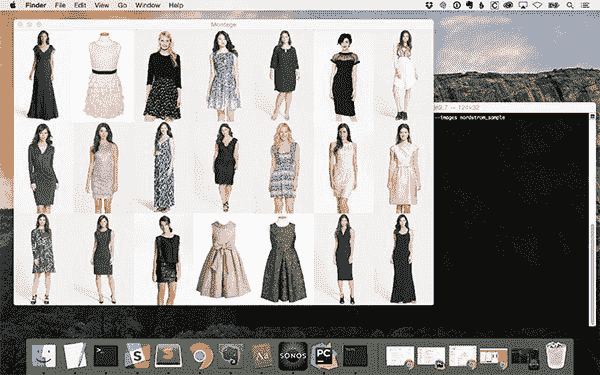
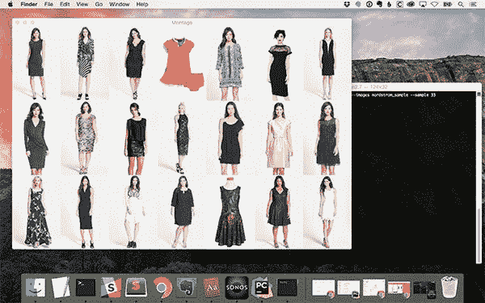
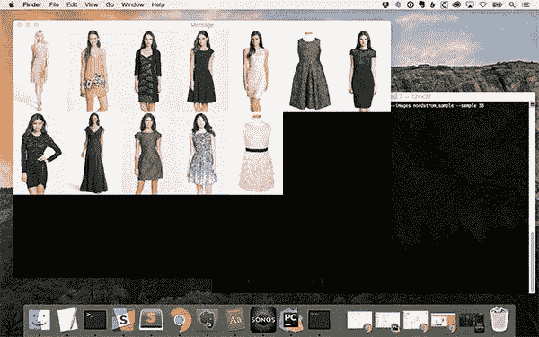

# 使用 OpenCV 的蒙太奇

> 原文：<https://pyimagesearch.com/2017/05/29/montages-with-opencv/>


今天这篇博文的灵感来自于我从 PyImageSearch 阅读器 Brian 那里收到的一封邮件。

布莱恩问道:

> 嗨阿德里安，
> 
> 我真的很喜欢 PyImageSearch 博客。几天前我发现了你的网站，从那以后我就迷上了你的教程。
> 
> 我按照你的教程[构建了一个图片搜索引擎](https://pyimagesearch.com/2014/12/01/complete-guide-building-image-search-engine-python-opencv/)，但是我不想一个接一个地显示结果图片(就像你做的那样)，我想以蒙太奇的方式显示前 20 个结果。
> 
> OpenCV 有办法吗？
> 
> 谢谢，
> 
> 布赖恩

问得好，布莱恩，谢谢你的提问。

运行 PyImageSearch 博客我最喜欢的一个方面是能够和你，读者聊天，发现你正在做的项目。

**特别令人兴奋的是*当我可以把问题或评论转化成博客帖子时——这样整个 PyImageSearch 社区都能从答案中受益。***

 *今天我们将学习如何使用 OpenCV 和 [imutils 包](https://github.com/jrosebr1/imutils)来构建图像蒙太奇。非常感谢[凯尔·豪恩斯洛](https://github.com/kylehounslow)为 imutils 贡献了`build_montages`功能。

**要了解更多关于用 OpenCV 构建图像蒙太奇的信息，*继续阅读*。**

## 使用 OpenCV 的蒙太奇

今天的博文有四个主要部分。

在第一部分中，我们将学习如何从驻留在磁盘上的图像数据集构建图像路径列表。

从那里，我们将使用`build_montages`函数来获取这个图像列表并创建实际的蒙太奇。

接下来，我们将在屏幕上显示蒙太奇。

最后，我将提供一个通过 OpenCV 使用蒙太奇显示图像的例子。

要下载这篇博文的源代码+示例图片，请务必使用下面的 ***“下载”*** 部分。

### 用 OpenCV 创建蒙太奇

首先，打开一个新文件，将其命名为`montage_example.py`，并插入以下代码:

```py
# import the necessary packages
from imutils import build_montages
from imutils import paths
import argparse
import random
import cv2

```

**第 2-6 行**导入我们需要的 Python 包。注意`build_montages`是如何从 [imutils 包](https://github.com/jrosebr1/imutils)中导入的。

如果您的系统上没有安装`imutils`(在撰写本文时， *v0.4.3* ，那么请确保您通过`pip`安装/升级它:

```py
$ pip install --upgrade imutils

```

***注意:**如果你正在使用 Python 虚拟环境(正如我所有的 [OpenCV 安装教程](https://pyimagesearch.com/opencv-tutorials-resources-guides/)所做的那样)，确保你首先使用`workon`命令访问你的虚拟环境，然后使用**安装/升级`imutils`。***

从那里，我们可以解析我们的命令行参数:

```py
# construct the argument parse and parse the arguments
ap = argparse.ArgumentParser()
ap.add_argument("-i", "--images", required=True,
	help="path to input directory of images")
ap.add_argument("-s", "--sample", type=int, default=21,
	help="# of images to sample")
args = vars(ap.parse_args())

```

我们的脚本需要一个命令行参数，后跟第二个可选参数，每个参数的详细信息如下:

*   `--images`:你的目录的路径，包含你想要建立一个蒙太奇的图像。
*   `--samples`:一个可选的命令行参数，指定要采样的图像数量(我们将该值默认为`21`总图像数)。

接下来，我们可以使用`--images`路径随机选择一些输入图像:

```py
# grab the paths to the images, then randomly select a sample of
# them
imagePaths = list(paths.list_images(args["images"]))
random.shuffle(imagePaths)
imagePaths = imagePaths[:args["sample"]]

```

为了获得`--images`目录中所有图像路径的列表，我们调用了`list_images`函数(**第 18 行**)。

出于这个练习的目的，我们随机打乱了**行 19** 上的图像路径，然后从这些图像中抽取一个*样本*显示到我们的屏幕上(**行 20** )。这次采样返回的一组`imagePaths`将用于构建我们的蒙太奇。

对于你自己的应用程序来说，你可能不需要去随机选择一组图像路径——你已经有了自己的图像路径。

在 Brian 最初问题的上下文中，他希望显示他的图像搜索引擎的结果。

因此，*结果*包含他的图像路径。

再次提醒，请记住我们只是在*演示*如何用 OpenCV 构建一个蒙太奇——你实际上*如何使用*这个例子是*完全由你*决定的。

给定我们的`imagePaths`，我们准备建立蒙太奇:

```py
# initialize the list of images
images = []

# loop over the list of image paths
for imagePath in imagePaths:
	# load the image and update the list of images
	image = cv2.imread(imagePath)
	images.append(image)

# construct the montages for the images
montages = build_montages(images, (128, 196), (7, 3))

```

在第 23 行的**上，我们初始化了我们的`images`列表。**

然后我们遍历第 26-29 行**上的`imagePaths`，从磁盘加载每个`image`，然后将`image`添加到我们的`images`列表中。**

为了实际构建蒙太奇，我们调用了第 32 行**上的`build_montages`函数——这是所有繁重工作完成的地方。如果你对`build_montages`方法的内部以及幕后发生的事情感到好奇，一定要查看 GitHub 上的源代码[实现。](https://github.com/jrosebr1/imutils/blob/master/imutils/convenience.py)**

`build_montages`函数需要三个参数:

*   `image_list`:该参数是通过 OpenCV 加载的图像列表。在我们的例子中，我们提供建立在**行 26-29** 上的`images`列表。
*   `image_shape`:包含蒙太奇中每个图像的*宽度*和*高度*的元组。这里我们指出蒙太奇中的所有图像将被调整到 *129 x 196* 。将蒙太奇中的每个图像调整到一个固定的大小是一个*需求*，这样我们可以在结果 NumPy 数组中适当地分配内存。 ***注意:**蒙太奇中的空白区域会用黑色像素填充。*
*   `montage_shape`:一个第二元组，这个元组指定蒙太奇中的行数和列数。这里我们指出我们的蒙太奇将有 7 列(7 幅图像宽)和 3 行(3 幅图像高)。

方法返回一个 NumPy 数组格式的蒙太奇图像列表。

如果`images`列表中的*多于`montage_shape`所能容纳的*图像，*会为多余的`images`创建一个新的蒙太奇。*重复这个过程，直到所有的`images`都被添加到一个剪辑画面中。**此过程等同于在多个页面上显示搜索结果。**

我们的最后一个代码块处理向屏幕显示`montages`:

```py
# loop over the montages and display each of them
for montage in montages:
	cv2.imshow("Montage", montage)
	cv2.waitKey(0)

```

在第 35 行的**上，我们循环遍历每一个`montages`(同样，类似于在一个页面上显示 *N* 个(假的)“搜索结果”)。**

**第 36 行和第 37 行**然后在我们的屏幕上显示当前的`montage`。`cv2.waitKey`调用暂停我们脚本的执行，直到我们选择当前活动的窗口并按下键盘上的任意键。这将导致`for`回路前进。

一旦我们到达`montages`列表的末尾，脚本就退出。

### 显示蒙太奇

大约两年前，我参与了一个计算机视觉项目，需要我建立一个简单的图像时尚搜索引擎。为了做到这一点，我构建了一个简单的网络爬虫来抓取[Nordstrom.com](http://shop.nordstrom.com/)并下载所有的产品图片和相关的元数据。

在演示`build_montages`函数时，我们今天将使用这个数据的一个小样本。

一旦您使用下面的 ***【下载】*** 部分下载了源代码+示例图像，您可以执行以下命令来查看结果:

```py
$ python montage_example.py --images nordstrom_sample

```

执行该脚本后，您应该会看到类似如下的输出:



**Figure 1:** Building a montage with OpenCV and Python.

***注:**你在蒙太奇中看到的*确切的*图像将与我的有所不同，因为我们是从输入目录中**随机抽样**。*

正如我们在上面的**图 1** 中看到的，我们有三行，每行包含七幅图像。蒙太奇中的每个图像都被调整为固定的 *128 x 196* 像素大小。

根据 Brian 在这篇博文顶部提出的问题，这个蒙太奇可能是他的图像搜索引擎算法的搜索结果。

作为第二个例子，让我们增加`--sample`，这样我们创建*多个蒙太奇*，因为所有的图像都不适合三行七列的格式:

```py
$ python montage_example.py --images nordstrom_sample --sample 33

```

因为 *3 x 7 = 21* ，我们知道采样 33 个图像不可能适合 21 个图像的蒙太奇。

幸运的是，`build_montages`功能意识到有太多的图像不适合一个*单一的*蒙太奇，因此创建了*两个蒙太奇。*

下面可以看到第一个蒙太奇，蒙太奇中的所有 21 个空间都被占用:



**Figure 2:** The first montage generated with OpenCV is completely filled.

第二个蒙太奇包含了第一个蒙太奇无法容纳的剩余 12 个图像:



**Figure 3:** The second montage displays images that could not fit in the first montage.

注意蒙太奇中的空白空间是如何被黑色像素填充的。

## 摘要

在今天的博文中，我演示了如何用 OpenCV 和 Python 构建一个蒙太奇来可视化一组图像。这是一个方便的工具，你可以在你自己的图像处理项目中使用，比如在这篇博文顶部详细介绍的 Brian 的图像搜索引擎项目中。

我还想花一点时间，对为 [imutils 包](https://github.com/jrosebr1/imutils)贡献了`build_montages`功能的[凯尔·豪恩斯洛](https://github.com/kylehounslow)大声欢呼——再次感谢凯尔！

在下周的博文中，我将展示如何在一个实际的应用程序中使用蒙太奇功能，在这个应用程序中，我们根据图像的“丰富多彩”程度对数据集中的图像进行排序。

**为了在下一篇博文发布时得到通知，*请务必在下表中输入您的电子邮件地址。****