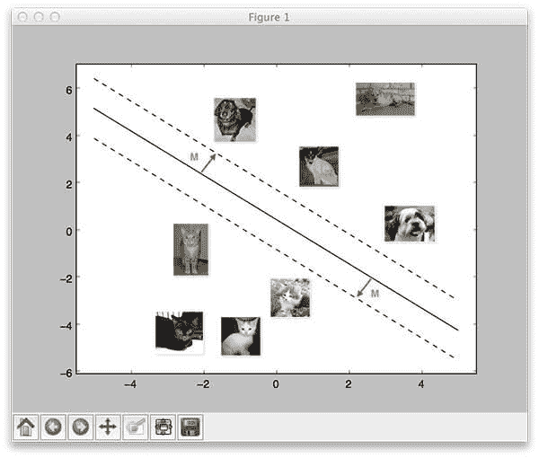
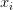
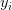
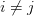
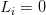
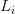
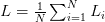
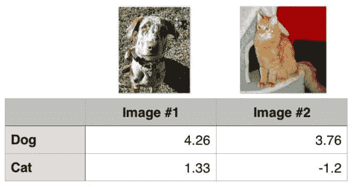
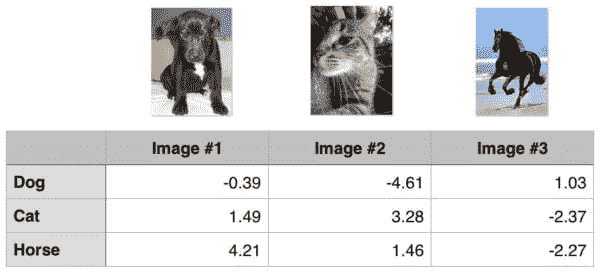

# 多级 SVM 损耗

> 原文：<https://pyimagesearch.com/2016/09/05/multi-class-svm-loss/>



几周前，我们讨论了 [*线性分类*和*参数化学习*](https://pyimagesearch.com/2016/08/22/an-intro-to-linear-classification-with-python/) 的概念。这种类型的学习允许我们获取一组输入数据和类标签，并实际学习一个函数，该函数通过简单地定义一组参数并对它们进行优化，将*输入映射到*输出预测。

我们的线性分类教程主要关注*评分函数*的概念，以及如何使用它将输入数据映射到类标签。但是为了实际“学习”从输入数据到类标签的映射，我们需要讨论两个重要的概念:

1.  损失函数
2.  优化方法

在今天和下周的博客文章中，我们将讨论两个*损失函数*，这是在应用机器学习、神经网络和深度学习算法时常见的:

1.  多级 SVM 损耗
2.  交叉熵(用于 Softmax 分类器/多项式逻辑回归)

要了解更多关于你的第一个损失函数，多级 SVM 损失，请继续阅读。

## 多级 SVM 损耗

在最基本的层面上，损失函数仅用于量化给定预测器在对数据集中的输入数据点进行分类时的好坏程度。

损失越小，我们的分类器在建模输入数据和输出类标签之间的关系时就越好(尽管有一点我们可以*过度拟合*我们的模型——当训练数据建模*太接近*并且我们的模型失去概括能力时就会发生这种情况)。

相反，我们的损失越大，*就需要做更多的工作*来提高分类精度。在参数化学习方面，这涉及到调整参数，如我们的权重矩阵 *W* 或偏置向量 *b* 以提高分类精度。确切地说*我们如何*着手更新这些参数是一个*优化问题*，我们将在这一系列教程的后面讨论这个问题。

### 多类 SVM 损失背后的数学

通读完[Python 线性分类教程](https://pyimagesearch.com/2016/08/22/an-intro-to-linear-classification-with-python/)后，你会注意到我们使用了[线性支持向量机(SVM)](https://en.wikipedia.org/wiki/Support_vector_machine) 作为我们的分类器选择。

之前的教程关注于评分函数的概念，它将我们的特征向量映射到类别标签，作为数字分数。顾名思义，线性 SVM 应用简单的线性映射:

 = Wx_{i} + b")

现在我们有了这个评分/映射函数 *f* ，我们需要确定这个函数在进行预测时有多“好”或“坏”(给定权重矩阵 *W* 和偏差向量 *b* )。

为此，我们需要一个损失函数***。***我们现在就开始定义吧。

基于我们的[之前的线性分类教程](https://pyimagesearch.com/2016/08/22/an-intro-to-linear-classification-with-python/)，我们知道我们有一个特征向量矩阵*x*——这些特征向量可以是提取的颜色直方图、定向梯度特征的直方图，甚至是原始像素强度。

不管我们选择如何量化我们的图像，关键是我们有一个从图像数据集中提取的特征矩阵 *x* 。然后我们可以通过语法访问与给定图像相关的特征

, which will yield the *i*-th feature vector inside *x*.

类似地，我们也有一个向量 *y* ，它包含每个 *x* 的*类标签*。这些 *y* 值是我们的*基本事实标签*，也是我们希望我们的评分函数能够正确预测的。就像我们可以通过访问给定的特征向量一样

, we can access the *i*-th class label via .

为了简单起见，让我们将我们的评分函数缩写为 *s* :

")

这意味着我们可以通过第 *i* 个数据点得到第 *j* 级的预测分数:

_{j}")

.

使用这种语法，我们可以把所有这些放在一起，得到 ***铰链损失函数:***

")

***注意:**我现在特意跳过正则化参数。一旦我们更好地理解损失函数，我们将在以后的文章中回到正则化。*

那么上面的等式到底在做什么呢？

很高兴你问了。

本质上，铰链损失函数是对所有*不正确类别* ( )求和

) and comparing the output of our scoring function *s* returned for the *j*-th class label (the incorrect class) and the -th class (the correct class).

我们应用 *max* 运算将值箝位到*0*——这样做很重要，这样我们就不会最终累加负值。

给定的

is classified correctly when the loss (I’ll provide a numerical example of this in the following section).

为了得到整个训练集 的损失，我们简单地取每个个体的平均值

: 

你可能遇到的另一个相关的常见损耗函数是 ***平方铰链损耗:***

^{2}")

平方项通过对输出求平方来更严重地惩罚我们的损失。这导致了损失的二次增长，而不是线性增长。

至于您应该使用哪个损失函数，这完全取决于您的数据集。通常会看到标准铰链损失函数被更频繁地使用，但在一些数据集上，方差平方可能会获得更好的精度— **总的来说，这是一个[超参数，您应该交叉验证](https://pyimagesearch.com/2016/08/15/how-to-tune-hyperparameters-with-python-and-scikit-learn/)。**

### 一个多类 SVM 损失的例子

现在，我们已经了解了铰链损耗和平方铰链损耗背后的数学原理，让我们来看一个实际例子。

我们将再次假设我们正在使用 [Kaggle Dogs vs. Cats 数据集](https://www.kaggle.com/c/dogs-vs-cats/data)，顾名思义，该数据集旨在对给定图像是否包含*狗*或*猫*进行分类。

该数据集中只有两个可能的类标签，因此这是一个 2 类问题，可以使用标准的二进制 SVM 损失函数来解决。也就是说，让我们仍然应用多类 SVM 损失，这样我们就可以有一个如何应用它的工作示例。从这里开始，我将扩展这个例子来处理一个 3 类问题。

首先，请看下图，其中我包含了来自狗与猫数据集的两个类的两个训练示例:



**Figure 1:** Let’s apply hinge loss to the images in this figure.

给定一些(任意的)权重矩阵 *W* 和偏差向量 *b* ，输出得分 = Wx + b")

are displayed in the body of the matrix. The *larger* the scores are, the more *confident* our scoring function is regarding the prediction.

让我们从计算损失开始

for the “dog” class. Given a two class problem, this is trivially easy:

```py
>>> max(0, 1.33 - 4.26 + 1)
0
>>>

```

注意“dog”的损失如何为*零*——这意味着 dog 类被正确预测。对上面的**图 1** 的快速调查证明了这一点:“狗”的得分大于“猫”的得分。

同样，我们可以对第二张图片做同样的操作，这张图片包含一只猫:

```py
>>> max(0, 3.76 - (-1.2) + 1)
5.96
>>>

```

在这种情况下，我们的损失函数大于零，说明我们的预测不正确。

然后，我们通过取平均值获得两幅示例图像的总损失:

```py
>>> (0 + 5.96) / 2
2.98
>>

```

这对于 2 类问题来说很简单，但是对于 3 类问题呢？过程是否变得更加复杂？

事实上，并没有——我们的求和只是扩大了一点。你可以在下面找到一个 3 类问题的例子，我添加了第三个类“马”:



**Figure 2:** An example of applying hinge loss to a 3-class image classification problem.

让我们再次计算狗类的损失:

```py
>>> max(0, 1.49 - (-0.39) + 1) + max(0, 4.21 - (-0.39) + 1)
8.48
>>>

```

请注意，我们的求和已经扩展到包括两项——预测的狗分数和*猫和马分数之差。*

 *同样，我们可以计算 cat 类的损失:

```py
>>> max(0, -4.61 - 3.28 + 1) + max(0, 1.46 - 3.28 + 1)
0
>>>

```

最后是马类的损失:

```py
>>> max(0, 1.03 - (-2.27) + 1) + max(0, -2.37 - (-2.27) + 1)
5.199999999999999
>>>

```

因此，总损失为:

```py
>>> (8.48 + 0.0 + 5.2) / 3
4.56
>>>

```

如你所见，同样的一般原则也适用——只要记住，随着类别数量的增加，你的总和也会增加。

***小测验:**根据上面三个等级的*损失*，哪一个被正确分类？*

### 我需要手动实现多级 SVM 损耗吗？

如果你愿意，你可以手工实现铰链损耗和平方铰链损耗——但这主要是为了教学目的。

你会看到几乎任何机器学习/深度学习库中都实现了铰链损耗和平方铰链损耗，包括 scikit-learn、Keras、Caffe 等。

## 摘要

今天我讨论了多级 SVM 损失的概念。给定一个*评分函数*(将输入数据映射到输出类别标签)，我们的*损失函数*可用于量化我们的评分函数在预测数据集中的正确类别标签方面有多“好”或“差”。

损失越小，我们的预测就越准确(但我们也有“过度拟合”的风险，即我们对输入数据到类别标签的映射建模*过于紧密*)。

相反，损失越大，我们的预测就越不准确，因此我们需要进一步优化我们的 *W* 和 *b* 参数——但是一旦我们更好地理解损失函数，我们将把优化方法留给未来的帖子。

在理解了“损失”的概念以及它如何应用于机器学习和深度学习算法之后，我们接着看两个特定的损失函数:

1.  铰链损耗
2.  平方铰链损耗

一般来说，你会更经常地看到铰链损失——但仍然值得尝试[调整分类器的超参数](https://pyimagesearch.com/2016/08/15/how-to-tune-hyperparameters-with-python-and-scikit-learn/),以确定哪个损失函数在特定数据集上提供更好的准确性。

下周我将回来讨论第二个损失函数——交叉熵——以及它与多项式逻辑回归的关系。如果你以前有过机器学习或深度学习的经验，你可能会更好地了解这个函数作为 ***Softmax 分类器。***

如果你对应用深度学习和卷积神经网络感兴趣，那么你不会想错过这个即将到来的帖子——你会发现，**soft max 分类器是深度学习中最常用的模型/损失函数。**

要在下一篇博文发表时得到通知，只需在下面的表格中输入您的电子邮件地址。下周见！*