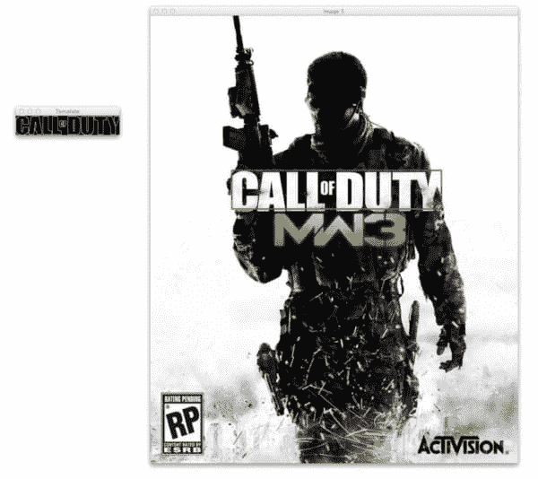

# 基于 Python 和 OpenCV 的多尺度模板匹配

> 原文：<https://pyimagesearch.com/2015/01/26/multi-scale-template-matching-using-python-opencv/>

过去的这个周末，我患了流感，病得很重。除了躺在我的沙发上，从咖啡杯里啜饮鸡肉面条汤，以及玩《使命召唤》的马拉松游戏之外，我什么也没做。

老实说，自从我花了一个周末坚持不懈地玩《使命召唤》以来，已经有*年*了。上网玩无休止的死亡之战和统治之战让我想起了大学室友和我在大学期间通宵玩游戏的美好回忆。

<https://www.youtube.com/embed/MfdKh0HEOBs?feature=oembed>