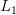
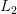
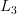

# 使用 PyTorch 的多任务学习和消防栓

> 原文：<https://pyimagesearch.com/2022/08/17/multi-task-learning-and-hydranets-with-pytorch/>

* * *

## **目录**

* * *

## [**【多任务学习与绣球与 PyTorch**](#TOC)

今天，我们将学习多任务学习和**消防栓**。这是一种深度学习技术，我在 2020 年中期向 653 人发送的电子邮件中首次介绍了这种技术。

**对这封邮件的回应非常热烈**(来自世界各地的工程师告诉我，他们很喜欢它，并希望将其应用到他们的公司)**我不得不在我的课程目录中创建一个完整的 HydraNet 部分**。你可以通过访问[https://www.thinkautonomous.ai/](https://www.thinkautonomous.ai/)

了解更多信息不仅这项技术**是深度学习领域的新**和**令人兴奋**，而且它也是许多计算机视觉工程师能够**接触到的**。我怀疑，在未来几年，它甚至可能成为深度学习课程中的必修课。

今天，我们要学习多任务学习的基本原理，为了开始这篇文章，下面是我第一次了解它的故事:

几年前我研究了特斯拉的自动驾驶仪，以写一篇文章。通过他们的会议、文章以及在 LinkedIn 上关注工程师，我学到了很多东西。但在某些时候，我偶然发现了一个词:

"**消防栓**"

绣球网？有意思，这是什么？

我做了一些调查，了解到特斯拉没有使用 10 或 20 个型号。尽管有 20 多个任务要解决，**他们只用了一个**(至少，这是背后的主要思想)。

他们有一个模型可以解决他们正在处理的所有可能的任务，例如:

*   目标检测
*   道路曲线估计
*   深度估计
*   三维重建
*   视频分析
*   目标跟踪
*   等等…

在我们开始“如何做”之前，我想让你看看消防栓能做什么。

这是在 NVIDIA GPU 上以 3 种不同配置运行的 2 个计算机视觉模型的基准测试。

*   在第一个配置中，我们正在运行一个**语义分割模型**。
*   在第二种配置上，我们将 ***叠加*** 一个**单目深度估计**模型。
*   在第三种配置中，我们正在**建造一个能够同时完成这两项任务的消防栓**。

现在，看看结果(见**表 1** ):

**语义分割在第一列中以 29 FPS** 运行，并使用 70%的 GPU**。但是一旦**我们添加深度估计，GPU 就变得满满的**。**

 **这发生在几年前，当时我正在研究自主航天飞机。我训练了一个 YOLOv3 模型来检测障碍物，需要增加更多的任务，比如车道线估计。

突然我的 GPU 就满了，车也跑不动了。

因此，在第三列中，您会注意到***HydraNet 节省了 GPU 的使用，同时保持了相对较高的 FPS***。

因为这不是平行进行的:

我们正在这样做:

这是特斯拉使用的同一种架构；正如你注意到的，它很强大。

一个身体，几个脑袋。

这就是特斯拉正在做的事情，我提到的那篇文章可以在[这里](https://www.thinkautonomous.ai/blog/how-tesla-autopilot-works/)找到。

在本课中，我们将看到一个多任务学习项目的简单版本:

* * *

## [**解决一个多任务学习项目**](#TOC)

现在你已经熟悉了消防栓，我们将有一个简短的教程来教你如何使用 PyTorch 的消防栓。

为此，我们将使用 UTK 人脸数据集。这是一个分类数据集，其中每个图像有 3 个标签:

*   **性别**(男性或女性)
*   **种族**(白人、黑人、亚洲人、印度人、其他)
*   **年龄**(连续数字)

因此，我们的消防栓将有 3 个头，每个头负责一项任务。有趣的是，这些不会是相同的头:**预测年龄是一个回归任务**，但**预测性别是一个二元分类任务**和**预测种族是一个多类分类任务**。

这意味着将有几个损失函数需要处理。

使用 PyTorch，我们将创建这个确切的项目。为此，我们将:

1.  用 PyTorch 创建一个多任务数据加载
2.  创建一个多任务网络
3.  训练**模型并运行结果**

使用 PyTorch，我们总是从一个数据集开始，我们将它封装在一个 PyTorch 数据加载器中并提供给一个模型。

数据加载器是我们的第一步。

* * *

### [**用 PyTorch** 创建多任务数据加载器](#TOC)

在本教程中，我将假设你熟悉 [PyTorch](https://pyimagesearch.com/?s=pytorch) 。你对数据集和数据加载器了如指掌，看到`__dunders__`不会吓到你。

想法是这样的:我们的数据将被提供给一个转换成 PyTorch 数据加载器的 dataset 类。

在图像上:

1.  我们收集数据，就像任何深度学习项目一样
2.  我们将这些数据发送到一个自定义数据集类，并创建一个训练和测试数据集
3.  我们将这两个数据集封装到两个 PyTorch 数据加载器中
4.  训练时，我们使用这些数据加载器

* * *

#### [**数据**](#TOC)

首先是数据。

数据集是一组图像，图像的名称给出了标签。比如图像**UTKFace/****100****_****0**__**0****_ 20170112213500903 . jpg . chip . jpg**可以解释如下:

*   **UTKFace/** 是前缀
*   **100** **是年龄**
*   **0** **是性别** (0:男，1:女)
*   **0** **是种族** (0:白人，1:黑人，2:亚洲人，3:印度人，4:其他)
*   剩下的就是日期和扩展名(jpg)

* * *

#### [**数据集**](#TOC)

**数据集类必须实现 3 个函数:**

*   `def __init__(self)`:定义数据集元素的函数(如输入和标签)
*   `def __len__(self)`:返回元素个数的函数
*   `def __getitem__(self)`:从数据集中返回一个项目的函数

现在，这里是每个功能是如何实现的。

* * *

##### [**INIT**](#TOC)

```py
 def __init__(self, image_paths):
        # Define the Transforms
        self.transform = transforms.Compose([transforms.Resize((32, 32)), transforms.ToTensor(), transforms.Normalize([0.485, 0.456, 0.406], [0.229, 0.224, 0.225])])

        # Set Inputs and Labels
        self.image_paths = image_paths
        self.images = []
        self.ages = []
        self.genders = []
        self.races = []

        for path in image_paths:
            filename = path[8:].split("_")
            if len(filename)==4:
                self.images.append(path)
                self.ages.append(int(filename[0]))
                self.genders.append(int(filename[1]))
                self.races.append(int(filename[2]))
```

在`init`函数中，我们定义了变换(数据扩充、转换为张量等。)运营。

然后，我们检查图像路径并获取元素(例如，`100`、`0`和`0`)，并将它们添加到标签列表中。

一旦我们调用了`__init__`函数，我们应该有 4 个列表定义(图片、种族、性别、年龄)。

* * *

##### [**LEN**](#TOC)

这个函数只返回图像的数量。

```py
def __len__(self):
         return len(self.images)
```

如果不使用它，就不能对每个数据集图像运行训练循环。您需要`len`函数，因为`len()`不支持定制类；它可以处理列表、数组等。，但不是自定义元素。所以你需要重新定义它。

* * *

##### [**获取 _ 物品**](#TOC)

这个函数将完成您在`__init__`中定义的所有工作(例如，加载一个图像，调用转换，并获得标签)。此外，**这个函数的目的是返回给定索引的数据集的特定元素。**

```py
def __getitem__(self, index):
        # Load an Image
        img = Image.open(self.images[index]).convert('RGB')
        # Transform it
        img = self.transform(img)

        # Get the Labels
        age = self.ages[index]
        gender = self.genders[index]
        race = self.races[index]

        # Return the sample of the dataset
        sample = {'image':img, 'age': age, 'gender': gender, 'race':race}
        return sample
```

***注意:*** *在这个例子中，我们把它作为一个字典返回，但是你也可以返回 4 个元素(毕竟这是 Python！)*

* * *

#### [**数据加载器**](#TOC)

最后，我们可以通过调用以下函数获得一个数据加载器:

```py
train_dataloader = DataLoader(UTKFace(train_dataset), shuffle=True, batch_size=BATCH_SIZE)
val_dataloader = DataLoader(UTKFace(valid_dataset), shuffle=False, batch_size=BATCH_SIZE)
```

* * *

### [**模型定义**](#TOC)

一旦我们有了数据加载器，**我们就可以用 PyTorch** 定义和训练我们的模型。

我们可以从零开始，但是如果你上过一些深度学习课程，你就会知道**我们通常更喜欢使用迁移学习**。这就是为什么我们将从一个预训练的模型开始，我们将转换它，使它符合我们的问题。

我们将使用的主干可以是任何东西(例如，ResNet、MobileNet、Inception 等。).

***重要的是网络的尽头！*** 我们想改变预训练模型的最后一层，就像迁移学习一样，使它适应我们的问题。

在这种情况下，有两种处理方式:

1.  *由于我们的情况非常简单，我们可以改变最后一层并添加 7 个神经元:* **1 个用于性别**(二进制分类需要一个神经元)，5 个用于种族(对于 5 个类)，1 个用于年龄(一个回归需要一个神经元)
2.  或者，我们可以制作头部，每个头部有几层。

在第一种情况下，我们会有这样简单的东西:

```py
self.net = models.resnet18(pretrained=True)
self.net.fc = nn.Linear(model.fc.in_features, 7)
```

*   在**线 1** ，我们从 PyTorch 下载`resnet18`模型。
*   在**的第二行**，注意我们使用了`model.fc`。我们下载的预训练 ResNet 的最后一层称为“FC ”,表示完全连接。我们通过改变神经元的数量来修改这一层。如果你有一个不同的模型，`fc`可以被命名为别的什么。

在第二种情况下，我们制作头部。为此，我们在现有 FC 层之上构建了一系列层。

我们将定义:

*   `fc1`:作为年龄的全连接层
*   对两性来说
*   为了比赛

下面是代码版本:

```py
class HydraNet(nn.Module):
    def __init__(self):
        super().__init__()
        self.net = models.resnet18(pretrained=True)
        self.n_features = self.net.fc.in_features
        self.net.fc = nn.Identity()
        self.net.fc1 = nn.Sequential(OrderedDict([('linear', nn.Linear(self.n_features,self.n_features)),('relu1', nn.ReLU()),('final', nn.Linear(self.n_features, 1))]))
        self.net.fc2 = nn.Sequential(OrderedDict([('linear', nn.Linear(self.n_features,self.n_features)),('relu1', nn.ReLU()),('final', nn.Linear(self.n_features, 1))]))
        self.net.fc3 = nn.Sequential(OrderedDict([('linear', nn.Linear(self.n_features,self.n_features)),('relu1', nn.ReLU()),('final', nn.Linear(self.n_features, 5))]))

    def forward(self, x):
        age_head = self.net.fc1(self.net(x))
        gender_head = self.net.fc2(self.net(x))
        race_head = self.net.fc3(self.net(x))
        return age_head, gender_head, race_head
```

在`init()`函数中，我们定义了序列模型，它是层的序列。

*如果我们只考虑年龄:*

```py
       self.net.fc1 = nn.Sequential(OrderedDict([('linear', nn.Linear(self.n_features,self.n_features)),('relu1', nn.ReLU()),('final', nn.Linear(self.n_features, 1))]))
```

我们用一个大小为`(n_features, n_features)`的线性层创建一个字典(我们没有必要这样做，但这是命名层的好习惯)，然后是一个 ReLU 激活和另一个大小为`(n_features, 1)`的线性层。

*那么，在网络中:*

```py
       age_head = self.net.fc1(self.net(x))
```

我们的输入通过模型，然后通过`fc1`。

然后，我们对另外两个头重复这一过程。同样，forward 函数返回 3 个头，但这一次，它也可以返回一个由 3 组成的字典(就像 dataset 类一样)。

接下来，我们需要定义损失函数并训练我们的模型。

* * *

#### [**训练:*损失功能***](#TOC)

我们将从损失函数开始。在多任务学习中，你仍然有一个损失。不同的是，这个损失结合了你所有的其他损失。

我们可以有一些简单的东西:

*   :****年龄损失**，是一种**回归损失**。例如，均方误差或负对数似然。**
*   **:****种族损失**，是一种**多等级分类损失**。在我们的例子中，它是交叉熵！****
*   ****:****性别损失**，是二进制分类损失**。在我们的例子中，二元交叉熵。********

 ******每种损失都有其独特之处。在性别的情况下，我们希望在最后一层应用 sigmoid 激活；但是在比赛的情况下，我们想要应用一个 softmax。

现在，这里是它可能会失败的地方:

考虑到我们必须预测一个时代。如果我们的预测是 50，但实际年龄是 30，我们就损失了 20。如果我们使用均方差，我们的损失就变成了(20 = 400)。

如果我们加上性别的分类损失，它将是一个介于 0 和 1 之间的数字。

如果我们把两者相加，我们最终会发现损失只受年龄误差的影响；我们的损失不在同一个规模上。

一种简单的方法是在损失前增加系数，并使总损失具有平衡值:

更好的方法是将我们的年龄损失从均方误差改为

Loss:

20 的误差将保持在 20，我们可以把它带回正常范围。

最后是训练循环。

* * *

#### [**训练循环**](#TOC)

我们现在准备用 PyTorch 训练我们的模型！

代码将是最少的“使它工作”，只是为了培训。

```py
net = resnet34(pretrained=True)
model = HydraNet(net).to(device=device)

race_loss = nn.CrossEntropyLoss() # Includes Softmax
gender_loss = nn.BCELoss() # Doesn't include Softmax
age_loss = nn.L1Loss()

optimizer = torch.optim.SGD(model.parameters(), lr=1e-4, momentum=0.09)

Sig = nn.Sigmoid()
```

所有这些都是我们工作的前奏。我们定义一个模型，然后:

*   竞争损失是交叉熵损失
*   性别损失是二元交叉熵损失
*   年龄损失是损失

需要注意的是，对于二进制分类，我们将使用不包括 softmax 的二进制交叉熵。相反，我们将使用更适合这种特殊情况的**s 形**。

*最后，循环:*

```py
for epoch in range(n_epochs):
   model.train()
   total_training_loss = 0

    for i, data in enumerate(train_dataloader):
        inputs = data["image"].to(device=device)

        age_label = data["age"].to(device=device)
        gender_label = data["gender"].to(device=device)
        race_label = data["race"].to(device=device)

        optimizer.zero_grad()

        age_output, gender_output, race_output = model(inputs)
        loss_1 = race_loss(race_output, race_label)
        loss_2 = gender_loss(sig(gender_output), gender_label.unsqueeze(1).float())
        loss_3 = age_loss(age_output, age_label.unsqueeze(1).float())
        loss = loss_1 + loss_2 + loss_3
        loss.backward()
        optimizer.step()
        total_training_loss += loss
```

验证也是如此。

该模型将训练多个时期，并且损失将被优化。

一旦模型被训练，我们就可以用它来进行推理，并预测我们对任何输入人脸的 3 个值！

* * *

* * *

## [**结论**](#TOC)

多任务学习是深度学习中最有前途的技术之一。许多研究人员认为这是人工智能的未来。

它解决了一个重要的速度和内存问题(堆叠 20 个模型对您的 RAM 和 GPU 没有好处)，并且在训练几个任务时有大量的好处。例如，在计算机视觉领域，研究人员指出，共同训练特定任务比不训练它们更有优势。就像学打网球一样，让你非常擅长乒乓球！

如果你想应用这些概念，我推荐 [PyImageSearch 大学](https://pyimagesearch.com/pyimagesearch-university/?utm_medium=BP&utm_campaign=HydraNets-2022-08-17)，里面有计算机视觉的 HydraNets 课程。

事实上，我们比这走得更远，并将其应用于自动驾驶汽车的语义分割和深度估计。

**这是你将要做的事情的预览:**

报名: **[PyImageSearch 大学](https://pyimagesearch.com/pyimagesearch-university/?utm_medium=BP&utm_campaign=HydraNets-2022-08-17)**

这篇文章是由 Think Autonomous 的 Jérémy Cohen 撰写的。杰瑞米一直在通过他的日常电子邮件和在线课程，教数千名工程师如何在自动驾驶汽车或高级计算机视觉等前沿领域工作。你可以订阅杰瑞米的邮件，并在 https://www.thinkautonomous.ai/py 的[阅读。](https://www.thinkautonomous.ai/py?utm_source=pyimagesearch&utm_medium=blog&utm_campaign=multi_task_learning)

* * *

### [**引用信息**](#TOC)

**科恩，J.** “使用 PyTorch 的多任务学习和消防栓”， *PyImageSearch* ，P. Chugh，A. R. Gosthipaty，S. Huot 和 R. Raha 编辑。，2022 年，【https://pyimg.co/hdkl7 

```py
@incollection{Cohen_2022_HydraNets,
  author = {Jeremy Cohen},
  title = {Multi-Task Learning and HydraNets with PyTorch},
  booktitle = {PyImageSearch},
  editor = {Puneet Chugh and Aritra Roy Gosthipaty and Susan Huot and Ritwik Raha},  year = {2022},
  note = {https://pyimg.co/hdkl7},
}
```

* * *********