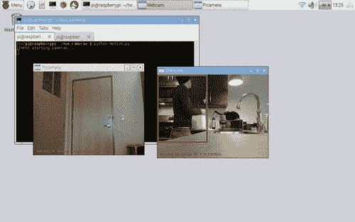
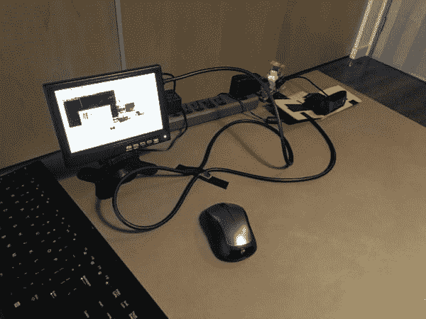
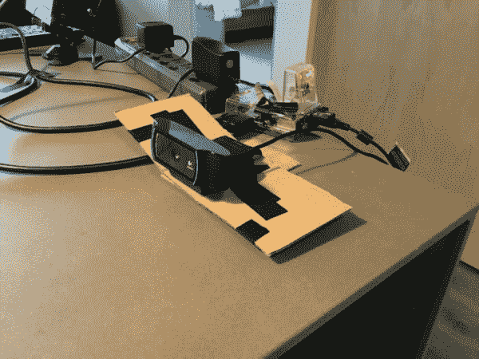
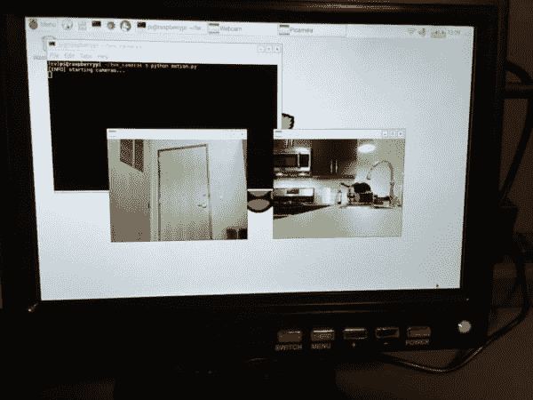

# 使用 Raspberry Pi 和 OpenCV 的多个摄像头

> 原文：<https://pyimagesearch.com/2016/01/18/multiple-cameras-with-the-raspberry-pi-and-opencv/>

[](https://pyimagesearch.com/wp-content/uploads/2016/01/multiple_cameras_animated.gif)

我将保持今天帖子的简介简短，因为我认为这个帖子的标题和上面的 GIF 动画说明了一切。

在这篇文章中，我将演示如何将*多个摄像机*连接到你的树莓 Pi……***上，并使用一个 Python 脚本访问所有这些摄像机。***

无论您的设置是否包括:

*   多个 USB 网络摄像头。
*   或者 Raspberry Pi 摄像头模块+额外的 USB 摄像头…

…这篇文章中详细介绍的代码将允许您访问*您的所有*视频流— ***，并对每个视频流执行运动检测！***

最重要的是，我们使用 Raspberry Pi 和 OpenCV 实现的多摄像头访问能够在**实时**运行(或接近实时，取决于您连接的摄像头数量)，非常适合创建您自己的多摄像头家庭监控系统。

继续阅读，了解更多。

## 使用 Raspberry Pi 和 OpenCV 的多个摄像头

当构建 Raspberry Pi 设置以利用多个摄像机时，您有两种选择:

*   只需使用*多个* USB 网络摄像头。
*   或者使用*一个* Raspberry Pi 摄像头模块和*至少一个* USB 网络摄像头。

Raspberry Pi 板只有*一个摄像头端口*，所以你将无法使用*多个* Raspberry Pi 摄像头板(除非你想对你的 Pi 进行一些大范围的黑客攻击)。所以为了给你的 Pi 连接多个摄像头，你需要利用*至少一个*(如果不是更多的话)USB 摄像头。

也就是说，为了构建我自己的多摄像头 Raspberry Pi 设置，我最终使用了:

1.  [树莓 Pi 摄像头模块](http://www.amazon.com/gp/product/B00E1GGE40/ref=as_li_tl?ie=UTF8&camp=1789&creative=390957&creativeASIN=B00E1GGE40&linkCode=as2&tag=trndingcom-20&linkId=XF5KMO3TGBUENU5T) + [摄像头外壳](http://www.amazon.com/gp/product/B00IJZJKK4/ref=as_li_tl?ie=UTF8&camp=1789&creative=390957&creativeASIN=B00IJZJKK4&linkCode=as2&tag=trndingcom-20&linkId=PMQZXV7K7MWCPAZ3)(可选)。我们可以使用`picamera` Python 包或者(最好)在[之前的博客文章](https://pyimagesearch.com/2016/01/04/unifying-picamera-and-cv2-videocapture-into-a-single-class-with-opencv/)中定义的线程化`VideoStream`类与相机交互。
2.  一个[罗技 C920](http://www.amazon.com/gp/product/B006JH8T3S/ref=as_li_tl?ie=UTF8&camp=1789&creative=390957&creativeASIN=B006JH8T3S&linkCode=as2&tag=trndingcom-20&linkId=BWJJLCCXZCBM465P) 网络摄像头，即插即用，兼容树莓派。我们可以使用 OpenCV 内置的`cv2.VideoCapture`函数或者本课中的`VideoStream`类[来访问这个相机。](https://pyimagesearch.com/2016/01/04/unifying-picamera-and-cv2-videocapture-into-a-single-class-with-opencv/)

您可以在下面看到我的设置示例:

[](https://pyimagesearch.com/wp-content/uploads/2016/01/multiple_cameras_rpi_setup_03.jpg)

**Figure 1:** My multiple camera Raspberry Pi setup.

在这里，我们可以看到我的树莓 Pi 2，以及树莓 Pi 相机模块(位于 Pi 2 的顶部)和我的罗技 C920 网络摄像头。

Raspberry Pi 摄像头模块指向我的公寓大门，以监控任何进出的人，而 USB 网络摄像头指向厨房，观察任何可能正在进行的活动:

[](https://pyimagesearch.com/wp-content/uploads/2016/01/multiple_cameras_rpi_setup_04.jpg)

**Figure 2:** The Raspberry Pi camera module and USB camera are both hooked up to my Raspberry Pi, but are monitoring different areas of the room.

忽略 USB 摄像头上的绝缘胶带和纸板——这是之前的一个实验，应该(希望)很快会在 PyImageSearch 博客上发表。

最后，您可以在下图中看到向我的 Raspberry Pi 显示的两个视频源的示例:

[](https://pyimagesearch.com/wp-content/uploads/2016/01/multiple_cameras_rpi_start.jpg)

**Figure 3:** An example screenshot of monitoring both video feeds from the *multiple camera* Raspberry Pi setup.

在这篇博文的剩余部分，我们将定义一个简单的运动检测类，它可以检测一个人/物体是否在给定摄像机的视野内移动。然后，我们将编写一个 Python 驱动程序脚本，实例化我们的两个视频流，并在两个视频流中执行运动检测。

正如我们将看到的，通过使用线程化的视频流捕获类(其中每个摄像机一个线程专用于执行 I/O 操作，允许主程序线程继续畅通无阻)，我们可以轻松地让我们的运动检测器在树莓 Pi 2 上为多个摄像机运行**实时**。

让我们从定义简单的运动检测器类开始。

### 定义我们的简单运动检测器

在本节中，我们将构建一个简单的 Python 类，该类可用于检测给定摄像机视野中的运动。

为了提高效率，这个类将假设一次只有*个*对象在摄像机视图中移动——在未来的博客文章中，我们将研究更高级的运动检测和背景减除方法来跟踪多个对象。

事实上，我们在上一课[中已经(部分)回顾了这种运动检测方法，使用 Raspberry Pi、Python、OpenCV 和 Dropbox](https://pyimagesearch.com/2015/06/01/home-surveillance-and-motion-detection-with-the-raspberry-pi-python-and-opencv/) 进行家庭监控和运动检测，我们现在将这种实现正式化为一个可重用的类，而不仅仅是内联代码。

让我们从打开一个新文件开始，将其命名为`basicmotiondetector.py`，并添加以下代码:

```py
# import the necessary packages
import imutils
import cv2

class BasicMotionDetector:
	def __init__(self, accumWeight=0.5, deltaThresh=5, minArea=5000):
		# determine the OpenCV version, followed by storing the
		# the frame accumulation weight, the fixed threshold for
		# the delta image, and finally the minimum area required
		# for "motion" to be reported
		self.isv2 = imutils.is_cv2()
		self.accumWeight = accumWeight
		self.deltaThresh = deltaThresh
		self.minArea = minArea

		# initialize the average image for motion detection
		self.avg = None

```

**第 6 行**定义了我们的`BasicMotionDetector`类的构造函数。构造函数接受三个可选的关键字参数，包括:

*   `accumWeight`:当前帧与前一组帧*进行加权平均所用的浮点值。更大的`accumWeight`将导致背景模型具有更少的“记忆”,并且很快“忘记”先前帧的样子。如果你不希望在短时间内有大量的运动，使用高值的`accumWeight`是很有用的。相反，`accumWeight`的值越小，背景模型的权重就越大，这样就可以在前景中检测到更大的变化。在这个例子中，我们将使用默认值`0.5`,请记住，这是一个您应该考虑使用的可调参数。*
**   `deltaThresh`:在计算当前帧和背景模型之间的差异后，我们需要应用阈值来找到帧中包含运动的区域——这个`deltaThresh`值用于阈值。较小的`deltaThresh`值将检测到*更多的*运动，而较大的值将检测到*较少的*运动。*   应用阈值处理后，我们将得到一个二进制图像，从中提取轮廓。为了处理噪声并忽略小的运动区域，我们可以使用`minArea`参数。任何带有`> minArea`的区域都被标注为“运动”；否则，它将被忽略。*

 *最后，**第 17 行**初始化`avg`，这仅仅是`BasicMotionDetector`已经看到的先前帧的运行加权平均。

让我们继续我们的`update`方法:

```py
	def update(self, image):
		# initialize the list of locations containing motion
		locs = []

		# if the average image is None, initialize it
		if self.avg is None:
			self.avg = image.astype("float")
			return locs

		# otherwise, accumulate the weighted average between
		# the current frame and the previous frames, then compute
		# the pixel-wise differences between the current frame
		# and running average
		cv2.accumulateWeighted(image, self.avg, self.accumWeight)
		frameDelta = cv2.absdiff(image, cv2.convertScaleAbs(self.avg)

```

`update`函数只需要一个参数——我们想要检测运动的图像。

**第 21 行**初始化`locs`，对应图像中运动位置的轮廓列表。然而，如果`avg`没有被初始化(**第 24-26 行**)，我们将`avg`设置为当前帧并从该方法返回。

否则，`avg`已经被初始化，所以我们使用提供给构造器的`accumWeight`值(**第 32 行**)来累加先前帧和当前帧之间的移动加权平均值。取当前帧和移动平均值之间的绝对值差，得到图像中包含运动的区域——我们称之为我们的*增量图像*。

然而，为了实际上*检测我们的 delta 图像中包含运动的*区域，我们首先需要应用阈值和轮廓检测:

```py
		# threshold the delta image and apply a series of dilations
		# to help fill in holes
		thresh = cv2.threshold(frameDelta, self.deltaThresh, 255,
			cv2.THRESH_BINARY)[1]
		thresh = cv2.dilate(thresh, None, iterations=2)

		# find contours in the thresholded image, taking care to
		# use the appropriate version of OpenCV
		cnts = cv2.findContours(thresh, cv2.RETR_EXTERNAL,
			cv2.CHAIN_APPROX_SIMPLE)
		cnts = imutils.grab_contours(cnts)

		# loop over the contours
		for c in cnts:
			# only add the contour to the locations list if it
			# exceeds the minimum area
			if cv2.contourArea(c) > self.minArea:
				locs.append(c)

		# return the set of locations
		return locs

```

使用提供的值`deltaThresh`调用`cv2.threshold`允许我们将 delta 图像二值化，然后我们在(**第 37-45 行**)中找到轮廓。

***注意:*** *检查**第 43-45 行**时要特别小心。正如我们所知，`cv2.findContours`方法返回签名[在 OpenCV 2.4、3 和 4](https://pyimagesearch.com/2015/08/10/checking-your-opencv-version-using-python/) 之间发生了变化。这个代码块允许我们在* *OpenCV 2.4，3，& 4 中使用`cv2.findContours`，而无需更改一行代码(或者担心版本问题)。*

最后，**第 48-52 行**在检测到的轮廓上循环，检查它们的面积是否大于提供的`minArea`，如果是，更新`locs`列表。

然后，包含运动的轮廓列表返回到**行 55** 上的调用方法。

***注:**再次，关于运动检测算法的更详细回顾，请参见 **[家庭监控教程](https://pyimagesearch.com/2015/06/01/home-surveillance-and-motion-detection-with-the-raspberry-pi-python-and-opencv/)** 。*

### **在 Raspberry Pi 上访问多个摄像头**

既然已经定义了我们的`BasicMotionDetector`类，我们现在准备创建`multi_cam_motion.py`驱动程序脚本来访问带有树莓 Pi 的 ***多个*** 摄像机，并对每个视频流应用运动检测。

让我们开始定义我们的驱动程序脚本:

```py
# import the necessary packages
from __future__ import print_function
from pyimagesearch.basicmotiondetector import BasicMotionDetector
from imutils.video import VideoStream
import numpy as np
import datetime
import imutils
import time
import cv2

# initialize the video streams and allow them to warmup
print("[INFO] starting cameras...")
webcam = VideoStream(src=0).start()
picam = VideoStream(usePiCamera=True).start()
time.sleep(2.0)

# initialize the two motion detectors, along with the total
# number of frames read
camMotion = BasicMotionDetector()
piMotion = BasicMotionDetector()
total = 0

```

我们从第 2-9 行的**开始，导入我们需要的 Python 包。请注意，出于组织的目的，我们是如何将`BasicMotionDetector`类放在`pyimagesearch`模块中的。我们还导入了`VideoStream`，我们的线程视频流类能够访问*树莓 Pi 摄像头模块和内置/USB 网络摄像头。***

`VideoStream`类是 [imutils 包](https://github.com/jrosebr1/imutils)的一部分，所以如果您还没有安装它，只需执行以下命令:

```py
$ pip install imutils

```

**第 13 行**初始化我们的 ***USB 摄像头*** `VideoStream`类而**第 14 行**初始化我们的 ***树莓派摄像头模块*** `VideoStream`类(通过指定`usePiCamera=True`)。

如果您*不想*使用 Raspberry Pi 摄像头模块，而是想利用两个 USB 摄像头，只需将**的第 13 行和第 14 行**更改为:

```py
webcam1 = VideoStream(src=0).start()
webcam2 = VideoStream(src=1).start()

```

其中`src`参数控制机器上摄像机的索引。还要注意的是，在这个脚本的剩余部分中，你必须分别用`webcam1`和`webcam2`替换`webcam`和`picam`。

最后，**第 19 行和第 20 行**实例化了两个`BasicMotionDetector`，一个用于 USB 摄像机，另一个用于覆盆子 Pi 摄像机模块。

我们现在准备在两个视频源中执行运动检测:

```py
# loop over frames from the video streams
while True:
	# initialize the list of frames that have been processed
	frames = []

	# loop over the frames and their respective motion detectors
	for (stream, motion) in zip((webcam, picam), (camMotion, piMotion)):
		# read the next frame from the video stream and resize
		# it to have a maximum width of 400 pixels
		frame = stream.read()
		frame = imutils.resize(frame, width=400)

		# convert the frame to grayscale, blur it slightly, update
		# the motion detector
		gray = cv2.cvtColor(frame, cv2.COLOR_BGR2GRAY)
		gray = cv2.GaussianBlur(gray, (21, 21), 0)
		locs = motion.update(gray)

		# we should allow the motion detector to "run" for a bit
		# and accumulate a set of frames to form a nice average
		if total < 32:
			frames.append(frame)
			continue

```

在**第 24 行**上，我们开始了一个无限循环，用于不断轮询来自我们(两个)相机传感器的帧。我们在第 26 行的**上初始化一个这样的`frames`列表。**

然后，**行 29** 定义了一个`for`循环，分别在每个视频流和运动检测器上循环。我们使用`stream`从我们的相机传感器读取一个`frame`，然后调整帧的大小，使其宽度固定为 400 像素。

通过将帧转换为灰度并应用高斯平滑操作来减少高频噪声，对**行 37 和 38** 执行进一步的预处理。最后，经过处理的帧被传送到我们的`motion`检测器，在那里进行实际的运动检测(**第 39 行**)。

然而，重要的是让我们的运动检测器“运行”一会儿，以便它可以获得我们背景“看起来”的准确运行平均值。在应用任何运动检测(**第 43-45 行**)之前，我们将允许 32 帧用于平均背景计算*。*

在我们允许 32 帧被传递到我们的`BasicMotionDetector`之后，我们可以检查是否检测到任何运动:

```py
		# otherwise, check to see if motion was detected
		if len(locs) > 0:
			# initialize the minimum and maximum (x, y)-coordinates,
			# respectively
			(minX, minY) = (np.inf, np.inf)
			(maxX, maxY) = (-np.inf, -np.inf)

			# loop over the locations of motion and accumulate the
			# minimum and maximum locations of the bounding boxes
			for l in locs:
				(x, y, w, h) = cv2.boundingRect(l)
				(minX, maxX) = (min(minX, x), max(maxX, x + w))
				(minY, maxY) = (min(minY, y), max(maxY, y + h))

			# draw the bounding box
			cv2.rectangle(frame, (minX, minY), (maxX, maxY),
				(0, 0, 255), 3)

		# update the frames list
		frames.append(frame)

```

**第 48 行**检查当前视频`stream`的`frame`中是否检测到运动。

假设检测到运动，我们初始化最小和最大 *(x，y)*-与轮廓相关的坐标(即`locs`)。然后我们逐个循环这些轮廓，并使用它们来确定包含所有轮廓的*(**行 51-59** )的最小边界框。*

然后围绕第 62 和 63 行**上的运动区域绘制边界框，接着是在第 66** 行**上更新的`frames`列表。**

同样，这篇博文中详细描述的代码假设在给定的帧中，一次只有*个*物体/人在移动，因此这种方法将获得预期的结果。然而，如果有*多个*移动物体，那么我们将需要使用更先进的背景减除和跟踪方法 PyImageSearch 上的未来博客帖子将涵盖如何执行多物体跟踪。

最后一步是在屏幕上显示我们的`frames`:

```py
	# increment the total number of frames read and grab the 
	# current timestamp
	total += 1
	timestamp = datetime.datetime.now()
	ts = timestamp.strftime("%A %d %B %Y %I:%M:%S%p")

	# loop over the frames a second time
	for (frame, name) in zip(frames, ("Webcam", "Picamera")):
		# draw the timestamp on the frame and display it
		cv2.putText(frame, ts, (10, frame.shape[0] - 10),
			cv2.FONT_HERSHEY_SIMPLEX, 0.35, (0, 0, 255), 1)
		cv2.imshow(name, frame)

	# check to see if a key was pressed
	key = cv2.waitKey(1) & 0xFF

	# if the `q` key was pressed, break from the loop
	if key == ord("q"):
		break

# do a bit of cleanup
print("[INFO] cleaning up...")
cv2.destroyAllWindows()
webcam.stop()
picam.stop()

```

**Liens 70-72** 递增`total`处理的帧数，随后抓取并格式化当前时间戳。

然后，我们在第 75 条的**线上循环我们已经处理过的每一个`frames`，并将它们显示在我们的屏幕上。**

最后，**行 82-86** 检查`q`键是否被按下，表示我们应该从读帧循环中脱离。**第 89-92 行**然后执行一点清理。

### **多摄像头树莓派上的运动检测**

要查看我们在 Raspberry Pi 上运行的多摄像机运动检测器，只需执行以下命令:

```py
$ python multi_cam_motion.py

```

我在下面的 GIF 中包含了一系列“高亮帧”,展示了我们的多摄像头运动检测器的运行情况:

[](https://pyimagesearch.com/wp-content/uploads/2016/01/multiple_cameras_animated.gif)

**Figure 4:** An example of applying motion detection to multiple cameras using the Raspberry Pi, OpenCV, and Python.

请注意我是如何从厨房开始，打开橱柜，伸手拿杯子，然后走向水槽将杯子装满水的——这一系列的动作和运动被第一个摄像头检测到。

最后，在退出第二个摄像头的帧视图*之前，我去垃圾桶扔纸巾。*

下面是使用 Raspberry Pi 访问多个摄像机的完整视频演示:

<https://www.youtube.com/embed/ssJnIiQWkDQ?feature=oembed>*