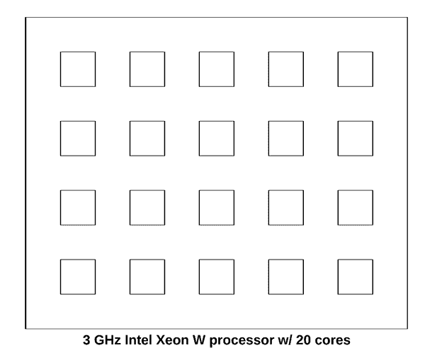
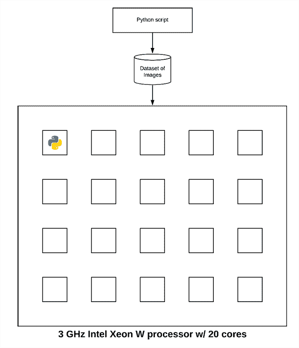
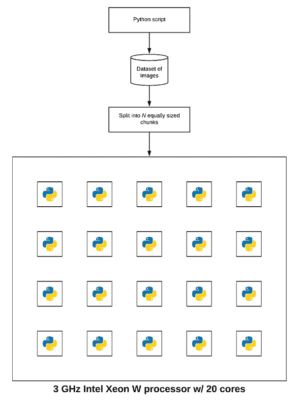
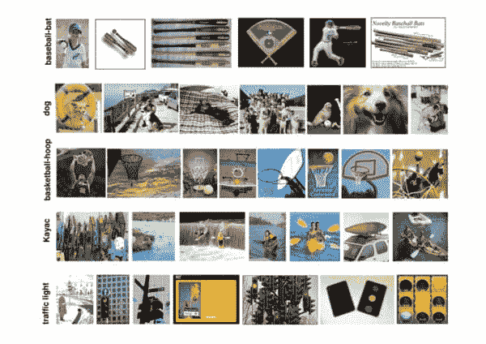

# OpenCV 和 Python 的多重处理

> 原文：<https://pyimagesearch.com/2019/09/09/multiprocessing-with-opencv-and-python/>

[](https://pyimagesearch.com/wp-content/uploads/2019/09/multiprocessing_opencv_header.jpg)

在本教程中，您将学习如何使用 OpenCV 和 Python 的多重处理来执行特征提取。您将了解如何使用 OpenCV 的多处理功能来并行处理系统总线上的特征提取，包括计算机上的所有处理器和内核。

今天的教程是受 PyImageSearch 阅读器 Abigail 的启发。

阿比盖尔写道:

> 嗨，阿德里安，我刚刚读了你的关于 OpenCV 图像哈希的教程，非常喜欢。
> 
> 我正在尝试将图像哈希应用到我在大学的研究项目中。
> 
> 他们为我提供了大约 750 万张图片的数据集。我用你的代码来执行图像哈希**，但是处理整个数据集需要很长时间。**
> 
> 我能做些什么来加速这个过程吗？

阿比盖尔问了一个很好的问题。

她所指的[图像哈希帖子](https://pyimagesearch.com/2019/08/26/building-an-image-hashing-search-engine-with-vp-trees-and-opencv/)是单线程的，这意味着只使用了处理器的一个内核— **如果我们改用*多线程/进程*，我们就可以*显著加快哈希过程。***

但是我们实际上如何利用 OpenCV 和 Python 的多重处理呢？

我将在本教程的剩余部分向您展示。

**要了解如何在 OpenCV 和 Python 中使用多重处理，*继续阅读*。**

## OpenCV 和 Python 的多重处理

在本教程的第一部分，我们将讨论单线程与多线程应用程序，包括为什么我们可能选择使用 OpenCV 的多处理来加快给定数据集的处理。

我还将讨论为什么*立即*转向大数据算法、工具和范例(如 Hadoop 和 MapReduce)是*错误的*决定— **相反，你应该首先*跨系统总线*并行化。**

从这里，我们将实现我们的 Python 和 OpenCV 多处理函数，以方便快捷地处理大型数据集。

最后，我们将把所有部分放在一起，比较处理数据集需要多长时间:

1.  只有一个**单核**处理器
2.  并将负载分布在处理器的所有核心上

我们开始吧！

### 为什么要使用多重处理来处理图像数据集？

您已经实现的绝大多数项目和应用程序(很可能)都是单线程的。

当您启动 Python 项目时，`python`二进制文件会启动一个 Python 解释器(即“Python 进程”)。

实际的 Python 进程本身如何分配给 CPU 内核取决于操作系统如何处理(1)进程调度和(2)分配系统和用户线程。

有*整本书*致力于多进程、操作系统以及进程如何被调度、分配、移除、删除等。通过操作系统；然而，**为了简单起见，我们假设:**

1.  我们启动我们的 Python 脚本。
2.  操作系统将 Python 程序分配给处理器的单个内核。
3.  然后，操作系统允许 Python 脚本在处理器内核上运行，直到完成。

这一切都很好，但是我们只利用了我们真正处理能力的*一小部分*。

要了解我们是如何利用处理器的，请看下图:

[](https://pyimagesearch.com/wp-content/uploads/2019/09/multiprocessing_opencv_20cores.png)

**Figure 1:** Multiprocessing with OpenCV and Python. By default, Python scripts use a single process. This 3GHz Intel Xeon W processor is being underutilized.

此图旨在展示我的 iMac Pro 上的 3 GHz 英特尔至强 W 处理器— **请注意该处理器总共有 20 个内核。**

现在，让我们假设我们启动了 Python 脚本。操作系统会将进程分配给这些内核中的一个:

[](https://pyimagesearch.com/wp-content/uploads/2019/09/multiprocessing_opencv_1core_assigned.png)

**Figure 2:** Without multiprocessing, your OpenCV program may not be efficiently using all cores or processors available on your machine.

Python 脚本将运行至完成。

但是你看到这里的问题了吗？

我们只使用了真正处理能力的 5%!

因此，为了加速我们的 Python 脚本，我们可以利用**多重处理。**在引擎盖下，Python 的`multiprocessing`包为处理器的每个内核旋转出一个新的`python`进程。每个`python`进程都是独立的，与其他进程分开(也就是说，没有共享的变量、内存等等。).

然后，我们将数据集处理工作负载的一部分分配给每个单独的`python`流程:

[](https://pyimagesearch.com/wp-content/uploads/2019/09/multiprocessing_opencv_20cores_assigned.png)

**Figure 3:** By multiprocessing with OpenCV, we can harness the full capability of our processor. In this case, an Intel Xeon 3GHz processor has 20 cores available and each core can be running an independent Python process.

注意每个进程是如何被分配数据集的一小部分的。

每个进程*独立地*咀嚼分配给它的数据集的子集，直到整个数据集被处理。

现在，我们不再只使用处理器的一个内核，而是使用所有内核！

***注意:**记住，这个例子有点简化。操作系统将管理进程分配，因为在您的系统上运行的不仅仅是您的 Python 脚本，还有更多进程。一些内核可能负责多个 Python 进程，其他内核不负责 Python 进程，而其余内核负责 OS/系统例程。*

### 为什么不用 Hadoop、MapReduce 等大数据工具呢？

当尝试并行处理大型数据集时，您的第一想法是应用大数据工具、算法和范例，如 Hadoop 和 MapReduce — ***，但这将是一个很大的错误。***

**处理大型数据集的黄金法则是:**

1.  首先通过系统总线*并行化*。
2.  如果性能/吞吐量不够，那么，*并且只有在*之后，开始跨多台机器(包括 Hadoop、MapReduce 等)进行并行化。).

我认为计算机科学家犯的最大的多重处理错误是立即投入大数据工具。

不要那样做。

相反，将数据集处理分散到您的系统总线*上，首先是*。

如果您没有在系统总线*上获得您想要的吞吐速度，那么只有*才应该考虑跨多台机器并行化并引入大数据工具。

如果您发现自己需要 Hadoop/MapReduce，[报名参加 **PyImageSearch 大师**课程](https://pyimagesearch.com/pyimagesearch-gurus/)，了解使用 Hadoop 的流 API 进行高吞吐量 Python + OpenCV 图像处理！

### 我们的示例数据集

[](https://pyimagesearch.com/wp-content/uploads/2019/08/image_hashing_search_engine_caltech101.jpg)

**Figure 4:** The CALTECH-101 dataset consists of 101 object categories. Will generate image hashes using OpenCV, Python, and multiprocessing for all images in the dataset.

我们将在多重处理和 OpenCV 示例中使用的数据集是 [CALTECH-101](http://www.vision.caltech.edu/Image_Datasets/Caltech101/) ，这是我们在构建[图像哈希搜索引擎](https://pyimagesearch.com/2019/08/26/building-an-image-hashing-search-engine-with-vp-trees-and-opencv/)时使用的数据集。

该数据集由 9，144 幅图像组成。

我们将使用多重处理将图像哈希提取分散到处理器的所有内核中。

你可以从他们的[官方网页](http://www.vision.caltech.edu/Image_Datasets/Caltech101/)下载加州理工学院-101 数据集，或者你可以使用下面的`wget`命令:

```py
$ wget http://www.vision.caltech.edu/Image_Datasets/Caltech101/101_ObjectCategories.tar.gz
$ tar xvzf 101_ObjectCategories.tar.gz

```

### 项目结构

让我们检查一下我们的项目结构:

```py
$ tree --dirsfirst --filelimit 10
.
├── pyimagesearch
│   ├── __init__.py
│   └── parallel_hashing.py
├── 101_ObjectCategories [9,144 images] 
├── temp_output
└── extract.py

```

在`pyimagesearch`模块中是我们的`parallel_hashing.py`助手脚本。这个脚本包含了我们的散列函数、分块函数和我们的`process_images`工具。

`101_ObjectCatories/`目录包含来自 CALTECH-101 的图像的 101 个子目录(通过上一节下载)。

许多中间文件将临时存储在`temp_output/`文件夹中。

我们多重处理的核心在于`extract.py`。这个脚本包括我们的预多处理开销、跨系统总线的并行化和后多处理开销。

### 我们的多重处理辅助功能

在我们利用 OpenCV 的多重处理来加速数据集处理之前，让我们首先实现一组用于促进多重处理的辅助工具。

打开目录结构中的`parallel_hashing.py`文件，插入以下代码:

```py
# import the necessary packages
import numpy as np
import pickle
import cv2

def dhash(image, hashSize=8):
	# convert the image to grayscale
	gray = cv2.cvtColor(image, cv2.COLOR_BGR2GRAY)

	# resize the input image, adding a single column (width) so we
	# can compute the horizontal gradient
	resized = cv2.resize(gray, (hashSize + 1, hashSize))

	# compute the (relative) horizontal gradient between adjacent
	# column pixels
	diff = resized[:, 1:] > resized[:, :-1]

	# convert the difference image to a hash
	return sum([2 ** i for (i, v) in enumerate(diff.flatten()) if v])

```

我们从导入 NumPy、OpenCV 和`pickle` ( **第 2-5 行**)开始。

从那里，我们定义我们的差分散列函数，`dhash`。图像哈希算法有很多种，但最流行的一种叫做 [**差分哈希**](https://pyimagesearch.com/2017/11/27/image-hashing-opencv-python/) ，它包括四个步骤:

1.  **步骤#1:** 将输入图像转换成灰度(**第 8 行**)。
2.  **步骤#2:** 将图像调整到固定尺寸， *N + 1 x N* ，忽略长宽比。通常我们设置 *N=8* 或 *N=16* 。我们使用 *N + 1* 作为行数，这样我们可以计算图像中相邻像素(**行 12** )之间的差异(因此为*“差异散列】*)。
3.  第三步:计算差值。如果我们设置 *N=8* ，那么每行有 9 个像素，每列有 8 个像素。然后我们可以计算相邻列像素之间的差异，产生 *8* 差异。 *8 个*行的 8 个差值(即 *8×8* )产生 *64 个*值(**行 16** )。
4.  第四步:最后，我们可以建立散列。在实践中，我们实际需要执行的只是一个比较列的“大于”运算，产生二进制值。这些 *64* 二进制值被压缩成一个整数，形成我们的最终散列(**第 19 行**)。

**通常，图像哈希算法用于在大型数据集中找到*个近似重复的图像*。**

要全面了解差异散列法，请务必阅读以下两篇博文:

*   [*用 VP-Trees 和 OpenCV*](https://pyimagesearch.com/2019/08/26/building-an-image-hashing-search-engine-with-vp-trees-and-opencv/) 构建图像哈希搜索引擎
*   [*用 OpenCV 和 Python 哈希图像*](https://pyimagesearch.com/2017/11/27/image-hashing-opencv-python/)

接下来，我们来看看`convert_hash`函数:

```py
def convert_hash(h):
	# convert the hash to NumPy's 64-bit float and then back to
	# Python's built in int
	return int(np.array(h, dtype="float64"))

```

当我第一次为图像哈希搜索引擎教程编写代码时，我发现 VP-Tree 实现在内部将点转换为 NumPy 64 位浮点。那没问题；然而，散列必须是整数，如果我们将它们转换成 64 位浮点数，它们就变成了不可散列的数据类型。为了克服 VP-Tree 实现的限制，我想到了`convert_hash` hack:

*   我们接受一个输入散列，`h`。
*   该散列然后被转换成 NumPy 64 位浮点数。
*   然后将 NumPy 浮点数转换回 Python 内置的整数数据类型。

这种方法确保了哈希在整个哈希、索引和搜索过程中得到一致的表示。

为了利用多处理，我们首先需要将数据集分成大小相等的 *N* 个块(每个处理器内核一个块)。

现在让我们定义我们的`chunk`生成器:

```py
def chunk(l, n):
	# loop over the list in n-sized chunks
	for i in range(0, len(l), n):
		# yield the current n-sized chunk to the calling function
		yield l[i: i + n]

```

`chunk`发生器接受两个参数:

*   `l`:元素列表(本例中为文件路径)。
*   `n`:要生成的 *N* 大小的块的数量。

在函数内部，我们将列表`l`和`yield` *N* 大小的块循环到调用函数。

我们终于到了多处理实现的**主力——`process_images`函数:**

```py
def process_images(payload):
	# display the process ID for debugging and initialize the hashes
	# dictionary
	print("[INFO] starting process {}".format(payload["id"]))
	hashes = {}

	# loop over the image paths
	for imagePath in payload["input_paths"]:
		# load the input image, compute the hash, and conver it
		image = cv2.imread(imagePath)
		h = dhash(image)
		h = convert_hash(h)

		# update the hashes dictionary
		l = hashes.get(h, [])
		l.append(imagePath)
		hashes[h] = l

	# serialize the hashes dictionary to disk using the supplied
	# output path
	print("[INFO] process {} serializing hashes".format(payload["id"]))
	f = open(payload["output_path"], "wb")
	f.write(pickle.dumps(hashes))
	f.close()

```

在*单独的* `extract.py`脚本中，我们将使用 Python 的`multiprocessing`库启动一个专用的 Python 进程，将其分配给处理器的特定内核，然后在该特定内核上运行`process_images`函数。

`process_images`函数是这样工作的:

*   它接受一个`payload`作为输入(**行 32** )。假设`payload`是一个 Python 字典，但实际上可以是任何数据类型，只要我们可以对它进行 pickle 和 unpickle。
*   初始化`hashes`字典(**第 36 行**)。
*   在`payload` ( **第 39 行** ) **的输入图像路径上循环。**在循环中，我们加载每个图像，提取散列，并更新`hashes`字典(**第 41-48 行**)。
*   最后，我们将`hashes`作为`.pickle`文件写入磁盘(**第 53-55 行**)。

为了这篇博文的目的，我们正在利用**多重处理**来*促进输入数据集的更快图像散列*；但是， ***你应该使用这个函数作为模板来对你自己的数据集进行处理。***

你应该很容易在关键点检测/局部不变特征提取、颜色通道统计、[局部二进制模式](https://pyimagesearch.com/2015/12/07/local-binary-patterns-with-python-opencv/)等方面进行切换。在那里，你可以根据自己的需要修改这个函数。

### 实现 OpenCV 和多重处理脚本

既然我们的实用程序方法已经实现，让我们创建多处理驱动程序脚本。

**该脚本将负责:**

1.  获取输入数据集中的所有图像路径。
2.  将图像路径分成大小相等的 *N* 个块(其中 *N* 是我们希望使用的进程总数)。
3.  使用`multiprocessing`、`Pool`和`map`调用处理器每个内核上的`process_images`函数。
4.  从每个独立的过程中获取结果，然后将它们组合起来。

如果你需要**复习 Python 的多处理模块**，一定要[查阅文档](https://docs.python.org/3.7/library/multiprocessing.html)。

让我们看看如何实现 OpenCV 和多重处理脚本。打开`extract.py`文件并插入以下代码:

```py
# import the necessary packages
from pyimagesearch.parallel_hashing import process_images
from pyimagesearch.parallel_hashing import chunk
from multiprocessing import Pool
from multiprocessing import cpu_count
from imutils import paths
import numpy as np
import argparse
import pickle
import os

```

**第 2-10 行**导入我们的包、模块和函数:

*   从我们的定制`parallel_hashing`文件中，我们导入了我们的`process_images`和`chunk`函数。
*   为了适应并行处理，我们将使用 python`multiprocessing`模块。具体来说，我们导入`Pool`(构建一个处理池)和`cpu_count`(如果没有提供`--procs`命令行参数，则获取可用 CPUs 内核的数量)。

我们所有的多重处理设置代码必须在主线程中执行:

```py
# check to see if this is the main thread of execution
if __name__ == "__main__":
	# construct the argument parser and parse the arguments
	ap = argparse.ArgumentParser()
	ap.add_argument("-i", "--images", required=True, type=str,
		help="path to input directory of images")
	ap.add_argument("-o", "--output", required=True, type=str,
		help="path to output directory to store intermediate files")
	ap.add_argument("-a", "--hashes", required=True, type=str,
		help="path to output hashes dictionary")
	ap.add_argument("-p", "--procs", type=int, default=-1,
		help="# of processes to spin up")
	args = vars(ap.parse_args())

```

第 13 行确保我们在执行的主线程中。这有助于防止多重处理错误，尤其是在 Windows 操作系统上。

**第 15-24 行**解析四个[命令行参数](https://pyimagesearch.com/2018/03/12/python-argparse-command-line-arguments/):

*   `--images`:输入图像目录的路径。
*   `--output`:存放中间文件的输出目录路径。
*   `--hashes`:输出哈希字典的路径。泡菜格式。
*   `--procs`:为多重处理启动的进程数。

随着我们的命令行参数被解析并准备就绪，现在我们将(1)确定要启动的并发进程的数量，以及(2)准备我们的映像路径(有点预多处理开销):

```py
	# determine the number of concurrent processes to launch when
	# distributing the load across the system, then create the list
	# of process IDs
	procs = args["procs"] if args["procs"] > 0 else cpu_count()
	procIDs = list(range(0, procs))

	# grab the paths to the input images, then determine the number
	# of images each process will handle
	print("[INFO] grabbing image paths...")
	allImagePaths = sorted(list(paths.list_images(args["images"])))
	numImagesPerProc = len(allImagePaths) / float(procs)
	numImagesPerProc = int(np.ceil(numImagesPerProc))

	# chunk the image paths into N (approximately) equal sets, one
	# set of image paths for each individual process
	chunkedPaths = list(chunk(allImagePaths, numImagesPerProc))

```

第 29 行决定了我们将要启动的并发进程的总数，而**第 30 行**给每个进程分配一个 ID 号。默认情况下，我们将利用系统上的所有 CPUs 内核。

**第 35 行**获取数据集中输入图像的路径。

**第 36 行和第 37 行**通过将图像路径数除以进程数并取上限来确定每个进程的图像总数，以确保我们从此处开始使用整数值。

**第 41 行**利用我们的`chunk`函数创建一个由 *N 个*大小相等的图像路径组成的列表。我们将把每个块映射到一个独立的进程。

让我们准备好分配给每个进程的`payloads`(我们最后的预多处理开销):

```py
	# initialize the list of payloads
	payloads = []

	# loop over the set chunked image paths
	for (i, imagePaths) in enumerate(chunkedPaths):
		# construct the path to the output intermediary file for the
		# current process
		outputPath = os.path.sep.join([args["output"],
			"proc_{}.pickle".format(i)])

		# construct a dictionary of data for the payload, then add it
		# to the payloads list
		data = {
			"id": i,
			"input_paths": imagePaths,
			"output_path": outputPath
		}
		payloads.append(data)

```

**第 44 行**初始化`payloads`列表。每个有效载荷将由`data`组成，包括:

1.  一个 **ID**
2.  输入路径列表
3.  到中间文件的**输出路径**

第 47 行在我们的分块图像路径上开始一个循环。在循环内部，我们指定中间输出文件路径(它将存储该特定图像路径块的相应图像散列)，同时在文件名中小心地用进程 ID 命名它(**第 50 行和第 51 行**)。

为了完成这个循环，我们`append`我们的`data`——一个由(1) ID、`i`、(2)输入`imagePaths`和(3) `outputPath` ( **第 55-60 行**)组成的字典。

下一个块是我们**在系统总线上分配数据集处理的地方:**

```py
	# construct and launch the processing pool
	print("[INFO] launching pool using {} processes...".format(procs))
	pool = Pool(processes=procs)
	pool.map(process_images, payloads)

	# close the pool and wait for all processes to finish
	print("[INFO] waiting for processes to finish...")
	pool.close()
	pool.join()
	print("[INFO] multiprocessing complete")

```

`Pool`类在处理器的每个内核上创建 Python 进程/解释器(**第 64 行**)。

调用`map`获取`payloads`列表，然后在每个核上调用`process_images`，将`payloads`分配给每个核(**行 65** )。

然后我们将关闭接受新任务的`pool`，并等待多重处理完成(**第 69 行和第 70 行**)。

最后一步(后多处理开销)是获取我们的*中间*散列并构建最终的*组合*散列。

```py
	# initialize our *combined* hashes dictionary (i.e., will combine
	# the results of each pickled/serialized dictionary into a
	# *single* dictionary
	print("[INFO] combining hashes...")
	hashes = {}

	# loop over all pickle files in the output directory
	for p in paths.list_files(args["output"], validExts=(".pickle"),):
		# load the contents of the dictionary
		data = pickle.loads(open(p, "rb").read())

		# loop over the hashes and image paths in the dictionary
		for (tempH, tempPaths) in data.items():
			# grab all image paths with the current hash, add in the
			# image paths for the current pickle file, and then
			# update our hashes dictionary
			imagePaths = hashes.get(tempH, [])
			imagePaths.extend(tempPaths)
			hashes[tempH] = imagePaths

	# serialize the hashes dictionary to disk
	print("[INFO] serializing hashes...")
	f = open(args["hashes"], "wb")
	f.write(pickle.dumps(hashes))
	f.close()

```

**第 77 行**初始化散列字典来保存我们将从每个中间文件中填充的组合散列。

**第 80-91 行**填充组合散列字典。为此，我们循环所有中间的`.pickle`文件(即，每个进程一个`.pickle`文件)。在循环内部，我们(1)从数据中读取散列和相关的`imagePaths`，以及(2)更新`hashes`字典。

最后，**第 94-97 行**将`hashes`序列化为磁盘。我们可以[使用序列化的哈希来构建一个 VP-Tree，并在这个时候在一个单独的*脚本中搜索接近重复的图像*](https://pyimagesearch.com/2019/08/26/building-an-image-hashing-search-engine-with-vp-trees-and-opencv/)*。*

 ****注意:**您可以更新代码从系统中删除临时`.pickle`文件；然而，我把它作为实现决策留给了读者。*

### OpenCV 和多重处理结果

让我们来测试一下 OpenCV 和多重处理方法。确保您已经:

1.  使用本教程的 ***【下载】*** 部分下载源代码。
2.  使用上面的*“我们的示例数据集”*部分中的说明下载了 CALTECH-101 数据集。

首先，让我们测试仅使用单核处理我们的 9，144 张图像数据集**需要多长时间**

```py
$ time python extract.py --images 101_ObjectCategories --output temp_output \
	--hashes hashes.pickle --procs 1
[INFO] grabbing image paths...
[INFO] launching pool using 1 processes...
[INFO] starting process 0
[INFO] process 0 serializing hashes
[INFO] waiting for processes to finish...
[INFO] multiprocessing complete
[INFO] combining hashes...
[INFO] serializing hashes...

real	0m9.576s
user	0m7.857s
sys		0m1.489s

```

仅使用单个进程(我们处理器的单核)需要 **9.576 秒**来处理整个图像数据集。

**现在，让我们尝试使用所有的 *20 个进程*(可以映射到我的处理器的所有 20 个内核):**

```py
$ time python extract.py --images ~/Desktop/101_ObjectCategories \
	--output temp_output --hashes hashes.pickle 
[INFO] grabbing image paths...
[INFO] launching pool using 20 processes...
[INFO] starting process 0
[INFO] starting process 1
[INFO] starting process 2
[INFO] starting process 3
[INFO] starting process 4
[INFO] starting process 5
[INFO] starting process 6
[INFO] starting process 7
[INFO] starting process 8
[INFO] starting process 9
[INFO] starting process 10
[INFO] starting process 11
[INFO] starting process 12
[INFO] starting process 13
[INFO] starting process 14
[INFO] starting process 15
[INFO] starting process 16
[INFO] starting process 17
[INFO] starting process 18
[INFO] starting process 19
[INFO] process 3 serializing hashes
[INFO] process 4 serializing hashes
[INFO] process 6 serializing hashes
[INFO] process 8 serializing hashes
[INFO] process 5 serializing hashes
[INFO] process 19 serializing hashes
[INFO] process 11 serializing hashes
[INFO] process 10 serializing hashes
[INFO] process 16 serializing hashes
[INFO] process 14 serializing hashes
[INFO] process 15 serializing hashes
[INFO] process 18 serializing hashes
[INFO] process 7 serializing hashes
[INFO] process 17 serializing hashes
[INFO] process 12 serializing hashes
[INFO] process 9 serializing hashes
[INFO] process 13 serializing hashes
[INFO] process 2 serializing hashes
[INFO] process 1 serializing hashes
[INFO] process 0 serializing hashes
[INFO] waiting for processes to finish...
[INFO] multiprocessing complete
[INFO] combining hashes...
[INFO] serializing hashes...

real	0m1.508s
user	0m12.785s
sys		0m1.361s

```

通过在我的处理器的所有 20 个内核上分配图像哈希负载，我能够将处理数据集的时间从 9.576 秒减少到 **1.508 秒，减少了 535%以上！**

但是等等，如果我们用了 20 个核，那么总处理时间不应该约为 *9.576 / 20 = 0.4788* 秒吗？

嗯，不完全是，有几个原因:

1.  首先，我们正在执行*大量的*I/O 操作。每个`cv2.imread`调用都会导致 I/O 开销。哈希算法本身也非常简单。如果我们的算法真的是 CPU 受限的，而不是 I/O 受限的，那么加速系数会更高。
2.  其次，多重处理不是一个“免费”的操作。在 Python 级别和操作系统级别都有开销函数调用，这使得我们看不到真正的 20 倍加速。

### 所有的计算机视觉和 OpenCV 算法都可以用多处理并行吗？

简而言之，答案是否定的，不是所有的算法都可以并行处理并分配给处理器的所有内核，有些算法本质上就是单线程的。

此外，您不能使用`multiprocessing`库来加速已编译的 OpenCV 例程，如`cv2.GaussianBlur`、`cv2.Canny`或`cv2.dnn`包中的任何深度神经网络例程。

这些例程以及所有其他的`cv2.*`函数都是预编译的 C/C++函数——Python 的`multiprocessing`库对它们没有任何影响。

相反，如果你对如何加速这些功能感兴趣，一定要看看 [OpenCL](https://www.khronos.org/opencl/) 、[线程构建模块(TBB)](https://github.com/intel/tbb) 、 [NEON](https://developer.arm.com/technologies/neon) 和 [VFPv3](https://developer.arm.com/technologies/floating-point) 。

此外，如果你正在使用 Raspberry Pi，你应该阅读这篇关于如何优化 OpenCV 安装的教程。

我还在我的书中加入了额外的 OpenCV 优化， [*计算机视觉的树莓 Pi*](https://pyimagesearch.com/raspberry-pi-for-computer-vision/)。

## 摘要

在本教程中，您学习了如何在 OpenCV 和 Python 中利用多处理。

具体来说，我们学习了如何使用 Python 的内置`multiprocessing`库以及`Pool`和`map`方法，在所有处理器和处理器的所有内核之间并行化和分布处理。

最终结果是在处理我们的图像数据集的时间上大幅加速了 535%。

我们通过索引一个图像数据集来检验 OpenCV 的多重处理，以构建一个[图像哈希搜索引擎](https://pyimagesearch.com/2019/08/26/building-an-image-hashing-search-engine-with-vp-trees-and-opencv/)；然而，您可以修改/实现您自己的`process_images`函数来包含您自己的功能。

我个人的建议是，在构建自己的多处理和 OpenCV 应用程序时，使用`process_images`函数作为模板。

我希望你喜欢这个教程！

如果你想在未来看到更多的多重处理和 OpenCV 优化教程，请在下面留下评论，让我知道。

**要下载这篇文章的源代码，并在 PyImageSearch 上发布未来教程时得到通知，*只需在下面的表格中输入您的电子邮件地址！****