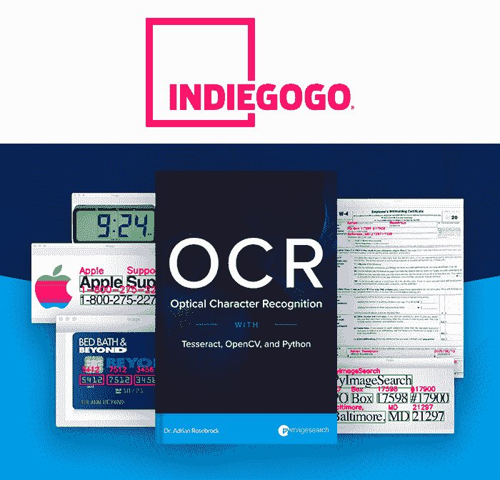
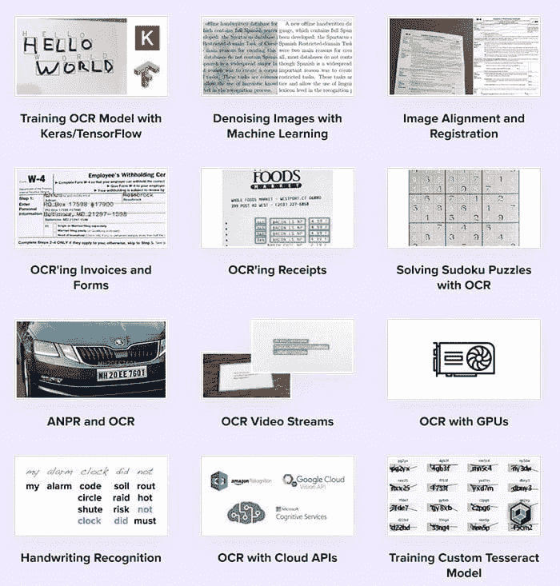
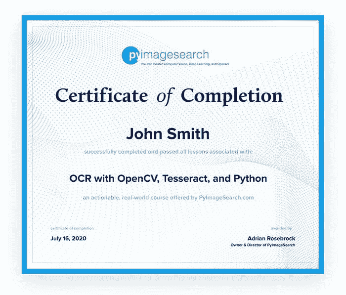
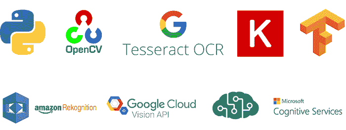

# 我的 OCR with OpenCV、Tesseract 和 Python IndieGoGo 活动将于美国东部时间 8 月 19 日星期三上午 10 点上线

> 原文：<https://pyimagesearch.com/2020/08/12/my-ocr-with-opencv-tesseract-and-python-indiegogo-campaign-will-go-live-on-wednesday-august-19th-at-10am-edt/>

**今天要分享的大新闻！**

我非常激动地宣布，我的 [*OCR with Tesseract、OpenCV 和 Python* IndieGoGo 活动](https://pyimagesearch.com/ocr-with-opencv-tesseract-and-python/)将于一周后**美国东部时间 8 月 19 日星期三上午 10 点在**启动。** ( **注:**此战役已经结束。但是你仍然可以在这里预购我的新书 *OCR with Tesseract、OpenCV 和 Python* 和[。)](https://pyimagesearch.com/ocr-with-opencv-tesseract-and-python/)**

那么，我为什么要写一本关于 OCR 的书呢？

*   尽管深度学习取得了诸多进步，但 OCR 仍然极具挑战性。
*   像 Tesseract 这样的工具很麻烦，很难使用，并且很少提供教程或文档
*   更不用说，将 OCR 和 Tesseract 集成到您自己的 OpenCV 项目中会让您拔头发(我应该知道，我是秃头)。

我的新书揭开了 OCR 的神秘面纱，让你能够*成功地*和*自信地*将 OCR 应用到你的工作、学校项目和研究中。

## 书中会涉及哪些内容？

我的新 OCR 书:

*   介绍宇宙魔方 OCR 引擎
*   向您展示如何调整 Tersseract 的所有旋钮和刻度盘来提高 OCR 准确度
*   教你如何在自己的项目中集成 Tesseract 和 OpenCV
*   提供从头开始训练自定义 OCR 模型的章节
*   利用深度学习在您自己的自定义数据集上创建 OCR 模型
*   向您展示如何使用基于云的 OCR APIs，例如 Amazon Rekognition、微软认知服务和 Google Vision API

此外，我还提供了一些案例研究，内容涉及:

*   构建 OpenCV 数独求解器
*   对发票、简历等表格文件进行光学字符识别。
*   创建收据扫描仪
*   用 OCR 建立自动牌照/号码牌(ANPR)系统
*   如何对视频流应用 OCR
*   如何用你的 GPU 提高 OCR 速度
*   从头开始训练一个立方体模型
*   如何使用 Keras 和 TensorFlow 训练自定义 OCR 模型
*   … *还有更多！*

## 竣工证明

这本书将包括一个完成证书选项。成功完成书中每一课的测验和作业后，**您将获得一份结业证书，您可以将它放在您的 LinkedIn 个人资料、简历等中。**

## 为什么选择 IndieGoGo？以前的活动不是用 Kickstarter 吗？

长期使用 PyImageSearch 的读者会注意到，我过去发起过三次众筹活动(一次是为 [PyImageSearch 大师课程](https://pyimagesearch.com/pyimagesearch-gurus/)，一次是为 *[用 Python](https://pyimagesearch.com/deep-learning-computer-vision-python-book/)* 进行计算机视觉深度学习，另一次是为 *[计算机视觉](https://pyimagesearch.com/raspberry-pi-for-computer-vision/)* 树莓 Pi)。这三个项目都是通过 Kickstarter(一个流行的众筹平台)推出的。

这就提出了一个问题— *为什么要使用 IndieGoGo 而不是 Kickstarter？*

有两个原因:

首先，Kickstarter 平台漏洞百出。在过去的四年里，我已经向 Kickstarter 报告了许多使用他们平台的错误。这些错误从未被修复。坦率地说，我已经开始对 Kickstarter 失去一点信心了。

但更重要的是，Kickstarter 让提供多重折扣和交易变得令人困惑。当我在 Kickstarter 上为计算机视觉的 *Raspberry Pi 开展活动的时候，*反馈中最大的一点就是结账过程令人困惑。

IndieGoGo 有一个更加直观、简单的结账流程，允许您:

1.  以独家预发布价格获取您的 OpenCV、Tesseract 和 PythonOCR 副本
2.  另外，以折扣价购买[我的其他书籍和课程](https://pyimagesearch.com/books-and-courses/)(如果您愿意)

我的目标是让你尽可能容易地利用这些交易和折扣——当我测试 IndieGoGo 平台时，这是显而易见的。

## 我害怕失败。

回到 2015 年 2 月，我发起了我的第一次 Kickstarter 众筹活动。这一活动是为了 PyImageSearch 大师课程，该课程现在已经成为学习计算机视觉、深度学习和 OpenCV 的最佳在线课程。

**但是让我告诉你，【Kickstarter 活动几乎从未启动过。**

没有人知道这一点，但回到 2014 年 11 月，我工作的初创公司失去了我们的资金。我们与马里兰州有政府合同，当州选举导致州长易手时，当选州长立即取消了我们的合同。

我刚从研究生院毕业，手里拿着博士文凭，却已经失业了！

我当时正处于人生的关键时刻；我可以出去，找一份新工作，继续走同样的路 *…* ***或者，我可以想办法让 PyImageSearch 成为我的全职工作。***

我选择了后者。

我背靠着墙，蹲下身子，我知道这将是一场生死之战。

我知道打击即将来临。我感觉就像洛奇·巴尔博亚在和阿波罗·奎迪战斗……但是如果我能承受这一拳，我就能成功。

但是让我告诉你，一拳还是一拳——而且很痛。

账单堆积如山。我刚刚和我的女朋友同居(几年后，她成了我的妻子)。我正面临困境。我举起手套保护我的头，但是我被一次又一次的身体打击。如果我的手倒下了，我知道我出局了——我不能一拳打在头上。

在 PyImageSearch Kickstarter 活动之前，我非常紧张。在它发射前的四个晚上，我几乎没有睡觉。

我紧张又焦虑。我的左眼在抽搐。我不断有灾难性的*“如果”*想法:

*   如果我付不起账单怎么办？
*   如果我破产了怎么办？
*   我刚和我爱的女孩同居——如果她因为这个职业决定失败而离开我怎么办？

我没有意识到，但我现在知道的是，不管 PyImageSearch Gurus 课程是否成功，我仍然会在第二天早上醒来。生活还会继续。

*   **如果成功了，*太好了！*** 我早就明确了全职运行 PyImageSearch 的敲门砖。
*   如果失败了，至少我学到了一些东西。 是的，在接下来的 6-12 个月里，随着我找到一份新工作并偿还债务，生活会变得更加艰难，但实际上，那时我只有 24 岁。我有足够的时间从那次打击中恢复过来。

我经常看到开发人员、学生和研究人员说服自己*而不是*去学习一项新技能，因为他们害怕失败。

我从六年前的 Kickstarter 活动中学到了一些东西——**对我来说最大的失败是*而不是*启动它。**

如果我屈服于对失败的恐惧，在最后一刻退出，那么 PyImageSearch 大师课程就不会存在。

如果这个课程不存在，那么很有可能 PyImageSearch 也不会存在。该课程的成功吸引了大量的学生和资金，使 PyImageSearch 发展到今天的水平。

在我看来，唯一真正的失败是没有在身体上、精神上和教育上投资自己。

*   投资你的身体，它是你唯一拥有的。它需要持续 70 年以上。经常锻炼，健康饮食，多喝水。学会减少(或消除)酒精和咖啡因的摄入。每晚保证 8 小时睡眠。
*   投资于你的头脑，保持它的敏锐。睡前冥想，早上第一件事。利用每日感恩日记。当你伤害了别人的感情时，放下你的自我并道歉(即使你知道你是对的和有道理的)。最重要的是，*赞美你生命中对你最重要的人。把他们放在一个基座上，让他们觉得自己是被需要的、特别的、了不起的。*
*   投资于你的教育，这能让你保持年轻。对神经可塑性(即你的大脑修改连接和自我重组的能力)的研究表明，通过教育进行刺激有助于降低痴呆症、阿尔茨海默病和其他大脑退化疾病的风险。即使你年纪大了，退休了，*你仍然需要学习*来保持大脑年轻！如果你还年轻，就没有理由不投资自己和教育——这不仅对你的职业很重要，对你的长期健康也很重要。

## 下一步是什么？

OCR 是计算机视觉和深度学习中最具挑战性的子领域之一。虽然 OCR 是一个简单、直观的概念，但它仍有待“完全解决”。没有现成的 OCR 包是 100%准确的，并且在每种用例/情况下都能工作。

我的书将教你如何*成功地*和*自信地*将 OCR 应用到你自己的工作、项目和研究中。我保证。**请考虑加入我，以独家折扣价购买我的新书。**

点击下面的按钮**领取您的预购副本**: