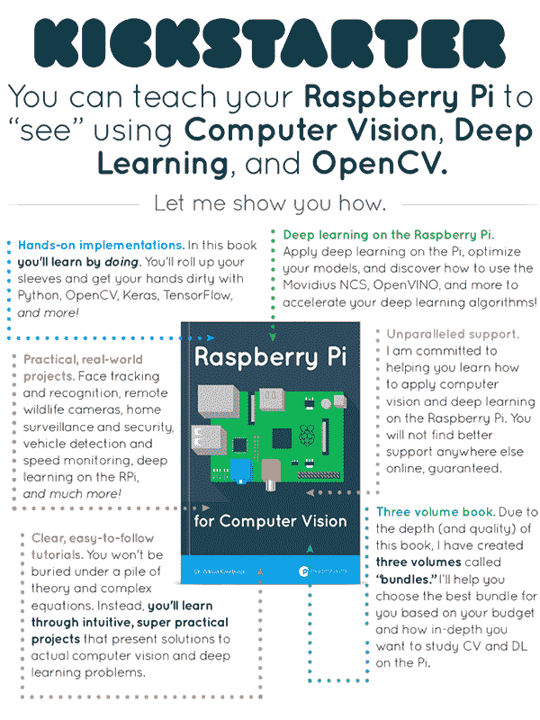

# 我的计算机视觉 Kickstarter 版树莓 Pi 将于美国东部时间 4 月 10 日周三上午 10 点上线。

> 原文：<https://pyimagesearch.com/2019/04/03/my-raspberry-pi-for-computer-vision-kickstarter-will-go-live-on-wednesday-april-10th-at-10am-est/>

我今天有重大消息要分享！

我非常兴奋地宣布，我的用于计算机视觉的 ***树莓 Pi*Kickstarter 活动**将于一周后**美国东部时间 4 月 10 日星期三上午 10 点在**发布。****

**计算机视觉**、**深度学习**和**物联网(IoT)** 是计算机科学中发展最快的三个行业和学科——**在我的新书中，你将学习如何使用 Raspberry Pi 将这三个*结合起来。***

无论这是你第一次使用树莓 Pi，还是你是一个多年来一直使用 Pi 的业余爱好者， ***用于计算机视觉的树莓 Pi*将使你能够“看到”Pi。**

**在这本书里面我们将重点介绍:**

*   Raspberry Pi 上的计算机视觉入门
*   Pi 上的计算机视觉和物联网项目
*   伺服系统、PID 和用计算机视觉控制 Pi
*   人类活动、家庭监控和面部应用
*   树莓派上的深度学习
*   借助 Movidius NCS 和 OpenVINO 工具包实现快速、高效的深度学习
*   树莓派上的自动驾驶汽车应用
*   使用 RPi 执行计算机视觉和深度学习时的提示、建议和最佳实践

我也有关于 NVIDIA Jetson Nano 和 Google Coral 的章节。

作为提醒，在接下来的 7 天里，我会再发布一些你不想错过的公告*，包括:*

#### 2019 年 4 月 4 日星期四

**Kickstarter 活动的预览，**包括一个**演示视频**，展示你将在书中发现的内容。

#### 2019 年 4 月 5 日星期五

**目录**为 ***为计算机视觉树莓派。*** 这本书是*实用*和*动手*，给你把 CV 和 DL 带到嵌入式设备需要的知识。你不想错过这个章节列表！

#### 2019 年 4 月 8 日星期一

**Kickstarter 奖励的完整列表*(包括早鸟折扣和销售)。*** 当 Kickstarter 启动时，你可以使用这个列表提前计划你想要的奖励等级。

#### 2019 年 4 月 9 日星期二

请记住，这本书已经得到了*很多*的关注，所以当 Kickstarter 在美国东部时间 4 月 10 日星期三上午 10 点发布时，将有**多人排队等待每个奖励等级**。**为了帮助确保你得到你想要的奖励等级，我将分享我的*提示和建议*，你可以用它们来确保你是第一个。**

#### 2019 年 4 月 10 日星期三

**我会通过电子邮件向您发送 Kickstarter 活动链接**，您可以使用该链接**申领您的简历 RPi 副本，*以及额外的折扣和销售！***

为了在这些公告发布时得到通知， [**请务必注册参加*Raspberry Pi for Computer Vision*Kickstarter 通知列表！**](https://app.monstercampaigns.com/c/lmpypnxz7n0g1h4v2puy/)