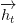
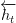
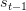

# 使用 TensorFlow 和 Keras 的 Bahdanau 注意力的神经机器翻译

> 原文：<https://pyimagesearch.com/2022/08/22/neural-machine-translation-with-bahdanaus-attention-using-tensorflow-and-keras/>

* * *

## **目录**

* * *

## [**神经机器翻译用 Bahdanau 的注意力使用 TensorFlow 和 Keras**](#TOC)

想象一下明天是你的考试，而你还没有学完很多章节。你停顿了一会儿，然后采取了更聪明的选择，让*优先于*。你**关注**那些(根据你的说法)比其他章节更有分量的章节。

我们不建议在学期的最后一天进行优先排序，但是嘿，我们都这么做了！除非你对哪些章节更有分量的评估完全错了，否则你已经得到了超出你所能得到的分数，如果你涵盖了所有章节的话。

将注意力的这种类比延伸一点，今天，我们将这种机制应用于神经机器翻译的任务。

在本教程中，您将学习如何将 [Bahdanau 的注意力](https://arxiv.org/abs/1409.0473)应用于神经机器翻译任务。

本课是关于 NLP 103 的两部分系列的第一部分:

1.  [***神经机器翻译用 Bahdanau 的注意力使用 TensorFlow 和 Keras***](https://pyimg.co/kf8ma) **(本教程)**
2.  *使用 TensorFlow 和 Keras 进行 Luong 注意力的神经机器翻译*

**要学习如何将 Bahdanau 的注意力应用到神经机器翻译任务中，** ***只要坚持阅读。***

* * *

## [**神经机器翻译用 Bahdanau 的注意力使用 TensorFlow 和 Keras**](#TOC)

在之前的[博客文章](https://pyimg.co/4yi97)中，我们讨论了神经机器翻译背后的数学直觉。我们请求您查看博客帖子，以获得关于该任务的深入知识。

在本教程中，我们将借助注意力解决从源语言(英语)翻译到目标语言(法语)的问题。在本教程中训练的模型的帮助下，我们还为翻译任务构建了一个交互式演示。

 <gradio-app space="pyimagesearch/nmt-bahdanau">* * *

### [**简介**](#TOC)

我们经常被谷歌翻译震惊。深度学习模型可以从任何语言翻译成任何其他语言。你可能已经猜到了，这是一个神经机器翻译模型。

神经机器翻译模型有一个**编码器**和一个**解码器**。编码器将源句子编码成丰富的表示形式。解码器接受编码的表示，并将其解码成目标语言。

[Bahdanau 等人](https://arxiv.org/abs/1409.0473)在他们的学术论文《通过联合学习对齐和翻译的神经机器翻译》中提出，每次在解码器中解码一个单词时，都要构建*编码器表示*。

这种动态表示将取决于输入句子的部分****t***与当前解码的单词最相关。我们**关注**输入句子的最相关部分，以解码目标句子。*

 *在本教程中，我们不仅解释了注意力的概念，还在 TensorFlow 和 Keras 中建立了一个模型。我们今天的任务是有一个从英语翻译成法语的模型。

* * *

### [**配置您的开发环境**](#TOC)

要遵循这个指南，您需要在系统上安装`tensorflow`和`tensorflow-text`。

幸运的是，TensorFlow 可以在 pip 上安装:

```py
$ pip install tensorflow==2.8.0
$ pip install tensorflow-text==2.8.0
```

* * *

### [**在配置开发环境时遇到了问题？**](#TOC)

说了这么多，你是:

*   时间紧迫？
*   了解你雇主的行政锁定系统？
*   想要跳过与命令行、包管理器和虚拟环境斗争的麻烦吗？
*   **准备好在您的 Windows、macOS 或 Linux 系统上运行代码*****？***

 *那今天就加入 [PyImageSearch 大学](https://pyimagesearch.com/pyimagesearch-university/)吧！

**获得本教程的 Jupyter 笔记本和其他 PyImageSearch 指南，这些指南是** ***预先配置的*** **，可以在您的网络浏览器中运行在 Google Colab 的生态系统上！**无需安装。

最棒的是，这些 Jupyter 笔记本可以在 Windows、macOS 和 Linux 上运行！

* * *

### [**项目结构**](#TOC)

我们首先回顾我们的项目目录结构。

首先访问本教程的 ***“下载”*** 部分，检索源代码和示例图像。

从这里，看一下目录结构:

```py
├── download.sh
├── inference.py
├── output
│   └── loss.png
├── pyimagesearch
│   ├── config.py
│   ├── dataset.py
│   ├── __init__.py
│   ├── loss.py
│   ├── models.py
│   ├── schedule.py
│   └── translator.py
├── requirements.txt
└── train.py
```

在`pyimagesearch`目录中，我们有:

*   `config.py`:任务的配置文件。
*   `dataset.py`:数据集管道的实用程序。
*   `loss.py`:保存训练模型所需损失的代码片段。
*   `models.py`:翻译模型的编码器和解码器。
*   `schedule.py`:培训管道的学习率调度程序。
*   训练和推理模型。

在核心目录中，我们有四个脚本:

*   `download.sh`:下载训练数据的 shell 脚本。
*   `requirements.txt`:本教程需要的 python 包。
*   `train.py`:训练模型的脚本。
*   `inference.py`:推理脚本。

* * *

### [**RNN 编解码器**](#TOC)

在神经机器翻译中，我们有一个**编码器**和一个**解码器**。编码器构建源句子的丰富表示，而解码器解码编码表示并产生目标句子。

由于源句子和目标句子是序列数据，我们可以从可信的序列模型中获得帮助。要获得顺序建模的初级知识，请关注我们之前的博文。

虽然编码器构建的信息非常有用，但它没有捕获源句子的一些非常重要的方面*。利用*静态*和*固定*编码器表示，我们受到对每个解码单词使用源句子的相同含义的约束。*

 *在下一节中，我们将讨论编码器、解码器和注意模块。注意力模块将在解码时帮助从源句子中收集*重要信息。*

 ** * *

### [**学习对齐和平移**](#TOC)

* * *

#### [**编码器**](#TOC)

递归神经网络采用当前输入

and the previous hidden state to model the present hidden state . This forms a *recurrence chain*, which helps RNNs to model sequential data.

对于编码器，作者提出了一种*双向* RNN。这样 RNN 将提供两套隐藏状态，正向

and the backward hidden states. The authors suggest that concatenating the two states gives a richer and better representation ![h_{t}=[\overrightarrow{h_{t}}; \overleftarrow{h_{t}}]](img/fd7f6a86f90e4de85d92b7cd8610d738.png "h_{t}=[\overrightarrow{h_{t}}; \overleftarrow{h_{t}}]").

* * *

#### [**解码器**](#TOC)

**无注意:**解码器使用递归神经网络将编码后的表示解码成目标句子。

最后编码的隐藏状态

theoretically contains information of the entire source sentence. The decoder is fed with the previous decoder hidden state, the previous decoded word, and the last encoded hidden state.

下面的等式是条件概率，需要将**最大化**，以便解码器正确翻译。

 \ = \ \text{RNN}(y_{i-1},s_{i-1},c)")

其中

is the hidden state for the decoder and the context vector which is the last encoder hidden state .

有注意力的情况下:有注意力和没有注意力的唯一区别在于上下文向量

. With attention in place, the decoder receives a *newly built* context vector for each step. Each context vector depends on the relevant information from which the source sentence is **attended**.

条件概率的等式现在变为如下。

 \ = \ \text{RNN}\left(y_{i-1},s_{i-1},\boxed{c_{i}}\right)")

我们有来自编码器的整个隐藏状态集(称为注释)

. We need a mechanism to evaluate the *importance* of each annotation for a decoded word. We can either formulate this behavior by hard-coded equations or let another model figure this out. Turns out, being of the lazy kind, we delegate the entire workload to another model. This model is our attention module.

注意力层将一个元组作为输入。元组由注释组成

and the previously decoded hidden state . This provides a set of *unnormalized importance maps*. Intuitively this provides the answer to the question, “How important is for ?”

了解到神经网络在定义明确的分布方面表现出色，我们对非标准化重要性应用 softmax，以获得定义明确的重要性正态分布，如图**图 2** 所示。

未标准化的重要性称为**能量矩阵**。

")

标准化的重要性是注意力权重。

}}{\sum\limits_{k=1}^{T_{x}}\exp{(e_{ik})}}")

现在我们已经有了注意力权重，我们需要逐点将权重与注释相乘，以获得重要的注释，同时丢弃不重要的注释。然后，我们对加权的标注求和，以获得单个特征丰富的向量。


我们为解码器的每一步构建上下文向量，并关注特定的注释，如图**图 3** 所示。

* * *

### [**代码预排**](#TOC)

* * *

#### [**配置先决条件**](#TOC)

在我们开始实现之前，让我们检查一下项目的配置管道。为此，我们将转到位于`pyimagesearch`目录中的`config.py`脚本。

```py
# define the data file name
DATA_FNAME = "fra.txt"

# define the batch size
BATCH_SIZE = 512

# define the vocab size for the source and the target
# text vectorization layers
SOURCE_VOCAB_SIZE = 15_000
TARGET_VOCAB_SIZE = 15_000

# define the encoder configurations
ENCODER_EMBEDDING_DIM = 512
ENCODER_UNITS = 512

# define the attention configuration
ATTENTION_UNITS = 512

# define the decoder configurations
DECODER_EMBEDDING_DIM = 512
DECODER_UNITS = 1024

# define the training configurations
EPOCHS = 100
LR_START = 1e-4
LR_MAX = 1e-3
WARMUP_PERCENT = 0.15

# define the patience for early stopping
PATIENCE = 10

# define the output path
OUTPUT_PATH = "output"
```

在第 2 行的**上，我们有引用我们将在项目中使用的数据集的数据文件名。该数据集具有输入的英语句子及其对应的法语翻译句子。**

我们数据的批量在第 5 行的**中定义。接下来是定义源和目标词汇表的大小(**第 9 行和第 10 行**)。您可以根据自己的喜好自由调整，以获得不同的结果。**

我们架构的编码器模型将使用它自己的源语言嵌入空间。我们已经在第 13 行**定义了嵌入空间的维数，接着是第 14** 行**的编码器隐藏状态维数。**

在**行 17** 上，定义了使用的注意单位的数量。

定义解码器配置，类似于**行 20 和 21** 上的编码器配置。

在**行 24-27** 中定义了训练超参数，即时期的数量和学习率的规格。由于我们将使用提前停止回调，耐心设置在**线 30** 。

配置管道的最后一步是为我们的结果设置输出路径(**第 33 行**)。

* * *

#### [**配置数据集**](#TOC)

如前所述，我们需要一个包含源语言-目标语言句子对的数据集。为了配置和预处理这样的数据集，我们准备了位于`pyimagesearch`目录中的`dataset.py`脚本。

```py
# import the necessary packages
import tensorflow_text as tf_text
import tensorflow as tf
import random

# define a module level autotune
_AUTO = tf.data.AUTOTUNE

def load_data(fname):
        # open the file with utf-8 encoding
        with open(fname, "r", encoding="utf-8") as textFile:
                # the source and the target sentence is demarcated with tab
                # iterate over each line and split the sentences to get
                # the individual source and target sentence pairs
                lines = textFile.readlines()
                pairs = [line.split("\t")[:-1] for line in lines]

                # randomly shuffle the pairs
                random.shuffle(pairs)

                # collect the source sentences and target sentences into
                # respective lists
                source = [src for src, _ in pairs] 
                target = [trgt for _, trgt in pairs]

        # return the list of source and target sentences
        return (source, target)
```

我们从定义**线 7** 上的有效训练的`AUTOTUNE`常数开始。

这个脚本中的第一个函数是`load_data` ( **第 9 行**)，它接受文件名作为参数。我们使用`open`功能读取带有`utf-8`编码的数据集文件(**第 11 行**)。

我们循环遍历文本文件中的每一行(**行 15** )，并基于每个源和目标对由制表符(**行 16** )分隔的前提来创建对。

为了减少偏差，我们在第 19 行随机洗牌。我们将拆分后的源语句和目标语句存储到相应的变量中并返回它们(**第 23-27 行**)。

```py
def splitting_dataset(source, target):
        # calculate the training and validation size
        trainSize = int(len(source) * 0.8)
        valSize = int(len(source) * 0.1)

        # split the inputs into train, val, and test
        (trainSource, trainTarget) = (source[: trainSize],
                target[: trainSize])
        (valSource, valTarget) = (source[trainSize : trainSize + valSize],
                target[trainSize : trainSize + valSize])
        (testSource, testTarget) = (source[trainSize + valSize :],
                target[trainSize + valSize :])

        # return the splits
        return (
                (trainSource, trainTarget),
                (valSource, valTarget),
                (testSource, testTarget),
        )
```

在第 29 行的**上，我们有`splitting_dataset`函数，它接收源句子和目标句子。下一步是计算训练数据集和验证数据集的大小(**第 31 行和第 32 行**)。使用这些值，我们将源句子和目标句子分成训练集、测试集和验证集(**第 35-47 行**)。**

```py
def make_dataset(splits, batchSize, train=False):
        # build a TensorFlow dataset from the input and target
        (source, target) = splits 
        dataset = tf.data.Dataset.from_tensor_slices((source, target))

        # check if this is the training dataset, if so, shuffle, batch,
        # and prefetch it
        if train:
                dataset = (
                        dataset
                        .shuffle(dataset.cardinality().numpy())
                        .batch(batchSize)
                        .prefetch(_AUTO)
                )

        # otherwise, just batch the dataset
        else:
                dataset = (
                        dataset
                        .batch(batchSize)
                        .prefetch(_AUTO)
                )

        # return the dataset
        return dataset
```

在第 49 行的**上，我们有一个`make_dataset`函数，它接受以下参数:**

*   `splits`:三个(训练、测试和 val)数据集分割之一。
*   `batchSize`:我们希望数据集拥有的批量大小。
*   `train`:bool 变量，表示所讨论的数据集是否是训练数据集。

我们从当前分割中分离出源句子和目标句子(**行 51** )，并使用**行 52** 上的`tf.data.Dataset.from_tensor_slices`构建 TensorFlow 数据集。

在**的第 56-62 行**，我们有一个 if 语句来检查`train` bool 是否被设置为 true。如果满足条件，我们将对数据集进行洗牌、批处理和预取。`else`条件是针对测试和验证集的，在这里我们只批处理和预取数据集(**第 65-73 行**)。

```py
def tf_lower_and_split_punct(text):
        # split accented characters
        text = tf_text.normalize_utf8(text, "NFKD")
        text = tf.strings.lower(text)

        # keep space, a to z, and selected punctuations
        text = tf.strings.regex_replace(text, "[^ a-z.?!,]", "")

        # add spaces around punctuation
        text = tf.strings.regex_replace(text, "[.?!,]", r" \0 ")

        # strip whitespace and add [START] and [END] tokens
        text = tf.strings.strip(text)
        text = tf.strings.join(["[START]", text, "[END]"], separator=" ")

        # return the processed text
        return text
```

最后一个数据实用函数是`tf_lower_and_split_punct`，它接受任何一个句子作为参数(**第 75 行**)。我们首先将句子规范化并将其转换成小写(**第 77 行和第 78 行**)。

在**的第 81-84 行**，我们去掉了句子中不必要的标点和字符。在第 87 行的**中，句子前的空格被删除，随后在句子中添加了`start`和`end`标记。这些标记帮助模型理解何时开始或结束一个序列。**

* * *

#### [**建造巴赫丹瑙 NMT 模型**](#TOC)

随着我们的数据集实用程序脚本的完成，现在的重点是神经机器翻译模型本身。为此，我们将跳转到`pyimagesearch`目录中的`models.py`脚本。

```py
# import the necessary packages
from tensorflow.keras.layers import AdditiveAttention
from tensorflow.keras.layers import Bidirectional
from tensorflow.keras.layers import Embedding
from tensorflow.keras.layers import Layer
from tensorflow.keras.layers import Dense
from tensorflow.keras.layers import GRU
from tensorflow.keras import Sequential
import tensorflow as tf

class Encoder(Layer):
        def __init__(self, sourceVocabSize, embeddingDim, encUnits,
                **kwargs):
                super().__init__(**kwargs)
                # initialize the source vocab size, embedding dimensions, and
                # the encoder units
                self.sourceVocabSize = sourceVocabSize
                self.embeddingDim = embeddingDim
                self.encUnits = encUnits

        def build(self, inputShape):
                # the embedding layer converts token IDs to embedding vectors
                self.embedding = Embedding(
                        input_dim=self.sourceVocabSize,
                        output_dim=self.embeddingDim,
                        mask_zero=True,
                )

                # the GRU layer processes the embedding vectors sequentially
                self.gru = Bidirectional(
                        GRU(
                                units=self.encUnits,
                                # return the sequence and the state
                                return_sequences=True,
                                return_state=True,
                                recurrent_initializer="glorot_uniform",
                        )
                )
```

编码器模型、注意机制和解码器模型被打包到单独的类中，以便于访问和使用。我们从**11**线的`Encoder`班开始。`__init__`函数(**第 12 行**)接受以下参数:

*   `sourceVocabSize`:定义源词汇大小。
*   `embeddingDim`:定义源词汇的嵌入空间大小。
*   `encUnits`:定义编码器隐藏层尺寸。

该函数的唯一目的是使用`self`功能创建自变量的类变量(**第 17-19 行**)。

`build`函数接受输入形状(`tf`自定义层在函数调用中需要此参数，但不强制在函数内部使用)作为其参数(**第 21 行**)。该函数首先创建一个嵌入层(**第 23-27 行**)，然后是`GRU`层，它将依次处理嵌入向量(**第 30-38 行**)。隐藏层尺寸在提供给`GRU`层的`units`参数的`__init__`函数中设置。

```py
        def get_config(self):
                # return the configuration of the encoder layer
                return {
                        "inputVocabSize": self.inputVocabSize,
                        "embeddingDim": self.embeddingDim,
                        "encUnits": self.encUnits,
                }

        def call(self, sourceTokens, state=None):
                # pass the source tokens through the embedding layer to get
                # source vectors
                sourceVectors = self.embedding(sourceTokens)

                # create the masks for the source tokens
                sourceMask = self.embedding.compute_mask(sourceTokens)

                # pass the source vectors through the GRU layer
                (encOutput, encFwdState, encBckState) = self.gru(
                        inputs=sourceVectors,
                        initial_state=state,
                        mask=sourceMask
                )

                # return the encoder output, encoder state, and the
                # source mask
                return (encOutput, encFwdState, encBckState, sourceMask)
```

在**的第 40 行**，我们有`get_config`函数，它简单地返回类变量，如`inputVocabSize`、`embeddingDim`和`encUnits` ( **的第 42-46 行**)。

**行 48** 上的`call`函数接收以下令牌:

*   `sourceTokens`:输入输出的句子标记。
*   `state`:单元格`GRU`的初始状态。

`call`功能只是作为`embedding`和`GRU`层的使用中心。我们首先通过嵌入层传递令牌以获得嵌入向量，然后我们为源令牌创建掩码(**第 51-54 行**)。屏蔽有助于使我们的`GRU`只关注标记而忽略填充。

嵌入向量然后通过`GRU`层，并且获得由编码器输出、编码器前向状态和编码器后向状态(双向)组成的前向传递(**行 57-61** )。

```py
class BahdanauAttention(Layer):
        def __init__(self, attnUnits, **kwargs):
                super().__init__(**kwargs)
                # initialize the attention units
                self.attnUnits = attnUnits

        def build(self, inputShape):
                # the dense layers projects the query and the value
                self.denseEncoderAnnotation = Dense(
                        units=self.attnUnits,
                        use_bias=False,
                )
                self.denseDecoderAnnotation = Dense(
                        units=self.attnUnits,
                        use_bias=False,
                )

                # build the additive attention layer
                self.attention = AdditiveAttention()
```

如前所述，Bahdanau 注意块被打包成一个单独的类( **Line 67** )。在第 68 行的**上，`__init__`函数接受关注单位的数量作为其参数，并为其创建一个类变量(**行第 71** )。**

在`build`函数(**第 73 行**)中，编码器和解码器注释的密集层以及附加注意层被初始化(**第 75-85 行**)。

```py
        def get_config(self):
                # return the configuration of the layer
                return {
                        "attnUnits": self.attnUnits,
                }

        def call(self, hiddenStateEnc, hiddenStateDec, mask):
                # grab the source and target mask
                sourceMask = mask[0]
                targetMask = mask[1]

                # pass the query and value through the dense layer
                encoderAnnotation = self.denseEncoderAnnotation(hiddenStateEnc)
                decoderAnnotation = self.denseDecoderAnnotation(hiddenStateDec)

                # apply attention to align the representations
                (contextVector, attentionWeights) = self.attention(
                        inputs=[decoderAnnotation, hiddenStateEnc, encoderAnnotation],
                        mask=[targetMask, sourceMask],
                        return_attention_scores=True
                )

                # return the context vector and the attention weights
                return (contextVector, attentionWeights)
```

这个类的`get_config`函数返回关注单元的数量(**第 87-91 行**)。

在第 93 行的**上，我们定义了`call`函数，它接受以下参数:**

*   `hiddenStateEnc`:编码器隐藏状态
*   `hiddenStateDec`:解码器隐藏状态
*   `mask`:源和目标矢量蒙版

首先，我们通过先前在`build`函数中创建的密集层传递各自的隐藏状态(**第 99 行和第 100 行**)。使用这些注释，我们简单地将它们传递给关注层，同时指定目标和输入掩码(**第 103-107 行**)。

该函数返回从关注层获得的上下文向量和关注权重(**行 110** )。

```py
class Decoder(Layer):
        def __init__(self, targetVocabSize, embeddingDim, decUnits, **kwargs):
                super().__init__(**kwargs)
                # initialize the target vocab size, embedding dimension, and
                # the decoder units
                self.targetVocabSize = targetVocabSize
                self.embeddingDim = embeddingDim
                self.decUnits = decUnits

        def get_config(self):
                # return the configuration of the layer
                return {
                        "targetVocabSize": self.targetVocabSize,
                        "embeddingDim": self.embeddingDim,
                        "decUnits": self.decUnits,
                }
```

编码器和注意力层完成后，我们继续到解码器。和前两个一样，我们将解码器打包成一个单独的类( **Line 112** )。

像`encoder`类的`__init__`函数一样，`decoder__init__`接受:

*   `targetVocabSize`:目标语言词汇量。
*   `embeddingDim`:用于目标词汇的嵌入空间的嵌入维度大小。
*   `decUnits`:解码器隐藏层尺寸大小。

这个函数简单地创建了上述参数的类变量(**第 117-119 行**)。

在**的第 121** 行，我们有`get_config`函数，它返回先前在`__init__`函数中创建的类变量。

```py
def build(self, inputShape):
    # build the embedding layer which converts token IDs to
    # embedding vectors
    self.embedding = Embedding(
        input_dim=self.targetVocabSize,
        output_dim=self.embeddingDim,
        mask_zero=True,
    )

    # build the GRU layer which processes the embedding vectors
    # in a sequential manner
    self.gru = GRU(
        units=self.decUnits,
        return_sequences=True,
        return_state=True,
        recurrent_initializer="glorot_uniform"
    )            

    # build the attention layer
    self.attention = BahdanauAttention(self.decUnits)

    # build the final output layer
    self.fwdNeuralNet = Sequential([
        Dense(
            units=self.decUnits,
            activation="tanh",
            use_bias=False,
        ),
        Dense(
            units=self.targetVocabSize,
        ),
    ])
```

正如我们在这个脚本中遇到的前面的`build`函数一样，`inputShape`参数需要包含在函数调用中(**第 129 行**)。类似于`encoder`，我们将首先构建嵌入空间，然后是`GRU`层(**行 132-145** )。这里额外增加的是`BahdanauAttention`层以及我们输出的最终前馈神经网络(**第 148-160 行**)。

```py
         def call(self, inputs, state=None):
                # grab the target tokens, encoder output, and source mask
                targetTokens = inputs[0]
                encOutput = inputs[1]
                sourceMask = inputs[2]

                # get the target vectors by passing the target tokens through
                # the embedding layer and create the target masks
                targetVectors = self.embedding(targetTokens)
                targetMask = self.embedding.compute_mask(targetTokens)

                # process one step with the GRU
                (decOutput, decState) = self.gru(inputs=targetVectors,
                        initial_state=state, mask=targetMask)

                # use the GRU output as the query for the attention over the
                # encoder output
                (contextVector, attentionWeights) = self.attention(
                        hiddenStateEnc=encOutput,
                        hiddenStateDec=decOutput,
                        mask=[sourceMask, targetMask],
                )

                # concatenate the context vector and output of GRU layer
                contextAndGruOutput = tf.concat(
                        [contextVector, decOutput], axis=-1)

                # generate final logit predictions
                logits = self.fwdNeuralNet(contextAndGruOutput)

                # return the predicted logits, attention weights, and the
                # decoder state
                return (logits, attentionWeights, decState)
```

现在是时候在第 162 行的**函数中依次使用所有初始化的层和变量了。该函数接受以下参数:**

*   `inputs`:包含目标令牌、`encoder`输出和源令牌掩码。
*   `state`:指定解码层的初始状态。

首先，我们通过将目标记号传递通过为`decoder` ( **行 170** )定义的嵌入层来获得目标记号向量。目标令牌掩码的计算与我们在`encoder` ( **第 171 行**)中对源令牌所做的完全一样。

在**行 174 和 175** 上，我们通过将向量传递到`decoderGRU`层并获得输出和状态变量来处理一个步骤。

然后使用第**行第 179-183** 上的`attention`层计算注意力权重和上下文向量。

上下文向量和`GRUdecoder`输出然后被连接，并且使用前馈神经网络计算最终的 logits 预测(**行 186-190** )。

* * *

#### [**为我们的模型建立损失函数**](#TOC)

我们的模型输入序列使用了大量的掩蔽。为此，我们需要确保我们的损失函数也是适当的。让我们转到`pyimagesearch`目录中的`loss.py`脚本。

```py
# import the necessary packages
from tensorflow.keras.losses import SparseCategoricalCrossentropy
from tensorflow.keras.losses import Loss
import tensorflow as tf

class MaskedLoss(Loss):
        def __init__(self):
                # initialize the name of the loss and the loss function
                self.name = "masked_loss"
                self.loss = SparseCategoricalCrossentropy(from_logits=True,
                        reduction="none")

        def __call__(self, yTrue, yPred):
                # calculate the loss for each item in the batch
                loss = self.loss(yTrue, yPred)

                # mask off the losses on padding
                mask = tf.cast(yTrue != 0, tf.float32)
                loss *= mask

                # return the total loss
                return tf.reduce_sum(loss)
```

损失被打包成一个名为`MaskedLoss`的类放在**行 6** 上。 `__init__`函数创建类变量`name`和`loss`，它们分别被设置为`masked_loss`和稀疏分类交叉熵(**第 9 行和第 10 行**)。对于后者，我们简单的从`tensorflow`本身导入损耗。

在**第 13 行**，我们有`__call__`函数，它接受标签和预测。首先，我们使用**行 15** 上的稀疏分类交叉熵损失来计算损失。

考虑到我们的序列中的填充，我们通过创建一个简单的条件变量`mask`来掩盖填充的损失，该变量只考虑不为 0 的序列标记，并用它乘以我们的损失(**第 19 行**)。这样，我们就抵消了填充对损失的影响。

最后，损失以`reduce_sum`格式返回(**第 22 行**)。

* * *

#### [**用调度器优化我们的训练**](#TOC)

为了确保我们的培训效率达到最高，我们创建了`schedule.py`脚本。

```py
# import the necessary packages
from tensorflow.keras.optimizers.schedules import LearningRateSchedule
import tensorflow as tf
import numpy as np

class WarmUpCosine(LearningRateSchedule):
        def __init__(self, lrStart, lrMax, warmupSteps, totalSteps):
                super().__init__()
                self.lrStart = lrStart
                self.lrMax = lrMax
                self.warmupSteps = warmupSteps
                self.totalSteps = totalSteps
                self.pi = tf.constant(np.pi)
```

我们将使用动态学习率，为此我们在第 6 行的**中创建了一个类。**

`__init__`函数接受以下参数:

*   `lrStart`:我们学习率的起始值
*   `lrMax`:最大学习率值
*   `warmupSteps`:动态 LR 计算所需的“预热”步骤数
*   `totalSteps`:总步数

在这个函数中，创建了这些参数的类变量，以及一个`pi`变量(**第 9-13 行**)。

```py
       def __call__(self, step):
                # check whether the total number of steps is larger than the 
                # warmup steps. If not, then throw a value error
                if self.totalSteps < self.warmupSteps:
                        raise ValueError(
                                f"Total number of steps {self.totalSteps} must be"
                                + f"larger or equal to warmup steps {self.warmupSteps}."
                        )

                # a graph that increases to 1 from the initial step to the
                # warmup step, later decays to -1 at the final step mark
                cosAnnealedLr = tf.cos(
                        self.pi
                        * (tf.cast(step, tf.float32) - self.warmupSteps)
                        / tf.cast(self.totalSteps - self.warmupSteps, tf.float32)
                )

                # shift the learning rate and scale it
                learningRate = 0.5 * self.lrMax * (1 + cosAnnealedLr)
```

接下来，我们有了`__call__`函数，它将`step`数字作为它的参数(**第 15 行**)。

在**第 18-22 行**中，我们检查步数是否大于预热步数，如果是后者，则抛出错误。

接下来，我们建立一个图表，该图表最初增加到`1`，但后来衰减到`-1`，从而保持我们的 LR 值动态(**第 26-33 行**)。

```py
                # check whether warmup steps is more than 0.
                if self.warmupSteps > 0:
                        # throw a value error is max lr is smaller than start lr
                        if self.lrMax < self.lrStart:
                                raise ValueError(
                                        f"lr_start {self.lrStart} must be smaller or"
                                        + f"equal to lr_max {self.lrMax}."
                                )

                        # calculate the slope of the warmup line and build the
                        # warmup rate
                        slope = (self.lrMax - self.lrStart) / self.warmupSteps
                        warmupRate = slope * tf.cast(step, tf.float32) + self.lrStart

                        # when the current step is lesser that warmup steps, get
                        # the line graph, when the current step is greater than
                        # the warmup steps, get the scaled cos graph.
                        learning_rate = tf.where(
                                step < self.warmupSteps, warmupRate, learningRate
                        )

                # return the lr schedule
                return tf.where(
                        step > self.totalSteps, 0.0, learningRate,
                        name="learning_rate",
                )
```

在第 36 行的**上，我们检查`warmupSteps`是否大于 0。如果是，我们进一步检查最大学习速率是否小于在**行 38** 开始学习。如果返回 true，我们将引发一个值错误。**

接下来，在**线 46 和 47** 上，我们计算暖机线的斜率并建立暖机率。

在**第 52-54 行**上，我们通过检查当前步长是否小于预热步长来计算学习率。如果是这样，我们就得到了线图。如果当前步长更大，我们会得到缩放的余弦图。

最后，在**第 57-60 行**，我们返回学习率时间表。

* * *

#### [**列车翻译员**](#TOC)

```py
# import the necessary packages
from tensorflow.keras.layers import StringLookup
from tensorflow import keras
import tensorflow as tf
import numpy as np
```

我们从导入必要的包开始(**第 2-5 行**)。

```py
class TrainTranslator(keras.Model):
    def __init__(self, encoder, decoder, sourceTextProcessor,
            targetTextProcessor, **kwargs):
        super().__init__(**kwargs)
        # initialize the encoder, decoder, source text processor,
        # and the target text processor
        self.encoder = encoder
        self.decoder = decoder
        self.sourceTextProcessor = sourceTextProcessor
        self.targetTextProcessor = targetTextProcessor
```

我们在**第 7 行**上创建了一个名为`TrainTranslator`的类，它包含了所有的功能，这些功能将有助于用`model.fit()` API 训练我们的编码器、注意模块和解码器。

在`__init__`函数中，我们初始化编码器、解码器、源文本处理器和目标文本处理器(**第 13-16 行**)。

```py
 def _preprocess(self, sourceText, targetText):
        # convert the text to token IDs
        sourceTokens = self.sourceTextProcessor(sourceText)
        targetTokens = self.targetTextProcessor(targetText)

        # return the source and target token IDs
        return (sourceTokens, targetTokens)
```

接下来，我们有`_preprocess`函数(**第 18 行**)，它将源文本和目标文本作为输入。它将第 20 行**和第 21 行**上的文本转换为源文本和目标文本的令牌 id，然后在第 24 行上返回它们。

```py
 def _calculate_loss(self, sourceTokens, targetTokens):
        # encode the input text token IDs
        (encOutput, encFwdState, encBckState, sourceMask) = self.encoder(
            sourceTokens=sourceTokens
        )

        # initialize the decoder's state to the encoder's final state
        decState = tf.concat([encFwdState, encBckState], axis=-1)

        (logits, attentionWeights, decState) = self.decoder(
            inputs=[targetTokens[:, :-1], encOutput, sourceMask],
            state=decState,
        )

        # calculate the batch loss
        yTrue = targetTokens[:, 1:]
        yPred = logits
        batchLoss = self.loss(yTrue=yTrue, yPred=yPred)

        # return the batch loss
        return batchLoss
```

在第 26 行的**上，我们定义了`_calculate_loss`函数，它接受源和目标令牌。我们通过第 28 行**上的编码器传递源令牌。编码器输出以下内容:

*   `encOutput`:编码器输出
*   `encFwdState`:编码器正向隐藏状态
*   `encBckState`:编码器反向隐藏状态
*   `sourceMask`:源的掩码标记

在第**行第 33** 处，我们按照作者在论文中的建议，将前向和后向隐藏状态连接起来。接下来，在**的第 35-38 行**，我们传递目标令牌(偏移 1)、编码器输出和源掩码作为解码器的输入，级联的编码器隐藏状态作为解码器的初始状态。然后，解码器输出逻辑、注意力权重和解码器状态。

在**第 41-43 行**上，我们使用目标令牌和检索到的逻辑来计算批次损失，然后在**第 46 行**上返回。

```py
 @tf.function(
    input_signature=[[
        tf.TensorSpec(dtype=tf.string, shape=[None]),
        tf.TensorSpec(dtype=tf.string, shape=[None])
    ]])
    def train_step(self, inputs):
        # grab the source and the target text from the inputs
        (sourceText, targetText) = inputs

        # pre-process the text into token IDs
        (sourceTokens, targetTokens) = self._preprocess(
            sourceText=sourceText,
            targetText=targetText
        )

        # use gradient tape to track the gradients
        with tf.GradientTape() as tape:
            # calculate the batch loss
            loss = self._calculate_loss(
                sourceTokens=sourceTokens,
                targetTokens=targetTokens,
            )

            # normalize the loss
            averageLoss = (
                loss / tf.reduce_sum(
                    tf.cast((targetTokens != 0), tf.float32)
                )
            )

        # apply an optimization step on all the trainable variables
        variables = self.trainable_variables 
        gradients = tape.gradient(averageLoss, variables)
        self.optimizer.apply_gradients(zip(gradients, variables))

        # return the batch loss
        return {"batch_loss": averageLoss}
```

我们定义火车步骤(**第 53 行**)，在**第 49-52 行**指定函数的输入签名。稍后，当我们使用`tf.module`为这个模型提供推理服务时，将需要输入签名。

在第 55 行的**上，我们从输入中获取源文本和目标文本。接下来，在**的第 58-61 行**，我们将文本预处理成令牌 id。**第 64-69 行**在计算损耗时，用梯度带跟踪梯度。**

最后，在第 72-76 行上，我们将损失标准化。然后，我们对所有可训练变量应用优化步骤(**第 79-81 行)**，并在**第 84 行**返回归一化损失。

```py
 @tf.function(
    input_signature=[[
        tf.TensorSpec(dtype=tf.string, shape=[None]),
        tf.TensorSpec(dtype=tf.string, shape=[None])
    ]])
    def test_step(self, inputs):
        # grab the source and the target text from the inputs
        (sourceText, targetText) = inputs

        # pre-process the text into token IDs
        (sourceTokens, targetTokens) = self._preprocess(
            sourceText=sourceText,
            targetText=targetText
        )

        # calculate the batch loss
        loss = self._calculate_loss(
            sourceTokens=sourceTokens,
            targetTokens=targetTokens,
        )

        # normalize the loss
        averageLoss = (
            loss / tf.reduce_sum(
                tf.cast((targetTokens != 0), tf.float32)
            )
        )

        # return the batch loss
        return {"batch_loss": averageLoss}
```

在**行 91** 上，我们创建了测试步骤函数，它接受输入。我们还在**行 87-90** 上指定测试步骤的输入签名(如同在训练步骤中所做的那样)。

接下来，在**行 9** **6** **-99** 上，我们将文本标记预处理成标记 id。然后，我们计算第**行第 10** **行第 2** **-105** 行的批次损失，并归一化第**行第 108-112 行的损失。**最后，我们返回第 115 行**的归一化损失。**

* * *

#### [**译者**](#TOC)

```py
class Translator(tf.Module):
    def __init__(self, encoder, decoder, sourceTextProcessor,
        targetTextProcessor):
        # initialize the encoder, decoder, source text processor, and
        # target text processor
        self.encoder = encoder
        self.decoder = decoder
        self.sourceTextProcessor = sourceTextProcessor
        self.targetTextProcessor = targetTextProcessor

        # initialize index to string layer
        self.stringFromIndex = StringLookup(
            vocabulary=targetTextProcessor.get_vocabulary(),
            mask_token="",
            invert=True
        )

        # initialize string to index layer
        indexFromString = StringLookup(
            vocabulary=targetTextProcessor.get_vocabulary(),
            mask_token="",
        )

        # generate IDs for mask tokens
        tokenMaskIds = indexFromString(["", "[UNK]", "[START]"]).numpy()
        tokenMask = np.zeros(
            [indexFromString.vocabulary_size()],
            dtype=np.bool
        )
        tokenMask[np.array(tokenMaskIds)] = True

        # initialize the token mask, start token, and end token
        self.tokenMask = tokenMask
        self.startToken = indexFromString(tf.constant("[START]"))
        self.endToken = indexFromString(tf.constant("[END]"))
```

我们创建了一个名为`Translator`的类，它包含了使用我们训练过的编码器和解码器进行推理所需的所有实用函数。

在`__init__`功能内(**行 118** ):

*   我们初始化编码器、解码器、源文本处理器和目标文本处理器(**行 122-125** )
*   在**的第 128-132 行**，我们初始化`stringFromIndex`层进行字符串查找。
*   我们初始化`indexFromString`层(**第 135-138 行**)。这一层将令牌索引转换回字符串格式。
*   使用**行 141-146** 上的`indexFromString`层生成屏蔽令牌的 id。
*   初始化令牌掩码、开始令牌和结束令牌(**行 149-151** )。

```py
    def tokens_to_text(self, resultTokens):
        # decode the token from index to string
        resultTextTokens = self.stringFromIndex(resultTokens)

        # format the result text into a human readable format
        resultText = tf.strings.reduce_join(inputs=resultTextTokens,
            axis=1, separator=" ")
        resultText = tf.strings.strip(resultText)

        # return the result text
        return resultText
```

在**的第 153-163** 行，我们创建了`tokens_to_text`函数，它使用`stringFromIndex`层将令牌从索引解码回字符串格式。

```py
    def sample(self, logits, temperature):
        # reshape the token mask
        tokenMask = self.tokenMask[tf.newaxis, tf.newaxis, :]

        # set the logits for all masked tokens to -inf, so they are
        # never chosen
        logits = tf.where(
            condition=self.tokenMask,
            x=-np.inf,
            y=logits
        )

        # check if the temperature is set to 0
        if temperature == 0.0:
            # select the index for the maximum probability element
            newTokens = tf.argmax(logits, axis=-1)

        # otherwise, we have set the temperature
        else: 
            # sample the index for the element using categorical
            # probability distribution
            logits = tf.squeeze(logits, axis=1)
            newTokens = tf.random.categorical(logits / temperature,
                num_samples=1
            )

        # return the new tokens
        return newTokens
```

接下来，在**第 165-192 行**，我们创建了`sample`函数。在**第 167 行**上，我们对`tokenMask`进行整形，然后在**第 171-175 行**上，我们将这些屏蔽令牌的 logits 设置为`-inf`。这样做是为了跳过被屏蔽的令牌。

在**行 178** 上，我们检查`temperature`参数是否设置为零。如果是，那么我们选择**行 180** 上最大概率元素的索引。如果不是，我们在第 186-189 行**使用分类概率分布对元素的索引进行采样。**

最后，我们在**行 192** 返回`newTokens`。

```py
    @tf.function(input_signature=[tf.TensorSpec(dtype=tf.string,
        shape=[None])])
    def translate(self, sourceText, maxLength=50, returnAttention=True,
        temperature=1.0):
        # grab the batch size
        batchSize = tf.shape(sourceText)[0]

        # encode the source text to source tokens and pass them
        # through the encoder
        sourceTokens = self.sourceTextProcessor(sourceText)
        (encOutput, encFwdState, encBckState, sourceMask) = self.encoder(
            sourceTokens=sourceTokens
        )
```

在**第 196 行**上，我们创建了`translate`函数，它接受`sourceText`、`maxLength`、`returnAttention`和`temperature`。我们还在第 194 行和第 195 行指定了函数的输入签名。

首先，我们从第 199 行的**向量中提取`batchSize`。接下来，在**的第 203-206 行**，我们将源文本编码成标记，并通过编码器传递它们。**

```py
        # initialize the decoder state and the new tokens
        decState = tf.concat([encFwdState, encBckState], axis=-1)
        newTokens = tf.fill([batchSize, 1], self.startToken)

        # initialize the result token, attention, and done tensor
        # arrays
        resultTokens = tf.TensorArray(tf.int64, size=1,
            dynamic_size=True)
        attention = tf.TensorArray(tf.float32, size=1,
            dynamic_size=True)
        done = tf.zeros([batchSize, 1], dtype=tf.bool)

        # loop over the maximum sentence length
        for i in tf.range(maxLength):
            # pass the encoded tokens through the decoder
            (logits, attentionWeights, decState) = self.decoder(
                inputs=[newTokens, encOutput, sourceMask],
                state=decState,
            )

            # store the attention weights and sample the new tokens
            attention = attention.write(i, attentionWeights)
            newTokens = self.sample(logits, temperature)

            # if the new token is the end token then set the done
            # flag
            done = done | (newTokens == self.endToken)

            # replace the end token with the padding
            newTokens = tf.where(done, tf.constant(0, dtype=tf.int64),
                newTokens)

            # store the new tokens in the result
            resultTokens = resultTokens.write(i, newTokens)

            # end the loop once done
            if tf.reduce_all(done):
                break

        # convert the list of generated token IDs to a list of strings
        resultTokens = resultTokens.stack()
        resultTokens = tf.squeeze(resultTokens, -1)
        resultTokens = tf.transpose(resultTokens, [1, 0])
        resultText = self.tokens_to_text(resultTokens)

        # check if we have to return the attention weights
        if returnAttention:
            # format the attention weights
            attentionStack = attention.stack()
            attentionStack = tf.squeeze(attentionStack, 2)
            attentionStack = tf.transpose(attentionStack, [1, 0, 2])

            # return the text result and attention weights
            return {"text": resultText, "attention": attentionStack}

        # otherwise, we will just be returning the result text
        else:
            return {"text": resultText}
```

我们初始化解码器状态和`newTokens` ( **行 209 和 210** )。我们还分别初始化第 214、216 和 218 行上的`resultTokens`、`attention`向量和`done`向量。

从第 221 行开始，我们循环最大句子长度。我们首先通过第 223-226 行上的**解码器传递编码的令牌。接下来，我们将注意力权重存储在注意力向量中，并在**行 229 和 230** 上采样`newTokens`。**

如果新令牌是结束令牌，那么我们将第 234 行上的`done`标志设置为零。我们将`newTokens`存储在**线 241** 上的`resultTokens`向量中。一旦整个迭代完成，我们就在 L **行 244 和 245** 上跳出循环。

在**第 248-251 行**，我们使用`tokens_to_text`层将所有生成的令牌 id 列表转换回字符串。

在**行 254** 上，我们检查是否必须返回注意力权重，如果是，我们用**行 261** 上的`resultText`返回它们。

如果没有，我们将只在**行 265** 返回`resultText`。

* * *

#### [**训练**](#TOC)

创建完所有的块后，我们最终从`train.py`开始。

```py
# USAGE
# python train.py

# set random seed for reproducibility
import tensorflow as tf
tf.keras.utils.set_random_seed(42)

# import the necessary packages
from pyimagesearch import config
from pyimagesearch.schedule import WarmUpCosine
from pyimagesearch.dataset import load_data
from pyimagesearch.dataset import splitting_dataset
from pyimagesearch.dataset import make_dataset
from pyimagesearch.dataset import tf_lower_and_split_punct
from pyimagesearch.models import Encoder
from pyimagesearch.models import Decoder
from pyimagesearch.translator import TrainTranslator
from pyimagesearch.translator import Translator
from pyimagesearch.loss import MaskedLoss
from tensorflow.keras.layers import TextVectorization
from tensorflow.keras.optimizers import Adam
from tensorflow.keras.callbacks import EarlyStopping
import tensorflow_text as tf_text
import matplotlib.pyplot as plt
import numpy as np
import os

# load data from disk
print(f"[INFO] loading data from {config.DATA_FNAME}...")
(source, target) = load_data(fname=config.DATA_FNAME)

# split the data into training, validation, and test set
(train, val, test) = splitting_dataset(source=source, target=target)

# build the TensorFlow data datasets of the respective data splits
print("[INFO] building TensorFlow Data input pipeline...")
trainDs = make_dataset(splits=train, batchSize=config.BATCH_SIZE,
    train=True)
valDs = make_dataset(splits=val, batchSize=config.BATCH_SIZE,
    train=False)
testDs = make_dataset(splits=test, batchSize=config.BATCH_SIZE,
    train=False)
```

我们在第 5-26 行导入所有必需的包。接下来，在**的第 29 行和第 30 行**，我们从磁盘加载数据，并在**的第 33 行将数据分成训练、验证和测试数据集。**

我们分别在**行 **37、39 和 41** 、**上创建每个的张量流数据集。

```py
# create source text processing layer and adapt on the training
# source sentences
print("[INFO] performing text vectorization...")
sourceTextProcessor = TextVectorization(
    standardize=tf_lower_and_split_punct,
    max_tokens=config.SOURCE_VOCAB_SIZE
)
sourceTextProcessor.adapt(train[0])

# create target text processing layer and adapt on the training
# target sentences
targetTextProcessor = TextVectorization(
    standardize=tf_lower_and_split_punct,
    max_tokens=config.TARGET_VOCAB_SIZE
)
targetTextProcessor.adapt(train[1])
```

接下来，我们创建源文本处理层，并将其应用于第 47-51 行的训练源句子。在**的第 55-59 行**，我们对目标句子做同样的处理。

```py
# build the encoder and the decoder
print("[INFO] building the encoder and decoder models...")
encoder = Encoder(
    sourceVocabSize=config.SOURCE_VOCAB_SIZE,
    embeddingDim=config.ENCODER_EMBEDDING_DIM,
    encUnits=config.ENCODER_UNITS
)
decoder = Decoder(
    targetVocabSize=config.TARGET_VOCAB_SIZE,
    embeddingDim=config.DECODER_EMBEDDING_DIM,
    decUnits=config.DECODER_UNITS,
)

# build the trainer module
print("[INFO] build the translator trainer model...")
translatorTrainer = TrainTranslator(
    encoder=encoder,
    decoder=decoder,
    sourceTextProcessor=sourceTextProcessor,
    targetTextProcessor=targetTextProcessor,
)
```

在第**行第 63-67** 行，我们使用 vocab 大小、嵌入维度和编码器单元构建编码器模型。类似地，我们用相应的配置在**线 68-7** **2** 上建立解码器模型。

最后，我们初始化名为`TrainTranslator` ( **第 76 行**)的训练器模块。我们通过编码器、解码器、源和目标文本处理器在第 77-81 行上构建它。

```py
# get the total number of steps for training.
totalSteps = int(trainDs.cardinality() * config.EPOCHS)

# calculate the number of steps for warmup.
warmupEpochPercentage = config.WARMUP_PERCENT
warmupSteps = int(totalSteps * warmupEpochPercentage)

# Initialize the warmupcosine schedule.
scheduledLrs = WarmUpCosine(
    lrStart=config.LR_START,
    lrMax=config.LR_MAX,
    warmupSteps=warmupSteps,
    totalSteps=totalSteps,
)

# configure the loss and optimizer
print("[INFO] compile the translator trainer model...")
translatorTrainer.compile(
    optimizer=Adam(learning_rate=scheduledLrs),
    loss=MaskedLoss(),
)

# build the early stopping callback
earlyStoppingCallback = EarlyStopping(
    monitor="val_batch_loss",
    patience=config.PATIENCE,
    restore_best_weights=True,
)
```

接下来，我们为训练定义一些重要的参数和配置。在**第 84 行**上，我们得到训练的总步数。在**第 87 行和第 88 行**，我们计算暖机百分比和暖机步骤。在**第 91-96 行**，我们定义了热身余弦时间表。

我们在**行 100-103** 上编译`translatorTrainer`模型，使用`Adam`作为优化器，使用`MaskedLoss`作为损失度量。

接下来，我们用我们在第 106-110 行上配置的耐心来构建提前停止回调。

```py
# train the model
print("[INFO] training the translator model...")
history = translatorTrainer.fit(
    trainDs,
    validation_data=valDs,
    epochs=config.EPOCHS,
    callbacks=[earlyStoppingCallback],
)

# save the loss plot
if not os.path.exists(config.OUTPUT_PATH):
    os.makedirs(config.OUTPUT_PATH)
plt.plot(history.history["batch_loss"], label="batch_loss")
plt.plot(history.history["val_batch_loss"], label="val_batch_loss")
plt.xlabel("EPOCHS")
plt.ylabel("LOSS")
plt.title("Loss Plots")
plt.legend()
plt.savefig(f"{config.OUTPUT_PATH}/loss.png")

# build the translator module
print("[INFO] build the inference translator model...")
translator = Translator(
    encoder=translatorTrainer.encoder,
    decoder=translatorTrainer.decoder,
    sourceTextProcessor=sourceTextProcessor,
    targetTextProcessor=targetTextProcessor,
)

# save the model
print("[INFO] serialize the inference translator to disk...")
tf.saved_model.save(
    obj=translator,
    export_dir="translator",
    signatures={"serving_default": translator.translate}
)
```

在第 113-119 行上，我们用数据、时期和回调来调用 fit API。我们检查与时期相关的损失图，并将该图保存到磁盘的**第 122-130 行**。

在**的第 134-139 行**上，我们构建了用于推理的`Translator`模型，然后在**的第 143-14 行** 7 上序列化并保存模型到磁盘。我们将使用这个序列化模型进行推理。

* * *

#### [**推论**](#TOC)

训练完成后，我们终于可以转到我们的推理脚本，看看我们的模型作为翻译器表现如何。

```py
# USAGE
# python inference.py -s "input sentence"

# import the necessary packages
import tensorflow_text as tf_text
import tensorflow as tf
import argparse

# construct the argument parse and parse the arguments
ap = argparse.ArgumentParser()
ap.add_argument("-s", "--sentence", required=True,
    help="input english sentence")
args = vars(ap.parse_args())

# convert the input english sentence to a constant tensor
sourceText = tf.constant([args["sentence"]])

# load the translator model from disk
print("[INFO] loading the translator model from disk...")
translator = tf.saved_model.load("translator")

# perform inference and display the result
print("[INFO] translating english sentence to french...")
result = translator.translate(sourceText)
translatedText = result["text"][0].numpy().decode()
print("[INFO] english sentence: {}".format(args["sentence"]))
print("[INFO] french translation: {}".format(translatedText))
```

在`inference.py`脚本的**第 5-7 行**，我们导入必要的包。在**的第 10-13 行**，我们构建了解析源句子所需的参数解析器。

我们先把源英语句子转换成第 16 行的**常数张量。接下来，我们在**的第 20 行**从磁盘加载序列化的翻译器。**

我们使用加载的翻译器对第 24 行的**源文本执行神经机器翻译，然后在第 26 行和第 27 行**的**上显示结果。**

你可以试试拥抱的表情？更好地理解推理任务的空间:

 <gradio-app space="pyimagesearch/nmt-bahdanau">* * *

## [**汇总**](#TOC)

这是我们第一次讨论*注意力*并将其用于神经机器翻译的教程。在接下来的教程中，我们将学习如何利用 Luong 的注意力来改进这个架构，然后如何利用*和*的注意力来设计机器翻译的架构。

本教程背后的思想和方法非常简单。然而，它们是最先进的深度学习架构(如变形金刚)的基础。

因此，正如图灵教授在图 4 中询问我们所有人的那样，“你们注意了吗？”

* * *

### [**引用信息**](#TOC)

A. R. Gosthipaty 和 R. Raha。“使用 TensorFlow 和 Keras 的 Bahdanau 注意力的神经机器翻译”， *PyImageSearch* ，P. Chugh，S. Huot，K. Kidriavsteva，A. Thanki，eds .，2022 年，【https://pyimg.co/kf8ma 

```py
@incollection{ARG-RR_2022_Bahdanau,
  author = {Aritra Roy Gosthipaty and Ritwik Raha},
  title = {Neural Machine Translation with {Bahdanau's} Attention Using TensorFlow and Keras},
  booktitle = {PyImageSearch},
  editor = {Puneet Chugh and Susan Huot and Kseniia Kidriavsteva and Abhishek Thanki},
  year = {2022},
  note = {https://pyimg.co/kf8ma},
}
```

* * *

**要下载这篇文章的源代码(并在未来教程在 PyImageSearch 上发布时得到通知)，*只需在下面的表格中输入您的电子邮件地址！***</gradio-app>****</gradio-app>