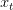
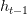
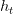
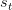
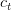
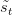

# 基于 TensorFlow 和 Keras 的 Luong 注意力神经机器翻译

> 原文：<https://pyimagesearch.com/2022/08/29/neural-machine-translation-with-luongs-attention-using-tensorflow-and-keras/>

* * *

## **目录**

* * *

## [**神经机器翻译用 Luong 的注意力使用 TensorFlow 和 Keras**](#TOC)

之前关于神经机器翻译的教程是我们第一次涉及*注意力*(巴丹瑙的注意力)*的地方。*我们不仅学习了背后的数学知识，还从头开始动手训练了 TensorFlow 模型。如果你还没有阅读它，请在阅读本教程之前阅读它。

在本教程中，您将了解如何利用 [Luong 的注意力](https://arxiv.org/abs/1508.04025)实现神经机器翻译，以及它如何增强 [Bahdanau 的注意力](https://arxiv.org/abs/1409.0473)中引入的注意力机制。

谷歌翻译够了。我们还有一个互动演示，你可以看到训练有素的模型在行动。

 <gradio-app space="pyimagesearch/nmt-luong">本课是关于 NLP 103 的两部分系列的最后一课:

1.  [*神经机器翻译用 Bahdanau 的注意力使用 TensorFlow 和 Keras*](https://pyimg.co/kf8ma)
2.  [***神经机器翻译用 Luong 的注意力使用 TensorFlow 和 Keras***](https://pyimg.co/tpf3l) **(本教程)**

**要学习如何将 Luong 的注意力应用到神经机器翻译任务中，** ***只要保持阅读。***

* * *

## [**神经机器翻译用 Luong 的注意力使用 TensorFlow 和 Keras**](#TOC)

* * *

### [**简介**](#TOC)

在学术论文[基于注意力的神经机器翻译的有效方法](https://arxiv.org/abs/1508.04025)中，Luong 等人为**提供了更有效的**建立注意力的方法。这里我们要注意，注意力背后的基本直觉是不变的。Luong 等人提供的补充是*迭代变化*，使注意力**过程更简单**和**更高效**。

在 [Bahdanau 等人](https://arxiv.org/abs/1409.0473)、 [Luong 等人](https://arxiv.org/abs/1508.04025)工作的基础上。在正常的注意力架构中添加他们自己的扭曲，建议微妙的变化，以突破旧架构的限制。

***注意:*** *我们不会深入整个代码演练，因为在 Bahdanau 的注意力教程中已经介绍过了。本教程将涵盖重大变化以及如何在 TensorFlow 和 Keras 中实现它们。*

* * *

### [**配置您的开发环境**](#TOC)

要遵循该指南，您需要在系统上安装`tensorflow`和`tensorflow-text`。

幸运的是，TensorFlow 可以在 pip 上安装:

```py
$ pip install tensorflow==2.8.0
$ pip install tensorflow-text==2.8.0
```

* * *

### [**在配置开发环境时遇到了问题？**](#TOC)

说了这么多，你是:

*   时间紧迫？
*   了解你雇主的行政锁定系统？
*   想要跳过与命令行、包管理器和虚拟环境斗争的麻烦吗？
*   **准备好在您的 Windows、macOS 或 Linux 系统上运行代码*****？***

 *那今天就加入 [PyImageSearch 大学](https://pyimagesearch.com/pyimagesearch-university/)吧！

**获得本教程的 Jupyter 笔记本和其他 PyImageSearch 指南，这些指南是** ***预先配置的*** **，可以在您的网络浏览器中运行在 Google Colab 的生态系统上！**无需安装。

最棒的是，这些 Jupyter 笔记本可以在 Windows、macOS 和 Linux 上运行！

* * *

### [**项目结构**](#TOC)

我们首先回顾我们的项目目录结构。

首先访问本教程的 ***“下载”*** 部分，检索源代码和示例图像。

从这里，看一下目录结构:

```py
├── download.sh
├── inference.py
├── output
│   └── loss.png
├── pyimagesearch
│   ├── config.py
│   ├── dataset.py
│   ├── __init__.py
│   ├── loss.py
│   ├── models.py
│   ├── schedule.py
│   └── translator.py
├── requirements.txt
└── train.py
```

在`pyimagesearch`目录中，我们有:

*   `config.py`:任务的配置文件
*   `dataset.py`:数据集管道的实用程序
*   `loss.py`:保存训练模型所需损失的代码片段
*   `models.py`:翻译模型的编码器和解码器
*   `schedule.py`:培训管道的学习率计划程序
*   训练和推理模型

在核心目录中，我们有四个脚本:

*   `download.sh`:下载训练数据的 shell 脚本
*   `requirements.txt`:本教程需要的 python 包
*   `train.py`:运行脚本来训练模型
*   `inference.py`:推理脚本

* * *

### [**卢昂的注意力**](#TOC)

Luong 等人建议对**解码器**的架构进行一些*小*但*必要的*改变。我们先讲编码器，注意层，然后是解码器。在讨论架构时，我们还会将其与 Bahdanau 等人的架构进行比较。考虑图 2 中的图表。

* * *

### [**编码器架构**](#TOC)

在本文中，作者为编码器选择了一种*单向*(而不是 Bahdanau 实现中的双向)递归神经架构。单向 RNNs 加快了计算速度。

对于编码器，我们选择一个门控循环单元(GRU ),它接受当前输入

and past hidden state as input while processing them into the present hidden state .

在将整个源句子传递给编码器之后，我们有了所有隐藏状态的集合。

* * *

### [**解码器架构**](#TOC)

在每个时间步，

, in the decoding phase, the main motive is to capture the present hidden state of the decoder, , and then to derive a context vector, , that captures relevant source-side information.

具体来说，给定目标隐藏状态，

, and the source-side context vector, , we employ a simple concatenation layer to combine the information from both vectors to produce an attentional hidden state as follows:

注意力向量

, is then fed through the softmax layer to produce the probability of the next decoder word.

数学术语说够了，让我们只关注作者提议改变注意力层的部分。

Bahdanau 从:

Luong 从:

* * *

### [**输入进料方式**](#TOC)

在目前的提议下，作者发现他们没有把注意力放在解码器的循环单元上。这意味着解码系统不知道源句子的哪一部分在前一步被注意到了。

考虑到这一点，他们现在建议将注意力与输入和隐藏状态一起提供给下一个解码器单元。这被证明是一个游戏规则的改变。虽然 Bahdanau 的模型中已经安装了这种机制，但 Luong 的模型必须明确地做到这一点。

**图 3** 显示了 Luong 等人设想的整个编码和解码机制。

* * *

### [**实施**的注意](#TOC)

由于所有的方法和功能都与 Bahdanau 的注意力相同，我们将在本教程中讨论 Luong 的注意力模块。整个代码演练在本系列的[上一篇博文](https://pyimg.co/kf8ma)中有所介绍。

如果您还没有阅读，请务必在继续下一步之前阅读。如果您已经这样做了，让我们打开`pyimagesearch`目录中的`models.py`并浏览它。

```py
class LuongAttention(Layer):
    def __init__(self, attnUnits, **kwargs):
        super().__init__(**kwargs)
        # initialize the attention units
        self.attnUnits = attnUnits

    def build(self, inputShape):
        # build the additive attention layer
        self.attention = Attention()

    def get_config(self):
        # return the configuration of the layer
        return {
            "attnUnits": self.attnUnits,
        }

    def call(self, hiddenStateEnc, hiddenStateDec, mask):
        # grab the source and target mask
        sourceMask = mask[0]
        targetMask = mask[1]

        # apply attention to align the representations
        (contextVector, attentionWeights) = self.attention(
            inputs=[hiddenStateDec, hiddenStateEnc, hiddenStateEnc],
            mask=[targetMask, sourceMask],
            return_attention_scores=True
        )

        # return the context vector and the attention weights
        return (contextVector, attentionWeights)
```

我们首先在`LuongAttention`类的`__init__`函数中初始化**行 80** 上的关注单元。

接下来，在**的第 82-84 行**，我们在`build`函数中构建关注层。我们返回`get_config`函数**(第 86-90 行)**中的注意单元。

在第 92 行的**上，我们定义了`call`方法。首先，我们提取第 94 行和第 95 行**上的`sourceMask`和`targetMask`。

在第**行第 98-102** 行，我们注意对齐表示。我们使用 TensorFlow 的整洁的注意力 API 来实现这一点。你可以从官方 TensorFlow 文档[这里](https://www.tensorflow.org/api_docs/python/tf/keras/layers/Attention)了解更多信息。

最后在**的第 105 行**，我们返回`contextVector`和`attentionWeights`。

* * *

## [**汇总**](#TOC)

本教程向我们展示了 Luong 的注意力改善神经机器翻译任务的具体方式。我们还学习了如何简单地使用 Keras 和 TensorFlow 实现注意力模块。

Bahdanau 和 Luong 的关注既不是最先进的技术，也没有在 NLP 系统中广泛使用。但它们确实为接下来的事情提供了一块垫脚石和一个具体的基础。

我们将带着另一个关于注意力及其用途的教程回来，但在那之前，这里有一点值得思考的东西:

“如果我们在一个架构中只使用注意力，会发生什么？?"

* * *

### [**引用信息**](#TOC)

A. R. Gosthipaty 和 R. Raha。“使用 TensorFlow 和 Keras 的 Luong 注意力的神经机器翻译”， *PyImageSearch* ，P. Chugh，S. Huot，K. Kidriavsteva，A. Thanki，eds .，2022 年，【https://pyimg.co/tpf3l 

```py
@incollection{ARG-RR_2022_Luong,
  author = {Aritra Roy Gosthipaty and Ritwik Raha},
  title = {Neural Machine Translation with {Luong’s} Attention Using {TensorFlow} and {Keras}},
  booktitle = {PyImageSearch},
  editor = {Puneet Chugh and Susan Huot and Kseniia Kidriavsteva and Abhishek Thanki},
  year = {2022},
  note = {https://pyimg.co/tpf3l},
}
```

* * *

**要下载这篇文章的源代码(并在未来教程在 PyImageSearch 上发布时得到通知)，*只需在下面的表格中输入您的电子邮件地址！****</gradio-app>