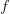
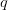
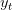
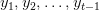
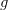

# 神经机器翻译

> 原文：<https://pyimagesearch.com/2022/08/15/neural-machine-translation/>

* * *

## **目录**

* * *

## [**神经机器翻译**](#TOC)

在本教程中，您将了解神经机器翻译的核心概念和注意力的初级读本。

本课是 NLP 102 的三部分系列的最后一部分:

1.  [*带 Keras 和 TensorFlow 的递归神经网络简介*](https://pyimg.co/a3dwm)
2.  [*长短期记忆网络*](https://pyimg.co/wtby9)
3.  [](https://pyimg.co/4yi97)***(今日教程)***

 ***要了解神经机器翻译的工作原理及其背后的数学原理，请继续阅读。**

* * *

## [**神经机器翻译**](#TOC)

* * *

### [**简介**](#TOC)

想象一下，你在网上找到一篇关于一个非常有趣的话题的文章。幸运的是，它不是你的母语，也不是你在交谈时感到舒服的语言。你暗自发笑，但随后找到了一个翻译文本的选项(如图**图 1** 所示)。

你感谢科技之神，阅读这篇文章，然后继续你的一天。但是有东西点击了，网页可能已经超过 2500 个单词，然而翻译在几秒钟内就完成了。因此，除非有一个速度超快的人在浏览器内部的某个地方敲击键盘，否则这一定是由算法完成的。

但是算法怎么这么准呢？是什么让这样的算法在世界上任何一种语言中都表现得很健壮？

这是自然语言处理的一个特殊领域，称为**神经机器翻译**，定义为在人工神经网络的帮助下进行翻译的行为。

在本教程中，我们将了解:

*   神经机器翻译如何工作
*   这项任务的两篇非常重要的论文的概述
    *   [联合学习对齐和翻译的神经机器翻译](https://arxiv.org/abs/1409.0473)
    *   [基于注意力的神经机器翻译的有效方法](https://arxiv.org/abs/1508.04025)
*   我们将在后面的教程中使用的数据集

* * *

### [**配置您的开发环境**](#TOC)

要遵循本指南，您需要在系统上安装 TensorFlow 和 TensorFlow 文本库。

幸运的是，两者都是 pip 可安装的:

```py
$ pip install tensorflow
$ pip install tensorflow-text
```

* * *

### [**在配置开发环境时遇到了问题？**](#TOC)

说了这么多，你是:

*   时间紧迫？
*   了解你雇主的行政锁定系统？
*   想要跳过与命令行、包管理器和虚拟环境斗争的麻烦吗？
*   **准备好在您的 Windows、macOS 或 Linux 系统上运行代码*****？***

 *那今天就加入 [PyImageSearch 大学](https://pyimagesearch.com/pyimagesearch-university/)吧！

**获得本教程的 Jupyter 笔记本和其他 PyImageSearch 指南，这些指南是** ***预先配置的*** **，可以在您的网络浏览器中运行在 Google Colab 的生态系统上！**无需安装。

最棒的是，这些 Jupyter 笔记本可以在 Windows、macOS 和 Linux 上运行！

* * *

### [**概率神经机器翻译概述**](#TOC)

如果这听起来有点拗口，不要担心，我们保证这一切很快就会有意义。但是，在我们继续之前，让我们先花点时间来回忆一下*概率*。

")

refers to a probability of the event occurring given has occurred. Now imagine and as a sequence of French and English words, respectively. If we apply the same definition of conditional probability here, it will mean ")is the probability of a sequence of words in French ")occurring, given there is a sequence of words in English ").

这意味着翻译(从英语到法语)的任务是最大化这种可能性")

, as shown in **Figure 3**. )")

神经网络的任务是学习条件分布，然后当给定一个源句子时，通过最大化这个条件概率来搜索合适的目标句子。

* * *

### [**数学背后的神经机器翻译**](#TOC)

神经机器翻译(NMT)是利用人工神经网络来最大化这种条件概率的过程。

一个 NMT 架构通常包括一个编码器和一个解码器，如图**图 4** 所示。

在 [Bahdanau](https://arxiv.org/abs/1409.0473) 和 [Luong](https://arxiv.org/abs/1508.04025) 之前，编码器和解码器仅使用递归来解决机器翻译任务。在这一节中，我们将讨论仅使用 rnn 作为编码器和解码器来建模翻译背后的**数学**。

让我们考虑编码器中 RNN 隐藏状态的方程。

这里

is a network (can be an RNN, LSTM, or GRU). The main motivation here is to understand that the current hidden state () depends on the current input () and the previous hidden state (). This recursive cell output feeding to the next has already been explained in our [Introduction to RNN blog post](https://pyimg.co/a3dwm). We advise you to quickly read our RNN series (if not done already) to get a primer on the same.

NMT 的编码器创建一个**瓶颈固定大小向量**(上下文向量，

) from all the hidden states of the encoder. The context vector () will be used by the decoder to get to the target sequence.



can be any non-linearity. You will most likely find to be the last hidden state 

解码器预测下一个字

given the context vector () and all the previously predicted words {}.

现在让我们重写概率方程。

")

is the hidden state of the decoder. Just like the hidden state of the encoder, can be any recurrent architecture (RNN, LSTM, or GRU).



can be any non-linearity that outputs the probability of the next word given all the previously generated words and the context vector.

对于翻译任务，我们必须生成最大化条件概率的目标词")

.

**TL；DR:** 本质上发生的是一个可变长度的序列被传递给一个编码器，它将整个序列的表示压缩成一个**固定的上下文向量**。这个上下文向量然后被传递给解码器，解码器将其转换成目标序列。

* * *

### [**前方是什么？**](#TOC)

在引言中，我们提到了两篇开创性的论文:

*   [**通过联合学习对齐和翻译的神经机器翻译**](https://arxiv.org/abs/1409.0473) **:** 在本文中，作者认为将变长序列编码成定长上下文向量会恶化翻译的性能。为了解决这个问题，他们提出了一个软注意方案。注意到位后，上下文向量现在将对整个输入序列有一个完整的概述。

    对于每一个翻译的单词，只为当前翻译构建一个动态上下文向量。

*   [**基于注意力的神经机器翻译的有效途径**](https://arxiv.org/abs/1508.04025) **:** 本文作者改进了其前辈的几个关键因素([神经机器翻译通过联合学习对齐和翻译](https://arxiv.org/abs/1409.0473))。

    这些包括为编码器引入单向 RNN，以及用乘法加法代替加法。本文旨在建立一种更好、更有效(顾名思义)的基于注意力的神经机器翻译方法。

* * *

### [**数据集**](#TOC)

你想知道如何编写代码并拥有自己的翻译算法吗？

我们将在即将发表的两篇讨论 Bahdanau 和 Luong 关注点的博文中用到这个数据集。

由于这是一个文本翻译任务，我们将需要一个文本对来完成这个任务。我们使用来自 http://www.manythings.org/anki/的法语到英语的数据集

您可以使用以下代码片段将数据集下载到 Colab 笔记本或您的本地系统中:

```py
$ wget https://www.manythings.org/anki/fra-eng.zip
$ unzip fra-eng.zip
$ rm _about.txt fra-eng.zip
```

我们将在接下来的教程中详细介绍数据集的加载和处理。

* * *

* * *

## [**汇总**](#TOC)

本教程介绍神经机器翻译。我们学习如何用概率术语表达神经机器翻译。我们看到了 NMT 建筑通常是如何实地设计的。

接下来，我们将了解 Bahdanau 和 Luong 注意事项及其在 TensorFlow 和 Keras 中的代码实现。

* * *

### [**引用信息**](#TOC)

A. R. Gosthipaty 和 R. Raha。“神经机器翻译”， *PyImageSearch* ，P. Chugh，S. Huot，K. Kidriavsteva，和 A. Thanki 合编。，2022 年，【https://pyimg.co/4yi97 

```py
@incollection{ADR_2022_NMT,
  author = {Aritra Roy Gosthipaty and Ritwik Raha},
  title = {Neural Machine Translation},
  booktitle = {PyImageSearch},
  editor = {Puneet Chugh and Susan Huot and Kseniia Kidriavsteva and Abhishek Thanki},
  year = {2022},
  note = {https://pyimg.co/4yi97},
}
```

* * ***