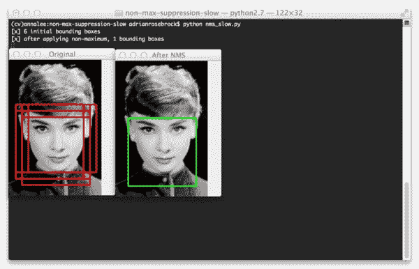
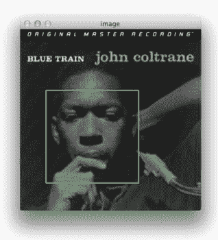
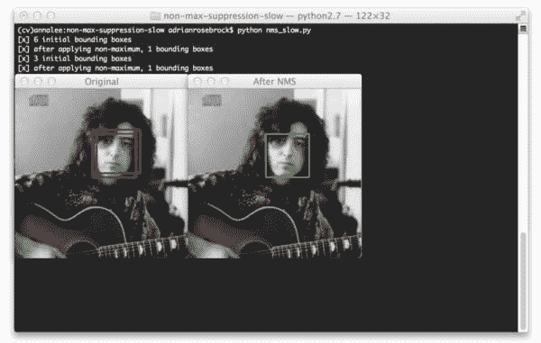
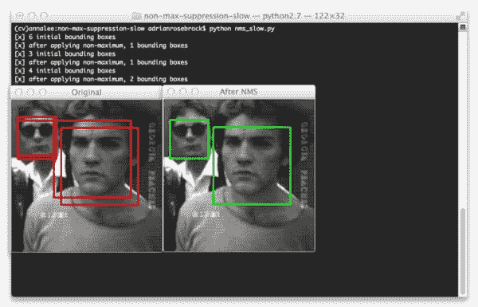

# Python 中对象检测的非最大抑制

> 原文：<https://pyimagesearch.com/2014/11/17/non-maximum-suppression-object-detection-python/>

[](https://pyimagesearch.com/wp-content/uploads/2014/10/nms_slow_01.jpg)

康涅狄格州很冷。非常冷。有时候早上起床都很难。老实说，如果没有大量南瓜香料拿铁的帮助，没有秋叶上美丽的日出，我不认为我会离开我舒适的床。

但是我有工作要做。今天的工作包括写一篇关于 Felzenszwalb 等人的非最大抑制方法的博文。

如果你还记得的话，上周我们讨论了用于目标检测的[方向梯度直方图](https://pyimagesearch.com/2014/11/10/histogram-oriented-gradients-object-detection/)。

该方法可分为 **6 步流程**，包括:

1.  取样正面图像
2.  消极图像取样
3.  训练线性 SVM
4.  执行硬负挖掘
5.  使用硬负样本重新训练你的线性 SVM
6.  在测试数据集上评估您的分类器，利用非最大抑制来忽略冗余、重叠的边界框

应用这些步骤后，你将拥有一个平滑的物体检测器，就像约翰·科尔特兰一样:

[](https://pyimagesearch.com/wp-content/uploads/2014/10/nms_john_coltrane.jpg)

**Figure 1:** My Python object detection framework applied to face detection. Even in low contrast images, faces can be easily detected.

*(注:本文中使用的图像取自[麻省理工学院+ CMU 正面人脸图像数据集](http://vasc.ri.cmu.edu/idb/html/face/frontal_images/) )*

这些是使用方向梯度直方图建立对象分类器所需的最少步骤。该方法的扩展包括 Felzenszwalb 等人的[可变形零件模型](http://cs.brown.edu/~pff/papers/lsvm-pami.pdf)和 Malisiewicz 等人的[样本 SVM](http://www.cs.cmu.edu/~efros/exemplarsvm-iccv11.pdf) 。

然而，无论您选择哪种 HOG +线性 SVM 方法，您都将(几乎 100%确定)检测到图像中对象周围的多个边界框。

例如，看看这篇文章顶部奥黛丽·赫本的照片。我使用 HOG 和线性 SVM 将我的 Python 框架分叉用于对象检测，并训练它检测人脸。显然，它已经在图像中找到了赫本女士的脸——但是探测总共发射了六次**！**

 **虽然每个检测事实上可能是有效的，但我肯定不希望我的分类器向我报告说它发现了六张脸，而实际上只有一张脸，即 T2 的脸。就像我说的，这是利用物体检测方法时的常见“问题”。

其实我根本就不想称之为“问题”！这是一个好问题。这表明您的检测器工作正常。如果你的检测器(1)报告了一个假阳性(即检测到了一个没有人脸的人脸)或者(2)没有检测到人脸，那就更糟了。

为了解决这种情况，我们需要应用非最大值抑制(NMS)，也称为非最大值抑制。

当我第一次实现我的 Python 对象检测框架时，我不知道一个好的非最大抑制的 Python 实现，所以我联系了我的朋友 Tomasz Malisiewicz 博士，我认为他是对象检测和 HOG 方面的“专家”。

Tomasz 是这方面无所不知的权威，他向我推荐了 MATLAB 中的两个实现，后来我用 Python 实现了这两个实现。我们将回顾 Felzenszwalb etl al 的 [first 方法。](https://github.com/rbgirshick/voc-dpm/blob/master/test/nms.m)那么，下周我们就来回顾一下托马斯自己实现的(更快的)非最大值抑制法。

所以不要耽搁，让我们动手吧。

**OpenCV 和 Python 版本:**
这个例子将运行在 **Python 2.7/Python 3.4+** 和 **OpenCV 2.4.X/OpenCV 3.0+** 上。

# Python 中对象检测的非最大抑制

打开一个文件，将其命名为`nms.py`，让我们开始在 Python 中实现 Felzenszwalb 等人的非最大值抑制方法:

```py
# import the necessary packages
import numpy as np

#  Felzenszwalb et al.
def non_max_suppression_slow(boxes, overlapThresh):
	# if there are no boxes, return an empty list
	if len(boxes) == 0:
		return []

	# initialize the list of picked indexes
	pick = []

	# grab the coordinates of the bounding boxes
	x1 = boxes[:,0]
	y1 = boxes[:,1]
	x2 = boxes[:,2]
	y2 = boxes[:,3]

	# compute the area of the bounding boxes and sort the bounding
	# boxes by the bottom-right y-coordinate of the bounding box
	area = (x2 - x1 + 1) * (y2 - y1 + 1)
	idxs = np.argsort(y2)

```

我们将从第 2 行的**开始，导入一个包 NumPy，我们将利用它进行数值处理。**

从那里，我们在第 5 行的**上定义我们的`non_max_suppression_slow`函数。这个函数接受参数，第一个是我们的边界框集，形式为 *(startX，startY，endX，endY)* ，第二个是我们的重叠阈值。我将在本文稍后讨论重叠阈值。**

**第 7 行和第 8 行**快速检查边界框。如果列表中没有边界框，只需向调用者返回一个空列表。

从那里，我们在第 11 行**上初始化我们挑选的边界框列表(即我们想要保留的边界框，丢弃其余的)。**

让我们继续在**行 14-17** 上解开边界框每个角的 *(x，y)* 坐标——这是使用简单的 NumPy 数组切片完成的。

然后我们使用我们的切片 *(x，y)* 坐标计算**行 21** 上每个边界框的面积。

务必密切关注**线 22** 。我们应用`np.argsort`来抓取边界框的****y 坐标**** *的 ***排序*** 坐标的索引。我们根据右下角排序是绝对关键的，因为我们将需要在这个函数的后面计算其他边界框的重叠率。*

 *现在，让我们进入非极大值抑制函数的核心部分:

```py
	# keep looping while some indexes still remain in the indexes
	# list
	while len(idxs) > 0:
		# grab the last index in the indexes list, add the index
		# value to the list of picked indexes, then initialize
		# the suppression list (i.e. indexes that will be deleted)
		# using the last index
		last = len(idxs) - 1
		i = idxs[last]
		pick.append(i)
		suppress = [last]

```

我们从第 26 行的**开始循环我们的索引，在这里我们将继续循环，直到我们用完了要检查的索引。**

从那里，我们将获取第 31 行**的`idx`列表的长度，获取第 32** 行**的`idx`列表中最后一个条目的值，将索引`i`附加到我们的边界框列表中以保留在第 33 行**上，最后用第 34**** 行**的索引列表的最后一个条目的索引初始化我们的`suppress`列表(我们想要忽略的框列表)。**

那是一口。因为我们处理的是索引列表中的索引，所以解释起来并不容易。但是一定要在这里停下来检查一下这些代码，因为理解这些代码很重要。

是时候计算重叠率并确定我们可以忽略哪些边界框了:

```py
		# loop over all indexes in the indexes list
		for pos in xrange(0, last):
			# grab the current index
			j = idxs[pos]

			# find the largest (x, y) coordinates for the start of
			# the bounding box and the smallest (x, y) coordinates
			# for the end of the bounding box
			xx1 = max(x1[i], x1[j])
			yy1 = max(y1[i], y1[j])
			xx2 = min(x2[i], x2[j])
			yy2 = min(y2[i], y2[j])

			# compute the width and height of the bounding box
			w = max(0, xx2 - xx1 + 1)
			h = max(0, yy2 - yy1 + 1)

			# compute the ratio of overlap between the computed
			# bounding box and the bounding box in the area list
			overlap = float(w * h) / area[j]

			# if there is sufficient overlap, suppress the
			# current bounding box
			if overlap > overlapThresh:
				suppress.append(pos)

		# delete all indexes from the index list that are in the
		# suppression list
		idxs = np.delete(idxs, suppress)

	# return only the bounding boxes that were picked
	return boxes[pick]

```

这里我们开始循环第 37 行的**列表中的(剩余)索引，获取第 39** 行的**当前索引的值。**

使用来自**行 32** 的`idx`列表中的 ***最后一个*** 条目和来自**行 39** 的`idx`列表中的 ***当前*** 条目，我们找到最大的**(x，y)* 坐标为起始边界框和最小的**(x，y)***

 **这样做可以让我们在较大的边界框中找到当前最小的区域(这也是我们最初根据右下角的 y 坐标对`idx`列表进行排序如此重要的原因)。从那里，我们计算第 50 和 51 行上的区域的宽度和高度。

现在，我们正处于重叠阈值发挥作用的时刻。在**第 55** 行，我们计算`overlap`，它是由当前最小区域的面积除以当前边界框的面积定义的比率，其中“当前”由**第 39** 行的索引`j`定义。

如果`overlap`比率大于**行 59** 上的阈值，那么我们知道两个边界框充分重叠，因此我们可以抑制当前边界框。`overlapThresh`的常用值通常在 0.3 和 0.5 之间。

**第 64 行**然后从`idx`列表中删除被抑制的边界框，我们继续循环直到`idx`列表为空。

最后，我们在第 67 行**返回一组挑选的边界框(没有被抑制的边界框)。**

让我们继续创建一个驱动程序，这样我们就可以执行这段代码并看到它的运行。打开一个新文件，将其命名为`nms_slow.py`，并添加以下代码:

```py
# import the necessary packages
from pyimagesearch.nms import non_max_suppression_slow
import numpy as np
import cv2

# construct a list containing the images that will be examined
# along with their respective bounding boxes
images = [
	("images/audrey.jpg", np.array([
	(12, 84, 140, 212),
	(24, 84, 152, 212),
	(36, 84, 164, 212),
	(12, 96, 140, 224),
	(24, 96, 152, 224),
	(24, 108, 152, 236)])),
	("images/bksomels.jpg", np.array([
	(114, 60, 178, 124),
	(120, 60, 184, 124),
	(114, 66, 178, 130)])),
	("images/gpripe.jpg", np.array([
	(12, 30, 76, 94),
	(12, 36, 76, 100),
	(72, 36, 200, 164),
	(84, 48, 212, 176)]))]

# loop over the images
for (imagePath, boundingBoxes) in images:
	# load the image and clone it
	print "[x] %d initial bounding boxes" % (len(boundingBoxes))
	image = cv2.imread(imagePath)
	orig = image.copy()

	# loop over the bounding boxes for each image and draw them
	for (startX, startY, endX, endY) in boundingBoxes:
		cv2.rectangle(orig, (startX, startY), (endX, endY), (0, 0, 255), 2)

	# perform non-maximum suppression on the bounding boxes
	pick = non_max_suppression_slow(boundingBoxes, 0.3)
	print "[x] after applying non-maximum, %d bounding boxes" % (len(pick))

	# loop over the picked bounding boxes and draw them
	for (startX, startY, endX, endY) in pick:
		cv2.rectangle(image, (startX, startY), (endX, endY), (0, 255, 0), 2)

	# display the images
	cv2.imshow("Original", orig)
	cv2.imshow("After NMS", image)
	cv2.waitKey(0)

```

我们从在第 2 行的**上导入我们的`non_max_suppression_slow`函数开始。出于组织目的，我将该函数放在了`pyimagesearch`包中，但是您可以将该函数放在您认为合适的任何地方。从那里，我们为数值处理导入 NumPy，为第 3-4 行**的 OpenCV 绑定导入`cv2`。****

然后，我们在第 8 行的**上定义一个`images`的列表。该列表由 2 元组组成，其中元组中的第一个条目是图像的路径，第二个条目是边界框的列表。这些边界框是从我的 HOG +线性 SVM 分类器获得的，该分类器在不同的位置和尺度检测潜在的“人脸”。我们的目标是为每幅图像获取一组边界框，并应用非最大抑制。**

我们首先在第 27 行的**上循环图像路径和边界框，并在第 30** 行的**上加载图像。**

为了可视化非最大抑制的效果，我们首先在第 34 行和第 35 行上绘制原始(非抑制)边界框。

然后我们在第 38 行**上应用非最大抑制，并在第 42-43** 行**上绘制拾取的边界框。**

最终得到的图像显示在第 46-48 行**上。**

# 动作中的非最大抑制

要查看 Felzenszwalb 等人的非最大抑制方法，请从本页底部下载本文的源代码和附带图像，导航到源代码目录，并发出以下命令:

```py
$ python nms_slow.py

```

首先，你会看到奥黛丽·赫本的形象:

[](https://pyimagesearch.com/wp-content/uploads/2014/10/nms_slow_01.jpg)

**Figure 2:** Our classifier initially detected **six** bounding boxes, but by applying non-maximum suppression, we are left with only **one** (the correct) bounding box.

注意**六个**边界框是如何被检测到的，但是通过应用非最大值抑制，我们能够将这个数量减少到**一个**。

第二幅图像也是如此:

[](https://pyimagesearch.com/wp-content/uploads/2014/10/nms_slow_02.jpg)

**Figure 3:** Initially detecting **three** bounding boxes, but by applying non-maximum suppression we can prune the number of overlapping bounding boxes down to **one**.

这里我们已经找到了对应于同一个面的**三个**包围盒，但是非最大抑制将要把这个数目减少到**一个**包围盒。

到目前为止，我们只检查了包含一张脸的图像。但是包含多张脸的图片呢？让我们来看看:

[](https://pyimagesearch.com/wp-content/uploads/2014/10/nms_slow_03.jpg)

**Figure 4:** Non-maximum suppression correctly handles when there are multiple faces, suppressing the smaller overlapping bounding boxes, but retaining the boxes that do not overlap.

即使对于包含多个对象的图像，非最大抑制也能够忽略较小的重叠边界框，只返回较大的边界框。非最大值抑制在这里返回**两个**边界框，因为每个面的边界框。即使它们*和*重叠，重叠率也不会超过提供的阈值 0.3。

# 摘要

在这篇博文中，我展示了如何应用 Felzenszwalb 等人的方法进行非最大抑制。

当使用梯度方向直方图描述符和线性支持向量机进行对象分类时，您几乎*总是*检测围绕您想要检测的对象的多个边界框。

你应该首先应用非最大值抑制来忽略明显相互重叠的边界框，而不是返回所有找到的边界框。

然而，对于非最大抑制，对 Felzenszwalb 等人的方法还有待改进。

在我的下一篇文章中，我将实现我的朋友托马斯·马利西维茨博士建议的方法，据报道这种方法要快 100 倍！

请务必使用下面的表格下载这篇文章的代码！当我们下周检查 Tomasz 的非最大抑制算法时，您肯定希望手头有它！*****