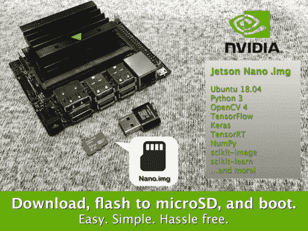
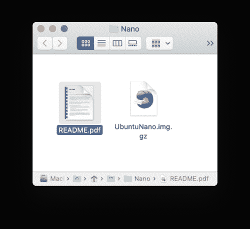
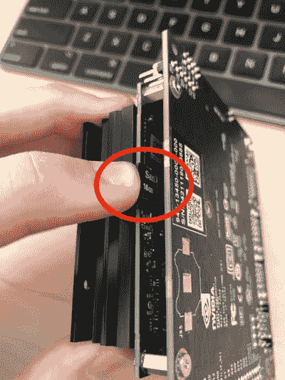
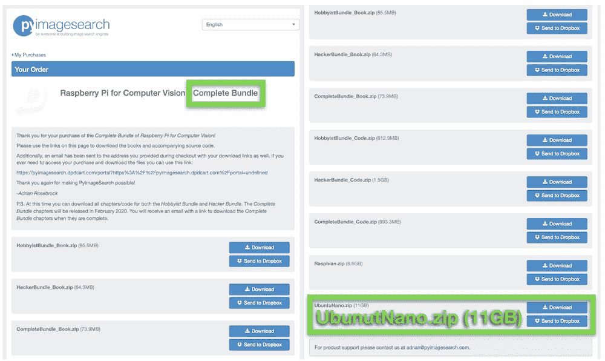
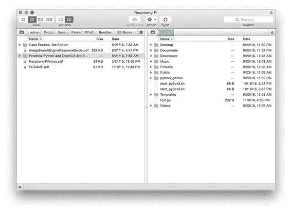
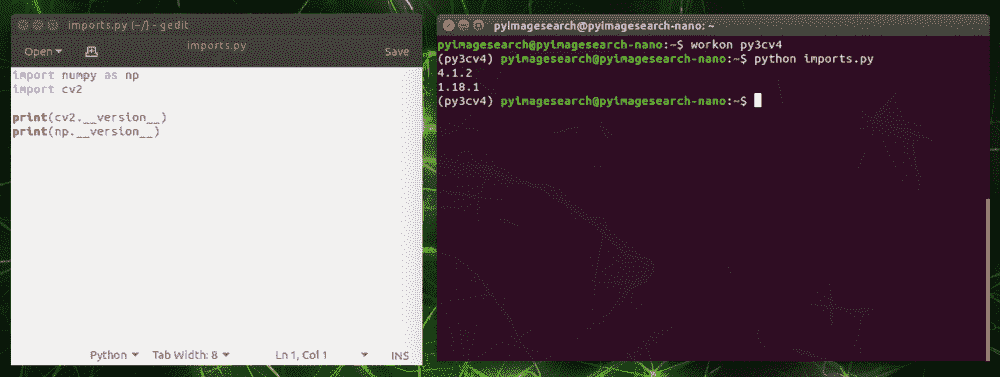
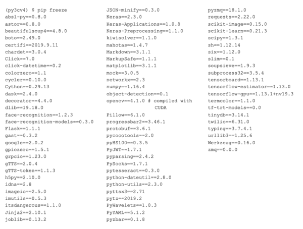

# 英伟达杰特森纳米。为深度学习和计算机视觉预先配置的 img

> 原文：<https://pyimagesearch.com/2020/03/04/nvidia-jetson-nano-img-pre-configured-for-deep-learning-and-computer-vision/>



在本教程中，您将学习如何使用我的预配置的 NVIDIA Jetson Nano。计算机视觉和深度学习 img。这个。img 包括 TensorFlow，Keras，TensorRT，OpenCV 等。预装！

如果你曾经配置过 NVIDIA 的产品，比如 TX1、TX2，甚至 Nano，你就会知道使用 NVIDIA 的 Jetpack 和安装库远非简单明了。

今天，我很高兴地宣布我的预配置 NVIDIA Jetson Nano。img！

这个。img 将节省您设置 NVIDIA Jetson Nano 的时间，如果不是几天的话。它是由我在 PyImageSearch 的团队开发和支持的，旨在节省您的时间，让您快速开发自己的嵌入式 CV/DL 项目，并跟随我的新书*[Raspberry Pi for Computer Vision](https://pyimagesearch.com/raspberry-pi-for-computer-vision/)。*

如果你购买了计算机视觉的*树莓 Pi 的*完整套装*的副本，你将获得这个附带的. img*

你所要做的就是(1)下载。img 文件，(2)使用 balenaEtcher 将其闪存到您的 microSD 卡，以及(3)启动您的 NVIDIA Jetson Nano。

从那里，您将有一个完整的软件列表，可以在虚拟环境中运行，而没有配置、编译和安装软件的所有麻烦。图像上突出显示的软件包括但不限于 Python、OpenCV、TensorFlow、TensorFlow Lite、Keras 和 TensorRT。

**了解更多关于 Jetson Nano 的信息。img，*继续看*。**

## 英伟达杰特森纳米。img 针对深度学习和计算机视觉进行了预配置

通常，设置你的 NVIDIA Jetson Nano 需要**三天**才能使它完全能够处理深度学习驱动的推理。这包括:

*   系统级包
*   从源代码编译的 OpenCV(支持 CUDA)
*   英伟达发布的 TensorFlow 1.13.1
*   滕索特
*   所需的 Python 库
*   研究时间，反复试验，从头开始，用头敲键盘

是的，我们 PyImageSearch 在 2-3 天的时间里做了所有这些事情。我们一直都在做这种事情。如果你没有同样的经历，你可能会花一周时间**弄清楚如何配置杰特森纳米。而且即使你很有经验，也许你只是目前没有时间(你宁愿专注于培训和部署)。**

 **让我们面对现实吧:系统管理工作一点也不有趣，而且非常令人沮丧。

**通过捆绑预配置的 Nano。img 连同 *[树莓为计算机视觉](https://pyimagesearch.com/raspberry-pi-for-computer-vision/)完成捆绑*，我的目标是:**

1.  跳过在 Jetson Nano 上安装 Python、OpenCV、TensorFlow/Keras、TensorRT 等的繁琐过程，启动您的计算机视觉和深度学习教育
2.  为你提供一本书，里面有你可能得到的关于嵌入式计算机视觉和深度学习的最佳介绍

这种预先配置的纳米。img 面向 PyImageSearch 的读者，他们希望 ***节省时间*** 和 ***启动他们的计算机视觉教育。***

如果听起来不像你，不用担心。我仍然会提供免费教程来帮助您配置您的 Jetson Nano。请记住，PyImageSearch 的[客户获得优先支持](https://pyimagesearch.com/faqs/single-faq/can-i-send-you-emails-or-ask-you-questions/)。

### 杰森·纳诺。img 设置说明

本文档的其余部分描述了如何 ***安装和使用***NVIDIA Jetson Nano。img 包含在您购买的用于计算机视觉的 *[树莓 Pi](https://pyimagesearch.com/raspberry-pi-for-computer-vision/)完整套装*中。

本指南的结尾讨论了许多有关的常见问题(FAQ)。img 文件。如果您有 FAQ 中未涉及的问题，[请给我们发送消息](https://pyimagesearch.com/contact/)。

### 步骤#1:下载并解压归档文件



**Figure 1:** After you download and unzip your NVIDIA Jetson Nano pre-configured .img, you’ll be presented with both `UbuntuNano.img.gz` and `README.pdf` files. The `.gz` file is ready to be flashed with balenaEtcher.

当你收到购买链接时，一定要下载这本书，code， [Raspbian。img](https://pyimagesearch.com/2016/11/21/raspbian-opencv-pre-configured-and-pre-installed/) 和 Nano .img。每个文件都是. zip 格式。`UbuntuNano.zip`档案包含预先配置的。img 和一个`README.pdf`文件。

继续使用你最喜欢的解压工具(7zip，Keka，WinRAR 等)解压文件。).一旦你。解压缩后，您将看到一个. img.gz 文件。没有必要提取包含的. img.gz 文件，因为我们将直接使用 balenaEtcher 对它们进行刷新。

解压缩`UbuntuNano.zip`后，你的文件夹应该看起来像**图 1** 。

### 步骤 2:编写。使用 balenaEtcher 将 img 复制到 32GB 的 microSD

[](https://s3-us-west-2.amazonaws.com/static.pyimagesearch.com/nvidia-jetson-nano-preconfigured/nano_img_fashing_with_etcher.gif)

**Figure 2:** Flashing the NVIDIA Jetson Nano .img preconfigured for Deep Learning and Computer Vision.

这辆杰特森·纳诺。img 在 **32GB microSD 卡**上只能*工作。请勿尝试使用 8GB、16GB、64GB、128GB 或更高的卡。虽然从技术上来说，Jetson Nano 支持 32GB 和更高的 microSDs，但我们的。img 只能闪存到 32GB 的存储卡。*

 *另外，我*推荐*高质量的 Sandisk 32GB 98MB/s 卡。它们在[亚马逊](https://amzn.to/2VHlZ3q)和许多在线分销商处都有售。购买非品牌的廉价卡的读者经常会遇到可靠性问题。

编写预配置的 Nano。img 到你的卡，只需使用名为 **[balenaEtcher](https://www.balena.io/etcher/)** 的免费工具(兼容 Mac、Linux 和 Windows)。

**BalenaEtcher 可以处理压缩文件**比如。gz *(加载到蚀刻机之前不需要解压. img . gz)*。

简单来说:

1.  选择`UnuntuNano.img.gz`文件。
2.  指定目标设备(您的 **32GB microSD** )。
3.  点击*闪光灯！*按钮。

刷新可能需要大约 30 分钟或更长时间(远远少于手动安装软件所需的时间)。保持耐心——也许在系统闪烁的时候去散散步、读本书或喝杯茶。没有什么比看着水沸腾或等待油漆变干更好的了，所以抑制你的兴奋，离开你的屏幕。

### 第三步:第一次启动你的 NVIDIA Jetson Nano



**Figure 3:** The microSD card reader slot on your NVIDIA Jetson Nano is located under the heatsink as shown. Simply insert the NVIDIA Jetson Nano .img pre-configured for Deep Learning and Computer Vision and start executing code.

使用预先配置的 PyImageSearch 刷新您的 microSD 后。如**图 3** 所示，将卡插入散热器下的 Jetson Nano。

从那里，启动您的 Jetson Nano，并输入用户名和密码:

*   **用户名:**图片搜索
*   **密码:** pyimagesearch

如果您在登录时遇到问题，很可能是由于您的非美国键盘布局。您可能需要插入一个美国键盘，或者仔细地将您现有的键盘按键映射到用户名和密码。

在登录程序之前或之后的任何时间点，继续将以太网电缆插入 Nano 和您的网络交换机—**Jetson Nano 开箱后不具备 WiFi 功能。**如果您希望使用 WiFi，请滚动到*“向 Jetson Nano 添加 WiFi 模块”*部分。

### 步骤#4:打开终端并激活预配置的虚拟环境


**Figure 4:** To start the Python virtual environment, simply use the workon command in your terminal. You’ll then be working inside a preconfigured deep learning and computer vision environment on your NVIDIA Jetson Nano using the PyImageSearch .img.

我的预配置杰特森纳米。img 配备了深度学习和计算机视觉部署所需的所有软件。你可以在一个名为`py3cv4`的 Python 虚拟环境下找到该软件。

要访问 Python 虚拟环境，只需通过以下方式激活它:

```py
$ workon py3cv4
```

注意图 4 中的【the bash 提示符前面是括号中的环境名。

### 在 Jetson Nano 上执行 PyImageSearch 书籍中的代码

有多种方法可以在您的 Nano 上访问用于计算机视觉的 *Raspberry Pi 的源代码。第一种是使用 web 浏览器下载。zip 存档:*

[](https://pyimagesearch.com/wp-content/uploads/2020/03/nano_img_dpd.png)

**Figure 5:** Downloading the Nano .img, source code, and book volumes from Raspberry Pi for Computer Vision using the Raspberry Pi web browser.

只需下载源代码。直接压缩到您的 Pi。

如果代码当前位于您的笔记本电脑/台式机上，您也可以使用您最喜欢的 SFTP/FTP 客户端，将代码从您的系统传输到您的 Pi:



**Figure 6:** Utilize an SFTP/FTP client to transfer the code from your system to the Raspberry Pi.

或者您可能希望使用 Sublime 等文本编辑器在 Nano 上手动编写代码:



**Figure 7:** Using a text editor to type Python code *(left)*. Executing Python code inside the NVIDIA Jetson Nano preconfigured .img virtual environment, which is ready to go for computer vision and deep learning *(right)*.

我建议要么通过网络浏览器下载这本书的源代码，要么使用 SFTP/FTP，因为这也包括书中使用的*数据集*。然而，手动编码是一种*很好的学习方式，*我也强烈推荐它！

要获得更多关于如何用你的杰特森纳米远程工作的技巧，请务必阅读我的博客文章 ***[【远程开发】](https://pyimagesearch.com/2019/07/01/remote-development-on-the-raspberry-pi-or-amazon-ec2/)*** (尽管文章的标题包含“树莓派”，但这些概念也适用于杰特森纳米)。

### 如何在您的 Jetson Nano 上测试和使用 USB 或 PiCamera

[](https://pyimagesearch.com/wp-content/uploads/2020/03/nano_img_picamera.png)

**Figure 8:** The NVIDIA Jetson Nano is *compatible with a PiCamera* connected to its MIPI port. You can use the PyImageSearch preconfigured Jetson Nano .img for computer vision and deep learning.

Raspberry Pi 用户会很高兴地知道，你在抽屉里为启示录(即，深度学习的僵尸对象检测)**储存的各种 **PiCamera 模块**与 Jetson Nano 兼容！**

在本节中，我们不会检测僵尸。相反，我们将使用一个简短的 Python 脚本简单地测试我们的 USB 和 PiCamera。

在我们开始之前，请前往这篇博文的 ***【下载】*** 部分，并获取。包含代码的 zip。

在里面你会发现一个名为`test_camera_nano.py`的单独的 Python 脚本。现在我们来回顾一下:

```py
# import the necessary packages
from imutils.video import VideoStream
import imutils
import time
import cv2

# grab a reference to the webcam
print("[INFO] starting video stream...")
#vs = VideoStream(src=0).start()
vs = VideoStream(src="nvarguscamerasrc ! video/x-raw(memory:NVMM), " \
	"width=(int)1920, height=(int)1080,format=(string)NV12, " \
	"framerate=(fraction)30/1 ! nvvidconv ! video/x-raw, " \
	"format=(string)BGRx ! videoconvert ! video/x-raw, " \
	"format=(string)BGR ! appsink").start()
time.sleep(2.0)
```

这里我们从`imutils`导入我们的`VideoStream`类。我们将使用这个类来处理(1)PiCamera 或(2)USB 摄像头。

让我们继续在第 9-14 行设置我们的流

*   **USB 摄像头:**目前已在**第 9 行**中注释掉，要使用您的 USB 网络摄像头，您只需提供`src=0`或另一个设备序号，如果您有多个 USB 摄像头连接到您的 Nano。
*   **PiCamera:** 目前活跃在**线 10-14** 上，一个很长的`src`字符串用于与 Nano 上的驱动程序一起工作，以访问插入 MIPI 端口的 PiCamera。如您所见，格式字符串中的宽度和高度表示 1080p 分辨率。您也可以使用 PiCamera 与兼容的其他[分辨率。](https://picamera.readthedocs.io/en/release-1.12/fov.html#camera-modes)

现在我们的相机流已经准备好了，我们将循环帧并用 OpenCV 显示它们:

```py
# loop over frames
while True:
	# grab the next frame
	frame = vs.read()

	# resize the frame to have a maximum width of 500 pixels
	frame = imutils.resize(frame, width=500)

	# show the output frame
	cv2.imshow("Frame", frame)
	key = cv2.waitKey(1) & 0xFF

	# if the `q` key was pressed, break from the loop
	if key == ord("q"):
		break

# release the video stream and close open windows
vs.stop()
cv2.destroyAllWindows()
```

在循环内部，我们抓取一个`frame`并`resize`它，保持纵横比(**第 20-23 行**)。虽然您不需要调整相框的大小，但我们这样做是为了确保它适合我们的屏幕，以防您的相机分辨率比您的屏幕大。

从那里，我们显示帧并捕捉按键；当按下`q`键时，我们`break`并清理。

让我们学习执行我们的 Jetson 纳米相机测试脚本。

首先，决定是使用 USB 网络摄像头还是 PiCamera。适当地注释/取消注释第 9-14 行。在脚本的当前形式中，我们选择 PiCamera。

然后，激活您的虚拟环境(它是在上预先配置的。img):

```py
$ workon py3cv4
```

从那里，执行脚本:

```py
$ python test_camera_nano.py
```

[](https://pyimagesearch.com/wp-content/uploads/2020/03/nano_img_test_camera.png)

**FIgure 9:** Testing a PiCamera with the NVIDIA Jetson Nano using a preconfigured .img for computer vision and deep learning.

正如你在**图 9** 中看到的，NVIDIA Jetson Nano 正在用摄像机观看 Abhishek Thanki 邻居的鸟**。**

考虑到 Jetson Nano 支持 PiCamera，该产品在深度学习能力方面比 Raspberry Pi 更上一层楼。

### 可选:为 Jetson Nano 添加 WiFi 模块


**Figure 10:** The NVIDIA Jetson Nano does not come with WiFi capability, but you can use a USB WiFi module *(top-right)* or add a more permanent module under the heatsink *(bottom-center)*. Also pictured is a 5V 4A (20W) power supply *(top-left)* which you may wish to use to power your Jetson Nano if you have lots of hardware attached to it.

开箱即用，Jetson Nano 硬件的第一个修订版*没有*有 WiFi。NVIDIA 真的搞砸了——更便宜的 Raspberry Pis 都有，大多数人都习惯了有 WiFi 的物联网设备。

但是你有选择！

如果你想要 WiFi(大部分人都有)，你必须自己加一个 WiFi 模块。为您的 Jetson Nano 添加 WiFi 的两个绝佳选择包括:

*   USB 转 WiFi 适配器(**图 10** 、*右上*)。不需要任何工具，可以移植到其他设备上。图为 [Geekworm 双频 USB 1200m](https://geekworm.com/products/geekworm-nvidia-jetson-nano-dual-band-wireless-usb-3-0-adapter-5ghz-2-4ghz-1200m) 。
*   WiFi 模块如 [Intel 双频 Wireless-Ac 8265 W/Bt](https://www.amazon.com/dp/B01MZA1AB2/ref=cm_sw_em_r_mt_dp_U_oa3sEbFKT1RBD)(Intel 8265 NGW)和 2x [Molex Flex 2042811100 Flex 天线](https://www.digikey.com/short/zqtf9h) ( **图 10** *、中底*)。您必须在 Jetson Nano 的主散热器下安装 WiFi 模块和天线。这种升级需要 2 号十字螺丝刀、无线模块和天线(更不用说大约 10-20 分钟的时间)。

[**图 11:** NVIDIA Jetson Nano Wifi 模块安装步骤。]

上面的动画展示了我们在为 Jetson Nano 安装英特尔 WiFi 模块时收集的部分照片。这里的一个好处是，Ubuntu 18.04 不需要手动安装特殊的驱动程序来使用 WiFi 模块。它是“即插即用”的——一旦你启动，只需选择你的 WiFi 网络，并在需要时输入凭证。

对于大多数用户来说，在散热器下插一个 WiFi 模块并不方便，也不实用。这可能不值得努力，尤其是如果你只是开发一个概念验证产品。

为此，*强烈推荐 USB WiFi 棒*。有很多选项，我们建议尝试找到一个带有 Ubuntu 18.04 内置驱动程序的选项。不幸的是，图中的 Geekworm 产品需要手动安装驱动程序(你需要一个有线连接来安装驱动程序或耐心和一个拇指驱动器)。

### 常见问题(FAQ)

问:如果我想自己配置我的 Jetson Nano 怎么办？

答:请继续关注关于如何手动配置 Jetson Nano 的教程。一定要安排 2-5 天的时间来安装所有的东西。

**问:手工安装深度学习和计算机视觉软件需要多长时间？**

如果你知道自己在做什么，至少要花两天时间。我们建议预算 3-5 天来解决出现的问题。

**问:哪个 [*的树莓*](https://pyimagesearch.com/raspberry-pi-for-computer-vision/) 捆绑的是 Nano。img 包含在内？**

**答:**纳米。img 仅附带*完整套装*。

问:上的操作系统版本是什么？img？

答:这个。img 运行 Ubuntu 18.04。

**问:为什么我们在*完整捆绑包*中使用*两个不同版本的 Tensorflow* ？**

**答:**这主要是因为 OpenVINO(用于在 NCS 上部署模型)和 TensorRT(用于为 Jetson Nano 优化模型)都不支持 Tensorflow 2.0。在撰写这些章节时，我们发现 Tensorflow 1.13.1 是最稳定的版本。

问:上安装了哪些软件包。img？

**A:** 请参见**图 12** 查看. img 上所有软件包的列表，也欢迎您安装您需要的其他软件包！



**Figure 12:** The PyImageSearch Jetson Nano preconfigured .img comes with CUDA-capable TensorFlow and OpenCV among the other listed packages shown. The .img is ready to go for IoT deep learning and computer vision.

问:在哪里可以了解更多关于 Python 虚拟环境的信息？

我最喜欢的资源和对 Python 虚拟环境的介绍可以在这里找到。我也在[这篇博文](https://pyimagesearch.com/2016/05/02/accessing-rpi-gpio-and-gpio-zero-with-opencv-python/)的前半部分讨论了它们。

问:我可以购买吗？img 作为独立产品？

的。img 文件旨在为计算机视觉 的 [*Raspberry Pi 提供支持，确保您可以开箱即用地运行文本中的示例(更不用说开发自己的项目)。*](https://pyimagesearch.com/raspberry-pi-for-computer-vision/)

我建议[购买一份](https://pyimagesearch.com/raspberry-pi-for-computer-vision/)来访问. img。

问:我还有一个问题。

如果您有本常见问题解答中未列出的问题，[请给我发消息](https://pyimagesearch.com/contact/)。

## 我被卖了！我怎样才能获得图片搜索。img？

[](https://pyimagesearch.com/raspberry-pi-for-computer-vision/)

**Figure 13:** Pick up your copy of [*Raspberry Pi for Computer Vision*](https://pyimagesearch.com/raspberry-pi-for-computer-vision/) to gain access to the book, code, and three preconfigured .imgs: (1) NVIDIA Jetson Nano, (2) Raspberry Pi 3B+ / 4B, and (3) Raspberry Pi Zero W. This book will help you get your start in edge, IoT, and embedded computer vision and deep learning.

购买计算机视觉 [*树莓 Pi*](https://pyimagesearch.com/raspberry-pi-for-computer-vision/)的*完整套装*副本的 PyImageSearch 读者将获得 Jetson Nano。img 作为书的一部分。

这本书附带的所有 Jetson Nano 代码都准备在这个. img 上运行。我们为这个的用户提供全面支持。img(我们很难支持定制安装，因为我们没有坐在您自己的 Nano 前面)。

如果你刚刚开始使用嵌入式计算机视觉，并想开始使用树莓 Pi，只需拿起一份*爱好者*或*黑客*包，这两个包都带有我们[预配置的 Raspbian。img](https://pyimagesearch.com/2016/11/21/raspbian-opencv-pre-configured-and-pre-installed/) 。

同样，*完整包*是唯一一个带有 Jetson Nano .img 的包。

要购买您的计算机视觉、**、*、[版*覆盆子 Pi，只需点击此处*](https://pyimagesearch.com/raspberry-pi-for-computer-vision/)、*、**、*。*

要查看 PyImageSearch 提供的所有产品， *[点击这里](https://pyimagesearch.com/books-and-courses/)* 。***