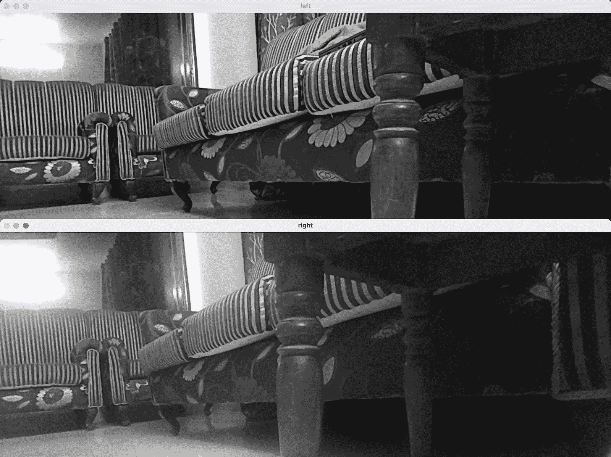

# OAK-D:使用 DepthAI API 理解和运行神经网络推理

> 原文：<https://pyimagesearch.com/2022/12/19/oak-d-understanding-and-running-neural-network-inference-with-depthai-api/>

* * *

## **目录**

* * *

## [**OAK-D:用 DepthAI API**](#TOC) 理解并运行神经网络推理

在本教程中，您将学习 DepthAI API 的核心概念，并利用它在 OAK-D 设备上运行一些深度学习和计算机视觉应用程序。

这是我们关于 **OAK-101** 的 4 部分系列的第 2 课:

1.  [*OpenCV AI Kit 介绍(橡树)*](https://pyimg.co/dus4w)
2.  [***OAK-D:用德泰 API***](https://pyimg.co/8ynbk) **(今日教程)**
3.  *橡树 101:第三部*
4.  *橡树 101:第四部*

**要了解 DepthAI API 如何工作，并在 OAK-D 上运行神经网络推理，** ***继续阅读即可。***

* * *

## [**OAK-D:用 DepthAI API**](#TOC) 理解并运行神经网络推理

* * *

### [**简介**](#TOC)

在我们之前的教程[**OpenCV AI Kit(OAK)**](https://pyimg.co/dus4w)介绍中，我们通过讨论 Luxonis 旗舰产品:OAK-1 和 OAK-D，成为最受欢迎的具有深度功能的 edge AI 设备，对 OAK 进行了初步介绍。我们还讨论了 OAK-D 的 OAK-D Lite 变体，它在第二次 Kickstarter 活动中推出，具有更小的重量和外形，但具有与 OAK-D 相同的空间 AI 功能。

鉴于您已经学习了我们的第一篇教程，您应该非常了解 OAK 系列以及 Lite、Pro 和 Compute Module (CM)等提供 USB 和 PoE 连接的产品。本教程的重点是讨论可以在 OAK 设备上运行的大约十种不同的应用程序，从图像分类到对象检测到人类关键点估计。

今天，我们将深入了解 OAK 设备的内部结构，并了解 DepthAI API 的架构和组件，该 API 为主机提供了与 OAK 设备进行连接、配置和通信的能力。我们将揭开 DepthAI API 内部的魔力，它允许各种计算机视觉和深度学习应用程序在 OAK 设备上运行。

最后，我们将使用来自 OpenVino 模型动物园的预训练公共模型，在 OAK-D 设备上运行几个计算机视觉和深度学习示例。我们相信这将是一个很好的方法，让您接触 DepthAI Python API，并通过代码实际了解 OAK 设备的底层发生了什么。

* * *

### [**配置您的开发环境**](#TOC)

要遵循这个指南，您需要在您的系统上安装 OpenCV 和 DepthAI 库。此外，我们强烈建议您遵循 [Luxonis 安装指南](https://docs.luxonis.com/projects/api/en/latest/install/)，其中详细介绍了不同平台的安装过程。在今天的教程中，主机平台是 macOS 系统，如果你碰巧也使用 macOS 平台，那么在安装 Python 包之前，运行这里提到的命令`bash`和[。](https://docs.luxonis.com/projects/api/en/latest/install/#macos)

幸运的是，OpenCV 和 DepthAI 都可以通过 pip 安装:

```py
$ pip install opencv-python
$ pip install depthai
```

* * *

### [**在配置开发环境时遇到了问题？**](#TOC)

说了这么多，你是:

*   时间紧迫？
*   了解你雇主的行政锁定系统？
*   想要跳过与命令行、包管理器和虚拟环境斗争的麻烦吗？
*   **准备好在您的 Windows、macOS 或 Linux 系统上运行代码*****？***

 *那今天就加入 [PyImageSearch 大学](https://pyimagesearch.com/pyimagesearch-university/)吧！

**获得本教程的 Jupyter 笔记本和其他 PyImageSearch 指南，这些指南是** ***预先配置的*** **，可以在您的网络浏览器中运行在 Google Colab 的生态系统上！**无需安装。

最棒的是，这些 Jupyter 笔记本可以在 Windows、macOS 和 Linux 上运行！

* * *

### [**项目结构**](#TOC)

我们首先需要回顾我们的项目目录结构。

首先访问本教程的 ***“下载”*** 部分，检索源代码和示例图像。

从这里，看一下目录结构:

```py
├── main.py
├── models
│   └── mobilenet-ssd_openvino_2021.4_6shave.blob
├── pyimagesearch
│   ├── __init__.py
│   ├── color_camera_preview.py
│   ├── config.py
│   ├── left_right_mono_camera_preview.py
│   ├── object_detection_mobilenet.py
│   └── utils.py
├── requirements.txt
└── results
    ├── color_camera.png
    ├── mono_camera.png
    └── object_detection.png
```

在`pyimagesearch`目录中，我们有:

*   `config.py`:实验的配置文件
*   `utils.py`:物体检测流水线的实用程序
*   `color_camera_preview.py`:保存运行彩色摄像机馈送的代码
*   `left_right_mono_camera_preview.py`:用于测试 OAK-D 的立体摄像机对
*   `object_detection_mobilenet.py`:在 OAK-D 上运行神经网络推理的对象检测代码

在核心目录中，我们有四个脚本:

*   `models`:包含`blob`格式的 mobilenet 对象检测模型的目录
*   `requirements.txt`:本教程需要的 Python 包
*   `results`:包含实验输出
*   `main.py`:主要的 Python 驱动程序脚本，允许你运行三个任务中的一个

* * *

### [**德泰**简介](#TOC)

DepthAI 是一个空间 AI 平台，允许机器像人类一样感知世界，可以理解物体或特征是什么，以及它们在物理世界中的位置(而不仅仅是在像素空间中)。它的目标是结合并优化五个关键属性:深度学习、计算机视觉、深度感知、性能(例如，运行高分辨率帧和 FPS(每秒帧数)、使用多个传感器)，以及低功耗嵌入式解决方案。

DepthAI 平台是围绕一个名为英特尔 Movidius VPU 的神经网络加速器构建的，这是一个每秒能够执行 4 万亿次运算的 Myriad X 芯片。它通过一个易于使用的 Python API 将深度感知与神经网络推理结合起来。

DepthAI 是定制硬件、固件和软件 API 的完整生态系统。最重要的是，它是模块化的，您可以将这项技术集成到您的产品中。**图 2** 展示了 DepthAI 的一个例子，它融合了 AI 能力与深度感知，基本上是利用每个对象的深度信息进行对象检测(估计空间坐标，即 XYZ)。

你在以上段落中读到的大部分术语已经在我们之前的教程[OpenCV AI Kit(OAK)简介](https://pyimg.co/dus4w)中解决了，所以我们建议你如果还没有的话查看一下那个帖子。

在今天的教程中，重点更多地放在了 DepthAI 的软件堆栈上，所以让我们直接进入主题吧！

* * *

### [**德泰软件栈**](#TOC)

像任何其他嵌入式硬件一样，OAK 设备也需要被编程以释放其能力并在其上运行应用程序。到目前为止，我们知道 OAK 设备有不同的变体:独立的，主机驻留在 OAK 上(例如，CM)，以及普通的 OAK 设备(例如，OAK-D)，需要通过 USB 与主机连接。

为了通过主机对 OAK 设备进行编程，在 DepthAI 中提供了一个垂直软件栈(**图 3** )，其中后续组件作为对前一组件的抽象:

*   DepthAI API
*   DepthAI SDK
*   德泰演示

* * *

#### [**德泰 API**](#TOC)

DepthAI API 允许主机(例如，计算机或任何微处理器)使用 Python API ( `depthai-python`)和 C++ API ( `depthai-core`)与 OAK 设备连接、配置和通信。`depthai-python`库为 C++ `depthai-core`库提供 Python 绑定。在今天的教程中，我们将重点介绍德泰的 Python API。

DepthAI API 提供了一个使用管道概念的编程模型，管道由节点组成。消息通过节点间的链接从一个节点发送到另一个节点。**上面的图 3** 显示了主机和 OAK 设备之间连接的高级架构、DepthAI 提供的软件堆栈以及设备内部的内容。

* * *

##### [**管道**](#TOC)

它是称为节点的处理元素的链，以及它们之间的链接，通过它消息从一个节点发送到另一个节点。如上面**图 3** 所示，`Node A`与`Node B`连接，通过它们交换消息(`Node A`向另一个节点发送消息，`XLinkOut`)。

Pipeline 告诉 DepthAI 要执行什么操作，您定义 pipeline 中的所有资源和工作流。无论您是否想要为摄像机和神经网络输出创建一个`color camera`、`neural network`或`XLinkOut`，所有这些都是作为管道内的节点创建的。

管道内部的这种流动为用户的 OAK 设备提供了广泛的灵活性。当管道对象被传递给`Device`对象时，管道被序列化为 JSON 并通过 XLink 发送到 OAK 设备。

创建管道对象非常简单。首先需要调用`depthai.Pipeline()`，如图**图 4** 。然后，您可以使用 pipeline 对象用节点填充它，配置它们，并将它们链接在一起。

例如，如**图 4** 所示，使用 pipeline 对象，您可以指定与该管道一起使用的 OpenVINO 版本。你需要更改版本的原因是，比方说，你的神经网络是用不同于 DepthAI 支持的最新 OpenVINO 版本编译的。所以必须指定管道的 OpenVINO 版本。

* * *

##### [**设备 API**](#TOC)

一旦创建了管道，您就可以使用`Device` API 将管道上传到设备，该 API 在视觉处理单元(VPU)上执行。当您在代码中创建设备时，固件与管道和其他资产(例如，神经网络斑点)一起上传。

直觉上它更像是在主机上；您定义在其中创建节点的管道，配置它们并绑定它们，最后将它们移动到 OAK 设备(**图 5** )。然后所有写在`with depthai.Device(pipeline) as device:`里面的代码都直接在设备上执行。

* * *

##### [**连接**](#TOC)

它是一个节点的输出和另一个节点的输入之间的链接。为了定义管道数据流，连接定义了向何处发送消息以实现预期的结果。

* * *

##### [**消息**](#TOC)

按照连接的定义，消息在节点之间传输。节点相互通信的唯一方式是从一个节点向另一个节点发送消息。

可以在设备和主机上创建消息。例如，捕捉静态图像的 OAK 设备摄像机通过一个`XLinkIn`节点接收消息。

以下是在 DepthAI 中定义的一些消息:

*   `CameraControl`:该信息控制彩色和单色摄像机。该消息处理诸如捕捉静止图像、配置自动对焦、场景、效果等事情。

*   `EdgeDetectorConfig`:该消息配置`EdgeDetector`节点，用于修改水平和垂直 Sobel 滤波器内核。

*   这个消息可以用来在运行时调整图像的大小、扭曲和旋转。消息从主机通过 `XLinkIn` 节点发送到`ColorCamera`节点。

*   `ImgDetections`:这确实是最令人兴奋的消息之一，它包含了一个图片中的`detections`列表。和大多数神经网络探测器一样，`detections`有`class label`、`confidence score`和`bounding box coordinates`。

检测节点`YoloDetectionNetwork`和`MobileNetDetectionNetwork`输出`ImgDetections`消息。我们将在`node`部分讨论它们。

*   `ImgFrame`:顾名思义，这个消息携带 RAW8 编码的帧数据:灰度和 RGB 分别用于单色相机和彩色相机。它还携带深度/视差图像。`ColorCamera`和`MonoCamera`节点是图像帧消息的来源。

然后，这可以用于显示目的，更重要的是，作为神经网络的输入。

* * *

##### [**节点**](#TOC)

节点是管道中最重要的构件。它具有输入和输出，并具有各种可配置的属性(例如，设置相机节点的分辨率、FPS 和帧输出大小)。每个节点可以有零个、一个或多个输入和输出。例如，**图 6** 显示了一个有一个输入和两个输出的`MobileNet Detection Network`节点。

一个节点可以连接(或链接)到其他节点。**图 7** 展示了链接到`NeuralNetwork`节点输入的`ColorCamera`节点输出的示例。并且`ColorCamera`节点发送`ImgFrame`作为神经网络的输入。节点的输入和输出遵循一种队列机制，这种机制有助于根据队列大小保存消息。队列大小是一个可配置的参数。

现在让我们来看几个 DepthAI 中的节点示例:

* * *

##### [**边缘检测器**](#TOC)

 **边缘检测器节点使用[索贝尔滤波器](https://homepages.inf.ed.ac.uk/rbf/HIPR2/sobel.htm)创建图像，强调具有高空间频率的图像区域。它卷积一个奇数大小的 2D 核，比如 3×3，并在整个图像上滑动它。**图 8** 显示了一个有两个输入和一个输出的`EdgeDetector`节点的例子。

输入和输出各有一种消息类型:

*   `inputImage` : `ImgFrame`
*   `inputConfig` : EdgeDetectorConfig
*   `outputImage` : `ImgFrame`

* * *

##### [**XLink**](#TOC)

XLink 是一个能够在设备和主机之间交换数据的中间件。XLink 进一步拆分为 XLinkIn 和 XLinkOut。

**图 9** 显示了通过 XLink 从主机向设备发送数据的`XLinkIn`节点。

`XLinkIn`节点的例子有

1.  将配置发送到设备进行图像转换，如裁剪、扭曲、旋转
2.  OAK 设备的彩色摄像机接收消息以捕捉静止图像
3.  控制彩色相机参数，如曝光、灵敏度、白平衡、亮度/色度去噪、设备端裁剪、相机触发器等。

* * *

##### [**XLinkOut**](#TOC)

它与`XLinkIn`相反，通过`XLink`将数据从设备发送到主机(如图**图 10** )。

`XLinkOut`节点的例子有

1.  向主机发送 OAK 摄像机流
2.  神经网络检测输出到主机

然后，用户可以将这些输出用于显示目的。

* * *

##### [**神经网络**](#TOC)

该节点对输入数据进行神经推理(**图 11** )。只要视觉处理单元(VPU)支持所有层，任何 OpenVINO 神经网络都可以使用该节点运行。这允许你从 OpenVINO 的[开放模型动物园](https://github.com/openvinotoolkit/open_model_zoo)库和[德普泰模型动物园](https://github.com/luxonis/depthai-model-zoo)库中挑选 200 多个预训练模型，并直接在 OAK 设备上运行。

神经网络文件必须在。blob 格式与 VPU 兼容。

输入和输出消息类型:

*   `input` : `Any message type`
*   `out` : NNData
*   `passthrough` : `ImgFrame`

这是一个更一般的`NeuralNetwork`节点，所以输入消息是`Any message type`，这意味着您可以向`NeuralNetwork`节点传递类似音频系列数据或文本数据的东西。

* * *

##### [**【mobile netdetectiontwork】**](#TOC)

`MobileNetDetectionNetwork`节点与`NeuralNetwork`节点非常相似。唯一不同的是，这个节点专门用于 MobileNet `NeuralNetwork`节点，它在设备上解码`NeuralNetwork`节点的结果。这意味着这个节点的`out`不是一个 [NNData](https://docs.luxonis.com/projects/api/en/latest/components/messages/nn_data/#nndata) (一个字节数组)，而是一个`ImgDetections`节点，可以很容易地在您的代码中用于显示目的和许多其他后处理操作。

参考上面的 **[图 6](https://pyimg.co/8ynbk#Fig6)** ，其中显示了`MobileNetDetectionNetwork`节点。节点的输入和输出消息类型有:

*   `input` : `ImgFrame`
*   `out`:img 检测
*   `passthrough` : `ImgFrame`

与`NeuralNetwork`节点不同，MobileNet 检测网络节点具有作为`ImgFrame`的输入，因为这些检测模型(YOLO/SSD)基于图像并且不能接受任何其他数据类型。

* * *

##### [**【yolodetectitiontwork】**](#TOC)

**图 12** 显示的是`YoloDetectionNetwork`节点，与`NeuralNetwork`节点非常相似。唯一不同的是，这个节点是专门为微小的 Yolo V3/V4 `NeuralNetwork`设计的，它在设备上解码神经网络的结果。与`MobileNetDetectionNetwork`节点一样，`YoloDetectionNetwork`节点返回`ImgDetections`。

上述节点的输入和输出消息类型有:

*   `input` : `ImgFrame`
*   `out`:img 检测
*   `passthrough` : `ImgFrame`

* * *

##### [**【yolospatialdataprotection network】**](#TOC)

`YoloSpatialDetectionNetwork`节点的工作方式类似于`YoloDetectionNetwork`节点(**图 13** )。但是，除了检测结果，它还使用`SpatialImageDetections`输出边界框的空间位置。

该网络节点在`YoloDetectionNetwork`节点之上镜像`SpatialLocatorCalculator`节点的功能。

`SpatialLocatorCalculator`节点根据来自`inputDepth`的`depth`图计算 ROI(感兴趣区域)的空间坐标。然后，它对 ROI 中的深度值进行平均，并移除超出范围的深度值。

因此，简而言之，它是`YoloDetectionNetwork`和`SpatialLocationCalculator`节点的组合。

上述节点的输入和输出消息类型有:

*   `input` : `ImgFrame`
*   `inputDepth` : `ImgFrame`
*   `passthrough` : `ImgFrame`
*   `out` : `SpatialImageDetections`
*   `boundingBoxMapping` : `SpatialLocationCalculatorConfig`
*   `passthroughDepth` : `ImgFrame`

`SpatialImageDetections`消息类似于`ImgDetections`消息，但是除了检测之外，它还包括被检测物体的 XYZ 坐标。

* * *

#### [**德泰 SDK**](#TOC)

 **德泰软件开发工具包(SDK)是德泰 API 的包装器。它易于使用，并提供了更多的抽象，但降低了可定制性因素。与 DepthAI API 类似，SDK 是一个 Python 包，包含方便的类和函数，有助于使用 DepthAI API 完成大多数常见任务。**图 14** 显示了 DepthAI SDK 的高级架构。

它由处理开发生命周期不同方面的经理组成:

1.  **管道管理器:**帮助建立处理管道
2.  **预览管理器:**帮助显示来自 OAK 摄像机的图像或视频流
3.  **神经网络管理器:**帮助建立神经网络，并处理所有与神经网络相关的功能。它可以创建适当的`NeuralNetwork`节点和连接，并解码神经网络输出
4.  **编码管理器:**帮助从 OAK 相机创建视频
5.  **Blob 管理器:**帮助下载 MyriadX blobs 形式的神经网络，VPU 需要它在 OAK 设备上运行神经网络推理

我们不会深入每个经理的细节，因为它需要一个单独的帖子，此外，我们将在今天的教程中运行的示例使用 DepthAI API，而不是 SDK。

* * *

### [**了解 DepthAI API 管道**](#TOC)

在这一节中，我们将尝试理解 DepthAI API 管道如何为对象检测这样的用例工作。**图 15** 显示了 OAK 设备和主机(如计算机/嵌入式硬件)之间的对象检测工作流程。

如果你很好地理解了图 15，那么理解代码对你来说就是小菜一碟。

* * *

#### [**装置侧**](#TOC)

**上面的图 15** 有五个节点:`ColorCamera`、`MobileNetDetectionNetwork`和三个`XLinkOut`节点。

回想一下上面的内容，在 DepthAI 中，我们主要是做管道，所以在设备端，我们先定义`pipeline` ( `depthai.Pipeline()`)。

使用那个`pipeline`，我们创建一个`ColorCamera`节点(`Node 1`)，显示为中等亮度的红色。这个节点就像我们的对象检测管道的垫脚石，因为它将使 OAK 设备彩色摄像机能够捕捉图像帧。

类似地，我们创建了`MobileNetDetectionNetwork`节点(`Node 2`，它将对从`Node 1`接收到的帧执行对象检测。最后，我们使用链接和连接的概念将摄像机输出与一个`NeuralNetwork`节点的输入链接起来。

通过调用`camRgb.preview`，你得到摄像机的输出，然后你用`.link(nn.input)`把它和神经网络的输入联系起来。不是这么简单吗？

同理，你可以通过`XLinkOut` `Node 3` ( `xoutRgb`)将摄像头输出发送到主机端。`NeuralNetwork`节点还通过`XLinkOut` `Node 4`和`Node 5`向主机端发送信息。此信息包括检测网络输出和网络元数据，如图层名称。

* * *

#### [**主机端**](#TOC)

在主机端，我们通过设置`OutputQueue`从 OAK 设备检索相机帧和神经网络推理输出。如上面的**图 15** 所示，相机帧通过 XLink(或 XLinkOut)发送到主机，并由主机使用`OutputQueue`通过传递参数`rgb`检索。

主机端的`inRgb`是指来自摄像机的帧。类似地，对于推理结果和神经网络元数据，遵循相同的过程，只是这一次，`OutputQueue`的参数是`nn`和`nnNetwork`。

一旦有了相机帧和神经网络结果，就可以在主机端对它们进行后处理。例如，用边界框坐标和对象标签注释图像帧。

**图 16** 显示了由一个工具生成的物体检测的管线图，该工具动态地创建[沉积管线图](https://github.com/geaxgx/depthai_pipeline_graph#depthai-pipeline-graph-experimental)。这个工具对于在不直接阅读代码的情况下深入了解 DepthAI 程序非常有用。

下面你可以看到上面管道图的每个节点 id，以及它们如何连接到对象检测管道中的每个其他节点。

节点(id):
= = = = = = = = = = =
color camera(0)
detection network(1)
XLinkOut(2)
XLinkOut(3)
XLinkOut(4)

Connections:
= = = = = = = = = = = = =
0 detection network(1):out network→XLinkOut(4):
1 detection network(1)中的[8]:out→XLinkOut(3):
2

理论到此为止，对吧？现在让我们将这些理论知识付诸实践，并在 OAK-D 设备上运行来自 [Luxonis GitHub 库](https://github.com/luxonis)的一些 DepthAI 示例。

* * *

### [**橡树演示示例**](#TOC)

在本节中，我们将通过几个使用 OAK 深度硬件的深度示例，即:

*   用 OAK-D 测试彩色摄像机馈送
*   运行 OAK-D 的单声道摄像机(左和右)
*   基于 MobileNet 模型的目标检测

* * *

#### [**配置先决条件**](#TOC)

在我们开始实现之前，让我们检查一下项目的配置管道。我们将转到位于`pyimagesearch`目录中的`config.py`脚本。

```py
# Set the color camera preview size and interleaved
COLOR_CAMERA_PREVIEW_SIZE = 300, 300
CAMERA_INTERLEAVED = False
CAMERA_FPS = 40

# Queue parameters for rgb and mono camera frames at host side
COLOR_CAMERA_QUEUE_SIZE = 4
QUEUE_BLOCKING = False

# Object detection class labels
CLASS_LABELS = ["background", "aeroplane", "bicycle", "bird", "boat",
               "bottle", "bus", "car", "cat", "chair", "cow",
               "diningtable", "dog", "horse", "motorbike", "person",
               "pottedplant", "sheep", "sofa", "train", "tvmonitor"]
MOBILENET_DETECTION_MODEL_PATH = 'models/mobilenet-ssd_openvino_2021.' \
                                '4_6shave.blob'

# Neural network hyperparameters
NN_THRESHOLD = 0.5
INFERENCE_THREADS = 2
PRINT_NEURAL_NETWORK_METADATA = True

# Frame text color pattern
TEXT_COLOR = (255, 0, 0)
TEXT_COLOR2 = (255, 255, 255)
```

从**第 2-4 行**，我们设置摄像机参数，如帧的预览尺寸(主机端的显示窗口尺寸)、摄像机 FPS 以及摄像机交错或平面选项。

然后，我们为`rgb`和`mono`摄像机设置`OutputQueue`参数，如队列大小以及是否有阻塞或非阻塞队列(**第 7 行和第 8 行**)。

在**第 11-16 行**上，我们定义了对象检测参数，如 Pascal-VOC 数据集的类标签和 mobilenet 检测模型路径。

然后定义推理线程的目标检测置信度阈值数。这些是特定于第 20-22 行上的**对象检测模型的神经网络超参数。**

配置管道的最后一步是设置 OpenCV 相关的文本颜色模式，这将被用于在主机端注释输出帧**(第 25 和 26 行)**。

* * *

#### [**测试 OAK-D** 的彩色相机(RGB)进纸](#TOC)

既然已经定义了配置管道，我们可以转到第一个实验的代码演练(即运行 OAK-D 的 RGB 彩色摄像机)。这个实验将帮助您了解如何创建彩色摄像机节点，以及如何通过`XLinkOut`节点在主机端显示摄像机画面。

```py
# import the necessary packages
import cv2
import depthai as dai

from pyimagesearch import config

def create_color_camera_pipeline():
   # Create pipeline
   pipeline = dai.Pipeline()

   # Define source and output
   # camera node
   camRgb = pipeline.create(dai.node.ColorCamera)
   # XLinkOut node for displaying frames
   xoutRgb = pipeline.create(dai.node.XLinkOut)

   # set stream name as rgb
   xoutRgb.setStreamName('rgb')

   # set camera properties like the preview window, interleaved
   camRgb.setPreviewSize(config.COLOR_CAMERA_PREVIEW_SIZE)
   camRgb.setInterleaved(config.CAMERA_INTERLEAVED)
   camRgb.setColorOrder(dai.ColorCameraProperties.ColorOrder.RGB)

   # link the camera preview to XLinkOut node input
   camRgb.preview.link(xoutRgb.input)

   # return pipeline to the calling function
   return pipeline
```

我们首先从**2-5**行的`pyimagesearch`模块导入所需的包，如`cv2`、`depthai`和`config`。

然后，在第 8-30 行的**上，我们定义了`create_color_camera_pipeline()`方法，它将构建彩色摄像机管道。我们首先创建`pipeline`对象(**第 10 行**)，然后定义源，即彩色摄像机节点和用于显示彩色帧(**第 14-16 行**)的输出(`XLinkOut`)节点。**

然后在**第 19 行，**节点`XLinkOut`(即`xoutRgb`变量)被赋予一个流名为`rgb`；该名称将作为参数传递给`OutputQueue`以获取彩色帧。

从**第 22-24 行**，我们设置摄像机属性/参数，如显示窗口大小、颜色通道顺序和摄像机交错。

下一步是将`camRgb`输出与**线 27** 上`xoutRgb`(`XLinkOut`节点)的输入相连。

在第 30 行上，我们将管道返回到调用函数。

```py
def color_camera(pipeline):
   # Connect to device and start pipeline
   with dai.Device(pipeline) as device:
       print('Connected cameras: ', device.getConnectedCameras())
       # Print out usb speed like low/high
       print('Usb speed: ', device.getUsbSpeed().name)

       # Output queue will be used to get the rgb
       # frames from the output defined above
       qRgb = device.getOutputQueue(
           name='rgb',
           maxSize=config.COLOR_CAMERA_QUEUE_SIZE,
           blocking=config.QUEUE_BLOCKING,
       )

       while True:
           # blocking call, will wait until a new data has arrived
           inRgb = qRgb.get()
           # Convert the rgb frame data to OpenCV format and
           # display 'bgr' (opencv format) frame
           cv2.imshow('rgb', inRgb.getCvFrame())

           # break out from the while loop if 'q' key is pressed
           if cv2.waitKey(1) == ord('q'):
               break
```

在**第 33 行**上，我们定义了`color_camera`方法，该方法将`pipeline`作为参数。然后，我们连接到 OAK 设备，启动**线 35** 上的管道。最后，我们打印附加信息，如连接的摄像机和 USB 速度，如主机&设备通过其通信的低/高(在**行 36-38** )。

接下来，在**第 42-46 行**上，定义了`OutputQueue`，它接受参数:流名称、摄像机队列大小和队列阻塞。这个队列帮助从输出中获取彩色摄像机帧。

最后，现在大部分繁重的工作已经完成，在**行 48** 上，定义了一个无限的`while`循环，它一直运行到按下`q`键(**行 56** )。在**行 50** 的`while`循环中，我们使用队列对象`qRgb`获取实际的帧，然后使用`cv2.imshow`函数(**行 53** )将其转换为 OpenCV `bgr`格式并显示在主机屏幕上。

* * *

#### [**测试 OAK-D**](#TOC) 的单声道摄像机(左右)进给

下面的实验是学习如何访问 OAK-D 的单声道摄像机(左和右)并在主机端显示提要。这将更容易理解，因为你已经完成了之前的实验。在这里，我们将创建两个摄像机节点和两个`XLinkOut`节点来显示单声道摄像机输入。

```py
# import the necessary packages
from pyimagesearch import config
import depthai as dai
import cv2

def create_mono_camera_pipeline():
    # create pipeline
    pipeline = dai.Pipeline()

    # define sources and outputs: creating left and right camera nodes
    monoLeft = pipeline.create(dai.node.MonoCamera)
    monoRight = pipeline.create(dai.node.MonoCamera)

    # XLinkOut nodes for displaying frames from left and right camera
    xoutLeft = pipeline.create(dai.node.XLinkOut)
    xoutRight = pipeline.create(dai.node.XLinkOut)

    # set XLinkOut stream name as left and right for later using in
    # OutputQueue
    xoutLeft.setStreamName('left')
    xoutRight.setStreamName('right')

    # set mono camera properties like which camera socket to use,
    # camera resolution
    monoLeft.setBoardSocket(dai.CameraBoardSocket.LEFT)
    monoLeft.setResolution(
        dai.MonoCameraProperties.SensorResolution.THE_720_P)
    monoRight.setBoardSocket(dai.CameraBoardSocket.RIGHT)
    monoRight.setResolution(
        dai.MonoCameraProperties.SensorResolution.THE_720_P,
    )

    # link the left and right camera output to XLinkOut node input
    monoRight.out.link(xoutRight.input)
    monoLeft.out.link(xoutLeft.input)

    # return pipeline to the calling function
    return pipeline
```

我们首先从**2-4**行的`pyimagesearch`模块导入所需的包，如`cv2`、`depthai`和`config`。

然后，在第 6-31 行的**上，我们定义了`create_mono_camera_pipeline()`方法，它将为左右摄像机构建摄像机管道。我们首先创建`pipeline`对象(**行 8** )，然后定义源和输出(**行 11 和 12** )。这一次我们创建了两个相机节点:左和右，以及两个`XLinkOut`节点，用于显示左和右相机馈送。**

在**第 15 和 16 行，**两个`XLinkOut`节点(即`xoutLeft`和`xoutRight`变量)被赋予一个流名`left`和`right`；该名称将作为参数传递给两个不同的`OutputQueue`以获取彩色帧。

从**第 25-31 行**，我们为两台摄像机设置摄像机属性/参数(例如，摄像机插座和摄像机分辨率)。

下一步是将`left`和`right`摄像机输出与**线 34 和 35** 上的`xoutLeft`和`xoutRight`(两个`XLinkOut`节点)的输入连接起来。

在**第 38 行**上，我们将管道返回到调用函数。

```py
def mono_cameras_preview(pipeline):
    # connect to device and start pipeline
    with dai.Device(pipeline) as device:
        # output queues will be used to get the grayscale
        # frames from the outputs defined above
        qLeft = device.getOutputQueue(
            name='left',
            maxSize=config.COLOR_CAMERA_QUEUE_SIZE,
            blocking=config.QUEUE_BLOCKING,
        )
        qRight = device.getOutputQueue(
            name='right',
            maxSize=config.COLOR_CAMERA_QUEUE_SIZE,
            blocking=config.QUEUE_BLOCKING,
        )

        while True:
            # instead of get (blocking), we use tryGet (non-blocking)
            # which will return the available data or None otherwise
            inLeft = qLeft.tryGet()
            inRight = qRight.tryGet()

            # check if data is available from left camera node
            if inLeft is not None:
                # convert the left camera frame data to OpenCV format and
                # display grayscale (opencv format) frame
                cv2.imshow('left', inLeft.getCvFrame())

            # check if data is available from right camera node
            if inRight is not None:
                # convert the right camera frame data to OpenCV format and
                # display grayscale (opencv format) frame
                cv2.imshow('right', inRight.getCvFrame())

            # break out from the while loop if 'q' key is pressed
            if cv2.waitKey(1) == ord('q'):
                break
```

在**第 41 行**上，我们定义了`mono_cameras_preview`方法，该方法将`pipeline`作为参数。然后我们连接到 OAK 设备，并启动**线 43** 上的管道。

接下来，从**第 46-55 行**，定义了两个`OutputQueue`，它们接受参数:流名称(`left`和`right`)、摄像机队列大小和队列阻塞。这些队列帮助从输出中获取`left`和`right`(灰度)相机帧。

在**线 57** 上，定义了一个无限的`while`循环，一直运行到按下`q`键(**线 76** )。在**第 60 行和第 61 行**的`while`循环中，我们使用队列对象`qLeft`和`qRight`获取帧数据。请注意，在彩色摄像机示例中，我们使用了`tryGet()`方法，而不是`get()`。这是因为`tryGet()`方法是非阻塞调用，如果队列中没有帧，它将返回数据或不返回任何数据。请尝试一下`get()`方法，看看你有没有发现什么不同。

最后，如果`left`和`right`帧不是`None`，则使用`cv2.imshow`功能将帧数据转换为 OpenCV 灰度格式并显示在主机屏幕上(**第 64-73 行**)。

* * *

#### [**在 Pascal-VOC 数据集上预处理 MobileNet 模型的目标检测**](#TOC)

现在我们知道了如何创建一个管道，摄像机节点，`XLinkOut`节点，`OutputQueue`等。，我们可以结合这些知识，创建一个检测图像中常见对象的对象检测应用程序。

我们将使用 MobileNet-SSD 模型:旨在执行对象检测的单次多盒检测(SSD)网络。这个模型最初是在 Caffe 框架中实现的。要更深入地了解 MobileNet-SSD 模型，请查看[存储库](https://github.com/chuanqi305/MobileNet-SSD)。

在我们浏览对象检测代码之前，让我们回顾一下对象检测管道的实用程序。为此，我们将转到位于`pyimagesearch`目录中的`utils.py`脚本。

```py
# import the necessary packages
from pyimagesearch import config
import numpy as np
import cv2

# color pattern for annotating frame with object category, bounding box,
# detection confidence
color = config.TEXT_COLOR

# MobilenetSSD label list
labelMap = config.CLASS_LABELS

# nn data (bounding box locations) are in <0..1>
# range - they need to be normalized with frame width/height
def frameNorm(frame, bbox):
    normVals = np.full(len(bbox), frame.shape[0])
    normVals[::2] = frame.shape[1]
    return (np.clip(np.array(bbox), 0, 1) * normVals).astype(int)

# displayFrame method iterates over the detections of a frame,
# denormalizes the bounding box coordinates and annotates the frame with
# class label, detection confidence, bounding box
def displayFrame(name, frame, detections):
    for detection in detections:
        bbox = frameNorm(
            frame, (
                detection.xmin, detection.ymin,
                detection.xmax, detection.ymax,
            ),
        )
        cv2.putText(
            frame, labelMap[detection.label], (
                bbox[0] + 10,
                bbox[1] + 20,
            ),
            cv2.FONT_HERSHEY_TRIPLEX, 0.5, color,
        )
        cv2.putText(
            frame, f'{int(detection.confidence * 100)}%',
            (bbox[0] + 10, bbox[1] + 40), cv2.FONT_HERSHEY_TRIPLEX,
            0.5, color,
        )
        cv2.rectangle(frame, (bbox[0], bbox[1]), (bbox[2], bbox[3]),
            color, 2)

    # show the frame
    cv2.imshow(name, frame)

# method that prints the detection network output layer name
def print_neural_network_layer_names(inNN):
    toPrint = 'Output layer names:'
    for ten in inNN.getAllLayerNames():
        toPrint = f'{toPrint} {ten},'print(toPrint)
```

在**第 2-4 行**，我们导入了 opencv、numpy 等必要的包。

然后，我们定义颜色模式，用类标签、置信度得分和边界框来注释帧。类别标签列表`labelMap`在**行第 11** 上定义，这将有助于将类别 id 转换成人类可读的形式。

由于神经网络预测(边界框坐标)在范围[0，1]内被规格化，因此需要用图像帧的宽度和高度对它们进行反规格化。`frameNorm`方法有助于在**第 15-18 行**完成这项任务。

在**的第 24-48 行**中，我们定义了`displayFrame`方法，该方法迭代帧的每次检测，使用`frameNorm`方法反规格化边界框坐标，并用类别标签、检测置信度和边界框坐标注释该帧。最后，它在主机端显示带注释的框架。

最后，在**第 51-54 行**，`print_neural_network_layer_names`帮助打印物体检测网络层名称。

现在定义了助手方法，我们可以最终转移到对象检测推理实现(即位于`pyimagesearch`目录中的`object_detection_mobilenet.py`脚本)。

```py
# import the necessary packages
from pyimagesearch import config
from pyimagesearch.utils import print_neural_network_layer_names
from pyimagesearch.utils import displayFrame
import depthai as dai
import time
import cv2

def create_detection_pipeline():
    # create pipeline
    pipeline = dai.Pipeline()

    # define camera node
    camRgb = pipeline.create(dai.node.ColorCamera)

    # define the MobileNetDetectionNetwork node
    nn = pipeline.create(dai.node.MobileNetDetectionNetwork)

    # define three XLinkOut nodes for RGB frames, Neural network detections
    # and Neural network metadata for sending to host
    xoutRgb = pipeline.create(dai.node.XLinkOut)
    nnOut = pipeline.create(dai.node.XLinkOut)
    nnNetworkOut = pipeline.create(dai.node.XLinkOut)

    # set the XLinkOut node names
    xoutRgb.setStreamName('rgb')
    nnOut.setStreamName('nn')
    nnNetworkOut.setStreamName('nnNetwork')

    # set camera properties like the preview window, interleaved and
    # camera FPS
    camRgb.setPreviewSize(config.COLOR_CAMERA_PREVIEW_SIZE)
    camRgb.setInterleaved(config.CAMERA_INTERLEAVED)
    camRgb.setFps(config.CAMERA_FPS)

    # define neural network hyperparameters like confidence threshold,
    # number of inference threads. The NN will make predictions
    # based on the source frames
    nn.setConfidenceThreshold(config.NN_THRESHOLD)
    nn.setNumInferenceThreads(config.INFERENCE_THREADS)

    # set mobilenet detection model blob path
    nn.setBlobPath(config.MOBILENET_DETECTION_MODEL_PATH)
    nn.input.setBlocking(False)

    # link the camera preview to XLinkOut node input
    camRgb.preview.link(xoutRgb.input)

    # camera frames linked to NN input node
    camRgb.preview.link(nn.input)

    # NN out (image detections) linked to XLinkOut node
    nn.out.link(nnOut.input)

    # NN unparsed inference results  (metadata) linked to XLinkOut node
    nn.outNetwork.link(nnNetworkOut.input)

    # return pipeline to the calling function
    return pipeline
```

我们首先导入所需的包，如用于计算 FPS 的`time`模块、用于显示帧和其他图像实用程序的`cv2`、`config`模块以及我们上面定义的实用程序，如**第 2-7 行**上的`displayFrame`方法。

在**的第 9-59 行**，我们定义了`create_detection_pipeline()`方法，它将为目标检测实验奠定基础。我们从在第 11 行的**上创建`pipeline`开始。然后从**第 14-23 行**，我们创建源和输出。首先，我们创建`ColorCamera`节点，这是最重要的节点(即`MobileNetDetectionNetwork`节点)，它将执行神经网络推理并对设备上的预测进行解码。**

为 RGB 帧、神经网络检测和神经网络元数据创建了三个`XLinkOut`节点。所有这些信息都将被发送到主机。

然后，将流名称分配给所有三个`XLinkOut`节点，即`rgb`、`nn`和`nnNetwork`；这些将用于稍后从`OutputQueue`检索数据(在**行 26-28** )。

从**第 32-34 行**，设置摄像机参数(例如，预览窗口大小和摄像机 FPS)。

然后，我们在第 39-44 行上定义神经网络超参数(例如，检测置信度阈值、推理线程数和模型文件路径等。).

最后一步是链接输入和输出节点(**行 47-56** ):

*   彩色摄像机输出链接到`XLinkOut`节点的输入。
*   摄像机输出连接到`NeuralNetwork`节点的输入，用于执行预测。
*   神经网络的输出连接到另一个`XLinkOut`节点的输入，该节点将输出目标检测预测。
*   最后，负责承载神经网络未解析推理结果(元数据)的节点链接到`nnNetwork`节点。

然后`pipeline`对象返回到**线 59** 上的调用函数。

```py
def object_detection_mobilenet(pipeline):
    # connect to device and start pipeline
    with dai.Device(pipeline) as device:
        # output queues will be used to get the rgb frames
        # and nn data from the outputs defined above
        qRgb = device.getOutputQueue(
            name='rgb',
            maxSize=config.COLOR_CAMERA_QUEUE_SIZE,
            blocking=config.QUEUE_BLOCKING,
        )
        qDet = device.getOutputQueue(
            name='nn',
            maxSize=config.COLOR_CAMERA_QUEUE_SIZE,
            blocking=config.QUEUE_BLOCKING,
        )
        qNN = device.getOutputQueue(
            name='nnNetwork',
            maxSize=config.COLOR_CAMERA_QUEUE_SIZE,
            blocking=config.QUEUE_BLOCKING,
        )

        # initialize frame, detections list, and startTime for
        # computing FPS
        frame = None
        detections = []
        startTime = time.monotonic()
        counter = 0

        # color pattern for displaying FPS
        color2 = config.TEXT_COLOR2  

        # boolean variable for printing NN layer names on console
        printOutputLayersOnce = config.PRINT_NEURAL_NETWORK_METADATA

        while True:
            # instead of get (blocking), we use tryGet (non-blocking)
            # which will return the available data or None otherwise
            # grab the camera frames, image detections, and NN 
            # metadata
            inRgb = qRgb.tryGet()
            inDet = qDet.tryGet()
            inNN = qNN.tryGet()

            # check if we frame is available from the camera
            if inRgb is not None:
                # convert the camera frame to OpenCV format
                frame = inRgb.getCvFrame()

                # annotate the frame with FPS information
                cv2.putText(
                    frame, 'NN fps: {:.2f}'.
                    format(counter / (time.monotonic() - startTime)),
                    (2, frame.shape[0] - 4),
                    cv2.FONT_HERSHEY_TRIPLEX, 0.4, color2,
                )

            # check if detections are available
            if inDet is not None:
                # fetch detections & increment the counter for FPS computation
                detections = inDet.detections
                counter += 1

            # check if the flag is set and NN metadata is available
            if printOutputLayersOnce and inNN is not None:
                # call the `neural network layer names method and pass
                # inNN queue object which would help extract layer names
                print_neural_network_layer_names(inNN)
                printOutputLayersOnce = False

            # if the frame is available, draw bounding boxes on it
            # and show the frame
            if frame is not None:
                displayFrame('object_detection', frame, detections)

            # break out from the while loop if 'q' key is pressed
            if cv2.waitKey(1) == ord('q'):
                break
```

既然管道已经创建，我们可以开始获取帧和神经网络预测。在**的第 62-138 行**中，定义了将`pipeline`作为参数的`object_detection_mobilenet()`方法。然后，我们连接到设备并启动**线 6** 4 上的管道。

从**行 67-81** ，定义了三个输出队列，即`rgb`、`nn`和`nnNetwork`，以获取 RGB 帧和神经网络数据。接下来，我们初始化用于计算 FPS 的`frame`变量、`detections`列表和`startTime`(**第 85-87 行**)。我们还定义了一个名为`printOutputLayersOnce`的布尔变量，用于在控制台上打印神经网络层名称。

在第 96 行的**上，我们开始了一个无限的`while`循环。**

在循环内部，我们首先使用上面定义的三个`OutputQueue`(**行 101-103** )获取摄像机帧、图像检测和网络元数据。

在**行 106** ，我们检查摄像机画面是否不是`None`。然后，我们将它们转换成 OpenCV 格式，并用 FPS 信息对帧进行注释(**第 108-116 行**)。

然后，如果当前帧有任何检测，我们提取检测并增加第**行 119-122** 的 FPS 计算的计数器。

接下来，我们打印网络层名称。如果布尔变量设置为`True`，调用`displayFrame`对帧进行注释，并在屏幕上显示输出(**第 128-134 行**)。

最后，如果在**行 137 和 138** 上按下`q`键，我们就脱离循环。

* * *

#### [**结果**](#TOC)

现在让我们看看所有三个实验的结果(见**图 17-19** )。

*   彩色相机预览

*   左右单声道摄像机馈送



**Figure 18:** Mono Camera Feed from OAK-D (top: left camera; bottom: right camera).

*   基于 MobileNet 模型的目标检测

* * *

## [**汇总**](#TOC)

在本教程中，我们学习了 DepthAI 软件堆栈的概念，并利用它在 OAK-D 设备上运行了一些深度学习和计算机视觉的应用程序。

具体来说，我们讨论了 DepthAI API，其中我们学习了管道、消息和节点的概念。然后，我们讨论了几种类型的节点(例如，`XLink`、`NeuralNetwork`、`EdgeDetector`、`YoloDetectionNetwork`等)。).

我们还讨论了 DepthAI SDK，它是 DepthAI API 之上的一个包装器。但是，更重要的是，我们讨论了对象检测用例的端到端 DepthAI 管道。

我们进一步深入研究了 OAK 演示示例。此外，我们利用 DepthAI API 用 Python 编写了三个示例:在 OAK-D 上运行彩色相机馈送、单色相机馈送和对象检测。

最后，我们简要检查了用 OAK-D 进行的三个实验的结果。

* * *

### [**引用信息**](#TOC)

**Sharma，a .**“OAK-D:使用 DepthAI API 理解和运行神经网络推理”， *PyImageSearch* ，P. Chugh，A. R. Gosthipaty，S. Huot，K. Kidriavsteva，R. Raha 和 A. Thanki 编辑。，2022 年，【https://pyimg.co/8ynbk 

```py
@incollection{Sharma_2022_OAK-D,
  author = {Aditya Sharma},
  title = {{OAK-D}: Understanding and Running Neural Network Inference with {DepthAI} {API}},
  booktitle = {PyImageSearch},
  editor = {Puneet Chugh and Aritra Roy Gosthipaty and Susan Huot and Kseniia Kidriavsteva and Ritwik Raha and Abhishek Thanki},
  year = {2022},
  note = {https://pyimg.co/8ynbk},
}
```

* * *

* * *

**要下载这篇文章的源代码(并在未来教程在 PyImageSearch 上发布时得到通知)，*只需在下面的表格中输入您的电子邮件地址！********