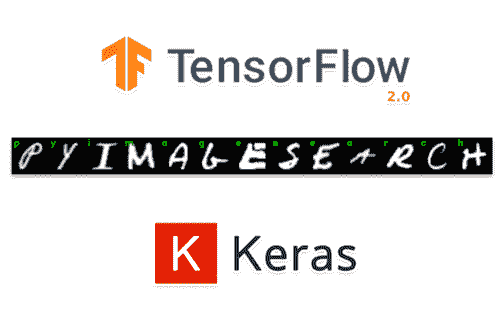

# 带有 Keras、TensorFlow 和深度学习的 OCR

> 原文：<https://pyimagesearch.com/2020/08/17/ocr-with-keras-tensorflow-and-deep-learning/>



在本教程中，您将学习如何使用 Keras、TensorFlow 和深度学习来训练光学字符识别(OCR)模型。**本文是 Keras 和 TensorFlow 关于 OCR 的两部分系列文章的第一部分:**

*   **第一部分:** *用 Keras 和 TensorFlow 训练 OCR 模型*(今天的帖子)
*   **第二部分:** *用 Keras 和 TensorFlow 进行基本的手写识别*(下周的帖子)

现在，我们将主要关注如何训练定制的 Keras/TensorFlow 模型来识别字母数字字符(即，数字 *0-9* 和字母 *A-Z* )。

基于今天的帖子，下周我们将学习如何使用这个模型来正确分类自定义输入图像中的手写字符。

这个两部分系列的目标是更深入地了解深度学习如何应用于手写分类，更具体地说，我们的目标是:

*   熟悉一些众所周知的、随时可用的数字和字母手写数据集
*   了解如何训练深度学习模型识别手写数字和字母
*   获得将我们定制的模型应用于一些真实样本数据的经验
*   了解现实世界中嘈杂数据的一些挑战，以及我们可能希望如何扩充我们的手写数据集来改进我们的模型和结果

我们将从使用众所周知的手写数据集的基础知识开始，并在这些数据上训练 ResNet 深度学习模型。

**要了解如何使用 Keras、TensorFlow 和深度学习来训练 OCR 模型，*继续阅读。***

## **使用 Keras、TensorFlow 和深度学习的 OCR**

在本教程的第一部分，我们将讨论使用 Keras 和 TensorFlow 实现和训练自定义 OCR 模型所需的步骤。

然后，我们将检查用于训练模型的手写数据集。

从那里，我们将实现几个助手/实用程序函数，帮助我们从磁盘加载手写数据集，然后对它们进行预处理。

给定这些助手函数，我们将能够使用 Keras 和 TensorFlow 创建自定义 OCR 训练脚本。

培训结束后，我们将回顾 OCR 工作的结果。

我们开始吧！

### **我们的深度学习 OCR 数据集**

为了训练我们的定制 Keras 和 TensorFlow 模型，我们将利用**两个数据集:**

*   **标准 [MNIST *0-9* 数据集由乐存等人](http://yann.lecun.com/exdb/mnist/)**
*   **Sachin Patel 的 Kaggle A-Z 数据集，基于 NIST 特殊数据库 19**

**标准 MNIST 数据集**内置于流行的深度学习框架中，包括 Keras、TensorFlow、PyTorch 等。MNIST 0-9 岁数据集的样本可以在**图 1 中看到(*左*** )。MNIST 数据集将允许我们识别数字 0-9。这些数字中的每一个都包含在一个 *28 x 28* 灰度图像中。你可以在这里阅读更多关于 MNIST 的信息。

但是字母 A-Z 呢？标准的 MNIST 数据集不包括字符 *A-Z* — *的例子，我们如何识别它们呢？*

**答案是使用 [NIST 特殊数据库 19](https://www.nist.gov/srd/nist-special-database-19) ，其中包括 *A-Z* 人物。**这个数据集实际上涵盖了 62 个 ASCII 十六进制字符，分别对应于数字 *0-9* ，大写字母 *A-Z* ，小写字母 *a-z* 。

为了让数据集更容易使用，Kaggle 用户 Sachin Patel 已经[在一个易于使用的 CSV 文件](https://www.kaggle.com/sachinpatel21/az-handwritten-alphabets-in-csv-format)中发布了数据集。该数据集从 NIST 特殊数据库 19 中提取大写字母 *A-Z* ，并将其重新缩放为 *28 x 28* 灰度像素，与我们的 m NIST 数据格式相同。

对于这个项目，我们将只使用*和*ka ggle A-Z 数据集，这将使我们的预处理变得轻而易举。在**图 1 *(右图)中可以看到它的一个样本。***

我们将实施一些方法和实用程序，使我们能够:

1.  从磁盘加载 MNIST 0-9 数字和字母 A-Z 的数据集
2.  将这些数据集组合成一个*单一的、*统一的角色数据集
3.  处理由于每个字符具有不同数量的样本而导致的分类标签偏斜/不平衡
4.  在组合数据集上成功训练 Keras 和 TensorFlow 模型
5.  绘制训练的结果，并可视化验证数据的输出

### **配置您的 OCR 开发环境**

要针对本教程配置您的系统，我首先建议您遵循以下任一教程:

*   [*如何在 Ubuntu 上安装 tensor flow 2.0*](https://pyimagesearch.com/2019/12/09/how-to-install-tensorflow-2-0-on-ubuntu/)
*   [*如何在 macOS 上安装 tensor flow 2.0*](https://pyimagesearch.com/2019/12/09/how-to-install-tensorflow-2-0-on-macos/)

这两个教程都将帮助您在一个方便的 Python 虚拟环境中，用这篇博文所需的所有软件来配置您的系统。

### **项目结构**

让我们回顾一下项目结构。

一旦您从本文的 ***【下载】*** 部分获取文件，您将看到以下目录结构:

```py
$ tree --dirsfirst --filelimit 10
.
├── pyimagesearch
│   ├── az_dataset
│   │   ├── __init__.py
│   │   └── helpers.py
│   ├── models
│   │   ├── __init__.py
│   │   └── resnet.py
│   └── __init__.py
├── a_z_handwritten_data.csv
├── handwriting.model
├── plot.png
└── train_ocr_model.py

3 directories, 9 files
```

现在，我们已经了解了情况，让我们深入研究 I/O 助手函数，我们将使用它来加载我们的数字和字母。

### **我们的 OCR 数据集辅助函数**

为了训练我们的定制 Keras 和 TensorFlow OCR 模型，我们首先需要实现两个助手工具，这两个工具将允许我们从磁盘中加载*和*ka ggle A-Z 数据集和 MNIST 0-9 数字。

这些 I/O 助手函数被恰当地命名为:

*   ``load_az_dataset`` :为 Kaggle A-Z 字母
*   ``load_mnist_dataset`` :为 MNIST 0-9 位数字

```py
# import the necessary packages
from tensorflow.keras.datasets import mnist
import numpy as np
```

```py
def load_az_dataset(datasetPath):
	# initialize the list of data and labels
	data = []
	labels = []

	# loop over the rows of the A-Z handwritten digit dataset
	for row in open(datasetPath):
		# parse the label and image from the row
		row = row.split(",")
		label = int(row[0])
		image = np.array([int(x) for x in row[1:]], dtype="uint8")

		# images are represented as single channel (grayscale) images
		# that are 28x28=784 pixels -- we need to take this flattened
		# 784-d list of numbers and repshape them into a 28x28 matrix
		image = image.reshape((28, 28))

		# update the list of data and labels
		data.append(image)
		labels.append(label)
```

我们的函数`load_az_dataset`接受一个参数`datasetPath`，它是 Kaggle A-Z CSV 文件的位置(**第 5 行**)。然后，我们初始化数组来存储数据和标签(**第 7 行和第 8 行** ) **。**

Sachin Patel 的 CSV 文件中的每一行包含 785 列——一列用于类别标签(即“ *A-Z* ”),加上 784 列对应于 *28 x 28* 灰度像素。我们来解析一下。

从第**行第 11** 开始，我们将遍历 CSV 文件的每一行，解析出标签和相关图像。**第 14 行**解析标签，这将是与字母 *A-Z* 相关联的整数标签。例如，字母“A”具有对应于整数“0”的标签，字母“Z”具有整数标签值“25”。

接下来，**第 15 行**解析我们的图像，并将其转换为一个无符号 8 位整数的 NumPy 数组，该数组对应于来自*【0，255】*的每个像素的灰度值。

我们将我们的图像(**第 20 行**)从一个平面的 784 维阵列重塑为一个 *28 x 28* 的阵列，对应于我们每个图像的尺寸。

然后，我们将把每个图像和标签分别附加到我们的数据和标签数组中(**第 23 行和第 24 行**)。

为了完成这个函数，我们将把数据和标签转换成 NumPy 数组，并返回图像数据和标签:

```py
	# convert the data and labels to NumPy arrays
	data = np.array(data, dtype="float32")
	labels = np.array(labels, dtype="int")

	# return a 2-tuple of the A-Z data and labels
	return (data, labels)
```

```py
def load_mnist_dataset():
	# load the MNIST dataset and stack the training data and testing
	# data together (we'll create our own training and testing splits
	# later in the project)
	((trainData, trainLabels), (testData, testLabels)) = mnist.load_data()
	data = np.vstack([trainData, testData])
	labels = np.hstack([trainLabels, testLabels])

	# return a 2-tuple of the MNIST data and labels
	return (data, labels)
```

最后，**行 42** 将图像数据和相关联的标签返回给调用函数。

恭喜你！现在，您已经完成了 I/O helper 函数，可以加载用于 OCR 和深度学习的数字和字母样本。接下来，我们将检查用于训练和查看结果的主驱动程序文件。

### **使用 Keras 和 TensorFlow 训练我们的 OCR 模型**

在本节中，我们将使用 Keras、TensorFlow 和非常流行和成功的深度学习架构 ResNet 的 PyImageSearch 实现来训练我们的 OCR 模型。

请记住将您的模型保存到下周，届时我们将实现手写识别的自定义解决方案。

```py
# set the matplotlib backend so figures can be saved in the background
import matplotlib
matplotlib.use("Agg")

# import the necessary packages
from pyimagesearch.models import ResNet
from pyimagesearch.az_dataset import load_mnist_dataset
from pyimagesearch.az_dataset import load_az_dataset
from tensorflow.keras.preprocessing.image import ImageDataGenerator
from tensorflow.keras.optimizers import SGD
from sklearn.preprocessing import LabelBinarizer
from sklearn.model_selection import train_test_split
from sklearn.metrics import classification_report
from imutils import build_montages
import matplotlib.pyplot as plt
import numpy as np
import argparse
import cv2
```

这是一个很长的导入语句列表，但是不要担心。这意味着我们有很多已经编写好的软件包，可以让我们的生活变得更加轻松。

*   我们从我们的`pyimagesearch.model`导入`ResNet`，它包含了我们自己对流行的 ResNet 深度学习架构的定制实现(**第 9 行**)。
*   接下来，我们从`pyimagesearch.az_dataset`导入我们的 I/O 助手函数`load_mnist_data` ( **第 10 行**)和`load_az_dataset` ( **第 11 行**)。

接下来，我们将使用一个我编写的自定义包，名为 [imutils](https://github.com/jrosebr1/imutils) *[。](https://github.com/jrosebr1/imutils)*

从`imutils`开始，我们导入`build_montages`来帮助我们从一系列图像(**第 17 行)**中构建一个蒙太奇。更多关于构建蒙太奇的信息，请参考我的 [*蒙太奇与 OpenCV*](https://pyimagesearch.com/2017/05/29/montages-with-opencv/) 教程。

我们最终将导入 Matplotlib ( **第 18 行**)和 OpenCV ( **第 21 行**)。

现在，让我们回顾一下我们的三个[命令行参数](https://pyimagesearch.com/2018/03/12/python-argparse-command-line-arguments/):

```py
# construct the argument parser and parse the arguments
ap = argparse.ArgumentParser()
ap.add_argument("-a", "--az", required=True,
	help="path to A-Z dataset")th
ap.add_argument("-m", "--model", type=str, required=True,
	help="path to output trained handwriting recognition model")
ap.add_argument("-p", "--plot", type=str, default="plot.png",
	help="path to output training history file")
args = vars(ap.parse_args())
```

到目前为止，我们已经准备好了导入、便利函数和命令行`args`。我们还剩下几个步骤来设置 ResNet 的培训、编译和训练它。

现在，我们将为 ResNet 设置训练参数，并使用我们已经讨论过的帮助器函数加载数字和字母数据:

```py
# initialize the number of epochs to train for, initial learning rate,
# and batch size
EPOCHS = 50
INIT_LR = 1e-1
BS = 128

# load the A-Z and MNIST datasets, respectively
print("[INFO] loading datasets...")
(azData, azLabels) = load_az_dataset(args["az"])
(digitsData, digitsLabels) = load_mnist_dataset()
```

**第 35-37 行**为我们的 ResNet 模型的训练初始化参数。

然后，我们分别加载 Kaggle A-Z 和 MNIST 0-9 位数据的数据和标签(**第 41 行和第 42 行**)，使用了我们在本文开始时讨论过的 I/O 助手函数。

接下来，我们将执行一些步骤来准备我们的数据和标签，以与我们在 Keras 和 TensorFlow 中的 ResNet 深度学习模型兼容:

```py
# the MNIST dataset occupies the labels 0-9, so let's add 10 to every
# A-Z label to ensure the A-Z characters are not incorrectly labeled
# as digits
azLabels += 10

# stack the A-Z data and labels with the MNIST digits data and labels
data = np.vstack([azData, digitsData])
labels = np.hstack([azLabels, digitsLabels])

# each image in the A-Z and MNIST digts datasets are 28x28 pixels;
# however, the architecture we're using is designed for 32x32 images,
# so we need to resize them to 32x32
data = [cv2.resize(image, (32, 32)) for image in data]
data = np.array(data, dtype="float32")

# add a channel dimension to every image in the dataset and scale the
# pixel intensities of the images from [0, 255] down to [0, 1]
data = np.expand_dims(data, axis=-1)
data /= 255.0

```

当我们将字母和数字组合成单个字符数据集时，我们希望消除标签重叠处的任何歧义，以便组合字符集中的每个标签都是唯一的。

目前，我们对 *A-Z* 的标注从*【0，25】*，对应字母表中的每个字母。我们手指的标签从 *0 到 9* ，所以有重叠——如果我们只是将它们直接组合起来，这将是一个问题。

没问题！有一个非常简单的解决方法。我们将在所有的 *A-Z* 标签上加 10，这样它们的整数标签值都大于数字标签值(**第 47 行**)。现在，我们对数字 *0-9* 和字母 *A-Z* 有了一个统一的标签模式，标签的值没有任何重叠。

我们有两个最后的步骤来准备我们的数据用于 ResNet。在**第 61** 行，我们将为数据集中的每个图像添加一个额外的“通道”维度，使其与 Keras/TensorFlow 中的 ResNet 模型兼容。最后，我们将从*【0，255】*到*【0.0，1.0】*(**行 62** )的范围缩放我们的像素强度。

我们的下一步是为 ResNet 准备标签，对标签进行加权以说明每个类(字符)在数据中出现的次数的偏差，并将数据划分为测试和训练部分:

```py
# convert the labels from integers to vectors
le = LabelBinarizer()
labels = le.fit_transform(labels)
counts = labels.sum(axis=0)

# account for skew in the labeled data
classTotals = labels.sum(axis=0)
classWeight = {}

# loop over all classes and calculate the class weight
for i in range(0, len(classTotals)):
	classWeight[i] = classTotals.max() / classTotals[i]

# partition the data into training and testing splits using 80% of
# the data for training and the remaining 20% for testing
(trainX, testX, trainY, testY) = train_test_split(data,
	labels, test_size=0.20, stratify=labels, random_state=42)

```

```py
# construct the image generator for data augmentation
aug = ImageDataGenerator(
	rotation_range=10,
	zoom_range=0.05,
	width_shift_range=0.1,
	height_shift_range=0.1,
	shear_range=0.15,
	horizontal_flip=False,
	fill_mode="nearest")
```

```py
# initialize and compile our deep neural network
print("[INFO] compiling model...")
opt = SGD(lr=INIT_LR, decay=INIT_LR / EPOCHS)
model = ResNet.build(32, 32, 1, len(le.classes_), (3, 3, 3),
	(64, 64, 128, 256), reg=0.0005)
model.compile(loss="categorical_crossentropy", optimizer=opt,
	metrics=["accuracy"])

```

***注:**关于 ResNet 的更多细节，请务必参考使用 Python 的[计算机视觉深度学习的实践者包](https://pyimagesearch.com/deep-learning-computer-vision-python-book/)，在那里您将学习如何实现和调整强大的架构。*

接下来，我们将训练网络，定义标签名称，并评估网络的性能:

```py
# train the network
print("[INFO] training network...")
H = model.fit(
	aug.flow(trainX, trainY, batch_size=BS),
	validation_data=(testX, testY),
	steps_per_epoch=len(trainX) // BS,
	epochs=EPOCHS,
	class_weight=classWeight,
	verbose=1)

# define the list of label names
labelNames = "0123456789"
labelNames += "ABCDEFGHIJKLMNOPQRSTUVWXYZ"
labelNames = [l for l in labelNames]

# evaluate the network
print("[INFO] evaluating network...")
predictions = model.predict(testX, batch_size=BS)
print(classification_report(testY.argmax(axis=1),
	predictions.argmax(axis=1), target_names=labelNames))

```

***注:**以前，TensorFlow/Keras 需要使用名为* `.fit_generator` *的方法，以便使用数据生成器(如数据扩充对象)训练模型。现在，* `.fit` *方法也可以处理生成器/数据扩充，使代码更加一致。这也适用于从* `.predict_generator` *到* `.predict` *的迁移。请务必查看我关于 [fit 和 fit_generator](https://pyimagesearch.com/2018/12/24/how-to-use-keras-fit-and-fit_generator-a-hands-on-tutorial/) 以及[数据扩充](https://pyimagesearch.com/2019/07/08/keras-imagedatagenerator-and-data-augmentation/)的文章。*

接下来，我们为每个单独的字符建立标签。**第 111-113 行**将我们所有的数字和字母连接起来，形成一个数组，数组中的每个成员都是一个数字。

```py
# save the model to disk
print("[INFO] serializing network...")
model.save(args["model"], save_format="h5")

# construct a plot that plots and saves the training history
N = np.arange(0, EPOCHS)
plt.style.use("ggplot")
plt.figure()
plt.plot(N, H.history["loss"], label="train_loss")
plt.plot(N, H.history["val_loss"], label="val_loss")
plt.title("Training Loss and Accuracy")
plt.xlabel("Epoch #")
plt.ylabel("Loss/Accuracy")
plt.legend(loc="lower left")
plt.savefig(args["plot"])

```

```py
# initialize our list of output test images
images = []

# randomly select a few testing characters
for i in np.random.choice(np.arange(0, len(testY)), size=(49,)):
	# classify the character
	probs = model.predict(testX[np.newaxis, i])
	prediction = probs.argmax(axis=1)
	label = labelNames[prediction[0]]

	# extract the image from the test data and initialize the text
	# label color as green (correct)
	image = (testX[i] * 255).astype("uint8")
	color = (0, 255, 0)

	# otherwise, the class label prediction is incorrect
	if prediction[0] != np.argmax(testY[i]):
		color = (0, 0, 255)

	# merge the channels into one image, resize the image from 32x32
	# to 96x96 so we can better see it and then draw the predicted
	# label on the image
	image = cv2.merge([image] * 3)
	image = cv2.resize(image, (96, 96), interpolation=cv2.INTER_LINEAR)
	cv2.putText(image, label, (5, 20), cv2.FONT_HERSHEY_SIMPLEX, 0.75,
		color, 2)

	# add the image to our list of output images
	images.append(image)

# construct the montage for the images
montage = build_montages(images, (96, 96), (7, 7))[0]

# show the output montage
cv2.imshow("OCR Results", montage)
cv2.waitKey(0)
```

第 138 行初始化我们的测试图像数组。

从第**行第 141** 开始，我们随机选择 49 个字符(形成一个 *7×7* 网格)并继续:

*   使用我们基于 ResNet 的`model` ( **第 143-145 行**)对角色进行分类
*   从我们的测试数据(**第 149 行**)中抓取单个字符`image`
*   通过**行 150-154** 将注释文本`color`设置为绿色(正确)或红色(不正确)
*   为我们的单通道`image`创建一个 RGB 表示，并将其包含在我们的可视化蒙太奇(**第 159 行和第 160 行**)中
*   注释彩色文本`label` ( **第 161 行和第 162 行**)
*   将`image`添加到我们的输出`images`数组中(**行 165**

为了结束，我们将每个带注释的角色图像组装到一个 [OpenCV 蒙太奇](https://pyimagesearch.com/2017/05/29/montages-with-opencv/)可视化网格中，显示结果直到按下一个键(**第 168-172 行**)。

恭喜你！一路上我们学到了很多！接下来，我们将看到我们努力工作的成果。

### **Keras 和 TensorFlow OCR 训练结果**

回想一下上一节，我们的脚本(1)加载 MNIST *0-9* 数字和 Kaggle *A-Z* 字母，(2)在数据集上训练一个 ResNet 模型，以及(3)生成一个可视化，以便我们可以确保它正常工作。

在本节中，我们将执行 OCR 模型训练和可视化脚本。

首先，使用本教程的 ***【下载】*** 部分下载源代码和数据集。

从那里，打开一个终端，并执行以下命令:

```py
$ python train_ocr_model.py --az a_z_handwritten_data.csv --model handwriting.model
[INFO] loading datasets...
[INFO] compiling model...
[INFO] training network...
Epoch 1/50
2765/2765 [==============================] - 93s 34ms/step - loss: 0.9160 - accuracy: 0.8287 - val_loss: 0.4713 - val_accuracy: 0.9406
Epoch 2/50
2765/2765 [==============================] - 87s 31ms/step - loss: 0.4635 - accuracy: 0.9386 - val_loss: 0.4116 - val_accuracy: 0.9519
Epoch 3/50
2765/2765 [==============================] - 87s 32ms/step - loss: 0.4291 - accuracy: 0.9463 - val_loss: 0.3971 - val_accuracy: 0.9543
...
Epoch 48/50
2765/2765 [==============================] - 86s 31ms/step - loss: 0.3447 - accuracy: 0.9627 - val_loss: 0.3443 - val_accuracy: 0.9625
Epoch 49/50
2765/2765 [==============================] - 85s 31ms/step - loss: 0.3449 - accuracy: 0.9625 - val_loss: 0.3433 - val_accuracy: 0.9622
Epoch 50/50
2765/2765 [==============================] - 86s 31ms/step - loss: 0.3445 - accuracy: 0.9625 - val_loss: 0.3411 - val_accuracy: 0.9635
[INFO] evaluating network...
precision    recall  f1-score   support

           0       0.52      0.51      0.51      1381
           1       0.97      0.98      0.97      1575
           2       0.87      0.96      0.92      1398
           3       0.98      0.99      0.99      1428
           4       0.90      0.95      0.92      1365
           5       0.87      0.88      0.88      1263
           6       0.95      0.98      0.96      1375
           7       0.96      0.99      0.97      1459
           8       0.95      0.98      0.96      1365
           9       0.96      0.98      0.97      1392
           A       0.98      0.99      0.99      2774
           B       0.98      0.98      0.98      1734
           C       0.99      0.99      0.99      4682
           D       0.95      0.95      0.95      2027
           E       0.99      0.99      0.99      2288
           F       0.99      0.96      0.97       232
           G       0.97      0.93      0.95      1152
           H       0.97      0.95      0.96      1444
           I       0.97      0.95      0.96       224
           J       0.98      0.96      0.97      1699
           K       0.98      0.96      0.97      1121
           L       0.98      0.98      0.98      2317
           M       0.99      0.99      0.99      2467
           N       0.99      0.99      0.99      3802
           O       0.94      0.94      0.94     11565
           P       1.00      0.99      0.99      3868
           Q       0.96      0.97      0.97      1162
           R       0.98      0.99      0.99      2313
           S       0.98      0.98      0.98      9684
           T       0.99      0.99      0.99      4499
           U       0.98      0.99      0.99      5802
           V       0.98      0.99      0.98       836
           W       0.99      0.98      0.98      2157
           X       0.99      0.99      0.99      1254
           Y       0.98      0.94      0.96      2172
           Z       0.96      0.90      0.93      1215

    accuracy                           0.96     88491
   macro avg       0.96      0.96      0.96     88491
weighted avg       0.96      0.96      0.96     88491

[INFO] serializing network...
```

如您所见，我们的 Keras/TensorFlow OCR 模型在测试集上获得了 **~96%的准确率**。

培训历史如下所示:

正如该图所证明的，几乎没有过度拟合的迹象，这意味着我们的 Keras 和 TensorFlow 模型在我们的基本 OCR 任务中表现良好。

让我们来看看测试集的一些输出示例:

**如你所见，我们的 Keras/TensorFlow OCR 模型表现相当好！**

```py
$ ls *.model
handwriting.model
```

**这个文件是我们的序列化 Keras 和 TensorFlow OCR 模型** —我们将在下周的手写识别教程中使用它。

### **将我们的 OCR 模型应用于手写识别**

此时，您可能会想:

> *嗨阿德里安，*
> 
> 我们训练了一个 Keras/TensorFlow OCR 模型，这很酷——但是它只在我的硬盘上有什么好处呢？
> 
> ***如何用它做预测，实际识别笔迹？***

请放心，这个问题将在下周的教程中解决——敬请关注；你不会想错过的！

## **总结**

在本教程中，您学习了如何使用 Keras 和 TensorFlow 训练自定义 OCR 模型。

我们的模型被训练来识别字母数字字符，包括**数字*0-9*以及字母**T5 A-Z。总的来说，我们的 Keras 和 TensorFlow OCR 模型能够在我们的测试集上获得 **~96%的准确率**。****

在下周的教程中，您将学习如何使用我们训练过的 Keras/TensorFlow OCR 模型，并将其用于自定义输入图像的手写识别。

**要下载这篇文章的源代码(并在未来教程在 PyImageSearch 上发布时得到通知)，*只需在下面的表格中输入您的电子邮件地址！***