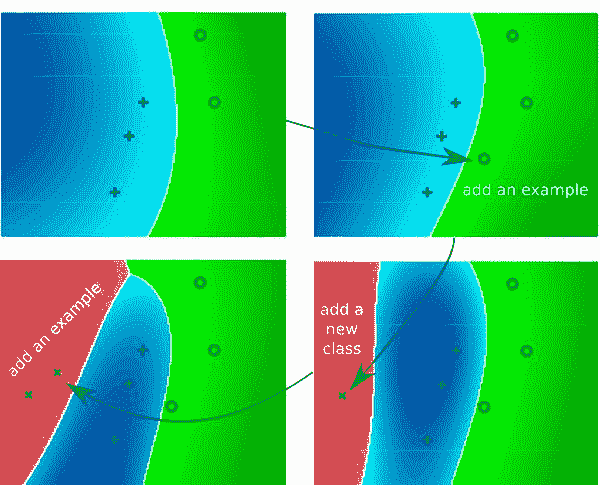
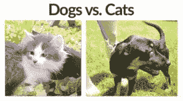

# 使用 Keras 和 Creme 进行在线/增量学习

> 原文：<https://pyimagesearch.com/2019/06/17/online-incremental-learning-with-keras-and-creme/>

[](https://pyimagesearch.com/wp-content/uploads/2019/06/incremental_learning_header.png)

在本教程中，您将学习如何使用 Keras 和 Creme 在太大而无法放入内存的数据集上执行在线/增量学习。

几周前，我向你展示了如何使用 [Keras 进行特征提取和在线学习](https://pyimagesearch.com/2019/05/27/keras-feature-extraction-on-large-datasets-with-deep-learning/)——我们使用该教程来执行*迁移学习*和*识别类，最初的 CNN 从未在*上进行过训练。

为了完成这项任务，我们需要使用 Keras 根据从图像中提取的特征来训练一个非常简单的前馈神经网络。

但是，如果我们*不想让*训练一个神经网络呢？

如果我们想在数据的基础上训练一个逻辑回归、朴素贝叶斯或决策树模型会怎么样？或者，如果我们想在训练这样一个模型之前*执行特征选择或特征处理呢？*

您可能很想使用 scikit-learn —但是您很快就会意识到 scikit-learn 并没有将增量学习作为“一等公民”对待—scikit-learn 中只包含了一些在线学习实现，至少可以说它们使用起来很笨拙。

相反，你应该使用 [**Creme**](https://github.com/creme-ml/creme) ，它:

*   实现了许多用于分类、回归、特征选择和特征预处理的流行算法。
*   有一个类似于 scikit-learn 的 API。
*   并且使得*执行在线/增量学习变得超级容易*。

在本教程的剩余部分，我将向您展示如何:

1.  使用 **Keras +预训练的 CNN**从图像数据集中提取鲁棒的、有区别的特征。
2.  利用 **Creme 对数据集*执行增量学习***，该数据集太大，无法装入内存。

我们开始吧！

**要了解如何使用 Keras 和 Creme 进行在线/增量学习，*继续阅读！***

## 使用 Keras 和 Creme 进行在线/增量学习

在本教程的第一部分，我们将讨论我们可能想要进行在线学习或增量学习的情况。

然后我们将讨论为什么 [Creme 机器学习库](https://github.com/creme-ml/creme)是增量学习的合适选择。

在本教程中，我们将使用 Kaggle 的狗与猫数据集，我们将花一些时间简要回顾该数据集。

从那里，我们将从项目中查看我们的目录结构。

一旦我们理解了目录结构，我们将实现一个 Python 脚本，该脚本将用于使用 Keras 和在 ImageNet 上预先训练的 CNN 从狗与猫数据集提取特征。

给定我们提取的特征(这些特征将太大而不适合 RAM)，我们将使用 Creme 以增量学习的方式训练逻辑回归模型，确保:

1.  **我们仍然可以训练我们的分类器，**尽管提取的特征太大而不适合存储。
2.  **我们仍然可以获得高精度，**即使我们不能一次访问“所有”功能。

### 为什么选择在线学习/增量学习？

[](https://pyimagesearch.com/wp-content/uploads/2019/06/incremental_learning_vis.jpg)

**Figure 1:** Multi-class incremental learning with Creme allows for machine learning on datasets which are too large to fit into memory ([image source](https://pub.inf-cv.uni-jena.de/pdf/Luetz13:IWT)).

无论您处理的是图像数据、文本数据、音频数据，还是数字/分类数据，**您最终都会遇到一个太大而不适合内存的数据集。**

然后呢？

*   你会去亚马逊、新蛋等网站吗？然后买一个升级了的主板，RAM 最大化？
*   你是否在云服务提供商如 [AWS](https://pyimagesearch.com/2017/09/20/pre-configured-amazon-aws-deep-learning-ami-with-python/) 或 [Azure](https://pyimagesearch.com/2018/03/21/my-review-of-microsofts-deep-learning-virtual-machine/) 上运行高内存实例？

你*可以*研究这些选项中的一个——在某些情况下，它们是完全合理的探索途径。

但是我的第一选择是应用在线/渐进式学习。

使用增量学习，您可以处理太大而不适合 RAM 的数据集*，并应用流行的机器学习技术，包括:*

*   特征预处理
*   特征选择
*   分类
*   回归
*   使聚集
*   集成方法
*   *…还有更多！*

**渐进式学习非常强大，今天你将学习如何将它应用到你自己的数据中。**

### 为什么选择 Creme 进行增量学习？

[](https://pyimagesearch.com/wp-content/uploads/2019/06/incremental_learning_creme_logo.png)

**Figure 2:** [Creme](https://github.com/creme-ml/creme) is a library specifically tailored to in**creme**ntal learning. The API is similar to that of scikit-learn’s which will make you feel at home while putting it to work on large datasets where incremental learning is required.

神经网络和深度学习是增量学习的一种形式——我们可以一次对一个样本或一批样本训练这样的网络。

然而，*仅仅因为我们能够*应用神经网络解决问题*并不意味着我们应该*。

相反，我们需要为工作带来合适的工具。仅仅因为你手里有一把锤子，并不意味着你会用它来敲螺丝。

增量学习算法包含一组用于以增量方式训练模型的技术。

当数据集太大而无法放入内存时，我们通常会利用增量学习。

然而，scikit-learn 库确实包含少量在线学习算法:

1.  它没有把增量学习作为一等公民对待。
2.  这些实现很难使用。

进入 [**Creme 库**](https://github.com/creme-ml/creme) —一个专门用于 **creme** ntal 学习 Python 的*库。*

这个图书馆本身相当新，但上周我花了一些时间对它进行了研究。

我真的很喜欢这种体验，并发现 scikit-learn 启发的 API 非常容易使用。

在阅读完本教程的其余部分后，我想你会同意我说的话， **Creme 是一个很棒的小库，我希望开发人员和维护人员一切顺利——我希望这个库继续成长。**

### 狗和猫的数据集

[](https://pyimagesearch.com/wp-content/uploads/2019/06/incremental_learning_dogs_vs_cats_dataset.jpg)

**Figure 3:** In today’s example, we’re using [Kaggle’s Dogs vs. Cats dataset](https://www.kaggle.com/c/dogs-vs-cats). We’ll extract features with Keras producing a rather large features CSV. From there, we’ll apply incremental learning with Creme.

我们今天将在这里使用的数据集是 [Kaggle 的狗对猫数据集](https://www.kaggle.com/c/dogs-vs-cats)。

数据集包括 25，000 个均匀分布的示例:

*   **狗:**12500 张图片
*   **猫:**12500 张图片

我们的目标是将迁移学习应用于:

1.  使用 Keras 和预训练的 CNN 从数据集中提取要素。
2.  通过 Creme 使用在线/增量学习，以增量方式在特征之上训练分类器。

### 设置您的 Creme 环境

虽然 Creme 需要一个简单的 pip 安装，但是对于今天的例子，我们还需要安装一些其他的包。当今必需的产品包包括:

1.  **[OpenCV](https://opencv.org/)**

3.  **[scikit-learn](https://scikit-learn.org)**
4.  **[张量流](https://www.tensorflow.org/)**
5.  **[Keras](https://keras.io/)**
6.  **奶油**

要针对本教程配置您的系统，我建议您遵循以下任一教程:

*   [*如何在 Ubuntu 上安装 tensor flow 2.0*](https://pyimagesearch.com/2019/12/09/how-to-install-tensorflow-2-0-on-ubuntu/)
*   [*如何在 macOS 上安装 tensor flow 2.0*](https://pyimagesearch.com/2019/12/09/how-to-install-tensorflow-2-0-on-macos/)

这两个教程都将帮助您在一个方便的 Python 虚拟环境中，用这篇博文所需的所有软件来配置您的系统。请注意 [PyImageSearch 不推荐也不支持 CV/DL 项目](https://pyimagesearch.com/faqs/single-faq/can-you-help-me-do-___-on-windows/)的窗口。

从那里，安装 Creme:

```py
$ workon dl4cv
$ pip install creme

```

让我们通过启动一个 Python 解释器来确保一切都已正确安装:

```py
$ workon cv
$ python
>>> import cv2
>>> import imutils
>>> import sklearn
>>> import tensorflow
>>> import creme
>>>

```

如果没有错误，您的环境就可以进行增量学习了。

### 项目结构

[](https://pyimagesearch.com/wp-content/uploads/2016/09/simple_neural_network_kaggle_dogscats.jpg)

**Figure 4:** Download train.zip from the Kaggle Dogs vs. Cats downloads page for this incremental learning with Creme project.

要设置您的项目，请遵循以下步骤:

1.  使用这篇博文的 ***“下载”*** 部分，按照说明下载代码。
2.  将代码下载到系统中的某个地方。例如，您可以将它下载到您的`~/Desktop`或`~/Downloads`文件夹中。
3.  打开一个终端，`cd`进入压缩文件调整的同一个文件夹。通过`unzip keras-creme-incremental-learning.zip`解压/解压文件。让你的终端开着。
4.  登录 Kaggle ( ***下载数据需要*** )。
5.  前往 Kaggle 狗狗大战猫 [*【数据】*页面](https://www.kaggle.com/c/dogs-vs-cats/data)。
6.  点击 ***旁边的小下载按钮只下载*** 的 train.zip 文件。将其保存到`~/Desktop/keras-creme-incremental-learning/`(或您提取博文文件的任何地方)。
7.  回到您的终端，通过`unzip train.zip`提取数据集。

现在让我们**回顾一下我们的项目结构:**

```py
$ tree --dirsfirst --filelimit 10
.
├── train [25000 entries]
├── train.zip
├── features.csv
├── extract_features.py
└── train_incremental.py

1 directory, 4 files

```

您应该会看到一个包含 25，000 个文件的`train/`目录。这是你真正的狗和猫的图像所在的地方。让我们列举几个例子:

```py
$ ls train | sort -R | head -n 10
dog.271.jpg
cat.5399.jpg
dog.3501.jpg
dog.5453.jpg
cat.7122.jpg
cat.2018.jpg
cat.2298.jpg
dog.3439.jpg
dog.1532.jpg
cat.1742.jpg

```

如您所见，类标签(或者“猫”或者“狗”)包含在文件名的前几个字符中。我们稍后将解析出类名。

回到我们的项目树，`train/`目录下是`train.zip`和`features.csv`。这些文件是 ***而不是*** 包含在 ***【下载】*** 中。你应该已经从 Kaggle 的网站下载并提取了`train.zip`。我们将在下一节学习如何提取特征并生成大的 12GB+ `features.csv`文件。

**我们将要讨论的两个 Python 脚本**是`extract_features.py`和`train_incremental.py`。让我们从用 Keras 提取特征开始！

### 使用 Keras 提取特征

在我们可以执行增量学习之前，我们首先需要**执行迁移学习**和**从我们的狗对猫数据集提取特征**。

为了完成这项任务，我们将使用 Keras 深度学习库和 ResNet50 网络(预先在 ImageNet 上进行了培训)。使用 ResNet50，我们将允许我们的图像向前传播到预先指定的层。

然后，我们将获取该层的输出激活，并将它们视为一个特征向量*。一旦我们有了数据集中所有图像的特征向量，我们将应用增量学习。*

 *让我们开始吧。

打开`extract_features.py`文件并插入以下代码:

```py
# import the necessary packages
from sklearn.preprocessing import LabelEncoder
from tensorflow.keras.applications import ResNet50
from tensorflow.keras.applications.resnet50 import preprocess_input
from tensorflow.keras.preprocessing.image import img_to_array
from tensorflow.keras.preprocessing.image import load_img
from imutils import paths
import numpy as np
import argparse
import pickle
import random
import os

# construct the argument parser and parse the arguments
ap = argparse.ArgumentParser()
ap.add_argument("-d", "--dataset", required=True,
	help="path to input dataset")
ap.add_argument("-c", "--csv", required=True,
	help="path to output CSV file")
ap.add_argument("-b", "--batch-size", type=int, default=32,
	help="batch size for the network")
args = vars(ap.parse_args())

```

在**第 2-12 行**，提取特征所需的所有包都被导入。最值得注意的是这包括`ResNet50`。 **ResNet50** 是我们用于迁移学习的卷积神经网络(CNN)(**Line 3**)。

三个[命令行参数然后通过**第 15-22 行**:被解析](https://pyimagesearch.com/2018/03/12/python-argparse-command-line-arguments/)

*   `--dataset`:我们的输入数据集的路径(即狗对猫)。
*   `--csv`:输出 CSV 文件的文件路径。
*   `--batch-size`:默认情况下，我们将使用批量大小`32`。这将容纳大多数 CPU 和 GPU。

让我们继续加载我们的模型:

```py
# load the ResNet50 network and store the batch size in a convenience
# variable
print("[INFO] loading network...")
model = ResNet50(weights="imagenet", include_top=False)
bs = args["batch_size"]

```

在第 27 行的**上，我们加载`model`，同时指定两个参数:**

*   `weights="imagenet"`:加载预训练的 ImageNet 权重用于迁移学习。
*   `include_top=False`:我们**不包括 softmax 分类器的全连接头。换句话说，我们砍掉了网络的头。**

 **加载了重量，加载了没有头部的模型，我们现在可以进行迁移学习了。我们将直接使用网络*的输出值，*将结果存储为特征向量。

我们的每个特征向量将是 100，352 维(即*7×7×2048*，这是没有 FC 层报头的 ResNet50 的输出体积的尺寸)。

从这里，让我们拿起`imagePaths`并提取我们的标签:

```py
# grab all image paths in the input directory and randomly shuffle
# the paths
imagePaths = list(paths.list_images(args["dataset"]))
random.seed(42)
random.shuffle(imagePaths)

# extract the class labels from the image paths, then encode the
# labels
labels = [p.split(os.path.sep)[-1].split(".")[0] for p in imagePaths]
le = LabelEncoder()
labels = le.fit_transform(labels)

```

在第 32-34 行的**上，我们继续抓取所有`imagePaths`并随机洗牌。**

从那里，我们的类`labels`被从路径本身中提取出来(**第 38 行**)。每个图像路径的格式为:

*   `train/cat.0.jpg`
*   `train/dog.0.jpg`
*   *等。*

在 Python 解释器中，我们可以测试第 38 行的完整性。随着您开发解析+列表理解，您的解释器可能如下所示:

```py
$ python
>>> import os
>>> label = "train/cat.0.jpg".split(os.path.sep)[-1].split(".")[0]
>>> label
'cat'
>>> imagePaths = ["train/cat.0.jpg", "train/dog.0.jpg", "train/dog.1.jpg"]
>>> labels = [p.split(os.path.sep)[-1].split(".")[0] for p in imagePaths]
>>> labels
['cat', 'dog', 'dog']
>>>

```

第 39 行和第 40 行然后实例化并安装我们的标签编码器，确保我们可以将字符串类标签转换为整数。

让我们定义 CSV 列并将它们写入文件:

```py
# define our set of columns
cols = ["feat_{}".format(i) for i in range(0, 7 * 7 * 2048)]
cols = ["class"] + cols

# open the CSV file for writing and write the columns names to the
# file
csv = open(args["csv"], "w")
csv.write("{}\n".format(",".join(cols)))

```

我们将把提取的特征写入一个 CSV 文件。

Creme 库要求 CSV 文件有一个标题，并包含每个列的名称，即:

1.  类别标签的列名
2.  每个功能的名称

**第 43 行**为每个 *7 x 7 x 2048 = 100，352* 特征创建列名，而**第 44 行**定义类名列(将存储类标签)。

因此，我们的 CSV 文件的前*五行*和*十列*将如下所示:

```py
$ head -n 5 features.csv | cut -d ',' -f 1-10
class,feat_0,feat_1,feat_2,feat_3,feat_4,feat_5,feat_6,feat_7,feat_8
1,0.0,0.0,0.0,0.0,0.0,0.0,0.0,0.0,0.0
1,0.0,0.0,0.0,0.0,0.0,0.0,0.0,0.0,0.0
0,0.0,0.0,0.0,0.0,0.0,0.0,0.0,0.0,0.0
0,0.0,0.0,0.0,0.0,0.0,0.0,0.0,0.0,0.0

```

注意`class`是第一列。然后这些列从`feat_0`一直延伸到`feat_100351`，总共有 100，352 个特征。如果您编辑该命令以打印 10 列以上——比方说 5000 列——那么您会看到并非所有的值都是 0。

接下来，让我们分批循环查看图像:

```py
# loop over the images in batches
for (b, i) in enumerate(range(0, len(imagePaths), bs)):
	# extract the batch of images and labels, then initialize the
	# list of actual images that will be passed through the network
	# for feature extraction
	print("[INFO] processing batch {}/{}".format(b + 1,
		int(np.ceil(len(imagePaths) / float(bs)))))
	batchPaths = imagePaths[i:i + bs]
	batchLabels = labels[i:i + bs]
	batchImages = []

```

我们将以`bs` ( **线 52** )的批量循环`imagePaths`。

**第 58 和 59 行**然后抓取该批路径和标签，而**第 60 行**初始化一个列表来保存该批图像。

让我们遍历当前批处理:

```py
	# loop over the images and labels in the current batch
	for imagePath in batchPaths:
		# load the input image using the Keras helper utility while
		# ensuring the image is resized to 224x224 pixels
		image = load_img(imagePath, target_size=(224, 224))
		image = img_to_array(image)

		# preprocess the image by (1) expanding the dimensions and
		# (2) subtracting the mean RGB pixel intensity from the
		# ImageNet dataset
		image = np.expand_dims(image, axis=0)
		image = imagenet_utils.preprocess_input(image)

		# add the image to the batch
		batchImages.append(image)

```

循环遍历批处理中的路径(**行 63** ，我们将加载每个`image`，对其进行预处理，并将其聚集到`batchImages`。`image`本身装载在**线 66** 上。

我们将通过以下方式对图像进行预处理:

*   通过**行 66** 上的`target_size`参数调整到 *224×224* 像素。
*   转换成数组格式(**第 67 行**)。
*   添加批次尺寸(**行 72** )。
*   执行均值减法(**第 73 行**)。

***注:**如果这些预处理步骤出现在国外，请参考[用 Python 进行计算机视觉的深度学习](https://pyimagesearch.com/deep-learning-computer-vision-python-book/)我在那里详细讲述。*

最后，通过**线 76** 将`image`添加到批次中。

为了**提取特征**，我们现在将通过我们的网络传递这批图像:

```py
	# pass the images through the network and use the outputs as our
	# actual features, then reshape the features into a flattened
	# volume
	batchImages = np.vstack(batchImages)
	features = model.predict(batchImages, batch_size=bs)
	features = features.reshape((features.shape[0], 7 * 7 * 2048))

	# loop over the class labels and extracted features
	for (label, vec) in zip(batchLabels, features):
		# construct a row that consists of the class label and extracted
		# features
		vec = ",".join([str(v) for v in vec])
		csv.write("{},{}\n".format(label, vec))

# close the CSV file
csv.close()

```

我们的一批图像经由**线 81 和 82 通过网络发送。**

请记住，我们已经删除了网络的全连接头层。相反，正向传播*在平均池层之前停止*。我们将把这一层的输出视为一个列表`features`，也称为“特征向量”。

卷的输出维度为 *(batch_size，7 x 7 x，2048)* 。因此，我们可以将`features`转换成一个形状为`(batch_size, 7 * 7 * 2048)`、*、**的 NumPy 数组，将 CNN 的输出视为一个特征向量。***

为了保持我们的批处理效率，`features`和相关的类标签被写入我们的 CSV 文件(**第 86-90 行**)。

在 CSV 文件中，类`label`是每一行中的第一个字段(使我们能够在训练期间轻松地从该行中提取它)。特征`vec`如下。

特征 CSV 文件通过第 93 行的**关闭，这是我们脚本的最后一步。**

### 使用 Keras 进行特征提取

现在我们已经编码了`extract_features.py`，让我们将它应用到我们的数据集。

确保你有:

1.  使用本教程的 ***【下载】*** 部分下载源代码。
2.  从 [Kaggle 的网站](https://www.kaggle.com/c/dogs-vs-cats)下载了狗与猫的数据集。

打开终端并执行以下命令:

```py
$ python extract_features.py --dataset train --csv features.csv
Using TensorFlow backend.
[INFO] loading network...
[INFO] processing batch 1/782
[INFO] processing batch 2/782
[INFO] processing batch 3/782
...
[INFO] processing batch 780/782
[INFO] processing batch 781/782
[INFO] processing batch 782/782

```

使用 NVIDIA K80 GPU，整个特征提取过程花费了**20 分 45 秒**。

你也可以使用你的 CPU，但是记住特征提取过程将花费*更长的时间*。

在您的脚本完成运行后，看看`features.csv`的输出大小:

```py
$ ls -lh features.csv 
-rw-rw-r-- 1 ubuntu ubuntu 12G Jun  10 11:16 features.csv

```

**生成的文件超过 12GB！**

如果我们将该文件加载到 RAM 中，假设特征向量为 32 位浮点数， ***我们将需要 10.03GB！***

你的机器可能有也可能没有那么多内存…但这不是重点。最终，您会遇到一个太大的数据集，无法在主存中处理。到时候，你需要使用增量学习。

### 使用 Creme 的增量学习

如果您正在学习本教程，那么我将假设您已经使用 Keras 和 ResNet50(在 ImageNet 上进行了预训练)从狗和猫的数据集中提取了特征。

但是现在呢？

我们假设提取的特征向量的整个数据集太大，不适合内存— **我们如何在这些数据上训练机器学习分类器？**

打开`train_incremental.py`文件，让我们看看:

```py
# import the necessary packages
from creme.linear_model import LogisticRegression
from creme.multiclass import OneVsRestClassifier
from creme.preprocessing import StandardScaler
from creme.compose import Pipeline
from creme.metrics import Accuracy
from creme import stream
import argparse

```

**第 2-8 行**导入使用 Creme 进行增量学习所需的包。我们将利用 Creme 对`LogisticRegression`的实现。Creme 的`stream`模块包括一个超级方便的 CSV 数据生成器。在整个培训过程中，我们将使用 Creme 内置的`metrics`工具计算并打印出当前的`Accuracy`。

现在让我们使用 [argparse 来解析我们的命令行参数](https://pyimagesearch.com/2018/03/12/python-argparse-command-line-arguments/):

```py
# construct the argument parser and parse the arguments
ap = argparse.ArgumentParser()
ap.add_argument("-c", "--csv", required=True,
	help="path to features CSV file")
ap.add_argument("-n", "--cols", type=int, required=True,
	help="# of feature columns in the CSV file (excluding class column")
args = vars(ap.parse_args())

```

我们的两个命令行参数包括:

*   `--csv`:输入 CSV 特征文件的路径。
*   `--cols`:我们的特征向量的维数(即我们的特征向量有多少列)。

现在我们已经解析了我们的命令行参数，我们需要指定 CSV 文件的数据类型来正确使用 Creme 的`stream`模块:

```py
# construct our data dictionary which maps the data types of the
# columns in the CSV file to built-in data types
print("[INFO] building column names...")
types = {"feat_{}".format(i): float for i in range(0, args["cols"])}
types["class"] = int

```

**第 21 行**为 CSV 的每个特性列构建了一个数据类型(浮点)列表。我们将有 100，352 辆车。

类似地，**第 22 行**指定我们的`class`列是整数类型。

接下来，让我们初始化数据生成器并构建管道:

```py
# create a CSV data generator for the extracted Keras features
dataset = stream.iter_csv(args["csv"], target="class", converters=types)

# construct our pipeline
model = Pipeline([
	("scale", StandardScaler()),
	("learn", OneVsRestClassifier(classifier=LogisticRegression()))
])

```

**第 25 行**创建一个 CSV 迭代器，它将`stream`特征+类标签添加到我们的模型中。

**第 28-31 行**然后构建模型管道，它:

*   首先执行标准缩放(缩放数据以使平均值和单位方差为零)。
*   然后以增量方式(一次一个数据点)训练我们的逻辑回归模型。

逻辑回归是一个**二元分类器，这意味着它只能用于预测两个类别**(这正是狗和猫的数据集)。

然而，如果您想让**识别 *> 2* 类**，您需要将`LogisticRegression`包装在一个`OneVsRestClassifier`中，它适合每个类一个二元分类器。

 *让我们使用 Creme 来训练我们的模型:

```py
# initialize our metric
print("[INFO] starting training...")
metric = Accuracy()

# loop over the dataset
for (i, (X, y)) in enumerate(dataset):
	# make predictions on the current set of features, train the
	# model on the features, and then update our metric
	preds = model.predict_one(X)
	model = model.fit_one(X, y)
	metric = metric.update(y, preds)
	print("INFO] update {} - {}".format(i, metric))

# show the accuracy of the model
print("[INFO] final - {}".format(metric))

```

**第 35 行**初始化我们的`metric`(即精度)。

从那里，我们开始循环我们的数据集(**行 38** )。在循环内部，我们:

*   对当前数据点进行预测(**行 41** )。有 25，000 个数据点(图像)，所以这个循环将运行那么多次。
*   基于预测更新`model`权重(**第 42 行**)。
*   更新并显示我们的精确度`metric` ( **第 43 和 44 行**)。

最后，模型的精度显示在终端(**行 47** )。

### 增量学习结果

我们现在准备使用 Keras 和 Creme 应用增量学习。确保你有:

1.  使用本教程的 ***【下载】*** 部分下载源代码。
2.  从 [Kaggle 的网站](https://www.kaggle.com/c/dogs-vs-cats)下载了狗与猫的数据集。

从那里，打开一个终端并执行以下命令:

```py
$ python train_incremental.py --csv features.csv --cols 100352
[INFO] building column names...
[INFO] starting training...
[INFO] update 0 - Accuracy: 0.00%
[INFO] update 1 - Accuracy: 0.00%
[INFO] update 2 - Accuracy: 33.33%
[INFO] update 3 - Accuracy: 50.00%
[INFO] update 4 - Accuracy: 60.00%
[INFO] update 5 - Accuracy: 66.67%
[INFO] update 6 - Accuracy: 71.43%
[INFO] update 7 - Accuracy: 62.50%
[INFO] update 8 - Accuracy: 66.67%
[INFO] update 9 - Accuracy: 70.00%
[INFO] update 10 - Accuracy: 72.73%
[INFO] update 11 - Accuracy: 75.00%
[INFO] update 12 - Accuracy: 76.92%
[INFO] update 13 - Accuracy: 78.57%
[INFO] update 14 - Accuracy: 73.33%
[INFO] update 15 - Accuracy: 75.00%
[INFO] update 16 - Accuracy: 76.47%
[INFO] update 17 - Accuracy: 77.78%
[INFO] update 18 - Accuracy: 78.95%
[INFO] update 19 - Accuracy: 80.00%
[INFO] update 20 - Accuracy: 80.95%
[INFO] update 21 - Accuracy: 81.82%
...
[INFO] update 24980 - Accuracy: 97.61%
[INFO] update 24981 - Accuracy: 97.61%
[INFO] update 24982 - Accuracy: 97.61%
[INFO] update 24983 - Accuracy: 97.61%
[INFO] update 24984 - Accuracy: 97.61%
[INFO] update 24985 - Accuracy: 97.61%
[INFO] update 24986 - Accuracy: 97.61%
[INFO] update 24987 - Accuracy: 97.61%
[INFO] update 24988 - Accuracy: 97.61%
[INFO] update 24989 - Accuracy: 97.61%
[INFO] update 24990 - Accuracy: 97.61%
[INFO] update 24991 - Accuracy: 97.60%
[INFO] update 24992 - Accuracy: 97.60%
[INFO] update 24993 - Accuracy: 97.60%
[INFO] update 24994 - Accuracy: 97.60%
[INFO] update 24995 - Accuracy: 97.60%
[INFO] update 24996 - Accuracy: 97.60%
[INFO] update 24997 - Accuracy: 97.60%
[INFO] update 24998 - Accuracy: 97.60%
[INFO] update 24999 - Accuracy: 97.60%
[INFO] final - Accuracy: 97.60%
```

仅在 21 个样本之后，我们的逻辑回归模型获得了 81.82%的准确度。

让模型在所有 25，000 个样本上训练，**我们达到了 97.6%** 的准确度，这是相当可观的。这个过程在我的系统上花费了 **6hr48m** 的时间。

同样，这里的关键点是，我们的逻辑回归模型是以一种*增量方式*训练的——我们被*而不是*要求一次将整个数据集存储在内存中。相反，我们可以一次一个样本地训练我们的逻辑回归分类器。

## 摘要

在本教程中，您学习了如何使用 Keras 和 Creme 机器学习库执行在线/增量学习。

使用在 ImageNet 上预先训练的 Keras 和 ResNet50，我们应用迁移学习从狗与猫数据集提取特征。

在狗和猫的数据集中，我们总共有 25，000 张图片。ResNet50 的输出音量为 *7 x 7 x 2048 = 100，352-dim。*假设我们的 100，352 维特征向量为 32 位浮点，**这意味着试图一次在内存中存储*整个*数据集将需要 10.03GB 的 RAM。**

并非所有机器学习从业者的机器上都有那么多内存。

更重要的是——**即使你*有足够的内存来存储这个数据集，*你最终也会遇到一个超过你机器物理内存的数据集。****

 *当这种情况出现时，你应该应用在线/增量学习。

使用 Creme 库，我们一次训练一个多类逻辑回归分类器，**使我们能够在狗对猫数据集上获得 *97.6%的准确度*** 。

我希望你喜欢今天的教程！

在需要在线/增量学习的地方，可以随意使用这篇博文中的代码作为自己项目的起点。

**要下载这篇文章的源代码，并在 PyImageSearch 上发布未来教程时得到通知，*只需在下面的表格中输入您的电子邮件地址！********