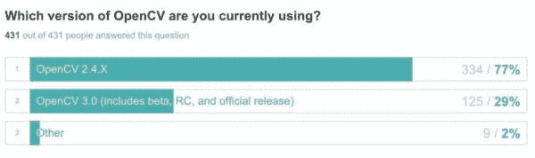
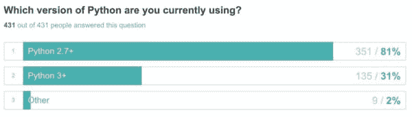
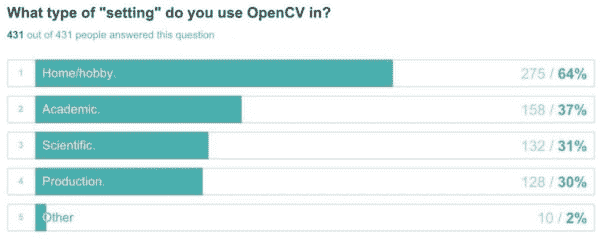

# OpenCV 3 采用率

> 原文：<https://pyimagesearch.com/2015/11/23/opencv-3-adoption-rate/>

众所周知，OpenCV 3.0 是在 2015 年 6 月[正式发布的](https://pyimagesearch.com/2015/06/08/opencv-3-0-released-and-the-coming-changes-to-the-pyimagesearch-blog/)。这次新的更新包含了大量的新特性和优化，包括 *Python 3 绑定*。

但大家心头的大问题是: ***“我该不该转 OpenCV 3？如果是，我应该什么时候切换？”***

决定*何时*甚至*是否*应该切换到 OpenCV 3 不一定是最容易的决定，*尤其是* (1)如果你正在将 OpenCV 部署到生产环境中，或者(2)你正在计算机视觉领域进行研究。

为了帮助回答你是否应该转换到 OpenCV 3(以及“什么时候”你应该转换)，我给 PyImageSearch 的一部分读者发了电子邮件，请他们做一个关于 OpenCV 使用的四个问题的快速调查。

结果很有见地——但在我分享我的主要观点之前，我会让你从这些结果中得出自己的结论。

## OpenCV 3 采用率

几个月前，我给一些最活跃的 PyImageSearch 读者发了电子邮件，请他们回答一个简短的关于 OpenCV 使用的 4 个问题的调查。我收到了 431 份答复，这些答复是我今天收集在这里的。对于大多数问题，读者可以为适用于他们的每个答案选择*多个答案*。

### 问题 1:你目前使用的是哪个版本的 OpenCV？

*   OpenCV 2.4.X
*   OpenCV 3.0(包括测试版、RC 版和正式版)
*   其他的

这个问题的目的仅仅是建立一个大多数人使用 OpenCV 版本的基线。不出所料，OpenCV 2.4.X 优于 OpenCV 3.0:

**Figure 1:** OpenCV 2.4.X is currently being used over 2.65x more than OpenCV 3

毫不奇怪，大多数人仍然在使用 OpenCV 2.4.X。然而，29%的开发人员、研究人员和程序员已经开始在某种程度上使用 OpenCV 3.0。对于一个全新的主版本的库来说，在短短几个月内达到 29%的使用率是非常了不起的。

这种采用趋势会持续下去吗？

是的，我相信会的。然而，我认为我们还需要一年时间才能看到 OpenCV 3.0 达到 50%的采用率，与 OpenCV 2.4.X 持平。

这主要是因为 OpenCV 2.4 的 ***仍然是计算机视觉开发事实上的标准*** 。OpenCV 2.4 出现的时间更长。更稳定。它应用了更多的漏洞补丁。目前，它已被部署到世界各地的生产环境和研究实验室中，在这些地方，交换的成本是不小的，而且可能相当昂贵。

比如随着 OpenCV 3 的发布，`cv2.findContours`等常用函数有[不同于 OpenCV 2.4](https://pyimagesearch.com/2015/08/10/checking-your-opencv-version-using-python/) 的返回签名。`cv2.normalize`函数签名也发生了变化。[默认情况下 OpenCV 3 中不再包含 SIFT 和 SURF】，需要我们安装`opencv_contrib`包。](https://pyimagesearch.com/2015/07/16/where-did-sift-and-surf-go-in-opencv-3/)

这些变化是“交易破坏者”吗？

绝对不行。但是对于大型代码库来说，切换的成本是不小的，特别是因为这只是 OpenCV 的 *v3.0* 版本，随着版本的成熟，可能会有更多的变化。

### 问题 2:你目前使用的是哪个版本的 Python？

*   Python 2.7+版本
*   Python 3+
*   其他的

结果如下:

**Figure 2:** Python 2.7 is currently favored over Python 3 for computer vision development.

Python 2.7 的使用率是 Python 3 的 2.6 倍，这一事实并不令人惊讶。首先，Python 科学界[不愿意切换到 Python 3](https://jakevdp.github.io/blog/2013/01/03/will-scientists-ever-move-to-python-3/)——尽管现在这种情况正在迅速改变，因为 [NumPy](http://www.numpy.org/) 、 [SciPy](http://scipy.org/) 、 [scikit-learn](http://scikit-learn.org/stable/index.html) ，以及令人敬畏的 [2to3](https://docs.python.org/2/library/2to3.html) 工具为 Python 3 的采用铺平了道路。

**其次，OpenCV 2.4.X 是** ***唯一兼容 Python 2.7 的*。**直到 OpenCV 3.0 发布，我们才获得 Python 3 支持。

简单地说:如果你在 2015 年 6 月之前用 OpenCV 做任何开发，你肯定是在用 Python 2.7(T3)做 T2。

事实上，看到 OpenCV 用户已经达到 31%的 Python 3 使用率是相当令人惊讶的！我猜想使用 Python 3 的计算机视觉开发人员的比例会低得多。但是话又说回来，您很可能正在从事与计算机视觉无关的其他项目，这些项目中的库与 Python 3 兼容。

综上所述，考虑到 OpenCV 3 和 Python 3+的集成，我完全预计这个数字会在明年上升。

### 问题 3:你在什么类型的“设置”中使用 OpenCV？

*   家庭/爱好
*   学术的
*   科学的
*   生产
*   其他的

同样，用户可以选择所有适用的答案。下面你可以看到结果:

**Figure 3:** Interestingly, of the 431 respondents, most developers are using OpenCV 3 in the “home/hobby” setting.

需要注意的是，这些答案并不相互排斥。仅仅因为你可能在做学术或科学研究，*并不意味着*你不能在一天结束后回家做你的业余爱好计算机视觉项目(事实上，我愿意做我们很多人都在做的事情)。

同样，“学术”和“科学”也有很多重叠的地方。如果你在大学里写作和发表论文，那么你肯定会在学术环境中使用 OpenCV。但是你也在进行 T2 科学研究。

然而，如果你正在建造一个最先进的计算机视觉*产品*，那么你是在*生产*环境中进行*科学*研究，但是这个研究不一定是*学术*。

我个人认为 OpenCV 3 对这些数字影响不大。

家庭和业余爱好用户将更有可能玩 OpenCV 并尝试一下，尤其是当他们访问 OpenCV.org 网站并看到 OpenCV 3.0 是最新的稳定版本时。

但是在生产、科学或学术环境中，考虑到遗留代码和其他依赖性，从 OpenCV 2.4 转换到 OpenCV 3 的成本要高得多。此外，如果你正在做科学/学术研究，你可能*依赖*OpenCV 2.4 来运行与各种实验相关的遗留代码。

### 问题 4:你计划升级到 OpenCV 3.0 吗？

*   我不着急——我会慢慢来，等 *v3* 版本更成熟时再升级。
*   是的，我正在升级/已经升级了。
*   我现在没有升级到 OpenCV 3.0 的计划。

对于这个问题，读者只能选择 ***一个*** 的答案。

**Figure 4:** Most OpenCV users are waiting for OpenCV 3.0 to mature a bit.

我个人对这个问题的回答并不太惊讶。OpenCV 是一个有着悠久历史的大而成熟的库。推出新版本需要一段时间，尤其是主要版本。事实上，自从 *v2.0* 发布以来，大约已经有 ***6 年*** 了。而 ***3 年*** 在 *v2.3* 和 *v2.4* 之间——说一说发布之间的长时间！

鉴于库的新版本需要一段时间才能发布，采用率也有点慢是有道理的。我们都*好奇*新版本，但我们可能不会*完全采用*最新版本，直到我们(1)有时间/资源更新我们的旧代码库，或者(2)我们开始一个新项目，可以从零开始而不用担心依赖性。

## 我的外卖

如果要我用一句话来总结我的观点，那就是:

不要因为切换到 OpenCV 3.0 而紧张。

**如果你从零开始:** 如果你开始一个全新的项目，在那里你不必担心依赖关系和遗留代码， ***切换到 OpenCV 3.0* 没有坏处。**事实上，在这种特殊的情况下， ***我会鼓励你使用 OpenCV 3*** ，因为你会提高采用率并推动库向前发展。请记住库*将会*进化，如果你现在想使用 OpenCV 3.0 *，你可能需要在 OpenCV 3.1 发布后*更新你的代码。

**如果你有一个现有的 OpenCV 项目:** 除非 OpenCV 3 中有 2.4.X 中没有的新特性，或者你绝对*必须*有 Python 3 支持，否则迁移你的整个代码库可能还为时过早。在我看来，OpenCV 3.0 在很大程度上仍处于起步阶段:仍有问题需要解决，仍有缺陷需要修复。我会考虑等到 *v3.1* 甚至 *v3.2* 发布后，再认真考虑做出大的改变。

**如果你在学术、科学或生产环境中:** 我会建议不要在这个时候做出改变，只要你有一个现有的实验代码库。正如我之前提到的，OpenCV 2.4.X 仍然是计算机视觉开发的事实上的标准。2.4 版本更加成熟和稳定。通过坚持使用 2.4 版本直到 *v3* 成熟，您可以省去很多麻烦。

阿德里安在做什么？
就我个人而言，我的笔记本电脑上同时安装了 OpenCV 2.4 和 OpenCV 3。我每天都使用这两个版本，主要是为了适应 OpenCV 3 环境(更不用说使用 Python 3 了)，并帮助解答与版本差异相关的任何问题。但是我仍然在我的所有生产环境中使用 OpenCV 2.4。最终，我会完全切换到 OpenCV 3——但我不认为这实际上会发生在 *v3.1* 或 *v3.2* 版本上。

## 摘要

最近，我向最活跃的 PyImageSearch 读者发出了一份调查，询问他们是否计划转向 OpenCV 3。我收到了 431 份调查反馈，并在这篇博文中展示了调查结果。

总的来说，大多数读者并不急于切换到 OpenCV 3。

虽然我可以回报这种感觉，但我每天都使用 OpenCV 2.4 和 3.0。如果您在家庭/业余爱好环境中使用 OpenCV，无论如何，请升级到 OpenCV 3 并使用它。但是如果你在生产、学术或科学环境中，我会考虑等到 *v3* 版本稍微成熟一点。一个主要的例外是，如果你正在开始一个*的全新项目*，在那里你没有任何依赖或遗留代码——在这种情况下，我会鼓励你使用 OpenCV 3。