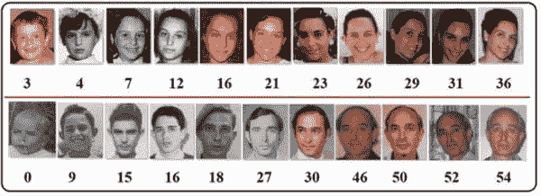
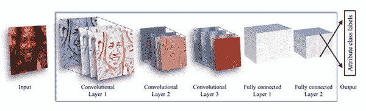
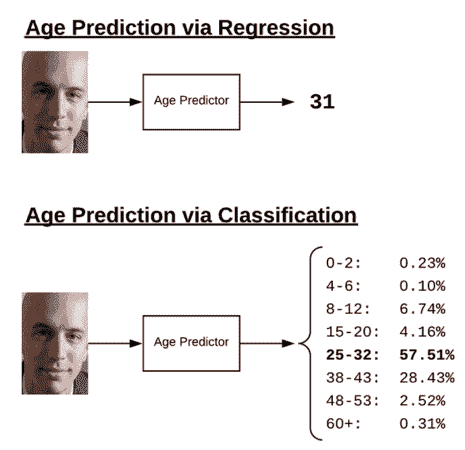
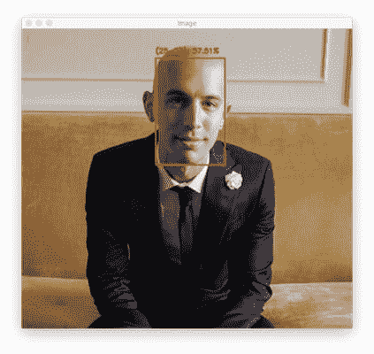
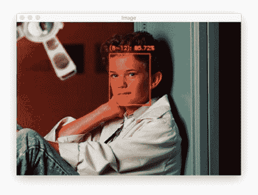
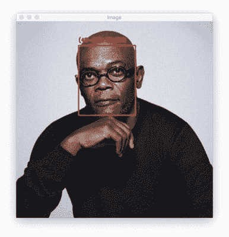
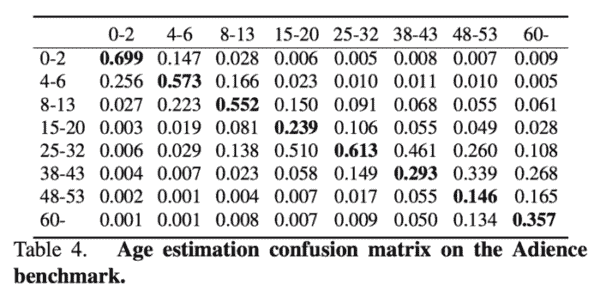

# 具有深度学习的 OpenCV 年龄检测

> 原文：<https://pyimagesearch.com/2020/04/13/opencv-age-detection-with-deep-learning/>

在本教程中，您将学习如何使用 OpenCV、深度学习和 Python 来执行自动年龄检测/预测。

在本教程结束时，你将能够以相当高的准确度自动预测静态图像文件和实时视频流的年龄。

**要了解如何使用 OpenCV 和深度学习进行年龄检测，*继续阅读！***

## 具有深度学习的 OpenCV 年龄检测

在本教程的第一部分，您将了解年龄检测，包括从图像或视频流中自动预测一个人的年龄所需的步骤(以及为什么年龄检测最好被视为一个*分类*问题，而不是一个*回归*问题)。

在此基础上，我们将讨论我们基于深度学习的年龄检测模型，然后学习如何将该模型用于以下两个方面:

1.  静态图像中的年龄检测
2.  实时视频流中的年龄检测

然后我们将回顾我们的年龄预测工作的结果。

### 什么是年龄检测？



**Figure 1:** In this tutorial, we use OpenCV and a pre-trained deep learning model to predict the age of a given face ([image source](https://www.researchgate.net/publication/336955775_Age_Estimation_in_Make-up_Cosmetics_Using_Color_and_Depth_Images)).

年龄检测是指*自动*从一张人脸照片中*单独*识别一个人年龄的过程。

通常，您会看到年龄检测实施为两个阶段的过程:

1.  **阶段#1:** 检测输入图像/视频流中的人脸
2.  **阶段#2:** 提取脸部感兴趣区域(ROI)，并应用年龄检测器算法来预测人的年龄

**对于阶段#1，可以使用能够为图像中的人脸产生边界框的任何人脸检测器，**包括但不限于哈尔级联、HOG +线性 SVM、单镜头检测器(SSDs)等。

具体使用哪种人脸检测器取决于您的项目:

*   Haar cascades 将非常快，能够在嵌入式设备上实时运行——*问题*是它们不太准确，并且很容易出现假阳性检测
*   HOG +线性 SVM 模型比哈尔级联更精确，但速度更慢。他们也不能容忍遮挡(即，不是整个面部都可见)或视点变化(即，面部的不同视图)
*   基于深度学习的人脸检测器是最鲁棒的，将为您提供最佳的准确性，但比哈尔级联和 HOG +线性 SVM 需要更多的计算资源

在为您的应用选择人脸检测器时，请花时间考虑您的项目要求——对于您的使用案例，速度还是精度更重要？我还建议对每个面部检测器进行一些实验，这样你就可以让实验结果来指导你的决定。

**一旦您的面部检测器在图像/视频流中生成了面部的边界框坐标，您就可以进入第二阶段——识别该人的年龄。**

给定边界框 *(x，y)*-人脸坐标，首先提取人脸 ROI，忽略图像/帧的其余部分。这样做可以让年龄检测器将*单独*聚焦在人脸上，而不是图像中任何其他不相关的“噪音”。

面部 ROI 然后通过模型，产生实际年龄预测。

有许多年龄检测器算法，但最流行的是基于深度学习的年龄检测器——我们将在本教程中使用这样一种基于深度学习的年龄检测器。

### 我们的年龄检测器深度学习模型



**Figure 2:** Deep learning age detection is an active area of research. In this tutorial, we use the model implemented and trained by Levi and Hassner in their 2015 paper ([image source, Figure 2](https://talhassner.github.io/home/projects/cnn_agegender/CVPR2015_CNN_AgeGenderEstimation.pdf)).

我们今天在这里使用的深度学习年龄检测器模型是由 Levi 和 Hassner 在他们 2015 年的出版物中实现和训练的， [*使用卷积神经网络*](https://talhassner.github.io/home/publication/2015_CVPR) *进行年龄和性别分类。*

**在论文中，作者提出了一个简单的类似 AlexNet 的架构，它可以学习总共八个年龄段:**

1.  0-2
2.  4-6
3.  8-12
4.  15-20
5.  25-32
6.  38-43
7.  48-53
8.  60-100

你会注意到这些年龄段是*不连续的*——这是故意这样做的，因为用于训练模型的 [Adience 数据集](https://talhassner.github.io/home/projects/Adience/Adience-data.html#agegender)如此定义了年龄范围(我们将在下一节了解为什么这样做)。

在这篇文章中，我们将使用一个*预训练的*年龄检测器模型，但如果你有兴趣学习如何从头开始训练它，请务必阅读用 Python 进行计算机视觉深度学习的*，*，在那里我将向你展示如何做到这一点。

### 为什么我们不把年龄预测当作一个回归问题？



**Figure 3:** Age prediction with deep learning can be framed as a regression or classification problem.

你会从上一节中注意到，我们已经将年龄离散化为“桶”，从而将年龄预测视为一个*分类问题——**为什么不将其框架化为*回归*问题，而不是**(就像我们在[房价预测教程中所做的那样)](https://pyimagesearch.com/2019/01/28/keras-regression-and-cnns/)？*

 *从技术上讲，没有理由不能将年龄预测视为一项回归任务。甚至有一些模型就是这样做的。

问题在于，年龄预测天生就是主观的，仅仅基于外表的*。*

 *一个 50 多岁的人，一生中从未吸烟，外出时总是涂防晒霜，并每天护理皮肤，可能会比一个 30 多岁的人看起来年轻，他每天抽一盒烟，从事体力劳动，没有防晒措施，也没有适当的皮肤护理制度。

让我们不要忘记衰老最重要的驱动因素，*遗传*——有些人只是比其他人更容易衰老。

例如，看看下面这张马修·派瑞(她在电视情景喜剧《老友记》中扮演钱德勒·宾)的照片，并将其与詹妮弗·安妮斯顿(她和佩里一起扮演瑞秋·格林)的照片进行比较:


**Figure 4:** Many celebrities and figure heads work hard to make themselves look younger. This presents a challenge for deep learning age detection with OpenCV.

你能猜到马修·派瑞(50 岁)实际上比詹妮弗·安妮斯顿(51 岁)小一岁吗？

除非你事先了解这些演员，否则我很怀疑。

但是，另一方面，你能猜到这些演员是 48-53 岁吗？

我敢打赌你可能会。

虽然人类天生就不擅长*预测单一的年龄值，但我们实际上*非常擅长*预测年龄段。*

 *这当然是一个加载的例子。

詹妮弗·安妮斯顿的遗传基因近乎完美，再加上一位极具天赋的整形外科医生，她似乎永远不会衰老。

但是这也说明了我的观点——人们*故意*试图隐瞒他们的年龄。

如果一个*人*努力准确预测一个人的年龄，那么一个*机器*肯定也会努力。

一旦你开始将年龄预测视为一个回归问题，模型就很难准确预测代表这个人形象的单个值。

然而，如果你把它当作一个分类问题，为模型定义桶/年龄段，我们的年龄预测模型变得更容易训练，通常比单独基于回归的预测产生更高的准确性。

简单地说:**将年龄预测视为分类稍微“放松”了这个问题，使它更容易解决——通常，我们不需要一个人的*精确的*年龄；粗略的估计就足够了。**

### 项目结构

一定要从这篇博文的 ***“下载”*** 部分获取代码、模型和图片。提取文件后，您的项目将如下所示:

```py
$ tree --dirsfirst
.
├── age_detector
│   ├── age_deploy.prototxt
│   └── age_net.caffemodel
├── face_detector
│   ├── deploy.prototxt
│   └── res10_300x300_ssd_iter_140000.caffemodel
├── images
│   ├── adrian.png
│   ├── neil_patrick_harris.png
│   └── samuel_l_jackson.png
├── detect_age.py
└── detect_age_video.py

3 directories, 9 files
```

前两个目录由我们的**年龄预测器**和**人脸检测器**组成。这些深度学习模型中的每一个都是基于咖啡的。

我已经为年龄预测提供了三张测试图片；你也可以添加自己的图片。

在本教程的剩余部分，我们将回顾两个 Python 脚本:

*   `detect_age.py`:单幅图像年龄预测
*   `detect_age_video.py`:视频流中的年龄预测

这些脚本中的每一个都检测图像/帧中的人脸，然后使用 OpenCV 对它们执行年龄预测。

### 实现我们的 OpenCV 图像年龄检测器

让我们从使用 OpenCV 在静态图像中实现年龄检测开始。

打开项目目录中的`detect_age.py`文件，让我们开始工作:

```py
# import the necessary packages
import numpy as np
import argparse
import cv2
import os

# construct the argument parse and parse the arguments
ap = argparse.ArgumentParser()
ap.add_argument("-i", "--image", required=True,
	help="path to input image")
ap.add_argument("-f", "--face", required=True,
	help="path to face detector model directory")
ap.add_argument("-a", "--age", required=True,
	help="path to age detector model directory")
ap.add_argument("-c", "--confidence", type=float, default=0.5,
	help="minimum probability to filter weak detections")
args = vars(ap.parse_args())
```

为了启动我们的年龄检测器脚本，我们导入了 NumPy 和 OpenCV。我推荐使用我的 *[pip 安装 opencv](https://pyimagesearch.com/2018/09/19/pip-install-opencv/)* 教程来配置你的系统。

此外，我们需要导入 Python 内置的`os`模块来连接我们的模型路径。

最后，我们[导入 argparse 来解析命令行参数](https://pyimagesearch.com/2018/03/12/python-argparse-command-line-arguments/)。

我们的脚本需要四个命令行参数:

*   `--image`:为年龄检测提供输入图像的路径
*   `--face`:我们预训练的人脸检测器模型目录的路径
*   `--age`:我们预先培训的年龄检测器型号目录
*   `--confidence`:过滤弱检测的最小概率阈值

正如我们在上面了解到的，我们的年龄检测器是一个分类器，它根据预定义的桶使用一个人的面部 ROI 来预测他的年龄——我们不把这当作一个回归问题。现在让我们来定义这些年龄范围:

```py
# define the list of age buckets our age detector will predict
AGE_BUCKETS = ["(0-2)", "(4-6)", "(8-12)", "(15-20)", "(25-32)",
	"(38-43)", "(48-53)", "(60-100)"]
```

我们的年龄由预先训练好的年龄检测器的桶(即类别标签)来定义。我们将使用这个列表和一个相关联的索引来获取年龄桶，以便在输出图像上进行注释。

给定我们的导入、命令行参数和年龄桶，我们现在准备加载我们的两个预训练模型:

```py
# load our serialized face detector model from disk
print("[INFO] loading face detector model...")
prototxtPath = os.path.sep.join([args["face"], "deploy.prototxt"])
weightsPath = os.path.sep.join([args["face"],
	"res10_300x300_ssd_iter_140000.caffemodel"])
faceNet = cv2.dnn.readNet(prototxtPath, weightsPath)

# load our serialized age detector model from disk
print("[INFO] loading age detector model...")
prototxtPath = os.path.sep.join([args["age"], "age_deploy.prototxt"])
weightsPath = os.path.sep.join([args["age"], "age_net.caffemodel"])
ageNet = cv2.dnn.readNet(prototxtPath, weightsPath)
```

这里，我们加载两个模型:

*   我们的人脸检测器在图像中找到并定位人脸(**行 25-28** )
*   年龄分类器确定特定面部属于哪个年龄范围(**行 32-34**

这些模型都是用 Caffe 框架训练出来的。我将在 *[PyImageSearch 大师](https://pyimagesearch.com/pyimagesearch-gurus/)* [课程](https://pyimagesearch.com/pyimagesearch-gurus/)中讲述如何训练 Caffe 分类器。

现在我们所有的初始化都已经完成了，让我们从磁盘加载一个图像并检测面部感兴趣区域:

```py
# load the input image and construct an input blob for the image
image = cv2.imread(args["image"])
(h, w) = image.shape[:2]
blob = cv2.dnn.blobFromImage(image, 1.0, (300, 300),
	(104.0, 177.0, 123.0))

# pass the blob through the network and obtain the face detections
print("[INFO] computing face detections...")
faceNet.setInput(blob)
detections = faceNet.forward()
```

**第 37-40 行**加载并预处理我们的输入`--image`。我们使用 OpenCV 的`blobFromImage`方法——请务必[在我的教程](https://pyimagesearch.com/2017/11/06/deep-learning-opencvs-blobfromimage-works/)中阅读更多关于 blobFromImage 的内容。

为了让**在我们的图像**中检测人脸，我们通过 CNN 发送`blob`，产生一个`detections`列表。现在让我们循环一下面部 ROI 检测:

```py
# loop over the detections
for i in range(0, detections.shape[2]):
	# extract the confidence (i.e., probability) associated with the
	# prediction
	confidence = detections[0, 0, i, 2]

	# filter out weak detections by ensuring the confidence is
	# greater than the minimum confidence
	if confidence > args["confidence"]:
		# compute the (x, y)-coordinates of the bounding box for the
		# object
		box = detections[0, 0, i, 3:7] * np.array([w, h, w, h])
		(startX, startY, endX, endY) = box.astype("int")

		# extract the ROI of the face and then construct a blob from
		# *only* the face ROI
		face = image[startY:endY, startX:endX]
		faceBlob = cv2.dnn.blobFromImage(face, 1.0, (227, 227),
			(78.4263377603, 87.7689143744, 114.895847746),
			swapRB=False)
```

当我们在`detections`上循环时，我们过滤掉弱的`confidence`面(**线 51-55** )。

对于满足最低置信度标准的人脸，我们提取 ROI 坐标(**第 58-63 行**)。在这一点上，我们从图像中截取了一小部分，只包含一张脸。我们继续通过**行 64-66** 从这个 ROI(即`faceBlob`)创建一个斑点。

现在我们将**执行年龄检测:**

```py
		# make predictions on the age and find the age bucket with
		# the largest corresponding probability
		ageNet.setInput(faceBlob)
		preds = ageNet.forward()
		i = preds[0].argmax()
		age = AGE_BUCKETS[i]
		ageConfidence = preds[0][i]

		# display the predicted age to our terminal
		text = "{}: {:.2f}%".format(age, ageConfidence * 100)
		print("[INFO] {}".format(text))

		# draw the bounding box of the face along with the associated
		# predicted age
		y = startY - 10 if startY - 10 > 10 else startY + 10
		cv2.rectangle(image, (startX, startY), (endX, endY),
			(0, 0, 255), 2)
		cv2.putText(image, text, (startX, y),
			cv2.FONT_HERSHEY_SIMPLEX, 0.45, (0, 0, 255), 2)

# display the output image
cv2.imshow("Image", image)
cv2.waitKey(0)
```

使用我们的面部斑点，我们进行年龄预测(**第 70-74 行**)，产生`age`桶和`ageConfidence`。我们使用这些数据点以及面部 ROI 的坐标来注释原始输入`--image` ( **行 77-86** )并显示结果(**行 89 和 90** )。

在下一部分，我们将分析我们的结果。

### OpenCV 年龄检测结果

让我们将 OpenCV 年龄检测器投入使用。

首先使用本教程的 ***“下载”*** 部分下载源代码、预训练的年龄检测器模型和示例图像。

从那里，打开一个终端，并执行以下命令:

```py
$ python detect_age.py --image images/adrian.png --face face_detector --age age_detector
[INFO] loading face detector model...
[INFO] loading age detector model...
[INFO] computing face detections...
[INFO] (25-32): 57.51%
```



**Figure 5:** Age detection with OpenCV has correctly identified me in this photo of me when I was 30 years old.

在这里，你可以看到我们的 OpenCV 年龄检测器以 57.51%的置信度预测我的年龄为 25-32 岁——事实上，年龄检测器是*正确的*(拍摄那张照片时我 30 岁)。

让我们再举一个例子，这个著名的演员之一，尼尔·帕特里克·哈里斯小时候:

```py
$ python detect_age.py --image images/neil_patrick_harris.png --face face_detector --age age_detector
[INFO] loading face detector model...
[INFO] loading age detector model...
[INFO] computing face detections...
[INFO] (8-12): 85.72%
```



**Figure 6:** Age prediction with OpenCV results in a high confidence that Neil Patrick Harris was 8-12 years old when this photo was taken.

我们的年龄预测又一次正确了——这张照片拍摄时，尼尔·帕特里克·哈里斯看起来肯定在 8-12 岁年龄段。

让我们尝试另一个图像；这张照片是我最喜欢的演员之一，臭名昭著的塞缪尔·L·杰克逊:

```py
$ python detect_age.py --image images/samuel_l_jackson.png --face face_detector --age age_detector
[INFO] loading face detector model...
[INFO] loading age detector model...
[INFO] computing face detections...
[INFO] (48-53): 69.38%
```



**Figure 7:** Deep learning age prediction with OpenCV isn’t always accurate, as is evident in this photo of Samuel L. Jackson. Age prediction is subjective for humans just as it is for software.

在这里，我们的 OpenCV 年龄检测器*不正确*——塞缪尔·L·杰克逊大约 71 岁，这使得我们的年龄预测相差大约 18 岁。

也就是说，看看这张照片——杰克逊先生看起来真的有 71 岁吗？

我猜是 50 年代末到 60 年代初。至少在我看来，他肯定不像一个 70 出头的人。

但这恰恰证明了我在这篇文章前面的观点:

视觉年龄预测的过程很困难，当计算机或人试图猜测某人的年龄时，我会认为这是主观的。

为了评估一个年龄探测器，你不能依赖这个人的实际年龄。相反，你需要测量*预测的*年龄和*感知的*年龄之间的准确度。

### 为实时视频流实施 OpenCV 年龄检测器

此时，我们可以在静态图像中执行年龄检测，但实时视频流呢？

我们也能做到吗？

你打赌我们能。我们的视频脚本与我们的图像脚本非常接近。不同的是，我们需要建立一个视频流，并在循环中对每一帧进行年龄检测。这篇综述将集中在视频特性上，所以请务必根据需要参考上面的演练。

要看视频中如何进行年龄识别，先来看看`detect_age_video.py`。

```py
# import the necessary packages
from imutils.video import VideoStream
import numpy as np
import argparse
import imutils
import time
import cv2
import os
```

我们有三个新的导入:(1) `VideoStream`、( 2) `imutils`和(3) `time`。每一个导入都允许我们为我们的视频流设置和使用网络摄像头。

我决定定义一个方便的函数来接受一个`frame`，定位人脸，预测年龄。通过将检测和预测逻辑放在这里，我们的帧处理循环将变得不那么臃肿(您也可以将此功能卸载到一个单独的文件中)。现在让我们深入了解一下这个实用程序:

```py
def detect_and_predict_age(frame, faceNet, ageNet, minConf=0.5):
	# define the list of age buckets our age detector will predict
	AGE_BUCKETS = ["(0-2)", "(4-6)", "(8-12)", "(15-20)", "(25-32)",
		"(38-43)", "(48-53)", "(60-100)"]

	# initialize our results list
	results = []

	# grab the dimensions of the frame and then construct a blob
	# from it
	(h, w) = frame.shape[:2]
	blob = cv2.dnn.blobFromImage(frame, 1.0, (300, 300),
		(104.0, 177.0, 123.0))

	# pass the blob through the network and obtain the face detections
	faceNet.setInput(blob)
	detections = faceNet.forward()
```

我们的`detect_and_predict_age`助手函数接受以下参数:

*   来自网络摄像头视频流的单帧图像
*   `faceNet`:初始化的深度学习人脸检测器
*   `ageNet`:我们初始化的深度学习年龄分类器
*   `minConf`:过滤弱脸检测的置信度阈值

这些参数与我们的单一图像年龄检测器脚本的命令行参数相似。

再次，我们的`AGE_BUCKETS`被定义(**第 12 行和第 13 行**)。

然后我们初始化一个空列表来保存人脸定位和年龄检测的`results`。

**20-26 行**处理**进行人脸检测**。

接下来，我们将处理每个`detections`:

```py
	# loop over the detections
	for i in range(0, detections.shape[2]):
		# extract the confidence (i.e., probability) associated with
		# the prediction
		confidence = detections[0, 0, i, 2]

		# filter out weak detections by ensuring the confidence is
		# greater than the minimum confidence
		if confidence > minConf:
			# compute the (x, y)-coordinates of the bounding box for
			# the object
			box = detections[0, 0, i, 3:7] * np.array([w, h, w, h])
			(startX, startY, endX, endY) = box.astype("int")

			# extract the ROI of the face
			face = frame[startY:endY, startX:endX]

			# ensure the face ROI is sufficiently large
			if face.shape[0] < 20 or face.shape[1] < 20:
				continue
```

你应该认识到**第 29-43 行**——它们在`detections`上循环，确保高`confidence`，并提取一个`face` ROI。

**第 46 行和第 47 行**是新的——它们确保人脸 ROI 在我们的流中足够大，原因有二:

*   首先，我们要过滤掉帧中的假阳性人脸检测。
*   第二，年龄分类结果对于远离相机的面部(即，可察觉的小)将是不准确的。

为了完成我们的助手工具，我们将**执行年龄识别**并返回我们的结果:

```py
			# construct a blob from *just* the face ROI
			faceBlob = cv2.dnn.blobFromImage(face, 1.0, (227, 227),
				(78.4263377603, 87.7689143744, 114.895847746),
				swapRB=False)

			# make predictions on the age and find the age bucket with
			# the largest corresponding probability
			ageNet.setInput(faceBlob)
			preds = ageNet.forward()
			i = preds[0].argmax()
			age = AGE_BUCKETS[i]
			ageConfidence = preds[0][i]

			# construct a dictionary consisting of both the face
			# bounding box location along with the age prediction,
			# then update our results list
			d = {
				"loc": (startX, startY, endX, endY),
				"age": (age, ageConfidence)
			}
			results.append(d)

	# return our results to the calling function
	return results
```

这里我们预测人脸年龄，提取`age`桶和`ageConfidence` ( **第 56-60 行**)。

**第 65-68 行**在字典中安排人脸定位和预测年龄。检测处理循环的最后一步是将字典添加到`results`列表中(**第 69 行**)。

一旦所有的`detections`都被处理并且任何的`results`都准备好了，我们就把结果`return`给调用者。

定义了我们的助手函数后，现在我们可以继续处理视频流了。但是首先，我们需要定义命令行参数:

```py
# construct the argument parse and parse the arguments
ap = argparse.ArgumentParser()
ap.add_argument("-f", "--face", required=True,
	help="path to face detector model directory")
ap.add_argument("-a", "--age", required=True,
	help="path to age detector model directory")
ap.add_argument("-c", "--confidence", type=float, default=0.5,
	help="minimum probability to filter weak detections")
args = vars(ap.parse_args())
```

我们的脚本需要三个[命令行参数](https://pyimagesearch.com/2018/03/12/python-argparse-command-line-arguments/):

*   `--face`:我们预训练的人脸检测器模型目录的路径
*   `--age`:我们预先培训的年龄检测器型号目录
*   `--confidence`:过滤弱检测的最小概率阈值

从这里，我们将加载我们的模型并初始化我们的视频流:

```py
# load our serialized face detector model from disk
print("[INFO] loading face detector model...")
prototxtPath = os.path.sep.join([args["face"], "deploy.prototxt"])
weightsPath = os.path.sep.join([args["face"],
	"res10_300x300_ssd_iter_140000.caffemodel"])
faceNet = cv2.dnn.readNet(prototxtPath, weightsPath)

# load our serialized age detector model from disk
print("[INFO] loading age detector model...")
prototxtPath = os.path.sep.join([args["age"], "age_deploy.prototxt"])
weightsPath = os.path.sep.join([args["age"], "age_net.caffemodel"])
ageNet = cv2.dnn.readNet(prototxtPath, weightsPath)

# initialize the video stream and allow the camera sensor to warm up
print("[INFO] starting video stream...")
vs = VideoStream(src=0).start()
time.sleep(2.0)
```

**第 86-89 行**加载并初始化我们的人脸检测器，而**第 93-95 行**加载我们的年龄检测器。

然后我们使用`VideoStream`类初始化我们的网络摄像头(**第 99 行和第 100 行**)。

一旦我们的网络摄像头预热，我们将开始处理帧:

```py
# loop over the frames from the video stream
while True:
	# grab the frame from the threaded video stream and resize it
	# to have a maximum width of 400 pixels
	frame = vs.read()
	frame = imutils.resize(frame, width=400)

	# detect faces in the frame, and for each face in the frame,
	# predict the age
	results = detect_and_predict_age(frame, faceNet, ageNet,
		minConf=args["confidence"])

	# loop over the results
	for r in results:
		# draw the bounding box of the face along with the associated
		# predicted age
		text = "{}: {:.2f}%".format(r["age"][0], r["age"][1] * 100)
		(startX, startY, endX, endY) = r["loc"]
		y = startY - 10 if startY - 10 > 10 else startY + 10
		cv2.rectangle(frame, (startX, startY), (endX, endY),
			(0, 0, 255), 2)
		cv2.putText(frame, text, (startX, y),
			cv2.FONT_HERSHEY_SIMPLEX, 0.45, (0, 0, 255), 2)

	# show the output frame
	cv2.imshow("Frame", frame)
	key = cv2.waitKey(1) & 0xFF

	# if the `q` key was pressed, break from the loop
	if key == ord("q"):
		break

# do a bit of cleanup
cv2.destroyAllWindows()
vs.stop()
```

在我们的循环中，我们:

*   抓取下一个`frame`，并将其调整到已知宽度(**行 106 和 107** )
*   通过我们的`detect_and_predict_age`便利功能发送`frame`，以(1)检测面部和(2)确定年龄(**行 111 和 112**
*   在`frame` ( **第 115-124 行**)上标注`results`
*   显示并捕捉按键(**行 127 和 128** )
*   如果按下`q`键，退出并清理(**行 131-136**

在下一部分，我们将启动我们的年龄检测器，看看它是否工作！

### 利用 OpenCV 结果进行实时年龄检测

现在让我们将 OpenCV 的年龄检测应用于实时视频流。

确保您已经使用本教程的 ***【下载】*** 部分下载了源代码和预训练的年龄检测器。

从那里，打开一个终端，并发出以下命令:

```py
$ python detect_age_video.py --face face_detector --age age_detector
[INFO] loading face detector model...
[INFO] loading age detector model...
[INFO] starting video stream...
```

在这里，你可以看到我们的 OpenCV 年龄检测器准确地预测我的年龄范围为 25-32 岁(在我写这篇文章的时候我已经 31 岁了)。

### 如何提高年龄预测结果？

**Levi 和 Hassner 训练的年龄预测模型的最大问题之一是*严重偏向*25-32 岁的年龄组，**如下面来自[他们的原始出版物](https://talhassner.github.io/home/projects/cnn_agegender/CVPR2015_CNN_AgeGenderEstimation.pdf)的混淆矩阵表所示:



**Figure 8:** The Levi and Hassner deep learning age detection model is heavily biased toward the age range 25-32\. To combat this in your own models, consider gathering more training data, applying class weighting, data augmentation, and regularization techniques. (image source: [Table 4](https://talhassner.github.io/home/projects/cnn_agegender/CVPR2015_CNN_AgeGenderEstimation.pdf))

不幸的是，这意味着我们的模型可能会预测 25-32 岁的年龄组，而实际上实际年龄属于不同的年龄段——我在为本教程收集结果时以及在我自己的年龄预测应用程序中注意到了这一点。

**你可以通过**来对抗这种偏见

1.  收集其他年龄组的其他训练数据，以帮助平衡数据集
2.  应用类别加权处理类别不平衡
3.  更加积极地进行数据扩充
4.  在训练模型时实现额外的正则化

**其次，年龄预测结果通常可以通过使用[面部对准来改善。](https://pyimagesearch.com/2017/05/22/face-alignment-with-opencv-and-python/)**

面对齐识别面的几何结构，然后尝试基于平移、缩放和旋转获得面的规范对齐。

在许多情况下(但不总是)，人脸对齐可以改善人脸应用结果，包括人脸识别、年龄预测等。

为了简单起见，我们在本教程中没有*而不是*应用人脸对齐，但是你可以[按照本教程](https://pyimagesearch.com/2017/05/22/face-alignment-with-opencv-and-python/)学习更多关于人脸对齐的知识，然后将其应用到你自己的年龄预测应用中。

### 性别预测呢？

我选择*故意*不在本教程中涉及性别预测。

虽然使用计算机视觉和深度学习来识别一个人的性别似乎是一个有趣的分类问题，但这实际上是一个道德问题。

仅仅因为某人在视觉上*的长相、穿着、*或*以某种方式****出现，并不意味着*** 他们认同那个(或任何)性别。

试图将性别提取到二元分类中的软件只会进一步将我们束缚在性别是什么的陈旧观念上。因此，我鼓励你尽可能不要在自己的申请中使用性别识别。

如果您*必须*执行性别识别，请确保您对自己负责，并确保您没有构建试图使他人符合性别刻板印象的应用程序(例如，基于感知的性别定制用户体验)。

性别认同没有什么价值，它只会带来更多的问题，而不是解决更多的问题。尽可能避免它。

## 摘要

在本教程中，您学习了如何使用 OpenCV 和深度学习进行年龄检测。

为此，我们利用了 Levi 和 Hassner 在 2015 年的出版物《使用卷积神经网络进行年龄和性别分类》中的预训练模型。该模型允许我们以相当高的准确度预测八个不同的年龄组；然而，我们必须认识到，年龄预测是一个具有挑战性的*问题。*

有许多因素决定了一个人看起来有多老，包括他们的生活方式、工作、吸烟习惯，以及最重要的遗传基因*。*其次，请记住人们*故意*试图隐瞒他们的年龄——如果一个人难以准确预测某人的年龄，那么机器学习模型肯定也会难以预测。

因此，你必须根据*感知年龄*而不是*实际年龄来评估所有的年龄预测结果。在您自己的计算机视觉项目中实施年龄检测时，请记住这一点。*

我希望你喜欢这个教程！

**要下载这篇帖子的源代码(包括预先训练的年龄检测器模型)，*只需在下面的表格中输入您的电子邮件地址！******