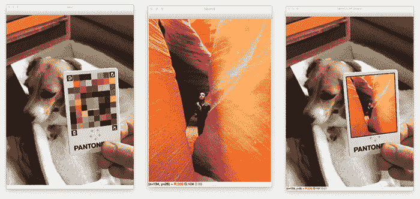

# OpenCV 增强现实技术

> 原文：<https://pyimagesearch.com/2021/01/04/opencv-augmented-reality-ar/>

在本教程中，你将学习 OpenCV 增强现实的基础知识。



增强现实采用真实世界的环境，然后通过计算机生成的程序增强这些环境，从而不断丰富环境。通常，这是使用视觉、听觉和触觉/触觉交互的某种组合来完成的。

由于 PyImageSearch 是一个计算机视觉博客，我们将主要关注增强现实的*视觉*方面，更具体地说:

1.  拍摄输入图像
2.  检测标记/基准点
3.  无缝地将*新的*图像转换到场景中

本教程重点介绍 OpenCV 增强现实的基础知识。下周我将向你展示如何用 OpenCV 来执行*实时*增强现实。

**要了解如何使用 OpenCV 执行增强现实，*请继续阅读。***

## **OpenCV 增强现实(AR)**

在本教程的第一部分，我们将简要讨论什么是增强现实，包括 OpenCV 如何帮助促进增强现实。

从那里，我们将配置我们的增强现实开发环境，然后审查我们的项目目录结构。

然后，我们将使用 OpenCV 实现一个 Python 脚本来执行基本的增强现实。

本教程将以对我们结果的讨论结束。

### **什么是增强现实？**

我们过去只能通过五种感官来看世界:视觉、听觉、嗅觉、味觉和触觉。

现在这种情况正在改变。

智能手机正在从字面上和象征意义上改变世界，改变三种感官:视觉、听觉和触觉。或许有一天，增强现实也能增强嗅觉和味觉。

增强现实，顾名思义，*用计算机生成的感知信息来增强*我们周围的真实世界。

也许近年来最大的增强现实成功故事是[口袋妖怪 Go 应用](https://pokemongolive.com/en/) **(图 2)** 。

为了玩 Pokemon Go，用户在智能手机上打开应用程序，然后访问他们的相机。然后，玩家通过他们的相机观察世界，走过真实世界的环境，包括城市街道，宁静的公园，拥挤的酒吧和餐馆。

口袋妖怪 Go 应用程序将生物(称为口袋妖怪)放置在这个虚拟世界中。然后，玩家必须捕捉这些口袋妖怪，并收集所有的口袋妖怪。

围绕增强现实和虚拟现实应用建立了整个公司，包括 [Oculus](https://www.oculus.com/) 和 [MagicLeap](https://www.magicleap.com/en-us) 。

虽然增强现实(正如我们今天所理解的)自 20 世纪 80 年代末 90 年代初就已经存在，但它仍然处于初级阶段。

我们在很短的时间内取得了令人难以置信的进步，我相信最好的还在后面(很可能在未来 10-20 年内)。

但在我们开始构建最先进的增强现实应用程序之前，我们首先需要学习基础知识。

在本教程中，你将学习 OpenCV 增强现实的基础知识。

### **配置您的开发环境**

为了学习增强现实的基础知识，您需要安装 OpenCV 库。

幸运的是，OpenCV 可以通过 pip 安装:

```py
$ pip install opencv-contrib-python
```

**如果你需要帮助为 OpenCV 配置开发环境，我*强烈推荐*阅读我的** [***pip 安装 OpenCV* 指南**](https://pyimagesearch.com/2018/09/19/pip-install-opencv/)——它将在几分钟内让你启动并运行。

### **在配置开发环境时遇到了问题？**

说了这么多，你是:

*   时间紧迫？
*   了解你雇主的行政锁定系统？
*   想要跳过与命令行、包管理器和虚拟环境斗争的麻烦吗？
*   **准备好在你的 Windows、macOS 或 Linux 系统上运行代码*了吗？***

那今天就加入 [PyImageSearch 加](https://pyimagesearch.com/pyimagesearch-plus/)吧！

**获得本教程的 Jupyter 笔记本和其他 PyImageSearch 指南，这些指南已经过*预配置*，可以在您的网络浏览器中运行在 Google Colab 的生态系统上！**无需安装。

最棒的是，这些 Jupyter 笔记本可以在 Windows、macOS 和 Linux 上运行！

### **项目结构**

在我们可以用 OpenCV 实现增强现实之前，我们首先需要回顾一下我们的项目目录结构。

首先确保使用本教程的 ***“下载”*** 部分下载源代码和示例图像。

```py
$ tree . --dirsfirst
.
├── examples
│   ├── input_01.jpg
│   ├── input_02.jpg
│   └── input_03.jpg
├── sources
│   ├── antelope_canyon.jpg
│   ├── jp.jpg
│   └── squirrel.jpg
├── markers.pdf
└── opencv_ar_image.py

2 directories, 7 files
```

就像我们在关于 ArUco markers 的系列中所做的一样，我们的目标是检测四个 ArUco 标签中的每一个，按照左上、右上、左下和右下的顺序对它们进行排序，然后通过将源图像转换到卡片上来应用增强现实。

说到源图像，我们的`sources`目录中总共有三个源图像:

一旦我们检测到我们的表面，我们将使用 OpenCV 将这些源图像中的每一个转换到卡片上，产生如下所示的输出:

**虽然它不会帮助您执行颜色匹配，但您仍然可以将它用于本示例的目的(即，检测其上的 ArUco 标记，然后将源图像转换到输入)。**

只需将``markers.pdf`` 印在一张纸上，剪下来，然后放在你相机的视野中。从那里你将能够跟随。

回顾了我们的目录结构后，让我们继续用 OpenCV 实现增强现实。

### **用 OpenCV 实现增强现实**

我们现在准备用 OpenCV 实现增强现实！

打开项目目录结构中的``opencv_ar_image.py`` 文件，让我们开始工作:

```py
# import the necessary packages
import numpy as np
import argparse
import imutils
import sys
import cv2
```

```py
# construct the argument parser and parse the arguments
ap = argparse.ArgumentParser()
ap.add_argument("-i", "--image", required=True,
	help="path to input image containing ArUCo tag")
ap.add_argument("-s", "--source", required=True,
	help="path to input source image that will be put on input")
args = vars(ap.parse_args())
```

```py
# load the input image from disk, resize it, and grab its spatial
# dimensions
print("[INFO] loading input image and source image...")
image = cv2.imread(args["image"])
image = imutils.resize(image, width=600)
(imgH, imgW) = image.shape[:2]

# load the source image from disk
source = cv2.imread(args["source"])
```

```py
# load the ArUCo dictionary, grab the ArUCo parameters, and detect
# the markers
print("[INFO] detecting markers...")
arucoDict = cv2.aruco.Dictionary_get(cv2.aruco.DICT_ARUCO_ORIGINAL)
arucoParams = cv2.aruco.DetectorParameters_create()
(corners, ids, rejected) = cv2.aruco.detectMarkers(image, arucoDict,
	parameters=arucoParams)

# if we have not found four markers in the input image then we cannot
# apply our augmented reality technique
if len(corners) != 4:
	print("[INFO] could not find 4 corners...exiting")
	sys.exit(0)
```

作为参考，我们的输入图像如下所示:

我们的目标是检测 Pantone 卡上的四个 ArUco 标记。一旦我们有了卡片及其 ArUco 标记，我们就可以获取``source`` 图像并将其转换到卡片表面，从而形成增强现实输出。

整个增强现实过程取决于首先找到这些 ArUco 标记。如果你还没有，回去看看我以前的关于 ArUco markers 的[教程——那些指南会帮助你快速上手。**从现在开始，我假设你对 ArUco markers 很满意。**](https://pyimagesearch.com/2020/12/14/generating-aruco-markers-with-opencv-and-python/)

**第 29-32 行**继续:

1.  加载我们的 ArUco 字典(从我们之前的 ArUco 标记教程中，我们知道 Pantone 卡是使用``DICT_ARUCO_ORIGINAL`` 字典生成的)
2.  初始化我们的 ArUco 探测器参数
3.  检测输入中的 ArUco 标记`image`

如果没有找到四个 ArUco 标记，我们就优雅地退出脚本(**第 36-38 行**)。同样，我们的增强现实过程在这里*依赖于*成功找到所有四个标记。

假设我们的脚本仍在执行，我们可以有把握地假设所有四个 ArUco 标记都被成功检测到。

从那里，我们可以获取 ArUco 标记的 id 并初始化``refPts`` ，这是一个包含了 ArUco 标记边界框的 *(x，y)* 坐标的列表:

```py
# otherwise, we've found the four ArUco markers, so we can continue
# by flattening the ArUco IDs list and initializing our list of
# reference points
print("[INFO] constructing augmented reality visualization...")
ids = ids.flatten()
refPts = []

# loop over the IDs of the ArUco markers in top-left, top-right,
# bottom-right, and bottom-left order
for i in (923, 1001, 241, 1007):
	# grab the index of the corner with the current ID and append the
	# corner (x, y)-coordinates to our list of reference points
	j = np.squeeze(np.where(ids == i))
	corner = np.squeeze(corners[j])
	refPts.append(corner)
```

在第**行第 49** 处，我们循环了 Pantone 彩色图像中的四个 ArUco 标记 id。这些 id 是使用我们的 [ArUco 标记检测博客帖子](https://pyimagesearch.com/2020/12/21/detecting-aruco-markers-with-opencv-and-python/)获得的。**如果您使用自己的 ArUco 标记 id，您需要更新此列表并插入 id。**

```py
# unpack our ArUco reference points and use the reference points to
# define the *destination* transform matrix, making sure the points
# are specified in top-left, top-right, bottom-right, and bottom-left
# order
(refPtTL, refPtTR, refPtBR, refPtBL) = refPts
dstMat = [refPtTL[0], refPtTR[1], refPtBR[2], refPtBL[3]]
dstMat = np.array(dstMat)

# grab the spatial dimensions of the source image and define the
# transform matrix for the *source* image in top-left, top-right,
# bottom-right, and bottom-left order
(srcH, srcW) = source.shape[:2]
srcMat = np.array([[0, 0], [srcW, 0], [srcW, srcH], [0, srcH]])

# compute the homography matrix and then warp the source image to the
# destination based on the homography
(H, _) = cv2.findHomography(srcMat, dstMat)
warped = cv2.warpPerspective(source, H, (imgW, imgH))
```

为了用 OpenCV 执行增强现实，我们需要计算一个[单应矩阵](https://www.learnopencv.com/homography-examples-using-opencv-python-c/)，然后用它来执行透视扭曲。

然而，为了计算单应性，我们需要一个*源矩阵*和*目的矩阵。*

```py
# construct a mask for the source image now that the perspective warp
# has taken place (we'll need this mask to copy the source image into
# the destination)
mask = np.zeros((imgH, imgW), dtype="uint8")
cv2.fillConvexPoly(mask, dstMat.astype("int32"), (255, 255, 255),
	cv2.LINE_AA)

# this step is optional, but to give the source image a black border
# surrounding it when applied to the source image, you can apply a
# dilation operation
rect = cv2.getStructuringElement(cv2.MORPH_RECT, (3, 3))
mask = cv2.dilate(mask, rect, iterations=2)

# create a three channel version of the mask by stacking it depth-wise,
# such that we can copy the warped source image into the input image
maskScaled = mask.copy() / 255.0
maskScaled = np.dstack([maskScaled] * 3)

# copy the warped source image into the input image by (1) multiplying
# the warped image and masked together, (2) multiplying the original
# input image with the mask (giving more weight to the input where
# there *ARE NOT* masked pixels), and (3) adding the resulting
# multiplications together
warpedMultiplied = cv2.multiply(warped.astype("float"), maskScaled)
imageMultiplied = cv2.multiply(image.astype(float), 1.0 - maskScaled)
output = cv2.add(warpedMultiplied, imageMultiplied)
output = output.astype("uint8")
```

**第 85 行和第 86 行**是可选的，但是我喜欢放大蒙版，从而稍微放大。这样做可以在将``warped`` 源图像应用到输入``image`` 的区域周围创建一个漂亮的黑色小边框。同样，这是可选的，但它提供了一个很好的效果。

接下来，我们使用蒙版，从范围*【0，255】*缩放到*【0，1】*。然后，我们沿深度方向堆叠遮罩，创建遮罩的 3 通道表示。我们执行这个操作，以便将扭曲的源图像复制到输入图像中。

现在剩下的就是:

```py
# show the input image, source image, output of our augmented reality
cv2.imshow("Input", image)
cv2.imshow("Source", source)
cv2.imshow("OpenCV AR Output", output)
cv2.waitKey(0)
```

这三幅图像将显示在我们的屏幕上，直到点击 OpenCV 打开的一个窗口并按下键盘上的一个键。

### **OpenCV 增强现实结果**

我们现在已经准备好用 OpenCV 执行增强现实了！首先使用本教程的 ***【下载】*** 部分下载源代码和示例图像。

从那里，打开一个终端，并执行以下命令:

```py
$ python opencv_ar_image.py --image examples/input_01.jpg \
	--source sources/squirrel.jpg
[INFO] loading input image and source image...
[INFO] detecting markers...
[INFO] constructing augmented reality visualization...
```

在右边的*你可以看到我们松鼠的源图像。这个源图像将被转换成左边*的场景(通过增强现实)。**

*左*图像包含一个*输入*颜色校正卡，带有我们的`opencv_ar_image.py`脚本检测到的 ArUco 标记(即标记/基准标签)。

找到标记后，我们应用一个变换，将源图像扭曲到输入中，从而生成输出( *bottom* )。

请注意松鼠图像是如何被转换到颜色校正卡本身上的，完美地保持了纵横比、比例、视角等。颜色校正卡。

让我们尝试另一个例子，这个例子使用不同的源和输入图像:

```py
$ python opencv_ar_image.py --image examples/input_02.jpg \
	--source sources/antelope_canyon.jpg 
[INFO] loading input image and source image...
[INFO] detecting markers...
[INFO] constructing augmented reality visualization...
```

在*右边* ( **图 12** )我们有一张几年前我在亚利桑那州佩奇探索羚羊峡谷的照片。

左边*的图像包含我们的输入图像，其中我们的输入源图像将被应用于构建增强现实场景。*

我们的 Python 脚本能够检测四个 ArUco 标签标记，然后应用转换，从而在*底部*生成图像。

同样，请注意源图像是如何完美地转换为输入图像的，同时保持了输入图像的比例、纵横比以及最重要的视角。

让我们看最后一个例子:

```py
$ python opencv_ar_image.py --image examples/input_03.jpg \
	--source sources/jp.jpg 
[INFO] loading input image and source image...
[INFO] detecting markers...
[INFO] constructing augmented reality visualization...
```

**图 13** 显示了我们的结果。

这次我们有了一张我最喜欢的电影*《侏罗纪公园》的源图(右)。*

然后，我们检测输入图像*(左)*中的 AprilTag 标记，然后应用变换来构建我们的增强现实图像*(下图)。*

下周，您将学习如何实时执行相同的技术，从而创建更无缝、更有趣、更身临其境的增强现实体验。

### **学分**

用于执行透视扭曲和遮罩的代码受到了 [Satya Mallick 在 LearnOpenCV 的实现](https://www.learnopencv.com/augmented-reality-using-aruco-markers-in-opencv-c-python/)的启发。我将它们的实现作为参考，然后对其进行了修改，以适用于我的示例图像，并在代码和文章中提供了额外的细节和注释。如果你有兴趣，可以看看萨提亚的文章。

## **总结**

在本教程中，您学习了使用 OpenCV 增强现实的基础知识。

然而，为了构建一个真正的增强现实体验，我们需要创建一个更加身临其境的环境，一个利用实时视频流的环境。

事实上，这正是我们下周要讨论的内容！

**要下载这篇文章的源代码(并在未来教程在 PyImageSearch 上发布时得到通知)，*只需在下面的表格中输入您的电子邮件地址！***