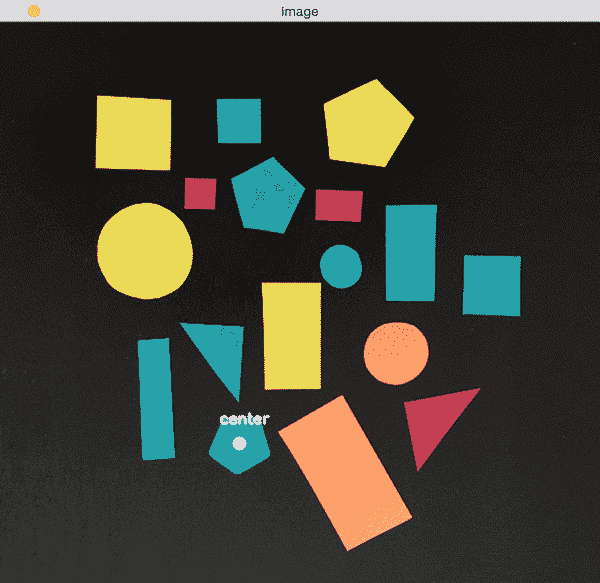
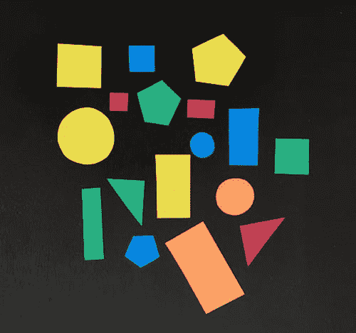
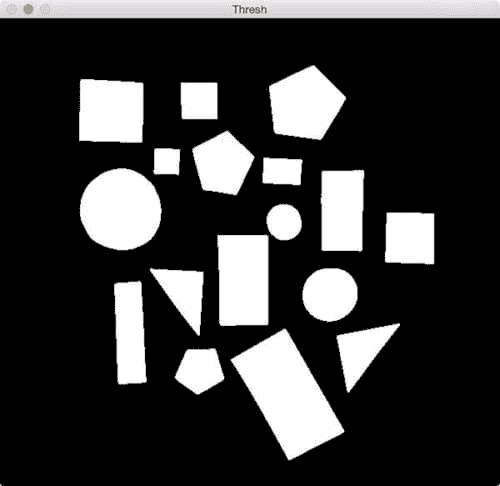

# 轮廓中心

> 原文：<https://pyimagesearch.com/2016/02/01/opencv-center-of-contour/>

[](https://pyimagesearch.com/wp-content/uploads/2016/01/center_of_contour_results.gif)

今天，我们将开始一个新的 3 部分系列教程*。*

 *在本系列中，我们将学习如何:

1.  计算轮廓/形状区域的中心。
2.  仅使用轮廓属性识别各种形状，如圆形、正方形、矩形、三角形和五边形。
3.  标记形状的颜色。

虽然今天的帖子有点基础(至少在最近 PyImageSearch 博客上的一些更高级的概念的背景下)，但它仍然解决了我经常被问到的一个问题:

> **“我如何使用 Python 和 OpenCV 计算轮廓的中心？**

在今天的帖子中，我将回答这个问题。

在本系列的后续文章中，我们将利用轮廓知识来识别图像中的形状。

## 轮廓中心

[](https://pyimagesearch.com/wp-content/uploads/2016/01/shapes_and_colors.jpg)

**Figure 1:** An example image containing a set of shapes that we are going to compute the center of the contour for.

在上面的图片中，你可以看到从建筑用纸上剪下的各种形状。注意这些形状并不完美。长方形不完全是长方形，圆形也不完全是圆形。这些是*人类绘制和人类裁剪的形状*，暗示每种形状类型都有*变化*。

考虑到这一点，今天教程的目标是(1) *检测图像中每个形状*的轮廓，然后是(2) *计算轮廓的中心*——也称为区域的*质心*。

为了实现这些目标，我们需要执行一些图像预处理，包括:

*   转换为灰度。
*   模糊，以减少高频噪声，使我们的轮廓检测过程更加准确。
*   图像的二值化。典型地，边缘检测和阈值处理用于这个过程。在这篇文章中，我们将应用阈值。

在我们开始编码之前，确保您的系统上安装了 [imutils Python 包](https://github.com/jrosebr1/imutils):

```py
$ pip install --upgrade imutils

```

从那里，我们可以继续前进并开始。

打开一个新文件，命名为`center_of_shape.py`，我们将得到代码:

```py
# import the necessary packages
import argparse
import imutils
import cv2

# construct the argument parse and parse the arguments
ap = argparse.ArgumentParser()
ap.add_argument("-i", "--image", required=True,
	help="path to the input image")
args = vars(ap.parse_args())

# load the image, convert it to grayscale, blur it slightly,
# and threshold it
image = cv2.imread(args["image"])
gray = cv2.cvtColor(image, cv2.COLOR_BGR2GRAY)
blurred = cv2.GaussianBlur(gray, (5, 5), 0)
thresh = cv2.threshold(blurred, 60, 255, cv2.THRESH_BINARY)[1]

```

我们从**的第 2-4 行**开始，导入我们需要的包，然后解析我们的命令行参数。这里我们只需要一个开关`--image`，它是我们想要处理的图像在磁盘上的路径。

然后，我们获取该图像，从磁盘中加载，并通过应用灰度转换、使用 *5 x 5* 内核的高斯平滑以及最后的阈值处理(**第 14-17 行**)对其进行预处理。

阈值操作的输出如下所示:

[](https://pyimagesearch.com/wp-content/uploads/2016/01/center_of_contour_thresh.jpg)

**Figure 2:** Thresholding our image returns a binary image, where the shapes appear as white on a black foreground.

注意在应用阈值处理后，形状是如何在*黑色背景*上表现为*白色前景*。

下一步是使用轮廓检测找到这些白色区域的位置:

```py
# find contours in the thresholded image
cnts = cv2.findContours(thresh.copy(), cv2.RETR_EXTERNAL,
	cv2.CHAIN_APPROX_SIMPLE)
cnts = imutils.grab_contours(cnts)

```

对第 20 行和第 21 行**上的`cv2.findContours`的调用**返回对应于图像上每个白点的一组轮廓(即轮廓)。**第 22 行**然后根据我们使用的是 OpenCV 2.4、3 还是 4 获取合适的元组值。你可以在这篇文章中读到更多关于`cv2.findContours`的返回签名如何在 OpenCV 版本[之间改变的信息。](https://pyimagesearch.com/2015/08/10/checking-your-opencv-version-using-python/)

我们现在准备处理每个轮廓:

```py
# loop over the contours
for c in cnts:
	# compute the center of the contour
	M = cv2.moments(c)
	cX = int(M["m10"] / M["m00"])
	cY = int(M["m01"] / M["m00"])

	# draw the contour and center of the shape on the image
	cv2.drawContours(image, [c], -1, (0, 255, 0), 2)
	cv2.circle(image, (cX, cY), 7, (255, 255, 255), -1)
	cv2.putText(image, "center", (cX - 20, cY - 20),
		cv2.FONT_HERSHEY_SIMPLEX, 0.5, (255, 255, 255), 2)

	# show the image
	cv2.imshow("Image", image)
	cv2.waitKey(0)

```

在第 25 行的**上，我们开始循环每个单独的轮廓，随后计算第 27** 行**上轮廓区域的[图像矩](https://en.wikipedia.org/wiki/Image_moment)。**

在计算机视觉和图像处理中，图像矩常用于表征图像中物体的形状。这些矩捕获形状的基本统计属性，包括对象的*面积*、T2 质心(即中心 *(x，y)*-对象的坐标)*方位*，以及其他期望的属性。

这里我们只对轮廓的*中心感兴趣，我们在**线 28 和 29** 上计算。*

从那里，**第 32-34 行**处理:

*   通过调用`cv2.drawContours`绘制当前形状周围的轮廓轮廓。
*   在形状的 ***中心***`(cX, cY)`-坐标处放置一个白色圆圈。
*   在白色圆圈附近写文字`center`。

要执行我们的脚本，只需打开一个终端并执行以下命令:

```py
$ python center_of_shape.py --image shapes_and_colors.png

```

您的结果应该如下所示:

[](https://pyimagesearch.com/wp-content/uploads/2016/01/center_of_contour_results.gif)

**Figure 3:** Looping over each of the shapes individually and then computing the center (x, y)-coordinates for each shape.

请注意每个形状是如何被成功检测到的，然后计算轮廓的中心并绘制在图像上。

## 摘要

在本课中，我们学习了如何使用 OpenCV 和 Python 计算轮廓的中心。

本帖是*三部曲系列*中关于**造型分析**的第*篇*。

在下周的帖子中，我们将学习如何 ***识别图像中的形状*** 。

然后，从现在开始两周，我们将学习如何 ***分析每个形状的颜色******用特定的颜色*** (即“红色”、“绿色”、“蓝色”等)给形状贴上标签。).

为了在这些帖子发布时得到通知，**请务必使用下面的表格输入您的电子邮件地址！***