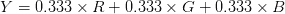
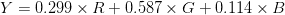

# OpenCV 色彩空间(cv2.cvtColor)

> 原文：<https://pyimagesearch.com/2021/04/28/opencv-color-spaces-cv2-cvtcolor/>

在本教程中，您将了解 OpenCV 中的色彩空间、`cv2.cvtColor`函数，以及在构建计算机视觉和图像处理管道时照明条件/环境的重要性。

为了说明照明条件的重要性，我想以我在开发名为 ID My Pill 的 iPhone 应用程序时的一个个人故事开始今天的教程。

ID My Pill 是一个 iPhone 应用程序和 web API，允许您在智能手机的快照中识别处方药。你只需给你的处方药拍一张照片，ID My Pill 就会使用计算机视觉和机器学习技术立即识别并验证它们是正确的药物。

药片是否被正确识别*与*无关*与我用来开发它的编程语言无关。这与我建造的计算机视觉库没有任何关系，我的药丸就在那里。成功的药丸识别与我在后台开发的药丸识别算法完全无关。*

 *事实上，在执行一行代码之前，就已经决定了一颗药丸是否能被成功识别。

当然，我说的是照明条件。

在非常差的光照条件下拍摄的药丸，在这种条件下有大量的阴影、冲刷或缺乏对比度*，根本无法识别*。美国市场上有超过 27，000 种处方药丸(其中一半以上是圆形和/或白色的)，数量惊人的药丸彼此几乎完全相同。并且考虑到这种大量视觉上相似的药丸，非理想的照明条件可能完全破坏药丸识别算法的结果。

信不信由你,(几乎)所有计算机视觉系统和应用的成功都是在开发人员编写一行代码之前决定的。

在本文的其余部分，我们将讨论照明条件的重要性以及它在计算机视觉系统的成功开发中所起的重要作用。

我们还将讨论色彩空间，以及如何利用它们来构建更强大的计算机视觉应用。

**要了解 OpenCV 中的色彩空间和`cv2.cvtColor`函数，** ***只需继续阅读。***

## **OpenCV 色彩空间(cv2.cvtColor )**

在本教程的第一部分，我们将讨论*任何*计算机视觉和图像处理管道中照明条件的重要性。

然后，我们将回顾在照明条件下工作时你应该努力达到的三个目标:

1.  高调
2.  可概括的
3.  稳定的

从那里，我们将配置我们的开发环境，并审查我们的项目目录结构。

然后，我们将实现 Python 代码来处理 OpenCV 中的四种颜色空间/模型:

1.  RGB
2.  hsv 色彩模型
3.  L*a*b*
4.  灰度等级

我们将讨论我们的结果来结束本教程。

### **光照条件在图像处理和计算机视觉中的重要性**

计算机视觉领域正在迅速扩展和发展。我们每天都在这个领域看到新的进展，而这些进展是我们曾经认为不可能的。

我们看到深度学习以惊人的高精度对图像进行分类、检测对象和分割图像。

像 Raspberry Pi、Google Coral 和 Jetson Nano 这样的微型计算机可以用来构建复杂的监控系统。

工业界每天都看到越来越多的商用计算机视觉应用推向市场。

虽然这个领域在成长、变化和发展，但我可以向你保证一个绝对不变的事实:每一个计算机视觉算法、应用和系统*曾经*开发过，以及*将*开发出来，都将取决于输入系统的图像质量。

我们当然能够使我们的系统在恶劣的照明条件下更加稳健，但是我们永远无法克服在恶劣条件下拍摄的图像,*。*

**所以让我再说一遍，因为我真的想确保它坚持:** ***照明可以意味着你的计算机视觉算法的成败。***

我看到计算机视觉开发人员犯的最常见的一个错误是忽略了光照及其对算法性能的影响。

给定环境中的光线质量对实现你的目标绝对至关重要——事实上，我甚至可以说，它可能是最重要的因素。

相机实际上并不是在“拍摄”物体本身。相反，它捕捉的是物体反射的光。这也意味着图像中的不同对象将需要不同的照明条件来获得“好”的结果(其中“好”是根据算法的最终目标来定义的)。

为了说明照明条件的重要性，今天早上我拍了一张自己在浴室镜子里的自拍照:

但是哎呀——我忘了关照相机的闪光灯了！镜子是*反射*表面，因此光线会直接从表面反弹并进入我的相机传感器。照片很差，几乎不可能编写代码来检测我的脸，因为闪光灯干扰了我脸的下部。

相反，当我关掉闪光灯，使用来自上方的柔光，而不是针对反射表面时，我得到了我想要的结果:

在这里，我的脸清晰可见，几乎察觉不到。

同样，你根本无法弥补糟糕的照明条件。当开发一个应用程序来检测图像中的人脸时，您更喜欢哪种类型的图像？图 2 中的那张，因为闪光灯的缘故，我的脸几乎看不见。或者是**图 3** 中我的脸清晰可见的图像？

显然，**图 3** 是首选，也是一个很好的例子，说明了为什么在开发计算机视觉应用时需要考虑照明条件。

一般来说，你的照明条件应该有三个主要目标。下面我们来回顾一下。

#### **目标#1:高对比度**

你应该寻求最大化图像中感兴趣区域之间的对比度(即，你想要检测、提取、描述、分类、操作的“对象”)。应该与图像的其余部分具有足够高的对比度，以便它们容易被检测到)。

例如，在构建我们的[简单文档扫描仪](https://pyimagesearch.com/2014/09/01/build-kick-ass-mobile-document-scanner-just-5-minutes/)时，我们确保我们想要检测的纸张是在*暗*背景上的*亮*，从而确保有足够的对比度，并且可以轻松检测到纸张:

只要有可能，尽量确保环境的背景和前景之间有高对比度——这将使编写代码准确理解背景和前景更加容易。

#### **目标 2:一般化**

你的照明条件应该足够一致，这样它们才能很好地从一个物体到另一个物体。

如果我们的目标是识别图像中的各种美国硬币，我们的照明条件应该足够普遍，以便于硬币识别，无论我们检查的是一便士、五分、一角还是二角五分。

#### **目标 3:稳定**

拥有稳定、一致且可重复的照明条件是计算机视觉应用开发的圣杯。然而，这通常很难(如果不是不可能的话)保证——如果我们正在开发旨在户外照明条件下工作的计算机视觉算法，这一点尤其如此。随着一天中时间的变化，云在太阳上滚动，雨开始下，我们的照明条件将明显改变。

即使在我服用我的药丸的情况下，拥有一个真正稳定的光照条件也是不可能的。来自世界各地的用户会在非常不同的照明条件下(室外、室内、荧光灯、石英卤素灯，你能想到的)拍摄药物照片，而我根本无法控制它。

但是让我们说，ID My 药丸不是为消费者开发的，以验证他们的处方药丸。相反，让我们假设在工厂传送带上使用了 ID My 药丸，以确保传送带上的每个药丸都是相同的药物，并且在相同的生产环境中不存在不同类型药物的“交叉污染”或“泄漏”。

在药丸工厂的场景中，我*更有可能*获得稳定的照明条件。这是因为我可以:

1.  将相机放在我想要的任何地方来拍摄药丸的照片
2.  完全控制照明环境——我可以增加或减少灯光，或者设置一个完全独立的“照片亭”,远离任何可能污染标识的其他光源

如你所见，真正稳定的照明条件通常很难(如果不是不可能的话)保证。但是非常重要的是，在你写一行代码之前，你至少要考虑你的照明条件的稳定性。

**这是我的关键要点:**

在你写一行代码之前，尽可能多地争取获得你理想的照明条件。控制(或至少承认)你的照明条件比编写代码补偿劣质照明要有利得多(也容易得多)。

### **色彩空间与色彩模型**

本教程中我们要讨论的第二个主题是**色彩空间**和**色彩模型。**

简单地说，*色彩空间*只是一种特定的颜色组织，它允许我们一致地表示和再现颜色。

例如，想象一下浏览你当地的家装仓库，为你的客厅寻找你想要的颜色。你家装店里的这些色样很可能是根据色样的颜色和色调以某种连贯的方式组织起来的。显然，这是一个非常简单的例子，色彩空间可以更加严格和结构化数学。

另一方面，*颜色模型*是在颜色空间中用数字表示颜色的抽象方法。众所周知，RGB 像素被表示为一个由红、绿、蓝值组成的 3 整数元组。

作为一个整体，颜色空间定义了颜色模型和用于定义实际颜色的抽象映射函数。选择一个颜色空间也非正式地意味着我们在选择颜色模型。

这两者之间的区别是微妙的，但作为完整性的问题，这一点很重要。

在本教程的其余部分，我们将讨论开发计算机视觉应用程序时会遇到的四种主要色彩空间:

1.  RGB
2.  单纯疱疹病毒，
3.  L*a*b*
4.  灰度(从技术上讲，它不是一个颜色空间，但是您将在开发的几乎所有计算机视觉应用程序中使用它)。

### **配置您的开发环境**

要遵循这个指南，您需要在您的系统上安装 OpenCV 库。

幸运的是，OpenCV 可以通过 pip 安装:

```py
$ pip install opencv-contrib-python
```

**如果你需要帮助为 OpenCV 配置开发环境，我*强烈推荐*阅读我的** [***pip 安装 OpenCV* 指南**](https://pyimagesearch.com/2018/09/19/pip-install-opencv/)——它将在几分钟内让你启动并运行。

### **在配置开发环境时遇到了问题？**

说了这么多，你是:

*   时间紧迫？
*   了解你雇主的行政锁定系统？
*   想要跳过与命令行、包管理器和虚拟环境斗争的麻烦吗？
*   准备好在您的 Windows、macOS 或 Linux 系统上运行代码*了吗*？

那今天就加入 [PyImageSearch 大学](https://pyimagesearch.com/pyimagesearch-university/)吧！

**获得本教程的 Jupyter 笔记本和其他 PyImageSearch 指南，这些指南是** ***预先配置的*** **，可以在您的网络浏览器中运行在 Google Colab 的生态系统上！**无需安装。

最棒的是，这些 Jupyter 笔记本可以在 Windows、macOS 和 Linux 上运行！

### **项目结构**

在我们实现色彩空间和利用 OpenCV 的`cv2.cvtColor`函数之前，让我们首先检查一下我们的项目目录结构。

首先通过访问本教程的 ***【下载】*** 部分来检索源代码和示例图像:

```py
$ tree . --dirsfirst
.
├── adrian.png
└── color_spaces.py

0 directories, 2 files
```

我们要回顾一个 Python 脚本，`color_spaces.py`。该脚本将从磁盘加载`adrian.png`,并演示如何使用 RGB、HSV 和 L*a*b*色彩空间。

您还将学习如何将图像转换为灰度。

### **RGB 颜色空间**

我们要讨论的第一个色彩空间是 **RGB** ，它代表图像的红色、绿色和蓝色成分。你很可能已经非常熟悉 RGB 色彩空间，因为大多数色彩应用程序和计算机视觉/图像处理库默认使用 RGB。

要定义 RGB 颜色模型中的颜色，我们需要做的就是定义单个像素中包含的红色、绿色和蓝色的数量。每个红色、绿色和蓝色通道可以具有在范围 *[0，255]* (总共 256 个“阴影”)中定义的值，其中 *0* 表示没有表示， *255* 表示完全表示。

RGB 色彩空间是*加色*色彩空间的一个例子:每种颜色添加得越多，像素就变得越亮，越接近白色:

如你所见，红色和绿色相加导致黄色。红色和蓝色相加得到粉红色。把红、绿、蓝三种颜色加在一起，我们就产生了白色。

RGB 色彩空间通常被视为一个立方体:

由于 RGB 颜色被定义为一个三值元组，每个值在范围*【0，255】*内，因此我们可以认为立方体包含 *256×256×256 = 16，777，216* 种可能的颜色，这取决于我们在每个桶中放入多少红色、绿色和蓝色。

然而，对于开发基于计算机视觉的应用程序来说，这并不是最友好的颜色空间。事实上，它的主要用途是在显示器上显示颜色。

例如，如果我们想确定我们需要多少红色、绿色和蓝色来创造一种颜色。

你能想象需要 *R=252，G=198，B=188* 来创建我的白种人肤色吗，如图**图 8** :

或者这么多 *R=22，G=159，B=230* 来获得 PyImageSearch 徽标的蓝色阴影:

很不直观，对吧？

但是，尽管 RGB 颜色空间可能很不直观，几乎所有您要处理的图像都将在 RGB 颜色空间中表示(至少最初是这样)。

说了这么多，让我们看看显示 RGB 图像的每个通道的代码。

打开项目目录结构中的`color_spaces.py`文件，让我们开始工作:

```py
# import the necessary packages
import argparse
import cv2

# construct the argument parser and parse the arguments
ap = argparse.ArgumentParser()
ap.add_argument("-i", "--image", type=str, default="adrian.png",
	help="path to input image")
args = vars(ap.parse_args())
```

**第 2 行和第 3 行**导入我们需要的 Python 包，而**第 6-9 行**解析我们的命令行参数。

这里我们只需要一个参数`--image`，默认为`adrian.png`(如果您将代码和示例图像下载到本教程中，它位于我们的项目目录中)。

现在让我们加载我们的图像:

```py
# load the original image and show it
image = cv2.imread(args["image"])
cv2.imshow("RGB", image)

# loop over each of the individual channels and display them
for (name, chan) in zip(("B", "G", "R"), cv2.split(image)):
	cv2.imshow(name, chan)

# wait for a keypress, then close all open windows
cv2.waitKey(0)
cv2.destroyAllWindows()
```

**第 12 行和第 13 行**将我们的输入`image`加载到磁盘，并显示在我们的屏幕上。

然后，我们按照蓝色、绿色、红色的顺序循环每个图像通道，因为 OpenCV 在第 16 行上以相反的顺序将图像表示为 NumPy 数组。

对于这些频道中的每一个，我们将它们显示在屏幕的第 17 行上。

当您执行此脚本时，您将看到以下输出:

在*左上角的*上，我们有原始的 RGB 图像，它由红色、绿色和蓝色通道加在一起组成(分别是*右上角的*、*右下角的*和*左下角的*)。

因此，虽然 RGB 是最常用的颜色空间，但它不是最直观的颜色空间。让我们看看 HSV 颜色空间，它在定义颜色范围时更直观，也更容易理解。

### **HSV 颜色空间**

**HSV** 色彩空间转换 RGB 色彩空间，将其重塑为圆柱体而不是立方体:

正如我们在 RGB 部分看到的，颜色的“白色”或“亮度”是每个红色、绿色和蓝色分量的叠加组合。但是现在在 HSV 颜色空间中，亮度被赋予了它自己的独立维度。

让我们来定义每个 HSV 组件是什么:

*   色调:我们要检查的是哪种“纯”色。例如，“红色”的所有阴影和色调将具有相同的色调。
*   **饱和度:**颜色有多“白”。一个完全饱和的*颜色应该是“纯的”，比如“纯红色”饱和度为零的颜色是纯白色。*
*   **值:**值可以让我们控制颜色的明度。零值表示纯黑色，而增加该值会产生更亮的颜色。

值得注意的是，不同的计算机视觉库将使用不同的范围来表示每个色调、饱和度和值组件。

在 OpenCV 的情况下，图像被表示为 8 位无符号整数数组。因此，色调值被定义为范围*【0，179】*(对于总共 180 个可能的值，因为*【0，359】*对于 8 位无符号数组是不可能的)——色调实际上是一个度数(

) on the HSV color cylinder. And both saturation and value are defined on the range *[0, 255]*.

让我们看一些将图像从 RGB(或者更确切地说，BGR)色彩空间转换到 HSV 的示例代码:

```py
# convert the image to the HSV color space and show it
hsv = cv2.cvtColor(image, cv2.COLOR_BGR2HSV)
cv2.imshow("HSV", hsv)

# loop over each of the individual channels and display them
for (name, chan) in zip(("H", "S", "V"), cv2.split(hsv)):
	cv2.imshow(name, chan)

# wait for a keypress, then close all open windows
cv2.waitKey(0)
cv2.destroyAllWindows()
```

为了将我们的图像转换到 HSV 颜色空间，我们调用了`cv2.cvtColor`函数。

这个函数接受两个参数:我们想要转换的实际图像，后面是输出颜色空间。

由于 OpenCV 以 BGR 顺序而不是 RGB 表示我们的图像，我们指定了`cv2.COLOR_BGR2HSV`标志来表示我们想要从 BGR 转换到 HSV。

接下来，我们将循环每个单独的色调、饱和度和值通道，并将它们显示在屏幕上:

请注意左下方的*值部分本质上是一个灰度图像——这是因为该值控制我们颜色的实际*亮度*，而色调和饱和度定义了实际的颜色和阴影。*

HSV 颜色空间在计算机视觉应用中大量使用——尤其是当我们对跟踪图像中某个对象的颜色感兴趣时。使用 HSV 比 RGB 更容易定义一个有效的颜色范围。

### **L*a*b*颜色空间**

我们要讨论的最后一个色彩空间是 **L*a*b*** 。

虽然 RGB 颜色空间很容易理解(特别是当你第一次开始使用计算机视觉时)，但在定义颜色的精确阴影或指定颜色的特定*范围*时，它就不直观了。

另一方面，HSV 颜色空间更直观，但在表示人类如何看到和解释图像中的颜色方面做得不是最好。

例如，让我们计算红色和绿色之间的欧几里德距离；红色和紫色；以及 RGB 颜色空间中的红色和海军蓝:

```py
>>> import math
>>> red_green = math.sqrt(((255 - 0) ** 2) + ((0 - 255) ** 2) + ((0 - 0) ** 2))
>>> red_purple = math.sqrt(((255 - 128) ** 2) + ((0 - 0) ** 2) + ((0 - 128) ** 2))
>>> red_navy = math.sqrt(((255 - 0) ** 2) + ((0 - 0) ** 2) + ((0 - 128) ** 2))
>>> red_green, red_purple, red_navy
(360.62445840513925, 180.31361568112376, 285.3226244096321)
```

这就引出了一个问题:这些距离值*实际上代表什么？*

红色在某种程度上更像紫色而不是绿色吗？

答案是简单的“不”，即使我们已经在立方体和圆柱体等物体上定义了颜色空间，这些距离实际上是任意的，并且实际上没有办法“测量”RGB 和 HSV 颜色空间中各种颜色之间的感知差异。

这就是 L*a*b*颜色空间的由来——它的目标是模仿人类观察和解释颜色的方法。

这意味着 L*a*b*颜色空间中两个任意颜色之间的欧几里德距离具有实际的*感知意义。*

感性意义的加入使得 L*a*b*色彩空间不如 RGB 和 HSV 那样直观易懂，但在计算机视觉中大量使用。

本质上，L*a*b*颜色空间是一个 3 轴系统:

我们在下面定义了每个通道:

*   **L 通道:**像素的“明度”。该值沿垂直轴上下移动，从白色到黑色，中性灰色位于轴的中心。
*   **a 通道:**源自 L 通道的中心，在光谱的一端定义纯绿色，在另一端定义纯红色。
*   **b 通道:**也起源于 L 通道的中心，但与 a 通道垂直。b 通道在一个光谱上定义纯蓝色，在另一个光谱上定义纯黄色。

同样，虽然 L*a*b*颜色空间不如 HSV 和 RGB 颜色空间直观，也不容易理解，但它在计算机视觉中被大量使用。这是由于颜色之间的距离具有实际的感知意义，允许我们克服各种照明条件的问题。它也是一个强大的彩色图像描述符。

现在，让我们看看如何将我们的图像转换到 L*a*b*色彩空间:

```py
# convert the image to the L*a*b* color space and show it
lab = cv2.cvtColor(image, cv2.COLOR_BGR2LAB)
cv2.imshow("L*a*b*", lab)

# loop over each of the individual channels and display them
for (name, chan) in zip(("L*", "a*", "b*"), cv2.split(lab)):
	cv2.imshow(name, chan)

# wait for a keypress, then close all open windows
cv2.waitKey(0)
cv2.destroyAllWindows()
```

到 L*a*b*色彩空间的转换再次由`cv2.cvtColor`函数处理，但是这一次我们提供了`cv2.COLOR_BGR2LAB`标志来指示我们想要从 BGR 转换到 L*a*b*色彩空间。

从那里，我们分别循环 L*、a*和 b*通道，并将它们显示在屏幕上:

类似于我们的 HSV 示例，我们有 L *-通道，它专用于显示给定像素的*亮度*。a*和 b*决定了像素的阴影和颜色。

### **灰度**

我们要讨论的最后一个颜色空间实际上并不是一个颜色空间——它只是 RGB 图像的**灰度**表示。

图像的灰度表示丢弃了图像的颜色信息，也可以使用`cv2.cvtColor`功能来实现:

```py
# show the original and grayscale versions of the image
gray = cv2.cvtColor(image, cv2.COLOR_BGR2GRAY)
cv2.imshow("Original", image)
cv2.imshow("Grayscale", gray)
cv2.waitKey(0)
```

当我们的输出是灰度图像时:

图像的灰度表示通常被称为“黑白”，但这在技术上是不正确的。灰度图像是单通道图像，像素值在*【0，255】*范围内(即 256 个唯一值)。

真正的黑白图像被称为**二进制图像**，因此只有两个可能的值: *0* 或 *255* (即只有两个唯一值)。

将灰度图像称为黑白图像时要小心，以避免这种歧义。

然而，将 RGB 图像转换为灰度图像并不像您想象的那样简单。从生物学上讲，我们的眼睛更敏感，因此感知的绿色和红色比蓝色多。

因此，当转换为灰度时，每个 RGB 通道是*而不是*均匀加权的，如下所示:



相反，我们对每个通道进行不同的加权，以说明我们对每个通道的颜色感知程度:



同样，由于我们眼睛中的视锥细胞和感受器，我们能够感知的绿色是红色的近两倍。同样，我们注意到红色的数量是蓝色的两倍多。因此，我们确保在从 RGB 转换到灰度时考虑到这一点。

当我们不需要颜色时(例如在检测人脸或构建对象分类器时，对象的颜色无关紧要)，通常使用图像的灰度表示。因此，丢弃颜色可以让我们节省内存，提高计算效率。

### **OpenCV 色彩空间结果**

准备好可视化 RGB、HSV 和 L*a*b*色彩空间的输出了吗？

请务必访问本教程的 ***“下载”*** 部分，以检索源代码和示例图像。

然后，您可以使用以下命令执行我们的演示脚本:

```py
$ python color_spaces.py
```

这个脚本的输出应该匹配我上面提供的图像和数字。

## **总结**

在本教程中，我们了解了照明条件及其在计算机视觉应用中的重要作用。关键的一点是，在你写一行代码之前，一定要考虑到你的光线条件！

在你可以真正控制光照条件的情况下，你会过得更好。总的来说，你会发现控制你的照明条件比编写代码来补偿低质量图像更容易。

其次，我们回顾了计算机视觉中三种非常常见的颜色空间:RGB、HSV 和 L*a*b*。

RGB 颜色空间是计算机视觉中最常见的颜色空间。这是一个加色空间，颜色是根据红、绿、蓝的组合值定义的。

虽然很简单，但不幸的是，RGB 颜色空间对于定义颜色来说并不直观，因为很难准确地指出*多少红色、绿色和蓝色组成了某种颜色——想象一下，查看照片的特定区域，并试图仅用肉眼识别有多少红色、绿色和蓝色！*

幸运的是，我们有 HSV 颜色空间来弥补这个问题。HSV 颜色空间也很直观，因为它允许我们沿着*圆柱体*而不是 RGB 立方体定义颜色。HSV 颜色空间还为亮度/白度提供了自己单独的维度，使其更容易定义颜色的深浅。

然而，RGB 和 HSV 颜色空间都无法模拟人类感知颜色的方式— *使用 RGB 和 HSV 模型*，无法从数学上定义两种任意颜色的感知差异。

这正是 L*a*b*颜色空间被开发出来的原因。虽然更复杂，但 L*a*b*提供了感知一致性，这意味着两种任意颜色之间的距离具有实际意义。

综上所述，你会发现大多数计算机视觉应用都会使用 RGB 颜色空间。虽然它有很多缺点，但它的简单性无可匹敌——对于大多数系统来说，它已经足够了。

还会有使用 HSV 颜色空间的时候——特别是如果你对根据图像中的*颜色*来跟踪图像中的对象感兴趣的时候。使用 HSV 很容易定义颜色范围。

对于基本的图像处理和计算机视觉，你可能不会经常使用 L*a*b*颜色空间。但是，当您关心跨多个设备的色彩管理、色彩传输或色彩一致性时，L*a*b*色彩空间将是您最好的朋友。它也是一个优秀的彩色图像描述符。

最后，我们讨论了将图像从 RGB 转换为灰度。虽然图像的灰度表示在技术上不是颜色空间，但它与 RGB、HSV 和 L*a*b*一样值得一提。当颜色不重要时，我们经常使用图像的灰度表示——这使我们能够节省内存并提高计算效率。

**要下载这篇文章的源代码(并在未来教程在 PyImageSearch 上发布时得到通知)，*只需在下面的表格中输入您的电子邮件地址！****