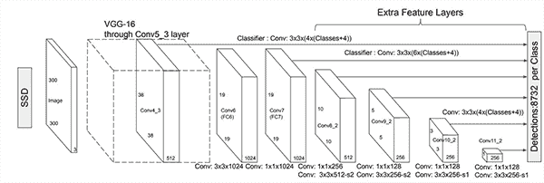
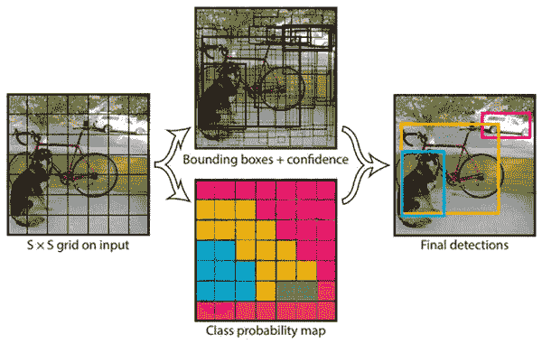
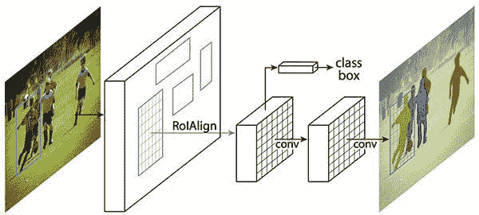
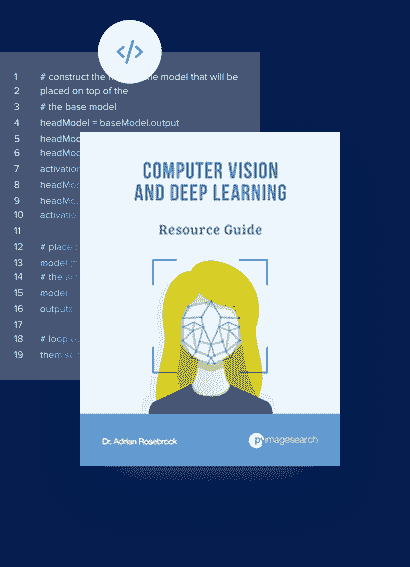

# 采用 NVIDIA GPUs 的 OpenCV“dnn ”: YOLO、SSD 和 Mask R-CNN 快 1549%

> 原文：<https://pyimagesearch.com/2020/02/10/opencv-dnn-with-nvidia-gpus-1549-faster-yolo-ssd-and-mask-r-cnn/>

在本教程中，您将了解如何使用 OpenCV 的“dnn”模块和 NVIDIA GPU，将*对象检测* (YOLO 和 SSD)和*实例分割* (Mask R-CNN)的速度提高 1549%。

[上周](https://pyimagesearch.com/2020/02/03/how-to-use-opencvs-dnn-module-with-nvidia-gpus-cuda-and-cudnn/)，我们发现了如何使用 NVIDIA GPU 配置和安装 OpenCV 及其“深度神经网络”(`dnn`)模块进行推理。

使用 OpenCV 的 GPU 优化的`dnn`模块，我们能够将一个给定网络的计算从 CPU 推送到 GPU **，只需要*三行*代码:**

```py
# load the model from disk and set the backend target to a
# CUDA-enabled GPU
net = cv2.dnn.readNetFromCaffe(args["prototxt"], args["model"])
net.setPreferableBackend(cv2.dnn.DNN_BACKEND_CUDA)
net.setPreferableTarget(cv2.dnn.DNN_TARGET_CUDA)
```

今天，我们将更详细地讨论完整的代码示例，在本教程结束时，您将能够应用:

1.  **单触发探测器**在 **65.90 FPS**
2.  **YOLO** 物体检测在 **11.87 FPS**
3.  **在 **11.05 FPS 处屏蔽 R-CNN** 实例分割**

**要了解如何使用 OpenCV 的`dnn`模块和 NVIDIA GPU 进行更快的对象检测和实例分割，*请继续阅读！***

## 采用 NVIDIA GPUs 的 OpenCV“dnn ”: YOLO、SSD 和 Mask R-CNN 的速度提高了 1，549%

在本教程中，您将学习如何使用 OpenCV 的“深度神经网络”(`dnn`)模块和支持 NVIDIA/CUDA 的 GPU 来实现单次检测器、YOLO 和掩模 R-CNN。

### 在 NVIDIA GPU 支持下编译 OpenCV 的“dnn”模块

[](https://pyimagesearch.com/wp-content/uploads/2020/02/opencv_dnn_gpu_header.png)

**Figure 1:** Compiling OpenCV’s DNN module with the CUDA backend allows us to perform object detection with YOLO, SSD, and Mask R-CNN deep learning models much faster.

如果你还没有，确保你仔细阅读了上周的教程[关于配置和安装 OpenCV 与 NVIDIA GPU 对“dnn”模块的支持](https://pyimagesearch.com/2020/02/03/how-to-use-opencvs-dnn-module-with-nvidia-gpus-cuda-and-cudnn/)——**该教程之后是本教程的绝对先决条件*。***

如果不安装 OpenCV 并启用 NVIDIA GPU 支持，OpenCV 会*仍然*使用你的 CPU 进行推理；但是，如果您试图将计算传递给 GPU，OpenCV 将会出错。

### 项目结构

在我们回顾今天项目的结构之前，先从这篇博文的 ***【下载】*** 部分获取代码和模型文件。

从那里，解压缩文件并在终端中使用`tree`命令检查项目层次结构:

```py
$ tree --dirsfirst
.
├── example_videos
│   ├── dog_park.mp4
│   ├── guitar.mp4
│   └── janie.mp4
├── opencv-ssd-cuda
│   ├── MobileNetSSD_deploy.caffemodel
│   ├── MobileNetSSD_deploy.prototxt
│   └── ssd_object_detection.py
├── opencv-yolo-cuda
│   ├── yolo-coco
│   │   ├── coco.names
│   │   ├── yolov3.cfg
│   │   └── yolov3.weights
│   └── yolo_object_detection.py
├── opencv-mask-rcnn-cuda
│   ├── mask-rcnn-coco
│   │   ├── colors.txt
│   │   ├── frozen_inference_graph.pb
│   │   ├── mask_rcnn_inception_v2_coco_2018_01_28.pbtxt
│   │   └── object_detection_classes_coco.txt
│   └── mask_rcnn_segmentation.py
└── output_videos

7 directories, 15 files
```

在今天的教程中，我们将回顾三个 Python 脚本:

*   `ssd_object_detection.py`:用 CUDA 对 20 个 COCO 类进行基于 Caffe 的 MobileNet SSD 对象检测。
*   `yolo_object_detection.py`:用 CUDA 对 80 个 COCO 类进行 YOLO V3 物体检测。
*   使用 CUDA 对 90 个 COCO 类进行基于 TensorFlow 的初始 V2 分割。

除了我们的 MobileNet SSD 之外，每个模型文件和类名文件都包含在各自的文件夹中(类名直接在脚本中硬编码在 Python 列表中)。让我们按照今天的顺序来查看文件夹名称:

*   `opencv-ssd-cuda/`
*   `opencv-yolo-cuda/`
*   `opencv-mask-rcnn-cuda/`

从这三个目录名可以明显看出，我们将使用 OpenCV 的 DNN 模块，该模块在 CUDA 支持下编译。如果你的 OpenCV 没有为你的 NVIDIA GPU 编译 CUDA 支持，那么你需要使用上周教程中的说明[配置你的系统。](https://pyimagesearch.com/2020/02/03/how-to-use-opencvs-dnn-module-with-nvidia-gpus-cuda-and-cudnn/)

### 使用 OpenCV 的 NVIDIA GPU 支持的“dnn”模块实现单次检测器(SSD)

[](https://pyimagesearch.com/wp-content/uploads/2020/02/opencv_dnn_gpu_examples_ssd_arch.png)

**Figure 2:** Single Shot Detectors (SSDs) are known for being fast and efficient. In this tutorial, we’ll use Python + OpenCV + CUDA to perform even faster deep learning inference using an NVIDIA GPU.

我们将关注的第一个物体探测器是**单次发射探测器(SSD)，我们最初在 2017 年讨论过的**:

*   *[深度学习和 OpenCV](https://pyimagesearch.com/2017/09/11/object-detection-with-deep-learning-and-opencv/) 的物体检测*
*   *[利用深度学习和 OpenCV 进行实时物体检测](https://pyimagesearch.com/2017/09/18/real-time-object-detection-with-deep-learning-and-opencv/)*

当时我们只能在 CPU 上运行这些固态硬盘；然而，今天我将向您展示如何使用 NVIDIA GPU 将推理速度提高高达 211%。

打开项目目录结构中的`ssd_object_detection.py`文件，并插入以下代码:

```py
# import the necessary packages
from imutils.video import FPS
import numpy as np
import argparse
import imutils
import cv2

# construct the argument parse and parse the arguments
ap = argparse.ArgumentParser()
ap.add_argument("-p", "--prototxt", required=True,
	help="path to Caffe 'deploy' prototxt file")
ap.add_argument("-m", "--model", required=True,
	help="path to Caffe pre-trained model")
ap.add_argument("-i", "--input", type=str, default="",
	help="path to (optional) input video file")
ap.add_argument("-o", "--output", type=str, default="",
	help="path to (optional) output video file")
ap.add_argument("-d", "--display", type=int, default=1,
	help="whether or not output frame should be displayed")
ap.add_argument("-c", "--confidence", type=float, default=0.2,
	help="minimum probability to filter weak detections")
ap.add_argument("-u", "--use-gpu", type=bool, default=False,
	help="boolean indicating if CUDA GPU should be used")
args = vars(ap.parse_args())
```

这里我们已经导入了我们的包。请注意，我们不需要 CUDA 的任何特殊导入。CUDA 功能内置于(通过我们上周的编译[)我们在**线**的`cv2`导入中。](https://pyimagesearch.com/2020/02/03/how-to-use-opencvs-dnn-module-with-nvidia-gpus-cuda-and-cudnn/)

接下来让我们[解析我们的命令行参数](https://pyimagesearch.com/2018/03/12/python-argparse-command-line-arguments/):

*   `--prototxt`:我们预训练的 Caffe MobileNet SSD“deploy”proto txt 文件路径。
*   `--model`:我们的预训练 Caffe MobileNet 固态硬盘模型之路。
*   `--input`:我们输入的视频文件的*可选的*路径。如果没有提供，默认情况下将使用您的第一台摄像机。
*   `--output`:我们输出视频文件的*可选*路径。
*   `--display`:*可选的*布尔标志，指示我们是否将输出帧显示到 OpenCV GUI 窗口。显示帧会消耗 CPU 周期，因此对于真正的基准测试，您可能希望关闭显示(默认情况下是打开的)。
*   `--confidence`:过滤弱检测的最小概率阈值。默认情况下，该值设置为 20%；但是，如果您愿意，您可以覆盖它。
*   `--use-gpu`:一个布尔值，表示是否应该使用 CUDA GPU。默认情况下，该值为`False`(即关闭)。**如果您希望您的支持 NVIDIA CUDA 的 GPU 通过 OpenCV** 用于对象检测，您需要向该参数传递一个`1`值。

接下来，我们将指定我们的类和相关的随机颜色:

```py
# initialize the list of class labels MobileNet SSD was trained to
# detect, then generate a set of bounding box colors for each class
CLASSES = ["background", "aeroplane", "bicycle", "bird", "boat",
	"bottle", "bus", "car", "cat", "chair", "cow", "diningtable",
	"dog", "horse", "motorbike", "person", "pottedplant", "sheep",
	"sofa", "train", "tvmonitor"]
COLORS = np.random.uniform(0, 255, size=(len(CLASSES), 3))
```

然后我们将加载基于 Caffe 的模型:

```py
# load our serialized model from disk
net = cv2.dnn.readNetFromCaffe(args["prototxt"], args["model"])

# check if we are going to use GPU
if args["use_gpu"]:
	# set CUDA as the preferable backend and target
	print("[INFO] setting preferable backend and target to CUDA...")
	net.setPreferableBackend(cv2.dnn.DNN_BACKEND_CUDA)
	net.setPreferableTarget(cv2.dnn.DNN_TARGET_CUDA)
```

正如**第 35 行**所示，我们使用 OpenCV 的`dnn`模块来加载我们的 Caffe 对象检测模型。

**检查是否应使用支持 NVIDIA CUDA 的 GPU。**从那里，我们相应地设置后端和目标(**第 38-42 行**)。

让我们开始处理帧，并使用我们的 GPU 执行对象检测**(当然，前提是`--use-gpu`命令行参数打开):**

```py
# initialize the video stream and pointer to output video file, then
# start the FPS timer
print("[INFO] accessing video stream...")
vs = cv2.VideoCapture(args["input"] if args["input"] else 0)
writer = None
fps = FPS().start()

# loop over the frames from the video stream
while True:
	# read the next frame from the file
	(grabbed, frame) = vs.read()

	# if the frame was not grabbed, then we have reached the end
	# of the stream
	if not grabbed:
		break

	# resize the frame, grab the frame dimensions, and convert it to
	# a blob
	frame = imutils.resize(frame, width=400)
	(h, w) = frame.shape[:2]
	blob = cv2.dnn.blobFromImage(frame, 0.007843, (300, 300), 127.5)

	# pass the blob through the network and obtain the detections and
	# predictions
	net.setInput(blob)
	detections = net.forward()

	# loop over the detections
	for i in np.arange(0, detections.shape[2]):
		# extract the confidence (i.e., probability) associated with
		# the prediction
		confidence = detections[0, 0, i, 2]

		# filter out weak detections by ensuring the `confidence` is
		# greater than the minimum confidence
		if confidence > args["confidence"]:
			# extract the index of the class label from the
			# `detections`, then compute the (x, y)-coordinates of
			# the bounding box for the object
			idx = int(detections[0, 0, i, 1])
			box = detections[0, 0, i, 3:7] * np.array([w, h, w, h])
			(startX, startY, endX, endY) = box.astype("int")

			# draw the prediction on the frame
			label = "{}: {:.2f}%".format(CLASSES[idx],
				confidence * 100)
			cv2.rectangle(frame, (startX, startY), (endX, endY),
				COLORS[idx], 2)
			y = startY - 15 if startY - 15 > 15 else startY + 15
			cv2.putText(frame, label, (startX, y),
				cv2.FONT_HERSHEY_SIMPLEX, 0.5, COLORS[idx], 2)
```

在这里，我们访问我们的视频流。请注意，该代码旨在兼容视频文件和实时视频流，这就是为什么我选择不使用我的[线程视频流类](https://pyimagesearch.com/2015/12/21/increasing-webcam-fps-with-python-and-opencv/)。

在帧上循环，我们:

*   读取和预处理输入帧。
*   从帧构造一个[斑点。](https://pyimagesearch.com/2017/11/06/deep-learning-opencvs-blobfromimage-works/)
*   使用单次检测器和我们的 GPU 检测物体(如果设置了`--use-gpu`标志)。
*   过滤对象，仅允许高`--confidence`对象通过。
*   注释边界框、类别标签和概率。如果你需要复习 OpenCV 绘图基础知识，一定要参考我的 *[OpenCV 教程:学习 OpenCV](https://pyimagesearch.com/2018/07/19/opencv-tutorial-a-guide-to-learn-opencv/)* 指南。

最后，我们总结一下:

```py
	# check to see if the output frame should be displayed to our
	# screen
	if args["display"] > 0:
		# show the output frame
		cv2.imshow("Frame", frame)
		key = cv2.waitKey(1) & 0xFF

		# if the `q` key was pressed, break from the loop
		if key == ord("q"):
			break

	# if an output video file path has been supplied and the video
	# writer has not been initialized, do so now
	if args["output"] != "" and writer is None:
		# initialize our video writer
		fourcc = cv2.VideoWriter_fourcc(*"MJPG")
		writer = cv2.VideoWriter(args["output"], fourcc, 30,
			(frame.shape[1], frame.shape[0]), True)

	# if the video writer is not None, write the frame to the output
	# video file
	if writer is not None:
		writer.write(frame)

	# update the FPS counter
	fps.update()

# stop the timer and display FPS information
fps.stop()
print("[INFO] elasped time: {:.2f}".format(fps.elapsed()))
print("[INFO] approx. FPS: {:.2f}".format(fps.fps()))
```

在剩余的行中，我们:

*   如果需要，显示带注释的视频帧。
*   如果我们正在显示，捕捉按键。
*   将带注释的输出帧写入磁盘上的视频文件。
*   更新、计算和打印 FPS 统计数据。

伟大的工作开发您的 SSD + OpenCV + CUDA 脚本。在接下来的部分中，我们将使用 GPU 和 CPU 来分析结果。

### 单发探测器:OpenCV 的“dnn”模块和 NVIDIA GPU 将物体探测速度提高了 211%

要查看我们的单次检测器，请确保使用本教程的 ***“下载”*** 部分下载(1)源代码和(2)与 OpenCV 的`dnn`模块兼容的预训练模型。

从那里，执行下面的命令，通过在我们的 **CPU:** 上运行它，为我们的 SSD 获得一个*基线*

```py
$ python ssd_object_detection.py \
	--prototxt MobileNetSSD_deploy.prototxt \
	--model MobileNetSSD_deploy.caffemodel \
	--input ../example_videos/guitar.mp4 \
	--output ../output_videos/ssd_guitar.avi \
	--display 0
[INFO] accessing video stream...
[INFO] elasped time: 11.69
[INFO] approx. FPS: 21.13
```

这里我们在 CPU 上获得了 **~21 FPS，**这对于一个物体探测器来说是相当不错的！

为了看到探测器*真的飞起来*，让我们提供`--use-gpu 1`命令行参数，**指示 OpenCV 将`dnn`计算推送到我们的 NVIDIA Tesla V100 GPU:**

```py
$ python ssd_object_detection.py \
	--prototxt MobileNetSSD_deploy.prototxt \
	--model MobileNetSSD_deploy.caffemodel \
	--input ../example_videos/guitar.mp4 \
	--output ../output_videos/ssd_guitar.avi \
	--display 0 \
	--use-gpu 1
[INFO] setting preferable backend and target to CUDA...
[INFO] accessing video stream...
[INFO] elasped time: 3.75
[INFO] approx. FPS: 65.90
```

使用我们的 NVIDIA GPU，我们现在达到了 **~66 FPS** ，这将我们的每秒帧数吞吐率提高了超过 ***211%！*** 正如视频演示所示，我们的固态硬盘相当精确。

***注:**正如[Yashas](https://pyimagesearch.com/2020/02/10/opencv-dnn-with-nvidia-gpus-1549-faster-yolo-ssd-and-mask-r-cnn/#comment-716709)的评论所述，MobileNet SSD 的性能可能会很差，因为 cuDNN 没有针对所有 NVIDA GPUs 上的深度卷积进行优化的内核。如果您看到您的 GPU 结果类似于您的 CPU 结果，这可能是问题所在。*

### 为 OpenCV 的支持 NVIDIA GPU/CUDA 的“dnn”模块实现 YOLO 对象检测

[](https://pyimagesearch.com/wp-content/uploads/2018/11/yolo_design.jpg)

**Figure 3:** YOLO is touted as being one of the fastest object detection architectures. In this section, we’ll use Python + OpenCV + CUDA to perform even faster YOLO deep learning inference using an NVIDIA GPU.

虽然 YOLO 肯定是速度最快的基于深度学习的物体检测器之一，但 OpenCV 包含的 YOLO 模型绝对不是——在 CPU 上，YOLO 努力打破 3 FPS。

**因此，如果你打算在 OpenCV 的`dnn`模块中使用 YOLO，*你最好使用 GPU。***

让我们看看如何将 YOLO 物体检测器(`yolo_object_detection.py`)与 OpenCV 的支持 CUDA 的`dnn`模块一起使用:

```py
# import the necessary packages
from imutils.video import FPS
import numpy as np
import argparse
import cv2
import os

# construct the argument parse and parse the arguments
ap = argparse.ArgumentParser()
ap.add_argument("-y", "--yolo", required=True,
	help="base path to YOLO directory")
ap.add_argument("-i", "--input", type=str, default="",
	help="path to (optional) input video file")
ap.add_argument("-o", "--output", type=str, default="",
	help="path to (optional) output video file")
ap.add_argument("-d", "--display", type=int, default=1,
	help="whether or not output frame should be displayed")
ap.add_argument("-c", "--confidence", type=float, default=0.5,
	help="minimum probability to filter weak detections")
ap.add_argument("-t", "--threshold", type=float, default=0.3,
	help="threshold when applyong non-maxima suppression")
ap.add_argument("-u", "--use-gpu", type=bool, default=0,
	help="boolean indicating if CUDA GPU should be used")
args = vars(ap.parse_args())
```

我们的导入几乎与我们之前的脚本相同，只是进行了一次交换。在这个脚本中，我们不需要`imutils`，但是我们需要 Python 的`os`模块用于文件 I/O。

让我们回顾一下我们的[命令行参数](https://pyimagesearch.com/2018/03/12/python-argparse-command-line-arguments/):

*   `--yolo`:预训练的 YOLO 模型目录的基本路径。
*   `--input`:我们输入的视频文件的*可选的*路径。如果没有提供，默认情况下将使用您的第一台摄像机。
*   `--output`:我们输出视频文件的*可选*路径。
*   `--display`:*可选的*布尔标志，指示我们是否将输出帧用于 OpenCV GUI 窗口。显示帧会消耗 CPU 周期，因此对于真正的基准测试，您可能希望关闭显示(默认情况下是打开的)。
*   `--confidence`:过滤弱检测的最小概率阈值。默认情况下，该值设置为 50%；但是，如果您愿意，您可以覆盖它。
*   `--threshold`:[非极大值抑制](https://pyimagesearch.com/2014/11/17/non-maximum-suppression-object-detection-python/) (NMS)阈值默认设置为 30%。
*   `--use-gpu`:一个布尔值，表示是否应该使用 CUDA GPU。默认情况下，该值为`False`(即关闭)。**如果您希望您的支持 NVIDIA CUDA 的 GPU 通过 OpenCV** 用于对象检测，您需要向该参数传递一个`1`值。

接下来，我们将加载我们的类标签并分配随机颜色:

```py
# load the COCO class labels our YOLO model was trained on
labelsPath = os.path.sep.join([args["yolo"], "coco.names"])
LABELS = open(labelsPath).read().strip().split("\n")

# initialize a list of colors to represent each possible class label
np.random.seed(42)
COLORS = np.random.randint(0, 255, size=(len(LABELS), 3),
	dtype="uint8")
```

```py
# derive the paths to the YOLO weights and model configuration
weightsPath = os.path.sep.join([args["yolo"], "yolov3.weights"])
configPath = os.path.sep.join([args["yolo"], "yolov3.cfg"])

# load our YOLO object detector trained on COCO dataset (80 classes)
print("[INFO] loading YOLO from disk...")
net = cv2.dnn.readNetFromDarknet(configPath, weightsPath)

# check if we are going to use GPU
if args["use_gpu"]:
	# set CUDA as the preferable backend and target
	print("[INFO] setting preferable backend and target to CUDA...")
	net.setPreferableBackend(cv2.dnn.DNN_BACKEND_CUDA)
	net.setPreferableTarget(cv2.dnn.DNN_TARGET_CUDA)
```

```py
# determine only the *output* layer names that we need from YOLO
ln = net.getLayerNames()
ln = [ln[i[0] - 1] for i in net.getUnconnectedOutLayers()]

# initialize the width and height of the frames in the video file
W = None
H = None

# initialize the video stream and pointer to output video file, then
# start the FPS timer
print("[INFO] accessing video stream...")
vs = cv2.VideoCapture(args["input"] if args["input"] else 0)
writer = None
fps = FPS().start()

# loop over frames from the video file stream
while True:
	# read the next frame from the file
	(grabbed, frame) = vs.read()

	# if the frame was not grabbed, then we have reached the end
	# of the stream
	if not grabbed:
		break

	# if the frame dimensions are empty, grab them
	if W is None or H is None:
		(H, W) = frame.shape[:2]

	# construct a blob from the input frame and then perform a forward
	# pass of the YOLO object detector, giving us our bounding boxes
	# and associated probabilities
	blob = cv2.dnn.blobFromImage(frame, 1 / 255.0, (416, 416),
		swapRB=True, crop=False)
	net.setInput(blob)
	layerOutputs = net.forward(ln)
```

```py
	# initialize our lists of detected bounding boxes, confidences,
	# and class IDs, respectively
	boxes = []
	confidences = []
	classIDs = []

	# loop over each of the layer outputs
	for output in layerOutputs:
		# loop over each of the detections
		for detection in output:
			# extract the class ID and confidence (i.e., probability)
			# of the current object detection
			scores = detection[5:]
			classID = np.argmax(scores)
			confidence = scores[classID]

			# filter out weak predictions by ensuring the detected
			# probability is greater than the minimum probability
			if confidence > args["confidence"]:
				# scale the bounding box coordinates back relative to
				# the size of the image, keeping in mind that YOLO
				# actually returns the center (x, y)-coordinates of
				# the bounding box followed by the boxes' width and
				# height
				box = detection[0:4] * np.array([W, H, W, H])
				(centerX, centerY, width, height) = box.astype("int")

				# use the center (x, y)-coordinates to derive the top
				# and and left corner of the bounding box
				x = int(centerX - (width / 2))
				y = int(centerY - (height / 2))

				# update our list of bounding box coordinates,
				# confidences, and class IDs
				boxes.append([x, y, int(width), int(height)])
				confidences.append(float(confidence))
				classIDs.append(classID)

	# apply non-maxima suppression to suppress weak, overlapping
	# bounding boxes
	idxs = cv2.dnn.NMSBoxes(boxes, confidences, args["confidence"],
		args["threshold"])

	# ensure at least one detection exists
	if len(idxs) > 0:
		# loop over the indexes we are keeping
		for i in idxs.flatten():
			# extract the bounding box coordinates
			(x, y) = (boxes[i][0], boxes[i][1])
			(w, h) = (boxes[i][2], boxes[i][3])

			# draw a bounding box rectangle and label on the frame
			color = [int(c) for c in COLORS[classIDs[i]]]
			cv2.rectangle(frame, (x, y), (x + w, y + h), color, 2)
			text = "{}: {:.4f}".format(LABELS[classIDs[i]],
				confidences[i])
			cv2.putText(frame, text, (x, y - 5),
				cv2.FONT_HERSHEY_SIMPLEX, 0.5, color, 2)
```

```py
	# check to see if the output frame should be displayed to our
	# screen
	if args["display"] > 0:
		# show the output frame
		cv2.imshow("Frame", frame)
		key = cv2.waitKey(1) & 0xFF

		# if the `q` key was pressed, break from the loop
		if key == ord("q"):
			break

	# if an output video file path has been supplied and the video
	# writer has not been initialized, do so now
	if args["output"] != "" and writer is None:
		# initialize our video writer
		fourcc = cv2.VideoWriter_fourcc(*"MJPG")
		writer = cv2.VideoWriter(args["output"], fourcc, 30,
			(frame.shape[1], frame.shape[0]), True)

	# if the video writer is not None, write the frame to the output
	# video file
	if writer is not None:
		writer.write(frame)

	# update the FPS counter
	fps.update()

# stop the timer and display FPS information
fps.stop()
print("[INFO] elasped time: {:.2f}".format(fps.elapsed()))
print("[INFO] approx. FPS: {:.2f}".format(fps.fps()))
```

```py
$ python yolo_object_detection.py --yolo yolo-coco \
	--input ../example_videos/janie.mp4 \
	--output ../output_videos/yolo_janie.avi \
	--display 0
[INFO] loading YOLO from disk...
[INFO] accessing video stream...
[INFO] elasped time: 51.11
[INFO] approx. FPS: 2.47
```

```py
$ python yolo_object_detection.py --yolo yolo-coco \
	--input ../example_videos/janie.mp4 \
	--output ../output_videos/yolo_janie.avi \
	--display 0 \
	--use-gpu 1
[INFO] loading YOLO from disk...
[INFO] setting preferable backend and target to CUDA...
[INFO] accessing video stream...
[INFO] elasped time: 10.61
[INFO] approx. FPS: 11.87
```

*   正如我在我最初的 [YOLO + OpenCV 博客](https://pyimagesearch.com/2018/11/12/yolo-object-detection-with-opencv/)中讨论的，我真的不确定为什么 YOLO 获得如此*低的*帧每秒吞吐率。YOLO 一直被认为是 T4 最快的目标探测器之一。

    也就是说，似乎转换后的模型或 OpenCV 处理推理的方式有问题——不幸的是，我不知道确切的问题是什么，但我欢迎评论部分的反馈。

    ### 为 OpenCV 的支持 CUDA 的“dnn”模块实现屏蔽 R-CNN 实例分割

    [](https://pyimagesearch.com/wp-content/uploads/2020/02/opencv_dnn_gpu_examples_mask_rcnn_arch.jpg)

    **Figure 4:** Mask R-CNNs are both difficult to train and can be taxing on a CPU. In this section, we’ll use Python + OpenCV + CUDA to perform even faster Mask R-CNN deep learning inference using an NVIDIA GPU. ([image source](https://lilianweng.github.io/lil-log/2017/12/31/object-recognition-for-dummies-part-3.html))

    在这一点上，我们已经看了固态硬盘和 YOLO，两种不同类型的基于深度学习的对象检测器— **但是像 Mask R-CNN 这样的*实例分割网络*又如何呢？**我们能否利用我们的 NVIDIA GPUs 和 OpenCV 的支持 CUDA 的`dnn`模块来提高 Mask R-CNN 的每秒帧数处理速率？

    你打赌我们能！

    打开目录结构中的`mask_rcnn_segmentation.py`,了解如何:

    ```py
    # import the necessary packages
    from imutils.video import FPS
    import numpy as np
    import argparse
    import cv2
    import os

    # construct the argument parse and parse the arguments
    ap = argparse.ArgumentParser()
    ap.add_argument("-m", "--mask-rcnn", required=True,
    	help="base path to mask-rcnn directory")
    ap.add_argument("-i", "--input", type=str, default="",
    	help="path to (optional) input video file")
    ap.add_argument("-o", "--output", type=str, default="",
    	help="path to (optional) output video file")
    ap.add_argument("-d", "--display", type=int, default=1,
    	help="whether or not output frame should be displayed")
    ap.add_argument("-c", "--confidence", type=float, default=0.5,
    	help="minimum probability to filter weak detections")
    ap.add_argument("-t", "--threshold", type=float, default=0.3,
    	help="minimum threshold for pixel-wise mask segmentation")
    ap.add_argument("-u", "--use-gpu", type=bool, default=0,
    	help="boolean indicating if CUDA GPU should be used")
    args = vars(ap.parse_args())
    ```

    首先我们处理我们的进口。它们和我们之前的 YOLO 剧本一模一样。

    从那里我们将[解析命令行参数](https://pyimagesearch.com/2018/03/12/python-argparse-command-line-arguments/):

    *   `--mask-rcnn`:你的预训练掩模 R-CNN 模型目录的基本路径。
    *   `--input`:我们输入的视频文件的*可选的*路径。如果没有提供，默认情况下将使用您的第一台摄像机。
    *   `--output`:我们输出视频文件的*可选*路径。
    *   `--display`:*可选的*布尔标志，指示我们是否将输出帧显示到 OpenCV GUI 窗口。显示帧会消耗 CPU 周期，因此对于真正的基准测试，您可能希望关闭显示(默认情况下是打开的)。
    *   `--confidence`:过滤弱检测的最小概率阈值。默认情况下，该值设置为 50%；但是，如果您愿意，您可以覆盖它。
    *   `--threshold`:逐像素分割的最小阈值。默认情况下，该值设置为 30%。
    *   `--use-gpu`:一个布尔值，表示是否应该使用 CUDA GPU。默认情况下，该值为`False`(即:关)。**如果您希望您的支持 NVIDIA CUDA 的 GPU 通过 OpenCV** 用于实例分割，您需要向该参数传递一个`1`值。

    有了导入和命令行参数，现在我们将加载类标签并分配随机颜色:

    ```py
    # load the COCO class labels our Mask R-CNN was trained on
    labelsPath = os.path.sep.join([args["mask_rcnn"],
    	"object_detection_classes_coco.txt"])
    LABELS = open(labelsPath).read().strip().split("\n")

    # initialize a list of colors to represent each possible class label
    np.random.seed(42)
    COLORS = np.random.randint(0, 255, size=(len(LABELS), 3),
    	dtype="uint8")
    ```

    从那里我们将加载我们的模型。

    ```py
    # derive the paths to the Mask R-CNN weights and model configuration
    weightsPath = os.path.sep.join([args["mask_rcnn"],
    	"frozen_inference_graph.pb"])
    configPath = os.path.sep.join([args["mask_rcnn"],
    	"mask_rcnn_inception_v2_coco_2018_01_28.pbtxt"])

    # load our Mask R-CNN trained on the COCO dataset (90 classes)
    # from disk
    print("[INFO] loading Mask R-CNN from disk...")
    net = cv2.dnn.readNetFromTensorflow(weightsPath, configPath)

    # check if we are going to use GPU
    if args["use_gpu"]:
    	# set CUDA as the preferable backend and target
    	print("[INFO] setting preferable backend and target to CUDA...")
    	net.setPreferableBackend(cv2.dnn.DNN_BACKEND_CUDA)
    	net.setPreferableTarget(cv2.dnn.DNN_TARGET_CUDA)
    ```

    在这里，我们抓住了路径，我们的预训练掩模 R-CNN 的权重和模型。

    然后，我们从磁盘加载模型，如果设置了`--use-gpu`命令行标志，则将目标后端设置为 GPU。当只使用你的 CPU 时，分段会像糖蜜一样慢。如果您设置了`--use-gpu`标志，您将会以极快的速度处理您的输入视频或相机流。

    让我们开始处理帧:

    ```py
    # initialize the video stream and pointer to output video file, then
    # start the FPS timer
    print("[INFO] accessing video stream...")
    vs = cv2.VideoCapture(args["input"] if args["input"] else 0)
    writer = None
    fps = FPS().start()

    # loop over frames from the video file stream
    while True:
    	# read the next frame from the file
    	(grabbed, frame) = vs.read()

    	# if the frame was not grabbed, then we have reached the end
    	# of the stream
    	if not grabbed:
    		break

    	# construct a blob from the input frame and then perform a
    	# forward pass of the Mask R-CNN, giving us (1) the bounding box
    	# coordinates of the objects in the image along with (2) the
    	# pixel-wise segmentation for each specific object
    	blob = cv2.dnn.blobFromImage(frame, swapRB=True, crop=False)
    	net.setInput(blob)
    	(boxes, masks) = net.forward(["detection_out_final",
    		"detection_masks"])
    ```

    在抓取一帧后，我们[将其转换为一个斑点](https://pyimagesearch.com/2017/11/06/deep-learning-opencvs-blobfromimage-works/)，并通过我们的网络执行一次前向传递来预测对象`boxes`和`masks`。

    现在我们准备处理我们的结果:

    ```py
    	# loop over the number of detected objects
    	for i in range(0, boxes.shape[2]):
    		# extract the class ID of the detection along with the
    		# confidence (i.e., probability) associated with the
    		# prediction
    		classID = int(boxes[0, 0, i, 1])
    		confidence = boxes[0, 0, i, 2]

    		# filter out weak predictions by ensuring the detected
    		# probability is greater than the minimum probability
    		if confidence > args["confidence"]:
    			# scale the bounding box coordinates back relative to the
    			# size of the frame and then compute the width and the
    			# height of the bounding box
    			(H, W) = frame.shape[:2]
    			box = boxes[0, 0, i, 3:7] * np.array([W, H, W, H])
    			(startX, startY, endX, endY) = box.astype("int")
    			boxW = endX - startX
    			boxH = endY - startY

    			# extract the pixel-wise segmentation for the object,
    			# resize the mask such that it's the same dimensions of
    			# the bounding box, and then finally threshold to create
    			# a *binary* mask
    			mask = masks[i, classID]
    			mask = cv2.resize(mask, (boxW, boxH),
    				interpolation=cv2.INTER_CUBIC)
    			mask = (mask > args["threshold"])

    			# extract the ROI of the image but *only* extracted the
    			# masked region of the ROI
    			roi = frame[startY:endY, startX:endX][mask]

    			# grab the color used to visualize this particular class,
    			# then create a transparent overlay by blending the color
    			# with the ROI
    			color = COLORS[classID]
    			blended = ((0.4 * color) + (0.6 * roi)).astype("uint8")

    			# store the blended ROI in the original frame
    			frame[startY:endY, startX:endX][mask] = blended

    			# draw the bounding box of the instance on the frame
    			color = [int(c) for c in color]
    			cv2.rectangle(frame, (startX, startY), (endX, endY),
    				color, 2)

    			# draw the predicted label and associated probability of
    			# the instance segmentation on the frame
    			text = "{}: {:.4f}".format(LABELS[classID], confidence)
    			cv2.putText(frame, text, (startX, startY - 5),
    				cv2.FONT_HERSHEY_SIMPLEX, 0.5, color, 2)
    ```

    在结果循环中，我们:

    *   根据`confidence`进行过滤。
    *   调整大小和绘制/注释对象透明的彩色遮罩。
    *   在输出帧上标注边界框、标签和概率。

    从这里开始，我们将继续完成我们的循环，计算 FPS 统计，并清理:

    ```py
    	# check to see if the output frame should be displayed to our
    	# screen
    	if args["display"] > 0:
    		# show the output frame
    		cv2.imshow("Frame", frame)
    		key = cv2.waitKey(1) & 0xFF

    		# if the `q` key was pressed, break from the loop
    		if key == ord("q"):
    			break

    	# if an output video file path has been supplied and the video
    	# writer has not been initialized, do so now
    	if args["output"] != "" and writer is None:
    		# initialize our video writer
    		fourcc = cv2.VideoWriter_fourcc(*"MJPG")
    		writer = cv2.VideoWriter(args["output"], fourcc, 30,
    			(frame.shape[1], frame.shape[0]), True)

    	# if the video writer is not None, write the frame to the output
    	# video file
    	if writer is not None:
    		writer.write(frame)

    	# update the FPS counter
    	fps.update()

    # stop the timer and display FPS information
    fps.stop()
    print("[INFO] elasped time: {:.2f}".format(fps.elapsed()))
    print("[INFO] approx. FPS: {:.2f}".format(fps.fps()))
    ```

    伟大的工作开发你的面具 R-CNN + OpenCV + CUDA 脚本！在下一节中，我们将比较 CPU 和 GPU 的结果。

    关于实现的更多细节，请参考这篇关于带 OpenCV 的 Mask R-CNN 的博文。

    ### mask R-CNN:OpenCV 的“dnn”NVIDIA GPU 模块将实例分割速度提高了 1，549%

    我们最后的测试将是使用 CPU 和 NVIDIA GPU 来比较 Mask R-CNN 的性能。

    确保您已经使用本教程的 ***【下载】*** 部分下载了源代码和预训练的 OpenCV 模型文件。

    然后你可以打开一个命令行，在 **CPU:** 上*测试*屏蔽 R-CNN 模型

    ```py
    $ python mask_rcnn_segmentation.py \
    	--mask-rcnn mask-rcnn-coco \
    	--input ../example_videos/dog_park.mp4 \
    	--output ../output_videos/mask_rcnn_dog_park.avi \
    	--display 0
    [INFO] loading Mask R-CNN from disk...
    [INFO] accessing video stream...
    [INFO] elasped time: 830.65
    [INFO] approx. FPS: 0.67
    ```

    Mask R-CNN 架构的计算成本*高得令人难以置信*，因此在 CPU 上看到 **0.67 FPS 的结果是意料之中的。**

    但是 GPU 呢？

    一个 GPU 能够将我们的 Mask R-CNN 推向接近实时的性能吗？

    要回答这个问题，只需向`mask_rcnn_segmentation.py`脚本提供`--use-gpu 1`命令行参数:

    ```py
    $ python mask_rcnn_segmentation.py \
    	--mask-rcnn mask-rcnn-coco \
    	--input ../example_videos/dog_park.mp4 \
    	--output ../output_videos/mask_rcnn_dog_park.avi \
    	--display 0 \
    	--use-gpu 1
    [INFO] loading Mask R-CNN from disk...
    [INFO] setting preferable backend and target to CUDA...
    [INFO] accessing video stream...
    [INFO] elasped time: 50.21
    [INFO] approx. FPS: 11.05
    ```

    在我的 NVIDIA Telsa V100 上，我们的 Mask R-CNN 模型现在达到了 **11.05 FPS，这是一个*巨大的* 1，549%的改进！**

    ### 让几乎所有与 OpenCV 的“dnn”模块兼容的型号都能在 NVIDIA GPU 上运行

    如果你一直在关注今天帖子中的每个源代码示例，你会注意到它们都遵循一种特定的模式来将计算推送到支持 NVIDIA CUDA 的 GPU:

    1.  从磁盘加载训练好的模型。
    2.  将 OpenCV 后端设置为 CUDA。
    3.  将计算推送到支持 CUDA 的设备上。

    **这三点整齐地翻译成*只有三行代码:***

    ```py
    net = cv2.dnn.readNetFromCaffe(args["prototxt"], args["model"])
    net.setPreferableBackend(cv2.dnn.DNN_BACKEND_CUDA)
    net.setPreferableTarget(cv2.dnn.DNN_TARGET_CUDA)
    ```

    一般来说，当使用 OpenCV 的`dnn`模块时，你可以遵循相同的方法——**如果你有一个与 OpenCV 和`dnn`兼容的模型，那么它*很可能*可以简单地通过将 CUDA 设置为后端和目标来用于 GPU 推理。**

    您真正需要做的是用您用来从磁盘加载网络的任何方法替换掉`cv2.dnn.readNetFromCaffe`函数，包括:

    *   `cv2.dnn.readNet`
    *   `cv2.dnn.readNetFromDarknet`
    *   `cv2.dnn.readNetFromModelOptimizer`
    *   `cv2.dnn.readNetFromONNX`
    *   `cv2.dnn.readNetFromTensorflow`
    *   `cv2.dnn.readNetFromTorch`
    *   `cv2.dnn.readTensorFromONNX`

    你需要参考你的模型被训练的确切框架来确认它是否与 OpenCV 的`dnn`库兼容——我希望将来也能涵盖这样的教程。

    ### 下一步是什么？我推荐 [PyImageSearch 大学](https://pyimagesearch.com/pyimagesearch-university/?utm_source=blogPost&utm_medium=bottomBanner&utm_campaign=What%27s%20next%3F%20I%20recommend)。

    **Course information:**
    60+ total classes • 64+ hours of on-demand code walkthrough videos • Last updated: Dec 2022
    ★★★★★ 4.84 (128 Ratings) • 15,800+ Students Enrolled

    我坚信，如果你有合适的老师，你可以掌握计算机视觉和深度学习的 T2。

    你认为学习计算机视觉和深度学习一定会很费时间、让人不知所措、很复杂吗？还是必须涉及复杂的数学和方程？还是需要计算机科学的学位？

    那是*不是*的情况。

    要掌握计算机视觉和深度学习，你只需要有人用简单、直观的术语向你解释事情。*这正是我所做的*。我的使命是改变教育和复杂的人工智能主题的教学方式。

    如果你认真学习计算机视觉，你的下一站应该是 PyImageSearch 大学，这是当今最全面的计算机视觉、深度学习和 OpenCV 在线课程。在这里，你将学习如何成功地和*自信地*将计算机视觉应用到你的工作、研究和项目中。和我一起掌握计算机视觉。

    **在 PyImageSearch 大学你会发现:**

    *   &check; **60 多门课程**关于基本的计算机视觉、深度学习和 OpenCV 主题
    *   &check; **60+结业证书**
    *   &check; **64+小时**的点播视频
    *   &check; **全新课程*定期发布*** ，确保您能跟上最新技术
    *   &check;**Google Colab 中预先配置的 Jupyter 笔记本**
    *   &check;在您的 web 浏览器中运行所有代码示例——适用于 Windows、macOS 和 Linux(不需要开发环境配置！)
    *   &check;访问 PyImageSearch 上*所有* 500+教程的**集中代码仓库**
    *   &check; **轻松一键下载**代码、数据集、预训练模型等。
    *   &check; **在手机、笔记本、台式机等设备上访问**。

    [点击这里加入 PyImageSearch 大学](https://pyimagesearch.com/pyimagesearch-university/?utm_source=blogPost&utm_medium=bottomBanner&utm_campaign=What%27s%20next%3F%20I%20recommend)

    ## 摘要

    在本教程中，您学习了如何应用 OpenCV 的“深度神经网络”(`dnn`)模块进行 GPU 优化推理。

    直到 OpenCV 4.2 发布之前，OpenCV 的`dnn`模块具有*极其有限的*计算能力——大多数读者只能在他们的 CPU 上运行推理，这当然不太理想。

    然而，由于 dlib 的 Davis King、Yashas Samaga(他实现了 OpenCV 的“dnn”NVIDIA GPU 支持)和 Google Summer of Code 2019 计划， [OpenCV 现在可以享受 NVIDIA GPU 和 CUDA 支持](https://github.com/opencv/opencv/pull/14827)，使*比以往任何时候都更容易*将最先进的网络应用到您自己的项目中。

    **要下载这篇文章的源代码，包括预先训练的 SSD、YOLO 和 Mask R-CNN 模型，*只需在下面的表格中输入您的电子邮件地址！***

    

    #### 下载源代码和 17 页的免费资源指南

    在下面输入您的电子邮件地址，获得代码的. zip 文件和一份关于计算机视觉、OpenCV 和深度学习的 17 页免费资源指南。在里面你会找到我亲手挑选的教程、书籍、课程和图书馆，帮助你掌握 CV 和 DL！

     Download the code!Website
    