# OpenCV 边缘检测(cv2。Canny)

> 原文：<https://pyimagesearch.com/2021/05/12/opencv-edge-detection-cv2-canny/>

在本教程中，您将学习如何使用 OpenCV 和 Canny 边缘检测器执行边缘检测。

之前，我们讨论了[图像梯度](https://pyimagesearch.com/2021/05/12/image-gradients-with-opencv-sobel-and-scharr/)以及它们如何成为计算机视觉和图像处理的基础构件之一。

今天，我们将看到图像渐变是多么重要；具体来说，通过检查 **Canny 边缘检测器。**

Canny 边缘检测器可以说是所有计算机视觉和图像处理领域中最知名、最常用的边缘检测器。虽然 Canny edge 检测器并不容易理解，但我们将把这些步骤分解成小块，这样我们就能了解它的内部情况。

幸运的是，由于 Canny 边缘检测器广泛应用于几乎所有的计算机视觉应用中，OpenCV 已经在`cv2.Canny`函数中为我们实现了它。

我们还将探索如何使用这个函数来检测我们自己的图像中的边缘。

**要了解如何使用 OpenCV 和 Canny 边缘检测器进行边缘检测，** ***继续阅读。***

## **OpenCV 边缘检测(cv2。Canny )**

在本教程的第一部分，我们将讨论什么是边缘检测，以及为什么我们在计算机视觉和图像处理应用中使用它。

然后，我们将回顾图像中的边缘类型，包括:

*   台阶边缘
*   斜坡边缘
*   山脊边缘
*   屋顶边缘

有了这些审查，我们可以讨论四个步骤的过程，以 Canny 边缘检测

1.  高斯平滑
2.  计算梯度大小和方向
3.  非极大值抑制
4.  滞后阈值

然后我们将学习如何使用 OpenCV 和`cv2.Canny`函数实现 Canny 边缘检测器。

### **什么是边缘检测？**

正如我们在之前关于[图像渐变](https://pyimagesearch.com/2021/05/12/image-gradients-with-opencv-sobel-and-scharr/)的博客文章中发现的，渐变幅度和方向允许我们揭示图像中物体的结构。

但是对于边缘检测的过程，梯度幅度*对噪声极其*敏感。

例如，让我们检查下图的渐变表示:

在左边的*，*我们有正面和背面的原始输入图像。在右边的*，*我们有图像梯度表示。

如你所见，渐变表示有点嘈杂。当然，我们已经能够检测出药丸的实际轮廓。但是我们也在药片本身留下了许多代表药片印记的“噪音”。

那么，如果我们只想检测药丸的轮廓呢？

这样，如果我们只有轮廓，我们就可以使用轮廓检测之类的方法从图像中提取药丸。那不是很好吗？

不幸的是，简单的图像渐变不能让我们(轻松地)实现我们的目标。

相反，我们必须使用图像梯度作为构建模块来创建一个更健壮的方法来检测边缘 Canny 边缘检测器。

### **狡猾的边缘检测器**

Canny 边缘检测器是一种多步算法，用于检测图像中的各种边缘。该算法本身是由 John F. Canny 在他 1986 年的论文 [*中介绍的一种边缘检测的计算方法*](https://citeseerx.ist.psu.edu/viewdoc/download?doi=10.1.1.420.3300&rep=rep1&type=pdf) 。

如果您查看许多图像处理项目，您很可能会看到 Canny 边缘检测器在源代码中的某个地方被调用。无论我们是[寻找相机到物体的距离](https://pyimagesearch.com/2015/01/19/find-distance-camera-objectmarker-using-python-opencv/)、[构建文档扫描仪](https://pyimagesearch.com/2014/09/01/build-kick-ass-mobile-document-scanner-just-5-minutes/)，还是[在图像中寻找游戏机屏幕](https://pyimagesearch.com/2014/04/21/building-pokedex-python-finding-game-boy-screen-step-4-6/)，Canny 边缘检测器通常会被视为一个重要的预处理步骤。

**更正式地说，一个*****被定义为*****或者更简单地说，一个*****像素值的差异和变化。*****

 ***下面是一个应用 Canny 边缘检测器从上方检测药丸图像边缘的示例:

在左边的*，*是我们的原始输入图像。在右边的*，*我们有输出，或者通常所说的**边缘图**。请注意，我们只有药片的轮廓作为一条清晰的白色细线——药片本身不再有任何“噪音”。

在我们深入研究 Canny 边缘检测算法之前，让我们先来看看图像中有哪些类型的边缘:

#### **步边**

当从间断的一侧到另一侧存在像素强度的突然变化时，形成**阶跃边缘**。请看下图中的台阶边缘示例:

顾名思义，该图实际上看起来像一个台阶——有一个陡峭的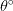

step in the graph, indicating an abrupt change in pixel value. These types of edges tend to be easy to detect.

#### **斜坡边缘**

**斜坡边缘**类似于阶梯边缘，只是像素强度的变化不是瞬时的。相反，像素值的变化发生在一个短的但有限的距离内。

在这里，我们可以看到一个边缘在缓慢地“加速”变化，但强度的变化不会像阶跃边缘那样立即发生:

#### **山脊边缘**

一个**脊边**类似于组合两个斜坡边，一个正好撞上另一个。我喜欢把坡道边缘想象成在一座大山丘或山上上下行驶:

首先，你慢慢地爬山。然后你到达顶部，在那里它在短时间内保持水平。然后你骑马下山。

在边缘检测的情况下，当图像强度突然变化时，会出现斜坡边缘，但在一小段距离后会返回初始值。

#### **屋顶边缘**

最后，我们有**屋顶边缘，**，它是一种屋脊边缘:

与屋脊边缘不同，屋脊边缘的顶部有一个短而有限的平台，而屋顶边缘没有这样的平台。相反，我们在边缘的两边慢慢上升，但是顶部是一个顶峰，我们只是回落到底部。

### **Canny 边缘检测简而言之**

现在，我们已经讨论了图像中各种类型的边缘，让我们来讨论实际的 Canny 边缘检测算法，这是一个多步骤的过程，包括:

1.  对图像应用高斯平滑以帮助减少噪声
2.  使用 Sobel 核计算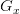和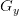图像梯度
3.  应用非最大值抑制以仅保留指向梯度方向的梯度幅值像素的局部最大值
4.  定义并应用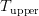和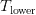阈值进行滞后阈值处理

让我们来讨论这些步骤。

#### **步骤#1:高斯平滑**

这一步相当直观和简单。正如我们从关于[平滑和模糊](https://pyimagesearch.com/2021/04/28/opencv-smoothing-and-blurring/)的教程中了解到的那样，平滑图像让我们可以忽略很多细节，而是专注于实际的结构。

这在边缘检测的环境中也是有意义的——我们对图像的实际细节不感兴趣。相反，我们希望应用边缘检测来找到图像中对象的*结构*和*轮廓*，以便我们可以进一步处理它们。

#### **步骤#2:梯度幅度和方向**

现在我们有了一个平滑的图像，我们可以计算梯度方向和大小，就像我们在[之前的文章](https://pyimagesearch.com/2021/05/12/image-gradients-with-opencv-sobel-and-scharr/)中所做的一样。

然而，正如我们所看到的，梯度幅度对噪声非常敏感，并不是最佳的边缘检测器。我们需要在这个过程中增加两个步骤来提取更好的边缘。

#### **步骤#3:非最大值抑制**

非极大值抑制听起来像是一个复杂的过程，但实际上不是——它只是一个简单的**边缘细化**过程。

在计算我们的梯度幅度表示之后，边缘本身仍然相当嘈杂和模糊，但是实际上对于给定的区域应该只有*一个*边缘响应，而不是一整块像素报告它们自己是边缘。

为了补救这一点，我们可以使用非最大值抑制来应用边缘细化。为了应用非最大值抑制，我们需要检查梯度幅度

and orientation at each pixel in the image and:

*   将当前像素与其周围的邻域进行比较
*   确定方向指向哪个方向:
    *   如果它指向北方或南方，那么检查北方和南方的星等
    *   如果方向指向东方或西方，则检查东方和西方像素
*   如果中心像素的幅值*大于与其比较的两个像素的幅值*，则保持该幅值；否则，丢弃它

Canny 边缘检测器的一些实现对的值取整

to either 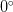, 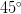, 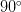, or , and then use the rounded angle to compare not only the north, south, east, and west pixels, but also the corner top-left, top-right, bottom-right, and bottom-left pixels as well.

但是，让我们简单地看一个对角度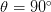应用非最大值抑制的例子

degrees:

在上面的例子中，我们假设梯度方向是

(it’s actually not, but that’s okay, this is only an example).

假设我们的梯度方向指向北方，我们需要检查南北两个像素。 *93* 的中心像素值大于 *26* 的南部像素值，所以我们将丢弃 *26* 。然而，检查北像素我们看到值是 *162* —我们将保持 *162* 的这个值，并抑制(即设置为 *0* )自 *93 < 162 以来的 *93* 的值。*

这里是另一个应用非最大值抑制的例子

:

注意中心像素如何比东西像素少。根据我们上面的非极大值抑制规则(规则#3)，我们需要丢弃 *93* 的像素值，并分别保留 *104* 和 *139* 的东值和西值。

如您所见，边缘检测的非极大值抑制并不像看起来那么难！

#### **步骤#4:滞后阈值**

最后，我们有滞后阈值步骤。就像非极大值抑制一样，其实比听起来容易多了。

即使在应用非最大值抑制后，我们可能需要移除图像中技术上不是边缘的区域，但在计算梯度幅度和应用非最大值抑制后，仍然作为边缘响应。

为了忽略图像的这些区域，我们需要定义两个阈值:

and .

任何梯度值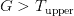

***is sure to be an edge.***

任何梯度值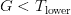

***is definitely not an edge,*** so immediately discard these regions.

以及落入范围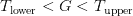的任何梯度值

needs to undergo additional tests:

1.  如果特定的梯度值连接到一个**强边缘**(即)，则将该像素标记为边缘。
2.  如果渐变像素是*而不是*连接到一个强边缘，那么丢弃它。

滞后阈值实际上可以更直观地解释:

*   在图的上方，我们可以看到 **A** 是一条确定的边，因为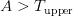。
*   **B** 也是一条边，即使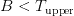既然连接到一条确定的边， **A** 。
*   **C** 不是一条边，因为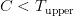与一条强边不相连。
*   最后， **D** 由于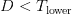不是边，自动丢弃。

设置这些阈值范围并不总是一个简单的过程。

如果阈值范围*太宽，*那么我们将得到许多错误的边缘，而不是将要找到*只是*图像中一个物体的结构和轮廓。

类似地，如果阈值范围*太窄*，我们将根本找不到很多边缘，并且有可能完全错过对象的结构/轮廓！

在这一系列文章的后面，我将演示我们如何能够毫不费力地自动调整这些阈值范围。但是暂时，让我们看看边缘检测在 OpenCV 内部实际上是如何执行的。

### **配置您的开发环境**

要遵循这个指南，您需要在您的系统上安装 OpenCV 库。

幸运的是，OpenCV 可以通过 pip 安装:

```py
$ pip install opencv-contrib-python
```

**如果你需要帮助为 OpenCV 配置开发环境，我*强烈推荐*阅读我的** [***pip 安装 OpenCV* 指南**](https://pyimagesearch.com/2018/09/19/pip-install-opencv/)——它将在几分钟内让你启动并运行。

### **在配置开发环境时遇到了问题？**

说了这么多，你是:

*   时间紧迫？
*   了解你雇主的行政锁定系统？
*   想要跳过与命令行、包管理器和虚拟环境斗争的麻烦吗？
*   **准备好在您的 Windows、macOS 或 Linux 系统上运行代码*****？***

 *那今天就加入 [PyImageSearch 大学](https://pyimagesearch.com/pyimagesearch-university/)吧！

**获得本教程的 Jupyter 笔记本和其他 PyImageSearch 指南，这些指南是** ***预先配置的*** **，可以在您的网络浏览器中运行在 Google Colab 的生态系统上！**无需安装。

最棒的是，这些 Jupyter 笔记本可以在 Windows、macOS 和 Linux 上运行！

### **项目结构**

在我们使用 OpenCV 和 Canny 边缘检测器计算边缘之前，让我们先回顾一下我们的项目目录结构。

请务必访问本教程的 ***“下载”*** 部分，以检索源代码和示例图像:

```py
$ tree . --dirsfirst
.
├── images
│   ├── clonazepam_1mg.png
│   └── coins.png
└── opencv_canny.py

1 directory, 3 files
```

我们要查看一个 Python 脚本`opencv_canny.py`，它将应用 Canny 边缘检测器。

在`images`目录中，我们有两个示例图像，我们将对它们应用 Canny 边缘检测器。

### **用 OpenCV 实现 Canny 边缘检测器**

我们现在准备使用 OpenCV 和`cv2.Canny`函数实现 Canny 边缘检测器！

打开项目结构中的`opencv_cann.py`文件，让我们查看代码:

```py
# import the necessary packages
import argparse
import cv2

# construct the argument parser and parse the arguments
ap = argparse.ArgumentParser()
ap.add_argument("-i", "--image", type=str, required=True,
	help="path to input image")
args = vars(ap.parse_args())
```

我们从**的第 2 行和第 3 行**开始，导入我们需要的 Python 包——我们只需要用`argparse`输入命令行参数，用`cv2`输入 OpenCV 绑定。

命令行参数在**的第 6-9 行**被解析。需要一个开关`--image`，它是我们希望应用边缘检测的输入图像的路径。

现在让我们加载图像并对其进行预处理:

```py
# load the image, convert it to grayscale, and blur it slightly
image = cv2.imread(args["image"])
gray = cv2.cvtColor(image, cv2.COLOR_BGR2GRAY)
blurred = cv2.GaussianBlur(gray, (5, 5), 0)

# show the original and blurred images
cv2.imshow("Original", image)
cv2.imshow("Blurred", blurred)
```

虽然 Canny 边缘检测可以通过分别检测每个单独的红色、绿色和蓝色通道中的边缘并将结果组合在一起而应用于 RGB 图像，但我们*几乎总是*希望将边缘检测应用于单通道灰度图像(**第 13 行** ) —这可以确保边缘检测过程中的噪声更少。

其次，虽然 Canny 边缘检测器在边缘检测之前应用了模糊，但我们也希望(通常)在边缘检测器之前应用额外的模糊，以进一步降低噪声，并允许我们找到图像中的对象( **Line 14** )。

**第 17 行和第 18 行**然后在屏幕上显示我们的原始图像和模糊图像。

我们现在准备执行边缘检测:

```py
# compute a "wide", "mid-range", and "tight" threshold for the edges
# using the Canny edge detector
wide = cv2.Canny(blurred, 10, 200)
mid = cv2.Canny(blurred, 30, 150)
tight = cv2.Canny(blurred, 240, 250)

# show the output Canny edge maps
cv2.imshow("Wide Edge Map", wide)
cv2.imshow("Mid Edge Map", mid)
cv2.imshow("Tight Edge Map", tight)
cv2.waitKey(0)
```

应用 cv2。在**行 22-24** 上执行检测边缘的 Canny 功能。

`cv2.Canny`的第一个参数是我们想要检测边缘的图像——在本例中，是我们的灰度模糊图像。然后我们提供

and thresholds, respectively.

在**行 22、**上，我们在**行 23** 上应用一个*宽*阈值，在**行 24** 上应用一个*中范围*阈值，以及一个*紧*阈值。

***注:*** *你可以通过在* ***图 11*** *和* ***图 12*** *上绘制阈值来说服自己这些是宽、中、紧阈值。*

最后，**行 27-30** 在我们的屏幕上显示输出边缘图。

### **Canny 边缘检测结果**

让我们让精明的边缘检测器为我们工作。

首先访问本教程的 ***“下载”*** 部分，检索源代码和示例图像。

从那里，打开一个终端并执行以下命令:

```py
$ python opencv_canny.py --image images/coins.png
```

在上图中，*左上角的*图像是我们输入硬币的图像。然后，我们稍微模糊图像，以帮助平滑细节，并帮助检测右上角的*的边缘。*

宽范围、中范围和窄范围边缘图分别显示在*底部*上。

使用宽边缘贴图可以捕捉硬币的轮廓，但也可以捕捉硬币内部的许多面和符号的边缘。

中档边缘图也有类似的表现。

最后，窄范围边缘图能够只捕捉硬币的轮廓，而丢弃其余部分。

让我们看另一个例子:

```py
$ python opencv_canny.py --image images/clonazepam_1mg.png
```

与图 11 的**不同，**图 12** 的精明阈值给了我们几乎相反的结果。**

使用宽范围边缘图，我们能够找到药丸的轮廓。

中档边缘图也给了我们药丸的轮廓，还有一些印在药丸上的数字。

最后，紧密的边缘图对我们没有任何帮助——药丸的轮廓几乎完全消失了。

### **我们如何选择最优的 Canny 边缘检测参数？**

正如您所知，根据您的输入图像，您将需要显著不同的滞后阈值——调整这些值可能是一件非常痛苦的事情。您可能想知道，有没有一种方法能够可靠地调整这些参数，而不是简单地猜测、检查和查看结果？

**答案是** ***是的！***

我们将在下一课中讨论这一技巧。

## **总结**

在本课中，我们学习了如何使用图像梯度(计算机视觉和图像处理的最基本构建模块之一)来创建边缘检测器。

具体来说，我们关注的是 **Canny 边缘检测器，**这是计算机视觉社区中最知名、最常用的边缘检测器。

从那里，我们检查了 Canny 边缘检测器的步骤，包括:

1.  缓和
2.  计算图像梯度
3.  应用非最大值抑制
4.  利用滞后阈值

然后我们利用 Canny 边缘检测器的知识，用它来应用 OpenCV 的`cv2.Canny`函数来检测图像中的边缘。

然而，Canny 边沿检测器的最大缺点之一是调整迟滞步长的上下阈值。如果我们的阈值太宽，我们会得到太多的边。如果我们的阈值太窄，我们根本检测不到很多边缘！

为了帮助我们调整参数，您将在本系列的下一篇教程中学习如何应用*自动* Canny 边缘检测。

**要下载这篇文章的源代码(并在未来教程在 PyImageSearch 上发布时得到通知)，*只需在下面的表格中输入您的电子邮件地址！*******