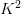
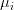
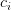
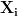
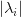

# 用于人脸识别的 OpenCV 特征脸

> 原文：<https://pyimagesearch.com/2021/05/10/opencv-eigenfaces-for-face-recognition/>

在本教程中，您将学习如何使用 Eigenfaces 算法、OpenCV 和 scikit-learn 实现人脸识别。

我们的[之前的教程](https://pyimagesearch.com/2021/05/03/face-recognition-with-local-binary-patterns-lbps-and-opencv/)介绍了人脸识别的概念——检测图像/视频中人脸的存在，然后识别人脸。

我们现在要学习如何利用线性代数，更具体地说，主成分分析来识别人脸。

从理论和历史的角度来看，理解这个算法是很重要的，所以请确保您完全阅读了指南并消化了它。

**要学习如何实现特征脸进行人脸识别，** ***继续阅读。***

## **用于人脸识别的 OpenCV 特征脸**

在本教程的第一部分，我们将讨论特征脸算法，包括它如何利用线性代数和主成分分析(PCA)来执行人脸识别。

从那里，我们将配置我们的开发环境，然后审查我们的项目目录结构。

然后，我将向您展示如何使用 OpenCV 和 scikit-learn 实现用于人脸识别的特征脸。

我们开始吧！

### **特征脸、主成分分析(PCA)和人脸识别**

特征脸算法的基础首先由 Sirovich 和 Kirby 在他们 1987 年的论文“用于表征人脸的低维过程、中提出，然后由 Turk 和 Pentland 在他们 1991 年的 CVPR 论文“使用特征脸的面部识别、、*”中正式提出。*

这些论文被认为是计算机视觉历史上的一项开创性工作——尽管此后有人提出了其他可以胜过特征脸的方法，但我们花时间理解和欣赏这种算法仍然很重要。我们今天将在这里讨论 Eigenfaces 的技术内部工作原理。

特征脸算法的第一步是输入一组 *N* 张人脸图像:

为了使人脸识别成功(并且有些健壮)，我们应该确保我们想要识别的每个人都有多张图像。

现在让我们考虑一个包含人脸的图像:

当应用特征脸时，每个脸被表示为灰度， *K×K* 像素位图(图像不必是正方形的，但是为了这个例子，如果我们假设正方形图像，则更容易解释)。

为了应用特征脸算法，我们需要从图像中形成一个*单一向量*。这是通过将每个图像“展平”成一个来实现的

-dim vector:

同样，我们在这里所做的是拍摄一张 *K×K* 的图像，并将所有的行连接在一起，形成一个单一的长

list of grayscale pixel intensities.

在数据集中的每个图像被展平后，我们形成一个这样的展平图像矩阵，其中 *Z* 是数据集中图像的总数:

**我们的整个数据集现在包含在一个矩阵中，**

 *给定这个矩阵 *M* ，我们现在准备应用[主成分分析(PCA)](https://en.wikipedia.org/wiki/Principal_component_analysis) ，这是特征脸算法的基石。

与 PCA 基础的线性代数相关的完整回顾超出了本课的范围(有关该算法的详细回顾，请参见[吴恩达对主题](https://www.coursera.org/learn/machine-learning)的讨论)，但该算法的一般概述如下:

1.  计算矩阵中每列的平均值，给出图像数据集中每个 *(x，y)*-坐标的 ***的平均像素强度值。***
2.  从每列中减去——这被称为*表示将数据居中*，是执行 PCA 时的一个必需步骤。
3.  现在我们的矩阵 *M* 已经被均值居中，计算*协方差矩阵。*
4.  对协方差矩阵进行特征值分解，得到特征值和特征向量。
5.  将按排序，最大到最小。
6.  取对应特征值幅度最大的前 *N* 个特征向量。
7.  通过将输入数据投影(即取点积)到由顶部的 *N 个*特征向量— **创建的空间上来变换输入数据，这些特征向量被称为我们的** ***特征面。***

同样，关于手动计算协方差矩阵和执行特征值分解的完整回顾不在本课的讨论范围之内。如需更详细的回顾，请参见[吴恩达的机器学习课程](https://www.coursera.org/learn/machine-learning)或咨询林赛·史密斯的这本优秀的[主成分分析初级读本](http://www.iro.umontreal.ca/~pift6080/H09/documents/papers/pca_tutorial.pdf)。

然而，在我们使用特征脸算法执行实际的面部识别之前，让我们实际讨论这些特征脸表示:

上面矩阵中的每一行都是带有的特征脸

entries — *exactly like our original image*

这是什么意思？因为这些特征脸的每一个表现实际上都是一个

vector, we can reshape it into a *K×K* bitmap:

左边*的图像只是我们数据集中所有人脸的平均值，而右边*的数字显示了我们人脸数据集中与平均值最显著的偏差。**

这可以被认为是人们面部变化最大的维度的可视化。较亮的区域对应较高的变化，较暗的区域对应很小或没有变化。在这里，我们可以看到，我们的特征脸表示捕捉了眼睛、头发、鼻子、嘴唇和脸颊结构的相当大的差异。

现在我们已经了解了特征脸表示是如何构建的，让我们继续学习如何使用特征脸来实际识别人脸。

### **使用特征脸识别人脸**

给定我们的特征脸向量，我们可以通过取(展平的)输入人脸图像和 *N* 个特征脸之间的点积来表示新的人脸。这使得我们可以将每张脸表示为主要成分的线性组合:

*查询脸=特征脸#1 的 36%+-特征脸#2 的 8%+…+特征脸 N 的 21%*

为了执行实际的人脸识别，Sirovich 和 Kirby 建议采用投影特征脸表示之间的欧几里德距离，这实质上是一个 k-NN 分类器:

欧几里德距离(表示为函数， *d* )越小，两张脸就越“相似”——通过取与具有最小欧几里德距离的脸相关联的标签来找到整体识别。

例如，在图 7 的**中，顶部图像对的距离为`0`，因为两张脸*相同*(即相同的图像)。**

中间的图像对的距离为`0.07`——虽然图像不同，但它们包含相同的脸。

第三个图像对具有大得多的距离(`9.81`)，表明呈现给特征脸算法的两个人脸是*而不是*同一个人。

在实践中，我们常常不依赖于简单的 k-NN 算法进行识别。通过使用更高级的机器学习算法，如支持向量机(SVMs)、随机森林等，可以提高精确度。今天这里介绍的实现将利用支持向量机。

### **配置您的开发环境**

要了解如何使用 Eigenfaces 算法进行人脸识别，您需要在计算机上安装 OpenCV、scikit-image 和 scikit-learn:

幸运的是，OpenCV 可以通过 pip 安装:

```py
$ pip install opencv-contrib-python
$ pip install scikit-image
$ pip install scikit-learn
```

**如果你需要帮助为 OpenCV 配置开发环境，我*强烈推荐*阅读我的** [***pip 安装 OpenCV* 指南**](https://pyimagesearch.com/2018/09/19/pip-install-opencv/)——它将在几分钟内让你启动并运行。

### **在配置开发环境时遇到了问题？**

说了这么多，你是:

*   时间紧迫？
*   了解你雇主的行政锁定系统？
*   想要跳过与命令行、包管理器和虚拟环境斗争的麻烦吗？
*   **准备好在您的 Windows、macOS 或 Linux 系统上运行代码*****？***

 *那今天就加入 [PyImageSearch 大学](https://pyimagesearch.com/pyimagesearch-university/)吧！

**获得本教程的 Jupyter 笔记本和其他 PyImageSearch 指南，这些指南是** ***预先配置的*** **，可以在您的网络浏览器中运行在 Google Colab 的生态系统上！**无需安装。

最棒的是，这些 Jupyter 笔记本可以在 Windows、macOS 和 Linux 上运行！

### **加州理工学院人脸数据集**

加州理工学院人脸挑战赛是人脸识别算法的基准数据集。总的来说，该数据集由大约 27 个不同的人的 450 幅图像组成。每个对象都是在各种照明条件、背景场景和面部表情下拍摄的，如图**图 9** 所示。

本教程的总体目标是应用 Eigenfaces 人脸识别算法来识别加州理工学院人脸数据集中的每个主题。

***注意:我已经在与本教程相关的“下载”中包含了加州理工学院人脸数据集的一个稍微修改的版本。*** *稍加修改的版本包括一个更容易解析的目录结构，每个主题都有假名，这使得更容易评估我们的人脸识别系统的准确性。同样，您* ***不需要*** *从加州理工学院的服务器上下载加州理工学院的人脸数据集——只需使用与本指南相关的“下载”即可。*

### **项目结构**

在我们用 OpenCV 实现 Eigenfaces 之前，让我们先回顾一下我们的项目目录结构。

请务必访问本教程的 ***“下载”*** 部分，以检索源代码、预训练的人脸检测器模型和加州理工学院人脸数据集。

取消归档后。zip 您应该有以下结构:

```py
$ tree --dirsfirst --filelimit 20
.
├── caltech_faces [26 entries exceeds filelimit, not opening dir]
├── face_detector
│   ├── deploy.prototxt
│   └── res10_300x300_ssd_iter_140000.caffemodel
├── pyimagesearch
│   ├── __init__.py
│   └── faces.py
└── eigenfaces.py

4 directories, 7 files
```

我们的项目目录结构基本上与上周我们讨论用本地二进制模式(LBPs) 实现[人脸识别时的目录结构相同:](https://pyimagesearch.com/2021/05/03/face-recognition-with-local-binary-patterns-lbps-and-opencv/)

*   `face_detector`:存储 [OpenCV 预先训练好的基于深度学习的人脸检测器](https://pyimagesearch.com/2018/02/26/face-detection-with-opencv-and-deep-learning/)
*   `pyimagesearch`:包含`detect_faces`和`load_face_dataset`助手函数，它们分别执行人脸检测和从磁盘加载我们的加州理工学院人脸数据集
*   我们训练特征脸模型的驱动脚本

`caltech_faces`目录的结构如下:

```py
$ ls -l caltech_faces/
abraham
alberta
allen
carmen
conrad
cynthia
darrell
flyod
frank
glen
gloria
jacques
judy
julie
kathleen
kenneth
lewis
mae
phil
raymond
rick
ronald
sherry
tiffany
willie
winston

$ ls -l caltech_faces/abraham/*.jpg
caltech_faces/abraham/image_0022.jpg
caltech_faces/abraham/image_0023.jpg
caltech_faces/abraham/image_0024.jpg
...
caltech_faces/abraham/image_0041.jpg
```

在这个目录中有一个子目录，包含我们想要识别的每个人的图像。如你所见，我们为每个想要识别的人准备了多张图片。这些图像将作为我们的训练数据，以便我们的 LBP 人脸识别器可以了解每个人的长相。

### **实现人脸检测和加州理工学院人脸数据集加载**

在本节中，我们将实现两个函数，这两个函数有助于使用加州理工学院人脸数据集:

1.  `detect_faces`:接受输入图像并执行人脸检测，返回边界框 *(x，y)*-图像中所有人脸的坐标
2.  `load_face_dataset`:遍历加州理工学院人脸数据集中的所有图像，执行人脸检测，并将人脸 ROI 和类别标签(即个人姓名)返回给调用函数

这两个功能在上周的关于使用局部二进制模式(LBPs)和 OpenCV 的 [*人脸识别的教程中都有详细介绍。出于完整性的考虑，我今天在这里包含了这两个函数，但是您应该参考以前的文章来获得关于它们的更多细节。*](https://pyimagesearch.com/2021/05/03/face-recognition-with-local-binary-patterns-lbps-and-opencv/)

也就是说，打开`pyimagesearch`模块内的`faces.py`，让我们看看发生了什么:

```py
# import the necessary packages
from imutils import paths
import numpy as np
import cv2
import os

def detect_faces(net, image, minConfidence=0.5):
	# grab the dimensions of the image and then construct a blob
	# from it
	(h, w) = image.shape[:2]
	blob = cv2.dnn.blobFromImage(image, 1.0, (300, 300),
		(104.0, 177.0, 123.0))

	# pass the blob through the network to obtain the face detections,
	# then initialize a list to store the predicted bounding boxes
	net.setInput(blob)
	detections = net.forward()
	boxes = []

	# loop over the detections
	for i in range(0, detections.shape[2]):
		# extract the confidence (i.e., probability) associated with
		# the detection
		confidence = detections[0, 0, i, 2]

		# filter out weak detections by ensuring the confidence is
		# greater than the minimum confidence
		if confidence > minConfidence:
			# compute the (x, y)-coordinates of the bounding box for
			# the object
			box = detections[0, 0, i, 3:7] * np.array([w, h, w, h])
			(startX, startY, endX, endY) = box.astype("int")

			# update our bounding box results list
			boxes.append((startX, startY, endX, endY))

	# return the face detection bounding boxes
	return boxes
```

`detect_faces`函数接受我们的输入人脸检测器`net`，一个应用人脸检测的输入`image`，以及用于过滤弱/假阳性检测的`minConfidence`。

然后，我们对输入图像进行预处理，使其通过面部检测模型(**行 11 和 12** )。该函数执行调整大小、缩放和均值减法。

**第 16 行和第 17 行**执行面部检测，产生一个`detections`列表，我们在**第 21 行**循环该列表。

假设检测到的人脸的`confidence`大于`minConfidence`，我们提取边界框坐标并更新我们的`boxes`列表。

然后将`boxes`列表返回给调用函数。

我们的第二个函数`load_face_dataset`，遍历加州理工学院人脸数据集中的所有图像，并对每张图像应用人脸检测:

```py
def load_face_dataset(inputPath, net, minConfidence=0.5,
	minSamples=15):
	# grab the paths to all images in our input directory, extract
	# the name of the person (i.e., class label) from the directory
	# structure, and count the number of example images we have per
	# face
	imagePaths = list(paths.list_images(inputPath))
	names = [p.split(os.path.sep)[-2] for p in imagePaths]
	(names, counts) = np.unique(names, return_counts=True)
	names = names.tolist()

	# initialize lists to store our extracted faces and associated
	# labels
	faces = []
	labels = []

	# loop over the image paths
	for imagePath in imagePaths:
		# load the image from disk and extract the name of the person
		# from the subdirectory structure
		image = cv2.imread(imagePath)
		name = imagePath.split(os.path.sep)[-2]

		# only process images that have a sufficient number of
		# examples belonging to the class
		if counts[names.index(name)] < minSamples:
			continue
```

`load_face_dataset`要求我们将`inputPath`提供给加州理工学院人脸数据集、人脸检测模型(`net`)、正面检测的最小置信度以及每个人脸所需的最小数量的示例图像。

**第 46 行**获取加州理工学院人脸数据集中所有输入图像的路径，而**第 47-49 行**从子目录结构中提取个人姓名，并计算与每个人相关联的图像数量。

然后我们循环第 57 行的**上的所有`imagePaths`，从磁盘加载`image`并提取这个人的`name`。**

如果这个特定的`name`的图像少于`minSamples`，我们会丢弃该图像，并且在训练我们的面部识别器时*不会*考虑这个人。我们这样做是为了避免类不平衡的问题(处理类不平衡超出了本教程的范围)。

如果通过了`minSamples`测试，我们将继续执行面部检测:

```py
		# perform face detection
		boxes = detect_faces(net, image, minConfidence)

		# loop over the bounding boxes
		for (startX, startY, endX, endY) in boxes:
			# extract the face ROI, resize it, and convert it to
			# grayscale
			faceROI = image[startY:endY, startX:endX]
			faceROI = cv2.resize(faceROI, (47, 62))
			faceROI = cv2.cvtColor(faceROI, cv2.COLOR_BGR2GRAY)

			# update our faces and labels lists
			faces.append(faceROI)
			labels.append(name)

	# convert our faces and labels lists to NumPy arrays
	faces = np.array(faces)
	labels = np.array(labels)

	# return a 2-tuple of the faces and labels
	return (faces, labels)
```

对于每个检测到的人脸，我们提取人脸 ROI，将其调整为固定大小(执行 PCA 时的*要求*)，然后将图像从彩色转换为灰度。

得到的一组`faces`和`labels`被返回给调用函数。

***注:*** *如果你想了解更多关于这两个函数如何工作的细节，我建议你阅读我之前的指南，关于使用局部二进制模式(LBPs)和 OpenCV* *的* [*人脸识别，其中我详细介绍了`detect_faces`和`load_face_dataset`。*](https://pyimagesearch.com/2021/05/03/face-recognition-with-local-binary-patterns-lbps-and-opencv/)

### **用 OpenCV 实现特征脸**

现在让我们用 OpenCV 实现用于人脸识别的特征脸！

打开项目目录结构中的`eigenfaces.py`文件，让我们开始编码:

```py
# import the necessary packages
from sklearn.preprocessing import LabelEncoder
from sklearn.decomposition import PCA
from sklearn.svm import SVC
from sklearn.model_selection import train_test_split
from sklearn.metrics import classification_report
from skimage.exposure import rescale_intensity
from pyimagesearch.faces import load_face_dataset
from imutils import build_montages
import numpy as np
import argparse
import imutils
import time
import cv2
import os
```

**第 2-15 行**导入我们需要的 Python 包。我们主要的进口产品包括:

*   `LabelEncoder`:用于将类别标签(即个人姓名)编码为整数而不是字符串(这是利用 OpenCV 的 LBP 人脸识别器的一个要求)
*   `PCA`:进行主成分分析
*   我们的支持向量机(SVM)分类器，我们将在数据集的特征脸表示上训练它
*   `train_test_split`:从我们的加州理工学院人脸数据集构建一个训练和测试分割
*   `rescale_intensity`:用于可视化特征脸表示

我们现在可以转到命令行参数:

```py
# construct the argument parser and parse the arguments
ap = argparse.ArgumentParser()
ap.add_argument("-i", "--input", type=str, required=True,
	help="path to input directory of images")
ap.add_argument("-f", "--face", type=str,
	default="face_detector",
	help="path to face detector model directory")
ap.add_argument("-c", "--confidence", type=float, default=0.5,
	help="minimum probability to filter weak detections")
ap.add_argument("-n", "--num-components", type=int, default=150,
	help="# of principal components")
ap.add_argument("-v", "--visualize", type=int, default=-1,
	help="whether or not PCA components should be visualized")
args = vars(ap.parse_args())
```

我们的命令行参数包括:

1.  `--input`:我们的输入数据集的路径，该数据集包含我们想要训练 LBP 人脸识别器的个人的图像
2.  `--face`:OpenCV 深度学习人脸检测器之路
3.  `--confidence`:用于过滤弱检测的最小概率
4.  `--num-components`:应用 PCA 时主成分的数量(我们稍后将更详细地讨论这个变量)
5.  `--visualize`:是否可视化数据的特征脸表示

接下来，让我们从磁盘加载我们的人脸检测模型:

```py
# load our serialized face detector model from disk
print("[INFO] loading face detector model...")
prototxtPath = os.path.sep.join([args["face"], "deploy.prototxt"])
weightsPath = os.path.sep.join([args["face"],
	"res10_300x300_ssd_iter_140000.caffemodel"])
net = cv2.dnn.readNet(prototxtPath, weightsPath)
```

从那里，让我们加载加州理工学院人脸数据集:

```py
# load the CALTECH faces dataset
print("[INFO] loading dataset...")
(faces, labels) = load_face_dataset(args["input"], net,
	minConfidence=0.5, minSamples=20)
print("[INFO] {} images in dataset".format(len(faces)))

# flatten all 2D faces into a 1D list of pixel intensities
pcaFaces = np.array([f.flatten() for f in faces])

# encode the string labels as integers
le = LabelEncoder()
labels = le.fit_transform(labels)

# construct our training and testing split
split = train_test_split(faces, pcaFaces, labels, test_size=0.25,
	stratify=labels, random_state=42)
(origTrain, origTest, trainX, testX, trainY, testY) = split
```

**第 41 行和第 42 行**从磁盘加载 CALTECH Faces 数据集，产生一个 2 元组:

1.  `faces`:来自加州理工人脸数据集的人脸 ROI
2.  `labels`:每个面部 ROI 中的个人姓名

请记住，每张脸都是 2D， *M×N* 的图像；然而，为了应用 PCA，我们需要每张脸的 1D 表示。因此，**第 46 行**将所有的 2D 面展平成像素强度的 1D 列表。

然后我们将`labels`编码为整数而不是字符串。

**第 53-55 行**然后构建我们的训练和测试分割，使用 75%的数据进行训练，剩下的 25%用于评估。

现在让我们在 1D 人脸列表上执行 PCA:

```py
# compute the PCA (eigenfaces) representation of the data, then
# project the training data onto the eigenfaces subspace
print("[INFO] creating eigenfaces...")
pca = PCA(
	svd_solver="randomized",
	n_components=args["num_components"],
	whiten=True)
start = time.time()
trainX = pca.fit_transform(trainX)
end = time.time()
print("[INFO] computing eigenfaces took {:.4f} seconds".format(
	end - start))
```

这里，我们指出 *N* ，初始化`PCA`类时我们要使用的主成分的数量。在我们找到顶部的`--num-components`之后，我们使用它们将原始训练数据投影到特征脸子空间。

现在我们已经执行了 PCA，让我们来看一下主要组件:

```py
# check to see if the PCA components should be visualized
if args["visualize"] > 0:
	# initialize the list of images in the montage
	images = []

	# loop over the first 16 individual components
	for (i, component) in enumerate(pca.components_[:16]):
		# reshape the component to a 2D matrix, then convert the data
		# type to an unsigned 8-bit integer so it can be displayed
		# with OpenCV
		component = component.reshape((62, 47))
		component = rescale_intensity(component, out_range=(0, 255))
		component = np.dstack([component.astype("uint8")] * 3)
		images.append(component)

	# construct the montage for the images
	montage = build_montages(images, (47, 62), (4, 4))[0]

	# show the mean and principal component visualizations
	# show the mean image
	mean = pca.mean_.reshape((62, 47))
	mean = rescale_intensity(mean, out_range=(0, 255)).astype("uint8")
	cv2.imshow("Mean", mean)
	cv2.imshow("Components", montage)
	cv2.waitKey(0)
```

**第 71 行**检查是否设置了`--visualize`命令行参数，如果设置了，我们初始化一个`images`列表来存储我们的可视化。

从那里，我们循环遍历每个顶部 PCA 组件(**行 76** )，将图像重新整形为 *47×62* 像素位图图像(**行 80** )，然后将像素强度重新调整到范围*【0，255】***(行 81** ) *。*

为什么我们要为重新缩放操作费心呢？

简单——我们的特征值分解产生实值特征向量，但是为了用 OpenCV 和`cv2.imshow`可视化图像，我们的图像必须是在*【0，255】—***范围内的无符号 8 位整数，第 81 行和第 82 行**为我们处理这个操作。

然后将结果`component`添加到我们的`images`列表中，以便可视化。

在**线 86** 上，我们制造了一个顶级组件`montage`。

然后我们以类似的方式在第 90-94 行显示平均特征向量表示。

考虑到可视化，让我们在特征脸表示上训练我们的 SVM:

```py
# train a classifier on the eigenfaces representation
print("[INFO] training classifier...")
model = SVC(kernel="rbf", C=10.0, gamma=0.001, random_state=42)
model.fit(trainX, trainY)

# evaluate the model
print("[INFO] evaluating model...")
predictions = model.predict(pca.transform(testX))
print(classification_report(testY, predictions,
	target_names=le.classes_))
```

第 98 和 99 行初始化我们的 SVM 并训练它。

然后，我们使用该模型对我们的测试数据进行预测，在进行预测之前，小心地将测试数据投影到特征值子空间*上。*

**这个投影是一个** ***需求*** **。如果您忘记执行投影，将会发生以下两种情况之一:**

1.  您的代码将出错(由于特征向量和 SVM 模型之间的维度不匹配)
2.  SVM 将返回无意义分类(因为模型的训练数据被投影到特征脸表示中)

**第 104 和 105 行**然后显示分类报告，显示我们的特征脸识别模型的准确性。

最后一步是对我们的测试数据进行采样，对其进行预测，并将结果分别显示在我们的屏幕上:

```py
# generate a sample of testing data
idxs = np.random.choice(range(0, len(testY)), size=10, replace=False)

# loop over a sample of the testing data
for i in idxs:
	# grab the predicted name and actual name
	predName = le.inverse_transform([predictions[i]])[0]
	actualName = le.classes_[testY[i]]

	# grab the face image and resize it such that we can easily see
	# it on our screen
	face = np.dstack([origTest[i]] * 3)
	face = imutils.resize(face, width=250)

	# draw the predicted name and actual name on the image
	cv2.putText(face, "pred: {}".format(predName), (5, 25),
		cv2.FONT_HERSHEY_SIMPLEX, 0.8, (0, 255, 0), 2)
	cv2.putText(face, "actual: {}".format(actualName), (5, 60),
		cv2.FONT_HERSHEY_SIMPLEX, 0.8, (0, 0, 255), 2)

	# display the predicted name  and actual name
	print("[INFO] prediction: {}, actual: {}".format(
		predName, actualName))

	# display the current face to our screen
	cv2.imshow("Face", face)
	cv2.waitKey(0)
```

我们在上周的 [LBP 人脸识别](https://pyimagesearch.com/2021/05/03/face-recognition-with-local-binary-patterns-lbps-and-opencv/)指南中详细介绍了这个代码块，所以如果你想了解更多细节，请务必参考它。

### **OpenCV Eigenfaces 人脸识别结果**

我们现在已经准备好使用 OpenCV 和 Eigenfaces 算法来识别人脸了！

首先访问本教程的 ***“下载”*** 部分，检索源代码和加州理工学院人脸数据集。

从那里，打开一个终端并执行以下命令:

```py
$ python eigenfaces.py --input caltech_faces --visualize 1
[INFO] loading face detector model...
[INFO] loading dataset...
[INFO] 397 images in dataset
[INFO] creating eigenfaces...
[INFO] computing eigenfaces took 0.1049 seconds
[INFO] training classifier...
[INFO] evaluating model...
              precision    recall  f1-score   support

     abraham       1.00      1.00      1.00         5
       allen       1.00      0.75      0.86         8
      carmen       1.00      1.00      1.00         5
      conrad       0.86      1.00      0.92         6
     cynthia       1.00      1.00      1.00         5
     darrell       1.00      1.00      1.00         5
       frank       0.83      1.00      0.91         5
      gloria       1.00      1.00      1.00         5
     jacques       0.86      1.00      0.92         6
        judy       1.00      1.00      1.00         5
       julie       1.00      1.00      1.00         5
     kenneth       1.00      1.00      1.00         6
         mae       1.00      1.00      1.00         5
     raymond       1.00      1.00      1.00         6
        rick       1.00      1.00      1.00         6
      sherry       1.00      0.83      0.91         6
     tiffany       1.00      1.00      1.00         5
      willie       1.00      1.00      1.00         6

    accuracy                           0.97       100
   macro avg       0.97      0.98      0.97       100
weighted avg       0.97      0.97      0.97       100
```

一旦我们的人脸图像从磁盘中加载，计算特征脸表示(即特征值分解)就非常快，只需十分之一秒多一点。

给定特征脸，然后我们训练我们的 SVM。在我们的测试集上评估，我们看到我们获得了 ****≈** 97%的准确率**。不算太差！

现在让我们继续在单独的图像中识别面部:

```py
[INFO] prediction: frank, actual: frank
[INFO] prediction: abraham, actual: abraham
[INFO] prediction: julie, actual: julie
[INFO] prediction: tiffany, actual: tiffany
[INFO] prediction: julie, actual: julie
[INFO] prediction: mae, actual: mae
[INFO] prediction: allen, actual: allen
[INFO] prediction: mae, actual: mae
[INFO] prediction: conrad, actual: conrad
[INFO] prediction: darrell, actual: darrell
```

**图 10** 显示了使用特征脸的人脸识别结果剪辑。注意我们是如何正确识别每一张脸的。

### **用于人脸识别的特征脸问题**

对特征脸算法最大的批评之一是训练和识别人脸时需要严格的[面部对齐](https://pyimagesearch.com/2017/05/22/face-alignment-with-opencv-and-python/):

**由于我们是在像素级别上操作的，所以对于我们数据集中的所有图像，诸如眼睛、鼻子和嘴的面部特征需要被近乎完美地对准*****。**这不仅是一项具有挑战性的任务，而且在条件不太理想的现实世界中也很难保证。*

 *在我们的例子中，加州理工学院人脸数据集中的大多数人脸都是从正面拍摄的，没有视点变化，头部倾斜等。由于这张脸，我们不需要明确地应用面部对齐，一切都按照我们的意愿进行；然而，值得注意的是，这种情况*很少*在现实世界条件下发生。

上周我们讨论了用于人脸识别的局部二进制模式。虽然 LBP 也可能因为没有足够的面部对齐而受到影响，但结果远没有那么明显，并且该方法更加鲁棒，因为我们将面部图像分成 *7×7* 个单元，并为每个单元计算 LBP 直方图

通过将图像量化为级联的特征向量，我们通常能够为我们的人脸识别器增加额外的准确性——因为增加了鲁棒性，我们通常使用 LBPs 进行人脸识别，而不是原始的特征脸算法。

## **总结**

在本教程中，我们讨论了特征脸算法。

Eigenfaces 的第一步是提供一个图像数据集，其中包含你想识别的每个人的多幅图像。

从那里，我们将每张图片展平成一个向量，并存储在一个矩阵中。主成分分析应用于该矩阵，其中我们取具有相应最大特征值幅度的顶部 *N* 个特征向量——这些 *N* 个特征向量是我们的特征面。

对于许多机器学习算法来说，通常很难将特定方法的结果可视化。但是对于 Eigenfaces 来说，其实还是挺容易的！每个特征脸只是一个

flattened vector that can be reshaped into a image, allowing us to visualize each eigenface.

为了识别人脸，我们首先将图像投影到特征脸子空间，然后利用具有欧几里德距离的 k-NN 分类器来寻找最近的邻居。这些最近的邻居用于确定整体标识。然而，我们可以通过使用更高级的机器学习算法来进一步提高准确性，这正是我们在本课中所做的。

上周我们讨论了用于人脸识别的局部二进制模式。在实践中，这种方法往往比特征脸更鲁棒，获得更高的人脸识别精度。

虽然这两种方法都不如我们现代的深度学习人脸识别模型准确，但从历史的角度来理解仍然很重要，当应用深度学习模型时，在计算上是不可行的。

**要下载这篇文章的源代码(并在未来教程在 PyImageSearch 上发布时得到通知)，** ***只需在下面的表格中输入您的电子邮件地址！******