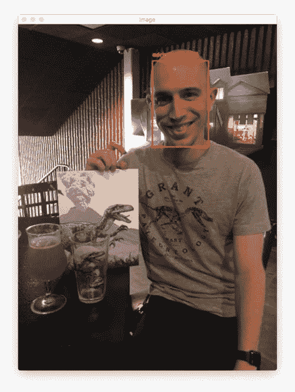
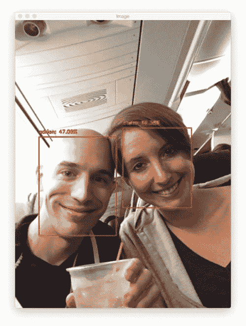
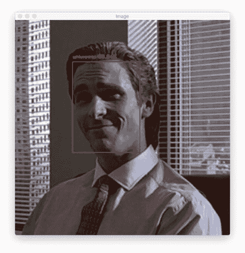
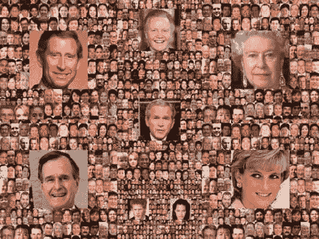
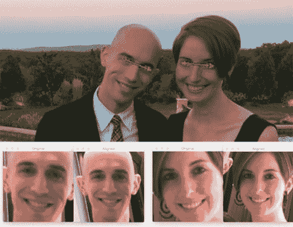

# OpenCV 人脸识别

> 原文：<https://pyimagesearch.com/2018/09/24/opencv-face-recognition/>

最后更新于 2022 年 12 月 30 日。

在本教程中，您将学习如何使用 OpenCV 进行人脸识别。为了构建我们的人脸识别系统，我们将首先执行人脸检测，使用深度学习从每个人脸中提取人脸嵌入，根据嵌入训练人脸识别模型，然后最终**使用 OpenCV 识别图像和视频流中的人脸。**

本教程将使用 [OpenCV](https://opencv.org/) 在我们的人脸数据集上执行[人脸识别](https://pyimagesearch.com/2018/06/18/face-recognition-with-opencv-python-and-deep-learning/)。

当然，你可以交换你自己的人脸数据集！所有你需要做的就是按照我的目录结构插入你自己的脸部图像。

作为奖励，我还包括了如何标记“未知”的脸，这些脸不能被充分信任地分类。

**要了解如何执行 OpenCV 人脸识别，*继续阅读！***

*   【2021 年 7 月更新: 增加了一节关于替代人脸识别方法的考虑，包括如何将暹罗网络用于人脸识别。
*   【2022 年 12 月更新:更新链接和内容。

## OpenCV 人脸识别

在今天的教程中，您将学习如何使用 [OpenCV 库](https://opencv.org/)执行人脸识别。

你可能想知道这个教程和我几个月前写的关于 dlib 人脸识别的教程有什么不同？

请记住，dlib 人脸识别帖子依赖于两个重要的外部库:

1.  [dlib](http://dlib.net/) (明显)
2.  [face_recognition](https://github.com/ageitgey/face_recognition) (这是一套简单易用的人脸识别工具，包装了 dlib)

虽然我们使用 OpenCV 来*促进*面部识别，但是 OpenCV *本身*并不负责识别面部。

在今天的教程中，我们将学习如何将深度学习和 OpenCV(除了 scikit-learn 之外没有其他库)一起应用于:

1.  检测人脸
2.  计算 128-d 面部嵌入以量化面部
3.  在嵌入的基础上训练支持向量机(SVM)
4.  识别图像和视频流中的人脸

所有这些任务都将通过 OpenCV 来完成，使我们能够获得一个“纯粹的”OpenCV 人脸识别管道。

### OpenCV 的人脸识别是如何工作的

为了建立我们的 OpenCV 人脸识别管道，我们将在两个关键步骤中应用深度学习:

1.  应用*面部检测*，检测图像中面部的*存在*和位置，但不识别它
2.  提取 128 维特征向量(称为“嵌入”)，这些向量对图像中的每张脸进行量化

我之前已经讨论过[OpenCV 的人脸检测是如何工作的](https://pyimagesearch.com/2018/02/26/face-detection-with-opencv-and-deep-learning/)，所以如果你之前没有检测过人脸，请参考一下。

负责实际量化图像中每张脸的模型来自于 [OpenFace 项目](https://cmusatyalab.github.io/openface/)，这是深度学习人脸识别的 Python 和 Torch 实现。这个实现来自于 Schroff 等人 2015 年的 CVPR 出版物， [*FaceNet:一个用于人脸识别和聚类的* *统一嵌入*](https://www.cv-foundation.org/openaccess/content_cvpr_2015/app/1A_089.pdf) 。

回顾整个 FaceNet 实现超出了本教程的范围，但是管道的要点可以在上面的图 1 中看到。

首先，我们将图像或视频帧输入到人脸识别管道中。给定输入图像，我们应用人脸检测来检测图像中人脸的位置。

可选地，我们可以计算[面部标志](https://pyimagesearch.com/2017/04/03/facial-landmarks-dlib-opencv-python/)，使我们能够[预处理和对准面部](https://pyimagesearch.com/2017/05/22/face-alignment-with-opencv-and-python/)。

顾名思义，人脸对齐是(1)识别人脸的几何结构和(2)基于平移、旋转和缩放尝试获得人脸的规范对齐的过程。

虽然是可选的，但人脸对齐已被证明可以提高某些管道中人脸识别的准确性。

在我们(可选地)应用了面部对齐和裁剪之后，我们将输入面部通过我们的[深度神经网络](https://pyimagesearch.com/deep-learning-computer-vision-python-book/):

FaceNet 深度学习模型计算 128-d 嵌入，量化人脸本身。

但是网络实际上是如何计算人脸嵌入的呢？

答案在于培训过程本身，包括:

1.  网络的输入数据
2.  三重损失函数

为了用深度学习来训练人脸识别模型，每个输入批数据包括三幅图像:

1.  *主播*
2.  *正面的*图像
3.  *负*像

主播就是我们现在的脸，身份 *A* 。

第二个图像是我们的正面图像——这个图像也包含了人 *A* 的脸。

另一方面，反面形象 ***没有同样的身份*** ，可能属于人物 *B* 、 *C* ，甚至 *Y* ！

重点是锚和正面图像都属于同一个人/脸，而负面图像不包含同一张脸。

神经网络计算每个面部的 128-d 嵌入，然后调整网络的权重(通过三元组损失函数),使得:

1.  锚和正图像的 128-d 嵌入更靠近在一起
2.  而与此同时，将父亲这一负面形象的根深蒂固推开

以这种方式，网络能够学习量化人脸，并返回适用于人脸识别的高度鲁棒和有区别的嵌入。

**此外，我们实际上可以** *重用***open face 模型用于我们自己的应用程序，而不必显式地训练它！**

即使我们今天使用的深度学习模型(很可能)*从未*见过我们将要通过它的人脸，该模型仍将能够计算每个人脸的嵌入——理想情况下，这些人脸嵌入将足够不同，以便我们可以训练一个“标准”机器学习分类器(SVM，SGD 分类器，随机森林等)。)在人脸嵌入之上，并因此获得我们的 OpenCV 人脸识别管道。

如果你有兴趣了解更多关于三重丢失的细节以及如何使用它来训练人脸嵌入模型，请务必参考我之前的博客文章以及[施罗夫等人的出版物](https://www.cv-foundation.org/openaccess/content_cvpr_2015/app/1A_089.pdf)。

### 我们的人脸识别数据集

我们今天使用的数据集包含三个人:

*   一个男人
*   一个女人
*   “未知”，用来表示我们不认识的人的脸，并希望这样标记(这里我只是从电影*侏罗纪公园*中采样的脸，我在[以前的帖子](https://pyimagesearch.com/2018/06/18/face-recognition-with-opencv-python-and-deep-learning/)中使用过——你可能想插入你自己的“未知”数据集)。

每个类总共包含六幅图像。

如果你正在[建立自己的人脸识别数据集](https://pyimagesearch.com/2018/06/11/how-to-build-a-custom-face-recognition-dataset/)，理想情况下，我会建议你希望识别的每个人有 10-20 张图像——请务必参考这篇博客文章的*“缺点，限制，以及如何获得更高的人脸识别准确率”*部分了解更多细节。

### 项目结构

一旦你从这篇文章的 ***“下载”*** 部分获得了压缩文件，继续解压文件并导航到目录。

从那里，您可以使用`tree`命令在您的终端中打印目录结构:

```py
$ tree --dirsfirst
.
├── dataset
│   ├── adrian [6 images]
│   ├── trisha [6 images]
│   └── unknown [6 images]
├── images
│   ├── adrian.jpg
│   ├── patrick_bateman.jpg
│   └── trisha_adrian.jpg
├── face_detection_model
│   ├── deploy.prototxt
│   └── res10_300x300_ssd_iter_140000.caffemodel
├── output
│   ├── embeddings.pickle
│   ├── le.pickle
│   └── recognizer.pickle
├── extract_embeddings.py
├── openface_nn4.small2.v1.t7
├── train_model.py
├── recognize.py
└── recognize_video.py

7 directories, 31 files

```

这个项目有相当多的活动部分— **现在花点时间仔细阅读这一部分，以便熟悉今天项目中的所有文件。**

我们的项目在根文件夹中有四个目录:

*   `dataset/`:包含我们的脸部图像，按名称组织到子文件夹中。
*   包含三个测试图像，我们将使用它们来验证我们的模型的操作。
*   `face_detection_model/`:包含 OpenCV 提供的预训练 Caffe 深度学习模型，用于*检测*人脸。这个模型*检测图像中的*和*定位图像中的*人脸。
*   `output/`:包含我输出的 pickle 文件。如果您正在使用自己的数据集，也可以将输出文件存储在这里。输出文件包括:
    *   `embeddings.pickle`:序列化的面部嵌入文件。已经为数据集中的每个面计算了嵌入，并存储在该文件中。
    *   我们的标签编码器。包含我们的模型可以识别的人的姓名标签。
    *   `recognizer.pickle`:我们的线性支持向量机(SVM)模型。这是一个机器学习模型，而不是深度学习模型，它负责实际上*识别*的脸。

让我们总结一下根目录中的五个文件:

*   `extract_embeddings.py`:我们将在**步骤#1** 中查看这个文件，它负责使用深度学习特征提取器来生成描述人脸的 128-D 向量。我们数据集中的所有人脸都将通过神经网络来生成嵌入。
*   `openface_nn4.small2.v1.t7`:产生 128 维人脸嵌入的 Torch 深度学习模型。我们将在**步骤#1、#2 和#3** 以及**奖金**部分使用这个深度学习模型。
*   `train_model.py`:我们的线性 SVM 模型将在**步骤#2** 中由这个脚本训练。我们将*检测*面部，*提取*嵌入，并且*将*我们的 SVM 模型拟合到嵌入数据。
*   `recognize.py`:在**步骤#3** 中，我们将*识别图像中的*人脸。我们将*检测*面部，*提取*嵌入，*查询*我们的 SVM 模型来确定*谁是图像中的*。我们将在人脸周围画出方框，并用名称标注每个方框。
*   `recognize_video.py`:我们的**花絮**部分描述了如何*识别视频流帧中的*是谁，就像我们在静态图像上的**步骤#3** 中所做的一样。

让我们进入第一步！

### 步骤#1:从人脸数据集中提取嵌入

现在我们已经了解了人脸识别的工作原理，并回顾了我们的项目结构，让我们开始构建 OpenCV 人脸识别管道。

打开`extract_embeddings.py`文件并插入以下代码:

```py
# import the necessary packages
from imutils import paths
import numpy as np
import argparse
import imutils
import pickle
import cv2
import os

# construct the argument parser and parse the arguments
ap = argparse.ArgumentParser()
ap.add_argument("-i", "--dataset", required=True,
	help="path to input directory of faces + images")
ap.add_argument("-e", "--embeddings", required=True,
	help="path to output serialized db of facial embeddings")
ap.add_argument("-d", "--detector", required=True,
	help="path to OpenCV's deep learning face detector")
ap.add_argument("-m", "--embedding-model", required=True,
	help="path to OpenCV's deep learning face embedding model")
ap.add_argument("-c", "--confidence", type=float, default=0.5,
	help="minimum probability to filter weak detections")
args = vars(ap.parse_args())

```

我们在**2-8 号线**导入我们需要的包。你需要安装 OpenCV 和`imutils`。要安装 OpenCV，[只需遵循我的一个指南](https://pyimagesearch.com/opencv-tutorials-resources-guides/)(我推荐 OpenCV 3.4.2，所以在遵循指南的同时一定要下载正确的版本)。我的 [imutils](https://github.com/jrosebr1/imutils) 包可以用 pip 安装:

```py
$ pip install --upgrade imutils

```

接下来，我们处理命令行参数:

*   `--dataset`:人脸图像输入数据集的路径。
*   `--embeddings`:输出嵌入文件的路径。我们的脚本将计算面部嵌入，我们将序列化到磁盘。
*   `--detector`:OpenCV 基于 Caffe 的深度学习人脸检测器的路径，用于实际*定位*图像中的人脸。
*   `--embedding-model`:OpenCV 深度学习火炬嵌入模型的路径。这个模型将允许我们*提取*一个 128-D 的面部嵌入向量。
*   `--confidence`:筛选周人脸检测的可选阈值。

现在我们已经导入了包并解析了命令行参数，让我们从磁盘加载面部检测器和嵌入器:

```py
# load our serialized face detector from disk
print("[INFO] loading face detector...")
protoPath = os.path.sep.join([args["detector"], "deploy.prototxt"])
modelPath = os.path.sep.join([args["detector"],
	"res10_300x300_ssd_iter_140000.caffemodel"])
detector = cv2.dnn.readNetFromCaffe(protoPath, modelPath)

# load our serialized face embedding model from disk
print("[INFO] loading face recognizer...")
embedder = cv2.dnn.readNetFromTorch(args["embedding_model"])

```

这里我们加载人脸检测器和嵌入器:

*   `detector`:通过**线 26-29** 加载。我们使用基于咖啡的 DL 人脸检测器来定位图像中的人脸。
*   `embedder`:装在**33 线**上。这个模型是基于 Torch 的，负责*通过深度学习特征提取提取*面部嵌入。

注意，我们使用各自的`cv2.dnn`函数来加载两个独立的模型。`dnn`模块直到 [OpenCV 3.3](https://pyimagesearch.com/2017/08/21/deep-learning-with-opencv/) 才这样可用，但是我推荐你[使用 OpenCV 3.4.2 或更高版本](https://pyimagesearch.com/opencv-tutorials-resources-guides/)来写这篇博文。

接下来，让我们获取图像路径并执行初始化:

```py
# grab the paths to the input images in our dataset
print("[INFO] quantifying faces...")
imagePaths = list(paths.list_images(args["dataset"]))

# initialize our lists of extracted facial embeddings and
# corresponding people names
knownEmbeddings = []
knownNames = []

# initialize the total number of faces processed
total = 0

```

建立在第 37 行**上的`imagePaths`列表包含数据集中每个图像的路径。我通过我的`imutils`函数`paths.list_images`让这变得简单了。**

我们的嵌入和对应的名字将保存在两个列表中:`knownEmbeddings`和`knownNames` ( **第 41 行和第 42 行**)。

我们还将通过一个名为`total` ( **Line 45** )的变量来跟踪我们已经处理了多少张脸。

让我们开始在图像路径上循环——这个循环将负责从每个图像中找到的人脸中提取嵌入:

```py
# loop over the image paths
for (i, imagePath) in enumerate(imagePaths):
	# extract the person name from the image path
	print("[INFO] processing image {}/{}".format(i + 1,
		len(imagePaths)))
	name = imagePath.split(os.path.sep)[-2]

	# load the image, resize it to have a width of 600 pixels (while
	# maintaining the aspect ratio), and then grab the image
	# dimensions
	image = cv2.imread(imagePath)
	image = imutils.resize(image, width=600)
	(h, w) = image.shape[:2]

```

我们开始在**线 48** 的`imagePaths`处循环。

首先，我们从路径中提取这个人的`name`(**行 52** )。为了解释这是如何工作的，请考虑我的 Python shell 中的以下示例:

```py
$ python
>>> from imutils import paths
>>> import os
>>> imagePaths = list(paths.list_images("dataset"))
>>> imagePath = imagePaths[0]
>>> imagePath
'dataset/adrian/00004.jpg'
>>> imagePath.split(os.path.sep)
['dataset', 'adrian', '00004.jpg']
>>> imagePath.split(os.path.sep)[-2]
'adrian'
>>>

```

请注意，通过使用`imagePath.split`并提供拆分字符(操作系统路径分隔符 unix 上的“/”和 Windows 上的“\”)，该函数如何生成一个文件夹/文件名称(字符串)列表，这些名称沿着目录树向下排列。我们获取倒数第二个索引，persons `name`，在本例中是`'adrian'`。

最后，我们通过将`image`和`resize`加载到一个已知的`width` ( **第 57 行和第 58 行**)来包装上面的代码块。

让我们检测和定位人脸:

```py
	# construct a blob from the image
	imageBlob = cv2.dnn.blobFromImage(
		cv2.resize(image, (300, 300)), 1.0, (300, 300),
		(104.0, 177.0, 123.0), swapRB=False, crop=False)

	# apply OpenCV's deep learning-based face detector to localize
	# faces in the input image
	detector.setInput(imageBlob)
	detections = detector.forward()

```

在第 62-64 行上，我们构造了一个斑点。要了解这个过程的更多信息，请阅读 [*深度学习:OpenCV 的 blobFromImage 如何工作*](https://pyimagesearch.com/2017/11/06/deep-learning-opencvs-blobfromimage-works/) 。

从那里，我们通过让`imageBlob`通过`detector`网络(**线 68 和 69** )来检测图像中的人脸。

让我们来处理一下`detections`:

```py
	# ensure at least one face was found
	if len(detections) > 0:
		# we're making the assumption that each image has only ONE
		# face, so find the bounding box with the largest probability
		i = np.argmax(detections[0, 0, :, 2])
		confidence = detections[0, 0, i, 2]

		# ensure that the detection with the largest probability also
		# means our minimum probability test (thus helping filter out
		# weak detections)
		if confidence > args["confidence"]:
			# compute the (x, y)-coordinates of the bounding box for
			# the face
			box = detections[0, 0, i, 3:7] * np.array([w, h, w, h])
			(startX, startY, endX, endY) = box.astype("int")

			# extract the face ROI and grab the ROI dimensions
			face = image[startY:endY, startX:endX]
			(fH, fW) = face.shape[:2]

			# ensure the face width and height are sufficiently large
			if fW < 20 or fH < 20:
				continue

```

`detections`列表包含在图像中定位人脸的概率和坐标。

假设我们至少有一个检测，我们将进入 if 语句的主体(**第 72 行**)。

我们假设图像中只有*张*人脸，因此我们提取具有最高`confidence`的检测，并检查以确保置信度满足用于过滤弱检测的最小概率阈值(**第 75-81 行**)。

假设我们已经达到了阈值，我们提取`face` ROI 并获取/检查尺寸以确保`face` ROI 足够大(**第 84-93 行**)。

从那里，我们将利用我们的`embedder` CNN 并提取面部嵌入:

```py
			# construct a blob for the face ROI, then pass the blob
			# through our face embedding model to obtain the 128-d
			# quantification of the face
			faceBlob = cv2.dnn.blobFromImage(face, 1.0 / 255,
				(96, 96), (0, 0, 0), swapRB=True, crop=False)
			embedder.setInput(faceBlob)
			vec = embedder.forward()

			# add the name of the person + corresponding face
			# embedding to their respective lists
			knownNames.append(name)
			knownEmbeddings.append(vec.flatten())
			total += 1

```

我们构建另一个斑点，这次是从第 98 和 99 行的脸部 ROI(不是我们之前做的整个图像)开始。

随后，我们将`faceBlob`通过嵌入器 CNN ( **行 100 和 101** )。这将生成一个描述人脸的 128 维向量(`vec`)。我们将利用这些数据，通过机器学习来识别新面孔。

然后我们简单地将`name`和嵌入`vec`分别添加到`knownNames`和`knownEmbeddings`(**第 105 行和第 106 行**)。

我们也不能忘记我们设置的用于跟踪`total`面数的变量——我们继续增加**行 107** 的值。

我们继续这个循环遍历图像、检测人脸以及为数据集中的每个图像提取人脸嵌入的过程。

当循环结束时，剩下的就是将数据转储到磁盘:

```py
# dump the facial embeddings + names to disk
print("[INFO] serializing {} encodings...".format(total))
data = {"embeddings": knownEmbeddings, "names": knownNames}
f = open(args["embeddings"], "wb")
f.write(pickle.dumps(data))
f.close()

```

我们将名称和嵌入数据添加到字典中，然后在 pickle 文件的第 110-114 行的**中序列化`data`。**

此时，我们已经准备好通过运行脚本来提取嵌入。

为了跟随这个人脸识别教程，使用帖子的 ***“下载”*** 部分下载源代码、OpenCV 模型和示例人脸识别数据集。

从那里，打开一个终端，执行以下命令，用 OpenCV 计算人脸嵌入:

```py
$ python extract_embeddings.py --dataset dataset \
	--embeddings output/embeddings.pickle \
	--detector face_detection_model \
	--embedding-model openface_nn4.small2.v1.t7
[INFO] loading face detector...
[INFO] loading face recognizer...
[INFO] quantifying faces...
[INFO] processing image 1/18
[INFO] processing image 2/18
[INFO] processing image 3/18
[INFO] processing image 4/18
[INFO] processing image 5/18
[INFO] processing image 6/18
[INFO] processing image 7/18
[INFO] processing image 8/18
[INFO] processing image 9/18
[INFO] processing image 10/18
[INFO] processing image 11/18
[INFO] processing image 12/18
[INFO] processing image 13/18
[INFO] processing image 14/18
[INFO] processing image 15/18
[INFO] processing image 16/18
[INFO] processing image 17/18
[INFO] processing image 18/18
[INFO] serializing 18 encodings...

```

在这里，您可以看到我们已经提取了 18 个人脸嵌入，在我们的输入人脸数据集中，每个图像一个(每类 6 个)。

### 第二步:训练人脸识别模型

在这一点上，我们已经为每张脸提取了 128 维嵌入，但是我们如何基于这些嵌入来识别一个人呢？答案是我们需要训练一个“标准”的机器学习模型(比如 SVM、k-NN 分类器、随机森林等。)在嵌入的顶部。

在我的[之前的人脸识别教程](https://pyimagesearch.com/2018/06/18/face-recognition-with-opencv-python-and-deep-learning/)中，我们发现了如何在通过 [dlib](http://dlib.net/) 和 [face_recognition](https://github.com/ageitgey/face_recognition) 库创建的 128-d 嵌入上使用 k-NN 的修改版本进行人脸识别。

今天，我想分享我们如何在嵌入的基础上构建一个更强大的分类器——如果你愿意，你也可以在基于 dlib 的人脸识别管道中使用同样的方法。

打开`train_model.py`文件并插入以下代码:

```py
# import the necessary packages
from sklearn.preprocessing import LabelEncoder
from sklearn.svm import SVC
import argparse
import pickle

# construct the argument parser and parse the arguments
ap = argparse.ArgumentParser()
ap.add_argument("-e", "--embeddings", required=True,
	help="path to serialized db of facial embeddings")
ap.add_argument("-r", "--recognizer", required=True,
	help="path to output model trained to recognize faces")
ap.add_argument("-l", "--le", required=True,
	help="path to output label encoder")
args = vars(ap.parse_args())

```

在运行这个脚本之前，我们需要在我们的环境中安装一个机器学习库 [scikit-learn](http://scikit-learn.org/stable/) 。您可以通过 pip 安装它:

```py
$ pip install scikit-learn

```

我们在第 2-5 行导入我们的包和模块。我们将使用 scikit-learn 实现的支持向量机(SVM)，一种常见的机器学习模型。

在那里，我们解析我们的命令行参数:

*   `--embeddings`:序列化嵌入的路径(我们通过运行前面的`extract_embeddings.py`脚本导出它)。
*   `--recognizer`:这将是*识别*面对的我们的输出模型。它以 SVM 为原型。我们将保存它，以便在接下来的两个识别脚本中使用。
*   `--le`:我们的标签编码器输出文件路径。我们将把我们的标签编码器序列化到磁盘，以便我们可以在图像/视频人脸识别脚本中使用它和识别器模型。

这些参数中的每一个都是*必需的*。

让我们加载我们的面部嵌入和编码我们的标签:

```py
# load the face embeddings
print("[INFO] loading face embeddings...")
data = pickle.loads(open(args["embeddings"], "rb").read())

# encode the labels
print("[INFO] encoding labels...")
le = LabelEncoder()
labels = le.fit_transform(data["names"])

```

在这里，我们从第 19 行的**的**步骤#1** 加载我们的嵌入。我们不会在这个模型训练脚本中生成任何嵌入——我们将使用之前生成并序列化的嵌入。**

然后我们初始化我们的 scikit-learn `LabelEncoder`并编码我们的名字`labels` ( **第 23 和 24 行**)。

现在是时候训练我们的 SVM 模型来识别人脸了:

```py
# train the model used to accept the 128-d embeddings of the face and
# then produce the actual face recognition
print("[INFO] training model...")
recognizer = SVC(C=1.0, kernel="linear", probability=True)
recognizer.fit(data["embeddings"], labels)

```

在**第 29 行**我们初始化我们的 SVM 模型，在**第 30 行**我们`fit`模型(也称为“训练模型”)。

这里我们使用的是线性支持向量机(SVM ),但是如果你愿意的话，你也可以尝试其他的机器学习模型。

在训练模型之后，我们将模型和标签编码器作为 pickle 文件输出到磁盘。

```py
# write the actual face recognition model to disk
f = open(args["recognizer"], "wb")
f.write(pickle.dumps(recognizer))
f.close()

# write the label encoder to disk
f = open(args["le"], "wb")
f.write(pickle.dumps(le))
f.close()

```

我们在这个块中向磁盘写入两个 pickle 文件——面部识别器模型和标签编码器。

此时，确保您首先执行了从**步骤#1** 开始的代码。您可以从 ***“下载”*** 部分获取包含代码和数据的 zip 文件。

既然我们已经完成了对`train_model.py`的编码，让我们将它应用于我们提取的人脸嵌入:

```py
$ python train_model.py --embeddings output/embeddings.pickle \
	--recognizer output/recognizer.pickle \
	--le output/le.pickle
[INFO] loading face embeddings...
[INFO] encoding labels...
[INFO] training model...
$ ls output/
embeddings.pickle	le.pickle		recognizer.pickle

```

在这里，您可以看到我们的 SVM 已经过嵌入训练，并且(1) SVM 本身和(2)标签编码已经写入磁盘，使我们能够将它们应用于输入图像和视频。

### 第三步:用 OpenCV 识别人脸

我们现在已经准备好用 OpenCV 进行人脸识别了！

在本节中，我们将从识别图像中的人脸开始，然后在下一节中继续学习识别视频流中的人脸。

打开项目中的`recognize.py`文件，插入以下代码:

```py
# import the necessary packages
import numpy as np
import argparse
import imutils
import pickle
import cv2
import os

# construct the argument parser and parse the arguments
ap = argparse.ArgumentParser()
ap.add_argument("-i", "--image", required=True,
	help="path to input image")
ap.add_argument("-d", "--detector", required=True,
	help="path to OpenCV's deep learning face detector")
ap.add_argument("-m", "--embedding-model", required=True,
	help="path to OpenCV's deep learning face embedding model")
ap.add_argument("-r", "--recognizer", required=True,
	help="path to model trained to recognize faces")
ap.add_argument("-l", "--le", required=True,
	help="path to label encoder")
ap.add_argument("-c", "--confidence", type=float, default=0.5,
	help="minimum probability to filter weak detections")
args = vars(ap.parse_args())

```

我们在**线 2-7** 上`import`我们需要的包裹。此时，您应该已经安装了这些软件包。

我们的六个命令行参数在第 10-23 行被解析:

*   `--image`:输入图像的路径。我们将尝试识别此图像中的面孔。
*   `--detector`:OpenCV 深度学习人脸检测器的路径。我们将使用这个模型来*检测*面部感兴趣区域在图像中的位置。
*   `--embedding-model`:OpenCV 深度学习人脸嵌入模型的路径。我们将使用这个模型从人脸 ROI 中提取 128 维人脸嵌入图，我们将把数据输入识别器。
*   `--recognizer`:我们的识别器模型的路径。我们在第二步中训练了我们的 SVM 识别器。这实际上将是*决定谁是*的一张脸。
*   `--le`:我们的标签编码器之路。这包含了我们的面部标签，如`'adrian'`或`'trisha'`。
*   `--confidence`:过滤弱脸的可选阈值*检测*。

一定要研究这些命令行参数——知道两种深度学习模型和 SVM 模型之间的区别很重要。如果您发现自己在本脚本的后面感到困惑，您应该参考这里。

现在我们已经处理了导入和命令行参数，让我们将三个模型从磁盘加载到内存中:

```py
# load our serialized face detector from disk
print("[INFO] loading face detector...")
protoPath = os.path.sep.join([args["detector"], "deploy.prototxt"])
modelPath = os.path.sep.join([args["detector"],
	"res10_300x300_ssd_iter_140000.caffemodel"])
detector = cv2.dnn.readNetFromCaffe(protoPath, modelPath)

# load our serialized face embedding model from disk
print("[INFO] loading face recognizer...")
embedder = cv2.dnn.readNetFromTorch(args["embedding_model"])

# load the actual face recognition model along with the label encoder
recognizer = pickle.loads(open(args["recognizer"], "rb").read())
le = pickle.loads(open(args["le"], "rb").read())

```

我们在这个街区装了三个模型。冒着重复的风险，我想明确地提醒您这些模型之间的差异:

1.  `detector`:一个*预训练的* Caffe DL 模型*来检测人脸在图像中的位置* ( **第 27-30 行**)。
2.  `embedder`:一个*预先训练好的*火炬 DL 模型来*计算我们的 128-D 人脸嵌入* ( **第 34 行**)。
3.  `recognizer`:我们的线性 SVM *人脸识别*模型(**37 线**)。我们在**步骤 2** 中训练了这个模型。

1 和 2 都是经过*预训练的*，这意味着它们是由 OpenCV 按原样提供给您的。它们被埋在 GitHub 上的 OpenCV 项目中，但是为了方便起见，我把它们放在了今天帖子的 ***【下载】*** 部分。我还按照我们用 OpenCV 识别人脸的顺序对模型进行了编号。

我们还加载了我们的标签编码器，它保存了我们的模型可以识别的人的名字( **Line 38** )。

现在让我们加载我们的图像并*检测*张脸:

```py
# load the image, resize it to have a width of 600 pixels (while
# maintaining the aspect ratio), and then grab the image dimensions
image = cv2.imread(args["image"])
image = imutils.resize(image, width=600)
(h, w) = image.shape[:2]

# construct a blob from the image
imageBlob = cv2.dnn.blobFromImage(
	cv2.resize(image, (300, 300)), 1.0, (300, 300),
	(104.0, 177.0, 123.0), swapRB=False, crop=False)

# apply OpenCV's deep learning-based face detector to localize
# faces in the input image
detector.setInput(imageBlob)
detections = detector.forward()

```

在这里我们:

*   将图像载入内存并构建一个斑点(**第 42-49 行**)。点击了解`cv2.dnn.blobFromImage` [。](https://pyimagesearch.com/2017/11/06/deep-learning-opencvs-blobfromimage-works/)
*   通过我们的`detector` ( **第 53 行和第 54 行**)定位图像中的人脸。

给定我们的新`detections`，让我们在图像中识别人脸。但是首先我们需要过滤弱的`detections`并提取`face` ROI:

```py
# loop over the detections
for i in range(0, detections.shape[2]):
	# extract the confidence (i.e., probability) associated with the
	# prediction
	confidence = detections[0, 0, i, 2]

	# filter out weak detections
	if confidence > args["confidence"]:
		# compute the (x, y)-coordinates of the bounding box for the
		# face
		box = detections[0, 0, i, 3:7] * np.array([w, h, w, h])
		(startX, startY, endX, endY) = box.astype("int")

		# extract the face ROI
		face = image[startY:endY, startX:endX]
		(fH, fW) = face.shape[:2]

		# ensure the face width and height are sufficiently large
		if fW < 20 or fH < 20:
			continue

```

你会从**步骤#1** 中认出这个方块。我在这里再解释一遍:

*   我们循环遍历**行 57** 上的`detections`并提取**行 60** 上每个的`confidence`。
*   然后，我们将`confidence`与命令行`args`字典中包含的最小概率检测阈值进行比较，确保计算出的概率大于最小概率(**第 63 行**)。
*   从那里，我们提取出`face` ROI ( **第 66-70 行**，并确保其空间维度足够大(**第 74 和 75 行**)。

识别`face` ROI 的名称只需要几个步骤:

```py
		# construct a blob for the face ROI, then pass the blob
		# through our face embedding model to obtain the 128-d
		# quantification of the face
		faceBlob = cv2.dnn.blobFromImage(face, 1.0 / 255, (96, 96),
			(0, 0, 0), swapRB=True, crop=False)
		embedder.setInput(faceBlob)
		vec = embedder.forward()

		# perform classification to recognize the face
		preds = recognizer.predict_proba(vec)[0]
		j = np.argmax(preds)
		proba = preds[j]
		name = le.classes_[j]

```

首先，我们构造一个`faceBlob`(从`face` ROI)并通过`embedder`来生成一个描述人脸的 128-D 向量(**第 80-83 行**

然后，我们将`vec`通过我们的 SVM 识别器模型(**第 86 行**，其结果是我们对谁在面部 ROI 中的*的预测。*

我们取最高概率指数(**第 87 行**)并查询我们的标签编码器以找到`name` ( **第 89 行**)。在这两者之间，我提取了第 88 行上**的概率。**

***注意:**您可以通过对概率应用额外的阈值测试来进一步过滤掉弱的人脸识别。例如，插入`if proba < T`(其中`T`是您定义的变量)可以提供一个额外的过滤层，以确保有更少的误报人脸识别。*

现在，让我们显示 OpenCV 人脸识别结果:

```py
		# draw the bounding box of the face along with the associated
		# probability
		text = "{}: {:.2f}%".format(name, proba * 100)
		y = startY - 10 if startY - 10 > 10 else startY + 10
		cv2.rectangle(image, (startX, startY), (endX, endY),
			(0, 0, 255), 2)
		cv2.putText(image, text, (startX, y),
			cv2.FONT_HERSHEY_SIMPLEX, 0.45, (0, 0, 255), 2)

# show the output image
cv2.imshow("Image", image)
cv2.waitKey(0)

```

对于循环中我们认识的每一张脸(包括“未知的”)人:

*   我们在第 93 行的**上构造一个包含`name`和概率的`text`字符串。**
*   然后，我们在脸部周围画一个矩形，并将文本放在框的上方(**第 94-98 行**)。

最后，我们在屏幕上显示结果，直到按下一个键(**行 101 和 102** )。

是时候用 OpenCV 识别图像中的人脸了！

要将我们的 OpenCV 人脸识别管道应用于我提供的图像(或您自己的数据集+测试图像)，请确保您使用博文的 ***【下载】*** 部分下载代码、训练好的模型和示例图像。

从那里，打开一个终端并执行以下命令:

```py
$ python recognize.py --detector face_detection_model \
	--embedding-model openface_nn4.small2.v1.t7 \
	--recognizer output/recognizer.pickle \
	--le output/le.pickle \
	--image images/adrian.jpg
[INFO] loading face detector...
[INFO] loading face recognizer...

```

[](https://pyimagesearch.com/wp-content/uploads/2018/09/opencv_face_reco_result01.jpg)

**Figure 4:** OpenCV face recognition has recognized *me* at the [*Jurassic World: Fallen Kingdom*](https://www.imdb.com/title/tt4881806/) movie showing.

在这里你可以看到我喝着啤酒，穿着我最喜欢的《侏罗纪公园》衬衫，还有一个特别的《侏罗纪世界》T2 杯和一本纪念册。我的人脸预测只有 47.15%的把握；但是，这种信心却高于*【未知】*班。

让我们尝试另一个 OpenCV 人脸识别示例:

```py
$ python recognize.py --detector face_detection_model \
	--embedding-model openface_nn4.small2.v1.t7 \
	--recognizer output/recognizer.pickle \
	--le output/le.pickle \
	--image images/trisha_adrian.jpg 
[INFO] loading face detector...
[INFO] loading face recognizer...

```

[](https://pyimagesearch.com/wp-content/uploads/2018/09/opencv_face_reco_result02.jpg)

**Figure 5:** Face detecion on an airplane with OpenCV + deep learning facial recognition.

在最后一个例子中，让我们看看当我们的模型无法识别实际的人脸时会发生什么:

```py
$ python recognize.py --detector face_detection_model \
	--embedding-model openface_nn4.small2.v1.t7 \
	--recognizer output/recognizer.pickle \
	--le output/le.pickle \
	--image images/patrick_bateman.jpg 
[INFO] loading face detector...
[INFO] loading face recognizer...

```

[](https://pyimagesearch.com/wp-content/uploads/2018/09/opencv_face_reco_result03.jpg)

**Figure 6:** Facial recognition with OpenCV has determined that this person is “unknown”.

第三个图像是一个“未知”人的例子，实际上是来自 [*《美国惊魂记》*](https://www.imdb.com/title/tt0144084/) 的 Patrick Bateman 相信我，这不是你想在你的图像或视频流中看到的人！

### 额外收获:在视频流中识别人脸

作为奖励，我决定在视频流中包含一个专门用于 OpenCV 人脸识别的部分！

实际的管道本身与识别图像中的人脸几乎相同，只有一些更新，我们将一路回顾。

打开`recognize_video.py`文件，让我们开始吧:

```py
# import the necessary packages
from imutils.video import VideoStream
from imutils.video import FPS
import numpy as np
import argparse
import imutils
import pickle
import time
import cv2
import os

# construct the argument parser and parse the arguments
ap = argparse.ArgumentParser()
ap.add_argument("-d", "--detector", required=True,
	help="path to OpenCV's deep learning face detector")
ap.add_argument("-m", "--embedding-model", required=True,
	help="path to OpenCV's deep learning face embedding model")
ap.add_argument("-r", "--recognizer", required=True,
	help="path to model trained to recognize faces")
ap.add_argument("-l", "--le", required=True,
	help="path to label encoder")
ap.add_argument("-c", "--confidence", type=float, default=0.5,
	help="minimum probability to filter weak detections")
args = vars(ap.parse_args())

```

我们的导入与上面的**步骤#3** 部分相同，除了**线 2 和 3** 处我们使用了`imutils.video`模块。我们将使用`VideoStream`从相机中捕捉帧，使用`FPS`计算每秒帧数。

命令行参数也是一样的，只是我们没有通过命令行传递静态图像的路径。相反，我们将获取对我们的网络摄像头的引用，然后处理视频。如果您需要查看参数，请参考**步骤 3** 。

我们的三个型号和标签编码器在这里加载:

```py
# load our serialized face detector from disk
print("[INFO] loading face detector...")
protoPath = os.path.sep.join([args["detector"], "deploy.prototxt"])
modelPath = os.path.sep.join([args["detector"],
	"res10_300x300_ssd_iter_140000.caffemodel"])
detector = cv2.dnn.readNetFromCaffe(protoPath, modelPath)

# load our serialized face embedding model from disk
print("[INFO] loading face recognizer...")
embedder = cv2.dnn.readNetFromTorch(args["embedding_model"])

# load the actual face recognition model along with the label encoder
recognizer = pickle.loads(open(args["recognizer"], "rb").read())
le = pickle.loads(open(args["le"], "rb").read())

```

这里我们加载人脸`detector`，人脸`embedder`模型，人脸`recognizer`模型(线性 SVM)，以及标签编码器。

同样，如果您对三种型号或标签编码器感到困惑，请务必参考**步骤#3** 。

让我们初始化视频流并开始处理帧:

```py
# initialize the video stream, then allow the camera sensor to warm up
print("[INFO] starting video stream...")
vs = VideoStream(src=0).start()
time.sleep(2.0)

# start the FPS throughput estimator
fps = FPS().start()

# loop over frames from the video file stream
while True:
	# grab the frame from the threaded video stream
	frame = vs.read()

	# resize the frame to have a width of 600 pixels (while
	# maintaining the aspect ratio), and then grab the image
	# dimensions
	frame = imutils.resize(frame, width=600)
	(h, w) = frame.shape[:2]

	# construct a blob from the image
	imageBlob = cv2.dnn.blobFromImage(
		cv2.resize(frame, (300, 300)), 1.0, (300, 300),
		(104.0, 177.0, 123.0), swapRB=False, crop=False)

	# apply OpenCV's deep learning-based face detector to localize
	# faces in the input image
	detector.setInput(imageBlob)
	detections = detector.forward()

```

我们的`VideoStream`对象在**行 43** 初始化并启动。我们等待摄像机传感器在**线 44** 上预热。

我们还初始化我们的每秒帧数计数器(**行 47** )并开始在**行 50** 的帧上循环。我们从**线 52** 上的网络摄像头抓取一个`frame`。

从这里开始，一切都与第三步相同。我们`resize`帧( **L** **ine 57** )，然后我们从帧中构造一个斑点+检测人脸的位置(**行 61-68** )。

现在我们来处理检测结果:

```py
	# loop over the detections
	for i in range(0, detections.shape[2]):
		# extract the confidence (i.e., probability) associated with
		# the prediction
		confidence = detections[0, 0, i, 2]

		# filter out weak detections
		if confidence > args["confidence"]:
			# compute the (x, y)-coordinates of the bounding box for
			# the face
			box = detections[0, 0, i, 3:7] * np.array([w, h, w, h])
			(startX, startY, endX, endY) = box.astype("int")

			# extract the face ROI
			face = frame[startY:endY, startX:endX]
			(fH, fW) = face.shape[:2]

			# ensure the face width and height are sufficiently large
			if fW < 20 or fH < 20:
				continue

```

就像上一节一样，我们开始循环遍历`detections`并过滤掉弱的(**第 71-77 行**)。然后，我们提取`face` ROI，并确保空间维度足够大，足以进行下一步操作(**第 84-89 行**)。

现在是时候执行 OpenCV 人脸识别了:

```py
			# construct a blob for the face ROI, then pass the blob
			# through our face embedding model to obtain the 128-d
			# quantification of the face
			faceBlob = cv2.dnn.blobFromImage(face, 1.0 / 255,
				(96, 96), (0, 0, 0), swapRB=True, crop=False)
			embedder.setInput(faceBlob)
			vec = embedder.forward()

			# perform classification to recognize the face
			preds = recognizer.predict_proba(vec)[0]
			j = np.argmax(preds)
			proba = preds[j]
			name = le.classes_[j]

			# draw the bounding box of the face along with the
			# associated probability
			text = "{}: {:.2f}%".format(name, proba * 100)
			y = startY - 10 if startY - 10 > 10 else startY + 10
			cv2.rectangle(frame, (startX, startY), (endX, endY),
				(0, 0, 255), 2)
			cv2.putText(frame, text, (startX, y),
				cv2.FONT_HERSHEY_SIMPLEX, 0.45, (0, 0, 255), 2)

	# update the FPS counter
	fps.update()

```

在这里我们:

*   构建`faceBlob` ( **第 94 和 95 行**)并通过深度学习计算面部嵌入(**第 96 和 97 行**)。
*   在计算概率的同时识别出最有可能的`name`(**第 100-103 行**)。
*   围绕人脸和人物的`name` +概率(**第 107 -112 行**)画一个边界框。

我们的`fps`计数器在**行 115** 更新。

让我们显示结果并清理:

```py
	# show the output frame
	cv2.imshow("Frame", frame)
	key = cv2.waitKey(1) & 0xFF

	# if the `q` key was pressed, break from the loop
	if key == ord("q"):
		break

# stop the timer and display FPS information
fps.stop()
print("[INFO] elasped time: {:.2f}".format(fps.elapsed()))
print("[INFO] approx. FPS: {:.2f}".format(fps.fps()))

# do a bit of cleanup
cv2.destroyAllWindows()
vs.stop()

```

为了结束脚本，我们:

*   显示带注释的`frame` ( **第 118 行**)并等待按下“q”键，此时我们将退出循环(**第 119-123 行**)。
*   停止我们的`fps`计数器并在终端中打印统计数据(**第 126-128 行**)。
*   通过关闭窗口和释放指针(**行 131 和 132** )进行清理。

要在视频流上执行我们的 OpenCV 人脸识别管道，打开一个终端并执行以下命令:

```py
$ python recognize_video.py --detector face_detection_model \
	--embedding-model openface_nn4.small2.v1.t7 \
	--recognizer output/recognizer.pickle \
	--le output/le.pickle
[INFO] loading face detector...
[INFO] loading face recognizer...
[INFO] starting video stream...
[INFO] elasped time: 12.52
[INFO] approx. FPS: 16.13

```

如你所见，我们的人脸检测器正在工作！我们的 OpenCV 人脸识别管道在我的 iMac 上也获得了大约 16 FPS。在我的 MacBook Pro 上，我获得了大约 14 FPS 的吞吐速率。

### 缺点、局限性以及如何获得更高的人脸识别准确率

[](https://pyimagesearch.com/wp-content/uploads/2018/09/opencv_face_reco_misclassification.jpg)

**Figure 8:** All face recognition systems are error-prone. There will never be a 100% accurate face recognition system.

不可避免地，您会遇到 OpenCV 无法正确识别人脸的情况。

在这种情况下你会怎么做？

以及如何提高自己的 OpenCV 人脸识别准确率？在这一节中，我将详细介绍一些建议的方法来提高面部识别管道的准确性

#### 你可能需要更多的数据

[](https://pyimagesearch.com/wp-content/uploads/2018/09/opencv_face_reco_more_data.jpg)

**Figure 9:** Most people aren’t training their OpenCV face recognition models with enough data. ([image source](http://chenlab.ece.cornell.edu/projects/KinshipVerification/))

我的第一个建议可能是最明显的一个，但它值得分享。

在我之前的关于人脸识别的教程中，一些 PyImageSearch 的读者问为什么他们的人脸识别准确率很低，并且人脸被错误分类——对话是这样的(转述):

> **他们:**嗨 Adrian，我正在尝试对我同学的人脸数据集进行人脸识别，但准确率真的很低。如何提高人脸识别的准确率？
> 
> **我:**你一个人有多少张人脸图像？
> 
> **他们:**只有一两个。
> 
> **我:**收集更多数据。

我得到的印象是，大多数读者已经知道他们需要更多的人脸图像，但他们每人只有一两张示例人脸，但我怀疑他们希望我从我的提示和技巧包中拿出一种计算机视觉技术来解决这个问题。

不是这样的。

如果你发现自己的人脸识别准确率很低，而且每个人只有几个样本人脸，那么就收集更多的数据——没有什么“计算机视觉技巧”可以把你从数据收集过程中拯救出来。

投资您的数据，您将拥有更好的 OpenCV 人脸识别渠道。总的来说，我会推荐一个每人至少 10-20 张面孔的**。**

***注:**你可能在想，“但是阿德里安，你在今天的帖子中只收集了每人 6 张图片！”是的，你是对的——我那样做是为了证明一点。我们今天在这里讨论的 OpenCV 人脸识别系统是可行的，但总是可以改进的。有时候，较小的数据集会给你想要的结果，尝试较小的数据集并没有错，但是当你没有达到想要的精度时，你会想要收集更多的数据。*

#### 执行面对齐

[](https://pyimagesearch.com/wp-content/uploads/2018/09/opencv_face_reco_alignment.jpg)

**Figure 9:** Performing face alignment for OpenCV facial recognition can dramatically improve face recognition performance.

OpenCV 用来计算 128 维人脸嵌入的人脸识别模型来自于 [OpenFace 项目](https://cmusatyalab.github.io/openface/)。

OpenFace 模型在已对齐的面上会表现得更好。

面部对齐是一个过程:

1.  识别图像中人脸的几何结构。
2.  尝试基于平移、旋转和缩放获得面部的规范对齐。

正如您在本部分顶部的**图 9** 中看到的，我有:

1.  检测图像中的人脸并提取感兴趣区域(基于边界框坐标)。
2.  应用[面部标志检测](https://pyimagesearch.com/2017/04/03/facial-landmarks-dlib-opencv-python/)提取眼睛的坐标。
3.  计算每只眼睛的质心以及眼睛之间的中点。
4.  并且基于这些点，应用仿射变换来将面部尺寸调整到固定的大小和维度。

如果我们将面对齐应用于数据集中的每个面，那么在输出坐标空间中，所有面应该:

1.  在图像中居中。
2.  旋转，使眼睛位于一条水平线上(即旋转面部，使眼睛位于同一 *y* 坐标)。
3.  被缩放以使面的大小大致相同。

将人脸对齐应用到我们的 OpenCV 人脸识别管道超出了今天教程的范围，但是如果您想使用 OpenCV 和 OpenFace 进一步提高人脸识别的准确性，我建议您应用人脸对齐。

看看我的博文， [*人脸对齐用 OpenCV 和 Python*](https://pyimagesearch.com/2017/05/22/face-alignment-with-opencv-and-python/) 。

#### 调整您的超参数

我的第二个建议是，你可以尝试在你正在使用的任何机器学习模型(即，在提取的人脸嵌入之上训练的模型)上调整你的超参数。

对于本教程，我们使用线性 SVM；然而，我们没有调优`C`值，该值通常是要调优的 SVM 中最重要的值。

`C`值是一个“严格”参数，它控制您希望在多大程度上避免对训练集中的每个数据点进行错误分类。

更大的`C`值将更加严格，并且更加努力地对每个输入数据点进行正确分类，甚至冒着过度拟合的风险。

较小的`C`值将更“软”，允许训练数据中的一些错误分类，但理想情况下更好地推广到测试数据。

有趣的是，根据 [OpenFace GitHub](https://github.com/cmusatyalab/openface) 中的一个分类示例，他们实际上建议*而不是*调整超参数，因为根据他们的经验，他们发现设置`C=1`在大多数设置中都能获得令人满意的人脸识别结果。

尽管如此，如果你的人脸识别精度不够，通过网格搜索或随机搜索调整你的超参数的额外努力和计算成本可能是值得的。

#### 使用 dlib 的嵌入模型(但不是用于人脸识别的 k-NN)

在我使用 OpenCV 的人脸识别模型和 [dlib 的人脸识别模型](http://blog.dlib.net/2017/02/high-quality-face-recognition-with-deep.html)的经验中，我发现 dlib 的人脸嵌入更具鉴别性，尤其是对于较小的数据集。

此外，我发现 dlib 的模型不太依赖于:

1.  预处理，如面部对齐
2.  在提取的人脸嵌入之上使用更强大的机器学习模型

如果你看一下[我最初的人脸识别教程](https://pyimagesearch.com/2018/06/18/face-recognition-with-opencv-python-and-deep-learning/)，你会注意到我们利用了一个简单的 k-NN 算法来进行人脸识别(做了一个小小的修改，去掉了距离超过阈值的最近邻居投票)。

k-NN 模型工作得非常好，但正如我们所知，存在更强大的机器学习模型。

为了进一步提高准确性，你可能想使用 [dlib 的嵌入模型](https://pyimagesearch.com/2018/06/18/face-recognition-with-opencv-python-and-deep-learning/)，然后不应用 k-NN，而是按照今天帖子中的**步骤#2** 训练一个更强大的人脸嵌入分类器。

### 你在运行今天的 Python 人脸识别脚本时遇到过“用法”错误吗？

每周我都会收到类似这样的电子邮件:

> 嗨，阿德里安，我无法运行博客文章中的代码。
> 
> 我的错误是这样的:

```py
usage: extract_embeddings.py [-h] -i DATASET -e EMBEDDINGS
    -d DETECTOR -m EMBEDDING_MODEL [-c CONFIDENCE]
extract_embeddings.py: error: the following arguments are required:
    -i/--dataset, -e/--embeddings, -d/--detector, -m/--embedding-model

```

或者这个:

> 我使用 Spyder IDE 来运行代码。当我在命令框中遇到“用法”信息时，它没有运行。

本教程中有三个单独的 Python 脚本，而且，每个脚本都要求您(正确地)提供各自的命令行参数。

**如果你是命令行参数的新手，那很好，[但是在你尝试运行这些脚本之前，你需要阅读 Python、argparse 和命令行参数是如何工作的](https://pyimagesearch.com/2018/03/12/python-argparse-command-line-arguments/) *！***

老实说，人脸识别是一种先进的技术。命令行参数是一个*初学者/新手*的概念。一定要先走后跑，否则你会绊倒的。[现在花点时间学习命令行参数。](https://pyimagesearch.com/2018/03/12/python-argparse-command-line-arguments/)

其次，我总是包含*确切的*命令，您可以将其复制并粘贴到您的终端或命令行中，然后运行脚本。你可能想修改命令行参数来适应你自己的图像或视频数据，*，但本质上我已经为你做了这些工作*。有了命令行参数的知识，你可以将参数更新为*指向你自己的数据*、*，而不必修改任何一行代码。*

对于想使用像 Spyder 或 PyCharm 这样的 IDE 的读者，我建议您先学习如何在命令行/终端**中使用命令行参数。程序，但是使用命令行来执行您的脚本。**

 **我还建议您不要试图为命令行参数配置您的 IDE，直到您通过首先键入它们来理解它们是如何工作的。事实上，*你可能会爱上命令行，因为它比每次你想改变参数时点击 GUI 菜单*来输入参数要快得多。一旦您很好地掌握了命令行参数的工作方式，您就可以在 IDE 中单独配置它们了。

通过快速搜索我的收件箱，我发现我已经回答了 500-1000 个与命令行参数相关的问题。我估计我在博客上回复了另外 1000 多个这样的问题。

不要让我阻止你评论帖子或给我发邮件寻求帮助——请吧。 **但是如果你是编程新手，我强烈建议你阅读并尝试我的[命令行参数博客文章](https://pyimagesearch.com/2018/03/12/python-argparse-command-line-arguments/)** 中讨论的概念，因为如果你需要帮助，我会把它链接到你的教程。

### **备选 OpenCV 人脸识别方法**

在本教程中，您学习了如何使用 OpenCV 和预训练的 FaceNet 模型执行人脸识别。

与我们之前的[基于深度学习的人脸识别教程](https://pyimagesearch.com/2018/06/18/face-recognition-with-opencv-python-and-deep-learning/)不同，我们之前的教程使用了另外两个库/包(dlib 和 face_recognition)，今天这里介绍的方法只使用了*的* OpenCV，因此消除了其他依赖性。

然而，值得注意的是，在创建自己的人脸识别系统时，还有其他方法可以利用。

我建议从连体网络开始。暹罗网络是专门的深度学习模型，它:

*   可以用很少的数据成功训练
*   学习两个图像之间的相似性得分(即，两张脸有多相似)
*   是现代人脸识别系统的基石

我有一整套关于暹罗网络的教程，我建议你阅读一下以熟悉它们:

1.  [*用 Python 为连体网络构建图像对*](https://pyimagesearch.com/2020/11/23/building-image-pairs-for-siamese-networks-with-python/)
2.  [*与 Keras、TensorFlow、深度学习的连体网络*](https://pyimagesearch.com/2020/11/30/siamese-networks-with-keras-tensorflow-and-deep-learning/)
3.  [*使用暹罗网络、Keras 和 TensorFlow*](https://pyimagesearch.com/2020/12/07/comparing-images-for-similarity-using-siamese-networks-keras-and-tensorflow/) 比较图像的相似性
4.  [*与 Keras 和 TensorFlow 的暹罗网络损耗对比*](https://pyimagesearch.com/2021/01/18/contrastive-loss-for-siamese-networks-with-keras-and-tensorflow/)

此外，还有一些基于非深度学习的人脸识别方法可以考虑:

*   [*人脸识别采用局部二值模式(LBPs)和 OpenCV*](https://pyimagesearch.com/2021/05/03/face-recognition-with-local-binary-patterns-lbps-and-opencv/)
*   [*用于人脸识别的 OpenCV 特征脸*](https://pyimagesearch.com/2021/05/10/opencv-eigenfaces-for-face-recognition/)

这些方法不如基于深度学习的人脸识别方法准确，但计算效率更高，在嵌入式系统上运行更快。

## 摘要

在今天的博文中，我们使用 OpenCV 进行了人脸识别。

我们的 OpenCV 人脸识别管道是使用四阶段流程创建的:

1.  创建你的面部图像数据集
2.  提取图像中每个人脸的人脸嵌入(再次使用 OpenCV)
3.  在人脸嵌入的基础上训练模型
4.  使用 OpenCV 识别图像和视频流中的人脸

当然，如果您遵循上面详述的项目的目录结构，您可以交换您自己的面部数据集。

如果你需要帮助收集你自己的人脸数据集，一定要参考这篇关于[建立人脸识别数据集](https://pyimagesearch.com/2018/06/11/how-to-build-a-custom-face-recognition-dataset/)的文章。

希望你喜欢今天的 OpenCV 人脸识别教程！

**下载本文的源代码、模型和示例数据集**加入 PyImageSearch 大学，我们的 [OpenCV 和人脸检测课程](https://pyimagesearch.com/pyimagesearch-university/)**