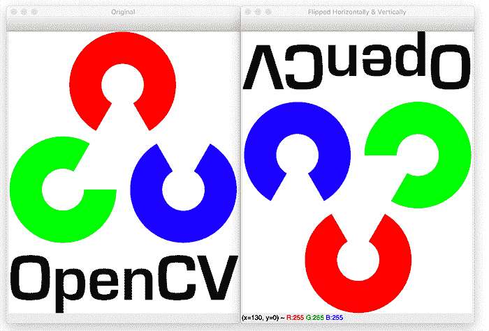

# OpenCV 翻转图像(cv2.flip)

> 原文：<https://pyimagesearch.com/2021/01/20/opencv-flip-image-cv2-flip/>

在本教程中，您将学习如何使用 OpenCV 和`cv2.flip`函数翻转图像。



与[图像旋转](https://pyimagesearch.com/2021/01/20/opencv-rotate-image/)类似，OpenCV 也提供了沿 *x-* 或 *y* 轴翻转图像的方法。尽管翻转操作用得不多了，但它们仍然很有学习价值——原因你可能不会马上想到。

例如，让我们想象一下，为一家小型创业公司工作，该公司希望建立一个机器学习分类器来检测图像中的人脸。我们需要一个样本人脸的数据集，我们的算法可以用它来“学习”什么是人脸。但不幸的是，该公司只为我们提供了 20 张人脸的微小数据集，我们没有获得更多数据的手段。

那我们该怎么办？

我们应用翻转操作来扩充我们的数据集！

我们可以水平翻转每个人脸图像(因为人脸仍然是人脸，无论是否镜像)，并使用这些镜像版本作为附加的训练数据。

虽然这个例子听起来很傻很做作，但事实并非如此。强大的、数据饥渴的深度学习算法故意在训练时间使用翻转来生成额外的数据(通过一种叫做[数据增强](https://pyimagesearch.com/2019/07/08/keras-imagedatagenerator-and-data-augmentation/)的技术)。

所以，如你所见，你在这里学习的图像处理技术真的是大型计算机视觉系统的基础！

**要学习如何用 OpenCV 和`cv2.flip`，*翻转图像，只要继续阅读。***

## **OpenCV 翻转图像(`cv2.flip` )**

在本教程的第一部分，我们将讨论什么是图像翻转，以及 OpenCV 如何帮助我们翻转图像。

从那里，我们将配置我们的开发环境，并审查我们的项目目录结构。

然后，我们将实现一个 Python 脚本来使用 OpenCV 执行图像翻转。

### **什么是图像翻转？**

我们可以围绕*x*-轴、*y*-轴翻转图像，或者两者都翻转。

通过在启动代码之前查看图像翻转的输出，可以更好地解释图像翻转。查看**图 1** 以查看水平翻转的图像:

注意左边的*，*是我们的原始图像，右边的*，*是水平镜像的图像。

我们可以垂直地做同样的事情:

我们还可以结合水平和垂直翻转:

在本教程的后面，您将发现如何使用 OpenCV 执行这些图像翻转操作。

### **配置您的开发环境**

要遵循这个指南，您需要在您的系统上安装 OpenCV 库。

幸运的是，OpenCV 可以通过 pip 安装:

```py
$ pip install opencv-contrib-python
```

**如果你需要帮助为 OpenCV 配置开发环境，我*强烈推荐*阅读我的** [***pip 安装 OpenCV* 指南**](https://pyimagesearch.com/2018/09/19/pip-install-opencv/)——它将在几分钟内让你启动并运行。

### **在配置开发环境时遇到了问题？**

说了这么多，你是:

*   时间紧迫？
*   了解你雇主的行政锁定系统？
*   想要跳过与命令行、包管理器和虚拟环境斗争的麻烦吗？
*   准备好在您的 Windows、macOS 或 Linux 系统上运行代码*了吗*？

那今天就加入 [PyImageSearch 加](https://pyimagesearch.com/pyimagesearch-plus/)吧！

**获得本教程的 Jupyter 笔记本和其他 PyImageSearch 指南，这些指南已经过*预配置*，可以在您的网络浏览器中运行在 Google Colab 的生态系统上！**无需安装。

最棒的是，这些 Jupyter 笔记本可以在 Windows、macOS 和 Linux 上运行！

### **项目结构**

在回顾任何使用 OpenCV 剪辑图像的代码之前，让我们先回顾一下我们的项目目录结构。

请务必访问本教程的 ***“下载”*** 部分，以检索源代码和示例图像。

从那里，看一眼您的项目文件夹:

```py
$ tree . --dirsfirst
.
├── opencv_flip.py
└── opencv_logo.png

0 directories, 2 files
```

我们的`opencv_flip.py`脚本将从磁盘加载`opencv_logo.png`图像，然后演示如何使用`cv2.flip`函数翻转图像。

### **用 OpenCV 实现图像翻转**

我们要探索的下一个图像转换是翻转。我们可以绕着 *x-* 或 *y* 轴翻转图像，或者两者都翻转。

在我们进入代码之前，通过查看图像翻转的输出可以更好地解释翻转图像。查看**图 5** 查看水平翻转的图像:

现在您已经看到了图像翻转的样子，我们可以研究代码了:

```py
# import the necessary packages
import argparse
import cv2

# construct the argument parser and parse the arguments
ap = argparse.ArgumentParser()
ap.add_argument("-i", "--image", type=str, default="opencv_logo.png",
	help="path to the input image")
args = vars(ap.parse_args())
```

**第 2 行和第 3 行**导入我们需要的 Python 包，而**第 6-9 行**解析我们的命令行参数。

这里我们只需要一个参数，`--image`，它是我们想要翻转的输入图像的路径。我们将这个值默认为项目目录中的`opencv_logo.png`图像。

现在让我们水平翻转图像:

```py
# load the original input image and display it to our screen
image = cv2.imread(args["image"])
cv2.imshow("Original", image)

# flip the image horizontally
print("[INFO] flipping image horizontally...")
flipped = cv2.flip(image, 1)
cv2.imshow("Flipped Horizontally", flipped)
```

我们从第**行的第 12 行和第 13 行**开始，从磁盘加载我们的输入图像，并将其显示到我们的屏幕上。

水平翻转图像是通过调用**行 17** 上的`cv2.flip`函数来完成的，其输出如图**图 5** 所示。

`cv2.flip`方法需要两个参数:我们想要翻转的`image`和用于确定如何翻转图像的特定代码/标志。

使用翻转代码值`1`表示我们围绕 *y* 轴水平翻转图像。

指定翻转代码`0`表示我们想要围绕 *x* 轴垂直翻转图像:

```py
# flip the image vertically
flipped = cv2.flip(image, 0)
print("[INFO] flipping image vertically...")
cv2.imshow("Flipped Vertically", flipped)
```

**图 6** 显示垂直翻转图像的输出:

最后，使用负翻转代码围绕两个轴翻转图像。

```py
# flip the image along both axes
flipped = cv2.flip(image, -1)
print("[INFO] flipping image horizontally and vertically...")
cv2.imshow("Flipped Horizontally & Vertically", flipped)
cv2.waitKey(0)
```

在这里，您可以看到我们的图像水平和垂直翻转:

翻转图像非常简单——可能是本系列中最简单的例子之一！

### **OpenCV 图像翻转结果**

要使用 OpenCV 翻转图像，请务必访问本教程的 ***“下载”*** 部分，以检索源代码和示例图像。

从那里，打开一个 shell 并执行以下命令:

```py
$ python opencv_flip.py 
[INFO] flipping image horizontally...
[INFO] flipping image vertically...
[INFO] flipping image horizontally and vertically...
```

您的 OpenCV 翻转结果应该与我在上一节中的结果相匹配。

## **总结**

在本教程中，您学习了如何使用 OpenCV 和`cv2.flip`函数水平和垂直翻转图像。

不可否认，图像翻转是我们讨论过的最简单的图像处理概念之一。然而，仅仅因为一个概念很简单并不意味着它没有更强大的用途。

正如我在本教程的介绍中提到的，翻转被一致地用于机器学习/深度学习中，以生成更多的训练数据样本，从而创建更强大和鲁棒的图像分类器。

**要下载这篇文章的源代码(并在未来教程在 PyImageSearch 上发布时得到通知)，*只需在下面的表格中输入您的电子邮件地址！***