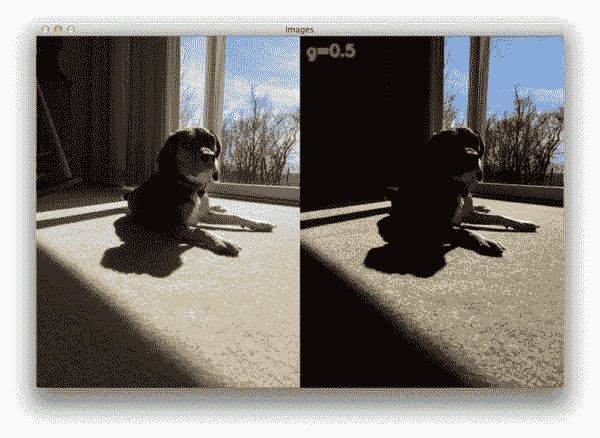
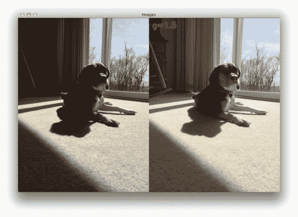
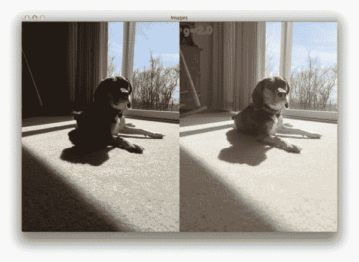
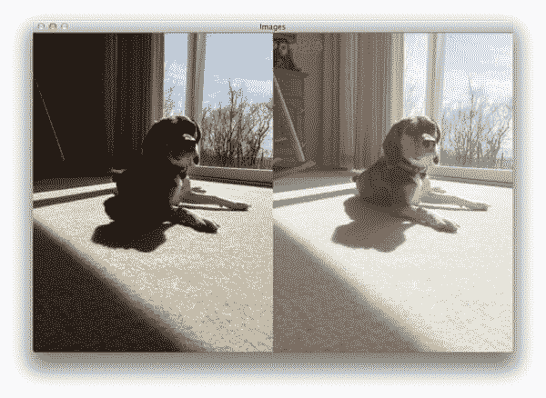
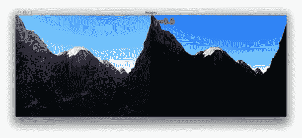
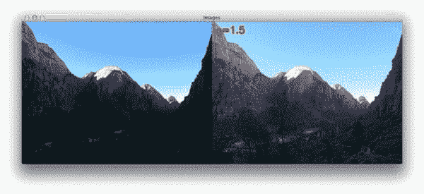
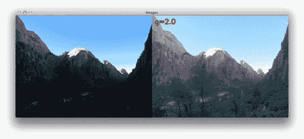

# OpenCV 伽马校正

> 原文：<https://pyimagesearch.com/2015/10/05/opencv-gamma-correction/>

您知道人眼感知颜色和亮度的方式与智能手机或数码相机上的传感器不同吗？

你看，当*两倍于*的光子数击中数码相机的传感器时，它就接收到*两倍于*的信号(呈线性关系)。然而，这不是我们人类眼睛的工作方式。相反，我们认为*加倍的光量*只是*的一小部分*更亮(一种非线性关系)！此外，我们的眼睛对暗色调的变化也比亮色调更敏感(另一种非线性关系)。

为了说明这一点，我们可以应用*伽马校正*，这是我们的眼睛和相机传感器的灵敏度之间的转换。

在这篇文章的剩余部分，我将演示如何使用 Python 和 OpenCV 实现一个超级快速、非常简单的伽马校正函数。

## 伽马校正和幂律变换

伽马校正也称为*幂律变换。*首先，我们的图像像素强度必须从范围*【0，255】*缩放到*【0，1.0】*。从那里，我们通过应用下面的等式获得我们的输出伽马校正图像:

*O = I ^ (1 / G)*

其中 *I* 是我们的输入图像， *G* 是我们的伽马值。然后，输出图像 *O* 被缩放回范围*【0，255】*。

伽马值 *< 1* 将使图像向光谱的较暗一端移动，而伽马值 *> 1* 将使图像看起来较亮。 *G=1* 的伽马值对输入图像没有影响:

## OpenCV 伽马校正

现在我们了解了什么是伽马校正，让我们使用 OpenCV 和 Python 来实现它。打开一个新文件，命名为`adjust_gamma.py`，然后我们开始:

```py
# import the necessary packages
from __future__ import print_function
import numpy as np
import argparse
import cv2

def adjust_gamma(image, gamma=1.0):
	# build a lookup table mapping the pixel values [0, 255] to
	# their adjusted gamma values
	invGamma = 1.0 / gamma
	table = np.array([((i / 255.0) ** invGamma) * 255
		for i in np.arange(0, 256)]).astype("uint8")

	# apply gamma correction using the lookup table
	return cv2.LUT(image, table)

```

**第 2-5 行**简单导入我们必要的包，这里没什么特别的。

我们在第 7 行的**上定义我们的`adjust_gamma`函数。该方法需要一个参数`image`，这是我们想要对其应用伽马校正的图像。第二个(可选)值是我们的`gamma`值。在这种情况下，我们默认使用`gamma=1.0`，但是您应该提供任何必要的值来获得看起来不错的校正图像。**

使用 OpenCV 和 Python 有两种(简单的)方法来应用伽马校正。第一种方法是简单地利用 Python + OpenCV 将图像表示为 NumPy 数组这一事实。我们需要做的就是将像素亮度缩放到范围*【0，1.0】*，应用变换，然后缩放回范围*【0，255】*。总的来说，NumPy 方法包括除法、乘幂，然后是乘法——这往往非常快，因为所有这些运算都是矢量化的。

然而，由于 OpenCV，有一种更快的方式来执行伽马校正。我们需要做的就是建立一个表(即字典)，将*输入像素值*映射到*输出伽马校正值*。OpenCV 然后可以获取这个表，并在 *O(1)* 时间内快速确定给定像素的输出值。

例如，以下是`gamma=1.2`的示例查找表:

```py
0 => 0
1 => 2
2 => 4
3 => 6
4 => 7
5 => 9
6 => 11
7 => 12
8 => 14
9 => 15
10 => 17

```

*左栏*是应用幂律变换后的**输入像素值**，而*右栏*是**输出像素值**。

**第 11 行和第 12 行**通过循环范围*【0，255】*内的所有像素值来构建这个查找表。像素值随后被缩放到范围 *[0，1.0]* ，随后被提升到反伽马的幂——该值随后被存储在`table`中。

最后，我们需要做的就是应用`cv2.LUT`函数(**第 15 行**)获取输入`image`和`table`，并为每个像素值找到正确的映射——这是一个简单(但非常快速)的操作！

让我们继续我们的例子:

```py
# construct the argument parse and parse the arguments
ap = argparse.ArgumentParser()
ap.add_argument("-i", "--image", required=True,
	help="path to input image")
args = vars(ap.parse_args())

# load the original image
original = cv2.imread(args["image"])

```

**第 17-21 行**处理解析命令行参数。这里我们只需要一个开关`--image`，它是我们的输入图像在磁盘上驻留的路径。**第 24 行**获取我们图像的路径并加载它。

让我们通过使用各种伽马值并检查每个值的输出图像来探索伽马校正:

```py
# loop over various values of gamma
for gamma in np.arange(0.0, 3.5, 0.5):
	# ignore when gamma is 1 (there will be no change to the image)
	if gamma == 1:
		continue

	# apply gamma correction and show the images
	gamma = gamma if gamma > 0 else 0.1
	adjusted = adjust_gamma(original, gamma=gamma)
	cv2.putText(adjusted, "g={}".format(gamma), (10, 30),
		cv2.FONT_HERSHEY_SIMPLEX, 0.8, (0, 0, 255), 3)
	cv2.imshow("Images", np.hstack([original, adjusted]))
	cv2.waitKey(0)

```

在**的第 27 行**上，我们开始遍历*【0，3.0】*范围内的`gamma`值(`np.arange`函数是*不包含*)，每一步递增 *0.5* 。

在我们的`gamma`值是 *1.0* 的情况下，我们简单地忽略它(**第 29 和 30 行**)，因为`gamma=1.0`不会改变我们的输入图像。

从那里，**第 33-38 行**对我们的图像进行伽马校正，并显示输出结果。

要查看 gamma 校正的效果，只需打开一个终端并执行以下命令:

```py
$ python adjust_gamma.py --image example_01.png

```

[](https://pyimagesearch.com/wp-content/uploads/2015/09/gamma_correction_example_01_g05.jpg)

**Figure 2:** When applying gamma correction with *G < 1*, the output image is will darker than the original input image.

请注意`gamma=0.5`经过伽马校正的图像*(右)*比已经相当暗的输入图像*(左)*暗得多——我们在原始图像中几乎看不到狗脸的任何细节，更不用说经过伽马校正的版本了！

然而，在`gamma=1.5`处，图像开始变亮，我们可以看到更多细节:

[](https://pyimagesearch.com/wp-content/uploads/2015/09/gamma_correction_example_01_g15.jpg)

**Figure 3:** As the gamma value reaches 1.0 and starts to exceed it, the image lightens up and we can see more detail.

当我们到达`gamma=2.0`时，图像中的细节完全可见。

[](https://pyimagesearch.com/wp-content/uploads/2015/09/gamma_correction_example_01_g20.jpg)

**Figure 4:** Now at *gamma=2.0*, we can fully see the details on the dogs face.

虽然在`gamma=2.5`，图像开始出现“褪色”:

[](https://pyimagesearch.com/wp-content/uploads/2015/09/gamma_correction_example_01_g25.jpg)

**Figure 5:** However, if we carry gamma correction too far, the image will start to appear washed out.

让我们试试另一个图像:

```py
$ python adjust_gamma.py --image example_02.png

```

[](https://pyimagesearch.com/wp-content/uploads/2015/09/gamma_correction_example_02_g05.jpg)

**Figure 6:** After applying gamma correction with *gamma=0.5*, we cannot see any detail in this image.

就像在`example_01.png`中一样， *0.5* 的灰度值会使输入图像看起来比实际更暗。除了天空和看起来像是山脉的东西，我们真的看不清这张照片的任何细节。

然而，当我们使用`gamma=1.5`进行伽马校正时，情况发生了变化:

[](https://pyimagesearch.com/wp-content/uploads/2015/09/gamma_correction_example_02_g15.jpg)

**Figure 7:** Optimal results are obtained near *gamma=1.5*.

现在我们可以看到图像变得更亮了——我们甚至可以开始看到前景中有树，这从左边*的原始输入图像中并不完全明显。*

在`gamma=2.0`处，图像开始出现褪色，但是原始图像和伽马校正图像之间的差异仍然相当大:

[](https://pyimagesearch.com/wp-content/uploads/2015/09/gamma_correction_example_02_g20.jpg)

**Figure 8:** But again, we can carry gamma correction too far and washout our image.

## 摘要

在这篇博文中，我们了解了*伽马校正*，也称为*幂律变换。*然后，我们使用 Python 和 OpenCV 实现了伽马校正。

我们应用伽马校正的原因是因为我们的眼睛感知颜色和亮度与数码相机中的传感器不同。当数码相机上的传感器捕捉到两倍于光子数量的信号时，信号就会变成两倍的 T2 信号。然而，我们的眼睛不是这样工作的。相反，我们的眼睛感知到的*光量是原来的两倍，而仅仅是一小部分*光变亮了。因此，当数码相机在亮度之间具有线性关系时，我们的眼睛具有非线性关系。为了说明这种关系，我们应用伽马校正。**

请务必下载这篇文章的代码，并尝试将伽玛校正应用到您自己的照片。试着浏览你的照片集，找到那些要么*过暗*要么*非常亮* *然后褪色*的照片。然后对这些图像进行伽玛校正，看看它们是否变得更具视觉吸引力。