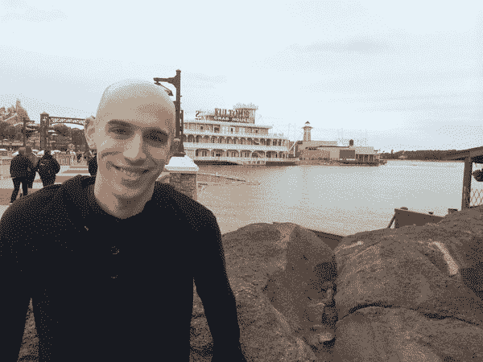
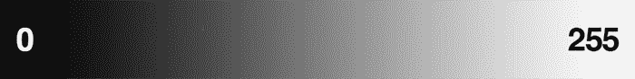
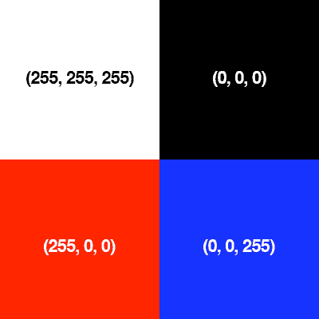
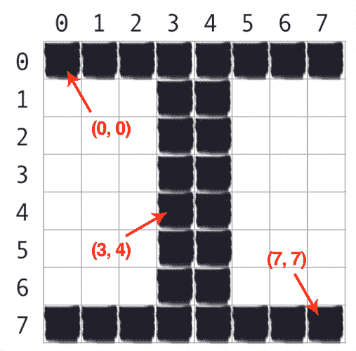
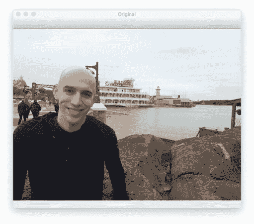
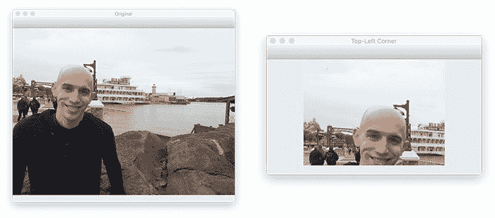
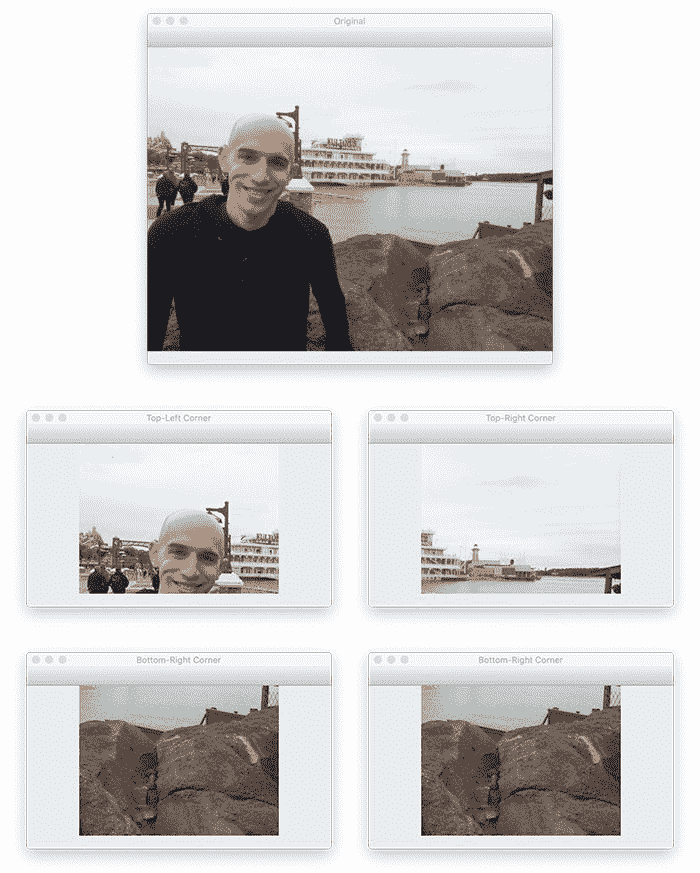
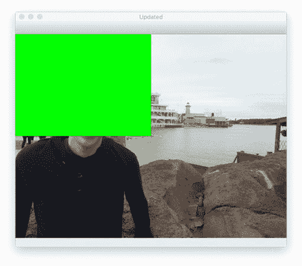

# OpenCV 获取和设置像素

> 原文：<https://pyimagesearch.com/2021/01/20/opencv-getting-and-setting-pixels/>

在本教程中，您将学习如何使用 OpenCV 和 Python 获取和设置像素值。


您还将了解到:

*   什么是像素
*   OpenCV 中图像坐标系的工作原理
*   如何访问/获取图像中的单个像素值
*   如何设置/更新图像中的像素
*   如何使用数组切片来抓取图像区域

在本教程结束时，您将对如何使用 OpenCV 访问和操作图像中的像素有很深的理解。

**要学习如何用 OpenCV 获取和设置像素，*继续阅读。***

## **OpenCV 获取和设置像素**

在本教程的第一部分，你会发现什么是像素(即，图像的建筑块)。我们还将回顾 OpenCV 中的图像坐标系，包括访问单个像素值的正确符号。

从那里，我们将配置我们的开发环境，并审查我们的项目目录结构。

回顾了我们的项目目录结构后，我们将实现一个 Python 脚本，`opencv_getting_setting.py`。顾名思义，这允许我们使用 OpenCV 访问和操作像素。

我们将讨论我们的结果来结束本教程。

我们开始吧！

### **什么是像素？**

像素是图像的原始构件。每个图像都由一组像素组成。没有比像素更精细的粒度了。

通常，像素被认为是出现在我们图像中给定位置的光的“颜色”或“强度”。

如果我们把一幅图像想象成一个网格，网格中的每个方块包含一个像素。让我们来看看**图 1** 中的示例图像:



**Figure 1:** This image is 600 pixels wide and 450 pixels tall for a total of *600 x 450 = 270,000* pixels.

大多数像素以两种方式表示:

1.  灰度/单通道
2.  颜色

在灰度图像中，每个像素的值在 0 到 255 之间，其中 0 对应“黑色”，255 对应“白色”0 到 255 之间的值是不同的灰度，越接近 0 的值越暗，越接近 255 的值越亮:



**Figure 2:** Image gradient demonstrating pixel values going from black (0) to white (255).

图 2 中**的灰度梯度图像展示了左手边的*较暗像素*和右手边逐渐变亮的*像素*。**

然而，彩色像素通常在 RGB 颜色空间中表示——一个值用于红色分量，一个值用于绿色分量，一个值用于蓝色分量，导致每个像素总共有 *3 个值:*


**Figure 3:** The RGB cube.

存在其他颜色空间(HSV(色调、饱和度、值)、L*a*b*等。)，但是让我们从基础开始，从那里开始向上移动。

红、绿、蓝三种颜色中的每一种都由一个从 0 到 255 范围内的整数表示，这表示颜色的“多少”。假设像素值只需要在范围*【0，255】，*内，我们通常使用 8 位无符号整数来表示每个颜色强度。

然后，我们将这些值组合成一个格式为`(red, green, blue)`的 RGB 元组。这个元组代表我们的颜色。

为了构造一个白色，我们将完全填充红色、绿色和蓝色的桶，就像这样:`(255, 255, 255)` —因为白色代表所有的颜色。

然后，为了创建黑色，我们将完全清空每个桶:`(0, 0, 0)`——因为黑色是没有颜色的。

为了创建一个纯粹的红色，我们将完全填充红色桶(只有红色桶):`(255, 0, 0)`。

你开始看出规律了吗？

请看下图，让这个概念更加清晰:



**Figure 4:** Here, we have four examples of colors and the “bucket” amounts for each of the Red, Green, and Blue components, respectively.

在*左上角*的例子中，我们有颜色*白色*——红色、绿色和蓝色的桶都被完全填满，形成白色。

在右上角的*，*我们有黑色——红色、绿色和蓝色的桶现在完全空了。

类似地，为了在左下方的*中形成红色，我们简单地完全填充红色桶，让其他绿色和蓝色桶完全空着。*

最后，蓝色是通过仅填充蓝色桶形成的，如右下方的*所示。*

以下是一些以 RGB 元组表示的常见颜色，供您参考:

*   **黑色:** `(0, 0, 0)`
*   **白色:** `(255, 255, 255)`
*   **红色:** `(255, 0, 0)`
*   **绿色:** `(0, 255, 0)`
*   **蓝色:** `(0, 0, 255)`
*   **阿卡:** `(0, 255, 255)`
*   **紫红色:** `(255, 0, 255)`
*   **栗色:** `(128, 0, 0)`
*   **海军:** `(0, 0, 128)`
*   **橄榄:** `(128, 128, 0)`
*   **紫色:** `(128, 0, 128)`
*   **缇尔:** `(0, 128, 128)`
*   **黄色:** `(255, 255, 0)`

现在我们对像素有了很好的理解，让我们快速回顾一下坐标系。

### **OpenCV 中图像坐标系概述**

正如我在**图 1** 中提到的，图像被表示为像素网格。把我们的网格想象成一张绘图纸。**使用这张图纸，点 *(0，0)* 对应于图像左上角的*(即*原点*)。****当我们向下*移动*并向右*移动*时， *x* 和 *y* 的值都会增加。*

 *让我们看一下图 5 中的图像，以便更清楚地说明这一点:



**Figure 5:** In OpenCV, pixels are accessed by their *(x, y)*-coordinates. The origin, *(0, 0)*, is located at the *top-left* of the image. OpenCV images are zero-indexed, where the *x-*values go *left-to-right* (column number) and *y*-values go *top-to-bottom* (row number).

这里，我们在一张图表纸上有字母“I”。我们看到我们有一个总共 64 个像素的 *8 x 8* 网格。

位于 *(0，0)* 的点对应于我们图像中左上角的*像素，而点 *(7，7)* 对应于右下角的*。**

 **需要注意的是，我们是从*零*开始计数，而不是从*一开始计数。*Python 语言是零索引的，意思是我们总是从零开始计数。记住这一点，你会在以后避免很多困惑。

最后，向右*的第 4 列*和向下*的第 5 行*的像素由点 *(3，4)* 索引，记住我们是从零开始计数而不是从一开始计数*。*

### **配置您的开发环境**

要遵循这个指南，您需要在您的系统上安装 OpenCV 库。

幸运的是，OpenCV 可以通过 pip 安装:

```py
$ pip install opencv-contrib-python
```

**如果你需要帮助为 OpenCV 配置开发环境，我*强烈推荐*阅读我的** [***pip 安装 OpenCV* 指南**](https://pyimagesearch.com/2018/09/19/pip-install-opencv/)——它将在几分钟内让你启动并运行。

### **在配置开发环境时遇到了问题？**

[](https://pyimagesearch.com/pyimagesearch-plus/)

**Figure 6:** Having trouble configuring your development environment? Want access to pre-configured Jupyter Notebooks running on Google Colab? Be sure to join [PyImageSearch Plus](https://pyimagesearch.com/pyimagesearch-plus/) — you will be up and running with this tutorial in a matter of minutes.

说了这么多，你是:

*   时间紧迫？
*   了解你雇主的行政锁定系统？
*   想要跳过与命令行、包管理器和虚拟环境斗争的麻烦吗？
*   **准备好在您的 Windows、macOS 或 Linux 系统上运行代码*****？***

 *那今天就加入 [PyImageSearch 加](https://pyimagesearch.com/pyimagesearch-plus/)吧！

**获得本教程的 Jupyter 笔记本和其他 PyImageSearch 指南，这些指南已经过*预配置*，可以在您的网络浏览器中运行在 Google Colab 的生态系统上！**无需安装。

最棒的是，这些 Jupyter 笔记本可以在 Windows、macOS 和 Linux 上运行！

### **项目结构**

在我们开始看代码之前，让我们回顾一下我们的项目目录结构:

```py
$ tree . --dirsfirst
.
├── adrian.png
└── opencv_getting_setting.py

0 directories, 2 files
```

我们今天要回顾一个 Python 脚本`opencv_getting_setting.py`，它将允许我们访问和操作来自图像`adrian.png`的图像像素。

### **用 OpenCV 获取和设置像素**

让我们来学习如何用 OpenCV 获取和设置像素。

打开项目目录结构中的`opencv_getting_setting.py`文件，让我们开始工作:

```py
# import the necessary packages
import argparse
import cv2

# construct the argument parser and parse the arguments
ap = argparse.ArgumentParser()
ap.add_argument("-i", "--image", type=str, default="adrian.png",
	help="path to the input image")
args = vars(ap.parse_args())
```

**2 号线和 3 号线**导入我们需要的 Python 包。对于 OpenCV 绑定，我们只需要`argparse`作为命令行参数`cv2`。

`--image`命令行参数指向我们想要操作的驻留在磁盘上的图像。默认情况下，`--image`命令行参数被设置为`adrian.png`。

接下来，让我们加载这个图像并开始访问像素值:

```py
# load the image, grab its spatial dimensions (width and height),
# and then display the original image to our screen
image = cv2.imread(args["image"])
(h, w) = image.shape[:2]
cv2.imshow("Original", image)
```

**第 13-15 行**从磁盘加载我们的输入`image`，获取它的宽度和高度，并将图像显示到我们的屏幕:



**Figure 7:** Loading our input image from disk and displaying it with OpenCV.

OpenCV 中的图像由 NumPy 数组表示。要访问一个特定的图像像素，我们需要做的就是将 *(x，y)* 坐标作为`image[y, x]`:

```py
# images are simply NumPy arrays -- with the origin (0, 0) located at
# the top-left of the image
(b, g, r) = image[0, 0]
print("Pixel at (0, 0) - Red: {}, Green: {}, Blue: {}".format(r, g, b))

# access the pixel located at x=50, y=20
(b, g, r) = image[20, 50]
print("Pixel at (50, 20) - Red: {}, Green: {}, Blue: {}".format(r, g, b))

# update the pixel at (50, 20) and set it to red
image[20, 50] = (0, 0, 255)
(b, g, r) = image[20, 50]
print("Pixel at (50, 20) - Red: {}, Green: {}, Blue: {}".format(r, g, b))
```

**第 19 行**访问位于 *(0，0)* 的像素，即图像左上角的*。作为回报，我们依次接收蓝色、绿色和红色强度(BGR)。*

 *最大的问题是:

> *为什么 OpenCV 在 BGR 通道排序中表示图像，而不是标准的 RGB？*

答案是，当 OpenCV 最初被开发时，BGR 订购的*是*的标准！后来才采用 RGB 顺序。BGR 排序是 OpenCV 中的标准，所以习惯于看到它。

**行 23** 然后使用`image[20, 50]`的数组索引访问位于 *x = 50* ， *y = 20* 的像素。

但是等等。。。那不是落后吗？既然 *x = 50* 和 *y = 20* 不应该改为`image[50, 20]`吗？

没那么快！

让我们后退一步，认为一个图像只是一个具有宽度(列数)和高度(行数)的矩阵。如果我们要访问矩阵中的一个单独的位置，我们将把它表示为`x`值(列号)和`y`值(行号)。

因此，要访问位于 *x = 50* ， *y = 20* 的像素，首先传递*y*-值(行号)，然后传递*x*-值(列号)，结果是`image[y, x]`。

***注:*** *我发现用`image[y, x]`的语法访问单个像素的概念是很多学生犯的错误。花点时间说服自己`image[y, x]`是正确的语法，因为 x 值是你的列号(即宽度)，y 值是你的行号(即高度)。*

**第 27 行和第 28 行**更新位于 *x = 50* ， *y = 20* 的像素，设置为红色，在 BGR 排序中为`(0, 0, 255)`。**第 29 行**然后将更新后的像素值打印到我们的终端，从而表明它已经被更新。

接下来，让我们学习如何使用 NumPy 数组切片从图像中获取感兴趣的大块/区域:

```py
# compute the center of the image, which is simply the width and height
# divided by two
(cX, cY) = (w // 2, h // 2)

# since we are using NumPy arrays, we can apply array slicing to grab
# large chunks/regions of interest from the image -- here we grab the
# top-left corner of the image
tl = image[0:cY, 0:cX]
cv2.imshow("Top-Left Corner", tl)
```

在**第 33 行，**我们计算图像的中心 *(x，y)*-坐标。这是通过简单地将宽度和高度除以 2 来实现的，确保整数转换(因为我们不能访问“分数像素”位置)。

然后，在**第 38 行，**我们使用简单的 NumPy 数组切片来提取图像的`[0, cX)`和`[0, cY)`区域。事实上，这个区域对应于图像左上角的*！为了抓取图像的大块，NumPy 希望我们提供四个索引:*

 **   **起始 *y* :** 第一个值是起始 *y* 坐标。这是我们的数组切片沿着 *y* 轴开始的地方。在上面的例子中，我们的切片从 *y = 0* 开始。
*   **结束 *y* :** 正如我们提供了一个起始 *y* 值一样，我们必须提供一个结束 *y* 值。当 *y = cY* 时，我们的切片沿 *y* 轴停止。
*   **起始 *x* :** 我们必须提供的第三个值是切片的起始*x*-坐标。为了抓取图像左上角的*区域，我们从 *x = 0* 开始。*
*   **End *x* :** 最后，我们需要提供 *x* 轴的值，让我们的切片停止。当 *x = cX* 时我们停止。

一旦我们提取了图像左上角的*，**行 39** 显示了裁剪结果。请注意，我们的图像只是原始图像左上角的*:**

**

**Figure 8:** Extracting the *top-left* corner of the image using array slicing.

让我们进一步扩展这个例子，这样我们就可以练习使用 NumPy 数组切片从图像中提取区域:

```py
# in a similar fashion, we can crop the top-right, bottom-right, and
# bottom-left corners of the image and then display them to our
# screen
tr = image[0:cY, cX:w]
br = image[cY:h, cX:w]
bl = image[cY:h, 0:cX]
cv2.imshow("Top-Right Corner", tr)
cv2.imshow("Bottom-Right Corner", br)
cv2.imshow("Bottom-Left Corner", bl)
```

与上面的例子类似，**行 44** 提取图像右上角*，**行 45** 提取右下角，**行 46** 左下角*。**

 **最后，图像的所有四个角都显示在屏幕上的第 47-49 行上，就像这样:



**Figure 9:** Using array slicing to extract the four corners of an image with OpenCV.

理解 NumPy 数组切片是一项非常重要的技能，作为一名计算机视觉从业者，您将会反复使用这项技能。如果你不熟悉 NumPy 数组切片，我建议你花几分钟时间阅读一下关于 NumPy 索引、数组和切片的基础知识。

我们要做的最后一项任务是使用数组切片来改变像素区域的颜色:

```py
# set the top-left corner of the original image to be green
image[0:cY, 0:cX] = (0, 255, 0)

# Show our updated image
cv2.imshow("Updated", image)
cv2.waitKey(0)
```

在第 52 行的**上，你可以看到我们再次访问图像左上角的*；但是，这一次，我们将这个区域的值设置为`(0, 255, 0)`(绿色)。***

 *第 55 行和第 56 行显示了我们工作的结果:



**Figure 10:** Setting the *top-left* corner of the image to be “green.”

### **OpenCV 像素获取和设置结果**

现在让我们学习如何使用 OpenCV 获取和设置单个像素值！

确保您已经使用了本教程的 ***【下载】*** 部分来访问源代码和示例图像。

从那里，您可以执行以下命令:

```py
$ python opencv_getting_setting.py --image adrian.png 
Pixel at (0, 0) - Red: 233, Green: 240, Blue: 246 
Pixel at (50, 20) - Red: 229, Green: 238, Blue: 245 
Pixel at (50, 20) - Red: 255, Green: 0, Blue: 0
```

一旦我们的脚本开始运行，您应该看到一些输出打印到您的控制台。

第一行输出告诉我们，位于 *(0，0)* 的像素的值为 *R = 233* 、 *G = 240* 、 *B = 246* 。所有三个通道的桶几乎都是白色的，表明像素非常亮。

接下来的两行输出显示，我们已经成功地将位于 *(50，20)* 的像素更改为红色，而不是(几乎)白色。

您可以参考*“使用 OpenCV 获取和设置像素”*部分的图像和截图，了解我们图像处理流程中每个步骤的图像可视化。

## **总结**

在本教程中，您学习了如何使用 OpenCV 获取和设置像素值。

您还了解了像素(图像的构建块)以及 OpenCV 使用的图像坐标系。

不像你在基础代数中学习的坐标系，原点表示为 *(0，0)* ，在*左下角*，图像的原点实际上位于图像左上角*。*

 *随着`x`-值的增加，我们进一步向图像的右侧*移动*。随着`y`-值的增加，我们进一步*向下*图像。

**要下载这篇文章的源代码(并在未来教程在 PyImageSearch 上发布时得到通知)，*只需在下面的表格中输入您的电子邮件地址！***************