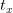
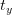
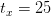
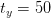
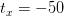
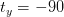

# OpenCV 图像翻译

> 原文：<https://pyimagesearch.com/2021/02/03/opencv-image-translation/>

在本教程中，您将学习如何使用 OpenCV 翻译和移动图像。

平移是图像沿着 *x-* 和 *y-* 轴的移动。要使用 OpenCV 翻译图像，我们必须:

1.  从磁盘加载图像
2.  定义仿射变换矩阵
3.  应用`cv2.warpAffine`功能执行翻译

这听起来像是一个复杂的过程，但是正如您将看到的，*只用两行代码就可以完成！*

**要学习如何用 OpenCV 翻译图像，*继续阅读。***

## **OpenCV 图片翻译**

在本教程的第一部分，我们将讨论什么是翻译矩阵，以及如何使用 OpenCV 和 NumPy 定义它。

从那里，我们将配置我们的开发环境，并审查我们的项目目录结构。

回顾了我们的项目目录结构后，我们将继续实现一个 Python 脚本来使用 OpenCV 执行翻译。

我们将详细回顾这个脚本，以及脚本生成的结果。

本指南结束时，您将了解如何使用 OpenCV 执行图像翻译。

### **用 OpenCV 定义翻译矩阵**

为了用 OpenCV 执行图像转换，我们首先需要定义一个称为**仿射变换矩阵的 *2 x 3* 矩阵:**

出于翻译的目的，我们只关心

and values:

*   值为负值会将图像移动到*左侧*
*   的正值将图像向右移动
*   *负值为将图像*上移**
*   *的正值会将图像*下移**

 *例如，假设我们想将一幅图像向右*移动 25 像素*，向下移动 50 像素*。我们的转换矩阵如下所示(实现为 NumPy 数组):*

```py
M = np.float32([
	[1, 0, 25],
	[0, 1, 50]
])
```

现在，如果我们想将一幅图像向左*移动 7 个像素*并向上*移动 23 个像素*，我们的平移矩阵将如下所示:

```py
M = np.float32([
	[1, 0, -7],
	[0, 1, -23]
])
```

作为最后一个例子，假设我们想把我们的图像向左*平移 30 像素*，向下*平移 12 像素*:

```py
M = np.float32([
	[1, 0, -30],
	[0, 1, 12]
])
```

正如你所看到的，定义图像平移的仿射变换矩阵非常简单！

一旦定义了变换矩阵，我们就可以使用`cv2.warpAffine`函数简单地执行图像转换，就像这样:

```py
shifted = cv2.warpAffine(image, M, (image.shape[1], image.shape[0]))
```

在本指南的后面，我们将看到一个定义图像转换矩阵和应用`cv2.warpAffine`函数的完整例子。

### **配置您的开发环境**

为了遵循本指南，您需要在您的系统上安装 OpenCV 库。

幸运的是，OpenCV 可以通过 pip 安装:

```py
$ pip install opencv-contrib-python
```

**如果你需要帮助为 OpenCV 配置开发环境，我*强烈推荐*阅读我的** [***pip 安装 OpenCV* 指南**](https://pyimagesearch.com/2018/09/19/pip-install-opencv/)——它将在几分钟内让你启动并运行。

### **在配置开发环境时遇到了问题？**

说了这么多，你是:

*   时间紧迫？
*   了解你雇主的行政锁定系统？
*   想要跳过与命令行、包管理器和虚拟环境斗争的麻烦吗？
*   **准备好在您的 Windows、macOS 或 Linux 系统上运行代码*****？***

 *那今天就加入 [PyImageSearch 加](https://pyimagesearch.com/pyimagesearch-plus/)吧！

**获得本教程的 Jupyter 笔记本和其他 PyImageSearch 指南，这些指南已经过*预配置*，可以在您的网络浏览器中运行在 Google Colab 的生态系统上！**无需安装。

最棒的是，这些 Jupyter 笔记本可以在 Windows、macOS 和 Linux 上运行！

### **项目结构**

在我们使用 OpenCV 执行图像翻译之前，让我们首先回顾一下我们的项目目录结构:

```py
$ tree . --dirsfirst
.
├── opencv_logo.png
└── opencv_translate.py

0 directories, 2 files
```

我们有一个单独的 Python 脚本`opencv_translate.py`，我们将详细讨论它。

该脚本将从磁盘加载`opencv_logo.png`图像，然后使用 OpenCV 库对其进行翻译/转换。

### **使用 OpenCV 进行图像翻译**

平移是图像沿着 *x-* 和 *y-* 轴的移动。使用平移，我们可以将图像*向上*、*向下*、*向左*或*向右*，以及以上任意组合。

**数学上，我们定义了一个平移矩阵， *M，*，我们可以用它来平移图像:**

通过一些代码可以更好地解释这个概念:

```py
# import the necessary packages
import numpy as np
import argparse
import imutils
import cv2
```

在**的第 2-5 行，**我们简单地导入我们将要使用的包。至此，使用 NumPy、`argparse`、`cv2`应该感觉司空见惯了。

不过，我在这里介绍一个新的包: [imutils](https://github.com/jrosebr1/imutils) 。这不是包含在 NumPy 或 OpenCV 中的包。相反，它是我个人编写的一个库，包含一些“方便”的方法，可以更容易地执行常见的任务，如平移、旋转和调整大小(用更少的代码)。

如果您的机器上还没有安装`imutils`，您可以使用`pip`安装它:

```py
$ pip install imutils
```

现在让我们解析我们的命令行参数:

```py
# construct the argument parser and parse the arguments
ap = argparse.ArgumentParser()
ap.add_argument("-i", "--image", type=str, default="opencv_logo.png",
	help="path to the input image")
args = vars(ap.parse_args())
```

我们只需要一个参数`--image`，它指向我们想要从磁盘加载并应用 OpenCV 翻译操作的输入图像。默认情况下，我们将把`--image`参数设置为`opencv_logo.png`。

现在让我们从磁盘加载我们的映像，并执行我们的第一次转换:

```py
# load the image and display it to our screen
image = cv2.imread(args["image"])
cv2.imshow("Original", image)

# shift the image 25 pixels to the right and 50 pixels down
M = np.float32([[1, 0, 25], [0, 1, 50]])
shifted = cv2.warpAffine(image, M, (image.shape[1], image.shape[0]))
cv2.imshow("Shifted Down and Right", shifted)
```

**第 14 行和第 15 行**从磁盘加载我们的输入`image`，然后显示到我们的屏幕上:

第一次实际的翻译发生在**第 18-20 行**，在这里我们通过定义我们的翻译矩阵`M`开始。

这个矩阵告诉我们图像向左*或向右*或*移动了多少像素，然后图像向上*或向下*移动了多少像素，再次记住平移矩阵的形式为:*

```py
M = np.float32([
	[1, 0, shiftX],
	[0, 1, shiftY]
])
```

我们的转换矩阵 M 被定义为浮点数组——这很重要，因为 OpenCV 希望这个矩阵是浮点类型的。矩阵的第一行是![[1, 0, t_{x}]](img/2a846e454798946191383f14e2baa985.png "[1, 0, t_{x}]")

, where is the number of pixels we will shift the image *left* or *right*. Negative values of will shift the image to the *left,* and positive values will shift the image to the *right*.

然后，我们将矩阵的第二行定义为![[0, 1, t_{y}]](img/d1bfa5faa7708ec64a4d6e8cb8afdc91.png "[0, 1, t_{y}]")

, where is the number of pixels we will shift the image *up* or *down*. Negative values of will shift the image *up*, and positive values will shift the image *down*.

使用这个符号，在**的第 18 行，**我们可以看到

and , indicating that we are shifting the image 25 pixels to the *right* and 50 pixels *down*.

现在我们已经定义了翻译矩阵，实际的翻译发生在使用`cv2.warpAffine`函数的**第 19** 行。第一个参数是我们希望移动的图像，第二个参数是我们的转换矩阵，`M`。最后，我们手动提供图像的尺寸(宽度和高度)作为第三个参数。

**第 20 行**显示了翻译的结果，我们可以在下面看到:

注意图像是如何被清晰地向下和向右移动*到*。**

让我们研究另一个使用 OpenCV 进行图像翻译的例子。

```py
# now, let's shift the image 50 pixels to the left and 90 pixels
# up by specifying negative values for the x and y directions,
# respectively
M = np.float32([[1, 0, -50], [0, 1, -90]])
shifted = cv2.warpAffine(image, M, (image.shape[1], image.shape[0]))
cv2.imshow("Shifted Up and Left", shifted)
```

**第 25 行**集

and , implying that we are shifting the image 50 pixels to the *left* and 90 pixels *up*. The image is shifted *left* and *up* rather than *right* and *down* because we are providing negative values for both and .

**图 6** 显示了为两个提供负值的输出

and :

再一次，注意我们的图像是如何“移动”到左边的 50 像素和上面的 90 像素的。

然而，手动构造这个转换矩阵并调用`cv2.warpAffine`方法需要一点努力——而且也不一定是漂亮的代码！

这就是我的`imutils`包进来的地方。每次我们想翻译一幅图像时，不必定义我们的矩阵`M`并调用`cv2.warpAffine`，相反，我们可以调用`imutils.translate`来为我们处理操作:

```py
# use the imutils helper function to translate the image 100 pixels
# down in a single function call
shifted = imutils.translate(image, 0, 100)
cv2.imshow("Shifted Down", shifted)
cv2.waitKey(0)
```

平移操作的输出可以在**图 7** 中看到:

使用`imutils.translate`的好处是更干净的代码——不管怎样，`imutils.translate`和`cv2.warpAffine`的输出是一样的。

***注:*** *如果有兴趣看`imutils.translate`函数的实现，* [*简单参考我的 GitHub repo* 。](https://github.com/jrosebr1/imutils/blob/master/imutils/convenience.py#L17)

### **OpenCV 图像翻译结果**

要使用 OpenCV 执行图像翻译，请务必访问本教程的 ***“下载”*** 部分，以检索源代码和示例图像。

然后，您可以执行以下命令:

```py
$ python opencv_translate.py
```

您的结果应该看起来像我从上一节。

## **总结**

在本教程中，您学习了如何使用 OpenCV 执行图像翻译。

您通过首先定义仿射变换矩阵来完成此任务:

然后，您指定想要如何移动图像:

*   值为负值会将图像移动到*左侧*
*   的正值将图像向右移动
*   *负值为将图像*上移**
*   *的正值会将图像*下移**

 *虽然用 OpenCV 执行图像翻译只需要两行代码，但这并不是世界上最“漂亮”的代码。为了方便起见，您可以使用`imutils.translate`函数在一个简单、易读的函数调用中执行图像转换。

**要下载这篇文章的源代码(并在未来教程在 PyImageSearch 上发布时得到通知)，*只需在下面的表格中输入您的电子邮件地址！******