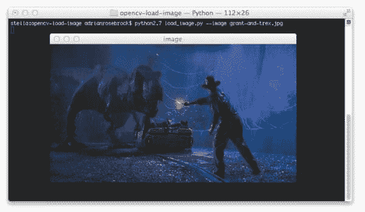
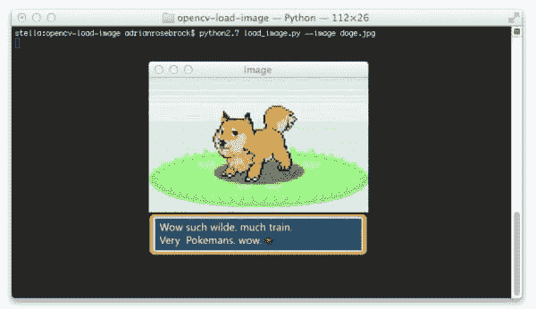
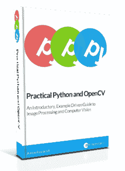

# 如何:OpenCV 加载图像

> 原文：<https://pyimagesearch.com/2014/06/02/opencv-load-image/>

[](https://pyimagesearch.com/wp-content/uploads/2014/05/opencv-load-grant.jpg)

几个月前，我在讲授一个关于计算机视觉基础的在线研讨会。

你知道我最常被问到的问题是什么吗？

> 如何使用 OpenCV 加载图像并显示在我的屏幕上？

这是一个非常基本的概念，但我认为许多教师(包括我自己)很快跳过这个问题，并立即进入更高级的技术，如模糊，边缘检测和阈值处理。

在屏幕上显示图像是调试计算机视觉程序的一种简单方法，所以让我们花几分钟来回答这个问题。

# 如何:OpenCV 加载图像

这篇文章的目的是向您展示如何使用 OpenCV 从磁盘读取图像，在屏幕上显示图像，然后等待按键关闭窗口并终止脚本。

虽然简单地在屏幕上显示图像本身并不实用，但这是一项重要的技术，当你开发(更重要的是调试)自己的计算机视觉应用程序时，你会经常用到这项技术。

你看，在你的屏幕上显示一个图像很像你调试一个复杂程序时的一个`print`语句。

当谈到调试时，没有什么比几个恰当放置的`print`语句更能找出问题的来源。

计算机视觉也是如此。

打几个恰当的电话给`cv2.imshow`会很快帮助你解决问题。

所以，让我们直接跳到一些代码中:

```py
import argparse
import cv2

ap = argparse.ArgumentParser()
ap.add_argument("-i", "--image", required = True, help = "Path to the image")
args = vars(ap.parse_args())

image = cv2.imread(args["image"])

cv2.imshow("image", image)
cv2.waitKey(0)

```

**第 1-2 行**处理导入我们将需要的包— `argparse`解析命令行参数和`cv2`OpenCV 绑定。

然后，在**的第 4-6 行**我们解析我们的命令行参数。我们只需要一个开关`--image`，它是我们的映像驻留在磁盘上的路径。

使用 OpenCV 加载图像是通过调用`cv2.imread`函数在**第 8 行**完成的。这个函数接受一个参数，即图像在磁盘上驻留的路径，该路径作为命令行参数提供。

最后，我们可以在屏幕的第 10-11 行显示我们的图像。

将图像显示到我们的屏幕是由`cv2.imshow`功能处理的。`cv2.imshow`的第一个参数是一个包含窗口名称的字符串。该文本将出现在窗口的标题栏中。第二个参数是我们在**第 8 行**从磁盘加载的图像。

在我们调用了`cv2.imshow`函数之后，我们需要等待使用**第 11 行**上的`cv2.waitKey`函数的按键。

非常重要的是我们要调用这个函数， ***否则我们的窗口会自动关闭！***

看，`cv2.waitKey`函数暂停 Python 脚本的执行，并等待按键。如果我们移除**第 11 行**，那么包含我们图像的窗口将自动关闭。通过调用`cv2.waitKey`，我们能够暂停脚本的执行，从而在屏幕上显示我们的图像，直到我们按下键盘上的任何键。

唯一的参数`cv2.waitKey`是一个整数，它是以毫秒为单位的延迟。如果这个值是正数，那么在经过指定的毫秒数后，窗口将自动关闭。如果毫秒数为零，那么函数将无限期等待，直到按下一个键。

`cv2.waitKey`的返回值或者是被按下的键的代码，或者是`-1`，表示在所提供的毫秒数过去之前没有按下任何键。

我们可以通过发出以下命令来执行我们的脚本:

```py
$ python load_image.py --image doge.jpg

```

然后，您应该会在屏幕上看到一个图像:

[](https://pyimagesearch.com/wp-content/uploads/2014/05/opencv-load-doge.jpg)

**Figure 1:** Loading an image using OpenCV and displaying it to our screen.

明明出现了一只野总督！我已经没有扑克牌了…

按下键盘上的任意键将会取消暂停脚本并关闭窗口。

# 摘要

在这篇博文中，我回答了我最常被问到的一个问题:*“我如何使用 OpenCV 加载图像并在我的屏幕上显示它？”*

为了从磁盘上加载一个图像并使用 OpenCV 显示它，首先需要调用`cv2.imread`函数，将图像的路径作为唯一的参数传入。

然后，调用`cv2.imshow`将在屏幕上显示您的图像。

但是一定要使用`cv2.waitKey`等待按键，否则`cv2.imshow`创建的窗口将自动关闭。

# 在一个周末学习计算机视觉的基础知识

[](https://pyimagesearch.com/practical-python-opencv/)

如果你有兴趣学习计算机视觉的基础知识，但不知道从哪里开始，你绝对应该看看我的新电子书， [*实用 Python 和 OpenCV*](https://pyimagesearch.com/practical-python-opencv/) 。

在这本书里，我涵盖了计算机视觉和图像处理的基础…我可以在一个周末教你！

我知道，这听起来好得难以置信。

但是我向你保证，这本书是你学习计算机视觉基础的快速入门指南。读完这本书后，你将很快成为一名 OpenCV 大师！

所以如果你想学习 OpenCV 的基础知识，[一定要看看我的书](https://pyimagesearch.com/practical-python-opencv/)。你不会失望的。