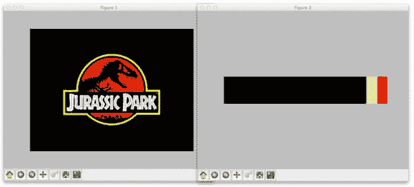
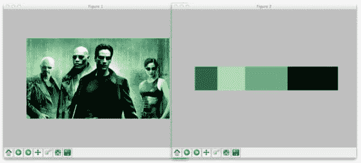
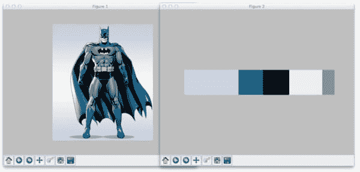

# OpenCV 和 Python K-Means 颜色聚类

> 原文：<https://pyimagesearch.com/2014/05/26/opencv-python-k-means-color-clustering/>

[](https://pyimagesearch.com/wp-content/uploads/2014/05/jp.png)

花点时间看看上面的*侏罗纪公园*电影海报。

*主色*有哪些？(即图像中表现最多的颜色)

嗯，我们看到背景大部分是黑色的。霸王龙周围有一些红色的**。实际标志周围还有一些黄色的**。****

 ****对于人类来说，分辨这些颜色非常简单。

但是，如果我们想创建一个算法来自动提取这些颜色呢？

你可能认为颜色直方图是你最好的选择…

但是实际上我们可以应用一种更有趣的算法——k-means 聚类。

在这篇博文中，我将向你展示如何使用 OpenCV、Python 和 [k-means 聚类算法](http://en.wikipedia.org/wiki/K-means_clustering)来寻找图像中最主要的颜色。

**OpenCV 和 Python 版本:**
这个例子将运行在 **Python 2.7/Python 3.4+** 和 **OpenCV 2.4.X/OpenCV 3.0+** 上。

# k 均值聚类

那么 k-means 到底是什么？

K-means 是一种[聚类算法](http://en.wikipedia.org/wiki/Cluster_analysis)。

目标是将 *n* 个数据点划分成 *k* 个集群。每个 *n* 个数据点将被分配到一个具有最近平均值的聚类中。每个聚类的平均值称为其“质心”或“中心”。

总的来说，应用 k-means 产生了原始的 *n* 个数据点的 *k* 个独立的聚类。特定聚类内的数据点被认为比属于其他聚类的数据点彼此“更相似”。

在我们的例子中，我们将对 RGB 图像的像素强度进行聚类。给定一个 *MxN* 大小的图像，我们因此有 *MxN* 个像素，每个像素由三个分量组成:分别是红色、绿色和蓝色。

我们将把这些 *MxN* 像素视为我们的数据点，并使用 k-means 对它们进行聚类。

属于给定聚类的像素在颜色上比属于单独聚类的像素更相似。

k-means 的一个注意事项是，我们需要提前 指定我们想要生成的 ***类的数量。有算法可以自动选择 *k* 的最优值，但是这些算法不在本帖讨论范围之内。***

# OpenCV 和 Python K-Means 颜色聚类

好了，让我们动手使用 OpenCV、Python 和 k-means 对像素强度进行聚类:

```py
# import the necessary packages
from sklearn.cluster import KMeans
import matplotlib.pyplot as plt
import argparse
import utils
import cv2

# construct the argument parser and parse the arguments
ap = argparse.ArgumentParser()
ap.add_argument("-i", "--image", required = True, help = "Path to the image")
ap.add_argument("-c", "--clusters", required = True, type = int,
	help = "# of clusters")
args = vars(ap.parse_args())

# load the image and convert it from BGR to RGB so that
# we can dispaly it with matplotlib
image = cv2.imread(args["image"])
image = cv2.cvtColor(image, cv2.COLOR_BGR2RGB)

# show our image
plt.figure()
plt.axis("off")
plt.imshow(image)

```

**第 2-6 行**处理导入我们需要的包。我们将使用 k-means 的 [scikit-learn 实现来使我们的生活变得更容易——可以说，不需要重新实现轮子。我们还将使用`matplotlib`来显示我们的图像和大多数主色。为了解析命令行参数，我们将使用`argparse`。`utils`包包含两个助手函数，我将在后面讨论。最后，`cv2`包包含了我们对 OpenCV 库的 Python 绑定。](http://scikit-learn.org/stable/modules/generated/sklearn.cluster.KMeans.html)

**第 9-13 行**解析我们的命令行参数。我们只需要两个参数:`--image`，它是我们的映像驻留在磁盘上的路径，以及`--clusters`，我们希望生成的集群的数量。

**第 17-18 行**我们从磁盘上下载图像，然后将其从 BGR 转换到 RGB 色彩空间。记住，OpenCV 将图像表示为多维 NumPy 数组。但是，这些图像是以 BGR 顺序而不是 RGB 顺序存储的。为了补救这一点，我们简单地使用了`cv2.cvtColor`函数。

最后，我们使用第 21-23 行上的`matplotlib`在屏幕上显示我们的图像。

正如我在这篇文章前面提到的，我们的目标是从 *n* 个数据点中生成 *k* 个聚类。我们将把我们的 *MxN* 图像作为我们的数据点。

为了做到这一点，我们需要将我们的图像重塑为一系列像素，而不是像素的矩阵:

```py
# reshape the image to be a list of pixels
image = image.reshape((image.shape[0] * image.shape[1], 3))

```

这段代码应该是不言自明的。我们只是简单地将 NumPy 数组改造成一个 RGB 像素列表。

## 这 2 行代码:

既然已经准备好了数据点，我们可以使用 k-means 来编写这些 **2 行代码**以找到图像中最主要的颜色:

```py
# cluster the pixel intensities
clt = KMeans(n_clusters = args["clusters"])
clt.fit(image)

```

我们使用 k-means 的 [scikit-learn 实现来避免重新实现算法。OpenCV 中还内置了一个 k-means，但是如果您以前在 Python 中做过任何类型的机器学习(或者如果您曾经打算这样做)，我建议使用 scikit-learn 包。](http://scikit-learn.org/stable/modules/generated/sklearn.cluster.KMeans.html)

我们在第 29 行的**上实例化`KMeans`，提供我们希望生成的集群数量。对第 30 行**的`fit()`方法的调用**聚集了我们的像素列表。**

这就是使用 Python 和 k-means 对我们的 RGB 像素进行聚类的全部内容。

[](https://pyimagesearch.com/practical-python-opencv/?src=in-post-kmeans-color-clustering)

Scikit-learn 为我们打理一切。

然而，为了显示图像中最主要的颜色，我们需要定义两个辅助函数。

让我们打开一个新文件`utils.py`，并定义`centroid_histogram`函数:

```py
# import the necessary packages
import numpy as np
import cv2

def centroid_histogram(clt):
	# grab the number of different clusters and create a histogram
	# based on the number of pixels assigned to each cluster
	numLabels = np.arange(0, len(np.unique(clt.labels_)) + 1)
	(hist, _) = np.histogram(clt.labels_, bins = numLabels)

	# normalize the histogram, such that it sums to one
	hist = hist.astype("float")
	hist /= hist.sum()

	# return the histogram
	return hist

```

如您所见，这个方法只有一个参数`clt`。这是我们在`color_kmeans.py`中创建的 k-means 聚类对象。

k-means 算法将图像中的每个像素分配到最近的聚类中。我们在第 8 行的**处获取聚类数，然后在第 9** 行的**处创建分配给每个聚类的像素数直方图。**

最后，我们归一化直方图，使其总和为 1，并在第 12-16 行将它返回给调用者。

本质上， ***这个函数所做的就是计算属于每个簇的像素数量。***

现在是我们的第二个助手函数，`plot_colors`:

```py
def plot_colors(hist, centroids):
	# initialize the bar chart representing the relative frequency
	# of each of the colors
	bar = np.zeros((50, 300, 3), dtype = "uint8")
	startX = 0

	# loop over the percentage of each cluster and the color of
	# each cluster
	for (percent, color) in zip(hist, centroids):
		# plot the relative percentage of each cluster
		endX = startX + (percent * 300)
		cv2.rectangle(bar, (int(startX), 0), (int(endX), 50),
			color.astype("uint8").tolist(), -1)
		startX = endX

	# return the bar chart
	return bar

```

`plot_colors`函数需要两个参数:`hist`，它是从`centroid_histogram function`生成的直方图，以及`centroids`，它是由 k-means 算法生成的质心(聚类中心)列表。

在第 21 行的**上，我们定义了一个 *300×50* 像素矩形来保存图像中最主要的颜色。**

我们开始在第 26 行的**上循环颜色和百分比贡献，然后在第 29** 行的**上绘制当前颜色对图像的贡献百分比。然后我们将颜色百分比条返回给第 34 行**的**调用者。**

同样，这个函数执行一个非常简单的任务——基于`centroid_histogram`函数的输出生成一个图形，显示有多少像素被分配给每个聚类。

现在我们已经定义了两个助手函数，我们可以把所有东西粘在一起了:

```py
# build a histogram of clusters and then create a figure
# representing the number of pixels labeled to each color
hist = utils.centroid_histogram(clt)
bar = utils.plot_colors(hist, clt.cluster_centers_)

# show our color bart
plt.figure()
plt.axis("off")
plt.imshow(bar)
plt.show()

```

在**第 34 行**上，我们计算分配给每个簇的像素数量。然后在**第 35 行**上，我们生成一个图形，这个图形可视化了分配给每个簇的像素数。

**第 38-41 行**然后显示我们的图形。

要执行我们的脚本，发出以下命令:

```py
$ python color_kmeans.py --image images/jp.png --clusters 3

```

如果一切顺利，您应该会看到类似下面的内容:

[](https://pyimagesearch.com/wp-content/uploads/2014/05/jurassic-park-colors.jpg)

**Figure 1:** Using Python, OpenCV, and k-means to find the most dominant colors in our image.

这里您可以看到我们的脚本生成了三个集群(因为我们在命令行参数中指定了三个集群)。最主要的颜色是黑色、黄色和红色，这三种颜色在《侏罗纪公园》电影海报中都有大量出现。

让我们把这个应用到*矩阵*的截屏上:

[](https://pyimagesearch.com/wp-content/uploads/2014/05/the-matrix-colors.jpg)

**Figure 2:** Finding the four most dominant colors using k-means in our *The Matrix* image.

这次我们告诉 k-means 生成四个聚类。正如你所看到的，黑色和各种色调的绿色是图像中最主要的颜色。

最后，让我们为这个蝙蝠侠图像生成五个颜色集群:

[](https://pyimagesearch.com/wp-content/uploads/2014/05/batman-colors.jpg)

**Figure 3:** Applying OpenCV and k-means clustering to find the five most dominant colors in a RGB image.

所以你有它。

使用 OpenCV、Python 和 k-means 对 RGB 像素强度进行聚类，以找到图像中最主要的颜色，这实际上非常简单。Scikit-learn 为我们处理所有繁重的工作。这篇文章中的大部分代码是用来把所有的部分粘在一起的。

# 摘要

在这篇博文中，我向您展示了如何使用 OpenCV、Python 和 k-means 来查找图像中最主要的颜色。

K-means 是一种聚类算法，根据 *n* 个数据点生成 *k* 个聚类。集群的数量 *k* 必须提前指定。虽然有算法可以找到 k 的最优值，但是它们超出了这篇博文的范围。

为了找到图像中最主要的颜色，我们将像素作为数据点，然后应用 k-means 对它们进行聚类。

我们使用 k-means 的 [scikit-learn 实现来避免必须重新实现它。](http://scikit-learn.org/stable/modules/generated/sklearn.cluster.KMeans.html)

我鼓励你将 k-means 聚类应用于我们自己的图像。一般来说，您会发现集群数量越少( *k < = 5* )会得到最好的结果。****