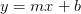

# OpenCV 调整图像大小(cv2.resize)

> 原文：<https://pyimagesearch.com/2021/01/20/opencv-resize-image-cv2-resize/>

在本教程中，您将学习如何使用 OpenCV 和`cv2.resize`函数来调整图像的大小。

缩放，或简称为*调整大小*，是根据宽度和高度增加或减少图像大小的过程。

调整图像大小时，记住*纵横比*很重要，纵横比是图像的宽高比。忽略宽高比会导致调整后的图像看起来被压缩和扭曲:

在左边的*，*我们有我们的原始图像。在右边的*，*我们有两幅图像由于没有保持长宽比而失真了。它们已经通过忽略图像的宽高比而被调整了大小。

一般来说，在调整大小时，您会希望保持图像的纵横比，尤其是当这些图像作为输出呈现给用户时。不过，例外确实适用。当我们探索机器学习/深度学习技术时，我们会发现我们的内部算法经常忽略图像的长宽比；但是一旦我们理解了计算机视觉的基本原理。

我们还需要记住调整大小函数的*插值*方法。插值的正式定义是:

> *在一组离散的已知数据点范围内构造新数据点的方法。*
> 
> [— Interpolation, *Wikipedia*](https://en.wikipedia.org/wiki/Interpolation)

在这种情况下，“已知点”是我们原始图像的像素。插值函数的目的是获取这些像素的邻域，并使用它们来增大或减小图像的大小。

一般来说，减小图像的尺寸更有益(也更具视觉吸引力)。这是因为插值函数只需从图像中移除像素。另一方面，如果我们要增加图像的大小，插值函数将不得不“填充”先前不存在的像素之间的间隙。

例如，看看**图 2** 中的图像:

左边的*是我们的原始图像。在*中间，*我们已经将图像的大小调整到一半——除了图像被调整大小，图像的“质量”没有任何损失然而，在右边的*，*我们已经大幅增加了图像尺寸。它现在看起来“像素化”和“放大”*

正如我上面提到的，你通常会减少图片的尺寸，而不是增加图片的尺寸(当然也有例外)。通过减小图像尺寸，我们可以处理更少的像素(更不用说要处理更少的“噪声”)，从而实现更快、更准确的图像处理算法。

请记住，虽然高分辨率图像对人眼具有视觉吸引力，但它们会损害计算机视觉和图像处理管道:

*   根据定义，图像越大，数据就越多，因此算法处理数据的时间就越长
*   高分辨率图像非常详细——但是从计算机视觉/图像处理的角度来看，我们对图像的结构成分更感兴趣，而不是超级精细的细节
*   大分辨率图像几乎总是被向下采样，以帮助图像处理系统运行得更快、更准确

在本教程结束时，您将了解如何使用 OpenCV 调整图像大小。

**要学习如何使用 OpenCV 和`cv2.resize`方法调整图像大小，*继续阅读。***

## **OpenCV 调整图像大小(cv2.resize )**

在本教程的第一部分，我们将配置我们的开发环境，并回顾我们的项目目录结构。

然后我会给你看:

1.  使用 OpenCV 和`cv2.resize`调整图像大小的基础知识(不考虑纵横比)
2.  如何使用`imutils.resize`调整图像大小(支持宽高比)
3.  OpenCV 中可供您使用的插值方法(当您需要对图像进行下采样或上采样时非常有用)

### **配置您的开发环境**

要遵循这个指南，您需要在您的系统上安装 OpenCV 库。

幸运的是，OpenCV 可以通过 pip 安装:

```py
$ pip install opencv-contrib-python
```

**如果你需要帮助为 OpenCV 配置开发环境，我*强烈推荐*阅读我的** [***pip 安装 OpenCV* 指南**](https://pyimagesearch.com/2018/09/19/pip-install-opencv/)——它将在几分钟内让你启动并运行。

### **在配置开发环境时遇到了问题？**

说了这么多，你是:

*   时间紧迫？
*   了解你雇主的行政锁定系统？
*   想要跳过与命令行、包管理器和虚拟环境斗争的麻烦吗？
*   **准备好在您的 Windows、macOS 或 Linux 系统上运行代码*****？***

 *那今天就加入 [PyImageSearch 加](https://pyimagesearch.com/pyimagesearch-plus/)吧！

**获得本教程的 Jupyter 笔记本和其他 PyImageSearch 指南，这些指南已经过*预配置*，可以在您的网络浏览器中运行在 Google Colab 的生态系统上！**无需安装。

最棒的是，这些 Jupyter 笔记本可以在 Windows、macOS 和 Linux 上运行！

### **项目结构**

使用 OpenCV 的`cv2.resize`函数调整图像大小相对简单，但是在查看任何代码之前，让我们首先查看一下我们的项目目录结构。

首先访问本教程的 ***“下载”*** 部分，检索源代码和示例图像。

从这里开始，项目文件夹应该如下所示:

```py
$ tree . --dirsfirst
.
├── adrian.png
└── opencv_resize.py

0 directories, 2 files
```

我们的`opencv_resize.py`文件将加载输入的`adrian.png`图像，然后执行几个调整大小的操作，从而演示如何使用 OpenCV 的`cv2.resize`函数来调整图像的大小。

### **用 OpenCV 实现基本的图像大小调整**

到目前为止，在这个系列中，我们已经讨论了两种图像转换:平移和旋转。现在，我们将探索如何调整图像的大小。

也许，毫不奇怪，我们使用`cv2.resize`函数来调整图像的大小。正如我上面提到的，当使用这个函数时，我们需要记住图像的长宽比。

但是在我们深入细节之前，让我们先来看一个例子:

```py
# import the necessary packages
import argparse
import imutils
import cv2

# construct the argument parser and parse the arguments
ap = argparse.ArgumentParser()
ap.add_argument("-i", "--image", type=str, default="adrian.png",
	help="path to the input image")
args = vars(ap.parse_args())
```

我们从第 2-4 行开始，导入我们需要的 Python 包。

**第 7-10 行**解析我们的命令行参数。我们只需要一个参数`--image`，我们想要调整大小的输入图像的路径。

现在让我们从磁盘加载这个图像:

```py
# load the original input image and display it on our screen
image = cv2.imread(args["image"])
cv2.imshow("Original", image)

# let's resize our image to be 150 pixels wide, but in order to
# prevent our resized image from being skewed/distorted, we must
# first calculate the ratio of the *new* width to the *old* width
r = 150.0 / image.shape[1]
dim = (150, int(image.shape[0] * r))

# perform the actual resizing of the image
resized = cv2.resize(image, dim, interpolation=cv2.INTER_AREA)
cv2.imshow("Resized (Width)", resized)
```

**第 13 行和第 14 行**从磁盘加载我们的输入`image`并显示在我们的屏幕上:

当调整图像大小时，我们需要记住图像的长宽比。纵横比是图像的宽度和高度的比例关系:

`aspect_ratio = image_width / image_height`

如果我们不注意长宽比，我们的调整大小将返回看起来扭曲的结果(见**图 1** )。

计算调整后的比率在**第 19 行**处理。在这行代码中，我们将新的图像宽度定义为 150 像素。为了计算新高度与旧高度的比率，我们简单地将比率`r`定义为新宽度(150 像素)除以旧宽度，我们使用`image.shape[1]`访问旧宽度。

现在我们有了我们的比率，我们可以在第 20 行计算图像的新尺寸。同样，新图像的宽度将是 150 像素。然后通过将旧的高度乘以我们的比率并将其转换为整数来计算高度。通过执行此操作，我们保留了图像的原始纵横比。

图像的实际尺寸调整发生在第 23 行**上。第一个参数是我们希望调整大小的图像，第二个参数是我们为新图像计算的尺寸。最后一个参数是我们的插值方法，这是在幕后处理我们如何调整实际图像大小的算法。我们将在本教程的后面讨论 OpenCV 提供的各种插值方法。**

最后，我们在第 24 行的**处显示了调整后的图像:**

在我们研究的例子中，我们只通过指定宽度来调整图像的大小。但是如果我们想通过设置高度来调整图像的大小呢？所需要的只是改变用于保持纵横比的调整大小比率的计算:

```py
# let's resize the image to have a height of 50 pixels, again keeping
# in mind the aspect ratio
r = 50.0 / image.shape[0]
dim = (int(image.shape[1] * r), 50)

# perform the resizing
resized = cv2.resize(image, dim, interpolation=cv2.INTER_AREA)
cv2.imshow("Resized (Height)", resized)
cv2.waitKey(0)
```

在**第 28 行，**我们重新定义了我们的比率，`r`。我们的新图像将有 50 像素的高度。为了确定新高度与旧高度的比值，我们用旧高度除以 50。

然后，我们定义新图像的尺寸。我们已经知道新图像的高度为 50 像素。新的宽度是通过将旧的宽度乘以比率获得的，这允许我们保持图像的原始纵横比。

然后，我们对第 32 行的**图像进行实际的尺寸调整，并在第 33** 行的**图像上显示:**

在这里，我们可以看到，我们已经调整了原始图像的宽度和高度，同时保持了纵横比。如果我们不保持长宽比，我们的图像会看起来失真，如图 1 所示。

调整图像大小非常简单，但是必须计算纵横比、定义新图像的尺寸，然后执行调整大小需要三行代码。这三行代码虽然看起来不多，但会使我们的代码变得非常冗长和混乱。

相反，我们可以使用`imutils.resize`函数，它自动为我们处理计算和维护纵横比:

```py
# calculating the ratio each and every time we want to resize an
# image is a real pain, so let's use the imutils convenience
# function which will *automatically* maintain our aspect ratio
# for us
resized = imutils.resize(image, width=100)
cv2.imshow("Resized via imutils", resized)
cv2.waitKey(0)
```

在这个例子中，你可以看到一个单一的函数处理图像大小:`imutils.resize`。

我们传入的第一个参数是我们想要调整大小的`image`。然后，我们指定关键字参数`width`，这是我们新图像的目标宽度。然后，该函数为我们处理大小调整:

当然，我们也可以通过改变函数调用来调整图像的高度:

```py
resized = imutils.resize(image, height=75)
```

其结果可以在**图 8** 中看到:

请注意，调整后的输出图像现在比原始图像小了很多，但纵横比仍然保持不变。

### **比较 OpenCV 插补方法**

到目前为止，我们只使用了`cv2.INTER_AREA`方法进行插值。正如我在本文开头提到的，插值函数的目标是检查像素的邻域，并使用这些邻域在不引入失真(或至少尽可能少的失真)的情况下以光学方式增大或减小图像的大小。

第一种方法是最近邻插值法，由`cv2.INTER_NEAREST`标志指定。这种方法是最简单的插值方法。该方法不是计算相邻像素的加权平均值或应用复杂的规则，而是简单地找到“最近的”相邻像素并假定亮度值。虽然这种方法快速简单，但调整大小后的图像质量往往相对较差，并可能导致“块状”伪像。

其次，我们有`cv2.INTER_LINEAR`方法，它执行双线性插值——这是 OpenCV 在调整图像大小时默认使用的方法。双线性插值背后的一般思想可以在任何小学数学教科书中找到—斜率截距形式:



很明显，我有点概括了。不过，要点是我们做的不仅仅是简单地找到“最近的”像素并假设其值(就像最近邻插值法)。我们现在取邻近的像素，并使用这个邻域来*计算*插值(而不是仅仅假设最近的像素值)。

第三，我们有`cv2.INTER_AREA`插值方法。对这种方法如何工作进行全面回顾超出了本教程的范围。尽管如此，我还是建议您阅读[这篇文章](https://medium.com/@wenrudong/what-is-opencvs-inter-area-actually-doing-282a626a09b3)，它提供了这种方法的一般系数规则的高级概述。

最后，我们还有`cv2.INTER_CUBIC`和`cv2.INTER_LANCZOS4`。

这些方法较慢(因为它们不再使用简单的线性插值，而是使用样条)，并且在正方形像素邻域上使用双三次插值。

`cv2.INTER_CUBIC`方法对一个 *4 x 4* 像素邻居和一个 *8 x 8* 像素邻居上的`cv2.INTER_LANCZOS4`进行操作。一般来说，我很少看到实践中使用的`cv2.INTER_LANCZOS4`方法。

现在我们已经讨论了 OpenCV 提供的插值方法，让我们编写一些代码来测试它们:

```py
# construct the list of interpolation methods in OpenCV
methods = [
	("cv2.INTER_NEAREST", cv2.INTER_NEAREST),
	("cv2.INTER_LINEAR", cv2.INTER_LINEAR),
	("cv2.INTER_AREA", cv2.INTER_AREA),
	("cv2.INTER_CUBIC", cv2.INTER_CUBIC),
	("cv2.INTER_LANCZOS4", cv2.INTER_LANCZOS4)]

# loop over the interpolation methods
for (name, method) in methods:
	# increase the size of the image by 3x using the current
	# interpolation method
	print("[INFO] {}".format(name))
	resized = imutils.resize(image, width=image.shape[1] * 3,
		inter=method)
	cv2.imshow("Method: {}".format(name), resized)
	cv2.waitKey(0)
```

我们首先在第 45-50 行定义我们的插值方法列表。

从那里，我们循环每个插值方法，并在第 57 行和第 58 行调整图像大小(上采样，使其比原始图像大 3 倍)。

然后调整结果显示在我们屏幕的第 60 行**。**

让我们来看看最近邻插值的输出:

注意图 9 中的**在调整大小后的图像中有“块状”伪像。**

从这里，我们可以看看双线性插值:

请注意，块状伪像消失了，图像看起来更加平滑。

接下来，面积插值:

块状文物又回来了。据我所知，`cv2.INTER_AREA`的表现与`cv2.INTER_NEAREST`非常相似。

然后我们继续双三次插值:

双三次插值进一步消除了块状伪像。

最后是`cv2.LANCOSZ4`方法，看起来与双三次方法非常相似:

***注:*** *我会在本文后面讨论你应该在自己的项目中使用哪些插值方法。*

### **OpenCV 图像大小调整结果**

要使用 OpenCV 调整图像大小，请务必访问本教程的 ***“下载”*** 部分，以检索源代码和示例图像。

我们已经在前面的章节中回顾了我们的`opencv_resize.py`脚本的结果，但是如果您想通过您的终端执行这个脚本，只需使用下面的命令:

```py
$ python opencv_resize.py 
[INFO] cv2.INTER_NEAREST
[INFO] cv2.INTER_LINEAR
[INFO] cv2.INTER_AREA
[INFO] cv2.INTER_CUBIC
[INFO] cv2.INTER_LANCZOS4
```

您的 OpenCV 调整结果应该与我在前面章节中的结果相匹配。

### **应该使用哪种 OpenCV 插值方法？**

既然我们已经回顾了如何使用 OpenCV 调整图像的大小，您可能想知道:

> 使用 OpenCV 调整图像大小时，我应该使用什么插值方法？

一般来说，`cv2.INTER_NEAREST`非常快，但不能提供最高质量的结果。因此，在*非常*资源受限的环境中，考虑使用最近邻插值法。否则，你可能不会经常使用这种插值方法(尤其是当你试图增加图像尺寸时)。

当增加(上采样)图像尺寸时，考虑使用`cv2.INTER_LINEAR`和`cv2.INTER_CUBIC`。`cv2.INTER_LINEAR`方法往往比`cv2.INTER_CUBIC`方法稍快，但无论哪种方法都能为您的图像提供最佳效果。

当减小(下采样)图像尺寸时，OpenCV 文档建议使用`cv2.INTER_AREA`。同样，您也可以使用`cv2.INTER_NEAREST`进行缩减采样，但是`cv2.INTER_AREA`通常会产生更美观的结果。

**最后，作为一般规则，`cv2.INTER_LINEAR`插值方法被推荐为上采样或下采样的默认方法——它只是以适中的计算成本提供最高质量的结果。**

## **总结**

在本教程中，您学习了如何使用 OpenCV 和`cv2.resize`函数调整图像大小。

调整图像大小时，请务必记住:

1.  图像的宽高比，这样调整后的图像看起来不会失真
2.  用于执行调整大小的插值方法(参见上文标题为*“比较 OpenCV 插值方法”*的章节，帮助您决定应该使用哪种插值方法)

一般来说，你会发现`cv2.INTER_LINEAR`是你的插值方法的一个很好的默认选择。

最后，重要的是要注意，如果你关心图像质量，从*大的*图像到*小的*图像几乎总是更可取的。增加图像的尺寸通常会引入伪像并降低其质量。

如果你发现自己的算法在低分辨率图像上表现不佳，你可以使用[超分辨率算法](https://pyimagesearch.com/2020/11/09/opencv-super-resolution-with-deep-learning/)来增加图像大小。考虑升级你用来拍摄照片的相机，而不是让低质量的图像在你的算法中工作。

**要下载这篇文章的源代码(并在未来教程在 PyImageSearch 上发布时得到通知)，*只需在下面的表格中输入您的电子邮件地址！****