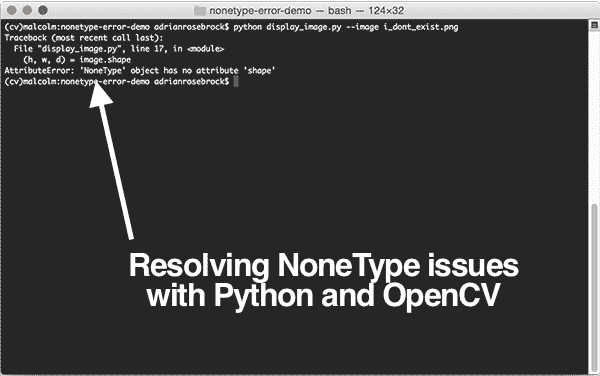
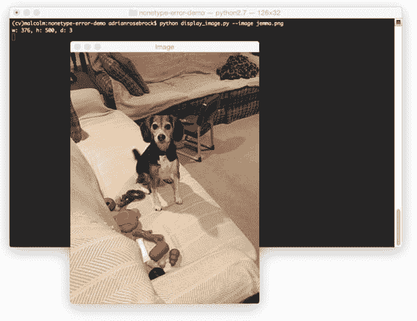

# OpenCV:解决非类型错误

> 原文：<https://pyimagesearch.com/2016/12/26/opencv-resolving-nonetype-errors/>



每周我都会收到并回复至少 2-3 封电子邮件和 3-4 篇关于 OpenCV 和 Python 中`NoneType`错误的博文评论。

对于初学者来说，这些错误可能很难诊断——从定义上来说，它们提供的信息并不多。

由于这个问题被问得如此频繁，我决定写一整篇博文来讨论这个话题。

虽然导致`NoneType`错误的原因几乎是无限的，但根据我作为一名计算机视觉开发人员的经验，以及在 PyImageSearch 上与其他程序员聊天的经验，在超过 95%的情况下，OpenCV 中的`NoneType`错误是由以下原因之一造成的:

1.  传递给`cv2.imread`的图像路径无效。
2.  通过`cv2.VideoCapture`和相关的`.read`方法从视频流/视频文件中读取帧时出现问题。

**要了解更多关于 OpenCV 中的`NoneType`错误(以及如何避免这些错误)，*只需继续阅读*。**

## OpenCV:解决非类型错误

在这篇博文的第一部分，我将详细讨论 Python 编程语言中的*什么是* `NoneType`错误。

然后我将讨论在一起使用 OpenCV 和 Python 时会遇到`NoneType`错误的两个主要原因。

最后，我将把一个*实际例子*放在一起，这个例子不仅*导致*一个`NoneType`错误，而且*也解决了*错误。

### 什么是非类型错误？

使用 Python 编程语言时，您不可避免地会遇到类似这样的错误:

```py
AttributeError: 'NoneType' object has no attribute ‘something’

```

其中`something`可以用实际属性的名称来代替。

当我们*认为*我们正在处理一个特定类或对象的实例时，我们会看到这些错误，但实际上我们有 [Python 内置类型](https://docs.python.org/2/library/types.html#types.NoneType) `None`。

顾名思义，`None`代表一个值的*缺失*，比如函数调用返回意外结果或者完全失败。

下面是一个从 Python shell 生成`NoneType`错误的例子:

```py
>>> foo = None
>>> foo.bar = True
Traceback (most recent call last):
  File "<stdin>", line 1, in <module>
AttributeError: 'NoneType' object has no attribute 'bar'
>>>

```

这里我创建了一个名为`foo`的变量，并将其设置为`None`。

然后我尝试将`foo`的`bar`属性设置为`True`，但是由于`foo`是一个`NoneType`对象，Python 不允许这样做——因此出现了错误消息。

### 95%的 OpenCV NoneType 错误有两个原因

当使用 OpenCV 和 Python 绑定时，您一定会在某些时候遇到`NoneType`错误。

根据我的经验， ***超过 95%的时间*** 这些`NoneType`错误可以追溯到`cv2.imread`或`cv2.VideoCapture`的问题。

我在下面提供了每个案例的详细信息。

#### 案例 1: cv2.imread

如果您收到一个`NoneType`错误*并且*您的代码正在调用`cv2.imread`，那么错误的可能原因是提供给`cv2.imread`的 ***无效文件路径*** 。

如果您给了函数一个无效的文件路径(例如，一个不存在的文件的路径),`cv2.imread`函数不会显式抛出错误消息。相反，`cv2.imread`将简单地返回`None`。

任何时候你试图通过`cv2.imread`访问从磁盘加载的`None`图像的属性，你都会得到一个`NoneType`错误。

下面是一个尝试从磁盘加载不存在的映像的示例:

```py
$ python
>>> import cv2
>>> path = "path/to/image/that/does/not/exist.png"
>>> image = cv2.imread(path)
>>> print(image.shape)
Traceback (most recent call last):
  File "<stdin>", line 1, in <module>
AttributeError: 'NoneType' object has no attribute 'shape'

```

如您所见，`cv2.imread`欣然接受了图像路径(尽管它并不存在)，意识到图像路径无效，并返回`None`。对于那些习惯了抛出异常的这类函数的 Python 程序员来说，这尤其令人困惑。

作为额外的奖励，我还会提到`AssertionFailed`异常。

如果您试图将一个无效的图像(例如，`NoneType`图像)传递给*另一个 OpenCV 函数*，Python + OpenCV 会抱怨图像没有任何宽度、高度或深度信息——这怎么可能，毕竟“图像”是一个`None`对象！

下面是一个错误消息的例子，当从磁盘加载一个不存在的映像，然后立即调用 OpenCV 函数时，您可能会看到这个错误消息:

```py
>>> import cv2
>>> path = "path/to/image/that/does/not/exist.png"
>>> image = cv2.imread(path)
>>> gray = cv2.cvtColor(image, cv2.COLOR_BGR2GRAY)
OpenCV Error: Assertion failed (scn == 3 || scn == 4) in cvtColor, file /tmp/opencv20150906-42178-3d0iam/opencv-2.4.12/modules/imgproc/src/color.cpp, line 3739
Traceback (most recent call last):
  File "<stdin>", line 1, in <module>
cv2.error: /tmp/opencv20150906-42178-3d0iam/opencv-2.4.12/modules/imgproc/src/color.cpp:3739: error: (-215) scn == 3 || scn == 4 in function cvtColor

>>>

```

这些类型的错误可能更难调试，因为有*多种*原因导致`AssertionError`可能被抛出。但是在大多数情况下，您的第一步应该是确保您的映像是从磁盘正确加载的。

使用`cv2.imread`可能会遇到的最后一个更罕见的问题是，您的映像*确实存在于磁盘上的*，但是您没有使用安装的给定映像 I/O 库来编译 OpenCV。

例如，假设您在磁盘上有一个. JPEG 文件，并且您*知道*您有指向它的正确路径。

然后你尝试通过`cv2.imread`加载 JPEG 文件，并注意到一个`NoneType`或`AssertionError`。

怎么会这样呢？

文件存在！

在这种情况下，您可能忘记了在启用 JPEG 文件支持的情况下编译 OpenCV。

在 Debian/Ubuntu 系统中，这是由于没有安装`libjpeg`造成的。

对于 macOS 系统，您可能忘记了通过自制软件安装`jpeg`库。

要解决这个问题，不管是什么操作系统，您都需要重新编译和安装 OpenCV。有关如何在您的特定系统上编译和安装 OpenCV 的更多详细信息，请参见本页。

#### 案例二:cv2。视频采集和。阅读

就像我们在使用`cv2.imread`时会看到`NoneType`错误和`AssertionError`异常一样，在处理视频流/视频文件时也会看到这些错误。

为了访问一个视频流，OpenCV 使用了`cv2.VideoCapture`，它接受一个参数:

1.  一个 ***字符串*** 表示磁盘上视频文件的路径。
2.  一个 ***整数*** 代表你电脑上网络摄像头的*指数*。

使用 OpenCV 处理视频流和视频文件比简单地通过`cv2.imread`加载图像更复杂，但同样的规则也适用。

如果你试图调用一个实例化的`cv2.VideoCapture`的`.read`方法(不管它是视频文件还是网络摄像头流)并注意到一个`NoneType`错误或`AssertionError`，那么你可能会遇到以下问题:

1.  输入视频文件的路径(可能不正确)。
2.  没有安装正确的视频编解码器，在这种情况下，您需要安装编解码器，然后重新编译和重新安装 OpenCV(参见[本页](https://pyimagesearch.com/opencv-tutorials-resources-guides/)获取完整的教程列表)。
3.  您的网络摄像头无法通过 OpenCV 访问。这可能有很多原因，包括缺少驱动程序、传递给`cv2.VideoCapture`的索引不正确，或者只是您的网络摄像头没有正确连接到您的系统。

同样，处理视频文件比处理简单的图像文件更复杂，所以要确保你在解决这个问题时*系统化*。

首先，尝试通过 OpenCV 之外的另一个软件访问你的网络摄像头。

或者，尝试在电影播放器中加载您的视频文件。

如果这两种方法都有效，那么您的 OpenCV 安装可能有问题。

否则，很可能是编解码器或驱动程序问题。

### 创建和解决 OpenCV NoneType 错误的示例

为了演示动作中的`NoneType`错误，我决定创建一个高度简化的*Python+OpenCV 脚本，代表你可能在 PyImageSearch 博客上看到的内容。*

 *打开一个新文件，将其命名为`display_image.py`，并插入以下代码:

```py
# import the necessary packages
import argparse
import cv2

# construct the argument parse and parse the arguments
ap = argparse.ArgumentParser()
ap.add_argument("-i", "--image", required=True,
	help="path to the image file")
args = vars(ap.parse_args())

# load the image from disk and display the width, height,
# and depth
image = cv2.imread(args["image"])
(h, w, d) = image.shape
print("w: {}, h: {}, d: {}".format(w, h, d))

# show the image
cv2.imshow("Image", image)
cv2.waitKey(0)

```

这个脚本所做的就是:

*   解析命令行参数。
*   (尝试)从磁盘加载图像。
*   将图像的宽度、高度和深度打印到终端。
*   将图像显示到我们的屏幕上。

对于大多数熟悉命令行的*Python 开发者来说，这个脚本不会给你带来任何麻烦。*

但是如果你是命令行新手，对命令行参数不熟悉/不舒服，如果不小心的话，你很容易*遇到`NoneType`错误。*

 *你可能会说，怎么做？

答案在于没有正确使用/理解命令行参数。

在运行这个博客的过去几年里，我已经看到*许多来自读者的*电子邮件和博客帖子评论，他们试图修改`.add_argument`函数来提供他们图像文件的路径。

**不要这样做——你不必改变一个*单行*的参数解析代码。**

相反，你*应该*做的是花接下来的 10 分钟通读这篇精彩的文章，这篇文章解释了*什么是*命令行参数以及*如何在 Python 中使用它们:*

[https://pyimagesearch . com/2018/03/12/python-arg parse-command-line-arguments/](https://pyimagesearch.com/2018/03/12/python-argparse-command-line-arguments/)

如果你想在 PyImageSearch 博客上学习教程，这是*的必读材料*。

使用命令行，因此命令行参数，是成为一名计算机科学家的一个重要部分— ***缺乏命令行技能只会伤害你**。你以后会感谢我的。*

回到示例，让我们检查我的本地目录的内容:

```py
$ ls -l
total 800
-rw-r--r--  1 adrianrosebrock  staff     541 Dec 21 08:45 display_image.py
-rw-r--r--  1 adrianrosebrock  staff  403494 Dec 21 08:45 jemma.png

```

如我们所见，我有两个文件:

1.  我即将执行的 Python 脚本。
2.  我将从磁盘上加载的照片。

如果我执行以下命令，我将看到屏幕上显示的`jemma.png`图像，以及图像尺寸的信息:

```py
$ python display_image.py --image jemma.png
w: 376, h: 500, d: 3

```



**Figure 1:** Loading and displaying an image to my screen with OpenCV and Python.

然而，让我们试着加载一个*不存在*的图像路径:

```py
$ python display_image.py --image i_dont_exist.png
Traceback (most recent call last):
  File "display_image.py", line 17, in <module>
    (h, w, d) = image.shape
AttributeError: 'NoneType' object has no attribute 'shape'

```

果然有我们的`NoneType`错误。

在这种情况下，这是因为我没有向`cv2.imread`提供有效的图像路径。

## 摘要

在这篇博文中，我讨论了 OpenCV 和 Python 中的`NoneType`错误和`AssertionError`异常。

在绝大多数情况下，这些错误可以归因于`cv2.imread`或`cv2.VideoCapture`方法。

每当您遇到这些错误之一， ***确保您可以在继续之前加载您的图像/读取您的帧*** 。在超过 95%的情况下，你的图像/框架没有被正确地阅读。

否则，如果您正在使用命令行参数并且不熟悉它们，就有可能您没有正确使用它们。在这种情况下，一定要通过阅读这篇关于命令行参数的教程来自学——你以后会感谢我的。

无论如何，我希望这篇教程对你的 OpenCV 精通之旅有所帮助！

如果你刚刚开始学习计算机视觉和 OpenCV，我强烈建议你看看我的书， *[实用 Python 和 OpenCV](https://pyimagesearch.com/practical-python-opencv/)* ，这将帮助你掌握基本原理。

否则，请确保在下面的表格中输入您的电子邮件地址，以便在将来发布博客帖子和教程时得到通知！**