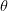
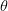
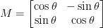
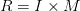
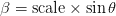
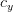

# OpenCV 旋转图像

> 原文：<https://pyimagesearch.com/2021/01/20/opencv-rotate-image/>

在本教程中，您将学习如何使用 OpenCV 旋转图像。此外，我还将向您展示如何使用来自 [imutils 库](https://github.com/jrosebr1/imutils)、`imutils.rotate`和`imutils.rotate_bound`的两个便利函数来旋转图像，这使得使用 OpenCV 旋转图像更容易(并且需要更少的代码)。

之前，我们学习了如何[平移(即移动)图像](https://pyimagesearch.com/2021/02/03/opencv-image-translation/)，向上、向下、向左和向右(或任何组合)。我们现在进入下一个图像处理主题——旋转。

旋转就像它听起来的那样:将图像旋转某个角度，

. We’ll use to represent how many degrees (*not* radians) we are rotating an image.

我还将向您展示一些使用 OpenCV 更容易旋转图像的技术。

**要学习如何用 OpenCV 旋转图像，*继续阅读。***

## **OpenCV 旋转图像**

在本教程的第一部分，我们将讨论 OpenCV 如何旋转图像以及可用于旋转的函数。

从那里，我们将配置我们的开发环境，并审查我们的项目目录结构。

然后，我将向您展示使用 OpenCV 旋转图像的三种方法:

1.  **使用`cv2.rotate`函数:**内置于 OpenCV 中，但需要构造一个旋转矩阵并显式应用仿射扭曲，这使得代码更加冗长。
2.  **使用`imutils.rotate`功能:**我的 [imutils 库](https://github.com/jrosebr1/imutils)的一部分。使得在单个函数调用中使用 OpenCV 旋转图像成为可能。
3.  **使用`imutils.rotate_bound`函数:**也是我的 imutils 库的一部分。确保图像的任何部分都不会在旋转过程中被切掉。

我们将通过查看 OpenCV 旋转结果来结束本教程。

### **OpenCV 如何旋转图像？**

类似于[平移](https://pyimagesearch.com/2021/02/03/opencv-image-translation/)，也许并不奇怪，旋转一个角度

can be defined by constructing a matrix, *M*, in the form:



给定一个 *(x，y)*-笛卡尔平面，这个矩阵可以用来旋转一个矢量

degrees (counterclockwise) about the origin. In this case, the origin is normally the *center* of the image; however, in practice, we can define any arbitrary *(x, y)*-coordinate as our rotation center.

从原始图像中， *I* ，然后通过简单的矩阵乘法得到旋转后的图像， *R，*:

然而，OpenCV 还提供了(1)缩放(即调整大小)图像和(2)提供围绕其执行旋转的任意旋转中心的能力。

因此，我们修改后的旋转矩阵 M 为:

 \times c_{x} - \beta \times c_{y} \\-\beta & \alpha & \beta \times c_{x} + (1 - \alpha) \times c_{y}\end{bmatrix}")

其中

and and and are the respective *(x, y)*-coordinates around which the rotation is performed.

如果数学开始变得有点难以理解，不要担心——我们将跳转到一些代码中，使这些概念更加清晰。

### **配置您的开发环境**

要遵循这个指南，您需要在您的系统上安装 OpenCV 库。

幸运的是，OpenCV 可以通过 pip 安装:

```py
$ pip install opencv-contrib-python
```

**如果你需要帮助为 OpenCV 配置开发环境，我*强烈推荐*阅读我的** [***pip 安装 OpenCV* 指南**](https://pyimagesearch.com/2018/09/19/pip-install-opencv/)——它将在几分钟内让你启动并运行。

### **在配置开发环境时遇到了问题？**

话虽如此，你是:

*   时间紧迫？
*   了解你雇主的行政锁定系统？
*   想要跳过与命令行、包管理器和虚拟环境斗争的麻烦吗？
*   **准备好在您的 Windows、macOS 或 Linux 系统上运行代码*****？***

 *那今天就加入 [PyImageSearch 加](https://pyimagesearch.com/pyimagesearch-plus/)吧！

**获得本教程的 Jupyter 笔记本和其他 PyImageSearch 指南，这些指南已经过*预配置*，可以在您的网络浏览器中运行在 Google Colab 的生态系统上！**无需安装。

最棒的是，这些 Jupyter 笔记本可以在 Windows、macOS 和 Linux 上运行！

### **项目结构**

在我们使用 OpenCV 实现旋转之前，让我们先回顾一下我们的项目目录结构。

请确保您访问了本教程的 ***“下载”*** 部分，以检索源代码和示例图像，并从那里窥视一下内部:

```py
$ tree . --dirsfirst
.
├── opencv_logo.png
└── opencv_rotate.py

0 directories, 2 files
```

这里，我们有`opencv_rotate.py`。该脚本将加载`opencv_logo.png`(或者您选择的任何其他图像)，然后对其应用一系列旋转，从而演示如何使用 OpenCV 执行旋转。

### **用 OpenCV 实现图像旋转**

我们现在准备用 OpenCV 实现图像旋转。

打开项目目录结构中的`opencv_rotate.py`文件，插入以下代码:

```py
# import the necessary packages
import argparse
import imutils
import cv2

# construct the argument parser and parse the arguments
ap = argparse.ArgumentParser()
ap.add_argument("-i", "--image", type=str, default="opencv_logo.png",
	help="path to the input image")
args = vars(ap.parse_args())
```

**第 2-4 行**导入我们需要的 Python 包。我们将使用`argparse`作为命令行参数，使用 [imutils](https://github.com/jrosebr1/imutils) 作为我的 OpenCV 便利函数集(即`imutils.rotate`和`imutils.rotate_bound`方法)，使用`cv2`作为 OpenCV 绑定。

我们只有一个命令行参数，`--image`，它是我们想要旋转的输入图像的路径(默认为`opencv_logo.png`)。

接下来，让我们从磁盘加载我们的输入图像，并做一些基本的调整大小:

```py
# load the image and show it
image = cv2.imread(args["image"])
cv2.imshow("Original", image)

# grab the dimensions of the image and calculate the center of the
# image
(h, w) = image.shape[:2]
(cX, cY) = (w // 2, h // 2)

# rotate our image by 45 degrees around the center of the image
M = cv2.getRotationMatrix2D((cX, cY), 45, 1.0)
rotated = cv2.warpAffine(image, M, (w, h))
cv2.imshow("Rotated by 45 Degrees", rotated)

# rotate our image by -90 degrees around the image
M = cv2.getRotationMatrix2D((cX, cY), -90, 1.0)
rotated = cv2.warpAffine(image, M, (w, h))
cv2.imshow("Rotated by -90 Degrees", rotated)
```

我们首先加载输入图像并将其显示在屏幕上:

当我们旋转一幅图像时，我们需要指定要围绕哪个点旋转。在大多数情况下，你会希望围绕图像的*中心*旋转；然而，OpenCV 允许你指定*任何你想要旋转的任意点*(如上所述)。

让我们继续，围绕图像的中心旋转。**第 18 行和第 19 行**抓取图像的宽度和高度，然后将每个分量除以`2`来确定图像的中心。

就像我们定义一个矩阵来平移图像，我们也定义一个矩阵来旋转图像。我们不用使用 NumPy 手工构建矩阵(这可能有点乏味)，我们只需调用第 22 行**上的`cv2.getRotationMatrix2D`方法。**

`cv2.getRotationMatrix2D`函数有三个参数。第一个参数是我们旋转图像的点(在这种情况下，图像的中心`cX`和`cY`)。

然后我们指定，我们将旋转图像的(逆时针)度数。在这种情况下，我们将图像旋转 45 度。

最后一个论点是图像的比例。我们还没有讨论调整图像的大小，但是在这里你可以指定一个浮点值，其中 *1.0* 表示使用图像的原始尺寸。但是，如果您指定的值为 *2.0* ，图像大小会翻倍，同样的，值为 *0.5* 图像大小会减半。

一旦我们从`cv2.getRotationMatrix2D`函数中得到旋转矩阵`M`，我们就可以使用`cv2.warpAffine`方法在**第 23 行**将旋转应用于我们的图像。

这个函数的第一个参数是我们想要旋转的`image`。然后我们指定我们的旋转矩阵`M`和图像的输出尺寸(宽度和高度)。**第 24 行**显示我们的图像旋转了 45 度:

**第 27-29 行**做同样的事情，但是这次围绕中心`cX`和`cY`坐标旋转图像`-90`度(顺时针)。

***注:*** *记住，在 OpenCV 中，* ***正度数表示逆时针旋转*** *而* ***负度数表示顺时针旋转*** *。* *牢记这一点；否则，您可能会在对自己的图像应用旋转时感到困惑！*

**图 4** 显示了这些调整大小操作的输出:

如你所见，我们的图像被旋转了。**花点时间注意 OpenCV *不会*自动为我们整个旋转后的图像分配空间以适合框架**。

这是有意的行为！如果您希望整个图像在旋转后适合视图，您需要修改宽度和高度，在`cv2.warpAffine`函数中表示为`(w, h)`。正如我们将在后面的脚本中看到的，`imutils.rotate_bound`函数会为我们处理所有的事情。

到目前为止，我们只围绕图像的*中心*旋转了图像。但是如果我们想围绕某个*任意点旋转图像呢？*

让我们来看看这是如何实现的:

```py
# rotate our image around an arbitrary point rather than the center
M = cv2.getRotationMatrix2D((10, 10), 45, 1.0)
rotated = cv2.warpAffine(image, M, (w, h))
cv2.imshow("Rotated by Arbitrary Point", rotated)
```

到目前为止，这段代码看起来应该相当标准，可以执行一次旋转。但是，请注意`cv2.getRotationMatrix2D`函数的第一个参数。这里，我们指出我们想要围绕 *x = 10* 、 *y = 10* ，或者大约图像左上角的*旋转图像。*

 *当我们应用这种旋转时，我们的输出图像如下所示:

我们可以看到旋转的中心不再是图像的中心。

然而，就像翻译一幅图像一样，调用`cv2.getRotationMatrix2D`和`cv2.warpAffine`会变得非常乏味——更不用说它还会使我们的代码变得更加冗长。

让我们通过调用`imutils.rotate`来减少需要编写的代码量，这是一个方便的函数，它包装了对`cv2.getRotationMatrix2D`和`cv2.warpAffine`的调用:

```py
# use our imutils function to rotate an image 180 degrees
rotated = imutils.rotate(image, 180)
cv2.imshow("Rotated by 180 Degrees", rotated)
```

在这里，我们将图像旋转了 180 度，但是我们可以通过使用`rotate`方法使我们的代码不那么冗长。

**图 6** 显示了我们旋转的输出:

正如您在前面的示例中看到的，如果图像的一部分在旋转过程中被剪切掉，OpenCV 不会分配足够的空间来存储整个图像。

解决方法是使用`imutils.rotate_bound`函数:

```py
# rotate our image by 33 degrees counterclockwise, ensuring the
# entire rotated image still renders within the viewing area
rotated = imutils.rotate_bound(image, -33)
cv2.imshow("Rotated Without Cropping", rotated)
cv2.waitKey(0)
```

该功能将*自动*扩展图像阵列，使*整个*旋转图像适合它。

应用`rotate_bound`功能的结果可以在**图 7** 中看到，这里我们逆时针旋转图像 33 度:

这就是全部了！

***注:****`imutils.rotate_bound`函数反转正/负值与顺时针/逆时针旋转的关系。这里，负值将逆时针旋转，而正值将顺时针旋转。*

使用 OpenCV 应用图像旋转时，有三种选择:

1.  `cv2.getRotationMatrix2D`和`cv2.warpAffine`
2.  `imutils.rotate`
3.  `imutils.rotate_bound`

您可以根据自己的应用需求混合搭配它们。

### **OpenCV 图像旋转结果**

要使用 OpenCV 旋转图像，请务必访问本教程的 ***“下载”*** 部分，以检索源代码和示例图像。

我们已经在上一节中回顾了该脚本的结果，但是当您准备自己运行该脚本时，可以使用以下命令:

```py
$ python opencv_rotate.py
```

您的 OpenCV 旋转结果应该与我在上一节中的结果相匹配。

## **总结**

在本教程中，您学习了如何使用 OpenCV 旋转图像。要使用 OpenCV 将图像旋转任意角度，我们需要:

1.  使用`cv2.getRotationMatrix2D`函数构建 2D 旋转矩阵
2.  使用`cv2.warpAffine`函数执行仿射变形，提供我们的输入图像和计算的旋转矩阵`M`

结果是图像被旋转了

degrees.

使用 OpenCV 的函数旋转图像的问题是，它们需要*两行*代码——一行构建旋转矩阵，另一行执行变换。

为了让 OpenCV 的图像旋转更容易，我在我的 [imutils 库](https://github.com/jrosebr1/imutils)中实现了两个方法:

1.  `imutils.rotate`:在一行代码中执行 OpenCV 图像旋转。
2.  `imutils.rotate_bound`:也使用 OpenCV 执行图像旋转，但确保图像(旋转后)仍然可见，并且图像的任何部分都不会被剪切掉。

我建议您熟悉这三种旋转技术，因为在开发您自己的图像处理管道时，您可能会用到它们中的每一种。

**要下载这篇文章的源代码(并在未来教程在 PyImageSearch 上发布时得到通知)，*只需在下面的表格中输入您的电子邮件地址！*****