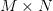
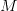
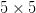
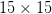
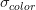
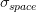
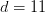
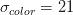
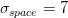

# OpenCV 平滑和模糊

> 原文：<https://pyimagesearch.com/2021/04/28/opencv-smoothing-and-blurring/>

在本教程中，您将学习如何使用 OpenCV 进行平滑和模糊处理。

我们将涵盖以下模糊操作

*   简单模糊(`cv2.blur`)
*   加权高斯模糊(`cv2.GaussianBlur`)
*   中值滤波(`cv2.medianBlur`)
*   双侧模糊(`cv2.bilateralFilter`)

在本教程结束时，你将能够自信地将 OpenCV 的模糊功能应用到你自己的图像中。

要学习如何用 OpenCV 执行平滑和模糊， ***继续阅读。***

## **OpenCV 平滑和模糊**

我很确定我们都知道模糊是什么。从视觉上来说，这就是当你的相机拍摄一张失焦的照片时会发生的情况。图像中较清晰的区域会丢失细节。这里的目标是使用低通滤波器来减少图像中的噪声和细节。

实际上，这意味着图像中的每个像素都与其周围的像素亮度混合在一起。这种邻域像素的“混合”成为我们的模糊像素。

虽然这种效果在我们的照片中通常是不需要的，但实际上在执行图像处理任务时，***非常有用。**其实平滑模糊是*计算机视觉和图像处理中最常见的预处理步骤*之一。*

 *例如，我们可以看到在 PyImageSearch 博客上构建[简单文档扫描仪](https://pyimagesearch.com/2014/09/01/build-kick-ass-mobile-document-scanner-just-5-minutes/)时应用了模糊。当测量从一个物体到我们的相机的[距离时，我们也应用平滑来帮助我们找到我们的标记。在这两个例子中，图像中较小的细节被平滑掉了，我们得到了图像更多的结构方面。](https://pyimagesearch.com/2015/01/19/find-distance-camera-objectmarker-using-python-opencv/)

正如我们将在这一系列教程中看到的，如果图像首先被平滑或模糊，许多图像处理和计算机视觉功能，如阈值处理和边缘检测，会表现得更好。

### **为什么平滑和模糊是如此重要的预处理操作？**

平滑和模糊是计算机视觉和图像处理中最重要的预处理步骤之一。通过在应用诸如[边缘检测](https://pyimagesearch.com/2021/05/12/opencv-edge-detection-cv2-canny/)或[阈值](https://pyimagesearch.com/2021/04/28/opencv-thresholding-cv2-threshold/)等技术之前平滑图像，我们能够减少高频内容的数量，例如噪声和边缘(即图像的“细节”)。

虽然这听起来可能有违直觉，但通过减少图像中的细节，我们可以更容易地找到我们感兴趣的对象。

此外，这使我们能够专注于图像中更大的结构对象。

在本课的剩余部分，我们将讨论您在自己的项目中经常使用的四个主要平滑和模糊选项:

*   简单平均模糊
*   高斯模糊
*   中值滤波
*   双边过滤

让我们开始吧。

### **配置您的开发环境**

要遵循这个指南，您需要在您的系统上安装 OpenCV 库。

幸运的是，OpenCV 可以通过 pip 安装:

```py
$ pip install opencv-contrib-python
```

**如果你需要帮助为 OpenCV 配置开发环境，我*强烈推荐*阅读我的** [***pip 安装 OpenCV* 指南**](https://pyimagesearch.com/2018/09/19/pip-install-opencv/)——它将在几分钟内让你启动并运行。

### **在配置开发环境时遇到了问题？**

说了这么多，你是:

*   时间紧迫？
*   了解你雇主的行政锁定系统？
*   想要跳过与命令行、包管理器和虚拟环境斗争的麻烦吗？
*   准备好在您的 Windows、macOS 或 Linux 系统上运行代码*了吗*？

那今天就加入 [PyImageSearch 大学](https://pyimagesearch.com/pyimagesearch-university/)吧！

**获得本教程的 Jupyter 笔记本和其他 PyImageSearch 指南，这些指南是** ***预先配置的*** **，可以在您的网络浏览器中运行在 Google Colab 的生态系统上！**无需安装。

最棒的是，这些 Jupyter 笔记本可以在 Windows、macOS 和 Linux 上运行！

### **项目结构**

在我们学习如何用 OpenCV 应用模糊之前，让我们先回顾一下我们的项目目录结构。

首先访问本教程的 ***“下载”*** 部分，检索源代码和示例图像:

```py
$ tree . --dirsfirst
.
├── adrian.png
├── bilateral.py
└── blurring.py

0 directories, 3 files
```

我们的第一个脚本，`blurring.py`，将向您展示如何使用 OpenCV 将平均模糊、高斯模糊和中值模糊应用于图像(`adrian.png`)。

第二个 Python 脚本`bilateral.py`，将演示如何使用 OpenCV 对我们的输入图像应用双边模糊。

### **平均模糊度(cv2.blur )**

我们要探索的第一个模糊方法是平均。

平均滤镜的功能与您想象的完全一样，即获取中心像素周围的像素区域，对所有这些像素进行平均，并用平均值替换中心像素。

通过取像素周围区域的平均值，我们对其进行平滑，并用其局部邻域的值替换它。这使我们能够简单地依靠平均值来减少噪声和细节层次。

还记得我们讨论过的[内核和卷积](https://pyimagesearch.com/2016/07/25/convolutions-with-opencv-and-python/)吗？事实证明，我们不仅可以将内核用于边缘检测和梯度，还可以用于平均！

为了完成我们的平均模糊，我们实际上会用一个来卷积我们的图像

normalized filter where both and are both **odd integers.**

对于输入图像中的每个像素，这个内核将从左到右、从上到下滑动。然后，位于内核中心的像素(因此我们必须使用奇数，否则就不会有真正的“中心”)被设置为周围所有其他像素的平均。

让我们继续定义一个

average kernel that can be used to blur the central pixel with a 3 pixel radius:

![K = \displaystyle\frac{1}{9} \left[\begin{tabular}{ccc}1 & 1 & 1\\   1 & 1 & 1\\   1 & 1 & 1\end{tabular}\right]](img/cb7594f7d266ce0ae4b423d4c4a2d460.png "K = \displaystyle\frac{1}{9} \left[\begin{tabular}{ccc}1 & 1 & 1\\   1 & 1 & 1\\   1 & 1 & 1\end{tabular}\right]")

注意内核矩阵的每一项是如何被*均匀加权的* — **我们给内核中的所有像素以相等的权重。**另一种方法是给像素不同的权重*，其中离中心像素越远的像素对平均值的贡献越小*；我们将在本课的**高斯模糊**部分讨论这种平滑方法。

我们也可以定义一个

average kernel:

![K = \displaystyle\frac{1}{25} \left[\begin{tabular}{ccccc}1 & 1 & 1 & 1 & 1\\ 1 & 1 & 1 & 1 & 1\\ 1 & 1 & 1 & 1 & 1\\ 1 & 1 & 1 & 1 & 1\\ 1 & 1 & 1 & 1 & 1\end{tabular}\right]](img/6bf4d2f1ab05656e4f88bda32f62ea3c.png "K = \displaystyle\frac{1}{25} \left[\begin{tabular}{ccccc}1 & 1 & 1 & 1 & 1\\ 1 & 1 & 1 & 1 & 1\\ 1 & 1 & 1 & 1 & 1\\ 1 & 1 & 1 & 1 & 1\\ 1 & 1 & 1 & 1 & 1\end{tabular}\right]")

这个内核考虑了更多的平均像素，并且会使图像比更加模糊

kernel since the kernel covers more area of the image.

因此，这给我们带来了一个重要的规则:**随着内核大小的增加，图像模糊的程度也会增加。**

简单地说:你的平滑内核越大，你的图像看起来就越模糊。

为了研究这个概念，让我们探索一些代码。打开项目目录结构中的`blurring.py`文件，让我们开始工作:

```py
# import the necessary packages
import argparse
import cv2

# construct the argument parser and parse the arguments
ap = argparse.ArgumentParser()
ap.add_argument("-i", "--image", type=str, default="adrian.png",
	help="path to input image")
args = vars(ap.parse_args())
```

**第 2 行和第 3 行**导入我们需要的包，而**第 6-9 行**解析我们的命令行参数。

我们只需要一个参数`--image`，它是我们希望对其应用平滑和模糊的磁盘上的输入图像的路径。默认情况下，我们将这个参数设置为`adrian.png`。

现在让我们从磁盘加载输入图像:

```py
# load the image, display it to our screen, and initialize a list of
# kernel sizes (so we can evaluate the relationship between kernel
# size and amount of blurring)
image = cv2.imread(args["image"])
cv2.imshow("Original", image)
kernelSizes = [(3, 3), (9, 9), (15, 15)]

# loop over the kernel sizes
for (kX, kY) in kernelSizes:
	# apply an "average" blur to the image using the current kernel
	# size
	blurred = cv2.blur(image, (kX, kY))
	cv2.imshow("Average ({}, {})".format(kX, kY), blurred)
	cv2.waitKey(0)
```

**第 14 行和第 15 行**从磁盘加载我们的输入`image`并显示到我们的屏幕上。

然后，我们在第 16 行的**上定义了一个`kernelSizes`列表——这些内核的大小逐渐增加，这样我们就可以直观地看到内核大小对输出图像的影响。**

从那里，我们开始在第 19 行的**上循环每个内核大小。**

为了平均模糊图像，我们使用`cv2.blur`函数。这个函数需要两个参数:我们想要模糊的图像和内核的大小。

正如第 22-24 行所示，我们通过增加内核大小来模糊我们的图像。我们的内核变得越大，我们的图像就越模糊。

当您运行该脚本时，您将在应用`cv2.blur`函数后收到以下输出:

在左上角的*上，我们有我们的原始输入图像。在右上角的*，我们用对其进行了模糊处理**

*kernel. The image is only slightly more blurred at this point, and the only noticeable area of the blur is around the facial region. However, by the time we get to a kernel size of and , the image becomes practically unrecognizable.

同样，随着内核大小的增加，你的图像会变得越来越模糊。这很容易导致图像中重要结构物体的边缘丢失。在开发自己的计算机视觉应用时，选择合适的平滑量是非常关键的。

虽然平均平滑很容易理解，但它也对内核区域内的每个像素进行了平均加权——这样做很容易使我们的图像过度模糊，并错过重要的边缘。我们可以通过应用高斯模糊来解决这个问题。

### **高斯模糊(cv2。高斯布鲁)**

接下来，我们将回顾高斯模糊。**高斯模糊**类似于平均模糊，但我们现在使用的不是简单的平均值，而是加权平均值，其中靠近中心像素的邻域像素对平均值的贡献更大。

顾名思义，高斯平滑用于去除近似遵循高斯分布的噪声。

最终结果是，我们的图像不那么模糊，但比使用上一节讨论的平均方法更“自然模糊”。此外，基于这种加权，与平均平滑相比，我们将能够在图像中保留更多的边缘。

就像平均模糊一样，高斯平滑也使用的内核

, where both and are odd integers.

然而，由于我们是根据像素与中心像素的距离来加权像素，所以我们需要一个等式来构造我们的内核。一个方向上的高斯函数的等式为:

 = \displaystyle\frac{1}{\displaystyle\sqrt{2\pi\sigma}}e^{-\frac{x^{2}}{2\sigma^{2}}}")

然后，将这个方程扩展到两个方向就变得很简单了，一个方向是 x 轴*，另一个方向是 y 轴*:**

 ** = \displaystyle\frac{1}{2\pi\sigma}e^{-\frac{x^{2} + y^{2}}{2\sigma^{2}}}")

其中

and are the respective distances to the horizontal and vertical center of the kernel and is the standard deviation of the Gaussian kernel.

同样，正如我们将在下面的代码中看到的，当我们的内核大小增加时，应用于输出图像的模糊量也会增加。然而，与简单的平均平滑相比，模糊会显得更加“自然”，并且会更好地保留图像中的边缘:

```py
# close all windows to cleanup the screen
cv2.destroyAllWindows()
cv2.imshow("Original", image)

# loop over the kernel sizes again
for (kX, kY) in kernelSizes:
	# apply a "Gaussian" blur to the image
	blurred = cv2.GaussianBlur(image, (kX, kY), 0)
	cv2.imshow("Gaussian ({}, {})".format(kX, kY), blurred)
	cv2.waitKey(0)
```

**第 27 行和第 28 行**简单地关闭所有打开的窗口，显示我们的原始图像作为参考点。

通过使用`cv2.GaussianBlur`功能，实际的高斯模糊发生在**线 31-35** 上。该函数的第一个参数是我们想要模糊的图像。然后，类似于`cv2.blur`，我们提供一个元组来表示我们的内核大小。同样，我们从一个小的内核大小开始

and start to increase it.

最后一个参数是我们的

, the standard deviation of the Gaussian distribution. By setting this value to `0`, we are instructing OpenCV to automatically compute based on our kernel size.

在大多数情况下，你会想让你的

be computed for you. But in the case you want to supply for yourself, I would suggest reading through the [OpenCV documentation](https://docs.opencv.org/2.4/modules/imgproc/doc/filtering.html#gaussianblur) on `cv2.GaussianBlur` to ensure you understand the implications.

我们可以在**图 3** 中看到高斯模糊的输出:

与使用图 2 中**的平均方法相比，我们的图像具有更少的模糊效果；然而，由于加权平均值的计算，模糊本身更自然，而不是允许核邻域中的所有像素具有相等的权重。**

总的来说，我倾向于建议从简单的高斯模糊开始，并根据需要调整参数。虽然高斯模糊比简单的平均模糊稍慢(只慢很小一部分)，但高斯模糊往往会产生更好的结果，尤其是在应用于自然图像时。

### **中值模糊(cv2.medianBlur )**

传统上，中值模糊方法在去除椒盐噪声时最为有效。这种类型的噪音听起来就是这样:想象一下拍一张照片，把它放在你的餐桌上，并在上面撒上盐和胡椒。使用中值模糊法，你可以去除图像中的盐和胡椒。

当应用中值模糊时，我们首先定义我们的内核大小。然后，如同在平均模糊方法中一样，我们考虑大小为的邻域中的所有像素

where is an odd integer.

请注意，与平均模糊和高斯模糊不同，它们的内核大小可以是矩形的，而中值的内核大小必须是 T2 的正方形。此外(与平均方法不同)，我们不是用邻域的平均值替换中心像素，而是用邻域的中值替换中心像素。

中值模糊在去除图像中的椒盐噪声方面更有效的原因是，每个中心像素总是被图像中存在的像素强度所替换。由于中位数对异常值是稳健的，因此与其他统计方法(如平均值)相比，椒盐噪声对中位数的影响较小。

同样，诸如平均和高斯计算方法或加权方法用于邻域-该平均像素强度可能存在或可能不存在于邻域中。但是根据定义，中值像素*必须*存在于我们的邻域中。通过用中值而不是平均值替换我们的中心像素，我们可以大大减少噪声。

让我们现在应用我们的中间模糊:

```py
# close all windows to cleanup the screen
cv2.destroyAllWindows()
cv2.imshow("Original", image)

# loop over the kernel sizes a final time
for k in (3, 9, 15):
	# apply a "median" blur to the image
	blurred = cv2.medianBlur(image, k)
	cv2.imshow("Median {}".format(k), blurred)
	cv2.waitKey(0)
```

应用中值模糊是通过调用`cv2.medianBlur`函数来完成的。这个方法有两个参数:我们想要模糊的图像和我们内核的大小。

在第 42 行的**处，我们开始遍历(正方形)内核大小。我们从内核大小`3`开始，然后增加到`9`和`15`。**

产生的中值模糊图像然后叠加并显示给我们，如图 4 所示:

请注意，我们不再像在平均和高斯模糊中那样创建“运动模糊”效果——相反，我们正在移除更多的细节和噪声。

例如，看看图片中我右边的岩石的颜色。随着我们内核大小的增加，岩石的细节和颜色变得不那么明显。当我们使用一个

kernel the rocks have lost almost all detail and look like a big “blob.”

对于图像中我的脸来说也是如此——随着内核大小的增加，我的脸迅速失去细节，实际上融合在一起。

中值模糊绝不是高斯平滑那样的“自然模糊”。然而，对于在非常不理想的条件下拍摄的受损图像或照片，在将图像传递给其他方法(如阈值处理和边缘检测)之前，中值模糊作为预处理步骤确实有所帮助。

### **双侧模糊(cv2 .双边过滤器)**

我们要探索的最后一种方法是**双边模糊。**

到目前为止，我们模糊方法的目的是减少图像中的噪声和细节；然而，作为一个副作用，我们往往会失去图像的边缘。

为了在保持边缘的同时减少噪声，我们可以使用双边模糊。双边模糊通过引入两个高斯分布来实现这一点。

第一个高斯函数只考虑空间邻居。也就是说，在")中出现在一起的像素

-coordinate space of the image. The second Gaussian then models the pixel intensity of the neighborhood, ensuring that only pixels with similar intensity are included in the actual computation of the blur.

直觉上，这是有道理的。如果相同(小)邻域中的像素具有相似的像素值，那么它们很可能表示相同的对象。但是，如果同一个邻域中的两个像素具有相反的值，那么我们可能会检查对象的边缘或边界，并且我们希望保留这个边缘。

总的来说，这种方法能够保留图像的边缘，同时还能减少噪声。这种方法最大的缺点是它比平均、高斯和中值模糊方法慢得多。

让我们深入研究一下双侧模糊的代码。打开项目目录结构中的`bilateral.py`文件，我们开始工作:

```py
# import the necessary packages
import argparse
import cv2

# construct the argument parser and parse the arguments
ap = argparse.ArgumentParser()
ap.add_argument("-i", "--image", type=str, default="adrian.png",
	help="path to input image")
args = vars(ap.parse_args())
```

**第 2 行和第 3 行**导入我们需要的 Python 包，而**第 6-9 行**解析我们的命令行参数。

同样，只需要一个参数`--image`，它是我们希望对其应用双边模糊的输入图像的路径。

现在让我们从磁盘加载我们的映像:

```py
# load the image, display it to our screen, and construct a list of
# bilateral filtering parameters that we are going to explore
image = cv2.imread(args["image"])
cv2.imshow("Original", image)
params = [(11, 21, 7), (11, 41, 21), (11, 61, 39)]

# loop over the diameter, sigma color, and sigma space
for (diameter, sigmaColor, sigmaSpace) in params:
	# apply bilateral filtering to the image using the current set of
	# parameters
	blurred = cv2.bilateralFilter(image, diameter, sigmaColor, sigmaSpace)

	# show the output image and associated parameters
	title = "Blurred d={}, sc={}, ss={}".format(
		diameter, sigmaColor, sigmaSpace)
	cv2.imshow(title, blurred)
	cv2.waitKey(0)
```

然后，我们在第 15 行的**上定义一个模糊参数列表。这些参数对应于直径，**

, and of the bilateral filter, respectively.

从那里，我们在**行 18** 上循环这些参数集，并通过调用**行 21** 上的`cv2.bilateralFilter`来应用双边过滤。

最后，**第 24-27 行**将我们模糊的图像显示到屏幕上。

让我们花点时间回顾一下我们提供给`cv2.bilateralFilter`的参数。我们提供的第一个参数是我们想要模糊的图像。然后，我们需要定义像素邻域的*直径*——直径越大，模糊计算中包含的像素就越多。把这个参数想象成一个方形的内核大小。

第三个参数是我们的颜色标准偏差，记为

. A larger value for means that more colors in the neighborhood will be considered when computing the blur. If we let get too large in respect to the diameter, then we essentially have broken the assumption of bilateral filtering — that only pixels of similar color should contribute significantly to the blur.

最后，我们需要提供空间标准偏差，我们称之为

. A larger value of means that pixels farther out from the central pixel diameter will influence the blurring calculation.

当您执行这个脚本时，您将看到双边过滤的以下输出:

在左上角的*上，我们有我们的原始输入图像。在右上角的*，我们从直径为开始**

*pixels, , and .

我们的模糊效果还没有完全显现出来，但是如果你放大岩石，并与我们的原始图像进行比较，你会注意到大部分纹理已经消失了！这些岩石看起来光滑多了，就好像它们被年复一年的流水侵蚀和磨平了一样。然而，湖泊和岩石之间的边缘和边界清晰地保留了下来。

现在，看看左下方，我们增加了两个

and jointly. At this point we can really see the effects of bilateral filtering.

我黑色连帽衫上的纽扣几乎消失了，我皮肤上几乎所有的细节和皱纹都被去除了。然而与此同时，在我和图像背景之间仍然有一个清晰的界限。如果我们使用平均或高斯模糊，背景将与前景融合。

最后，我们有右下角的*，我在这里增加了*

*and yet again, just to demonstrate how powerful of a technique bilateral filtering is.

现在几乎所有的岩石、水、天空以及我的皮肤和连帽衫的细节和纹理都消失了。它也开始看起来好像图像中的颜色数量已经减少。

同样，这是一个夸张的例子，你可能不会对图像应用这么多模糊，但它确实展示了双边滤波对你的边缘的影响:显著平滑的细节和纹理，同时仍然保留边界和边缘。

所以你有它——模糊技术概述！如果还不完全清楚何时使用每种模糊或平滑方法，那也没关系。在这一系列的教程中，我们将基本上建立在这些模糊技术的基础上，你将会看到很多关于何时应用每种类型的模糊的例子。目前，试着消化这些材料，把模糊和平滑作为你工具箱中的另一个工具。

### **OpenCV 虚化结果**

准备好运行平滑和模糊脚本了吗？

请务必访问本教程的 ***“下载”*** 部分，以检索源代码和示例图像。

然后，您可以通过执行`blurring.py`脚本来应用基本的平滑和模糊:

```py
$ python blurring.py
```

要查看双向模糊的输出，请运行以下命令:

```py
$ python bilateral.py
```

这些脚本的输出应该与我上面提供的图像和图形相匹配。

## **总结**

在本教程中，我们学习了如何使用 OpenCV 平滑和模糊图像。我们从讨论内核在平滑和模糊中的作用开始。

然后，我们回顾了在 OpenCV 中平滑图像的四种主要方法:

1.  简单平均模糊
2.  高斯模糊
3.  中值滤波
4.  双边过滤

简单平均法速度很快，但可能无法保留图像中的边缘。

应用高斯模糊可以更好地保留边缘，但比平均方法稍慢。

中值滤波器主要用于减少椒盐噪声，因为中值统计比平均值等其他统计方法更稳健，对异常值更不敏感。

最后，双边滤波器保留了边缘，但是*比其他方法*慢得多。双边滤波还拥有最多要调整的参数，要正确调整这些参数可能会很麻烦。

总的来说，我建议从简单的高斯模糊开始获得基线，然后从那里开始。

**要下载这篇文章的源代码(并在未来教程在 PyImageSearch 上发布时得到通知)，*只需在下面的表格中输入您的电子邮件地址！*********